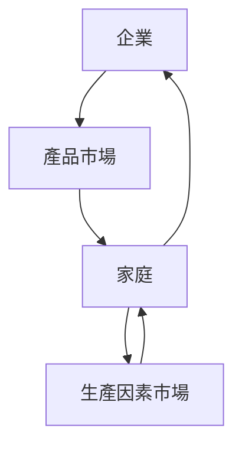
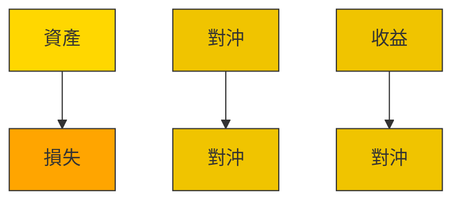
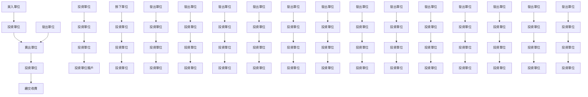
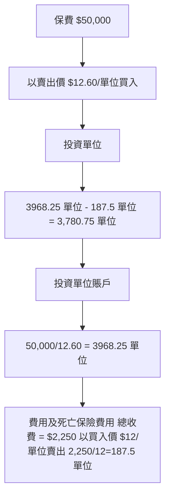
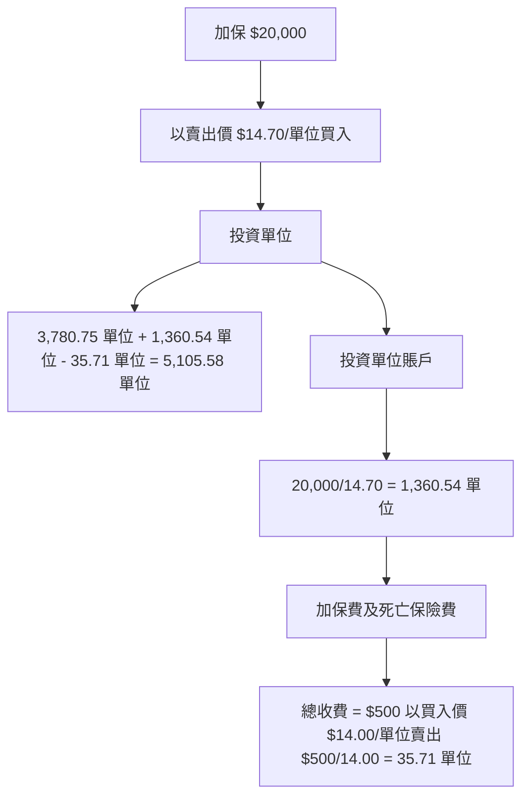
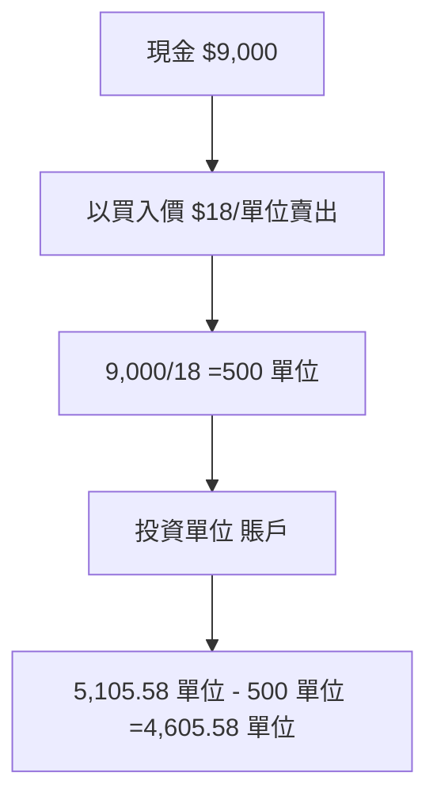
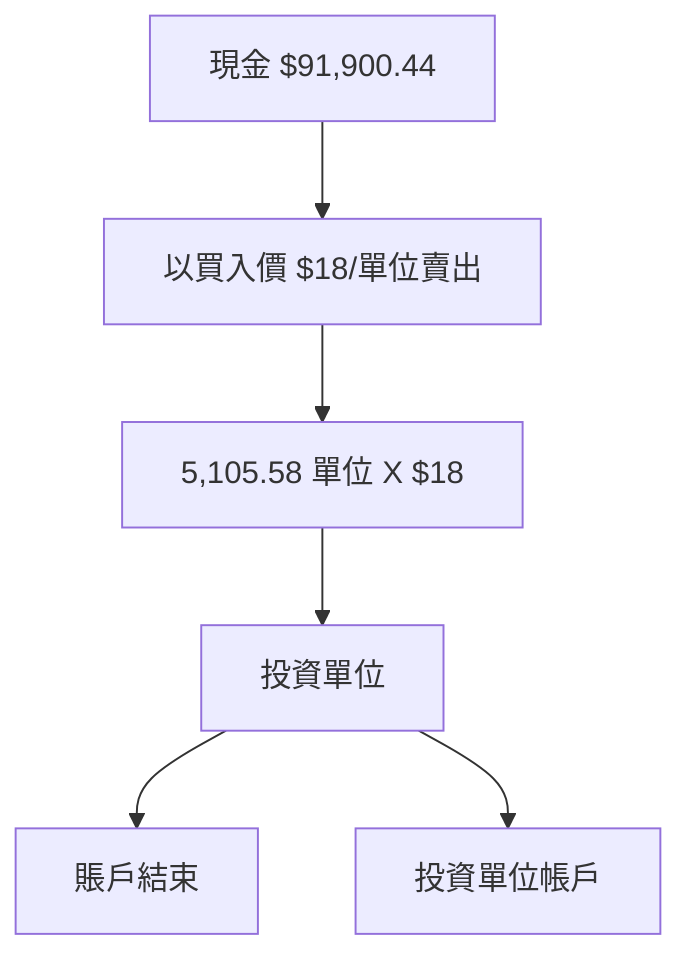
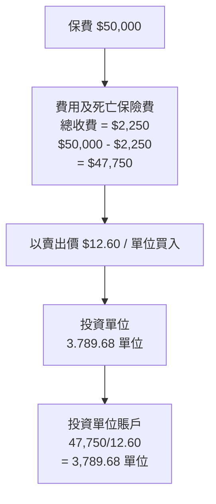
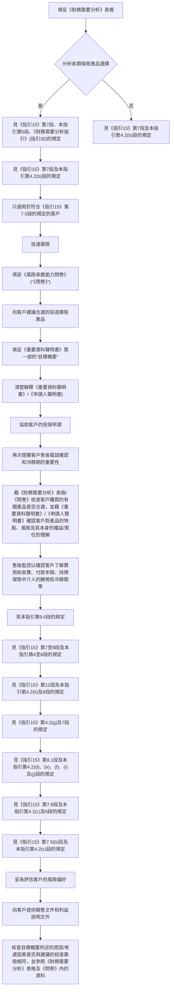
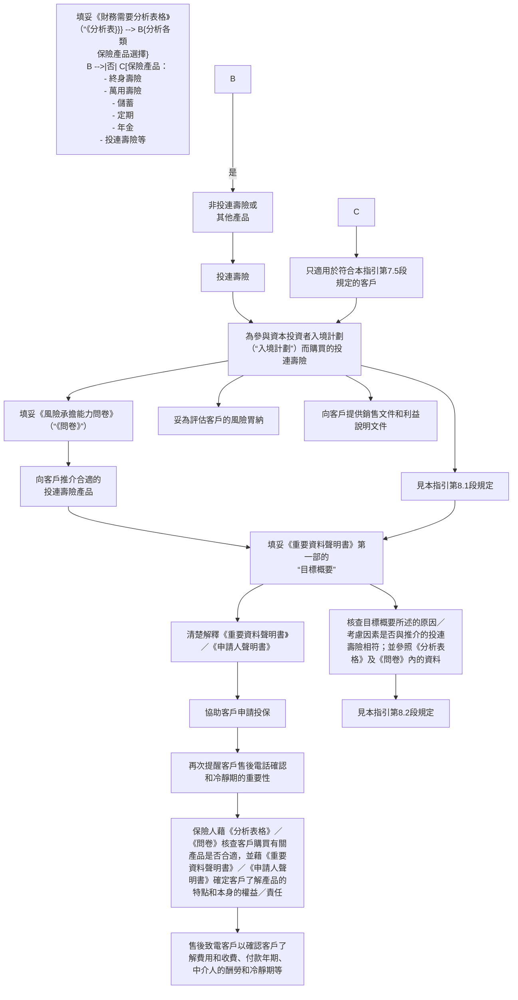

# 保險中介人資格考試

# 投資相連長期保險考試

研習資料手冊

2024 年版

# 序言

本研習資料手冊按照投資相連長期保險考試範圍編纂而成，該考試試題將按本研習資料手冊擬定。內文每章結尾部分另列有模擬試題供參考。

本研習資料手冊旨在初步介紹「投資相連長期保險」這個課題，藉此推行保險中介人素質保證計劃。因此，若你有意成為一位從事任何在《證券及期貨條例》下受規管活動的持牌人或具十足資格的保險從業員，本手冊或未能涵蓋所有有關課題。

編纂本研習資料手冊的目的，是為應考人士提供可靠的參考資料。雖然我們在編寫時已力求完備，但內文或仍有錯漏或不善之處。在必要時，請參閱有關法例或徵求專業意見。還望不吝賜正，待再版時得以訂正。

初版﹕ 2001 年 8 月

第二次版﹕ 2004 年 1 月

第三次版﹕ 2009 年 11 月（2011 年 9 月修訂，已加入早前發出的勘誤的內容）

第四次版﹕ 2013 年 11 月

第五次版﹕ 2015 年 8 月

第六次版﹕ 2017 年 8 月

第七次版﹕ 2024 年 11 月

© 保險業監管局 2001 年、2004 年、2009 年、2013 年、2015 年、2017 年、2024 年

未經保險業監管局許可，本研習資料手冊的任何部分均不得被翻印作出售或其他牟利之用。

# 目 錄

# 章次 頁次

# 1 . 投資相連長期保單簡介 1∕1

1.1 定義 1∕1

1.2 概念 1∕2

# 2 . 投資 2∕1

# 2.1 投資風險 2∕1

2.1.1 風險定義  
2.1.2 風險種類  
2.1.3 風險與回報之間的取捨  
2.1.4 減低風險的技巧   
2.1.5 風險管理流程  
2.1.6 香港財務風險管理

# 2.2 投資考慮因素 2∕13

2.2.1 基礎經濟學  
2.2.2 環球經濟  
2.2.3 影響金融市場的經濟因素  
2.2.4 投資目標與風險承受能力  
2.2.5 其他投資限制  
2.2.6 投資諮詢  
2.2.7 總結

# 3. 投資資產 3∕1

# 3.1 貨幣市場工具 3∕1

3.1.1 銀行存款  
3.1.2 可轉讓短期債務工具  
3.1.3 貨幣市場工具的利弊

# 3.2 債務證券

3∕3

3.2.1 債務證券投資

3.2.2 票面值

3.2.3 可換股權利

3.2.4 息票利率

3.2.5 期滿期限

3.2.6 債券定價

3.2.7 價格與收益率的關係

3.2.8 收益曲線

3.2.9 適銷性

3.2.10 債券評級

3.2.11 國際市場

3.2.12 債券投資的好處

3.2.13 債券投資的弊處

3.2.14 優先股

# 3.3 股票

3∕12

3.3.1 股票投資

3.3.2 股票融資的方法

3.3.3 投資股票的原因

3.3.4 紅股派送

3.3.5 股息

3.3.6 香港聯合交易所（「聯交所」）

3.3.7 國際市場

3.3.8 市場指數

3.3.9 基本因素投資分析

3.3.10 技術分析

3.3.11 投資股票的好處

3.3.12 投資股票的弊處

# 3.4 財務衍生工具

3∕26

3.4.1 財務衍生工具的用途

3.4.2 遠期及期貨合約

3.4.3 期權及認股權證

3.4.4 衍生工具的好處

3.4.5 衍生工具的弊處

# 3.5 地產

3∕31

3.5.1 地產投資的好處

3.5.2 地產投資的弊處

# 3.6 低變現能力的投資

3∕32

# 3.7 投資基金 3∕32

3.7.1 互惠基金及單位信託  
3.7.2 開放型基金及封閉型基金  
3.7.3 投資基金的收費與費用  
3.7.4 投資基金的好處  
3.7.5 投資基金的弊處  
3.7.6 投資基金各方的職責

# 3.8 壽險及年金 3∕43

3.8.1 壽險   
3.8.2 年金

# 4 . 投資相連長期保單 4∕1

4.1 歷史發展 4∕1  
4.2 投資相連長期保單的特點 4∕3   
4.3 投資相連長期保單的收費種類 4∕3

4.3.1 收費  
4.3.2 與投資相連保單有關的收費

4.4 投資相連長期保單種類 4∕6   
4.5 投資相連保單保費結構 4∕8

4.5.1 整付保費計劃   
4.5.2 定期繳費計劃

# 4.6 整付保費和定期繳費的投資相連保單及其死亡保險金的基本計算 4∕9

4.6.1 整付保費保單的基本計算  
4.6.2 保費應用方法一  
4.6.3 額外投資保費   
4.6.4 局部提取利益（局部退保）  
4.6.5 退保現金價值   
4.6.6 死亡保險金  
4.6.7 毛保費回報  
4.6.8 保費應用方法二  
4.6.9 定期繳費保單的基本計算  
4.6.10 每月繳交保費

4.7 投資相連基金的結構 4∕18  
4.8 投資相連基金種類 4∕19

4.8.1 存款基金  
4.8.2 單位化基金  
4.8.3 轉換

4.9 投資於投資相連保單的好處 4∕24  
4.10 投資於投資相連保單的風險 4∕25  
4.11 投資相連長期保單與保證保單及有利潤保單的比較 4∕25

4.11.1 保證保單∕無利潤∕不分紅保單  
4.11.2 有利潤∕分紅保單  
4.11.3 比較準則

4.12 稅項 4∕28   
4.13 銷售常規 4∕28

4.13.1 與銷售投資相連壽險計劃相關的保障客戶權益的規定  
4.13.2 在銷售過程中須說明的資料  
4.13.3 主要推銷刊物  
4.13.4 冷靜期  
4.13.5 轉保  
4.13.6 送贈禮品指引（指引 25）

4.14 道德操守 4∕43   
4.15 退保說明文件 4∕44

4.15.1 相連保單退保說明文件

4.16 保單管理及給予保單持有人的保單報告 4∕45

4.16.1 保單簽發  
4.16.2 保單交付  
4.16.3 保單更改  
4.16.4 給予保單持有人的資料  
4.16.5 保險結算單  
4.16.6 基金業績報告

5. 香港的規管架構 5∕1

5.1 監管機構 5∕1

5.1.1 保險業監管局  
5.1.2 證券及期貨事務監察委員會

# 5.2 保險法例、守則及指引

5∕4

5.2.1 《保險業條例》  
5.2.2 《持牌保險代理人操守守則》及《持牌保險經紀操守守則》  
5.2.3 《保險業條例》有關持牌保險中介人“適當人選＂的準則指引（指引 23）  
5.2.4 三間前自律規管機構   
5.2.5 《網上保險活動指引》（指引 8）  
5.2.6 《承保類別 C 業務指引》（指引 15）

# 5.3 證券法例及操守準則

5∕9

5.3.1 《證券及期貨條例》  
5.3.2 發牌及登記要求  
5.3.3 其他證監會發佈的有關守則  
5.3.4 投資要約  
5.3.5 市場失當行為  
5.3.6 《集體投資計劃互聯網指引》

# 5.4 其他相關法例

5∕13

5.4.1 《打擊洗錢及恐怖分子資金籌集條例》及《打擊洗錢及恐怖分子資金籌集指引》（指引 3）  
5.4.2 《個人資料（私隱）條例》(PDPO)

# 附件

A . 複息率及孳息 6∕1   
B1. 銷售投資相連壽險計劃（“投連壽險”）產品指引（指引 26）及 6∕3重要資料聲明書及申請人聲明書（附錄 1）  
B2. 財務需要分析指引及其附錄（指引 30） 6∕24  
C. 產品資料概要的範本 6∕37  
D . 投保申請書所載有關冷靜期的陳述指引（指引 29 附錄一） 6∕44  
E. 簽發保單時的冷靜期提示指引（指引 29 附錄二） 6∕46  
F. 問題範本—轉保及《重要資料聲明書—轉保》（指引 27 附錄 A 6∕48及 B）  
G. 投資相連保單的退保說明文件 6∕51  
H . 《承保類別 C 業務指引》（指引 15） 6∕54

# 術語解釋

(i) - (xvi i)

# 辭彙表

（按漢字筆劃排序） (一 )- (十 一 )

（按英文字母排序） (1 )- (11)

# 模擬試題答案

$$
- 0 - 0 - 0 -
$$

# 應考須知

除非你獲得豁免，否則你在保險中介人資格考試中選考本科目的同時，亦須修考「保險原理及實務」及「長期保險」兩科。雖然考試規則並未規定你須首先修讀該兩個科目，但這是合理的做法，因為該兩個科目可為日後的學習打好基礎，而且該兩科中有很多專有名詞與概念，是你在修讀本科時必須已掌握清楚的。

在這裏，我們希望你注意不同章節在考試中所佔的比重。雖然所有章節均應認真學習，但下表將列出考試中各部分所佔的比例以作參考。

<table><tr><td>章次</td><td>比重</td></tr><tr><td>1</td><td>2.5%</td></tr><tr><td>2</td><td>20%</td></tr><tr><td>3</td><td>35%</td></tr><tr><td>4</td><td>32.5%</td></tr><tr><td>5</td><td>10%</td></tr><tr><td>總計</td><td>100%</td></tr></table>

帶入試場的計算機需經檢查。考試時可使用非程式電子計算機（不連封蓋及封套），但計算機必須使用乾電及操作寧靜，並無列印及圖象／文字顯示功能。認可www.vtc.edu.hk/cpdc間只可使用認可計算機名單上的型號。

# 1.1 定義

《保險業條例》(Insurance Ordinance) 第 41 章附表 1 第 2 部指明，投資相連長期保單屬長期業務類別中的 C類，即相連長期類別。在定義上，相連長期業務(Linked Long Term Business)指訂立與執行人壽保險或支付人壽年金的合約，而該等合約所提供的利益是全部或部分參照任何種類的財產（不論是否在合約內指明 ）的價值或從其而得到的收入而釐定，或參照任何種類財產價值的波動情況或其指數的波動情況而釐定的（不論該等財產是否在合約內指明） 。

為減少市場對 A 類（人壽及年金）及 C 類（相連長期）業務分類的混淆不清，保險業監管局發出了一份《有關類別 C－相連長期業務的分類指引》（指引 11）。該指引凸顯類別 C 相連長期業務的某些特點。根據指引 11，類別 C 保單必須為人壽保險或支付人壽年金的合約；並具有下列一項或多項特點：

(a ) 保單所提供的利益，不論是否有開支或費用的扣減，是全部或部分參照指定資產或一組資產的價值或從其而得到的收入，或參照股價或其他指數的波動情況計算的；  
(b ) 保單持有人有權從一系列的投資基金中選擇投資資產；及  
(c ) 保單條文訂明保單持有人要承擔全部或部分與其利益相連的投資風險。

在其他國家或地區，投資相連保單 (Investment-linked insurance policy)亦有以下名稱：

(a ) 投 資 相 連 （ 或 譯 作 單 位 相 連 ） 壽 險 ∕ 年 金 (Unit-linked life /annuities)：這是英國常用的名稱。「單位相連」清楚點出保單的價值是與相關投資的單位價值相連。

(b) 變額壽險∕年金 (Variable life / annuities) ：這是美國常用於稱述投資相連業務的名稱。「變額」一詞點出回報隨相關投資的價值而變動。變額壽險有兩類：

 固定保費變額壽險 (Fixed premium variable life ) 是以終身壽險為根據。說到這種產品時，壽險從業員一般都會省掉「固定保費」這個限定詞而只簡單的說是「變額壽險」。保單會規定固定保費的付款時間表。

 靈活保費變額壽險 (Flexible premium variable life) 是以萬用壽險 (universal life) 為根據的（由終身壽險衍生的靈活保費壽險 ） 。 這 種 產 品 也 稱 作 「 變 額 萬 用 壽 險 」(variable universallife) 或「萬用變額壽險」。說到這種產品時，壽險從業員一般都會保留「萬用」這個限定詞。這種壽險把萬用壽險產品在保費和死亡保險金等兩方面的彈性及定價因素分列的特點與變額壽險的投資特性相結合。基於上述彈性，變額萬用壽險比起變額壽險日益受歡迎。

投資相連年金的產品在香港並不常見。最流行的投資相連保險產品是靈活保費變額壽險（亦稱作「變額萬用壽險」或「萬用變額壽險」）。

# 1.2 概念

如前所述，投資相連保單的保單價值是與相關投資的表現直接掛鈎的，即將保單價值與壽險保險人所經營的某種單位化基金 (unitised fund) 的單位，或與單位信託（或互惠基金）的單位連繫起來。單位的價值與相關基金的資產值有直接關係，並隨有關投資的表現而波動。

投資相連保單可有多種形式，但都有一個共通點。部分保費會用於購買基金的單位，並以購買時的價格計算，因此，保單的價值將隨分配所得單位的價值而波動。

投資相連保單的運作方式與傳統壽險及年金不同。傳統壽險及年金的淨保費（即扣除了保險人的營商成本後的保費）會拼入公司的整體投資中，其收益會用於累積現金價值 (cash value) ——這是保單利益的來源。此等保單的死亡保險金及現金價值一般都是固定和有保證的，保險公司須承擔投資的風險。如投資收益額高於保險合約所需的保證數額，這超出之數將屬於保險公司的收益，而部分收益會以紅利 (dividends) 形式分派予分紅保單持有人，餘額則全數或部分撥入股東資金。反之，出現赤字的話（例如因投資失利），保險公司便要承擔損失。

至於投資相連保單，淨保費會撥入與公司整體的資產分開的投資基金賬戶（「獨立賬戶」），因而與保險人的債務也是完全獨立的。保單的價值、死亡保險金或年金給付數額會隨投資基金賬戶的表現而變。這類保單，所有投資風險均由保單持有人承擔，但他們並不直接擁有賬戶紀錄內任何相關資產。投資得益歸保單持有人所有，投資損失亦會由保單持有人承擔。

有多種基金可作與投資相連保單連繫之用，其中包括股票（普通股份）、定息投資（貨幣市場工具及債務證券）和一系列的現金和其他證券∕資產基金。

根據《證券及期貨條例》（第 571 章）的定義，投資相連保單屬於集體投資計劃，所以如要公開發售，必須取得證券及期貨事務監察委員會的認可。

最後，只有根據《保險業條例》（第 41 章）獲得授權在香港經營 C 類業務的保險公司方可承保投資相連長期保單。

$$
- 0 - 0 - 0 -
$$

# 模擬試題

考試包括八十條多項選擇題。大多數的試題是很直接的，要求從四個備選答案選擇一個正確答案。這類問題我們稱為“甲”類問題。另一類問題略為複雜（大約佔試題總數的 10%至 15%），也是從四個備選答案中選擇一個。我們將這類問題稱為“乙”類問題。以下是兩類問題的一些例子。

# 「甲」類問題

1. 投資相連保單如要公開發售，須取得下列哪間機構的認可︰

(a) 香港保險業聯會；  
(b) 證券及期貨事務監察委員會；  
(c) 香港專業保險經紀協會；  
(d) 保險業監管局。

[答案請參閱 1.2]

# 「乙」類問題

2. 投資相連長期保單通常具備以下哪些目標︰

(i) 提供保障  
( i i ) 投 資   
(iii) 固定利息收益  
(iv) 獲保證的最終回報  
(a ) 只有(i )及 (ii )；  
(b ) 只有(i i) 及(ii i) ；  
(c ) 只有(i ii) 及(i v) ；  
(d) 上述所有各項。

[答案請參閱 1.2]

註﹕若你瀏覽本手冊的有關章節，將很容易找到答案。如有需要，答案可在本手冊最後一頁找到。

由於投資相連保單的價值視乎其相關投資組合的表現好壞而定，所以必須有投資的基本認識才能完全了解投資相連保單的性質。

我們將透過兩個章節來討論投資相關話題。在第二章中，我們會縱覽一些基本投資概念，尤其是有關投資目標、風險與回報、風險管理、影響投資決定的因素及投資諮詢。在第三章中，我們將詳細介紹主要投資資產類型，包括貨幣市場工具、債務證券、股票（股份）、金融衍生工具、地產、低變現能力投資、投資基金及保險產品。

# 2.1 投資風險

是甚麼驅使一個人投資而不把金錢立即用掉呢？最常聽到的答案是積累財富及未雨綢繆。要增加財富，就要在儲蓄上做些功夫，讓儲蓄增長。任何人在其儲蓄上所做的功夫，令儲蓄經過一段時間而有所增加就是投資。所以投資是把金錢投放一段時間，以便日後能取得更大的回報。投資的定義就是犧牲現值以換取未來價值。

談到投資，很多人都着眼於能賺到多少，而沒有詳細分析或甚至不知道投資所涉及的風險。投資顧問必須完全了解風險的概念、幫助投資者確定風險承擔才可進行投資或提供投資意見。因此讓我們先詳細討論有關風險的問題。

# 2.1.1 風險定義

風險是發生損失或損傷的可能性。用投資的術語來說，風險就是可能影響一項投資的期終價值的不確定因素。不過投資者對下跌風險都較為關注，因為下跌風險表示原來的投資數額可能喪失或減少（統稱財務風險）。對投資行業來說，財務風險的存在表示投資者在金錢上可能會有虧損，而誰也不能絕對保證資本一定會有所增長。

很多人都覺得財務風險在近年增加了。1987 年股災、1992 年英鎊脫離歐元兌換率機制、1994 年債券市場泡沫爆破、1997-1998 年亞洲金融市場危機、2001 年的 911 恐怖份子襲擊、2003 年的 SARS疫情、2007-2008 年全球金融危機、2010 年的歐洲主權債務危機，以及 2020 年冠狀病毒疫情危機，都在投資者腦海中留下深刻印象。由於投資者覺得財務風險增加了，加上他們察覺到有多種管理風險的技巧和產品，所以市場對風險管理服務的需求急劇增加。

# 2.1.2 風險種類

投資者有時誤以為把資產放在銀行賬戶內就可避免各種風險，但這樣做仍有兩種風險：

所投資的銀行倒閉，因而產生違約拖欠風險；及  
將來物價較高令儲蓄的購買力下降，因而產生通脹風險。

對一般投資者來說，影響他們的投資的風險因素可說是無窮無盡，以下所列僅為較普遍和重要的風險：

 市場風險 (Market risk) － 市場的基本供求情況會影響投資工具的價格。要是投資者須在價格低於其原來購入價時出售資產，他／她就會蒙受虧損。  
 公司風險 (Company risk) － 一些負面的發展，例如損失市場佔有率或推出新產品失利等都會對公司的財務狀況，以致其股價做成不利影響。  
 經濟風險 (Economic risk) － 因整體經濟情況逆轉而可能做成的影響。  
 通脹風險 (Inflation risk) － 因投資的回報未能追上通脹率，以致購買力減弱。  
 違約拖欠（信貸）風險 (Default (credit) risk ) － 發出債務的人可能沒能力支付利息和償還本金。  
 利率（價格）風險 (Interest rate (price) risk ) － 因當前市場利率變動，以致某些定息投資在期滿前出現價格波動。  
變現風險 (Liquidity risk) － 投資不能變現（出售），或需支付高昂費用方可變現。  
 再投資率風險 (Reinvestment-rate risk) － 不能把臨時流動現金或期滿投資以相同或更高的回報率再投資。  
 兌換（貨幣）風險 (Exchange (currency) risk) － 國外財務投資在期滿時可能因兌換率波動引致要以較為不利的兌換率兌換為本國貨幣。  
 主權或政治風險 (Sovereign or political risk) － 政治不穩令政府採取行動，以致損及在該國的財務投資工具的財務利益。  
 營運風險 (Operational risk) － 金融機構處理交易時，面對的風險，例如資訊系統缺失，內部管理及監控系統不善或人為錯誤等。

# 2.1.3 風險與回報之間的取捨

投資自然會涉及風險。任何投資都須在風險與預期回報之間作出取捨。作為一般性的法則，投資者欲取得較高的回報，必需準備接受更高的風險。較高的回報就是補償投資所涉及的較高風險，同時，投資者應注意在作出投資決定時，不同資產類別都有不同的風險和回報。

以下圖表指出多種投資資產在風險與回報之間的關係。請注意，圖表並不符比例，祗為顯示各資產在風險水平與預期回報的相對位置。


<details>
<summary>line</summary>

風險與回報之間的取捨
| 項期回報率 | 項高回報 (較高風險) | 項期回報 (風險) |
| :--- | :--- | :--- |
| 銀行存款 | 高風險 | 錢險 |
| 短期債務工具 | 高風險 | 錢險 |
| 債券 | 高風險 | 錢險 |
| 股票 | 高風險 | 錢險 |
| 衍生工具 | 高風險 | 錢險 |
</details>

# 2.1.4 減低風險的技巧

已有多種技巧經證明是可減低投資所涉及的風險的。這些技巧包括分散投資、平均成本法和時間。

# (a) 分散投資 (Diversification )

分散投資指在投資組合中，擁有不同資產類別或同一類別但不同發行期的資產，或投資於不同市場、地區或國家。把投資分散是投資經理慣常的做法，既可減低風險，又不會大幅減少回報。把低回報相關性的資產放在同一投資組合內可大幅減低投資組合的整體風險而不致過度減低回報。

為甚麼分散投資會減低風險呢？因為各個市場的走勢通常都不是一樣的，而某些金融工具對市場的波動有不同的反應。即是說在同一市場／經濟波動下，某投資工具的反應可能是價值下跌，但另一投資工具的價值則可能上升。例如經濟下滑通常會令股票市場下跌（經濟風險），但同時卻會推高債券市場（利率更低，債券價格更高）。又如，油價上漲對航空公司、製造業公司等依賴能源的企業不利，但對石油公司等能源生產企業卻有利。因此，假設您的投資組合中有這兩種類型的股票，如國泰航空和中海油，那麼油價上漲對國泰造成的不利影響可以被其對中海油的有利影響而抵銷。

「均衡投資組合」 (“balanced portfolio”) — 來自多種投資資產的投資回報比單一資產的投資回報更加穩定，因為投資者實際上是把風險分散了。以投資而論，誰也不應把所有雞蛋放在一個籃子裏。這亦是投資基金的基本理念。

以下圖表顯示了當投資組合中的資產類別增加時，投資組合的總風險便會下降。


<details>
<summary>line</summary>

| 投資組合中的證券數量 | 風險     |
| ------------------- | -------- |
| 0                   | 飨險     |
| 10                  | 整體風險 |
| 20                  | 市場風險 |
</details>

# (b) 平均成本法 (Dollar Cost Averaging)

每個投資者都希望能在市場的最低點入市，但沒有人知道市場在甚麼時候處於低點。相反地，我們常看到很多人受困於市場的高點。投資者都想低買高賣，但結果卻成了高買低賣。

投資者利用平均成本法的技巧可避免在不適當時間把所有金錢投入市場。投資者可每隔一段固定時間投資固定數額的金錢。例如有一位投資者想投資港幣 150,000 元在甲股，但卻不肯定當時是否適當的入市時機。他／她決定把資本分為 5個等份，每份港幣 30,000 元，然後在每月的月中購入價值港幣 30,000 元的甲股。以下是他／她的交易紀錄。

<table><tr><td>日期</td><td>市價</td><td>購入股份數目</td></tr><tr><td>1月15日</td><td>港幣50元</td><td>600</td></tr><tr><td>2月15日</td><td>港幣60元</td><td>500</td></tr><tr><td>3月15日</td><td>港幣40元</td><td>750</td></tr><tr><td>4月15日</td><td>港幣25元</td><td>1,200</td></tr><tr><td>5月15日</td><td>港幣50元</td><td>600</td></tr><tr><td colspan="2">購入股份總數</td><td>3,650</td></tr><tr><td colspan="2">每股平均價</td><td>港幣41.10元</td></tr></table>

從上表可看到雖然甲股的股價經過一段波動後已返回原先的價位港幣 50元，與投資者開始投資時的價格相同，但投資者卻是以港幣 41.10 元的價格建立起投資組合。箇中原因是投資者利用固定投資數額，在股價較低時購入較多股份，而在股價較高時購入較少的股份，從而令平均成本下降。

# (c ) 時間調節風險 (Time as a Risk Moderator)

時間不僅發揮複利的力量（請參閱附件 A），令投資者得益，還有助於減低投資的風險。請看以下恒生指數走勢圖。我們看到股市的基本走勢是向上的，只有一些暫時的波動。例如有位投資者不幸地在 1997 年的高峰入市，要是他／她能堅持至2007年，不僅可收復失地，還可以有一點小收穫。可是，如果他／她是個短線投資者，在1998年把所持的股份拋售，結果便完全不同了。

# (1964-2021)

恒生指數每月走勢(1964-2021)  


<details>
<summary>line</summary>

| Year | Index Value |
|------|-------------|
| 64   | 0           |
| 65   | 0           |
| 66   | 0           |
| 67   | 0           |
| 68   | 0           |
| 69   | 0           |
| 70   | 0           |
| 71   | 0           |
| 72   | 1774.96     |
| 73   | (09/03/73)  |
| 74   | 0           |
| 75   | 0           |
| 76   | 150.11      |
| 77   | (10/12/74)  |
| 78   | 0           |
| 79   | 0           |
| 80   | 0           |
| 81   | 1810.20     |
| 82   | (17/07/81)  |
| 83   | 0           |
| 84   | 0           |
| 85   | 0           |
| 86   | 0           |
| 87   | 3949.73     |
| 88   | (01/10/87)  |
| 89   | 0           |
| 90   | 0           |
| 91   | 0           |
| 92   | 0           |
| 93   | 6967.93     |
| 94   | (23/01/95)  |
| 95   | 12201.09    |
| 96   | (04/01/94)  |
| 97   | 16673.27    |
| 98   | (07/08/97)  |
| 99   | (13/08/98)  |
| 00   | 6660.42     |
| 01   | 18301.69    |
| 02   | (28/03/00)  |
| 03   | 8409.01     |
| 04   | (25/04/03)  |
| 05   | 15000       |
| 06   | 15000       |
| 07   | 31638.22    |
| 08   | (30/10/07)  |
| 09   | 11015.84    |
| 10   | (27/10/08)  |
| 11   | 24964.37    |
| 12   | (08/11/10)  |
| 13   | (04/10/11)  |
| 14   | 16250.27    |
| 15   | (28/04/15)  |
| 16   | (21/01/16)  |
| 17   | 18542.15    |
| 18   | (26/01/18)  |
| 19   | (33154.12)  |
| 20   | (26/02/21)  |
| 21   | (31084.94)  |
|            | (25064.36) |
The chart displays a single data series with values labeled at key points along the x-axis. The y-axis is labeled '指數' (index). Values are annotated above and below the chart axis.
</details>

2021 (P.20)

有一點須予指出的是，如投資者留在市場的時間足夠長，大部分的股市都會恢復過來，並超越先前的高位，但等候時間的長短則不定。例如，於 2015 年 3 月 10 日以 18,665 點收市的日本日經 225 指數仍未重回 1989 年 12 月所創的高位—38,957 點。這也正好說明「分散投資」的重要性。

# 2.1.5 風險管理流程

談論一般投資者的風險管理原則後，我們將從金融中介機構的角度討論風險管理流程。風險管理流程一般分為四步：確定風險；測定風險；管理風險；及監控風險。

# (a) 確定風險 (Identifying Risk)

要想確定業務的內在風險，首先必須對業務有充份了解。例如，一個業務嚴重依賴幾個客戶的證券經紀所面臨的信貸風險要大於客戶組合多樣的經紀。如沒有正確理解業務的本質，則可能會高估或低估風險，甚至出現分類錯誤。

確定風險時，企業管理層應對第 2.1.2 節中討論的與企業活動有關的不同類型風險有所認識，包括信貸、市場、經濟或政治風險及其可能帶來的影響等。

# (b) 測定風險 (Measuring Risk)

最常用的風險測定法是以資產回報率的波動率為基礎。波動率即回報率的標準差。歷史波動率反映了歷史平均回報率的波動情況，可作為計算預期回報率之間離差的一種前瞻性方式。

# (i) 預 期回 報率

我們可利用情境分析來計算一種金融資產（如基金）的預期回報率。首先我們對牛市、平穩市場和熊市等不同市況下的基金預期回報率做一個預測。然後設定每一情境的發生機率。最後根據下面的公式計算預期回報率：

$$
\mathrm{r} = \sum \mathrm{p} _ {\mathrm{i}} \mathrm{r} _ {\mathrm{i}}
$$

其中

r = 預期回報率

pi = ri 發生的機會率

r i = 預期情境下的回報率

# (i i ) 波 動 率

算出預期回報率後，我們可以使用標準差公式來計算波動率。波動率越大，投資風險越高。

$$
\text {波動率} = \text {標準差} = \sqrt {\sum p _ {i} (r _ {i} - r) ^ {2}}
$$

例：

計算基金 A 和基金 B 在下述回報率條件下的預期回報率及波動率：

<table><tr><td>機會率</td><td>基金A的回報率</td><td>基金B的回報率</td></tr><tr><td>0.2</td><td>20%</td><td>20%</td></tr><tr><td>0.7</td><td>25%</td><td>40%</td></tr><tr><td>0.1</td><td>5%</td><td>-10%</td></tr></table>

基金 A 的預期回報率：

$$
(0.2 \mathrm{x} 20\%) + (0.7 \mathrm{x} 25\%) + (0.1 \mathrm{x} 5\%) = 22 \%
$$

基金 B 的預期回報率：

$$
(0.2 \mathrm{x} 20\%) + (0.7 \mathrm{x} 40\%) + [0.1 \mathrm{x} (-10\%)] = 31 \%
$$

兩基金的波動率為：

<table><tr><td>機會率</td><td>基金A的回報率</td><td> $p_i(r_i - r)^2$ </td><td>基金B的回報率</td><td> $p_i(r_i - r)^2$ </td></tr><tr><td>0.2</td><td>20%</td><td>0.01%</td><td>20%</td><td>0.24%</td></tr><tr><td>0.7</td><td>25%</td><td>0.06%</td><td>40%</td><td>0.57%</td></tr><tr><td>0.1</td><td>5%</td><td>0.29%</td><td>-10%</td><td>1.68%</td></tr><tr><td></td><td></td><td>0.36%</td><td></td><td>2.49%</td></tr></table>

$\begin{array} { r l } { \frac { 1 + } { 2 } \leq \frac { 1 } { 2 } \leq \frac { 1 } { 3 } \geq \frac { 1 } { 3 } \geq \frac { 1 } { 2 } \geq \frac { 2 } { 3 } } & { { } = \sqrt { 2 } \geq \mathrm { p } _ { \mathrm { i } } ( \mathbf { r } _ { \mathrm { i } } - \mathbf { r } ) ^ { 2 } } \end{array}$

$$
= \sqrt {0 . 3 6 5} = 6. 0 0 \%
$$

基金 B 的波動率 = √2.49% = 15.78%

# (iii ) 夏 普比 率 (Sharpe R atio )

從以上例子得知，基金 B 比基金 A 的回報率更高，但同時風險也更高。不過投資者更感興趣的問題是，在風險相等的情況下，哪隻基金的回報率更高。要知道這個問題的答案，需要倚賴夏普比率，它反映了單位風險下資產回報率超過無風險利率的程度：

夏普比率 = (預期回報率–無風險利率) ∕ 波動率

假設上述例子中的無風險利率為 5%：

儘管基金 B 的絕對回報率更高，然而在同一風險水平下，基金 A 的回報率更高。

# (iv) 其他風險測定法

其他主要市場風險測定法包括：

1. 風險數值 (VaR)：它被當為風險測定的行業標準廣泛應用於銀行和金融機構，反映了由一定置信水平下因市場環境變化引起的投資價值變化。一個風險數值聲明的例子是：「在一日持倉期的 99%置信水平下，VaR 是一百萬港元」，即指出現最大單日虧損一百萬港元的可能性為 99%。  
2. 壓力測試：風險數值僅顯示了在具體置信水平下的最大損失，但仍有可能發生比 VaR 數據更大的損失。壓力測試可評估在市場參數發生特定重大變化時的投資表現，從而彌補了風險數值這一方面的不足。  
3. 期權敏感度指標：它反映了時間、利率、波動率等其他參數變化對期權價格變幅的影響。  
4. 存續期：它用以反映利率變化引起的債券價格百分比變幅。

# (c) 管理風險 (Managing Risk)

管理經前述步驟確定及測定的風險，須制定有效的風險管理政策和程序。

風險管理是一種由上而下的過程，因此高級管理人員的支持是風險管理政策成功的關鍵要素之一。須明確有關政策並經妥為備案，明確界定相關人員的風險管理責任並予以告知，提供充份培訓。高級管理人員有責任妥為貫徹該等政策並監督日常運營情況。務必要進行有效的職責劃分，使風險管理部門與業務部門分開。

有效的組織架構也是成功風險管理的一個必要條件。須設置一條直接面對高級管理人員的報告通道，以便反常情況得到迅速上報和回應。貫徹風險管理政策須具備充裕資源以及能夠勝任此責的有經驗人員。

# (d) 監控風險 (Monitoring Risk)

最後，應建立一套內部系統定期監控風險管理流程。為便於評估其有效性，該系統可由內部或外部核數師構建。如有必要，可作適當修改或改進。與風險管理政策相似，該監控系統須有清楚規定並經妥為備案。

# 2.1.6 香港財務風險管理

# (a) 風險管理系統及流程

在確保香港金融機構執行高標準風險管理系統及流程方面，香港監管機構發揮了關鍵作用。針對不同類型金融機構（如認可機構、經紀行、投資基金公司）的風險管理監管，設置了不同監管框架。

# 香港金融管理局（「金管局」）

金管局監管認可機構。金管局在其《監管政策手冊》中發佈了多份行業指引，該等指引是風險管理的最低標準或最佳實務。

金管局採用的監管方法被稱作風險為本監管制度，以巴塞爾銀行監管委員會 (Basel Committee on Banking Supervision)的建議為基礎。它旨在判定認可機構是否擁有適當的風險管理和內部監控制度。目的在於提供一套有效流程來持續監控和評估認可機構的安全性和穩健性。

自 1995 年起，金管局推行了 CAMEL 評級制度，它是評估資本充足性、資產質素、管理、盈利及流動資金的國際公認制度。綜合評級分為 1 至 5 級，數字越大，機構所需的監管程度越高。風險為本監管制度為監管流程提供了將認可機構的風險狀況融入 CAMEL 制度中的所需架構。

總的來說，金管局訂明了健全風險管理制度的四項元素：

董事會和高級管理層積極監察；  
為有效管理業務而制定組織政策、程序及規限；  
就所有業務制定適當的風險計算、監察及管理報告系統；及  
採用既定的內部管控制度，並進行全面審計，以及時找出內部管控環境任何方面不足之處。

# 證券及期貨事務監察委員會（「證監會」）

證監會是負責證券期貨業監管事務、促進和鼓勵有關市場發展的法定機構。證監會亦採用風險為本監管制度來管理證券期貨業，即是指找出風險最高的領域並將精力和資源集中到該領域之中。最終目的在於鼓勵中介機構及市場參與者形成合規文化。

證監會有一系列監管工具，包括監管計劃、政策研究及賠償方案。該等工具的性質分為評估、監察、預防或補救這幾類：

評估工具用於確定和評估風險。舉例說：中介機構監察科要求註冊人提交每月財政資源報表，從而運用一系列評核指標來評定註冊人的金融風險程度；而發牌科則利用評估性質的監管工具來確定哪個牌照申請人可能會為投資者帶來不能接受的風險。  
監察工具用於監察和追蹤已確定的風險。舉例說：法規執行部執行市場監測的工作，以搜集有關市場罪行的證據；而中介機構監察科則利用案頭分析及進行實地稽核，以確定中介人有否行為失當。  
預防工具用於防止或限制風險。例如：投資者教育及傳訊科經常推行教育活動，協助投資者深入掌握自身權益及了解如何保障本身的投資。  
補救工具用於應對已出現的風險。例如：當證實中介機構犯有失當行為，便會對其實施紀律制裁。投資者賠償計劃是當中介機構倒閉而波及投資者時所採取的補救工具的另一例子。

# (b) 風險管理技巧

接下來我們將了解一些可用於日常風險管理運作上的風險管理實戰技巧。

# (i) 市 值計 價

這是對客戶抵押品價值重新評估的過程，以反映其當前市場價值。例如，期貨經紀應定期核算客戶的未平倉合約，以確保在客戶保證金低於保證金下限時即發出追繳保證金通知。應經常檢討市值，尤其是在市場劇烈震盪之時。

# (ii ) 設 置限 額

金融中介機構的市場風險可以透過設定交易限額予以控制。例如，對證券經紀客戶而言，持倉限額是可以吸納的最大未平倉合約。還可以設定更多具體限額，如日內限額與隔夜限額。止蝕限額也是一種常用技巧，設置之後，一旦達到預設虧損水平即予平倉，從而達到控制損失的目的。

# (i i i ) 設 置 對 沖

利用衍生金融工具進行對沖，可將期貨價格不利波動帶來的影響降至最低。例如，某基金經理預期後市會有一個短期回調，便可拋售指數期貨以對沖投資組合價值的潛在下滑風險。如股市下跌，指數期貨合約的收益將用於「彌補」投資組合的價值損失。

# (c) 過往經驗

我們在第 2.1.1節中談到了一些金融危機事件，這些事件凸顯了風險管理的重要性。這裏我們還將舉一些近期實例作進一步說明。

# (i ) 霸 菱

1995 年霸菱銀行一夜之間即告破產，這堪稱是營運風險的經典案例。霸菱的一名交易員未經授權私自進行期貨交易活動，卻能瞞天過海，其原因就在於他不僅負責交易，還負責交易結算。待到事情敗露，該銀業已遭受了巨額損失。

該事件顯示了風險管理流程和程序中職責劃分的重要性。業務單位（交易部門）必須與風險管理單位（結算部門）分割開來，以便儘早發現任何違規交易。

# (ii) 1997-1998 年亞洲金融危機

東亞國家的經濟以驚人速度增長，上世紀九十年代吸引了大批境外投資者的資金蜂擁而至。不幸的是這些資金沒有用於有效投資，而是由銀行借給了親屬或有關連的政治團體。這些資金不僅回報低，而且借款人違約現象嚴重。一旦境外投資者開始在該地區拋售資產進行撤資，即發動了對區內貨幣的投機性攻擊。

在這一事件中，銀行不僅在評估借款人違約可能性時犯了信貸風險評估失準的錯誤，亦忽視了風險管理的重要性。此外，這場危機造成的利率和匯率劇烈波動對金融機構造成了嚴重的市場風險。一些當地證券公司在該事件中倒閉，似乎是因為低估了當時的市場風險。

# (iii) 2007-2008 年全球金融危機

2006 年末美國房地產見頂，隨後全球信貸市場在 2008年遭遇沉重打擊。樓價驟然插水的不穩定讓新購房者不得不持觀望態道，而住房按揭違約率亦不斷上升。市場對當初向購房者大肆放貸的公司失去信心。2008 年 3 月貝爾斯登破產後，市場信心持續惡化，而 2008年 9月雷曼兄弟的破產最終觸發了全球信貸危機。這再次說明了風險管理的重要性。任何對違約風險及市場風險的錯誤評估都有可能導致那些看似無懈可擊的金融機構的倒閉。

# (iv) 2010 年歐洲主權債務危機

這是一場自 2009 年底以來一直在歐盟發生多年的債務危機。希臘、葡萄牙、愛爾蘭、西班牙和塞浦路斯等數個歐元區成員國在沒有其他歐元區國家、歐洲中央銀行(ECB) 或國際貨幣基金組織 (IMF) 等第三方協助的情況下，無法償還、再融資其政府債務，以及無法幫助負債累累的銀行擺脫財務困境。

事實上，這場災難主要是由於外國資本突然停止流入那些擁有龐大赤字並嚴重依賴外來貸款的國家所致，即國際收支危機。同時，由於那些國家無力從而令其貨幣貶值，以致情況變得更糟。歐元區成員國之間亦缺乏財政政策協調和金融監管集中化，繼而引發對銀行系統或主權國家償付能力的擔憂。這場危機不但導致經濟增長放緩，更對經濟和勞動力市場帶來了顯著的不利影響，例如：希臘和西班牙的失業率更高達 27%。影響的範圍及幅度不但危及整個歐元區域，整個歐盟亦同樣受到牽連。

# (v) 2020 年冠狀病毒疫情危機

這是一場發生於 2020 年 2 月 20 日的大規模全球股市崩盤。此外，這是自 1929 年華爾街崩盤以來全球股市下跌最快、最具破壞性的崩盤，因為在 2020 年 3 月 9 日至2020 年 3 月 16 日期間，道瓊斯工業平均指數(DJIA)跌幅超過 30%。2019 年冠狀病毒(COVID-19)於 2019 年12 月在中國武漢首次被發現，是自 1918 年流感大流行以來影響最大的流行病之一，令全球經濟遭受重創。截至 2020 年 11 月 19 日，已確診病例超過 5 610 萬宗，更有超過 134 萬人死於冠狀病毒。疫情的爆發不僅使金融市場暴瀉，而且造成了近似大蕭條程度的社會和經濟混亂，食品和必需品短缺更引發全球化恐慌性購買，影響全球數以億計的人口。

# (d) 展望未來

面對 2008 年全球信貸危機，香港銀行系統依然能夠保持基本穩定，這可能要歸功於業內風險管理意識的不斷上升。

然而雷曼兄弟公司的破產還是引發了香港迷你債券危機，這進一步說明金融機構單純重視財務風險的管理是不足夠的，其他風險如法律風險、信譽風險及系統性風險同樣重要。金管局及證監會已就投資產品的發行和出售採取措施。最後，保險業監管局也就投資相連長期保單的出售發佈了一系列指引，為消費者提供更好保護（詳見第 4.13.1 節）。

# 2.2 投資考慮因素

在對投資風險有一個基本的認識後，我們將繼續討論投資決策前需要考慮的其他因素。

# 2.2.1 基礎經濟學

經濟學是一門研究個人如何在有限資源的限制下作出選擇及該等選擇對社會有何影響的學科。例如，橙的市場由買賣雙方組成。買方（個人）決定不同價格水平時的購買數量，賣方決定不同價格水平時的生產數量。買賣雙方的博弈決定了市場價格及市場上（社會）橙的買賣數量。

# (a ) 需求與供應

需求曲線是一幅顯示在每一價格水平（y 軸）上買方願意購買的商品量（x 軸）的圖表。一般來說，價格越高，需求量越少，造成這種反比關係的原因在於替代效應和收入效應。

橙的價格上揚，買方或會選擇蘋果或其他水果來代替橙，減少對橙的消費。這就是替代效應。此外，價格上漲令購買力下降，買方無力負擔之前那麼多的橙——這就是收入效應。以下需求曲線對需求量作出了生動闡釋。


<details>
<summary>line</summary>

| 需求量 | 價格 |
| --- | --- |
| 0 | 100 |
| 超过期 | 50 |
</details>

供應曲線是一幅顯示在每一價格水平（y 軸）上賣方願意出售的商品量（x 軸）的圖表。供應曲線通常呈上升趨勢，其前題是只要對方出價高於供應或生產的附加成本，賣方即樂於出售或生產額外的橙。如以下供應曲線所示。


<details>
<summary>line</summary>

| 供應量 | 價格 |
| ------ | ---- |
| 0      | 0    |
| >0     | >0   |
</details>

當買方在特定價格下願意購買的數量與賣方在該價格下願意供應的數量相同時，需求曲線會與供應曲線相交，交點所對應 價 格 為 平 衡 價 格 ， 所 對 應 數 量 為 平 衡 數 量 。 平 衡 價 格（P\*）和平衡數量（Q\*）如下圖所示。


<details>
<summary>line</summary>

| 数量 | 需求曲線 | 供應曲線 |
| ---- | -------- | -------- |
| 平衡價格 | 0.0      | 0.0      |
| 平衡數量 | 0.0      | 0.0      |
</details>

然而除了價格之外，還有其他因素會影響平衡，如收入、品味、人口、預期及替代品和補充物的價格。這些因素或會使需求曲線向左或向右移動。例如，當社會的一般收入上升時，各個價格水平的橙的需求量亦將增加。此時需求曲線將右移，平衡價格和數量均將隨之走高。

# (b) 經濟體系

一個最簡單的經濟體系由兩個界別組成：家庭界別和企業界別。家庭界別購買企業界別提供的商品及服務，亦為企業界別提供勞動力（生產因素服務）換取薪水。下圖說明了這兩個界別之間的關係：


<details>
<summary>flowchart</summary>


</details>

不過上述模型並未包含政府界別與外貿界別。政府界別向家庭和企業界別收稅，用於實現其經濟、政治和社會目標 。 外 貿界 別與 國 內 經 濟 進 行 商 品 和 服 務 交 易 （ 進 出口）。

更為重要的是，上述簡單經濟體系假設經濟體中沒有儲蓄，因而忽略了金融界別。它包括金融中介機構及金融機構，該等機構將資金從資金有餘的人士轉向資金短缺的人士。上述各界別，可以是放款／儲蓄者或借款／消費者。

# (c ) 貨幣與銀行業

金融業旨在促進資金或貨幣的流通。貨幣有三種主要職能：交換媒介、貯藏手段和價值尺度。

根據金管局的定義，貨幣可分為以下幾類：

M1：公眾持有的已發行紙幣和硬幣總數加客戶在銀行的活期存款。  
M2：M1 加銀行的客戶儲蓄和定期存款加銀行發行而由公眾持有的可轉讓存款證 (NCD)。  
M3：M2 加有限制牌照銀行和接受存款公司的客戶存款加該等機構發行而由公眾持有的可轉讓存款證。

銀行系統在金融界別中扮演着最重要的角色，它向借款人放款，對從存款人處籌集的資金加以利用。我們需要銀行來促進貨幣市場發展的主要原因如下：

專業：銀行專門從事借款人質素的評估工作，而個人儲蓄人則不具備評定潛在借款人信用評級的專業知識。  
投資：銀行幫助儲蓄人累積財富，將該等儲蓄投入高回報高成效的投資。  
還款：銀行透過往來賬戶、匯款及信用卡為賬戶持有人提供還款便利。

# 2.2.2 環球經濟

# (a ) 資金流動

不同經濟體系的剩餘資金可直接或間接流向有需要的 市場。直接融資指借款人直接從放款人處獲得資金，此時放款人與借款人的借貸金額、回報及風險狀況是相互匹配的。間接融資指資金透過金融中介機構從放款人流向借款人，此時放款人與借款人的風險和回報是不匹配的。因此中介機構不僅將收取一定利息，還會收取若干費用（經紀費或佣金），作為承擔風險的補償。如下圖所示：


<details>
<summary>flowchart</summary>

```mermaid
graph TD
    A["放款人\n家庭界別\n商業界別\n政府界別\n外貿界別"] -->|金融機構\n(間接融資)| B["借款人\n家庭界別\n商業界別\n政府界別\n外貿界別"]
    B -->|金融市場（直接融資）| A
```
</details>

# (b) 國際資本與投資流量

一個金融市場不能獨立存在，層出不窮的跨境投資機會將為其提供國際資本和投資流量。金融市場的全球化使得投資收益機遇較多，國內儲蓄較少的國家可以從儲蓄較多，投資機會較少的國家引入資本，填補缺口。此外，投資者可持有不同國家的金融資產，使其投資組合更加多元化。金融市場全球化實現了金融資源的有效利用。

然而，值得注意的是國際資本流動是一把雙刃劍，它有可能引起國際金融市場的不穩定，一個國家的經濟危機將很容易波及其他市場。例如，2008 年美國信貸危機就給環球金融市場造成了莫大壓力。美國銀行的資產負債表出現問題，使其停止了向新興市場發放跨境貸款。另外，持有美國資產的海外投資者同樣遭遇了資產貶值，迫使其減少在本國的消費。

# (c ) 環球市場

在環球金融市場一體化的背景下，香港作為參與者之一，受貿易投資夥伴的影響嚴重。在分析影響香港經濟的因素時，不得不考慮其與美國及中國內地的關係和相互作用。

# 中國經濟

中國對香港的經濟和金融市場發揮關鍵作用。憑藉近水樓台的優勢，香港具有與內地進行貿易的得天獨厚的條件。多年來，香港不斷為國內提供金融、管理和技術方面的專業知識，成為外來投資進入國內的門戶。

中國於 2001年加入了世界貿易組織，自此進一步向全球貿易和資本流動敞開了大門，亦為香港在國內的經濟擴張搭好了平台。2004 年《內地與香港關於建立更緊密經貿關係的安排》(CEPA)開始實行，它為香港參與國內經濟提供了額外專享優惠。

# 美國經濟對香港的影響

美國是香港的主要貿易投資夥伴之一，2021 年香港對美的貨品出口佔整體出口的 6.2%，僅次於對國內的出口。至於在港直接投資方面，美國投資者截至2021年底在港投資的佔比為 2.39%（按市值計算）。

此外，在貨幣發行局制度下，港元與美元直接掛鈎，因此香港利率隨美國利率變化而變化。綜上所述，美國經濟對香港經濟具有直接影響。

# 地區影響

談到環球金融市場對香港經濟的影響，決不能忽視地區影響這一因素。香港在亞洲處於經濟領先地位，對亞洲市場感興趣的國際基金經理可能會將香港視作投資重地。因此，地區經濟和貨幣的任何不穩定性都會引起資本外逃，香港亦不可倖免。1997 年亞洲金融危機正是如此，泰銖貶值觸發危機，港元亦於隨後的一連串事件中遭到投機性衝擊。

# 2.2.3 影響金融市場的經濟因素

金融市場表現受國內外經濟的影響。我們可以根據不同經濟因素和指標判斷某個經濟體系是否穩健，因此了解該等因素及指標將有助於我們對金融市場作出正確評估。

# (a) 國內生產總值 (GDP)

國內生產總值是衡量經濟表現的根本方法。它是指一個國家在某段時期內生產的最終商品和服務的市場價值。計算 GDP有三種方法，分別為：生產法、收入法和支出法。

目前，支出法是最常用的方法之一，它的假設前題是一個國家當年生產的最終商品和服務將全部被家庭、商業、政府和外貿界別消耗殆盡。這四大界別透過四種不同的支出類型使用最終商品和服務：家庭消費、企業投資開支、政府購買及淨出口。

# (b) 經濟週期

長期以來，經濟產量可能會在某些年間增長更為迅速。縱觀歷史，從實際 GDP來看，一個國家的經濟呈循環發展趨勢。這就是所謂的經濟週期，它一般有四個階段：

1. 擴張：在擴張期，實際 GDP 增長迅速，盈利和薪酬雙雙走高，失業率下降，但也會導致物價上漲。  
2. 頂峯：經濟不斷擴張直至出現頂峯。實際 GDP 達到最大值，通貨膨脹開始對經濟構成威脅。  
3. 衰退：這是頂峯後的收縮階段。產量及就業下滑。如衰退延長則會演變為蕭條，如上世紀三十年代的大蕭條。  
4. 低谷：就業和盈利在經濟週期的低谷階段達到最低點，此後將迎來一輪新經濟週期。

# (c) 政府財政及貨幣政策

政府可通過部署不同政策在一定程度上穩定經濟。正確的政策組合可將經濟帶出衰退或防止經濟過熱。財政政策 (FiscalPolicy) 指政府就開支和稅收作出的預算。財政政策背後的邏輯不難理解：政府加大購買商品和服務的力度，由於這些商品和服務是 GDP 的組成部分，因此將對 GDP 起到直接推動的作用。此外，政府界別擴大開支將提高家庭界別的收入，從而進一步促進私營界別的消費。

貨幣政策 (Monetary Policy) 是指政府為影響經濟體系中的貨幣供應量、進而影響市場利率而採取的措施。在衰退期間，央行應透過增加貨幣供應量實現利率降低的目的，其結果將刺激投資，推動 GDP 增長。另一方面，為了防止經濟過熱，央行應提高利率以抑制投資，防止 GDP 增長過快。貨幣政策可透過公開市場操作、控制儲備金要求或貼現率及干預外匯市場實施。

# (d) 利 率

利率在本質上是持有現金的代價，由貨幣供求情況決定。市場利率越高，持有現金的成本就越高，人們便會放棄持有現金，改而選擇如儲蓄或債券等持幣方式。在對貨幣政策有控制權的國家中，貨幣供應量由中央銀行控制。然而香港採用聯系匯率制度，因此祗可透過調整本地利率而非匯率來滿足資金的流入和流出需求。因此，香港實際上放棄了對貨幣供應的控制，取而代之的是對美元匯率的穩定。

# (e ) 匯 率

兩種貨幣之間的匯率是指一種貨幣可以兌換另一種貨幣的數量。在彈性匯率制度下，匯率不是由官方指定，而是隨着市場貨幣供求情況而變化。發達國家目前大多採用彈性匯率制度。然而在固定匯率制度下，一種貨幣與另一種貨幣之間的匯率是固定的。港元所採用的聯系匯率制度便是如此。

# (f ) 通 貨膨 脹

通貨膨脹是指衡量整體物價水平變化的年度化百分率。高通脹率將導致現金購買力下降。

物價水平不同於通脹水平，前者是在某一特定時間整體的物價水平，以物價指數衡量，如消費物價指數。

此外，某一特定商品的價格上漲未必會導致通貨膨脹。推崇貨幣主義的經濟學家認為如貨幣供應量保持不變，一種商品的價格上漲將導致可用於其他商品消費的現金減少，致使其他商品價格降低。簡言之，在這種情況下，一種商品的價格上漲影響會由其他商品的價格下降影響所抵銷，它只會導致相對價格變化，不會影響整體價格水平。

當經濟出現負通脹的情況便形成通貨緊縮 (deflation)，通常發 生 在 經 濟 週 期 的 衰 退 階 段 。 通 貨 緊 縮 與 通 貨 膨 脹 減 緩(disinflation)不同，後者是指通脹率 (inflation rate) 降低的現象。

# (g ) 失 業率

失業率是指失業人士在勞動人口中所佔的比例。因此首先必須確定勞動人口的規模，即就業人數與失業人數的總和。根據香港政府統計處的定義，就業人士指統計前 7 天內有做工賺取薪酬和利潤或有一份正式工作的 15 歲及以上的人士。失業人士指所有符合下列條件的 15歲及以上的人士：在統計前7 天內並無職位，且並無為賺取薪酬或利潤而工作；在統計前 7 天內隨時可工作；及在統計前 30 天內有找尋工作。

# (h) 全球化與科技

環球金融市場在電腦網絡等科技進步的協助下融為一體。大部分國際金融市場面向全世界開放，因此任何投資市場或資產均不會僅面向當地投資者，而是向全球投資者開放。資金的匯轉亦可立即進行，進一步方便了金融交易結算。這些技術發展將會提高金融市場的交易量。

網絡也大大提高了金融市場的透明度。除了路透社、彭博社等傳統財經資訊供應商，互聯網上出現了大量有關環球市場的實時新聞和資訊。

綜合上面所述，資金的國際流動有利有弊，一方面它能促進經濟增長，但另一方面資本流動也意味着投機和不穩定性。因此，國內經濟很容易受到遊資的影響。

# 2.2.4 投資目標與風險承受能力

製訂投資目標應是投資的第一步。當投資者被問到投資目標時，他們大部分都會說是賺錢。究竟他們想賺多少錢？典型的答案是越多越好。不過這樣的答案並沒有太大意義。

投資目標必須具體和切合實際，並且考慮到投資者的個人需要、風險承受能力和投資限制。一個人的投資回報目標可以用絕對或相對的百份率表示。例如，投資目標可以是在未來 10 年內取得平均每年 15%，或比通漲率高 1%，的回報。投資目標亦可以是個概括目標，例如資本增值、保本或維持收入。

在定下投資目標時，風險承受能力是個非常重要的考慮指標。正如我們在討論風險與回報之間的取捨時已說過，若要追求高回報，必會帶來高度風險。要定下實際的投資目標，需瞭解能承受風險的程度。

風險承受能力 (risk tolerance) 是投資者為了取得某幅度的預期回報增長而願意接受的最大風險額。有人說每個投資者都有一個風險承受指標，即是他／她有多大程度願意冒損失投資的風險，以換取回報增加的機會。要是有兩項投資（假設兩者的預期回報都一樣），而其中一項的投資風險低於另一項，選擇風險較低的投資者都是抗拒風險的投資者 (risk-averse investor) 。按照投資者能承受風險的能力，投資者一般分為三類：

(a ) 保守型：這類投資者所關注的是保本多於高回報率。他們也可以說是抗拒風險的，即不是以小博大的賭徒。

(b) 進取型：這類投資者較願意接受風險，並冀求取得更佳的回報，回報必然會有波動，而且在短期而言可能會有虧損。

(c ) 穩健型：這是採取中庸之道，可以接受適度的風險，但保本仍屬重要。

一般而言，處於人生不同階段亦會影響所能承受的風險。隨着投資者年紀漸長，投資策略一般都會有所調整，以符合新目標和情況。另一方面，一個人能冒多大風險的能力亦會影響風險承受能力。概括來說，擁有較大淨資產的投資者能承受的風險，比擁有較少淨資產的投資者為高。

現已有很多準則協助投資者評估他們的風險承受能力。投資者在投資前應利用此類準則，瞭解本身的風險承受能力。

# 2.2.5 其他投資限制

投資目標和風險承受能力都局限了投資的風險，並決定投資的回報目標，但除此之外，還有其他因素影響投資者，需在作出投資前加以考慮。這些因素包括：

1 . 變現能力；  
2 . 投資年期；及   
3. 稅務考慮。

(a ) 變現能力 (Liquidity Requirement)

變現能力指投資者毋須在價格上作重大讓步而可迅速出售資產的能力。

古董就是個不能立即變現的資產的例子。一個藝術投資者擁有一件唐朝瓷器，如果要在一個小時內將這物件出售，可能只賣得一個較低的價錢。要是出售可延遲一點待至有公開拍賣舉行，那麼出售的價錢毫無疑問會高得多。

但是，一個持有價值港幣 1,000,000 元匯豐普通股的投資者要在一小時內將股份出售，所得的價錢可能與其他剛把匯豐股份出售的賣家所得的很相近。

投資計劃必須顧及到投資者的變現需要。一個年輕的投資者如定下長期投資目標，他的變現需要可能很低。然而一個靠退休金過活的人則需有穩定的周轉現金，所以其投資組合應有部分是貨幣市場工具之類的可變現證券。

(b) 投資年期 (Investment Time Horizon)

這是投資者打算持續投資的時間。通常需視乎投資者的投資目標、年齡和當前財務狀況而定。大多數的投資工具一般都可按以下投資年期分類：

短線 不足一年  
中線 一年至五年  
長線 五年以上

如前所述，時間是抵銷風險的因素。一個有效控制風險的策略是不理會價格在短期的波動（不過份緊張或過度關注），而只着眼於長期回報。歷史顯示投資者持有投資的時間愈長，取得負數回報的機會便愈小。

只打算作短線投資的投資者，應避免風險大的投資，因為資產可能需在不適當時候變現。長線投資者通常有較大的風險承受能力，因為任何短期的虧損都可從以後各年的回報中收回。

與購買股份和債券相比，投資於投資基金及投資相連保單，必須預備作較長線的投資。

# (c ) 稅務考慮 (Tax Consideration)

個人稅項是按個人或家庭的應課稅收入徵收的。在香港，投資上的回報（物業投資的資本增值除外）是不需繳納（資本增值或投資收入稅）個人稅項的。自從 2006 年 2 月起，香港已經全面取消遺產稅。不過，受外國稅項規限的投資者應諮詢稅務顧問的意見，以作適當的稅務安排。

# 2.2.6 投資諮詢

# (a ) 小額投資諮詢

投資諮詢是指為客戶提供投資建議的過程。投資諮詢與財務策劃之間存在細微差別。後者是指財務策劃人為滿足客戶的整體財務目標對其財務需求（如保險、退休、投資等）進行評估的過程。而投資諮詢則側重於客戶的投資目標及需求，以提供投資產品、投資策略等投資建議為主。

在過去十年中，香港小額投資諮詢市場發展迅速。零售銀行及獨立財務諮詢機構在投資諮詢服務的推廣中發揮了主導作用。同時，民眾生活水平的提高以及對高品質個人財務服務的需求亦起到了強大推動作用。

# (b) 投資顧問

投資顧問是一項頗具挑戰的工作。由於投資產品的性質、特點及風險差別顯著，客戶個人經濟狀況各不相同，要想提供中肯適當的投資建議，投資顧問須考慮諸多因素：

(1) 了解客戶：投資顧問須搜集有關客戶財務狀況、投資經驗及投資目標方面的資料，包括客戶的投資知識、投資年期、風險承受能力等。最好將搜集到的資料悉數 存檔 並 予 以 持續 更 新， 以 便 發 現客 戶 有何 情 況變化。  
(2) 了解投資產品：投資顧問應對投資產品有透徹認識，包括產品架構、風險水平、費用及收費、相對表現、流通性等。  
(3) 作出合理建議：投資顧問須確保投資產品的風險回報水平與客戶的個人情況相符。

投資顧問亦應向客戶提供所有相關資訊，讓客戶在掌握充份資訊後做出決策。應妥善記錄建議的理由，以供日後參考。

因工作性質複雜，投資顧問不僅要精於金融市場之術，還應全面了解經濟、法律、資產管理及風險管理等多方面知識。這還只是專業技能。作為一名投資顧問，還應具備卓越的溝通技巧，洞察客戶心理。例如，投資顧問應具備在詢問客戶私人問題時不顯冒犯、在行情變差時傳達壞消息的能力。

最為重要的是，投資顧問須遵守職業道德，取得客戶的信任、贏得客戶的信賴。各監管機構或行業協會各自都有一套道德守則。這些基本道德原則一般包括正直、誠實、盡職審查、避免利益衝突、保密能力等。

# 2.2.7 總結

如上所述，就客戶投資組合提供建議的顧問要想提出或推薦合適的投資組合，須考慮客戶的投資需求及目標，了解客戶的風險承受能力水平、條件約束以及其他特殊情況。

在出售投資相連保單時，保險中介機構應向客戶清楚地介紹該保單的特點及優勢。對不同類型投資及其相關風險與回報架構的了解將有助於向潛在客戶傳遞中肯及正確的資訊，亦有助於儘早確認潛在客戶需要的產品類型。

因此，保險公司／經紀大多會自行設計一套調查問卷，幫助代理／業務代表搜集客戶相關資料。該等資料包括國籍（稅務考慮）、家屬人數、現金流、投資目標及偏好、當前資產組合及保險保障內容。有關詳細論述請參閱第 4.13.1 節。

# 模擬試題

# 「甲」類問題

1. 下述哪一項屬風險管理流程的正確順序？

I. 管理風險  
II. 確定風險   
II I. 監控風險  
IV. 測定風險

(a ) II, IV, I, III.   
(b ) I, II, III, IV .   
(c ) II, III, I, IV .   
(d ) II, III, IV , I.

[答案請參閱 2.1.5]

2. 某投資基金回報情況如下，該投資基金的預期回報率是多少？

<table><tr><td>機會率</td><td>回報率</td></tr><tr><td>0.6</td><td>25%</td></tr><tr><td>0.4</td><td>5%</td></tr></table>

(a) 15%。  
(b) 17%。  
(c) 20%。  
(d) 25%。

[答案請參閱 2.1.5]

3. 為何美國經濟對香港經濟有直接影響？

(a) 美國是香港的主要貿易及投資夥伴之一；  
(b) 由於匯率掛鈎，香港利率水平與美國相同；  
(c) 美國證券市場是一個全球性的金融市場；  
(d) 上述各項都不是。

[答案請參閱 2.2.2]

# 「乙」類問題

4. 以下各句中哪幾句關於分散投資的陳述是正確的：

(i ) 分散投資可降低投資組合中證券投資的風險。  
(ii) 分散投資透過投資組合中不同種類的投資項目來分散投資風險。  
(iii) 分散投資包括購買不同類型證券以及對不同國家的證券進行投資。  
(iii) 分散投資既能降低投資者投資組合的整體風險，又不會造成重大回報損失。

(a ) 只有(i i) ；  
(b ) 只有(i ii) 和(i v) ；  
(c ) 只有(i i) 、(ii i) 和(i v) ；  
(d ) 只有(i )、 (ii )和 (iii )。

[答案請參閱 2.1.4]

5. 以下哪些是貨幣的主要職能？

(i ) 交換媒介  
(ii ) 貯藏手段  
(i i i ) 價 值 尺 度

(a ) 只有(i )和 ( ii) ；  
(b ) 只有(i i) 和(ii i) ；  
(c ) 只有(i )和 (iii )；  
(d ) 上述所有各項。

[答案請參閱 2.2.1]

6. 以下哪些經濟因素會對金融市場產生影響？

(i ) 貨幣政策   
(ii ) 國內生產 總值  
(iii ) 無風險利 率  
(iv ) 失業率

(a ) 只有(i )和 (ii )；  
(b ) 只有(i )、 (ii )和 (iv )；  
(c ) 只有(i i) 、(ii i) 和(i v) ；  
(d ) 上述所有各項。

[答案請參閱 2.2.3]

【如有需要，答案可在《研習資料手册》最後一頁找到。]投資資產通常按資產的性質而分為不同的資產類別。每類投資資產都有其優點和缺點。以下所列為最常見的資產類別，並會在下文各節中加以詳述：

1. 貨幣市場工具  
2. 債務證券   
3 . 股 票  
4. 財務衍生工具  
5 . 地 產  
6. 低變現能力投資   
7. 投資基金  
8. 人壽保險及年金

# 3.1 貨幣市場工具

貨幣市場工具包括期限不到一年的高流通性債務證券。貨幣市場工具分為兩類，一是銀行存款，二是可轉讓短期債務票據。

# 3.1.1 銀行存款 (Bank Deposits)

這是把金錢以定期或活期形式存放在「銀行」。在香港，只有香港金融管理局（「金管局」）認可的財務機構才可接受公眾存款，以及用所得款項作零售或商業貸款。此等機構分為持牌銀行、有限制牌照銀行及接受存款公司。香港有很穩健鞏固的銀行系統，所以把金錢存放在香港的銀行是很安穩的。從活期存款所得的利息回報通常是各種投資資產中最低的，反映出這類資產的低風險和高變現能力等特性。

應注意的是定期存款的回報率通常較活期存款為高，但變現能力則較低。提早提取定期存款會被收取高昂的罰款。

# 3.1.2 可轉讓短期債務工具 (Negotiable Short-term Debt Instruments)

這些都是短期（一般在少於一年內期滿）、具高度變現能力、低風險的債務工具，由政府、銀行和具規模的非財務企業發行，而且在大多數的財務機構的短期投資和借貸活動中，具重要作用。

大多數的投資者都會持有這些工具直至期滿之時，但這些工具大部分是可轉讓的，即任何投資者如需在期滿前取得資金，可在二手市場將這些工具售予另一投資者。擁有相當資金的投資者可直接投資於這類貨幣市場工具，但大多數投資者是透過在各財務機構的貨幣市場賬戶作間接投資。

大部分短期債務工具都是以貼現方式銷售，即投資者所付價錢是低於票面值，而在償付時則取回票面值價錢。例如票面值港幣500,000 元，為期 182 天（26 個星期）的香港外匯基金票據 (HongKong Exchange Fund Bill) ，以年率 3.75%的收益率銷售，投資者所付的是港幣 490,822.30 元（即港幣 500,000 元 ∕ (1 + 3.75% x182 ∕ 365)），但在 182 天後，投資者可收回港幣 500,000 元，回報率是年率 3.75%。

主要的短期債務工具包括：

政府票據；  
短期存款證；及  
商業票據。

# (a ) 政府票據 (Government Bills)

這些是政府發行，用於應付政府的預算開支，美國國庫券和香港外匯基金票據就是其中一些例子。投資於這些債券無異於貸款予政府。由於政府違約拖欠的風險極低，甚或沒有風險，所以在同類工具中，這些工具的收益率是最低的。美國國庫券的最低面額是 10,000 美元，香港外匯基金票據是港幣500,000 元，都是以貼現方式發行和買賣，期滿期限有 4、13、26 和 52 個星期。

# (b) 短期存款證 (Short-term Certificates of Deposit)

這些可轉讓短期定期存款證大都是由商業銀行發行，期滿期限少於一年的定期存款的證據。大多數存款證的發行價為港幣 500,000 元或港幣 1,000,000 元。

存款證的收益率一般都高於具相同期滿期限的政府票據，因為商業銀行比政府會有較高的違約拖欠可能。這些工具的二手市場變現能力較低，加上有稅務因素，所以對投資者來說屬負面因素。

# (c ) 商業票據 (Commercial Papers)

這些是由具高評級的財務和非財務公司發行，期滿期限少於一年的無抵押借據。商業票據是另一種低成本的借貸形式。商業票據的回報率一般都高於其他具相若期限的貨幣市場息率，反映其較低的變現能力和較高的風險。不過，與其他企業定息證券（例如企業債券）的息率相比，回報率還是較低。

在美國，商業票據的未償還數額遠超過任何類型貨幣市場工具（國庫券除外）的數額，而且大部分都是由財務公司發行，這些公司之中有些是銀行的控股公司，也有從事零售和個人財務、保險和租賃的。

# 3.1.3 貨幣市場工具的利弊

這類投資工具較適宜用作短期安全港，以待長線策略，並且還有以下好處：

低風險；  
作為應急儲備；  
為日後特定的目的積累資金；  
本金不變，有些具有本金保險；及  
具高變現能力。

另一方面，這類工具亦有其弊處：

低回報（通脹風險）；  
收益率波動不定（再投資率風險）；  
違約拖欠風險（就非政府發行而言）；及  
投資額大。

# 3.2 債務證券 (Debt Securities)

# 3.2.1 債務證券投資

債務證券或固定收益證券是一組投資工具，提供定額的定期回報，期限超過一年，通常是一份保證文件或證明書，說明投資者貸款予發行人（可以是一間公司或政府），以換取定額利息收入以及在期滿時獲償付本金。債務證券可看作是公司或政府向市場借貸，而回報則基於各借款人的信貸風險評級。

債務證券一般着眼於當前的收入，但亦會有增值的機會。如有活躍的二手市場，則可在期滿前隨時買賣。不過如二手市場十分呆滯，投資者的資金在證券期滿前的整段期間內都不能變現。

債務證券可分為兩大類：

1. 償還債項，如債券；以及  
2 . 優先股（詳細內容請參閱第 3.2.14 節）。

債務證券市場有多種分類方法。首先，債務證券市場可分為一手市場和二手市場。新發行的債務證券在一手市場上首次面向公眾發行。例如，投資者可在一手市場上透過競標申購金管局發行的外匯基金債券(EFN)。公司債券的首次發行通常由牽頭經理人或牽頭包銷商等金融中介機構組織。

已發行債務證券在二手市場上交易，而二手市場主要是場外交易(OTC)市場。OTC 市場是由相互協商證券買賣的券商、交易商等市場參與者組成的非正式網絡。與交易所市場截然相反的是，OTC市場並非標準市場，因為其在合約價值、結算日期等交易細則方面均由雙方協商決定。然而自 2000 年起，EFN 亦在香港聯合交易所上市。

債券是公司或政府機構發行的債務票據，通常期限較長（一年以上至 30 年或更長）。

債券的特點是發行人應允向債券持有人（投資者）繳付兩筆現金流。第一筆是定期繳付的固定款額，直至指定日期。第二筆是在指定日期的全數償還。該等定期付款被稱為息票付款，而全數償還被稱為債券的本金。

有多種機構／組織可在市場發行債務票據。

# (a ) 超國家機構債券 (Supra-nationals Bonds)

這些是發行自多邊組織，例如國際復興開發銀行（一般稱為世界銀行）、亞洲開發銀行和國際貨幣基金會等。所發行的債券質素很高，違約拖欠的風險很低。

# (b) 政府債券 (Government Bonds)

這是政府向公眾借貸的財務工具，屬最安全的投資，差不多全無違約拖欠的風險，因為利息繳付與本金償付都由政府擔保。由於政府擁有優良的信貸質素，所以在各種具相若期滿期限的定息證券中，政府債券是收益率最低的一種。在美國，這些政府債券稱為國庫證券 (Treasuries) （美國國庫中期債券和國庫長期債券），而香港特別行政區政府發行的債務證券稱為外匯基金票據 (Exchange Fund Notes) 。

# (c ) 政府機構證券 (Government Agency Securities)

像香港按揭證券有限公司、港鐵公司、香港機場管理局等由政府擁有或支持的企業也會在債券市場籌集資金。

# (d) 市政債券 (Municipal Bonds)

很多幅員廣闊國家的州政府或地方政府亦發行債券以應付其預算開支。債務的償還視乎地方政府的徵稅能力或從公共事業所得的收入。市政債券比政府債券有較高風險。

# (e) 企業債券 (Corporate Bonds)

企業債券屬私營企業的中期或長期債務。此類債券有些以資產抵押，有些則無抵押。企業發行的債券可分為很多種類。企業發行人有些是具規模的知名跨國公司，有些則是小規模的公司。企業債券的性質和風險會有很大差別。

# 3.2.2 票面值 (Par Value)

票面值亦稱為面值、期滿價值或贖回價值，是發行人同意在期滿時償還予債券持有人的數額。債券可有不同的票面值。

# 3.2.3 可換股權利 (Convertibility)

有個別種類債券，投資者有權可選擇收取票面值或其他資產類別（通常是發行人或其他公司的普通股）。此類債券稱為可換股債券(convertible bonds)。此等企業債券賦予投資者權利，使他們能在債券期滿日或之前，在指定日期按預定價格把債券轉換為指定數目的普通股。設定轉換權旨在增加債券的吸引力，尤其如果債券是無抵押的。可換股債券一般繳付固定利率的利息，而因為有可換股的好處，所以利息通常是少於不可換股債券的利息。

# 3.2.4 息票利率 (Coupon Rate)

這是發行人答應付予投資者的利率。息票的付款按以下公式計算：

$\lesseqqgtr \overrightarrow { \big | \mathrm { H } } \big / \big | \overrightarrow { \bigtriangledown } \mathrm { ~ \mathbf { X } ~ } \bigsqcup \bigsqcup _ { \Sigma \sim } \bigoplus _ { \tau ^ { \prime } \Gamma } \big | \bigstar \big | \big | \overrightarrow { \bigtriangledown } \big | \big | \overrightarrow { \bigtriangledown } \big | \mathrm { ~ \mathbf { X } ~ } \big | \big | \bigtriangledown \big | \big < \bigstar \big >$

例如債券的息票利率為年率 8%，票面值為港幣 10,000 元，每半年繳付利息，即債券持有人每 6 個月可得港幣 400 元的息票付款。計算方法如下：

$\not \equiv \not { \underset { \mathrm { \tiny ~ P H } } { \mathrm { \tiny ~ \sharp ~ \wedge ~ } } } 1 0 , 0 0 0 \ \underset { \mathrm { \tiny ~ P \mathrm { \tiny ~ L } } } { \mathrm { \tiny ~ \wedge ~ } } 1 . 0 8 \ \mathrm { \tiny ~ x ~ } \ 1 / 2 = \not { \mathrm { \tiny ~ \ast ~ \wedge ~ } } \not { \mathrm { \tiny ~ \sharp ~ \wedge ~ } } 4 0 0 \ \underset { \mathrm { \tiny ~ \wedge ~ } } { \mathrm { \tiny ~ \longrightarrow ~ } }$

息票利率可在整段債券期間維持固定，但亦可浮動，即按某參考利率而作定期調整。大部分債券都是定息債券，其息票利率在發行時已予固定，無論利率在債券發行後有任何變化，債券持有人所收取的息票付款都是以此利率計算。

# 3.2.5 期滿期限 (Term to Maturity)

大部分債券都有固定期滿期限，發行人在期限屆滿時會向債券持有人繳付款項。有些投資者視 1 至 5 年的期滿期限為短期，5 至 12 年為中期，而超過 12 年為長期。在香港發行的債券鮮有超過 10 年的，但在美國，長期債券的期滿期限一般是 30 年。

# 3.2.6 債券定價

# (a) 金錢時間值

債券定價是建立在金錢時間值概念的基礎上，而金錢時間值是指金錢現值與未來值之間的關係。

未來值是指投資項目在計入利息後的未來價值。例如，某投資者於某日在某銀行存入 100 港元，年利率為 5%，按複利計算。一年後，該筆存款的未來值即為：

$\begin{array} { r l r } { \mp \frac { } { \sqrt { 5 } } \dddot { * } \langle \frac { \dag \overrightarrow { \mathbf { H } } } { \dag \mathbf { H } } } & { { } ( \mathbf { F } \mathbf { V } ) } & { = \ddagger { \frac { } { \sqrt { 5 } } \llcorner } \left( \mathbf { P } \right) \mathrm { ~ x ~ } [ 1 + \rlap / { \ast } \ ] [ \frac { \dag \overrightarrow { \mathbf { z } } } { \dag \mathbf { H } } \left( \mathbf { r } \right) ] ^ { ( \frac { \dag \dag } { \sqrt { 5 } } ) } } \end{array}$

$$
= 100 \text {港元} \mathrm{x} (1 + 5 \%) ^ {1}
$$

$$
= 1 0 5 \text {港元}
$$

現值是指未來現金流在今天的價值。讓我們算算在年利率為5%的情況下，要一年以後獲得 100 港元，投資者須在銀行存入多少金額。現值按市場利率水平對未來值予以折現計算而得。

$\begin{array} { r l } { { \mathfrak { H } } { \mathfrak { f } } | { \bf \widehat { \Xi } } { \mathfrak { H } } \ ( { \bf P V } ) \qquad } & { { } = { \mathfrak { F } } { \mathfrak { K } } { \mathfrak { K } } { \mathfrak { H } } { \textbf { \textup { \textsf { E } } } } / \ ( 1 \ + \ \mathbf { r } ) { \overset { { \mathrm { H } } { \mathfrak { F } } } { \overleftarrow { \mathfrak { H } } } } } \end{array}$

$$
= 100 \text{港元} / (1 + 5\%) ^ {1}
$$

$$
= 9 5. 2 4 \text {港元}
$$

以上例子說明一年後的 100 港元在當前僅值 95.24 港元。這就是為何人們說今天的一元錢比明天的一元錢值錢。

# (b) 利 率

就債務證券而言，利率是指發行人的借貸成本，具體表現為各債務證券發行的指定息票利率。多數債務證券均有固定息票利率，即是說發行人的借貸成本恒定不變，不隨市場利率的變化而變化。與固定利率相對的是浮動利率，它在抵押貸款中更為常見，與預先設定的基準掛鈎，如最優惠利率或香港銀行同業拆息。

然而，息票利率並不一定與債券持有人的實際回報相等。資深債券投資者更多地是在二手市場購買已發行債券。由此可知，投資者可能不會將債券持有至到期日，因此無權獲得所有息票付款。投資回報按所需的回報率或收益率（即實際利率）並結合投資者持有債券的期限加以衡量。

就債券定價而言，所有利率均按複利計算，即假設所有利息收入均將按相同利率水平進行再投資。

# (c ) 債券價格的計算

債券價值等於債券產生的所有未來現金流按收益率折現的現值之和。預期未來現金流包括息票付款及最終償還的本金。

例如，某債券面值為 100 港元，期限為 2 年。年息票利率為2%。某投資者要求年回報率為 5%。照此計算，該投資者在一年後將獲得 2 港元的息票付款，兩年後將獲得 2 港元的息票付款及 100 港元本金。該投資者願意就債券支付的最高價格等於該等現金流按 5%收益率予以折現的現值之和。

$$
\begin{array}{l} P = 2 / (1. 0 5) + 2 / (1. 0 5) ^ {2} + 1 0 0 / (1. 0 5) ^ {2} \\ = 9 4. 4 2 \text {港元} \\ \end{array}
$$

# 3.2.7 價格與收益率的關係 (Price and Yield Relationship)

發行定息債券時，息票利率一般是按照當前的市場情況以及發行人在發行時的信貸風險程度而定。債券發行後，即可在二手市場轉讓。隨着時間轉變，往後每個投資者買入的價格、收到的息票數目，以及期滿期限將各有不同。根據市場價格、面值、息票利率、期滿期限，皆可以影響投資者的淨回報，即收益(yield)。整體利率水平和發行人的信貸風險程度會隨着時間轉變，反映整體經濟狀況和發行人的財政表現。因此，債券新買家會要求一個與市埸其他同類型債券相若的收益率，而市場收益率可能與此債券原來的息票利率不同。

若債券的息票利率高過市場收益率，但仍以債券票面值出售的話，對買方當然是很具吸引力；相反，賣家便不大願意以票面值出售該債券。為了達成此交易，債券便需以較票面值為高的價格出售，市場稱之為「溢價」(premium)。例如 ABC 企業發行票面值港幣10,000 元的 5 年期債券，息票利率為 10% pa，則那些願意以 8%pa 的收益率把錢借予 ABC 企業 5 年的投資者會願意付出高於港幣10,000 元的價格購買此債券。

反過來說，如投資者要求的收益率高於固定的息票利率，則債券只能以低於票面值的價格出售，我們會說債券是以 「 貼 現 價 」(discount) 沽出。根據以上例子，如投資者對上述 ABC 企業債券要求有 12% pa 的收益率，就不會付出港幣 10,000 元的價格來購買。要售出該債券的話，賣家須以低於港幣 10,000 元的價格出售。

債券只會在息票利率相等於市場要求的收益率時才會以與票面值相同的價格出售，在此情況，我們說債券以「票面值」(at par)出售。

$1 1 \div \frac { 2 } { 1 2 } = \frac { 1 } { 1 2 } \div \frac { 1 } { 1 2 } = 1 1 \div \frac { 2 } { 1 2 } = 1 1 \div \frac { 2 } { 1 2 } = 1 1 \div \frac { 2 } { 1 2 }$

$1 1 \div \frac { 2 } { 1 2 } = \frac { 1 } { 1 2 } \div \frac { 1 } { 1 2 } = 1 1 \div \frac { 2 } { 1 2 } = 1 2 \times \frac { 2 } { 1 2 } = 1 2 \times \frac { 2 } { 1 2 } = 1 2 \times \frac { 2 } { 1 2 } = 1 2$

$1 1 \div \frac { 2 } { 5 } = 1 \div \frac { 2 } { 5 } = 1 \div \frac { 2 } { 5 } = 1 \div \frac { 2 } { 5 } = 1 \div \frac { 2 } { 5 }$

根據以上的討論，我們還可進一步的指出收益率與債券價格之間的關係是成反比的。當利率（收益率）上升，債券價便會下跌，反之亦然。有些市場投機人士稱這種關係為定息法則 (Law of FixedIncome)。

以下表格顯示 20 年債券在不同收益率下的價格，並將其關係繪成圖表。

# 價格－收益率關係

我們這裏有 20年 8%息票利率的債券(票面值港幣 1,000元)，該債券在不同收益率下的價格是多少？

<table><tr><td>收益率(% pa)</td><td>收益率變化(%)</td><td>價格($)</td><td>價格變化($)</td><td>價格變化(%)</td></tr><tr><td>2</td><td>-6</td><td>1,985.09</td><td>437.97</td><td>28.31</td></tr><tr><td>4</td><td>-4</td><td>1,547.12</td><td>315.93</td><td>25.66</td></tr><tr><td>6</td><td>-2</td><td>1,231.19</td><td>231.19</td><td>23.12</td></tr><tr><td>8</td><td>0</td><td>1,000.00</td><td>0</td><td>0</td></tr><tr><td>10</td><td>2</td><td>828.36</td><td>-171.64</td><td>-17.16</td></tr><tr><td>12</td><td>4</td><td>699.05</td><td>-129.31</td><td>-15.61</td></tr><tr><td>14</td><td>6</td><td>600.07</td><td>-98.98</td><td>-14.16</td></tr><tr><td>16</td><td>8</td><td>522.98</td><td>-77.09</td><td>-12.85</td></tr></table>

# 價格－收益率關係


<details>
<summary>line</summary>

| 收益率 | 價格 |
| :--- | :--- |
| 2 | 2000 |
| 4 | 1550 |
| 6 | 1250 |
| 8 | 1000 |
| 10 | 850 |
| 12 | 700 |
| 14 | 600 |
| 16 | 500 |

| 如果收益率上升，价格會下跌。 | 价格 |
| --- | --- |
| 如果收益率上升，價格會上升。 | 1000 |
| 如果收益率下跌，價格會上升。 | 1000 |
| 如果收益率下跌，價格上升速度會漸增。 | 1000 |
| 如果收益率上升，價格下跌速度會漸減。 | 1000 |
</details>

除了收益率與債券價格之間的關係成反比之外，我們還可看到兩者之間有其他頗有意思的關係。

1. 收益率增加 2%（由 8% pa 增至 10% pa）時的債券價格變化與收益率減少 2%（由 8% pa 減至 6% pa）時的變化，兩者的幅度並不相同。在收益率減少時債券價格上升的幅度，較收益率以同樣幅度增加時債券價格下跌的幅度為大。

2. 曲線是凸面的，表示當收益率下跌時，債券價格上升的速度會漸增，而當收益率增加時，債券價格下跌速度會漸減。

# 3.2.8 收益曲線 (Yield Curve)

如前所述，利率是指借款人因在某時段內使用資金而應付的成本或貸款人因推遲當前消費而獲得的回報。一般而言，利率由三個要素構成：

(a) 實際無風險利率：投資無違約風險金融證券的回報；  
(b ) 通脹預期：對通貨膨脹引起的購買力潛在損失的補償；  
(c ) 風險溢價：對貸款人承擔債券發行人違約風險的補償。

投資者通常對不同期限的債務證券有着不同的風險溢價及通脹預期。因此債券期限不同，利率也通常不一，它們之間的關係可以收益曲線來表示，該曲線是對利率水平與相應期限之間關係的圖形描述。

收益曲線有幾種不同形狀：

(a ) 正常或正收益曲線：這是最常見的收益曲線。期限越長，利 率越高。   
(b ) 反常或負收益曲線：期限越長，利率越低。這說明市場預計未來利率將會走低。  
(c ) 平坦收益曲線：所有期限的利率均處於相當水平，表明市場預計利率將企穩。  
(d ) 不規則收益曲線：不同於上述形狀的收益曲線。

各種形狀的收益曲線示列如下：


<details>
<summary>line</summary>

| 类别 | 利率 |
| --- | --- |
| 正常 | 0.5 |
</details>


<details>
<summary>text_image</summary>

反常
</details>


<details>
<summary>text_image</summary>

期限
平坦
</details>


<details>
<summary>text_image</summary>

上凸
不規則
下凹
</details>

# 3.2.9 適銷性 (Marketability)

適銷性指投資者有多容易能把債券出售而毋須在價格上作大幅度的折讓，即變現能力。由於大部分的債券都是在專門買賣債券的市場買賣，所以交投活躍的債券，買入賣出價的差別比交投呆滯的債券為低。因此，交投活躍的債券會比交投呆滯的有較低的期末收益率和較高的實質價值 (intrinsic value) 。

# 3.2.10 債券評級 (Bond Ratings)

這些用英文字母表示的評級是由專門提供企業和債券發行人的信貸風險評級的公司（評級機構）發出的，以顯示債券的投資素質。這些評級常給詮釋為是用來顯示發行人會違約拖欠的可能性。對很多美國債券發行人來說，這些評級是發行債券的必備條件，而且會直接影響發行價。債務發行人需將其財務數據交給評級機構以便取得評級。最廣為人接受的評級機構為標準普爾 (S&P) 和穆迪投資服務公司 (Moody’s)。

評級往往採用較廣泛的類別，債券通常分為投資級或投機級。一般而 言 ， 投 資 級 債 券 的 評 級 都 是 最 高 四 項 的 評 級 （ 即 標 準 普 爾 的AAA 至 BBB ；穆迪的 Aaa 至 Baa）中的一項。相反地，投機級債券所得評級都是較低的（BB、Ba 或以下）。有時這些低評級證券又稱為高收益債券或垃圾債券。

債券評級

<table><tr><td>穆迪</td><td>標準普爾</td><td>解釋</td></tr><tr><td colspan="3">投資級</td></tr><tr><td>Aaa</td><td>AAA</td><td>最高安全度</td></tr><tr><td>Aa</td><td>AA</td><td>高級、高信貸素質</td></tr><tr><td>A</td><td>A</td><td>中高級</td></tr><tr><td>Baa</td><td>BBB</td><td>中低級</td></tr><tr><td colspan="3">投機級</td></tr><tr><td>Ba</td><td>BB</td><td>低級、投機性</td></tr><tr><td>B</td><td>B</td><td>高度投機性</td></tr><tr><td>Caa</td><td>CCC</td><td>風險相當高,低於標準</td></tr><tr><td>Ca</td><td>CC</td><td>可能拖欠,十分投機性</td></tr><tr><td>C</td><td>C</td><td>極高投機性</td></tr><tr><td></td><td>CI</td><td>不付利息的收益債券</td></tr><tr><td></td><td>D</td><td>拖欠</td></tr></table>

# 3.2.11 國際市場

債券可按發行的市場而分類。發行債券須符合不同的法律和規例限制，所以對發行人和投資者都有不同的影響。

本地債券 (Domestic bonds) 是以企業居籍所在國的本國貨幣發行的。外國債券 (Foreign bonds) 則是外國企業以其本國貨幣發行的。揚基債券 (Yankee bonds) 是外國企業在美國市場發行的美元債券。武士債券 (Samurai bonds) 是居籍在日本以外的企業在日本發行的日元債券。發行這些債券均需向有關的規管機構提出申請和取得認可。

歐洲債券 (Eurobonds) 是在借款人國家以外的地方發行，而且通常是以發行國家以外的貨幣作定值。例如，由美國企業發行，以美元（或歐羅以外的其他貨幣）定值，但在歐盟國家銷售的債券就是歐洲債券。投資歐洲債券的好處主要是它既不受監管，亦不用繳稅。

# 3.2.12 債券投資的好處

債券投資較適宜作長線投資，並有以下好處：

低度至中度風險；  
具變現能力，容易在市場沽出；  
比貨幣市場工具有較高回報；  
保本；  
穩定和可預計收入；及   
可透過衍生產品作對沖。

# 3.2.13 債券投資的弊處

投資額大－某些債券的投資額較高，未必是一般投資者所能負擔；  
價格風險－利率波動；  
通脹風險－固定利率；  
變現能力－有些債券未能在二手市場有承接；  
不能分享公司的盈利；  
沒有投票權；  
發行人有可能違約拖欠；及  
可能需運用複雜的買賣技巧。

# 3.2.14 優先股 (Preferred Shares/Preference Shares)

優先股是一種公司的擁有權，讓投資者在公司有足夠利潤支付股息時，有權取得固定的股息。優先股股東跟擁有公司的普通股的投資者不同，優先股股東沒有投票權，但卻有權在普通股股東獲支付股息前，首先取得他們應得的股息。

優先股股東亦有優先權在公司清盤時，針對公司的資產提出申索。但優先股在香港並不普及。

投資於優先股的利益與投資於債券相若。優先股所付股息的息率通常是固定的。不過，優先股與債券不同之處在於優先股股息雖然是固定的，但卻不是利息，如公司沒有利潤，可能不付股息。優先股又與普通股不同，即使利潤異常地高，優先股股息也不會超過固定息率。由於優先股股東無權完全分享公司的盈利，所以投資於優先股以取得資本增值的機會較低。

# 3.3 股票 (Equities)

# 3.3.1 股票投資

# (a) 何謂股票

普通股是另外一種公司的擁有權。這是最為人熟悉的財務工具。股東或股票持有人是公司的剩餘權益擁有者，即在公司清盤時，債權人和優先股股東須先獲得償付，普通股股東才可收到任何付款。股票讓投資者參與（分享）上市公司的長期增長。在公司清盤時，股東基本上衹可得到在全部清還所有索償者後所剩資產。

買賣在香港上市的證券均經中央結算及交收系統 (CentralClearing And Settlement System (CCASS)) 進行，而該系統是個電腦化賬面記錄結算及交收系統。所有交易均作電子記錄，記在經紀（或投資者）於 CCASS 中的股份賬戶結餘中，毋須實際傳遞股票。

在購買股份時，投資者可要求取得實物股票作為其擁有權的憑證，並可在股票過戶登記處以其名義登記股票。要是股票遺失了，須經過冗長而且昂貴的程序補發股票。投資者或可將股份委託銀行或經紀妥為保管，而銀行或經紀通常會把股份存放在 CCASS，但 CCASS 僅承認該等保管人為證券的直接持有人。

投資者亦可在 CCASS 開立投資者賬戶，以存放其股份，但買賣股份仍須經由銀行或經紀進行。這個方法可讓投資者直接控制所持股份。

# (b) 股票融資的原因

公司可透過債務或發行股票來籌措資金。與債務融資中借貸成本即息票利率固定相反的是，股票融資更為靈活，其成本取決於所付股息，而股息則由董事會酌情決定。因此，一般認為股票融資成本低於債務融資。

如遭清盤，債務投資者可優先於股票投資者獲得償還。因此，股票融資亦起到了分散投資者投資風險的作用。

如透過在交易所上市進行股票融資，公司可延長獲取資本的時間。在一手市場首次融資之後，公司可不時重回市場籌集資金。這種方式在因信貸收縮致使債務融資成本過高的經濟困難時期顯得尤為重要。例如，在近期的 2007-2008 年全球金融危機中，香港一些藍籌股公司紛紛透過私人配售或供股籌措資金。但需要注意的一點是，上市公司能否在市場上進一步籌資取決於股東接納供股的意願。

# 3.3.2 股票融資的方法

有多種方法可在股票市場籌集資金：

# (a ) 首次公開招股 (Initial Public Offering (“IPO”))

如一間私營公司計劃在證券市場掛牌上市，它將向公眾發行股票，此舉稱作 IPO。

私營公司將就上市可行性向投資銀行尋求建議。在香港，該角色由證券及期貨事務監察委員會（「證監會」）註冊中介機構保薦人擔當。保薦人應執行盡職審查，調查公司是否具有上市資格。保薦人將負責呈交申請及備製所有證明文件，幫助公司在香港聯合交易所（「聯交所」）上市。

在上市申請獲聯交所批准後，該新發行人須向公眾提供一份招股章程，詳細介紹公司及擬發行股票的上市事宜。招股章程應包括業務規劃、最近一期財務報告、公司前景以及所籌資金的擬定用途。

隨後，新發行人將委任一投資銀行擔任牽頭經理人，對組織新發行股份的銷售負上主要責任。通常，牽頭經理人會與其他包銷商一起組織一個財團，協助新股分銷。為了激發投資公眾對包銷股份的興趣，牽頭經理人會組織巡迴推介為招股作宣傳。例如，基金經理、證券分析師等潛在投資者將受邀出席午宴，與公司高層會面。

包銷商通常是指承擔新股發行風險的投資銀行或經紀公司。在標準的包銷安排下，如 IPO 認購不足，包銷商須全盤吸收未售出股份。

上市要求受《聯交所上市規則》管轄並據以解釋。由於在聯交所存在兩個交易平台，分別為主板及創業板 (GEM) ，因此存在兩套適用的《上市規則》。

要了解完整的上市要求，投資者須參閱《上市規則》。一般而言，達到在主板上市的要求，申請人須符合以下測試之一：(1)盈利測試；(2)市值／收益／現金流量測試；及(3)市值／收益測試。例如，就盈利測試而言，新申請人須在相若的管理層管理下具備不少於三個財政年度的營業記錄。經審計的最近一個財政年度的擁有權和控制權維持不變。最近一年的股東應佔盈利不得少於 3,500 萬港元，及前兩年累計股東應佔盈利不少於 4,500 萬港元。

此外，還存在預計市值等其他一般性要求。上市時市值至少為 5 億港元，而上市時由公眾人士持有的證券的預計市值不得少於 1.25 億港元。

創業板成立於 1999 年 11 月，旨在為所有行業規模不一的成長型企業提供融資渠道。因此，通常創業板的上市要求不如主板嚴格。例如，與主板不同的是，創業板對盈利無要求。但是，新申請人在刊發上市文件前兩個財政年度從調整後經營利潤（修改前為營運資金及所納稅款）所得的正現金流量總額必須最少達 3,000 萬港元，市值要求僅為不低於 1.5 億港元即可。

為免生疑問，以上陳述並非全面詳盡， 對於完整的上市要求，請參閱相關《上市規則》。

# (b) 私人配售

該方式存在於向特定類別的投資者發行股份的情況。通常唯有專業投資者，如互惠基金或高資產淨值客戶才有資格透過私人配售申購股份。該方式與面向公眾發售股份的 IPO 相反。

# (c ) 認股權證

已上市公司可透過發行認股權證籌資，認股權證授予持有人在截止日期前以約定價格購買公司股份的權利。

# (d) 供股發行

供股亦是一種已上市公司籌資的常見方法，是指上市公司透過邀請現有股東按現有持股比例認購新股進行籌資。顧名思義，供股發行表示股東有認購新股的權利但無認購新股的義務。股東有三種選擇：(1)申購所配售的股份；(2)將供股權出售給有意認購該等股份的人；(3)不予理會。在後兩種情況中，股東的持股量將被稀釋。

例如，某投資者持有 A 公司 1,000 股股份，A 公司宣佈以四供一的比例供股，即每持有四股現有股份，投資者便可認購一股增發股份。依此計算，該投資者有權認購 250 股增發股份(1,000/4)。供股的發售價或認購價通常會較當前市價有所折讓。例如，A 公司股票市價為 1 港元，認購價可能僅為0.75 港元。

延用上述例子，供股發行之前該投資者的持股市值為 1,000港元（1,000 股 x 1 港元市價）。認購供股所花成本為 187.5港元（250 股 x 0.75 港元發售價）。供股發行之後，該投資者將持有 1,250 股（1,000 + 250），所持投資的價值應為1,187.5 港元（1,000 港元 + 187.5 港元）。因此，供股發行後每股的理論價格或除權價為 0.95 港元（1,187.50 港元 /1,250 股）。換言之，供股權的理論價格為 0.2 港元（除權價0.95 港元 – 認購價 0.75 港元）。

# 3.3.3 投資股票的原因

法團形式的企業最大優點在於股東僅承擔有限責任。在香港，普通股通常都是繳足股款並且是不可催繳的，所以普通股股東有可能損失自己最初的投資，但也僅限於此。若是法團無力履行義務，股東毋須向法團出資還債。一旦破產後，法團的股票將變得一文不值，此時投資者當初的投資亦化為烏有。

與其他類型的投資一樣，總回報才是重點所在。股東獲得回報的途徑有兩種：一是以高於股份購買價的價格售出股份，二是收取公司股息。但是股東可能會因股價下跌而蒙受經濟損失，此外二線股或小盤股亦可能缺乏流通性，即難以出售。

經營狀況良好的公司股息可能會逐年增長，而該公司的股價亦可能隨之上升，此時的回報可能既包括股息收入又包括資本增益。但如公司經營不善，股價則可能會下跌。證券市場股價瞬息萬變。一般認為股票比貨幣市場工具和債券的風險要大。

盈利（非股息）是公司價值的根本所在。分析股票價值的慣常術語歸納如下：

1. 市價盈利率（或市盈率 Price Earning (PE) Ratio）：公司股票現價與過往 12 個月的每股盈利之比。  
2. 股本回報率 (Return on Equity)：公司盈利與賬面值之比。  
3 . 股息率 (Dividend Yield)：當前的每股全年股息，以佔公司普通股當前市價的一個百分率表示。  
4. 派息率 (Payment Ratio or Pay-out Ratio)：給股東派息現金數與公司總盈利之比。  
5. 自留額比率 (Retention Ratio)：公司未派付給股東而為將來發展所自留的淨利潤百分比。

# 3.3.4 紅股派送 (Bonus Issue)

因利潤資本化，上市公司可能會向現有股東免費派送股份。除新股屬免費外，該方式與供股發行較為相似。

延用上述例子，但供股發行改為以四送一比率派送紅股。與前相似的是，在紅股派送之前的投資價值為 1,000港元，紅股派送之後所持股份總數為1,250股。然而，因紅股派送屬免費，此時紅股派送之後的投資價值與派送之前相同，即 1,000港元。因此紅股派送後股份的理論價格為 0.8 港元（1,000 港元 / 1,250 股）。

# 3.3.5 股息 (Dividend)

以現金向股東所作的付款稱為股息。在香港，股息通常是由董事局每半年宣布一次，並且是在董事局指明的股息日付予現有記錄上已過戶的股東。

公司管理層可利用股息的變化作為信號工具，藉提高或降低股息來顯示公司未來的盈利。股份價格會隨投資者對每家公司的表現與前景的樂觀度而變動。

編訂可收取股息的股東的名單並不簡單，因為對很多公司來說，股份經常買賣，名單也經常有變。定下除息日就可決定可收取股息的股東。

因為記錄普通股擁有權的轉移需時，香港證券交易所指定在截止登記過戶日期之前兩個營業日為除息日。在除息日前購買股份的投資者有權收取有關的股息，在除息日當日或之後購買股份的則不能收取股息。這跟紅股派送與供股同一道理。

# 3.3.6 香港聯合交易所（「聯交所」）

# (a ) 基本架構及職能

為合併當時的四間證券交易所，聯交所於 1980年成立，自1986 年起投入全面運營。開始時，唯有往績卓越的公司方可在聯交所上市，直至 1999年創業板成立，為成長型企業融資打開了方便之門，而最初的交易所被稱作主板。聯交所及創業板均為香港交易及結算所有限公司（「香港交易所」）全資所有，其本身亦是一間香港上市公司。香港交易所的宗旨是提供高效透明的監管架構，促進香港融資與證券交易市場繁榮。

除了股票以外，還有多種證券在聯交所上市：

普通股、市場指數、外幣或一籃子股份等相關資產的衍生權證；

股 票 掛 鈎 票 據 （ 投 資 者 實 質 上 在 出 售 相 關 證 券 的 期權）；  
交易所買賣基金，即旨在追蹤指數表現的證券投資組合；  
債務證券，如金管局發行的外匯基金債券；  
試 驗 計 劃 ， 藉 此 全 美 證 券 交 易 商 協 會 自 動 報 價 系 統（「納斯達克」）及美國證券交易所（「美交所」）上市的若干證券亦可在聯交所上市；  
牛熊證類屬結構性產品，能追蹤相關資產的表現而毋須支付購入實際資產的全數金額；  
房地產投資信託基金是集體投資計劃的一種，透過集中投資於可帶來收入的香港及／或海外房地產項目，例如購物中心、寫字樓、酒店及服務式公寓，旨在為投資者提供定期收入；  
通脹掛鈎債券又名 iBond，是由香港特別行政區政府發行。例如：最新推出於 2024 年到期的通脹掛鈎債券的最低面額及債券年期分別為 10,000 港元和 3 年。利息會每6個月支付一次，並與平均按年通脹率掛鈎和設有最低息率 (2.00%)；

界內證類屬結構性產品，使投資者可在到期時獲得預定的固定收益。界內證發行時的有效期由 6 個月至 5 年不等。在到期日前，投資者可在香港交易所旗下現貨市 場 買 賣 界 內 證 。 在 到 期 日 ， 界 內 證 只 會 以 現 金 結算。

# (b) 主要特點

香港股市在世界股票市場上有着舉足輕重的作用。根據國際證券交易所聯會的統計數據，截至 2023 年 3 月底，香港股市的「本地市值」（以美元計算）全球排名第七，亞洲排名第四。

截至 2023 年 4 月底，合共有 2,602 家公司在主板和創業板上市，兩板市值合共 358,554 億港元。（數據來源：香港交易所）

# (c ) 一手市場和二手市場

與債券市場一樣，股票市場亦可分為一手市場和二手市場。

一手市場是公司掛牌上市並首次發行新股的市場。公司可於該市場向公眾籌資，這是公司與投資者之間的行為。在一手市場上的籌資程序詳見第 3.3.2 節。

二手市場則是指買賣雙方交易已上市公司股份的市場。無論公司股份在二手市場的價格和成交量如何，概與公司無關。

在香港，二手市場上股票交易透過第三代自動對盤及成交系統（第三代自動對盤系統）完成，該系統透過電子商務設備將投資者、聯交所參與者、其他市場參與者及中央市場連接起來。聯交所所有證券交易買賣盤均須於第三代自動對盤系統內配對和執行。第三代自動對盤系統實現了透過互聯網或手提電話電子落盤的可能，憑藉此系統，投資者可透過網上交易服務渠道、專線網絡系統渠道或經紀專用渠道落盤。

# 3.3.7 國際市場

由於投資具有流動性，受全球化影響，其他主要國際股票市場的表現對香港股市有着深遠影響。

# (a ) 美國市場

美國有多個證券交易市場，最為人所熟知的當屬美國證券交易所、納斯達克以及紐約證券交易所。由於香港匯率與美國聯動，進出口市場緊密聯繫，以美國股市為指標的美國經濟可能會對香港股市產生重大影響。由於美國與香港存在時差，港股在美股收盤後開市。因此，美國市場的波動會在港股一開盤就有所反映。

2020 年 11 月 19 日聯交所引進開市前時段（上午 9:00 至9:30），所有交易所參與者可在該時段內於上午 9:30 開盤前在第三代自動對盤系統中落盤。該方法的好處在於避免了市場正式開盤時股價出現劇烈波動。

# (b) 歐洲市場

歐洲聯盟（「歐盟」）是歐洲 27 個主要成員國在經濟與政治上的聯合組織，統一貨幣歐元的使用增強了歐洲市場的經濟實力。據國際貨幣基金組織統計數據顯示，2022 年歐盟以購買力比值計算的國內生產總值佔全球的 14.56%。

截至 2023 年 3 月底，歐洲最為著名證券市場有泛歐證券交易所、英國倫敦證券交易所及德國德意志交易所。

# (c ) 亞洲市場

根據國際證券交易所聯會的統計數據，截至 2023 年 3 月底，按「本地市值」（以美元計算），中國的上海證券交易所為亞洲第一大市場，其次為日本的東京證券交易所，第三為中國的深圳證券交易所。

其他重要亞洲證券市場包括香港、印度及韓國。

# (d) 中國市場

國內兩個證券交易市場分別位於深圳和上海，受中國證券監督管理委員會（「中證監」）監管。管轄國內證券市場的第一部法例為自 1999 年起生效的《證券法》。

上海證券交易所於 1990 年 11 月成立， 深圳證券交易所亦於同年 12 月成立。滬深兩市均可交易 A 股和 B 股。A 股的交易以人民幣結算；在下述計劃啟動前，A 股只供內地投資者買賣交易。B 股現已向境外內投資者開放，滬深兩市 B 股的交易分別以美元及港元結算。

國內證券市場正逐步向境外投資者開放。2003 年合格境外機構投資者計劃（又稱 QFII）推出以後，境外投資者在獲准之後亦可對 A 股進行交易。隨着在香港上市的 H 股數量的上升，國內市場對香港市場的影響力與日俱增。

證監會與中證監於 2014 年 4 月發表了聯合公告，宣布雙方已經原則上批准開展一項名為「滬港股票市場交易互聯互通機制」的試點計劃（簡稱「滬港通」），以開通內地與香港股票市場交易的互聯互通機制。於 2014 年 11 月 17 日開始股票交易的滬港通，首次成功構建了一個可行、可控和可擴展的渠道，讓廣泛類型的內地及香港投資者進入對方的市場，並為進一步開放內地的資本賬戶及推動人民幣國際化鋪平了道路。此計劃對滬股通和港股通的交易分別設置了不同的限制，比如說：滬股通容許所有香港和海外投資者參與，港股通則於計劃啟動時只開放給國內機構投資者和合資格的國內個人投資者。限制其後有所放寬：中證監於 2015 年 3 月 27 日宣布，自即日起允許基金管理人推出新的公開募集證券投資基金，通過滬港通機制投資香港市場股票，而無需具備合格境內機構投資者(QDII)資格。2016 年 8 月 16 日起，滬港通總額度限制已取消，並保留滬港通南北雙向每日額度限制。

此外，中證監與證監會於 2015 年 5 月 22 日就內地與香港公開募集證券投資基金互認工作（簡稱「基金互認」）簽署了監管合作備忘錄。自 2015 年 7 月 1 日起，通過基金互認，符合條件的內地與香港基金可按簡易程序獲得認可或許可在對方市場向公衆投資者進行銷售。

# 3.3.8 市場指數

市場指數被不同證券交易市場廣泛採用，作為對特定證券市場價格水平的參考。透過對同一市場不同時期市場指數的比較，可以得出該證券市場的期內表現。因此，市場指數通常被投資者用作衡量股價波動的晴雨表，亦可作為衡量投資基金表現好於大市或差於大市的基準。

# (a ) 恒生指數（「恒指」）

恒指於 1969 年 11 月 24 日發佈，現已成為香港證券市場最為廣泛引用的指標。該指數由恒生指數有限公司計算和管理。

截至 2024 年 1 月，恒指共有 82 隻成份股。一般來說，合資格證券將根據以下考慮因素進行評估：

• 代表性；  
• 市值;和  
• 成交額；

自推出日起，恒指採用總市值加權法計算，公式如下：

$$
\begin{array}{l} \text {現時} \\ \text {指數} \end{array} = \frac {\text {現時的成份股整體流通市值}}{\text {上日的成份股整體流通市值}} \mathrm{X} \begin{array}{l} \text {上日收市} \\ \text {指數} \end{array}
$$

目前恒指採用流通市值調整加權法計算，並為個別成份股設定 8%的比重上限。採用流通量調整系數在編算上顧及由策略性股東長期持有而不在市場上流通的股份，可確保其可投資性。設置 8%的上限是為了避免某一隻股票左右恒指走勢。

# (b) 恒生綜合指數系列

恒生綜合指數是香港股市的指數之一，是衡量香港證券市場整體表現的綜合基準。恒生指數系列包括恒生綜合指數和兩個子指數系列，分別為恒生綜合市值指數和恒生綜合行業指數。恒生綜合指數涵蓋了在聯交所主板上市的證券總市值最高的 95%，提供了一項全面的香港市場指標。恒生綜合指數劃分為三項市值指數，包括恒生綜合大型股指數、恒生綜合中型股指數及恒生綜合小型股指數。目標覆蓋恒生綜合指數成份股累計市值之首 80%、次 15%及末5%。恒生綜合大中型股指數及恒生綜合中小型股指數則分別反映大型和中型股及中型和小型股的整體表現。恒生綜合指數成份股會按恒生行業分類系統配對至 12 個行業指數。恒生綜合指數採用自由流通市值加權法計算，並考慮個別股票和類別上限。股票採用自由流通量調整，權重上限為 10%。

# (c ) 國際指數

以下國際指數被廣泛用於追蹤全球股市表現。

# 道瓊斯工業平均指數

道瓊斯工業平均指數（「道指」）於 1896 年建立，旨在追蹤美國證券市場表現，現包含 30 家成份公司（全都是在美國設置總部的大型上市公司）。道指按這 30 隻成份股股價之和的平均值計算。

# 標準普爾 500 指數

道指雖歷史悠久、應用普遍，但人們一般認為標準普爾500 指數（「標普 500」）更能反映美國證券市場表現。它由 500 隻大型股組成，研究範圍更為廣泛。與恒指相似，標普 500 亦是市值加權指數。

# 納斯達克綜合指數及納斯達克 100 指數

追蹤納斯達克證券市場（一般簡稱為「納斯達克」）表現的最常用指數是納斯達克綜合指數，其成分股包括絕大部分於納斯達克上市的科技企業。納斯達克 100 指數包括納斯達克綜合指數中市值前 100 強的本地及國際非金融公司構成，佔納斯達克綜合指數 90% 以上的變動。

# 富時 100 指數

富時集團是著名的富時 100 指數的運營商，該指數追蹤倫敦證券市場的表現，亦屬市值加權指數。

# 日經 225 平均指數

日經 225 平均指數是追蹤東京證券交易所交易股票的最為常用的日本市場指數。

# 摩根士丹利國際 (MSCI) 指數

MSCI 指數通常被互惠基金公司用作衡量旗下管理基金表現的基準。

# 3.3.9 基本因素投資分析

基金經理的投資決策是根據證券價值的分析基礎而作出的。在投資分析方面有兩派思想：基本因素分析與技術分析（詳見第3.3.10 節）。基本因素分析是根據對經濟及政治因素的研究來決定證券的固有價值。例如，股票估值會涉及對公司財務狀況、經營及前景的研究等。

# (a ) 由上而下分析與由下而上分析

在對股票進行基本因素分析時，分析師可運用由上而下或由下而上兩種方法。

由上而下法始於從全球及全國的宏觀經濟因素的研究，如GDP、利率、通脹率等，進而尋找在該等宏觀經濟形勢下哪些行業將有出色表現。對行業的分析須考慮市場競爭力、開業障礙、市場成交額、技術進步等因素。唯有如此，分析師才能在整個行業中鎖定若干公司。

由下而上的分析師則會反其道而行之，他們首先關注的是個別公司的財務表現，進而轉向對行業、對經濟的分析。

# (b) 行業分析及競爭分析

行業分析在基礎分析中十分重要，因為眾所周知，欣欣向榮行業中的公司更有可能取得良好的業績。歸根結底的問題是，該行業所處的週期，而行業週期可分為四個階段：

(i) 初創期：由於新產品方興未艾，其銷量及盈利增長極其迅速。此時市場領導者尚未出現，公司或面臨着在該行業進入下一階段時會被淘汰的風險。  
(ii) 成長期：在產品更加成熟時，開始出現行業領導者。在該行業中生存下來的公司的地位更加穩固。該行業的增長速度將快於其他行業。  
(iii) 成熟期：該行業跟隨整個經濟進一步發展。產品標準化，加上價格競爭激烈，導致利潤率萎縮。  
(iv) 衰退期：由於產品過時以及新產品帶來的競爭，該行業的增長慢於整體經濟。

行業分析中其他相關問題包括競爭結構（壟斷、寡頭壟斷或壟斷性競爭）、影響該行業的經濟變量（利率及匯率）及政府政策（不論對該行業有利或不利）等。

# (c ) 個別公司比率分析

比率分析用以確定公司相比過往年份及行業標準的財務狀況。比率分析的原始數據來源於該公司先前的財務報表，例如資產負債表及損益表。換言之，比率分析僅反映歷史表現，而不提供前瞻性觀點。

以下是一些常用比率：

# (i) 流動性比率：

它衡量一家公司償還短期債務的能力：

$$
\text {流動比率} = \frac {\text {流動資產}}{\text {流動負債}}
$$

$$
\text {速動比率} = \frac {\text {流動資產} - \text {流動存貨}}{\text {流動負債}}
$$

# (ii) 盈利能力比率：

它反映一家公司的盈利能力及管理層的表現：

$$
\text {股本回報} = \frac {\text {稅後利潤}}{\text {股東資本}}
$$

$$
\text {每股盈利} = \frac {\text {稅後利潤}}{\text {已發行股票數目}}
$$

$$
\text {市盈率} = \frac {\text {每股市價}}{\text {每股盈利}}
$$

# (iii ) 償 債率 ：

它確定一家公司履行長期債務的能力：

$$
\text {負債比率} = \frac {\text {負債總額}}{\text {資產總額}}
$$

$$
\text {槓桿比率} = \frac {\text {負債總額}}{\text {股東資本}}
$$

# (d) 股本證券估值

儘管上述比率分析着重於公司的歷史表現，但投資者更關心公司股票的未來價格走勢。基礎分析師可採用不同的估值法確定一家公司的內在價值。本節將介紹三種最常見的估值法。

# (i) 股息折現模型 (DDM)

DDM 原理同債券定價原理一樣，都建立在所有未來現金流量的現值基礎之上。就股票而言，未來現金流量是指未來應付股息，但不包括本金，因為股票投資不存在到期日。DDM 表明股價等於按照規定的股票回報率折現的所有預期的未來股息現值之和：

$$
\mathrm{P} = \frac {\mathrm{D} 1}{(1 + \mathrm{r}) ^ {1}} + \frac {\mathrm{D} 2}{(1 + \mathrm{r}) ^ {2}} + \frac {\mathrm{D} 3}{(1 + \mathrm{r}) ^ {3}} \dots \frac {\mathrm{Dn}}{(1 + \mathrm{r}) ^ {\mathrm{n}}}
$$

其中： P 股價

D 預期年度每股股息

r 規定的股票回報率

DDM 有多種變化形式。固定增長的 DDM 假設股息以穩定的增長率增長。DDM 的計算公式可簡化為：

$$
\mathrm{P} = \frac {\mathrm{D}}{\mathrm{r} - \mathrm{g}}
$$

其中： P = 股價

D 下年度預期的每股股息

r 規定的股票回報率

g 股息增長率

在零增長 DDM 下，預期將一直派發定額股息。DDM的計算公式可進一步簡化為：

$$
\mathrm{P} = \frac {\mathrm{D}}{\mathrm{r}}
$$

# (ii ) 市 盈率 模型 ( P/E Mo del)

市盈率模型透過比較同行業公司的市盈率確定各個公司的相對值。

如一家公司的市盈率高於同行業其他公司，則反映了市場預期該公司將有更高的盈利增長率。另一方面，或可表示該公司的估值過高。

雖然市盈率模型簡單易用，但其亦有自身缺陷。它是基於歷史會計數據的比率。但當前盈利可能與未來盈利大相徑庭。市盈率亦可能因通脹率而失真。因此，不參照公司及其所屬行業的一般趨勢就無法判斷市盈率的高低。

# (iii)資本資產定價模式 (CAPM)

CAPM 是一種高度複雜的模型。簡言之，該模式將證券的預期回報與貝他 (Beta) 風險聯繫起來。貝他值衡量整個市場回報變動 1%對某隻證券回報變動的影響。貝他值越高，證券回報對市場越敏感，投資風險就越大。CAPM 為著名的投資風險回報取捨作出了理論解釋。

# 3.3.10 技術分析

# (a ) 歷史數據

技術分析是指研究歷史市場數據以預測未來證券價格。它忽略相關證券金融方面，例如公司的財務報表或公司經營所處的經濟環境。短線炒家廣泛地採用技術分析。他們在圖表中繪出歷史市價，並根據過往走勢預測未來趨勢和阻力位。

# (b) 圖表及趨向線

市場參與者採用不同類型的圖表，最常見的是柱狀圖。它用垂直線連接固定期間記錄的最高價格和最低價格，左側較短的橫線用來表示開盤價，右側橫線則表示收盤價。

點數圖通常用於即日交易，透過在圖紙上畫圈和叉反映價格波動：叉表示價格上漲，圈表示價格下跌。

另一常用繪圖技術是 17 世紀日本米商發明的日本燭柱圖。它與柱狀圖類似，但燭身較寬，反映了開盤與收盤價的範圍。如市場開盤價高於收盤價，則燭身為黑色；開盤價低於收盤價，則燭身為白色。

根據這些圖表，技術分析師試圖繪製趨向線及走勢，以找出市價的支撐位和阻力位。

# (c ) 技術指標

除了圖表以外，技術分析師亦倚賴若干技術指標，以分析市場走勢，例如移動平均線及相對強弱指數等。

移動平均線是指計算特定時段的平均收盤價，例如 10 日、20 日或 250 日移動平均線。一個非常簡單的交易策略是，價格高於移動平均線時買入證券；價格低於移動平均線時則賣出。另一常用策略是交匯點交易，它倚賴短期和長期移動平均線的交匯點進行交易。例如，10 日移動平均線向上穿越 20 日移動平均線即為買入訊號；向下穿越 20 日移動平均線則為賣出訊號。

相對強弱指數 (RSI) 反映特定時段內收盤價上漲天數和下跌天數間的價格關係，最常見的是 14 日 RSI。RSI 的變動範圍在 0 至 100%之間。分析師通常使用 30 水平和 70 水平為限。如 RSI 跌破 30，市場出現超賣，而 RSI 升穿 70，則是超買訊號。

# (d) 常見技術分析法

若干常見技術分析法亦可幫助投資者作出投資決定。

波浪理論假設市場週期分為兩個階段：牛市或上升階段以及熊市或下跌階段。金融市場價格呈現出一種基本走勢，即由五個上升浪和三個下跌浪組成一個完整週期。

費布那西數列及黃金比率亦是預測市場轉角點及目標價的常見理論。

# 3.3.11 投資股票的好處

有股息收入；  
資本增值；  
對公司擁有部分擁有權；  
有限責任；  
流動性好；  
回報高於債券；及  
能很好地對沖通脹。

# 3.3.12 投資股票的弊處

受公司盈利波動的影響；  
短期價格波幅大；  
市場風險；  
公司風險；及  
經濟風險。

# 3.4 財務衍生工具 (Financial Derivatives)

財務衍生工具是一種財務工具，其價值視乎相關的資產，例如股份、債券 、 利 率 、 外 幣 或 股 市 指 數 等 ， 這 種 工 具 的 價 值 亦 從 此 等 資 產 衍 生(derived) 出來。財務衍生工具有兩大類：期權和遠期合約。由於財務衍生工具比其他類型的投資具較大投機性，而且結構複雜，所以只適用於成熟或專業的投資者。

# 3.4.1 財務衍生工具的用途

財務衍生工具可作多種用途：風險管理、投機或套戥：

(a ) 風險管理 (Risk management)：衍生工具廣泛應用於對沖(hedging)，而對沖的目的是要剔除市場價格變化對資產或投資組合的價值的影響。例如，基金經理持有由股份組成的投資組合，而他預期市場在短期內會向下調整。為了保障他的投資組合的價值，基金經理可沽空(sell short)股票指數期貨合約，以便股市下跌時，從沽空股票指數期貨合約所取得的收益可「抵銷」投資組合所損失的價值。要是股市持續上升，在期貨對沖上所招致的損失則會被投資組合的增值所「抵銷」。因此，以期貨合約對沖會剔除下跌風險，但同時亦會放棄了上升潛力。


<details>
<summary>flowchart</summary>


</details>

(b ) 投機 (Speculation)：投機者買賣衍生工具的唯一目的是要利用比初時的價格為佳的價格平倉，從而獲利。例如，某交易商認為恒指會下跌，於是沽空恒指期貨合約。要是恒指確如所料般下跌，交易商可在較低水平購回其期貨合約，從而獲利。反之，如恒指非如他所料而上升，則他就要蒙受損失。投機者常遭人指責，說他們的買賣令市場波動過大，但這樣的指責並不公平的，因為他們也增加了市場的變現能力。

(c ) 套戥 (Arbitrage)：套戥是在不同市場同時購入和出售相同或類似的資產，以期從價格錯配中賺取無風險的利潤。財務衍生工具的價值是衍生自相關資產，所以該等資產的價格與衍生工具的價格是互有關連的。不過，由於兩個市場受不同的供求情況推動，這種價格關係有時會互不調合。這樣便為套戥的人做就機會，藉同時買入價格過低的工具（例如股份）和售出價格過高的工具（例如指數）而獲利。例如，恒指期貨合約以高於目前恒指 300 點出售，有些投資公司可能入市沽空期貨合約，並在現貨市場購入相關的股份組合。在恒指期貨合約結算日，兩個市場會趨於一致，產生無風險的利潤。

財務衍生工具產品種類繁多，而且結構又很複雜。我們在此只集中討論幾種基本的產品。財務衍生工具有兩大類：

1 . 遠期及期貨合約   
2 . 期權及認股權證

# 3.4.2 遠期及期貨合約 (Forward and Futures Contracts)

遠期合約 (forward contract) 是買家與賣家之間的協議，由雙方在交易當天就資產∕貨品訂下價格，而該等資產∕貨品會在一個指定的未來日期交付。所買賣的資產或貨品包括股份、債券、利率、外幣、商品和股票指數等。

期貨合約 (futures contract) 一般是標準化的遠期合約，在有組織的市場（稱為期貨市場）買賣。期貨合約所涉及的相關資產種類很多，例如農業和冶金產品、孳息資產、外幣和股票指數。期貨合約的結算方法通常為平倉買賣、實際交付或現金結算。

股票指數期貨合約是以某一股市指數為基礎，例如杜瓊斯工業指數(DJIA)、標準普爾五百指數(S&P 500)、恒生指數等，而這些指數是量度股市的整體股價走勢的指標。

買賣股票指數期貨是以標準化合約買入或沽出一個假設的投資組合，而這個組合中的股份全是指數所包括的，買賣是在交易時所指定的未來日子和按協議的價格進行。

就可交付相關貨品的期貨合約而言，買家同意在履約日接受貨品的交付，並作出付款。但就股票指數期貨合約而言，結算是以現金進行，而沒有實際將指數所涉及的證券交付。從買賣股票指數期貨合約可得到的利潤或虧損是由原來合約價與最後結算價兩者的差額決定。例如，投資者在 25,500 點買入一張恒生指數（「恒指」）期貨合約，而合約的最後結算價是在 26,000 點，則投資者可賺得(26,000 – 25,500) x 港幣 50 元 = 港幣 25,000 元（恒指期貨合約指數每一點值港幣 50 元）。

在香港，恒指期貨合約是在香港期貨交易所有限公司買賣的。現時市場上有兩類恒指期貨合約，分別為標準合約及小型合約。標準合約的價值相等於指數值乘以港幣 50 元而小型合約的價值為港幣 10元。例如，恒指期貨合約是在 26,000 點買賣的，其相關合約價值便分別為港幣 1,300,000 元（港幣 50 元 x 26,000）及港幣 260,000元（港幣 10 元 x 26,000）。

合約的買家與賣家可就股市整體走勢（以股市指數計）而持倉。投資於相關股份的投資者須在買賣交易後的兩個營業日內，全數付清股款，但期貨合約的買家或賣家則只需繳付一筆相當於合約價值的一個百份率的保證金（孖展）。孖展要求會因應不同市場、不同投資產品與及根據市況而釐定，故此經常會有差異。因此，投資者在指數方面的持倉，與在相關股份方面要達到相同持倉比較，前者所需資本只為後者的某一份數。不過期貨合約的槓桿作用有時會產生反效果。假如股市出現不利於投資者的變動，而波幅達 10%的話，投資在期貨合約的本金就會全部虧掉。

# 3.4.3 期權及認股權證 (Options and Warrants)

期權合約給予持有人權利（不是責任）買入或沽出指定數額的相關資產，而買賣是以協議的價格在指定時間內或於指定時間進行。

在期權交易中，買家（又稱持有人）付予賣家（又稱期權賣方）一筆協定的費用，稱為期權金或溢價 (premium)。


<details>
<summary>text_image</summary>

期權買家
你有權向我
買入...
期權合約
期權賣家
期權金
相關資產：股份、指數、債券、外匯、商品...
</details>

行使期權指持有人實行有關權利，由雙方實行在期權合約中指明的交易。如持有人選擇行使期權，期權賣方有責任實行指明的交易。

不同相關資產都有期權買賣，而相關資產包括股份（股份期權或期證）、股份指數、債券（可提早贖回及可提早售回債券 (callableand putable bonds)）、外匯（貨幣期權）、利率、商品等。

認購期權 (call option) 給予持有人權利（不是責任）買入相關資產，而認沽期權 (put option) 則給予持有人權利（不是責任）沽出相關資產。

認購期權持有人買入相關資產，或認沽期權持有人沽出相關資產的預 先 協 議 價 格 稱 為 敲 價 (strike price) 或 行 使 價 (exerciseprice) 。敲價在期權合約商定時訂定。

期 權 合 約 是 有 時 限 的 。 權 利 終 止 的 日 期 稱 為 到期日 (expirationdate)。期權有兩種形式：歐洲期權和美國期權。歐洲期權只可在到期日行使，而美國期權則可在到期日當日或之前行使。

交易日：0x 年 5 月 23 日

買家：ABC

賣家：XYZ

美國式

認購匯豐控股

數量：400 股

敲價：港幣 140 元

到期日：0x 年 8 月 23 日

期權金：港幣 2,800 元

ABC 付予 XYZ 港幣 2,800 元期權金，有權在 0x年8月23日或之前以每股港幣 140 元向XYZ購買 400股匯豐控股。

期權可在場外交易市場或透過組織化交易所買賣的。在組織化交易所，期權買賣是以標準化合約進行，交易會更加方便。這些交易所採用結算公司的服務，由該等公司保存所有買賣的記錄，並擔任所有期權賣方的買家和所有買家的期權賣方。

期權賣方需存放一筆保證金，以確保他們履行責任。保證金的數額和形式視乎個別期權合約而定。

認股權證的運作方式與股份期權一樣。大部分的認股權證都是認購權證，但也有一些認沽權證。認股權證有兩種：股本認股權證(equity warrants)和衍生認股權證(derivative warrants)。股本認股權證由發行相關股份的公司發行，而衍生認股權證則由第三者發行，通常是投資公司或財務機構。

期權和認股權證的特點是這些合約的回本是不對稱的。例如你看好長江實業(CKH)的股價，而選擇以期權金港幣 6,000 元買入 1,000股認購期權，敲價為港幣 85 元，並持有該期權合約至到期日。在期權到期日，如 CKH 的股價在港幣 85 元以下，期權就不值得行使，而你就損失了所付的港幣 6,000 元期權金。不論 CKH 的股價怎麼低，你最大的損失就是港幣 6,000 元。不過如果 CKH 的股價上升，例如至港幣 100元，你從期權所賺得的是（港幣 100 元 – 港幣 85 元） x 1,000 = 港幣 15,000 元，扣除港幣 6,000 元的期權金開支，你的淨利潤是港幣 9,000 元。在這情況下，在期權到期日，CKH 的股價愈高，你的利潤便愈大。

因此，期權買家的最大損失是所付的期權金，但所能賺得的在理論上是無限量的。不過，期權賣方的回本則與期權買家的剛剛相反，所賺取的是有限的，但損失卻可能是無限的。

# 3.4.4 衍生工具的好處

針對不想要的風險提供有效對沖；  
有效率的投機工具；  
損失僅限於所付期權金（就期權買家而言）；  
具高度槓桿作用；  
回報潛力高；  
具變現能力（就於交易所買賣的衍生工具而言）；及  
交易費用低。

# 3.4.5 衍生工具的弊處

風險極高；  
損失無限（就期權賣方和期貨買賣人而言）；  
需繳付相當數額的期權金（就期權買家而言）；  
在期滿日後會損失全部所付期權金；及  
對相關證券沒有擁有權或股息收入。

這些財務工具都很複雜，而且有其獨特的風險，所以並不是對每個人都適合的投資產品。在買賣衍生工具之前，投資者應對這些產品的性質和所涉風險已經完全瞭解。

# 3.5 地產

地產投資是香港最佳的投資方式之一。根據美國商業房地產服務公司世邦魏理仕發布的《2020 全球生活報告》顯示，儘管遇上政府持續實施調控樓市措施、中美貿易戰、新冠肺炎疫情等困境、加上由社會政治動盪引發的中國國家安全法於 2020 年 6 月 30 日生效等不穩因素，香港的住宅價格繼續高居全球之首，蟬聯「全球房價最高城市」。過去 12 年，香港的住宅物業價格成倍上漲，幅度高達 262%（經通脹調整後為 162%），其中包括 2009 年 28.5%、2010 年 21%、2012 年 25.7%、2014 年 13.6%以及 2017 年 14.7%的驚人增長。相比之下，香港的實際收入多年來幾乎停滯不前。

地產投資可以多種的形式進行。最常見的方式是租賃物業，投資者付出首期購買住宅單位、房屋、商鋪或寫字樓，然後以租金收入清償按揭及其他開支。與此同時，租賃物業既提供周轉現金，又有機會從物業升市中獲得利潤。

另一種形式的地產投資是購買住宅單位、房屋、商鋪或寫字樓甚至是未開發的土地，以待稍後出售獲利。此類投資亦可透過按揭進行融資。

# 3.5.1 地產投資的好處

資本增值；  
對沖通脹；  
可利用銀行按揭作借貸；及  
具擁有物業的優越感。

# 3.5.2 地產投資的弊處

不過，作為投資工具，地產亦有以下弊處：

升跌程度／風險高：  
交易成本高；  
市場缺乏流動性；  
管理問題；  
投資額大；及  
租金收益率低。

# 3.6 低變現能力的投資

在結束本段前，我們將簡單地討論另一類投資工具。這類投資很多人視為嗜好多於投資，不過這類資產從前確有相當的回報。這些資產包括古董、名畫、錢幣和郵票、鑽石和其他收藏品。

投資者除了可從這類投資取得金錢上的回報之外，還可因擁有這些物品而得到滿足感。不過，這類投資的市場通常都沒有多大的變現能力，而且交易的費用也可能很高昂。這些資產很多都是在拍賣會中出售，所以價格會有很大差異。此外，投資者也需在這方面具有特別的知識和經驗。

# 3.7 投資基金 (Investment Funds)

在以下章節中，所有投資基金、互惠基金或單位信託等名詞，皆根據《證券及期貨條例》（第 571 章）被視為集體投資計劃。

由於投資相連長期保單的價值大多是與投資基金的表現有直接關連，保險中介人 (insurance intermediary) 在銷售這些產品時應對投資基金的特點、利益和運作有很透徹的認識。

投資基金是種集體投資，把投資目標相近的投資者的資金集合起來。投資公司跟着把資金分散投資到由各種財務工具（例如股份和債券）組成的投資組合，而投資者可間接擁有投資公司所購的資產，以及分享投資公司的盈利。

基金的種類繁多以適應投資者的不同需要。投資基金可按所投資的資產類別分類，例如：股票基金、債券基金、貨幣市場基金及創業資本基金等。基金亦可按投資目標而分為進取型增長基金、增長基金、收益基金、均衡基金等。有些基金是為投資於特定工業而設立（例如科技基金），或按地理範圍而設立，例如環球基金、美國基金、歐洲基金、遠東基金、中國基金、香港基金等。

投資基金的市場非常龐大。美國投資公司協會的數據顯示，截至 2023 年3 月底，全球互惠基金的累計總資產凈值高達 23.41 兆美元。根據證監會的數字，截至 2023 年 3 月 31 日，於香港發行的認可集體投資計劃共有2,330 個（數據來源：證監會）。

投資基金在香港是受到高度規管的。根據《證券及期貨條例》（第 571章）第 103 條，除非獲證監會根據第 105(1)條給予認可或豁免，否則就某些投資（包括集體投資計劃）向公眾發出任何廣告、邀請或文件，即屬違法。《證券及期貨條例》第 104 條賦權予證監會就集體投資計劃（包括投資基金）頒發此類認可。此外，證監會於 2003 年 4 月公布了《單位信託及互惠基金守則》（最新版本自 2019 年 1 月 1 日起生效），清楚訂立認可集體投資計劃（包括互惠基金公司及單位信託）必須依循的指引。一些有關的問題在以下各段討論。

# 3.7.1 互惠基金及單位信託

各種不同的投資基金在很多方面都別具特色，所以要作分類是很困難的。在不同的司法管轄區都有不同的名稱。投資基金一般稱為互惠基金或單位信託。

# (a) 互惠基金 (Mutual Fund)

這是最簡單又最常見的情況。投資公司成立的目的是籌集資金以投資於其他公司的股份，而這些公司只有一種投資者，就是由該等公司代為作出投資的股份持有人。這些股份持有人直接擁有投資公司，因而間接擁有該公司本身所擁有的財務資產。

互惠基金公司有董事局，由其股份持有人選出。董事局通常 會 聘 請 專 業 投 資 經 理 ， 即 管 理 公 司 (managementcompany) 來管理投資公司的資產。這些管理公司可能是認可金融機構、註冊公司或保險公司。管理公司往往是創立和推廣互惠基金的商業實體。管理公司可訂立合約來管理多個互惠基金，而每個互惠基金都是獨立組織，有本身的董事局。

# (b ) 單 位信 託 (Unit T rus t)

信託是英國普通法中存在已久的概念。這個概念在英國、澳洲、加拿大和新加坡等普通法司法管轄區都承認。香港也採用這個概念。不過，像美國、日本、法國或盧森堡等大陸法司法管轄區，信託是不被承認的，所以他們會改而採用互惠基金。

單位信託是根據信託設立的投資工具。要成立一個單位信託，投資公司購買一個具體組合的證券，然後將證券交予信託人 (trustee) 存放。投資目標相近的投資者把資金集合起來，投資於該類資產。

此等稱為可贖回信託證書的單位會被發售予公眾。擁有這些證書的人可按其所擁有的單位的比例，取得先前存放於信託人的證券的權益。信託人就這些證券所收取的一切收益會付予信託證書持有人，本金亦會償付予有關的持有人。

購買任何單位信託的投資者不需在信託存續的整段期間內都持有該信託。事實上，單位通常可售回信託，售價以投資組合中相關資產的買入價（即投資組合中證券的市值）計算，這亦稱為每單位的資產淨值 (Net Asset Value)。

資產淨值是按以下方式計算：

$$
\text {資產淨值} = \frac {\left(\text {總資產-總負債}\right)}{\text {已發行單位數目}}
$$

每單位的價格一經確定後，信託人可出售一種或多種證券以取得從投資者回購單位所需的現金。

# 3.7.2 開放型基金及封閉型基金

投資基金出售股份予投資者，並以所得資金按基金的投資目標購入資產和證券。不過，基金推出後，各有不同的運作方式，並可分類為開放型基金及封閉型基金。

# (a) 開放型基金 (Open-end Funds)

開放型基金具不定額資本，可隨時根據相關投資的資產淨值或以接近該資產淨值的價格購入現存的股份／單位。另一方面，基金又可以持續地向投資者推出新股，價格亦是以資產淨值為根據。由於基金的開放性質，所以投資的人愈多，基金的規模會愈大，股份數目亦會增加。相反，如投資者贖回投資，基金規模會縮小，股份亦會被註銷。股份／單位的價格視乎投資公司所投資的資產的價值而定。

# (b) 封閉型基金(Closed-end Funds)

封閉型基金是投資公司，其業務是投資於其他財務資產或公司。基金初期發行固定數目的股份，即基金的規模是固定的。在初次發售後，鮮會發行新股或購回股份；不管投資者數目有多少，股份數目是不變的。投資者欲買入或沽出封閉型基金的股份須透過二手市場進行。這類基金一般是 在 有 規 模 的 股 票 市 場 如 New York Stock Exchange 、American Stock Exchange 、 香 港 交 易 所 (Hong KongStock Exchange) 等進行買賣。

雖然封閉型基金的股價反映基金內的資產價值，卻與開放型基金不同，價錢一般未必等如基金的資產淨值的。如果想把股份沽出的人超過欲買入的人，股價會下跌，而且可能低於資產淨值—即是出現了折讓的情況。要是買入的人多於沽出的人，則股價會上升，而且可能高於資產淨值—即是出現了溢價的情況。折讓和溢價均可呈現顯著的變化，視乎市場情緒和市況而定。

很多封閉型基金是為投資於變現能力不大的市場，例如物業或新興經濟地區的股市，因為這些基金本身所具的封閉性質，基金公司不需要在市場情況突變時（以不合理價錢）售出資產，以應付投資者贖回股份的要求。

# 3.7.3 投資基金的收費與費用

投資於基金需承擔最少兩種費用。第一種為銷售費用或手續費用，是作為基金的運作和配銷費用而繳付的，第二種為管理年費，是就管理公司所提供的服務而付予管理公司的。

# (a) 無手續費用(No Load)

基金公司以直銷形式發售單位／股份而毋須經過銷售機構。此類基金通常不收取初次銷售費用，統稱為無手續費用基金。所以單位／股份都以相等於其資產淨值的價格銷售。不過，若投資者在某段時限內把股份售回予基金公司，則會被收取贖回費用或懲罰性費用。有些基金公司亦會按年收取配銷費用。

# (b) 銷售費用／手續費用(Sales Fee ∕ Load)

如基金是由推銷人員銷售，基金公司須就所售單位／股份繳付佣金，稱為手續費用，而一般的手續費用如下：

首次認購費用；

贖回費用；及

均衡佣金

# (i) 首次認購費用(Front-end Load)

基金公司通常在出售單位／股份時向投資者收取首次認購費用。此費用只付一次，並且是以初次購入價的某個百份率計算。這些基金通常稱為 A 類單位／股份，對長線投資者來說是個較具吸引力的選擇。

# (ii) 贖回費用(Back-end Load)

贖回費用是投資者將單位／股份售回（不是購買）予基金公司時繳付的。當投資者向基金公司售回他們的單位／股份時，他們須支付一筆遞延或有銷售費用。這項費用通常是在投資者持有單位／股份首數年按資產淨值計算，並逐年遞減，直至毋須繳付。贖回費用可以單位／股份的資產淨值的一個既定百份率或按投資者持有單位／股份的年期收取。另外，投資者每年須繳付不超過 1%的配銷費用(distribution fee)。這些股份通常稱為 B 類單位／股份，對擬持有最少 5 年的中線投資者來說是個較具吸引力的選擇。此外，有些 B 類單位／股份可在數年後轉為 A 類，所以之後就不需繳付配銷年費用。

# (iii) 均衡佣金(Level Load)

投資者須在購買單位／股份時向基金公司繳付小額首次認購費用，並且如在一年內出售，還可能需繳付小額贖回費用。另外，基金公司亦會收取配銷費用，以支付持續的基金銷售開支。這些股份通常稱為 C 類單位／股份，對短線投資者來說較具吸引力。此等收費方式在香港並不普遍。

# (c) 管理費用(Management Fees)

除銷售費用外，所有基金都就專業基金經理所提供的投資和顧問服務而收取管理年費。管理費相當於基金平均資產淨值的某個百份率，例如年率 0.5%至 1%。

根據《單位信託及互惠基金守則》規定，以計劃的財產繳付的一切費用，其計算水平／準則必須清楚列明，而百份率須以年率表示。投資管理顧問職能的合計費用亦應披露。

如須繳付業績表現費用(performance fee)（按實際達到的投資收益而計算的），必須符合以下條件：

(1) 繳付次數不得超過每年一次；及(2) 每單位／股份的資產淨值必須超過最近一次收取業績表現費用時的每單位／股份資產淨值。

# (d) 其他費用

投資公司可收取的其他費用還包括（但不限於）：

(1) 行政管理費用以支付向投資者提供資料記錄及客戶服務的費用；  
(2) 保證費用（適用於保證基金）；  
(3) 信託費用；及  
(4) 代管費用等。

# 3.7.4 投資基金的好處

投資基金的好處可引以下一句說話總結起來：「對大部分投資者來說，礙於他們的時間，投資技巧或財力所限，他們是難以負擔高昂的費用，以取得媲美專業投資者般的回報。投資基金正好補充這方面的不足，為他們獲取專業意見及回報。基金所涉風險一般都低於直接持有證券，而且還提供經濟效益。」投資基金的主要好處概括如下：

# (a) 分散投資 (Diversification )

投資基金提供多樣化的投資選擇，既有增長，也有收益，或兩者兼備，還有可投資於國際市場和本地市場的機會。基金的投資經理通常以多達 50 至 200 種或更多證券設立投資組合。

事實上，這些投資經理是把投資者的金錢放在多個籃子裏，而不是一個。傳統上只有大機構和具「高淨資產值」的個人投資者才能作多元化的投資。現在有了投資基金，普羅投資者亦可把投資作分散處理。

# (b) 專業管理(Professional management)

投資基金都由專業、具專長的全職投資經理管理，他們根據廣泛和持續的經濟研究，作出買入和沽出的決定。他們在分析宏觀經濟情況、股市市況、利率、通脹和個別公司的財務表現後，挑選與基金的目標最吻合的投資。從前只有大機構和具「高淨資產值」的個人投資者才可取得此等專業投資經理的服務，但現在普羅投資者也可以透過投資基金，享受這些專業管理的好處。

# (c) 增長潛力(Growth potential)

從投資基金所得的長期回報，可能高於傳統儲蓄。事實上，投資基金有這樣迅速的增長，其中一個原因是相對於投資者個別進行投資所取得的回報，基金確有驕人表現記錄。當然，各基金都有不同的表現，但平均來說，長遠的走勢顯示股票基金的增長大都能夠追得上美國經濟的增長。此外，債券與貨幣市場基金亦能夠反映其各別市場的長期走勢。

# (d) 便利(Convenience)

投 資 者 可 透 過 投 資 公 司 的 專 業 持 牌 人 (professionallicensed representative) 購 買 大 多 數 類 型 的 投 資 基 金 ， 而這些持牌人都能協助投資者分析其財務需要和目標，並推薦適當的基金。今天，香港大多數的商業銀行均有銷售本身的投資基金，而有些也銷售投資公司的基金。

投資基金的變現能力強，投資者很容易贖回自己的投資。投資者可在任何營業日，將其投資的全部或部分贖回，並收取該等投資的市值（當然可能高於或低於原來買入的價值）。一般情形下投資者會在數個營業日內收回贖回的資金。

# (e) 可參與環球市場(Access to global markets)

有些市場是不容許外國投資者投資的，但國際投資公司則可設立當地的公司，在當地市場進行投資。這樣就增加了投資者的投資機會，否則他們是無從取得這些投資機會的好處的。

# (f ) 靈 活性 (Fl e xibili ty )

投資基金各有本身的特點，容許投資者制定自己的投資策略。投資者可選擇最適合的投資種類，以配合本身的投資目標和承受風險的能力。

# (g ) 變 現能 力 (Liquidity)

大多數的投資基金都能隨時以相等於資產淨值的價格出售，所以投資者能很容易地將投資變現而不需在價格上作大幅的折讓。

# (h ) 容 易負 擔 (Af f ordabil ity )

投資者如只有有限的資源但又想投資於股市，只能購買零碎股份，不過經紀佣金會較高，此外，他們還會得不到分散投資的好處。但投資基金因有經濟效益的好處，所以普羅投資者亦可透過它們作這方面的投資。

投資基金亦可以小數額的單位買賣，使一般投資者也能負擔。投資者開始投資時只需港幣 10,000 元（或更低），其後和每月的定期投資額則更可低至港幣 1,000 元。

# (i) 節 省費 用 (Cost ef f ici enc y)

投資者有時覺得投資基金費用昂貴，因為投資者須付最多5%的佣金。不過，以這筆款項，他們卻可取得世界級專家的專業服務，為他們作投資決定。此外，投資公司往往採用個人投資者一般不能負擔的先進電腦設備。

投資者集腋成裘，把資金集中起來，即可利用大批購買的好處，因而使交易和行政管理費大大減少。

# (j) 行政管理 (Ad ministration )

投資者不用處理與管理投資組合有關的行政工作，例如處理股份買賣的付款事宜、登記股份、收集股息及申請供股等。

# (k) 保障(Protection)

投資基金的資產一般都由信託人或代管人保管，他們有責任保障投資者的權益，代投資者持有該等投資。信託人亦有責任確保所作投資是符合投資目標，而代管人則負責將資產妥為保存。

投資基金的業務是受到高度規管的。在香港，投資基金必須獲證監會認可，方可向公眾推銷，否則即屬違法。雖然證監會的認可並不是對投資產品作出的一個保證，但證監會卻規定產品必須符合具體規定才會給予認可。

# (l) 最新投資資料(Up-to-date investment position)

大多數的投資基金每日都會在報章刊登買入價和沽出價，以及基金的資產淨值。隨着科技的進展，有些基金更透過互聯網發布有關的資料。

# (m) 將得益自動再投資(Automatic reinvestment of gains)

大多數的投資基金會容許投資者將所得的股息和資本增益自動再投資，以不費分文的方式，購買額外的基金股份。經過一段時間，複利效力就會令投資者資產的價值大幅增加。

# (n) 轉換基金權利(Switch privilege)

在一組基金中，投資者通常可以按本身財務狀況及投資策略的變化，把在全部或部分投資於某基金中的投資轉換為具不同目標的其他基金。

# 3.7.5 投資基金的弊處

# (a ) 管 理費

操作投資基金的專業投資經理會直接從投資基金收取費用，如果投資者自行管理本身的投資，則可省卻這項費用。

# (b) 缺乏選擇

投資者雖然能選擇他／她擬投資的基金類別，但在挑選基金內應包括甚麼個別股份或債券上卻全無控制權。

# (c) 缺乏擁有人的權利

如果投資者直接持有某公司的股份，他／她有權出席該公司的周年大會並就重要事項投票，但對於基金內的個別投資，投資基金的投資者則沒有有關的權利。

# 3.7.6 投資基金各方的職責

根據《證券及期貨條例》，證監會在 2003 年 4 月發布了《單位信託及互惠基金守則》（最新版本的生效日期為 2019 年 1 月 1日），概括指出在香港公開發售獲認可的投資基金的認可準則及持續的責任。其中一些主要部分已摘錄如下（註：此等部分僅簡要摘錄，欲查閱有關詳情，請參考該守則）：

# (a) 管理公司的職責

「認可」投資基金須委任證監會接納的管理公司；如該公司是在香港成立為法團及／或從香港運作的，則應根據《證券及期貨條例》第 V 部就有關受規管活動獲得註冊或發牌。此外，該公司需負責管理在組成文件所指範圍內的投資。為此，管理公司必須符合以下條件：

(1) 公司的主要業務為基金管理；  
(2) 公司有能力動用足夠的財政資源去有效處理業務及承擔債務，尤其是該公司的發行及實收資本及資本儲備最少須達港幣 1,000,000 元或等值外幣；  
(3) 公司借出的款額不能佔其資產重大比例；

(4) 公司在任何時候都要維持正資產淨值；及  
(5) 公司的投資管理運作部門所處的司法管轄區的監察制度獲證監會接納。

就管理公司的一般責任而言，管理公司必須：

(1) 根據組成文件的規定，以持有人的利益作為管理該計劃的方針，同時亦要履行一般法律加諸其身上的職責；  
(2) 保存基金的會計賬冊及記錄，以及編製賬目和報告。每個財政年度最少須出版兩份報告；及  
(3) 確保公眾人士得以隨時查閱組成文件。

# (b) 信託人 (Trustee) ／代管人 (Custodian) 的職責

成立為單位信託或互惠基金的每一「認可」投資基金須各別委任證監會接納的信託人或代管人。信託人將按照信託法的一般原則履行其職責。就互惠基金公司來說，代管人的責任應載列在組成文件，例如代管人協議書之內。

守則中已概括指出，獲接納的信託人／代管人應該：

(1) 持續地受到監管機構的監察；或   
(2) 委任獨立審計師根據證監會既定的指引定期審核其內部監控措施和制度及呈交有關報告。

信託人／代管人必須是：

(1) 根據《銀行條例》第 16 條的規定而獲發牌的銀行；或  
(2) 上述銀行的附屬信託公司；或  
(3) 根據《信託人條例》第 VIII 部註冊的信託公司；或  
(4) 在香港以外地方註冊成立而獲證監會接納為從事銀行業務的機構或信託公司。

此外，信託人／代管人的賬目必須經獨立審計，其實收資本及非分派資本儲備最少為港幣 10,000,000 元或等值外幣，以及擁有港幣 300 萬元的流動資本。

# A. 信託人／代管人的一般責任

信託人／代管人必須：

(1 ) 根據組成文件的規定，以信託形式代持有人控制基金的所有資產；

(2) 以信託人／代管人名義將所有資產註冊；若該計劃向外借貸，該等資產可以貸方的名義註冊；  
(3 ) 對其代理人就構成基金的部分財產的資產所採取的行為負責；  
(4 ) 採取合理審慎的措施，確保在出售及購回單位／股份時，均依照組成文件的規定辦理；  
(5 ) 採取合理的措施，確保出售和購回的價格均按照組成文件的規定計算；  
(6 ) 執行管理公司的指示，但有關指示與組成文件或守則的規定有所衝突的則除外；  
(7 ) 採取合理的措施，確保符合組成文件內有關投資和借貸的限制以及遵守該計劃的認可條件；  
(8 ) 向持有人發出報告，說明管理公司有否依照組成文件的規定管理基金；若沒有，信託人／代管人就此採取哪些措施；及  
(9 ) 採取合理的措施，確保認購單位／股份的款項未收妥前，不會發出單位／股份證明書。

# B. 信託人／代管人及管理公司的獨立性

信託人／代管人及管理公司必須為各自獨立的個體。假若信託人／代管人及管理公司屬於相同的最終控股公司，他們均會視為獨立，如果：

(a ) (1 ) 信託人／代管人及管理公司均為具規模的財務機構的附屬公司；  
(2 ) 信託人／代管人及管理公司均非對方的附屬公司；  
(3 ) 信託人／代管人及管理公司並無相同的董事；及  
(4 ) 信託人／代管人及管理公司共同簽署承諾書，聲明各自獨立處理基金事宜；或  
(b ) 該基金成立所在的司法管轄區的法律規定了信託人／代管人及管理公司必須獨立行事。

# (c) 審計師的職責

在計劃成立或日後當審計師一職懸空時，管理公司或互惠基金公司的董事必須為該計劃委任審計師。

審計師必須獨立於管理公司和信託人／代管人，而就互惠基金公司來說，審計師必須獨立於互惠基金公司的董事。

管理公司必須將基金的年報交由審計師審計。

# (d) 過戶登記處的職責

基金或（就單位信託而言）信託人或信託人所委任的人士必須備置持有人的登記冊。如果證監會要求，則需將登記冊的存放地點通知證監會。

# 3.8 壽險及年金

美國壽險管理學會(LOMA) 將人壽保險保單定義為：

「保險公司承諾當被保險人死亡時即支付保險金的保單。」

# 3.8.1 壽險

# (a) 壽險的主要種類

壽險的主要種類概述如下：

( i ) 定期壽險 (Term insurance) ： 就 指 定 期 間 提 供 保障，亦稱為臨時保險。保單利益只在受保人於指定期間內死亡才予繳付，並且在死亡之時保單必須是有效的。  
( i i ) 儲蓄壽險(Endowment insurance)： 在指定期間終結或發生早逝時繳付保額。如受保人在該期間終結後尚存，保單即告期滿。  
( i i i ) 終身壽險(Whole life insurance)：保單持續至受保人死亡之時，其基本特點是保額在死亡時（不論何時，但不會在之前）繳付。  
(iv) 萬 用 壽 險 (Universal life insurance) ： 基 本 上 是 一種具有以下特點的壽險合約：

(1 ) 靈活保費；  
(2 ) 可調整利益；  
(3 ) 開支與費用披露予投保人；  
(4 ) 積累現金價值；及   
(5 ) 提供保障的成本、投資得益及公司開支等分項列明（分別列示各定價因素）並披露予保單持有人。

# (b) 壽險（作為一種投資工具）的好處

對不明朗情況作出保障；  
適合作長線投資（定期壽險除外）；  
保障因早喪而致喪失收入；  
低風險；及   
為特定的用途儲蓄資金（定期壽險除外）。

# (c) 壽險（作為一種投資工具）的弊處

周轉現金減少；  
收益率低；  
在壽險起保時需有可保利益；  
無變現能力（起碼在短期內）；  
缺乏靈活性；  
並不擁有任何相關資產；及  
是否接受投保須視乎保險人的核保決定。

# 3.8.2 年金 (Annuity)

作 為 一 次 過 或 一 連 串 分 期 繳 付 保 費 的 回 報 ， 在 年 金 領 取 人(annuitant)的有生之年定期或按其他議定的條款或條件支付一連串的指定金額。例如年金領取人現在付出港幣1,500,000購買一份年金，由該年金每月付予年金領取人一筆固定付款港幣10,000，為期 20 年。

# (a) 年金特點

年金有多項特點：

(i ) 即期年金(Immediate annuity)：通常是以整付的方式購買，利益或分期付款在緊接第一年金期（一個月或六個月）後開始。

( i i ) 延 付年 金 (Deferred annuity) ： 分期付 款 在指定 時間或年金領取人達到某年齡時開始。

( i i i ) 變化(Variations)：可有多種不同變化，有一種是分期給付指定數目年期（不論死亡是否在此期間內發生－此屬確定年金(annuity certain)）；另一種是分期給付起碼指定數目年期，不論死亡是否發生，如超過該年期年金領取人仍在生，則須終身給付予領取人，稱為保證年金(guaranteed annuity)（或確定期間終身年金）。

# (b) 年金（作為一種投資工具）的好處

穩定的周轉現金；  
適合退休人士；  
適合作長線投資；  
保障不會因過份長壽而引致收入損失；  
為特定的未來用途儲蓄資金；  
有定期及保證收益；  
低風險；及   
就不利財政情況作對沖。

# (c) 年金（作為一種投資工具）的弊處

如有通脹，定額付款的購買力漸降；  
退休人士壽命可能比年金給付期更長；  
回報低；  
在短期來說沒有變現能力；  
並不擁有任何相關資產；及  
缺乏靈活性。

– O – O – O –

# 模擬試題

# 「甲」類問題

1. 以下哪一項並不是投資於投資基金的好處？

(a) 容易負擔；  
(b) 有銀行保證；  
(c) 便利；  
(d) 分散投資。

[答案請參閱 3.7.4]

2. 以下哪一項投資選擇具備資產增值、股息收入、變現能力和對沖通脹等好處？

(a ) 現金；  
(b) 債券；  
(c) 期權；  
(d) 股份。

[答案請參閱 3.3.11]

3. 單以收費而論，哪類投資基金對投資相連保單較適合？

(a) A 類股份，因為投資者通常要求長線投資；  
(b) B 類股份，因為沒有手續費；  
(c) C 類股份，因為有手續費和配銷年費；  
(d) 上述各類均不適合。

[答案請參閱 3.7.3]

4. 投資衍生工具的其中一項好處是﹕

(a) 波動水平低；  
(b) 保證回報；  
(c) 具高回報潛力；  
(d) 有股息收入。

[答案請參閱 3.4.4]

# 「乙」類問題

# 5. 在具規模銀行的定期存款是項良好的投資，因為﹕

(i) 定期存款的變現能力高  
(ii) 定期存款的風險低  
(iii) 定期存款傳統上具高回報  
(iv) 定期存款的投資費用低  
(a ) 只有(i )及 (ii )；  
(b ) 只有(i )及 (i v)；  
(c ) 只有(i i) 及(ii i) ；  
(d ) 只有(i i) 及(i v) 。

[答案請參閱 3.1.3]

# 6. 投資於債券的一些好處包括：

(i ) 具變現能力  
( i i ) 所得回報較貨幣市場工具的為高  
( i i i ) 無 風 險  
(iv) 收入穩定而且是可預計到的  
(a ) 只有(i )及 (ii )；  
(b ) 只有(i )、 (ii )及 (iv )；  
(c ) 只有(i i) 、(ii i) 及(i v) ；  
(d) 上述所有各項。

[答案請參閱 3.2.13]

# 7. 投資於投資基金的一些弊處包括：

(i ) 須付管理費  
(ii) 缺乏選擇   
(iii) 沒有擁有人的權利  
(iv ) 變現問題

(a ) 只有(i )及 (ii )；  
(b ) 只有(i i) 及(i v) ；  
(c ) 只有(i )、 (ii )及 (iii )；  
(d ) 只有(i i) 、(ii i) 及(i v) 。

[答案請參閱 3.7.5]

[答案可於本研習資料手冊最後一頁找到。]

# 4.1 歷史發展

人壽保險始見於大約 400 年前。它的作用是滿足財務保障的需要。多年以來，保險產品推陳出新，為的是滿足市場上不斷演變的需求。

定期壽險和一般終身壽險，是兩類傳統的人壽保險，佔了全球個人壽險市場的大部分。多年來，為了更滿足客戶的需要，這兩類傳統壽險附加了很多不同的特點，其中最重要的衍生產品莫如萬用壽險、變額壽險和變額萬用壽險（美國名稱）／單位相連（英國名稱）／投資相連（亞洲名稱）。

萬用壽險是一類永久壽險，其特點是：靈活的保費（不論數額或頻率方面）、可調整的死亡保險金及透明的行政費和保險成本；但保單持有人不能隨意構建喜好的投資組合。變額壽險是另一類永久壽險，其特點是：投資風險被轉移到保單持有人身上，而保單持有人的投資選擇範圍廣泛；其戶口（可以多於一個）所賺取的利息會用於增加該戶口的現金值。變額萬用壽險兼具萬用壽險在保費和死亡保險金兩方面的靈活特點及變額壽險的靈活投資和風險特點。

我們不妨回顧美國和英國兩大保險市場的狀況，從中瞭解投資相連保單的歷史發展。

單位相連保單是在 1957 年在英國面世的。1958 年，英國政府規定單位信託只可由中介人或者透過報章廣告銷售，而且只可收取非常微薄的佣金。這對於單位信託經理造成了很大問題，因為他們幾乎不可能有穩定的單位銷售源流。有見及此，他們就構思了一個壽險保單形式的定期儲蓄計劃，以保費投資於一個單位信託上。

因為這類單位相連保單是一種人壽保險，而非直接持有信託單位，所以它受到的規管與其他形式的壽險產品相同，而可由推銷員直接向公眾銷售，亦可收取較高佣金。從此，很多單位信託公司開始包銷單位相連保單，或者與現有的壽險公司訂立協定，提供與其本身的單位相連的保單。也有不少壽險公司亦開始根據同一構思開發本身的單位相連產品。同時，整付單位相連壽險業務亦開始在英國出現。這種整筆投資方式相對於單位信託被視為比較優勝。在英國，因為地產的變現能力低，單位信託是不可投資於地產的。而整付壽險就沒有這種限制。英國人若想將一筆資金投資於地產「單位」，整付單位相連壽險就變成他們唯一的選擇。

從此，英國的單位相連保險市場迅速成長，現在已有很大的個人壽險市場佔有率。這種產品受歡迎的主要因素是：

利好經濟趨勢使單位相連產品有良好表現；  
消費者覺得這種產品有吸引力；  
積極進取的銷售環境；  
銷售方法規管比較寬鬆；  
保費可扣稅；  
- 資訊科技的進步令單位相連業務的管理得以完善。

以上各種因素令到單位相連壽險在英國的發展超乎單位信託，另一主要原因是後者不能提供管理基金（近年被稱為均衡基金）。以往，單位信託通常是單一對象或特選類別的投資，例如增長、科技、地域基金等。另一方面，單位相連壽險公司的內部基金卻可以提供一種管理基金，按不同比例投資於定息證券、股票、地產和現金存款等，而毋須一開始就有固定不變的比例。

在 2019 年，英國的投資及儲蓄保單合共 520 萬張。（數據來源：英國保險協會）

至於美國，萬用壽險和變額壽險都是在 1970 年代中期引進的，初時的銷售成績僅為不過不失。變額壽險引進美國之前，在英國、加拿大和荷蘭的銷售已相當成功；這種產品當時被視為有助抵銷通脹對壽險保單死亡賠償的不利影響。美國市場在 1986 年引進變額萬用壽險。

美國壽險市場於 1995 至 2005 年期間獲得了穩步的保費增長。其後，遭到 2007-2008 年的全球金融危機影響，2008 及 2009 年的壽險銷售顯著下降，原因很可能是消費者購買力下降及向機構買家提供的保費融資被撤離。個人壽險銷售自 2010 年起逐漸回升。不同產品於 2022 年第 4 季按新保費計算的美國市場份額如下：固定萬用壽險和指數萬用壽險（合共32%）、終身壽險(38%)、定期壽險(19%)及變額萬用壽險(11%)。（數據來源：美國壽險行銷研究協會）

投資相連產品在香港的發展，比在海外市場緩慢。這類產品在八十年代後期才開始引進，過去幾年漸受歡迎，原因是香港客戶對回報較高的保單需求持續增加，而香港客戶對於投資基金的認識亦逐漸加深，尤其是在 2000 年強制性公積金計劃實施之後。

投資相連長期保單現已成為香港主要壽險產品之一。根據保險業監管局（「保監局」）公佈的統計數字，截至 2021 年年終為止，有效投資相連個人人壽業務的保單數目較前 一年增 加了 1.9%， 保 單 保 費(officepremium)達 到 港 幣 550.346 億 元 ， 佔有 效個人人 壽業 務保 單 保 費 的11.8%。至於新造投資相連個人人壽業務，2020 年的保單保費為港幣306.629 億元，佔新造個人人壽業務保單保費的 20.1%。

# 4.2 投資相連長期保單的特點

人壽保險／年金的保費率主要是用三個因素來釐定：

保險成本(cost of insurance)；  
保險公司的營運及銷售支出和或有支出的撥備以及其利潤；及  
利息／投資盈利。

投資相連保單的主要特點是：

1. 所有費用和收費都向保單持有人公開；  
2. 保費款項扣除有關收費如保險成本和開支之後，都投資於保單持有人所選擇的投資基金賬戶，而這些賬戶是與保險公司的一般資產或投資分開的（有關不同的保費應用方法，請參閱第 4.6.2 和 4.6.8 節）；  
3. 保單價值將會隨着相關投資基金的價值而波動。因此，保單利益如死亡保險金額或年金給付金額或現金價值等，除了最低保證利益外，都會視乎投資表現而變動；  
4. 一般提供多種不同的投資基金，各有不同的投資策略 – 如貨幣市場、股票、債券基金等；  
5. 保單持有人享有與其選擇的投資基金的表現有關的全部投資利益，亦承擔有關的全部風險；及  
6. 一般在小額保費的情況下發揮得不理想，因為在扣除了開支（包括固定數額的開支）和保險成本後，可作投資之用的餘額將會很小。

# 4.3 投資相連長期保單的收費種類

如前所述，投資相連保單與傳統定期或終身壽險的其中一種基本分別，在於所有收費都是分開的，而且向保單持有人公開。為了加深對這種產品的了解，我們首先概括說明以下各項保險收費：

# 4.3.1 收費 (Charges)

保險公司須就提供保險單收取若干費用，以支付市場推廣、分銷、管理及保險等開支。這些收費也是保險公司的利潤來源。實際上，所有種類的保險單都有這些收費，唯一的分別在於投資相連保單的收費是分開說明的。

# (a ) 保險成本(Cost of Insurance)／死亡保險費用(Mortality Charges)

保險成本用於支付死亡、年金以及其他保險利益。保險成本的 高 低 主 要 取 決 於 性 別 、 年 齡 、 吸 煙 習 慣 、 保 額 (sumassured)、受保者風險級別及死亡保險金選擇等。壽險保單的保險成本亦稱為死亡保險費用。人壽保險的基本原則，是由一大群人分擔死亡風險。保險公司往往利用反映每一年齡組 別 平 均 壽 命 的 死 亡 表 來 估 計 每 年 需 要 支 付 的 死 亡 索 償(claims)。

香 港 的 保 險 公 司 通 常 採 用 各 種 不 同 的 死 亡 表 (mortalitytables)來作參考，例如參考香港精算學會在 2020 年 9 月 3 日制訂的「2018 年香港受保人死亡表」以及某些可靠的海外死亡 表 。 年 金 保 險 成 本 的 依 據 是 「 年 金 死 亡 表 」 (annuitymortality tables) ， 而 非 「 壽 險 死 亡 表 」 (life insurancemort alit y t abl es) 。

# (b) 保單費用／首次費用(Policy Fee∕Initial Charges)

保險公司亦稱之為“保費費用”、“供款費用”。收取的目的是要支付銷售費用、市場推廣費及保險計劃成本開支。以投資相連壽險計劃的整個年期而言，這費用可能不算很高，但短期來說，可高達首年定期支付的保費的全數。

常見有三種方法徵收首次費用，這視乎投資相連壽險計劃的條文。

最常見的是按保費的百分比徵收首次費用。例如，首年為保費的全數，隨後每年以相當於供款額的某個百分比來徵收, 該百分比一般逐年遞減。

第二個常見方法是設立“初始供款期”。雖然很多保險公司的“初始供款期"為 18 個月，但其實可延長至幾年甚至計劃的整個年期。個別計劃或會給保單持有人提供不同的初始供款期選項。在“初始供款期”內選購的基金單位會撥入為該保單名義上開立的“初始單位賬戶”之內。一種或多種首次費用將於指定期間內從初始單位賬戶中扣除，而收費標準一般是初始單位賬戶的賬戶值的某個指定百分比，而有關的指定期間可能較初始供款期為長。

第三個常見方法是以“投資分配比率”為基礎收取首次費用。例如設定的"投資分配比率"是 95%，則 95%的保費在扣除其他相關費用後會用作投資，餘下的 5%便作為首次費用。

首次費用令人覺得只在計劃初期收取，但實質上，首次費用是用作收回設立保單所涉及的費用。此外，每當保單持有人於保單起保後調高定期保費額或作額外投資時，同一套首次費用會從新增的保費上徵收。

# (c) 行政／維持費用(Administration Fee)

這項收費用以支付保險公司的行政開支，收費可以是每年收取一次的固定金額，或者是保費的一個百分比。

# 4.3.2 與投資相連保單有關的收費

# (a) 買賣差價(Bid-offer Spread)

扣除保險收費後的保費，將用於根據保單持有人的投資策略來購買投資基金。至於購買投資基金所需的費用，則會反映在投資單位的買賣價格差額上，保險公司稱之為買賣差價。

這個差價是保單持有人可從保險公司買入單位的價格（賣出價(offer price)）與保單持有人可向保險公司賣出單位的價格（買入價(bid price)）之間的差距。

買入價一般按資產淨值釐定，即相關資產可兌現的價值。因此，如果資產淨值是港幣 12 元，買入價通常就是港幣 12 元，而倘若賣出價是港幣 12.60 元，差價就是 5%（以買入價的一個百分比來表達）。

這項費用由保險公司徵收，通常用於支付保單的市場推廣成本，而且通常與保單規模成正比。

# (b) 基金管理費用(Fund Management Fee)

這項費用由投資基金經理就管理基金的服務而收取，通常是有關基金市值的一個特定百分比，用以支付保險公司投資管理人員的開支，每年 0.5%至 1%不等。這項收費的高低取決於競爭、受管理資產的類別、管理活躍程度以及保險公司的利潤要求。例如，指數基金的管理費通常低於股票基金。單位定價時會考慮這個因素。

# (c ) 基金轉換費用(Fund Switching Charge)

這是就保單持有人不時修改投資選擇和分配而收取的費用，即在保險公司所提供的不同基金之間轉換投資的收費。保險公司通常容許每年免費轉換幾次。然而，必須注意的是，某些保險公司是完全不收轉換費的。

# (d) 退保費用(Surrender Charge)

這是在保單持有人以出售投資基金單位形式退保時收取的費用。這項收費通常從退保時所出售單位的價值中扣除。它是彌補保險公司已付出但未收回的前期開支，如保單費用、首次費用等。因此，一份投資相連保單的退保費用通常是按保單簽發後的年數而減少的。首年退保費用可能高達保單持有人供款的 100%，用以支付保險公司的前期開支。

# (e ) 額外投資保費費用 (Top-up Fee)

這是在保單持有人選擇增加其投資（即存入額外保費以增購額外投資單位）時收取的費用。某些保險公司會就存入額外保費收取劃一或相當於額外投資保費 (top-up)的某個百分比的費用。有關額外投資保費的例子請參閱第 4.6.3 節。

# (f ) 相關基金的收費及費用

保險公司通常會提供不同種類的基金以供投資相連保單持有人選擇，包括聯接基金及鏡子基金。此等基金的做法是將投資款項投入一相關基金，再由後者根據其既定策略買入股票，債券等直接投資產品（有關投資基金的資料請參閱第 3.7節）。這種做法旨在利用基金經理的投資管理專長與及將大量投資者的資金集中投資於一相關基金的經濟效益。

聯接／鏡子基金的結構固然有其實際的優點，投資相連保單持有人亦須注意一些相關基金之間接收費及費用，包括投資管理費用，代管及信託費用，行政管理費用與及保險公司代保單持有人認購或贖回相關基金單位時所須付出的有關費用（有關基金的收費及費用請參閱第 3.7.3 節）。此等費用皆附加在保單的其他費用之上。不過，如保險公司與基金經理的關係良好，或具有較高議價條件，則費用可以減少甚至完全豁免。

# 4.4 投資相連長期保單種類

投資相連長期保單包括以下各項：

(a ) 投資相連年金 – 這類年金的給付數額會根據投資基金的表現而變動。年金在香港需求不大，所以並不普及；  
(b ) 投資相連人壽保險 – 基本上，任何一種壽險產品都可以是投資相連的。最普遍是與終身壽險和儲蓄壽險相連。應要注意的是香港常見的投資相連壽險保單是「靈活保費變額壽險」，即美國的「變額萬用壽險」或「萬用變額壽險」。這種保單除了與投資相連外，亦提供保費和保額方面的靈活性。因此，除了第 4.2 節所述的投資相連長期保單的特點外，這類保單還可能附有以下特點（但非強制性的）：

(i ) 通常提供繳付保費方面的靈活性，不過也提供整付保費選擇。保單持有人可增加或減少定期保費的金額，也可隨時存入額外投資保費，甚至（只要保單價值足以支付死亡保險費用）可暫停繳交保費一段時期（進入保費免繳期 (premiumholiday)） 。

( i i ) 提供保額方面的靈活性。保單持有人可調整保單的保額。但增加保額通常要提出可保證明。  
(iii) 提供三種死亡保險金選擇。保單持有人可選擇定額死亡保險金 (level death benefit)，遞增死亡保險金 (increasing deathbenefit)或者 105 計劃(105 Plan)（詳情請參閱第 4.6.6 節）。  
(iv) 可從保單提款而且毋須因而支付利息，但保單餘額必須足以支付死亡保險費用。

(c ) 「保障型投資相連壽險」是一種提供高額人壽保障投連壽險產品。保障型投資相連壽險應符合以下條件：

1. 身故賠償保障：在受保人年屆 65 歲前，身故賠償最少為以下的較高者：

(i ) 保單價值的 105%；或  
( i i ) 在受保人年屆 65 歲前，於不同年齡發出的保單所訂明的應繳總保費的百分率（扣除已提取的款項） 。

對於 0-45 歲所發出的保單，訂明百分率為 65 歲前的應繳總保費的 150%或 200%或 250%；對於 46-55 歲所發出的保單，訂明百分率為 65 歲前的應繳總保費的 150%或 200%；對於56-64 歲所發出的保單，訂明百分率為 65 歲前的應繳總保費的 150%。

對於 65 歲或以後所發出的保單，最低身故賠償保障最少為以下的較高者：(i)保單價值的 105%或(ii)已繳總保費（扣除已提取款項）。

2. 費用及收費：保單持有人可能被收取前期收費或退保費，但不可以被同時收取兩種費用。單一的經常性費用應在投連壽險的保單層面、以定額或按戶口價值收取。

3 . 自選保障：任何額外的保障應設定為保單的附加保障，投保人需支付額外的保費（即不得扣除投資基金單位以作繳交相關保費之用）。

4. 投資選項：提供最少㇐個對應證券及期貨事務監察委員會（「證監會」）認可的環境、社會及管治基金的投資選項供客戶選擇。保障型投連壽險產品的投資選項只可對應證監會認可的基金。此外，提供最少一個具有隨着接近投保人的退休年齡而減低風險的性質的投資選項1（例如人生階段基金、目標日期基金，或在保單持有人邁向目標退休年齡時減低投資風險的安排等）。

投資者越來越常把環境、社會及管治因素作為其分析過程的一部分，以識別重大風險及增長機會。環境條件層面會考慮公司如何保護環境，以及公司政策如何應對氣候變化。社會條件層面會檢視公司如何管理其與員工、供應商、客戶及其營運所在社區的關係。管治層面的考慮涉及公司的領導層、高管薪酬、審計、內部控制及股東權利。

獲證監會認可的環境、社會及管治基金應視環境、社會及管治因素為其主要投資重點，並在其投資目標及/或策略中反映該投資重點。此外，基金的銷售文件應披露：環境、社會及管治重點；環境、社會及管治投資策略；資產投資比例；參考基準；以及相關風險。

必須留意的是，以上的特點，尤其是它的靈活性，是有代價的。保單持有人要在保單期內，甚至他／她已經停止供款後，長期交付一個比較高昂的費用，特別是當他／她作額外投資供款時。

2022 年 7 月，香港金融管理局（「金管局」）發出《認可機構銷售保障型投資相連壽險指引》，旨在為認可機構提供有關銷售保障型投資相連壽險的指引，以保障客戶的利益。指引涵蓋不同層面，包括產品盡職審查、持續發展能力評估、產品推薦、產品披露、錄音及紀錄維護、管理監督及對弱勢客戶的保護。

# 4.5 投資相連壽險保費結構

投資相連壽險保單一般分為兩類，分別在於保費結構：整付保費計劃和定期繳費計劃。2018 年的新造投資相連業務保單保費中，有 74.4%來自整付保費業務，餘下 25.6%則來自定期繳費業務。在 2021 年，有關的業務分別佔 71.4%及 28.6%。

# 4.5.1 整付保費計劃(Single Premium Plan)

整付保費的投資相連保單適合有大筆資金可供動用的人士。這類人士除了要求人壽保障外，也希望得到一個長期而有利可圖的投資選擇，讓他們可以自由制定自己的投資策略。

# 4.5.2 定期繳費計劃(Regular Premium Plan)

定期繳費的投資相連保單適合希望定期積累儲蓄的人士。另外，除了有人壽保障之外，他們也可享有靈活的投資策略，又可利用小額資金購買各種不同投資基金的單位，以分散投資風險。

# 4.6 整付保費和定期繳費的投資相連保單及其死亡保險金的基本計算

# 4.6.1 整付保費保單的基本計算

整付保費是先支付給保險公司的。保險收費可在期初繳付保費時從保費扣除，也可在保單有效期間定期（每月、每年等）從保費扣除。保費餘額用於購買選定投資基金的單位。

保險公司一般採用兩種方法從保費扣除保險收費。其一是將整筆保費轉換成投資單位，然後將適當數目的單位再轉換成現金，用以支付有關費用。另一種方法是在前期扣除有關的保險收費，然後將保費餘額轉換成投資單位，歸入保單持有人的投資賬戶內。


<details>
<summary>flowchart</summary>


</details>

以下例子說明整付保費保單的資產價值，額外投資保費、毛保費(gross premium)回報、退保與提取利益以及死亡保險金的計算方法。為求簡明起見，我們假設這份保單只投購壽險，別無附加利益，而且只投資於一種基金。

假設：

整付保費 = 港幣 50,000 元

每一投資基金單位的現時資產淨值 = 港幣 12 元

買賣差價 = 5%

# 4.6.2 保費應用方法一(Premium Application Method One)

其中一種做法是將全部港幣 50,000 元保費用於購買投資基金單位。如前所述，買入價通常是按資產淨值釐定的，所以若買賣差價是 5%，而買入價是港幣 12 元，則賣出價是港幣 12 元 x (1 +0.05)，即港幣 12.60元。因此，保險公司將會以每單位港幣 12.60元的價格賣出這個投資基金的單位。

可購買的單位數目是 50,000∕12.60，即 3,968.25 個單位；換言之，該基金將會向這份保單分配 3,968.25 個單位。

假設：

保單費用 = 港幣 1,000 元

在整段保單生效時期內的行政及死亡保險費用 = 保費的 2.5%\*\*

\*\* 這是假設的費率，因為我們不會探究這個保單持有人的死亡率。各項收費和費用會以註銷單位形式收取。我們假設所有收費和費用都在開始時扣除，而所有開支都計入買賣差價內。因此，須註銷（兌現）的單位數目是：

保單費用 = 港幣 1,000 元

行政及死亡保險費用 = 港幣 50,000 元 x 2.5% = 港幣 1,250 元

總收費 = 港幣 1,000 元+港幣 1,250 元 = 港幣 2,250 元

由於單位以買入價，即港幣 12 元註銷

須註銷單位數目 = 2,250∕12 = 187.5

因此，餘下單位數目 = 3,968.25 - 187.5 = 3,780.75


<details>
<summary>flowchart</summary>


</details>

# 4.6.3 額外投資保費(Top-up Application)

若保單持有人欲在保單開始兩年後存入額外投資保費港幣 20,000元。

假設：

額外投資保費費用 = 港幣 200 元

行政費用 = 額外投資保費的 1.5%

假設單位價格沒有波幅，但從開始日港幣 12 元的買入價起計，每年上升 8%。

第一年買入價 = 港幣 12 元 x 1.08 = 港幣 12.96 元

第二年買入價 = 港幣 12.96 元 x 1.08 = 港幣 14.00 元

或 = 港幣 12 元 x 1.082

= 港幣 12 元 x 1.1664 = 港幣 14.00 元

第一年賣出價 = 港幣 12.60 元 x 1.08 = 港幣 13.61 元

第二年賣出價 = 港幣 13.61 元 x 1.08 = 港幣 14.70 元

可購買的額外單位數目

$$
= 2 0, 0 0 0 / 1 4. 7 0 = 1, 3 6 0. 5 4
$$

行政費用 = 港幣 20,000 元 x 1.5% = 港幣 300 元

額外投資保費總收費 = 港幣 200 元+港幣 300 元 = 港幣 500 元

須註銷單位數目 = 500∕14.00 = 35.71

購買的額外單位數目 = (1,360.54 - 35.71) 單位

= 1,324.83 單位

總持有量（單位數目）= (3,780.75 + 1,324.83) 單位

= 5,105.58 單位


<details>
<summary>flowchart</summary>


</details>

# 4.6.4 局 部 提 取 利 益 （ 局 部 退 保 ） (Partial Withdrawal (PartialSurrender) Benefit)

投資相連壽險保單的特點之一，是保單持有人可隨時以買入價賣出全部或部分單位（可能須付退保費用，部分保單亦可能會限定最少賣出單位的數量）。

單位買入價為港幣 18 元時，保單持有人欲提取港幣 9,000 元，則須註銷單位數目是 9,000∕18 = 500 單位

餘下單位數目 = 5,105.58 - 500 = 4,605.58 單位


<details>
<summary>flowchart</summary>


</details>

# 4.6.5 退保現金價值 (Surrender Value)

若保單持有人並非局部提取款項，而是選擇完全退保（也是按港幣 18 元的買入價），則退保現金價值是：

港幣 18 元 x 5,105.58 = 港幣 91,900.44 元（如有退保費用，須予以扣除）


<details>
<summary>flowchart</summary>


</details>

# 4.6.6 死亡保險金 (Death Benefit)

投資相連保單一般有三類死亡保險金可供選擇：遞增死亡保險金，定額死亡保險金，或 105 計劃。

# (a ) 遞增死亡保險金 (Increasing Death Benefit)

這類死亡保險金額是等於保單持有人的賬戶內於死亡日期(date of death)所積累單位的價值，加上選定的死亡保障額 。 假 設 一 項 遞 增 死 亡 保 險 金 的 承 保 額 是 整 付 保 費 的150%，則在死亡時應支付的保額是：

保額 = \*\*按買入價（於死亡日期）的單位價值 + 港幣50,000 元的 150%

按以上例子，經存入額外投資保費港幣 20,000 元和提取港幣 9,000 元後，保單內餘下單位的數目是 4,605.58 個，據此，假設死亡日期的單位買入價是港幣 20 元，保額便是：

$$
\begin{array}{l} \text {港幣} 20 \text {元} \mathrm{x} 4,605.58 + \text {港幣} 50,000 \text {元} \mathrm{x} 150 \% \\ = \text { 港幣 } 9 2, 1 1 1. 6 0 \text { 元 } + \text { 港幣 } 7 5, 0 0 0 \text { 元 } \\ = \text { 港幣 } 1 6 7, 1 1 1. 6 0 \text { 元 } \\ \end{array}
$$

# (b) 定額死亡保險金 (Level Death Benefit)

定額死亡保險金額是保單持有人的賬戶內於死亡日期所積累單位的價值或者選定的死亡保障額，以較高者為準。

假設一項定額死亡保險金的承保額是 150%，則在死亡時應支付的保額是：

死亡時保額 = \*\*按買入價（於死亡日期）的單位價值或港幣 50,000 元的 150%，以較高者為準

同樣按以上例子，經存入額外投資保費港幣 20,000 元和提取港幣 9,000 元後，保單內餘下單位的數目是 4,605.58個，據此，假設死亡日期的買入價是港幣 20 元，保額便是：

港幣 20 元 x 4,605.58 或港幣 50,000 元 x 150%，以較高者為準，即港幣 92,111.60 元或港幣 75,000 元當中的較高者。

因此，在死亡時應支付的保額是較高的港幣 92,111.60 元。

# (c ) 105 計劃

105 計劃的壽險保障成分，一般較遞增或固定死亡保險金的投資相連壽險計劃為低。其死亡保險金額相等於保單賬戶價值的 105% 。

死亡時保額=\*\*按單位買入價（於死亡日期）的單位價值 x105%

\*\* 為了簡明起見，我們計算遞增，定額及 105 計劃死亡保險金時使用了相同的死亡保險費用，所以三者在死亡日期的單位價值是一樣的。但實際上，死亡保險費用 或 保 險 成 本 的 數 額 須 取 決 於 死 亡 保 險 金 的 類 別 選擇，而遞增死亡保險金的死亡保險費用總是高於定額的，而 105 計劃只徵收極小的保險費用。若死亡保險費用較高，投資於投資基金的保費金額會相對減少，所以總現金價值亦應較少。

按以上例子，經存入額外投資保費港幣 20,000 元和提取港幣 9,000 元後，保單內餘下單位的數目是 4,605.58 個，據此，假設死亡日期的單位買入價是港幣 20 元，保額便是：

港幣 20 元 x 4,605.58 x 105%

港幣 96,717.18

# 4.6.7 毛保費回報 (Return on Gross Premium)

這是大多數保險公司在銷售說明書上採用的計算方法，用以估計各種不同投資產品的回報。

這種計算方法計入複式回報率，程序如下。利用以上例子，即保單持有人開始時繳付了港幣 50,000 元，（在扣除所有費用後）用於買入 3,780.75 個單位。期初單位買入價是港幣 12 元。假設價格增長率為 8%，10 年過後，港幣 12 元將上升至港幣 25.91 元。因此，10 年過後，單位價格將會是港幣 3,780.75 x 25.91 元 = 港幣97,959.23 元。所以港幣 50,000 元的毛保險回報計算如下：

# （複式回報率概念請參閱附件 A）

設 r 為毛保費每年回報率。

港幣 50,000 元 x (1 + r)1 0 = 港幣 97,959.23 元

$$
\begin{array}{l} (1 + \mathrm{r}) ^ {1 0} = \text {港幣} 9 7, 9 5 9. 2 3 \text {元 / 港幣} 5 0, 0 0 0 \text {元} \\ = 1. 9 5 9 2 \\ (1 + r) = 1. 9 5 9 2 ^ {1 / 1 0} \\ = 1. 0 6 9 6 \\ r = 1. 0 6 9 6 - 1 \\ = 0. 0 6 9 6 \\ = 6.96 \% \\ \end{array}
$$

# 4.6.8 保費應用方法二 (Premium Application Method Two)

計算整付保費保單價值的另一方法，是先從整付保費減除保單費用、行政及死亡保險費用，然後以淨保費來購買單位。

假設：

$\underline { { \underline { { \sf R P } } } } \langle \underline { { \underline { { \sf P } } } } | \underline { { \underline { { \sf P } } } } \underline { { \underline { { \sf P } } } } \langle \underline { { \underline { { \sf P } } } } | \underline { { \underline { { \sf P } } } } \rangle = 5 0 , 0 0 0 \mathrm { ~ \overline { { \mathcal { D } } } }$

$\langle \mathop {  } \_ { \mathrm { \tiny ~  ~ } } ^ { \mathrm { \tiny ~ \boxplus ~ } } \not \Xi \not \equiv \not \equiv \not \equiv \not \equiv \not \equiv 1 , 0 0 0 \ \overline { { \mathcal { D } } }$

$\begin{array} { r } { \overleftrightarrow { \overleftrightarrow { \mathrm { H } } \overrightarrow { \mathrm { X } } } \overrightarrow { \mathrm { X } } \overrightarrow { \mathrm { X } } \mathrm { E } = \overbrace { \mathrm { i } \overrightarrow { \mathrm { V } } \overrightarrow { \mathrm { B } } \overrightarrow { \mathrm { B } } } ^ { \left. \mathrm { i } \overrightarrow { \mathrm { B } } \right. } \ \overleftrightarrow { \mathrm { H } } \ = \ \overleftrightarrow { \mathrm { A } } \ \overleftrightarrow { \overleftrightarrow { \mathrm { H } } } \ 5 0 , 0 0 0 \ \overrightarrow { \mathrm { T } } \mathrm { ~ x ~ } 2 . 5 \% = \ \overleftrightarrow { \mathrm { A } } \ \overleftrightarrow { \mathrm { H } } \overleftrightarrow { \mathrm { B } } \ \overline { { \mathrm { X } } } } \end{array}$

用於投資的淨保費 = 港幣 50,000 元-港幣 1,000 元-港幣 1,250 元= 港幣 47,750 元

由於現時資產淨值（買入價）是港幣 12 元，賣出價是港幣 12.60元（請參閱 4.6.2） ，所以購買的單位數目是 47,750 ∕ 12.60 =3,789.68 單位。由於保單費用與行政及死亡保險費用均不會影響買賣差價，所以歸於保單持有人的單位數目會較「方法一」略多一些。

在澳洲和英國常用的另一方法，是在保單有效期間定期（例如每月）扣除保單費用、行政及死亡保險費用，即使整付保費保單亦是如此。

存入額外投資保費、提款、退保、遞增與定額死亡保險金及 105計劃的計算方法如前所述。


<details>
<summary>flowchart</summary>


</details>

# 4.6.9 定期繳費保單的基本計算

定期繳費保單的運作原理與整付保費保單相同。主要分別在於保單持有人須定期繳交保費。保單持有人可靈活地改變定期保費繳付額、整付額外投資保費或者暫停繳交保費一段時期。

應要注意的是，雖然保單持有人在繳費第一年會獲得分派一些投資單位，其中大部分都可能被註銷用來支付長期費用如分銷和保單簽發成本等首次費用，這視乎每一保險公司的佣金和收費而定。所以，定期繳費保單持有人在第一年可能不會持有任何投資單位。以下是一個典型的保費分配結構：

1 年 除首次費用、管理月費和死亡保險費用後 0%用投資

2 年 除首次費用、管理月費和死亡保險費用後 50%於投資

3 年及以後 除管理月費和死亡保險費用後 100%用於投資

在此例子中，我們假設所有期初收費在兩年內攤銷，以第一年分攤的比重較大。從這個例子可以明白，保單持有人在投保後幾年內退保是很不划算的。

某 些 保 險 公 司 不 採 用 上 述 的 期 初 費 用 攤 銷 法 (initial chargeamortisation)，而是選擇更長期的攤銷。這樣，保險公司要承擔風險，就是倘若保單在簽發後幾年內註銷，前期開支不一定可全數收回。在此情況下，保險公司可能會徵收退保費，以彌補預付之前期支出。

# 4.6.10 每月繳交保費

香港保險公司慣用「保費應用方法一」，即是將所有每月繳交的保費轉換成投資單位，然後將足以支付每月費用的單位註銷。

計算方法與整付保費相同，不過整付保費保單的死亡保險費通常是在保單開始時全部扣除的，而定期繳費保單的死亡保險費則每月計算，然後從投資賬戶扣除。

雖然死亡保險金的選擇仍有兩個，但定期繳費與整付保費的計算方法略有不同，所以在下一節分開說明（由於大部分的 105 計劃祗收取少量保險費用，在此不列出計算方法）：

# 計算舉例：

假設：

壽險保障每年成本比率 = 千份之六

選定的死亡保障 = 港幣 500,000 元

投資賬戶內的單位數目 = 400

買入價 = 港幣 12 元

賣出價 = 港幣 12.60 元

每月保單費用 = 港幣 30 元

每月保費 = 港幣 500 元

# 1. 利用遞增死亡保險金方法

遞增死亡保險金 = 賬戶價值 + 保額（選定的死亡保障）

賬戶價值 = 港幣 400 x 12 元 = 港幣 4,800 元

死亡時保額 = 港幣 4,800 元 + 港幣 500,000 元

= 港幣 504,800 元

扣除額計算：

每月保費 = 500∕12.60 = 39.68 單位

風險額 = 選定死亡保障 = 港幣 500,000 元

一個月的死亡保險費用

= 壽險保障每年成本比率 x (1∕12) x 風險額

= 港幣(6∕1,000) 元 x (1∕12) x 港幣 500,000 元

= 港幣 250 元

總收費加保單費用 = 港幣 250 元 + 港幣 30 元

= 港幣 280 元

須註銷單位數目 = 280∕12

= 23.33 單位

餘下單位總數 = (400 + 39.68 – 23.33) 單位

= 416.35 單位

# 2. 利用定額死亡保險金方法

定額死亡保險金 = 賬戶價值或保額（選定死亡保障）的較高者

賬戶價值 = 400 x 港幣 12 元 = 港幣 4,800 元

死亡時保額 = 港幣 500,000 元

定額死亡保險金 = 港幣 500,000 元（港幣 4,800 元與港幣500,000 元的較高者）

扣除額計算：

每月保費 = 500∕12.60 = 39.68 單位

風險額 = 選定死亡保障減除現金價值

= 港幣 500,000 元 – 港幣 4,800 元

= 港幣 495,200 元

一個月的死亡保險費用

= 壽險保障每年成本比率 x (1∕12) x 風險額

= 港幣 (6∕1,000) 元 x (1∕12) x 港幣 495,200 元

= 港幣 247.60 元

總收費加保單費用 = 港幣 247.60 元 + 港幣 30 元

= 港幣 277.60 元

須註銷單位數目 = 277.60∕12

= 23.13 單位

餘下單位總數 = (400 + 39.68 – 23.13) 單位

= 416.55 單位

由於死亡保險費用每月計算，並從賬戶扣除，所以保險公司會容許保單持有人改變之前選定的壽險保障。要注意的是增加壽險保障需要提出可保證明。由於有此特點，投資相連保單的靈活性高於傳統保單。至於其他利益，如嚴重疾病、完全及永久傷殘、意外保險等利益，每月收費都以相同方法計算。

# 4.7 投資相連基金的結構

與大部分投資基金一樣，投資相連基金一般屬於以下結構：

(a ) 積累單位：從投資所得的全部利潤都「積累」起來，再投資於原來的基金，從而提高單位的價格。單位持有量則維持不變。

(b) 分派單位：從投資所得的全部利潤都以紅利單位形式「分派」給投 資者 ， 從 而 增加 單 位持 有 量 。 單位 價 格則 維 持不變。

由於保單持有人有權分享投資所得的全部利潤，或全部損失，所以保單持有人會從單位價格上升，或下跌（積累單位），或單位持有量增加，或減少（分派單位），而得益或受損。

# 4.8 投資相連基金種類

理論上，投資相連保險單可與任何類型的投資基金相連。投資基金的類型很多，由保守型基金（貨幣市場基金）以至高風險基金（認股權證基金）都有。基金分類通常是基於這些基金的投資目標及其相關投資項目。

保險公司通常為保單持有人提供多種不同的基金。個別保單持有人可以根據本身的投資策略，首先選擇適當的投資基金，然後替這些基金分配比重，從而建立自己的投資組合。例如，保單持有人可選擇基金甲、乙、丙、丁，然後將 40%的投資分配給甲，30%分配給乙，20%分配給丙，10%分配給丁。供款將會根據這個比例投資。保險公司通常容許保單持有人隨時轉換基金或者更改投資組合。

在平衡投資組合的風險與回報方面，基金分配是十分重要的。因此，保險中介人最好能夠了解每種產品的優點及缺點，並能向保單持有人加以說明，讓他／她作出最後決定。

香港的保險公司多數將本身的基金歸類為存款基金和單位化基金。以下各節將會簡括地介紹這些基金。

# 4.8.1 存款基金 (Deposit Fund)

這是一種有息基金。這類基金的單位賣出價一般定於港幣 1,000元。利息收入是會以單位賣出價購買新的單位，然後記入賬戶之內。

這樣，小額投資者就可投資於貨幣市場金融工具，所以這類基金又 稱 貨 幣 市 場 基 金 (money market fund) 或 貨 幣 基 金 (moneyfund)。

主要目標：投資於短期貨幣市場的金融工具，為求在最低的資本風險下提供穩定收益

特點： 開放型；

單位賣出價保持固定（例如港幣 1,000 元）；

利息以購入單位形式記入賬戶；及

投資於短期投資工具。

優點： 安全、最穩定；

回報高於銀行存款；及

具有資產流通性。

缺點： 利率可能波動；及

回報率較低。

# 4.8.2 單位化基金 (Unitised Funds)

這是有特定目標而且分開管理的基金，可由保險公司本身或獨立的基金經理管理。以下概括介紹某些常見的投資基金類型：

# (a ) 債券基金 (Bond fund)

主要目標： 在最低的資本風險下提供穩定收益

特點： 投資於債券市場；

相等於一個多元化債券投資組合；

投資於政府和／或大公司發行的債務證券；及有些可投資於較高收益的垃圾債券。

優點： 回報率高於貨幣市場基金；

基金經理可趁利率變動時進行買賣；及通常可抵銷通脹。

缺點： 有利率上升的風險；及

有發行者信貸風險。

# (b) 股票基金 (Equity Fund)

主要目標： 達至較高的長期資本增值

特點： 投資於股票市場；

較為適合長期投資；及

相等於一個多元化股票投資組合。

優點： 歷來回報率較高；

有良好的對沖通脹作用；及

充份利用基金經理的專長。

缺點： 可能收取較高的管理費；

風險高於債券基金；及

有公司倒閉風險。

# (c ) 指數基金 (Index Fund)

主要目標： 反映特定指數的表現

特點： 無為管理；

自動產生投資決定；

交易數量有限；及

也可與非股票指數聯繫。

優點： 易於明白；

管理費較低；

風險低於指數期貨；及

可做對沖。

缺點： 不能利用市場變動獲利；

僅能追貼大市表現；

不能超越大市；及

熊市期間不受歡迎。

# (d) 認股權證基金 (Warrant Fund)

主要目標： 取得異常高的回報

特點： 主要投資於認股權證；及

利用認股權證進行槓桿投資。

優點： 可能取得高回報

缺點： 風險異常高

# (e ) 環球基金 (Global Fund)

主要目標： 投資於世界各地的股票或債券

特點： 國際投資

優點： 分散投資；及

掌握海外的投資機會。

缺點： 貨幣、政治風險；

繁複的代管安排；

各國會計程序的差異；及

資訊公開程度較低。

# (f ) 地區／國別基金 (Regional / Country Fund)

主要目標： 投資於一個特定的地區或國家

特點： 一般是限額型基金，也可以是開放型基金

優點： 可能有高增長；及

可掌握一個地區的機會。

缺點： 高風險；

變現力低；及

投資分散度不足。

# (g ) 專門基金 (Specialty Fund)

主要目標： 投資於特定行業／類別；及掌握回報潛力

特點： 集中於某一特定行業；及高風險，高回報。

優點： 可能有高增長；充份利用基金經理對特定行業的認識；及掌握某一行業的機會。

缺點： 潛在風險較高；投資分散度不足；及變現力低。

# (h) 收益基金 (Income Fund)

主要目標： 賺取經常性收益，而非取得資本增長

特點： 賺取優先股股息；及債券票息。

優點： 穩定收益；中度風險；及變現力高。

缺點： 資本增值較低

某些收益基金的目標會比其他收益基金進取一些。

# (i ) 均衡基金 (Balanced Fund)

主要目標： 同時達至收益和資本增值；並避免承擔過度的風險

特點： 投資於一個股票及債券組合；着重股票的增長潛力；債券收益較為穩定；及介乎債券基金與增長基金之間。

優點： 風險回報均衡；及分散投資。

缺點： 中度回報；及不能充分掌握牛市的機會。

# (j ) 增長基金 (Growth Fund)

主要目標： 達至最大程度的資本增值，而非賺取穩定的股息

特點： 投資於增長股；及可在主流市場之外投資於知名度低但投資經理相信具有增長潛力的小型公司。

優點： 增長率較高；及充分利用基金經理的專長。

缺點： 某些基金經理可能採用高度進取／投機的策略；風險極高；及沒有穩定的收益／股息來源。

# (k) 保證基金 (Guaranteed Fund)

主要目標： 對不利的市場表現有中性反應；及保證本金／回報

特點： 保證金額將於到期日支付

優點： 沒有本金風險

缺點： 保證費用高；有最低投資期；可能附帶特別條件；及回報率較低。

# (l ) 基金中的基金 (Fund of Funds)（單位投資組合管理基金(Unit Portfolio Management Funds) ）

主要目標：實行多元化專業管理

特點： 投資於其他互惠基金

優點： 分散投資

缺點： 管理費可能較高

# 4.8.3 轉換 (Switching)

在香港，銷售投資相連保單的保險公司多數向保單持有人提供多於一種的基金。保單持有人可不時轉換基金或者改變投資組合。

這種轉換的便利，有助保單持有人因應其個人的投資目標或金融市場的變化來調配投資組合。例如，當退休年齡漸近時，保單持有人可能希望將其投資由一種較進取的股票基金轉移到一個較穩定和變現力較高的收益基金。另外，在投資的某個階段，保單持有人可能希望將其投資從一個均衡基金轉移到一個專門基金（例如一個科技基金），以掌握這個特定行業的增長潛力。

# 4.9 投資於投資相連保單的好處

由於投資相連保單的投資表現與相關投資基金的表現直接掛鈎，所以這種保單具有投資基金的所有好處（請參閱第 3.7.4 節）。

與其他類型的保險產品相比，投資相連壽險保單的主要優點在於其潛在的投資回報和靈活性。藉着這種靈活性，可因應每個保單持有人的需求設計一個合適的保險計劃。以下概括說明其中一些好處：

(a) 比較寬闊的投資選擇範圍： 保單持有人除了得到死亡保障外，還有機會按照本身的投資策略，利用可選擇的各種基金建立自己的投資組合。保單持有人可設計他／她的投資策略，投資於保險公司所提供的不同投資基金，亦可在不同的基金之間轉換，以配合他／她在不同階段的投資目標，或得益於當時的市場狀況。  
(b) 靈活保費： 投資相連保單最具吸引力的特點之一，是保單持有人可選擇改變保費，即不時增減定額保費的金額或者存入額外投資保費。

靈活保費令保單持有人得以在現金周轉較寬鬆時繳交較高的保費。假如投資賬戶的結餘足夠支付有關的保險及投資費用，在現金周轉緊絀時，例如失業時則可以暫時停交保費。

(c) 可變保額： 除了享有改變保費的靈活性外，保單持有人還可改變保額。在一份定期繳費投資相連壽險保單中，保單持有人可就某一數額的保費，在既定限度之內選擇自己的保額。接着，他／她有權因應本身的環境，將保額調高或調低（同樣是在既定限度之內）。這種改變通常只可每年一次，而且須遵守核保(underwriting) 規定。

與傳統的終身壽險相比，這種增加保額的方法較為方便，而且費用往往較低，原因是大多數人壽保險單都不容許增加保額，若要加保就必須簽發一份新的保單。

(d) 變額死亡保險金： 死亡保險金有三個常見的選擇。保單持有人可選擇定額死亡保險金，遞增死亡保險金或保險賬戶價值的 5%（105 計劃）。關於死亡保險金的定義，請參閱第 4.6.6 節。長遠而言，一個健全而成功的投資組合可以增加一份保單的死亡保險金。

(e) 容許局部退保／提款： 保單持有人通常可按一個特定最低金額從保單提款，但餘額必須足以支付各項費用和有關的保險費用。提款方式是將價值相當於提款額的單位兌現。

與傳統的人壽保險單相比，投資相連保單的好處在於保單持有人可從保單提取現金，而毋須為取得保單抵押貸款而付息，亦毋須為了取得保單的退保現金價值而退保，因而失去人壽保障。

(f ) 享有投資於投資基金的好處： 投資於投資基金有一些明顯的好處，包括可借助專業的基金管理專長，亦可利用有限的資金投資於一個多元化的投資組合。

# 4.10 投資於投資相連保單的風險

投資於投資相連保單涉及多種風險：

市場風險：投資基金的表現並無保證，既可升亦可跌。由於投資相連保單的價值與其相關投資的表現直接掛 鈎，所以倘若所選的投資表現欠佳，保單價值就有可能減低。因此，投資相連保單的潛在收益雖然有可能高於傳統保單，但亦有可能較低，視乎其相關投資的表現而定。

流動性風險：有別於直接購買投資基金，購買投資相連保單時須要額外考慮時間的因素。這種保單通常是就一段預定時期而設立的，為時至少 5年，因為保險人的各項期初費用都集中在初期支付。因此，如前所述，若提早贖回這類保單，將要付出很高的退保費用，用以彌補保險人前期預付的開支。

# 其他風險包括：

保險人及基金經理的信貸及無力償債風險。  
金融合約的另一方可能無法履行合約責任。  
保單及基金價值所要承受的匯率風險。  
若任何投資被暫停交易或需要延長其周轉時間才能進行交易時，投放於保單的資金便要承受再投資風險。  
如借保費融資、槓桿或借貸來支付投資相連長期壽險合約的保費，一旦合約的回報率低於保費融資、槓桿或借貸的息率時，便會有利率風險導致的財務虧損的風險。  
如果客戶憑保單條文「保費假期」來暫停支付保費，他將會承受保單價值下降、紅利額下降、甚至保單失效等風險。

# 4.11 投資相連長期保單與保證保單及有利潤保單的比較

# 4.11.1 保 證 保 單 ／ 無 利 潤 ／ 不 分 紅 保 單 (Guaranteed Policies /Without-Profits / Non-Participating Policies)

這些產品保證保單持有人在死亡保險金和任何現金價值方面有固定的回報率。其中一些例子是定期保險、不分紅終身壽險和儲蓄保險。這些保單按保證成本銷售，即是說所有保單元素（即若有保費、保額以及現金價值）都有保證，不會隨着保險公司的營運表現而轉變。

# 4.11.2 有利潤／分紅保單 (With-Profits / Participating Policies)

這類保單的例子是有利潤（分紅）終身壽險和儲蓄保險。這類保單的持有人有權分享保險公司的盈餘（利潤，分紅）。分得的利潤以紅利 (dividend) 形式記入賬戶內。英國式的保險公司會採用紅利制度(bonus system)，包括期末紅利 (reversionary bonus)、履約∕最終紅利(performance / terminal bonuses)。

# 4.11.3 比較準則

基本上，我們應按照以下準則來比較投資相連人壽保險單與其他常規人壽保險單：

投資回報和風險；  
投資選擇；  
保費；  
死亡保險金；  
死亡保險金選擇；  
現金價值；  
局部提款；及   
證監會批核。

附註﹕因應保單的特徵，某些有利潤保單／分紅保單可能屬於 C 類業務以及《證券及期貨條例》範圍下的集體投資計劃，並須獲證監會認可。至於 C 類業務的詳細分類，請參閱第 1.1 節。  
下表為有關比較的摘要：

<table><tr><td>標準</td><td>保證保單/無利潤保單/不分紅保單</td><td>有利潤保單/分紅保單</td><td>投資相連保單</td></tr><tr><td>投資回報和風險</td><td>在死亡或保單期滿時支付固定金額,所以除壽險公司破產的風險外,這類產品並無投資風險。然而,回報率比較低。</td><td>回報與保險公司的整體投資表現掛鉤。由於保險公司在投資豐收年補充儲備,歉收年動用儲備,所以這類產品的回報是「平整化」的。平整化亦可以分派紅利及以徵收市價減值費用形式達至。未來的紅利/現金紅利並無保證。</td><td>投資風險較高,而且由保單持有人承擔。保單價值隨投資基金的價值變動。因此,這類產品的利益和風險直接由保單持有人承受,不像有利潤保單一般得到平整。風險或回報波動性取決於基金投資策略。</td></tr><tr><td>投資選擇</td><td>無</td><td>無</td><td>有</td></tr><tr><td>保費</td><td>固定
在定期保單的有效期間為遞增或定額，非分紅終身壽險及儲蓄保單通常為定額。</td><td>固定及通常定額</td><td>靈活。可改變保費繳付額、暫停繳交保費和存入額外投資保費。
此外，保險公司可調整保單規定的某些收費。若未來的情況與產品定價時所假設的情況有差別，就可能調整收費。因此，保險公司在期初定價後要持續地檢討定價，將實際情況與假設者作一比較。</td></tr><tr><td>死亡保險金</td><td>定期保單為定額/遞增/遞減，非分紅終身壽險及儲蓄保單為定額。</td><td>通常固定及定額</td><td>變額，以投資表現為依據，但在受保人死亡時設有最低的死亡保險金賠償額。</td></tr><tr><td>死亡保險金選擇</td><td>無</td><td>無</td><td>有，通常有三個選擇，即「遞增死亡保險金」，「定額死亡保險金」和105計劃。</td></tr><tr><td>現金價值</td><td>定期保單沒有現金價值。
非分紅終身壽險及儲蓄保單為固定及有保證（如有）。</td><td>通常固定及有保證</td><td>變額，以投資表現為依據。
無保證</td></tr><tr><td>是否容許局部提款</td><td>否</td><td>通常容許以紅利或局部退保形式提款</td><td>是，通常容許以局部退保形式但可能會有提款費用</td></tr><tr><td>證監會批核</td><td>毋須</td><td>毋須（請參閱下列附註）</td><td>必須</td></tr></table>

# 4.12 稅項

根據香港法例，投資回報毋須繳納資本增值稅。因此，投資相連保單的相關投資基金所產生的投資回報通常是免稅的。

然而，海外居民可能受其本國的稅務法例規限，而這些法例可能有非常嚴格的限制。在這方面準保單持有人應自行尋求獨立的稅務意見。

# 4.13 銷售常規

保險業和監管當局同樣的關注保險中介人銷售與投資有關的人壽保險計劃（投連壽險產品）的手法，及客戶如何理解這類產品。

# 4.13.1 與銷售投資相連壽險計劃（投連壽險）相關的保障客戶權益的規定

為加強保障投連壽險產品的客戶，保監局發布了名為《銷售投資相連壽險計劃 (“投連壽險”) 產品指引》（指引 26）（於 2019年 9 月 23 日生效），以供所有經營相連長期業務或就該等業務提供意見的獲授權保險人，及所有就相連長期業務進行受規管活動的持牌保險中介人遵守，同時補充《承保類別 C 業務指引》（指引 15），訂明獲授權保險人於承保相連長期業務（即投連壽險產品）的適當操守標準及業務常規，當中涵蓋投連壽險的產品設計和其銷售過程的規定（請參閱第 5.2.6 節）。於 2019 年 9 月 23日，保監局引入《財務需要分析指引》（指引 30）以取代由香港保險業聯會（「保聯」）發布的《財務需要分析規定》，其適用範圍包括類別 A 業務（除了指定例外情況）及類別 C 業務。《財務需要分析指引》（指引 30）的原文見於附件 B2。

金管局及證監會一直與保監局緊密合作，並分別於 2013 年 4 月、2013 年 5 月 2014 年 12 月、2015 年 7 月、2018 年 4 月、2019 年9 月及 2022 年 7 月公布了相關通告／通函，引入或更新適用於投連壽險產品銷售活動的加強規定及措施。自 2009 年起，金管局強制規定所有認可機構均須將投連壽險產品銷售過程錄音。自 2011年起，金管局亦要求所有認可機構向其準投連壽險客戶發出產品資料概要（由證監會訂明，詳情請參閱第 4.13.2 (c) 節）。金管局於 2014 年 12 月發出的通告亦要求認可機構向準客戶提供重要資料聲明書（由保聯引入，詳情請參閱第 4.13.1 (e)節）。至於證監會制定的詳 細規定 ，則見於 第 4.13.2 (b) 節 及 (c) 節、 第 4.13.3節、第 4.15 節及第 5.3 節。

以下是保監局的《銷售投資相連壽險計劃（“投連壽險”) 產品指引》（指引 26）的摘要，原文見於附件 B1。

# (a ) 目的

指引 26 旨在讓獲授權保險人和持牌保險中介人確保客戶在購買投連壽險產品前充分了解此類產品的性質、主要特點和風險，以及與該產品相關的權益和責任。

指引 26 為指引 15 作補充，以涵蓋投連壽險產品之銷售過程的詳細規定，並載列獲授權保險人和持牌保險中介人在該銷售過程中應實施並採用的最低標準和常規，以達致上述所列的目標及確保客戶獲得公平對待的原則。

# (b) 於投連壽險產品的銷售過程實踐公平待客的原則

獲授權保險人及持牌保險中介人應確保客戶於投連壽險產品的銷售過程中獲得公平對待。就此而言，投連壽險產品（包括其項下的投資選項）對客戶的合適性應按客戶的情況適當地作出評估。獲授權保險人及持牌保險中介人只應向客戶建議被視為能合適地滿足該客戶的保險、財務及投資需要的投連壽險產品。在投連壽險產品的銷售過程中，必須向客戶全面披露及解釋產品的相關風險、主要特點及費用和收費結構（包括其項下的投資選項的各項事宜），以及客戶的冷靜期權益的事項（即《重要資料聲明書》中的資訊），而在客戶決定購買該產品前，亦應給予客戶充分機會考慮上述各點。投連壽險產品的銷售過程應涵蓋指引 26 第 4.2 點中訂明的指定步驟（見附件 B1）。保險中介人亦必須嚴格遵守《承保類別 C 業務指引》（指引 15）第 12.2 條及附錄所載的投連壽險產品的適當銷售程序（請同時參閱第 5.2.6 節） 。

# (c ) 財務需要分析

《財務需要分析》的程序之目標旨在於向客戶建議合適的人壽保險產品（包括投連壽險產品 ）前，評估客戶的情況，包括其需要、財務狀況及支付保費的能力和意願等。為達致此目標，獲授權保險人和持牌保險中介人應使用《財務需要分析》的程序作為投連壽險產品銷售過程的一部分。

當準客戶在《財務需要分析》的程序中表示其尋找保險產品的其中一個目標為 “投資” 時，則必須在向該客戶介紹或建議投連壽險產品前，透過《財務需要分析》的程序收集資料，以得知該客戶是否有能力並願意按個人決定去選擇並管理投連壽險產品項下的不同投資選項。

根據指引 30 對財務需要分析所訂明的詳細要求，所有新申請的人壽保險保單均須進行財務需要分析，除非該類別人壽保險保單獲豁免，例如定期人壽保險、保費回贈保單及團體保單等。在此情況下，獲授權保險人和客戶都不得選擇不進行財務需要分析過程。獲授權保險人必須要求中介人在向客戶建議任何人壽保險產品及簽署申請前，先對客戶進行財務需要分析（包括比較不同的保險選擇）。如客戶在財務需要分析過程中拒絕披露資料，持牌保險中介人則不能向客戶建議任何保險產品。

中介人在作出任何建議之前，應考慮客戶在財務需要分析過程中提供的資料。向該客戶建議投連壽險產品前，應先透過財務需要分析程序收集資料，以得知該客戶是否有能力並願意按個人決定去選擇並管理投連壽險產品項下的不同投資選項。銷售保險的中介人所考慮的因素、所作之評價，及該等建議的理由亦應記錄在財務需要分析中。

財務需要分析表格必須包含指引 30 的附錄所載的財務需要分析表格範本中的所有問題及多項選擇題選項，包括但不限於購買保險產品的目標、繳付保費的能力及意願、每月可動用收入等。獲授權保險人或持牌保險中介人可根據客戶的特定情況，增加或修改問題所使用的措詞。

# (d ) 風險承擔能力問卷

《風險承擔能力問卷》的程序之目標旨在於向客戶建議投連壽險產品前，評估客戶的投資風險偏好，以釐定某一投連壽險產品及其項下的投資選項是否適合客戶。獲授權保險人和持牌保險中介人應使用《風險承擔能力問卷》的程序作為投連壽險產品銷售過程的一部分。《風險承擔能力問卷》至少須涵蓋下列領域的問題，旨在為客戶確定以下事宜：

1. 投資目標；  
2. 偏好投資年期；  
3. 風險承受能力；  
4. 財務狀況；及   
5. 知識（包括與衍生工具有關的投資知識）和經驗（包括投資經驗和該經驗的年期） 。

客戶不得選擇在任何方面偏離甚至不進行《風險承擔能力問卷》程序。如果客戶選擇在任何方面偏離或不進行《風險承擔能力問卷》程序，獲授權保險人必須拒絕承保。獲授權保險人有責任核實所收集的所有資料，及評估特定投連壽險產品是否適合客戶。

如客戶在投連壽險保單發出後就該保單申請額外投資，則應就額外投資的申請完成《財務需要分析》及《風險承擔能力問卷》的程序。惟如客戶向同一獲授權保險人或透過同一位持牌保險中介人購買額外投資，並於過往（與基本計劃或額外投資申請有關）的《財務需要分析》及《風險承擔能力問卷》的程序完成後的 12 個月內作出購買，除非該客戶的情況有重大變更或購買額外投資會造成錯配的情況，否則無須再次進行《財務需要分析》及《風險承擔能力問卷》的程序。

# (e ) 重要資料聲明書 (Important Facts Statement)、申請人聲明 書 (Applicant’s Declarations) 及 酬 勞 披 露(Remuneration Disclosure)

《重要資料聲明書》為客戶提供與所建議的投連壽險產品相關的重要資料，包括但不限於其主要產品特點及風險。《申請人聲明書》則提供檢測點以協助獲授權保險人和持牌保險中介人讓客戶的關注聚焦於該投連壽險產品的合適性，並有助確認該客戶了解該產品的相關風險。《重要資料聲明書》及《申請人聲明書》的程序同時能作為一項有效的工具，向客戶披露持牌保險中介人的酬勞。因此，獲授權保險人和持牌保險中介人應使用《重要資料聲明書》及《申請人聲明書》的程序作為投連壽險產品（新申請或額外投資申請）銷售過程的一部分。

根據指引 26 的要求，獲授權保險人應遵從保監局不時就《重要資料聲明書》及《申請人聲明書》（包括持牌保險中介人的酬勞披露）發布的範本，並採納該範本中的結構、編組及簽署方式。

填妥的《重要資料聲明書》及《申請人聲明書》表格必須由客戶及持牌保險中介人簽署並註明日期。

# (f ) 合適性評估及產品披露的有效管控及程序

獲授權保險人、持牌保險代理機構及持牌保險經紀公司必須建立有效的管控及程序以(i)核實有關投連壽險產品及其主要特色（如保費金額和付費年期）對客戶而言是合適和可負擔的；(ii)核實保險中介人在評估特定產品是否適合客戶之時，已經恰當的考慮客戶在《重要資料聲明書》的「目標概要」段中指出的理由／考慮因素和其他相關資料；(iii)核實持牌保險中介人是否已妥善披露並解釋投連壽險產品的主要特點及風險，以及客戶在銷售過程中的權益及責任；及(iv)依照題為「售後監控」的那部分的規定恰當的處理特殊情況。

# (g ) 售後監控

為了確認客戶了解已購買的投連壽險保單，包括該投連壽險產品下的權益及責任，獲授權保險人必須根據指引 26 進行售後監控，包括把已簽署的《重要資料聲明書》及《申請人聲明書》之副本，連同發出的保單一併致予客戶。獲授權保險人亦應把通知書致予客戶，通知客戶其簽署的《財務需要分析》表格及《風險承擔能力問卷》的正本可供查閱，及告知客戶可在何處和應如何查閱該等文件。

獲授權保險人亦應就其所有分銷渠道出售的投連壽險產品的基本計劃，致電客戶作出售後電話確認，或進行銷售點錄音的程序。（就透過銀行保險渠道所作的銷售而言，獲授權保險人及持牌保險中介人應遵從金管局所訂立的相關規定，包括銷售投連壽險產品時的錄音規定。）

持牌保險中介人應提醒客戶售後電話確認的重要性，並不應教唆客戶逃避獲前述的售後監控措施。

# (h) 《財務需要分析》及《風險承擔能力問卷》副本的核證

根據指引 26，獲授權保險人應保留已簽署的《財務需要分析》表格、《風險承擔能力問卷》及《重要資料聲明書》／《申請人聲明書》的相關正本。就認可機構或持牌保險經紀介紹的業務而言，獲授權保險人可接受已簽署的《財務需要分析》表格及《風險承擔能力問卷》正本之副本，惟該等副本文件需已獲認可機構或持牌保險經紀的代表妥為認證，而作出認證的該等代表不可與有關該投連壽險保單的銷售有利益衝突。

# (i ) 文件及備存記錄

獲授權保險人、持牌保險代理機構及持牌保險經紀公司應就指引 26 的所有程序／規定設立妥善的文件記錄制度。保單文件、《財務需要分析》表格、《風險承擔能力問卷》及《重要資料聲明書》／《申請人聲明書》，以及相關售後監控的記錄俱應獲保存。

獲授權保險人、持牌保險代理機構及持牌保險經紀公司應按保監局及其他相關監管機構的要求在切實可行的範圍內盡快提供該等記錄，以供查閱、審閱及調查。

為

# 4.13.2 在銷售過程中須說明的資料

在銷售投資相連壽險產品時，應向客戶清楚說明或提供幾項重要資料：

投資時限；  
主要推銷刊物和退保說明文件；  
產品資料概要；  
產品風險；  
產品特點和優點；  
收費和費用；  
提前終止保單、退保及／或提取利益的風險；及  
保費假期風險。

# (a ) 投資時限

投資相連壽險產品不應視作投機產品。與大多數保險產品一樣，只有在保單持有人着眼於長線投資時，這種產品才是合適的投資工具。

保險中介人也應該向準客戶指出，由於投資相連保單的各項費用和收費都集中在初期支付，因為保險公司要扣除相關投資的費用和收費，所以若提早贖回，就要付出很高的退保費用。

# (b) 主 要 推 銷 刊 物 (Principal Brochure) 和 退 保 說 明 文 件(Illustration Document)

由於投資相連保單的持有人要直接承擔相連基金的投資結果，所以證監會對於保單持有人是否得到足夠和準確的資料是十分關注的。因此，根據《證券及期貨條例》（第571 章）第 399(1)節，證監會發表了《與投資有關的人壽保險計劃守則》(Code on Investment-linked AssuranceSchemes)（《投資壽險守則》）（《證監會有關單位信託及互惠基金、與投資有關的人壽保險計劃及非上市結構性投資產品的手冊》中第 III 節），其中對於在銷售過程中必須披露的資料作出詳細的規定。《投資壽險守則》明確規定保險中介人須給予準客戶三份文件：主要推銷刊物（請參閱第 4.13.3 節）、退保說明文件（請參閱第 4.15節）及產品資料概要（請參閱下文(c)項）。

# (c ) 產品資料概要(Product Key Facts Statement)

投連壽險的產品資料概要是提供給準投資者的一份概覽，用語淺白、簡明易懂，扼要地陳述產品的主要特點及風險。產品資料概要屬於銷售文件的一部分，必須事先呈交證監會依據《投資壽險守則》批准。惟因應加強披露要求，而為現行投連壽險計劃的產品資料概要所作出的修定，則毋須經證監會事先批准。產品資料概要的範本見附件 C。

# (d) 產品風險

在投資術語來說，風險是指與投資期末價值有關的不明朗因素。一般而言，預期回報率越高的資產，其本質就越不穩定，換言之其風險就越高。主要的投資考慮因素請參閱第 2.2 節。

保險中介人應該指出，一種投資基金的過往表現並不預示未來的表現。

# (e ) 產品特點和優點

投資相連保單有一些頗為吸引的特點，如不同的投資選擇以及靈活的保費繳付等。由於前面已談過這種產品的特點以及與傳統壽險產品的比較，這裡就不再贅述了。

# (f ) 收費和費用

除了收取一般保險費用（如提前終止保單、退保及／或提取利益時須付的費用）之外，投資相連保單通常會附有一些相關投資基金的收費和費用（請參閱第 4.3.2 節）。保險中介人應該明確地向保單持有人解釋，以保障雙方的利益。

# (g ) 提前終止保單、退保及／或提取利益的風險

保單持有人一般有提前終止保單、退保及／或提取利益的選擇權，保險中介人應讓保單持有人知道，他會因此而須支付退保或提款費用，甚或喪失收取紅利的權利。

# (h ) 保費假期風險

保單持有人有權根據保單的「保費假期」條文暫停支付保費，保險中介人應讓保單持有人明白，在保費假期期間，一切相關費用及收費會繼續從保單價值中扣除，保單價值可能因而大幅下降，其收取紅利的權利亦會受到影響。

# 4.13.3 主要推銷刊物

《投資壽險守則》規定所有獲認可的計劃必須向每位有意參加計劃的人士發出一份切合近期發展且包含規定資料的主要推銷刊物。

主要推銷刊物應在參加計劃的人士正式遞交投保書之前交給他們。由於主要推銷刊物可能由不同的部分和文件組成，所以應要提醒有意參加人士核對投保書所列出的各個部分，確保他們已收齊全部有關文件。

主要推銷刊物最好由單一份文件組成，其中所載的資料，應足以令有意參與計劃人士作出有根據的判斷，尤其應包括是下列資料：

# (a ) 計劃的名稱及類別

計劃的名稱及描述不得誤導可能有意參與計劃人士，並且應準確地反映計劃的類別及目標。

# (b) 參與各方

主要推銷刊物應載列所有計劃的運作參與各方的姓名／名稱及其註冊地址，包括有關獲授權保險人的簡介。

# (c ) 投資回報

主要推銷刊物應詳述如何釐定該項計劃的投資回報。除投資回報獲固定保證的計劃外，主要推銷刊物亦應載有聲明，表示有關投資會涉及風險。此外，主要推銷刊物應載有一項聲明，意指保單獲分派的單位只屬名義性質，純粹為釐定保單價值的目的而設定。《投資壽險守則》就保證和有利潤或類似特色的計劃訂下額外的披露規定。

如果投資政策的性質特殊，則主要推銷刊物應載有一項警告提示，說明投資於該項計劃或與該計劃掛鈎的投資選擇將涉及不尋常的風險，並且應描述所涉風險。

# (d) 費用及收費

費用及收費的解釋可以簡略，但應該可供清楚辨認，並且應包括：

(i) 計劃參與者所有應付費用及收費，包括就認購、贖回及轉換而徵收的所有費用；

(ii) 該項計劃或與該計劃相連的投資選項須支付的所有費用及收費；及

(iii)有關費用可否改變的詳情及有關的通知期。

應以表列方式撮要列出計劃所徵收的所有費用及收費，以便計劃參與者可迅速掌握整個收費架構。為了清楚起見，凡披露該項計劃的費用及收費時涉及複雜的計算，則應舉例說明。

# (e ) 投資目標及限制

主要推銷刊物亦應載有該項計劃或與該計劃相連的投資選項的投資目標，述明（如適用）：

(i) 擬作出投資的類別，及其在投資組合中所佔的相對比例；  
(ii) 擬作出投資的地理分布；  
(iii)投資及借貸限制；及   
(iv) 如果投資政策有的性質特殊，則主要推銷刊物應載有一項警告提示，說明有關投資計劃涉及不尋常風險，並且應說明所涉風險。

# (f ) 借款能力

主要推銷刊物應說明該計劃或與該計劃相連的投資選項，在甚麼情況下可以出現未清償債項，及說明招致了或可能招致該未清償債項的原因和數額。

# (g ) 組成文件中的條款概要

主要推銷刊物應載有以下各項條款的概要：

資產估值及定價；  
保險費∕供款的特點；  
利益；  
期滿價值及提早退保發還金額；及   
終止條件。

# (h) 申請及退保程序

主要推銷刊物應該載有申請及退保程序的概要。

# (i ) 警告聲明

主要推銷刊物在適合的情況下以顯眼方式載有下列警告聲明：

(i) 投資相連壽險計劃是由獲授權保險人發出的保險計劃。  
(ii) 計劃參與者的投資因此需承受該獲授權保險人的信貸風險。

(iii) 計劃參與者就保險計劃支付的保費將成為獲授權保險人的資產的一部分。計劃參與者對任何該等資產均沒有任何權利或擁有權。計劃參與者只對授權保險人有追索權。  
(iv) 計劃參與者的投資回報，是由獲授權保險人參照相關基金／資產的表現而計算或釐定。  
(v) 如與投資有關的人壽保險計劃的回報是以其相連的投資選項作為基礎，而有關回報是由獲授權保險人參照相應的證監會認可基金的表現而計算或釐定，便須加入一項警告聲明，表示該計劃的投資回報會因為該計劃收取費用而減少，而且可能會遜於相應的證監會認可基金的回報。  
(vi) 提早退保或提取款項／暫定繳交或調低保費，或會導致損失大筆本金及／或紅利。如相關基金／資產表現欠佳，或會進一步擴大計劃參與者的投資虧損，而一切收費仍可被扣除。  
(vii) 計劃所提供的各個投資選項的特點及風險狀況或會有很大差異，部分選項可能涉及高風險。

# (j ) 冷靜期(Cooling-off Period)

《 投 資 壽 險 守 則 》 有 關 冷 靜 期 的 條 文 撮 要 （ 請 參 閱 第4.13.4 節）。

# (k) 一般資料

(i) 組成文件一覽表，及在香港可免費查閱或以合理價格購買該等組成文件的地點。  
(ii) 一項聲明，表示獲授權保險人會對銷售文件所載資料的準確性承擔全部責任，並確認在作出一切合理查詢後，盡其所知所信，銷售文件並無遺漏足以令該文件的任何聲明具誤導成分的其他事實。  
(iii) 一項聲明，表示證監會對銷售文件的內容概不負責，對其準確性或完整性亦不作出任何申述，並且明確表示，因銷售文件全部或部分內容而產生或因依賴這些內容而引致的損失，證監會概不承擔任何法律責任。  
(iv) 凡將計劃描述為已獲證監會認可，應以顯眼方式載述有關聲明：“證監會認可不等如對該計劃作出推介或認許，亦不是對該計劃的商業利弊或表現作出保證，更不代表該計劃適合所有投資者，或認許該計劃適合任何個別投資者或任何類別的投資者。＂

(v) 如計劃備有網站並登載了該計劃的銷售文件、主要推銷刊物、通函、通知、公告、財務報告及最新的賣出價及贖回價或資產淨值，應提供有關網址。

# ( l ) 準據法律

該項計劃的準據法律應予以披露，並確認計劃參與各方有權在香港的法院或任何與該項計劃有關連的法院提起法律訴訟。

# ( m) 稅項

如當中提及計劃參與者將享有的稅務利益，則主要推銷刊物應簡略地解釋，根據獲授權保險人接獲的稅務專家意見，獲授權保險人如何理解該計劃對香港的計劃參與者的稅務影響。

# (n ) 主要推銷刊物的出版日期

主要推銷刊物內所有事實或數字，在合理情況下應盡量切合最近期的發展。

# (o ) 認可聲明

如果計劃被形容為已獲證監會認可，則必須聲明獲得認可不表示該計劃獲得官方推介。

# 4.13.4 冷靜期

公眾普遍存有一種恐懼，就是人壽保險中介人可能在推銷時太急進，甚至有點咄咄迫人。而某些人就會在這種情況下被迫投購了本來並不想要，甚至負擔不來的人壽保險。

為了解決這個問題，香港保險業聯會下屬的壽險總會自 1996 年 7月起推出「冷靜期建議」 (Cooling-off Period Initiative)。冷靜期讓保單持有人有機會於合理期限內重新思考他們購買作為長期承擔的壽險產品的決定。在該期限內，若保單持有人改變主意，他們有權向保險公司發出取消保單的書面通知，要求取回扣除任何市值調整額 (market value adjustment)（如有）後的已付保費退款。

保監局接替昔日為政府部門的保險業監理處的規管職能後，保監局已將「冷靜期建議」改為「冷靜期指引」（指引 29），讓保單持有人有機會反思其購買人壽保險的決定，是「公平對待客戶」原則的一項關鍵事宜，並有助保障保單持有人的利益。指引29 的原文件，請參閱保監局於 2019 年 9 月 13 日發出的通函。

以下段落歸納指引 29 中與投資相連長期保單有直接關聯的部分主題。

# (a ) 冷靜期

i . 「冷靜期」的時段為將人壽保險保單交付保單持有人或其指定代表後或將《冷靜期通知書》發予保單持有人或其指定代表後，起計的 21 個曆日的期間，以較先者為準。為免生疑問，交付人壽保險保單或冷靜期通知書當天並不包括在計算 21 個曆日的期間內。然而，若第 21 個曆日當天並非工作天，則冷靜期將包括隨後的工作天的一天在內。

i i . 《冷靜期通知書》應包含以下資料：(1) 有關的人壽保險保單可供領取的情況，及冷靜期的屆滿日期；(2) 在冷靜期內可重新考慮其購買人壽保險產品的決定的權利；(3) 在冷靜期內取消保單可獲退還已繳保費的權利；(4) 獲授權保險人客戶服務部的聯絡資料（包括其地址、客戶服務熱線號碼和電郵地址）；及(5) 若保單持有人或保單持有人的指定代表於《冷靜期通知書》交付後的 9 個曆日內仍未收到保單，便應聯絡獲授權保險人的提示。

i i i . 若人壽保險保單由獲授權保險人直接交付予保單持有人（或保單持有人的指定代表），則獲授權保險人應在保單簽發日期起計 9 個曆日內交付該保單。

i v . 若人壽保險保單透過持牌保險中介人交付予保單持有人（或保單持有人的指定代表），則獲授權保險人應在 9 個曆日限期結束前預留充足時間向持牌保險中介人提供該保單，以便持牌保險中介人能夠在 9 個曆日限期內交付該保單予保單持有人（或保單持有人的指定代表）；及於收到該保單後，持牌保險中介人應盡其合理努力在 9 個曆日限期內交付該保單予保單持有人（或保單持有人的指定代表）。

v. 獲授權保險人應在 9 個曆日限期內直接交付《冷靜期通 知 書 》 予 保 單 持 有 人 （ 或 保 單 持 有 人 的 指 定 代表）；及若 9 個曆日限期的最後一天並非工作天，則該限期將包括隨後的工作天的一天在內。

v i . 獲授權保險人應制定內部監控措施，以確保並為下述事項提供證據證明：保單在 9 個曆日限期內已交付予保單持有人（或保單持有人的指定代表）；及《冷靜期通知書》在 9 個曆日限期內已交付予保單持有人（或保單持有人的指定代表）。獲授權保險人應備存證據紀錄，例如確認保單已交付的收據副本，以證明其已交付保單或《冷靜期通知書》（以及交付的時間）。

# (b) 冷靜期權益

i . 在符合下列條款的規定下，保單持有人有權在「冷靜期」內取消人壽保險保單，並獲退還保費。要取消保單，保單持有人需要直接向獲授權保險人提供書面通知並退回保單（如適用）。  
i i . 對於所有投連壽險保單及所有整付保費保單，獲授權保險人有權對保費作出「市值調整」，以釐定應退還的保費金額。  
i i i . 在計算該項「市值調整」時，就從該份合約保費的投資而獲取的資產而言，只可參照獲授權保險人在變現上述資產時可能蒙受的損失。因此，不能計入發出保單所涉及的開支或佣金。  
i v . 獲授權保險人可作出「市值調整」的權利及其計算基準必須透過相關的產品小冊子中予以披露。準保單持有人於簽署其投保申請書前，必須獲告知獲授權保險人可作出「市值調整」的權利及其計算基準。

# (c) 投保申請書所載有關冷靜期的陳述指引

i 投保申請書準保單持有人簽署欄的正上方必須印上符合「投保申請書所載有關冷靜期的陳述指引」（附錄一）的陳述，陳述細則詳見於「投保申請書所載有關冷靜期的陳述指引」。有關詳情請參閱「冷靜期指引」（指引 29）或附件 D。  
i i . 陳述的字體不得小於投保申請書內其他聲明所使用的字體。不論投保申請書是使用紙張、電子或其他形式顯示，獲授權保險人均須遵守本規定。  
i i i . 陳述所用的語言應與投保申請書其他部分所用的語言一致。

# (d) 簽發保單時的冷靜期提示

i . 於交付人壽保險保單時，獲授權保險人應隨保單附上就冷靜期一事提醒保單持有人的提示。  
i i . 提示的方式應考慮到所使用的媒介的具體情況，並可透過於獲授權保險人交付保單的同時以信函的形式直接交付予保單持有人，或透過以標示於保單封套或封面上的陳述的方式作出。  
i i i . 提示所用的語言，必須與保單及現時（或已經）提供或致予保單持有人關乎保單的其他通訊／文件所用的語言一致。

i v . 提示必須使用清晰易讀的文字並以顯著的方式展示。

v . 若獲授權保險人於經營保險業務時，使用數碼分銷渠道（例如網頁／手機應用程式），則就指引 29 所適用的人壽保險保單而言，該獲授權保險人應使用適當的工具，以確保符合指引的規定。

v i . 有關所須提示的內容細則，請參閱指引 29 的附錄二。

此外，獲授權保險人必須在其持牌保險中介人的培訓資料及內部指引中訂明，其保險中介人必須遵守指引 29 所載的規定。獲授權保險人亦必須就保單持有人於冷靜期屆滿後，要求取消其保單以獲退還保費而遭拒絕的個案，保存有關投訴或爭議的紀錄。

# 4.13.5 轉保

保單持有人於已購買人壽保險保單的情況下，可能在期後會考慮購買另一份人壽保險保單以取代（不論是全部還是部分）最初所購買的人壽保險保單。如保單持有人於申請一份全新的人壽保險保單時，同時決定取代或變更其早前購買的人壽保險保單，則獲授權保險人及持牌保險中介人應確保該保單持有人獲詳盡告知有關轉保或變更的後果，從而讓其作出知情的決定。針對這個情況，保監局於 2019 年 9 月，依據《保險業條例》（第 41 章）第133 條及其規管與監管保險業以保護現有及潛在的保單持有人的主要職能而制訂《長期保險保單轉保指引》（指引 27）。

根據指引 27 的規定，獲授權保險人及持牌保險中介人應採取一切合理步驟，以識別客戶購買該人壽保險保單是否屬轉保的情況。

對於購買的人壽保險保單的情況，若該情況在所購買新的人壽保險保單之申請日期符合下述條件，則該情況屬於轉保的情況：

(a) 客戶現時或曾經擁有另一份（或多份）人壽保險保單（統稱為“現有人壽保險保單”）；

(b ) 現有人壽保險保單的保單持有人與所購買的人壽保險保單的保單持有人相同；及

(c ) 客戶透過下列方式，使用或打算使用現有人壽保險保單的部分或全部現金價值總額，或使用或打算使用通過減少現有人壽保險保單應付的保費而節省或將節省的任何金額，以資助購買新的人壽保險保單所需的費用：

(i) 客戶藉行使（或已行使）保單下的權利（例如提取保單款項、提早退保）或藉保單條款及細則自動運作的情況（例如保單失效、減額繳清、展期保單），以減少現有人壽保險保單的現金價值總額或保額；或

( i i ) 客戶從現有人壽保險保單中提取（或已提取）保單貸款（不論是應客戶要求或是藉保單條款及細則自動運作的情況而提取）；或  
(iii) 客戶暫停或終止支付現有人壽保險保單下所須繳付的保費。

然而，必須注意某些交易不會被視為屬轉保的情況，例如該新的人壽保險保單的訂立，是僅基於根據現有人壽保險保單的條文由現有人壽保險保單轉換為新的人壽保險保單，這便不屬於轉保的情況。（詳情請參閱指引 27。）

若有關購買的申請被識別為轉保個案或潛在的轉保個案，獲授權保險人或持牌保險中介人應要求客戶簽署《重要資料聲明書——轉保》。此規定旨在讓客戶意識到轉保可能產生的不利之處，以一併考慮由持牌保險中介人提供的資料和意見，就是否繼續購買新的人壽保險保單作出經掌握充分資料的決定。持牌保險中介人應向客戶解釋《重要資料聲明書——轉保》中所載與轉保相關的影響和風險，並要求客戶閱讀及考慮《重要資料聲明書 ——轉保》中所載的資料。

關乎有關申請的新的保單之獲授權保險人，應保管已簽署的《重要資料聲明書—轉保》正本。該獲授權保險人必須在新的保單的簽發日期或之前向客戶提供《重要資料聲明書—轉保》的副本。獲授權保險人應就已識別為轉保的新的保單之申請個案，保存發送已簽署的《重要資料聲明書—轉保》予客戶的完整紀錄。該等紀錄應包括已簽署的《重要資料聲明書—轉保》，以及發送已簽署的《重要資料聲明書—轉保》之副本的日期及方式。該等紀錄應按保監局要求在切實可行的範圍內盡快向其提供，以供查閱。《重要資料聲明書—轉保》載列在指引 27 的附錄 B 或在本書的附錄 F。

# 4.13.6 送贈禮品指引（指引 25）

在保險產品的營銷、推廣或分銷過程中為客戶送贈禮品或其他相類的報酬，對客戶就保險產品作出知情的決定或判斷該產品能否滿足其保險需要和其他情況時，可能會構成不當的影響或分散客戶的注意力。因此，《送贈禮品指引》（指引 25）為獲授權保險人和持牌保險中介人在營銷、推廣或分銷歸類為長期業務的保險產品時，提供在使用禮品和回扣方面應遵從的特定限制的指引。

一般而言，根據指引 25，獲授權保險人和持牌保險中介人在營銷、推廣或分銷長期保險產品（類別 C（投資相連）產品）、類別 A（人壽及年金）產品及類別 D（永久健康）產品時，不可直接或間接地向客戶送贈禮品。

例外情況：提供類別 A 產品、類別 C 產品或類別 D 產品的獲授權保險人和持牌保險中介人可送贈指引 25 指定的許可禮品，例如：獲分配基金單位花紅、為建立關係而提供的禮品、在客戶忠誠獎勵計劃下兌換的禮品、為客戶資訊講座提供的贊助和支援、品牌建立活動所提供的禮品，以及無須額外收費的輔助服務，惟有關保險人或中介人須嚴格遵守指引 25 附件中提述的準則。

# 4.14 道德操守

不論推銷甚麼保險產品，持牌保險中介人都要恪守道德操守。持牌保險代理人及持牌保險經紀必須分別遵守保監局發出的《持牌保險代理人操守守則》及《持牌保險經紀操守守則》。守則內容將於第 5 章中涵蓋。

除此以外，持牌保險經紀公司必須遵守《保險業條例》(Cap 41)的附屬法例《保險業 (持牌保險經紀公司的財務及其他要求) 規則》(Cap 41L)中所指定的要求。有關內容在第 5 章會有更詳細的論述。

保險公司和客戶信賴其保險中介人。不道德的行為會令有關公司的聲譽蒙污，也會令香港保險業整體的專業形象和聲譽蒙污。由 2019 年 9 月23 日起，保監局直接規管香港的保險中介人及負責處理有關保險中介人的投訴。在此之前，保險中介人是由前自律規管機構（分別為保險代理登記委員會、香港保險顧問聯會及香港專業保險經紀協會）規管。由2021 年 4 月 1 日至 2022 年 3 月 31 日，保監局共收到 1,196 宗投訴。在眾多投訴個案當中，「操守」是最主要的投訴性質分類。

下列幾項常見的不專業行為應該盡量避免：

失實陳述 (Misrepresentation) 指保險中介人蓄意作出誤導性的陳述，以誘使準客戶投購保險產品，例如聲稱投資回報有保證，但實際上並無此等保證。

誘導轉保 (Twisting)（同時參考第 4.13.5 節 “轉保”）指保險中介人作出誤導性陳述、不披露事實、作出失實陳述以及作不全面的比較，以誘使投保人將現有的壽險轉換為另一份壽險，因而蒙受損失。

詐騙 (Fraud) 是指保險中介人蓄意作出虛假的陳述和聲稱，故意隱暪資料以進行欺騙或行騙。例如，中介人蓄意隱瞞有關客戶健康狀況的資料。

回佣 (Rebating) 是指保險中介人將其佣金回贈給準客戶，以誘使該客戶投購一份保單。由於客戶應該根據每一產品本身的優點來評估其風險和好處，如果受到回佣影響，就不一定能作出適當決定。這對於保險經紀人或不適用。持牌保險中介人亦應遵守指引 25《送贈禮品指引》的相關規定。（請參閱第 4.13.6 節）

# 4.15 退保說明文件（Illustration Documents）

由 1997 年 1 月起，保險公司除了提供主要推銷刊物（請參閱第 4.13.3節）外，也必須編製「退保說明文件」。證監會在《投資壽險守則》為投資相連保單的退保說明文件的使用提供了指引，而保監局亦在《長期保險保單利益說明指引》（指引 28）附錄一中，對投連壽險保單的利益說明文件作出相同規定。由證監會提供的《投資壽險守則》及保監局提供的指引 28 有關投連壽險保單的標準說明文件的樣本請參閱附件 G。以下概括說明部分較重要之處：

# 4.15.1 相連保單退保說明文件

(a) 退保說明文件：獲授權保險人須就每名有意參與投連壽險計劃的客戶的每項建議投資擬備退保說明文件。獲授權保險人在投保申請書簽訂之前，須向投連壽險客戶提供退保說明文件，供其參閱及簽署。

(b) 最低要求：「退保說明文件」內須包括的資料的最低要求：

(i ) 退保發還金額（Surrender values）：獲授權保險人必須說明，如果投連壽險客戶在合約首 5 年的每年年終，及其後直至該計劃屆滿的期間，在每個第 5 年贖回其投資，則在扣除所有有關費用後，投資者可取得的款額。在計算這些退保發還金額時，不得計入任何非保證回報，包括但不限於酌情紅利、派息及付還收費。退保發還金額須根據至少兩個不同的假設回報率計算。

自 2015 年 1 月 1 日起，這些預計的退保發還金額和死亡保險金的計算必須基於 4 個不同的假設回報率——分別設定為每年 0%、3%、6%和 9%（範本的式樣一），或 3 個不同的假設回報率——分別設定為每年 0%、3%、和 6%（範本的式樣二）。除 0%外，獲授權保險人可使用比設定的假設回報率（即 3%、6%和 9%）較低的百分比來計算所須列明的金額（式樣一及式樣二均適用）。

# (ii ) 規 定聲 明：

擬備說明書須載有下述聲明（請參閱附件 G）：

以下假設的比率僅作說明之用，並非一項保證或按照過往業績為基礎，亦非根據過往表現釐定，因此與實際的回報率可能有所差別！

注意：

下文僅概括說明［產品名稱］的退保發還金額，旨在根據下述的假設顯示出有關的費用和收費如何影響退保發還金額，然而卻絶不影響保單所訂明的條款及條件。

在計劃參與者簽署欄上方，應清楚載有下述聲明：

“警告：

除 非 閣 下 有 意 就 已 選 擇 的 保 險 計 劃 年 期 支 付 全 期 保費，否則不應投資於本產品。

如果閣下提前終止本保單，則可能會蒙受重大損失。

本人確認已閱讀及明白本說明文件所提供的資料，並已收到本計劃的主要推銷刊物。”

(c ) 按客戶需要修訂(Company Customisation)：獲授權保險人如獲證監會允許，可按客戶需要在文件中加添額外資料，但這些額外資料不可具誤導成份，亦不可在其他方面減損根據上述的最低要求所披露的資料。任何標準說明文件最低要求以外所提供的附加資料，必須與客戶有關聯且有價值。

# 4.16 保單管理及給予保單持有人的保單報告

與傳統人壽保險單一樣，投資相連保單的管理活動，如保單簽發、通訊、文件記錄、保費收取、利益管理、保單更改等，都是由保險公司執行的。

由於不同的投資者有不同的保險和投資需要，保險公司會按每一保單持有人簽發一份獨有的保單文件，內有根據在申請表內所提交資料而訂定的全部約束性條款及條件。

# 4.16.1 保單簽發 (Policy Issuance)

核保程序完成和投保批准後，保險公司可準備保單，然後交付保單持有人。有一點很重要的，是保單簽發之後，未經保單持有人同意是不可取消或修改的。在某些方面而言，獲授權保險人簽發和交付保單之後就不可反悔。因此，在簽發和交付前必須仔細核證保單。

# 4.16.2 保單交付 (Policy Delivery)

保單的交付與簽發是密切相關的。利用現代科技可以十分迅速而準確地製作保單文件。公司內部系統應建立客戶的記錄，並核實首期保費是否已經收到。因此，只有在有關客戶的情況有變時，常規程序才會改變。一切都由自動化系統處理。

但是，有一點非常重要的是持牌保險中介人必須跟據指引 29 中「冷靜期」的規定把保單交付與保單持有人。

# 4.16.3 保單更改 (Policy Changes)

與其他傳統人壽保險單一樣，投資相連保單的持有人可要求更改保單，包括非財務上的更改，例如：

更改保單指定受益人(beneficiary)；  
保單轉讓；及  
更改地址／個人資料。

以及財務上的更改，例如：

保單復效；  
更改保費的繳付頻率／次數；  
更改保額；  
保單抵押貸款；及  
退保等。

另外，投資相連保單的持有人更可享有一些額外的保單服務，這都是一般傳統人壽保險單所未能提供的，例如：

更改保費額；  
轉換基金；及  
暫停繳交保費等。

# 4.16.4 給予保單持有人的資料

授權保險人一般向每一投資相連保單持有人提供兩份報告。一份是關於保單表現和價值的「保險結算單」(policy statement)。另一 份 是 關 於 投 資 相 連 基 金 表 現 的 「 基 金 業 績 報 告 (“fundperformance report”)」 。

在管理任何投資相連業務時，實際上是離不開電腦的。這種靈活的保險產品要求大量的計算和記錄保存工作，必須以高效能而靈活的電腦系統執行。除了具備任何保險管理系統的標準功能之外，這套系統還須處理其他事項，如單位基金交易、因應保費變動分配單位、支付賠償、風險溢價、以註銷單位方法（請參閱第4.6 節）扣除收費（保險及投資費用）及調整投資分配比率等等。

# 4.16.5 保險結算單

保險結算單至少每年擬備一次，在保單周年後 30 天內進行。保險公司不一定要以保單周年為基準，而可以選擇在保單年度某個特定日期擬備結算單，例如每一曆年的 12 月 31 日。每年度的結算單日期都應該一致。

保險結算單的作用，是概括列明結算期內進行的交易事項，以及截至結算單日期的保單價值。結算單至少應包括以下資料：

1. 期初持有單位的數目及價值；期間買入者；期間賣出者；以及期末持有者；  
2. 期間收取的費用；  
3. 期間收取的保費；  
4. 截至結算單日期的死亡保險金水平；  
5. 截至結算單日期的淨現金退保價值；及  
6. 截至結算單日期的任何未償還貸款額。

# 4.16.6 基金業績報告

獲授權保險人亦會每年擬備基金業績報告。基金業績報告的作用是概括說明期間的基金表現，並重點說明投資政策的任何轉變。一般而言，基金業績報告包括以下資料：

1. 基金經審核財務報表摘要；  
2. 基金當年淨投資回報與前五年或以上（如有）的投資回報的比較；  
3. 截至報告日期基金所持有投資一覽表；  
4. 當年向基金收取的任何費用；及  
5. 一份關於自上次報告以來基金投資目標及取向的任何變更、投資限制的任何變更或者基金投資顧問的任何變更的報告。


# 模擬試題

# 「甲」類問題

# 1. 投資相連業務最早出現於：

(a ) 英國；  
(b ) 美國；  
(c ) 加拿大；  
(d ) 澳洲。

[答案請參閱 4.1]

# 2. 以下哪一項是投資相連保單的主要特點之一？

(a ) 單純作投資用途；   
(b ) 其現金價值通常是按現行買入價計算分配予保單的單位價值；  
(c ) 有保證期滿價值；  
(d ) 作短線投機用途。

[答案請參閱 4.2]

# 3 . 以下哪種基金的股票比重較高，而固定收益金融工具的比重較低？

(a ) 貨幣市場基金；  
(b ) 債券基金；  
(c ) 均衡基金；  
(d ) 增長基金。

[答案請參閱 4.8]

# 4. 以下哪一項是指數基金的弱點？

(a ) 風險較高；  
(b ) 管理費較高；  
(c ) 表現不能超越大市；  
(d ) 有公司倒閉風險。

[答案請參閱 4.8.2]

# 「乙」類問題

# 5. 以下哪幾項是投資相連保單的靈活之處？

(i ) 保費可變   
( i i ) 死亡保險金可變   
( i i i ) 靈活的投資選擇   
(iv ) 靈活的保費繳付

(a ) 只有(i )及 (ii )；  
(b ) 只有(i ii) 及(i v) ；  
(c ) 只有(i ), (ii ) 及 (iii )；  
(d ) 上述所有各項。

[答案請參閱 4.9]

# 6. 以下關於「冷靜期」的陳述，哪兩項是正確的？

(i ) 「冷靜期」只維持 14 天。  
( i i ) 所有獲授權保險人都簽署支持這項建議。  
( i i i ) 如適當行使權利，可取消保單和取回保費。  
(iv ) 指獲授權保險人可取消保單的一段時期。

(a ) 只有(i )及 (ii );   
(b ) 只 有 (i ) 及 (i i i );   
(c ) 只 有 ( i i ) 及 ( i i i ) ;   
(d ) 只有(i ii) 及(i v) .

[答案請參閱 4.13.4]

# 7. 獲授權保險人一般每年給予每一投資相連保單持有人哪兩份報告？

(i ) 保險結算單   
( i i ) 死亡保險金報告  
( i i i ) 基金業績報告   
(iv ) 額外投資保費報告

(a ) 只有(i )及 (ii );   
(b ) 只 有 (i ) 及 (i i i );   
(c ) 只 有 ( i i ) 及 ( i i i ) ;   
(d ) 只有(i ii) 及(i v) .

[答案請參閱 4.16]

8. 因被視為有損人壽保險業而須避免的常見不專業行為包括：

(i ) 誘導轉保

( i i ) 失實陳述

( i i i ) 回佣

(iv ) 收取佣金

(a ) 只 有 ( i ) , ( i i ) 及 ( i i i ) ;

(b ) 只 有 (i i ) , (i i i ) 及 (i v );

(c ) 只有(i ), (ii ) 及 (iv );

(d ) 只有(i ), (iii ) 及 (iv ).

[答案請參閱 4.14]

[答案可於本研習資料手冊最後一頁找到。]《保險業條例》（第 41 章），原稱《保險公司條例》，這項極為重要的法例為香港保險業提供了一套審慎的規管架構。事實上，它除了涵蓋對保險人的監管之外，還包括了對保險中介人的監察和規管。

保險公司擬承保投資相連長期保單須獲保險業監管局（保監局）根據《保險業條例》授權為可經營 C 類長期業務。保險中介人擬銷售投資相連保單須向保監局登記適當的牌照。

另一方面，法例規定屬集體投資計劃的投資相連長期保單，在向公眾要約前須獲得證監會認可，獲豁免者除外。但須強調的是，證監會的認可並不表示個別投資產品獲得證監會的官方推介。

# 5.1 監管機構

# 5.1.1 保險業監管局（「保監局」）(Insurance Authority)

保監局隨著《2015 年保險公司（修訂）條例》（《修訂條例》）於 2015 年 12 月 7 日生效而成立。保監局是獨立於政府的新保險業監管機構，成立的目標是確保保險業的規管架構與時並進，促進香港保險業的穩健發展；為保單持有人提供更佳保障；以及遵行國際保險監督官協會的規定，即保險監管機構應在財政和運作上獨立於政府及業界。

保監局於 2017年 6月 26日接替昔日為政府部門的保險業監理處，規管獲授權保險人，並於 2019 年 9 月 23 日起取代三個自律規管機構，規管保險中介人。該三個自律規管機構分別是香港保險業聯會轄下的保險代理登記委員會、香港保險顧問聯會和香港專業保險經紀協會。

保監局的主要職能維持不變，即規管及監管保險業，以促進保險業的整體穩定並保護現有及潛在的保單持有人。根據《保險業條例》，保監局須：

(a) 負責就獲授權保險人及持牌保險中介人遵守《保險業條例》條文，作出監管；

(b) 考慮與建議對與保險業有關的法律的改革；

(c) 促進和鼓勵獲授權保險人，採用適當操守標準及良好和穩妥的業務常規；

(d) 促進和鼓勵持牌保險中介人，採用適當操守標準；   
(e) 對獲授權保險人及持牌保險中介人的規管制度，進行檢討，並在有需要時，提出制度改革建議；  
(f) 透過發牌制度，規管保險中介人的操守；  
(g) 提高保單持有人和潛在保單持有人對保險產品和保險業的了解；  
(h) 制訂規管保險業的有效策略、促進保險業市場的可持續發展，並提升保險業界在環球保險業市場的競爭力；  
(i) 就影響保險業的事宜，進行研究；  
(j) 就保險業採取適當措施，以協助財政司司長維持香港金融穩定；  
(k) 在適當時，在《保險業條例》准許的範圍內，與香港或香港以外任何地方的金融服務監管機構合作並對其給予協助；  
(l) 在斷定保險集團的集團監管者的過程中，與在香港以外任何地方的法定監管者聯絡和合作；  
(m) 在保監局獲委任為保險集團的集團監管者的情況下，規管和監管該集團；以及  
(n) 執行《保險業條例》或任何其他條例向其施加或授予的職能。

# 5.1.2 證券及期貨事務監察委員會

證券及期貨事務監察委員會（「證監會」）於 1989年成立，是一個負責監管香港證券及期貨市場的獨立法定機構。《證券及期貨條例》 571 及附屬法例賦予證監會調查、糾正及紀律處分的權力。《證券及期貨條例》於 2003 年 4 月 1 日生效，整合了昔日規管香港證券及期貨市場的條例，使其更合時宜。證監會負責監管證券及期貨市場上的參與者和投資者進行受規管的活動，當中的市場參與者包括經紀行、投資顧問、基金經理及中介人。《證券及期貨條例》附表 5 指明的受規管活動包括：

第 1 類： 證券交易；

第 2 類： 期貨合約交易；

第 3 類： 槓桿式外匯交易；

第 4 類： 就證券提供意見；

第 5 類： 就期貨合約提供意見；

第 6 類： 就機構融資提供意見；

第 7 類： 提供自動化交易服務；

第 8 類： 證券保證金融資；

第 9 類： 資產管理；

第 10 類： 提供信貸評級服務；

第 11 類： 場外衍生工具產品交易或就場外衍生工具產品提供意見；

第 12 類： 為場外衍生工具交易提供客户結算服務。

從事向公眾推廣、銷售或發售投資相連保單的持牌保險中介人，一般而言，毋須因進行這些活動而根據《證券及期貨條例》為了就證券提供意見或證券交易的目的獲得發牌。

基於相同的原因，如中介人為保單持有人就其選擇的投資相連保單的相關基金提供意見或推介，也毋須獲得證監會發牌。

第 5.3.1 節解釋了為何就《證券及期貨條例》而言，投資相連保單不構成證券的原因。

即使上文已有規定，如果持牌保險中介人除了經營保險業務以外，還參與及執行就證券提供意見或證券交易業務 作其主要職務，那麼他們或須就履行該等職能獲得證監會發牌。在此情況下，他們屬於《證券及期貨條例》所設立的監管體制的範圍，並且有義務遵守《證券及期貨條例》所有有關條文及證監會可能施加於他們的額外監管規定。

另外，投資相連長期保單符合《證券及期貨條例》中集體投資計劃的定 義，在 某些 方面受 證監會 法規 規限（ 詳情請 參閱 第 5.3節）。因此，有意銷售投資相連保單的持牌保險中介人須對根據《證券及期貨條例》授權的證監會監管架構有基本了解。

證監會的主要法定規管目標已在《證券及期貨條例》中列明。在履行其職責時，證監會將考慮推動香港作為國際金融中心的持續成功和發展。證監會的規管目標包括：

. 維持和促進證券期貨業的公平性、效率、競爭力、透明度及秩序；  
協助公眾了解證券期貨業的運作；  
保障廣大投資者；  
盡量減少業內的罪行及失當行為；  
⚫ 向在證監會監管職責下進行活動的中介人發牌，並對其進行監管；  
在投資產品及相關文件發佈給散戶投資者前進行授權；  
降低證券期貨業的系統風險；及   
協助政府維持香港在金融方面的穩定性。

證監設定發牌標準，以確保所有從業者均屬合適和適當。證監會獲授權可批准發牌及備存一份持牌人的公開註冊記錄冊。證監會推廣守則及指引，以告知該行業其預期的操守標準、監督持牌人財務穩健性及是否遵守《證券及期貨條例》、守則、指引、規則和法規。更為重要的是，證監會在接到投資者對持牌人的投訴時，可以其認為合適的方式處理該等失當行為投訴、對此展開調查以及採取行動。

# 5.2保險法例、守則及指引

# 5.2.1 《保險業條例》

這方面已在「保險原理及實務」的研習資料手冊中詳細討論過，在此將不再重複其細節。不過，在規管方面，以下幾項都是重要的，應予注意：

# 《保險業條例》的目的是：

1. 規管保險業務的經營；  
2. 成立保監局（屬法人團體），以規管保險業，從而保障保單持有人及潛在的保單持有人，及促進保險業的穩定發展；及  
3. 就相關事宜，訂定條文。

該條例對保險公司有多項嚴格的規定，包括以下方面：

1. 保險人的授權；  
2. 資本規定；  
3. 關於償付準備金的規定；  
4. 控權人、董事、管控要員及獲委任精算師須屬「適當人選」；及  
5. 「足夠的」再保險安排。

此等規定都是要確保獲授權保險人在經濟和社會上的存活能力，從廣義而言，必然是關乎客戶服務的。

根據《保險業條例》第8條，任何公司擬在香港或從香港經營任何類別的保險業務，可向保監局申請，要求給予授權。第8(2)條規定保監局如覺得任何身為公司董事或控權人的人並非擔任其所任職位的適當人選，就不得向該公司授權。

# 5.2.2 《持牌保險代理人操守守則》及《持牌保險經紀操守守則》(Code of Conduct for Licensed Insurance Agents & Code of Conduct for Licensed Insurance Brokers )

香港有兩類持牌保險中介人：持牌保險代理人及持牌保險經紀。兩者均在香港保險業擔當重要角色，是公眾與保險業之間的重要渠道。以下的《操守守則》於2019年9月由保監局發布及執行。《持牌保險代理人操守守則》旨在告知並解釋持牌保險代理人須遵守的《保險業條例》第90及91條的法定操守規定（及保監局根據第94條訂立的任何規則）。《持牌保險經紀操守守則》旨在告知並解釋適用於持牌保險經紀的《保險業條例》第90及第92條的法定操守規定（及保監局根據第94條訂立的任何規則）。

《持牌保險代理人操守守則》列明八項一般原則。“一般原則1. 誠實及持正”：持牌保險代理人應行事誠實、有道德及持正。“一般原則2. 公平行事並符合客戶的最佳利益”：持牌保險代理人應一直公平對待客戶，並以其最佳利益行事。“一般原則3. 以謹慎、技巧和努力行事”：持牌保險代理人應以謹慎、技巧和努力行事。“一般原則4. 勝任提供意見”：持牌保險代理人應具備適當程度的專業知識和經驗，及只可進行該代理人所勝任的受規管活動。

“一般原則5. 資料披露”：持牌保險代理人應向客戶提供準確及充足的資料，使客戶得以作出知情的決定。“一般原則6. 合適性”：持牌保險代理人的受規管意見應適合客戶，並考慮到該客戶的情況。“一般原則7. 利益衝突”：持牌保險代理人應盡所有努力避免利益衝突，而在無法避免該等衝突的情況下，應透過適當披露管理該些衝突，以確保客戶在任何時間均受到公平對待。“一般原則8. 客戶資產”：持牌保險代理人應設有足夠保障措施以保護客戶的資產。

“公司管治與管控及程序”：持牌保險代理機構應設有妥善管控及程序，以確保該代理機構及其持牌業務代表（代理人）符合《持牌保險代理人操守守則》所載一般原則、標準及常規。

同樣地，《持牌保險經紀操守守則》亦列明八項一般原則。“一般原則1. 誠實及持正”：持牌保險經紀應行事誠實、有道德、持正及真誠。“一般原則2. 以符合客戶的最佳利益行事並公平對待客戶”：持牌保險經紀應一直以符合其客戶的最佳利益行事並公平對待其客戶。“一般原則3. 以謹慎、技巧和努力行事”：持牌保險經紀應以謹慎、技巧和努力行事。“一般原則4. 勝任提供意見”：持牌保險經紀應具備適當程度的專業知識和經驗，及只可進行該經紀所勝任的受規管活動。

“一般原則5. 資料披露”：持牌保險經紀應向客戶提供準確及充足的資料，使客戶得以作出知情的決定。“一般原則6. 意見的合適性”：持牌保險經紀的受規管意見應適合客戶，並考慮到其客戶情況。“一般原則7. 利益衝突”：持牌保險經紀應盡其最大努力避免利益衝突，而在無法避免該等衝突的情況下，該經紀應透過適當披露管理該些衝突，以確保客戶在任何時間均受到公平對待。最後，“一般原則8.客戶資產”：持牌保險經紀應設有足夠保障措施以保護從客戶接收到或代其管有的客戶資產。

至於 “公司管治與管控及程序”，持牌保險經紀公司應設有妥善管控及程序，以確保該經紀公司及其持牌業務代表（經紀）符合《持牌保險經紀操守守則》所載一般原則、標準及常規。

保監局發出了兩份應用說明，對《持牌保險經紀操守守則》的某些標準及常規作補充。第一份應用說明，就《持牌保險經紀操守守則》的標準及常規5.4作補充，訂明若客戶有意訂立的保單為相連長期業務（即投連壽險保單）時，保監局預期持牌保險經紀公司應在該客戶協議的條款及細則中包含的最低限度資料。第二份應用說明，就《持牌保險經紀操守守則》的標準及常規7.1作補充，訂明於持牌保險經紀公司為客戶與保險人安排保單時，保監局預期該持牌保險經紀公司就其因安排有關保單從保險人收取的報酬，應向該客戶披露的最低限度資料。

# 5.2.3 《保險業條例》有關持牌保險中介人 “適當人選” 的準則指引（指引23）

指引23是依據《保險業條例》（第41章）第133條而制訂。它概述保監局在斷定持牌保險中介人及有關人士是否適當人選時一般會考慮的準則及事宜。

根據《保險業條例》，任何人凡屬或正在申請成為持牌保險中介人或正在為該牌照申請續期，必須使保監局信納其為適當人選。此外，就持牌保險代理機構或持牌保險經紀公司而言，它的負責人、控權人、合夥人及董事（如適用）亦必須是適當人選。該等“適當人選”規定的目的，是要確保持牌保險中介人稱職、可靠、財政穩健及具誠信。

此外，《保險業(持牌保險經紀公司的財務及其他要求)規則》（第41L章）訂明 適用於 持牌保險 經紀 公司 的各項要 求， 包括 最低股本、淨資產、專業彌償保險、備存妥善的簿冊及帳目，以及經審計財務報表和核數師報告的內容。

# 5.2.4 三間前自律規管機構

保監局於 2019 年 9 月 23 日起接管三間自律規管機構對保險中介人的監管工作，它們分別是香港保險業聯會所成立的保險代理登記委員會、香港保險顧問聯會和香港專業保險經紀協會。

# (a ) 香港保險業聯會

它的一個重要目標，是要推廣及提升在本港經營業務的保險人及再保險人的共同利益。根據其使命宣言，香港保險業聯會存在的目的，一是向香港人推介保險，二是鼓勵會員達到最 高道 德 標 準及 專 業 水平 ， 從 而加 強 消 費者 對 保 險業 的 信心。

過去，香港保險業聯會於 1993 年 1 月成立了的自我規管團體（ SRO ） ， 名 為 “ 保 險 代 理 登 記 委 員 會 ” （ 委 員 會 ）(Insurance Agents Registration Board (IARB)) 。委員會過去負 責辦 理 保 險代 理 人 及其 負 人 和業 務 代 表的 登 記 ，及 遵 照《保險代理管理守則》處理與保險代理人或其負責人或業務代表有關的投訴等兩個角色。但是，當保監局從所有三個自我規管團體接管保險中介人的監管時，委員會於 2019 年 9 月23 日停止履行監管職能。

# (b) 香港保險顧問聯會(CIB)

與香港保險業聯會相似，成立於 1993 年 2 月的香港保險顧問聯 會以 往 對 其會 員 執 行自 我 規 管功 能。但是 ， 這 一角 色 在2019 年 9 月 23 日隨着對持牌保險中介人的新監管制度生效時結束。

香港保險顧問聯會與保監局進行定期接觸，是作為代表保險經紀業界的專業團體。香港保險顧問聯會將更專注於從各方面服務會員，尤其是透過服務台向會員提供合規的協助，並致力提倡保險經紀業界的專業水平，對可能影響本地保險經紀行業的政策提出建議，並為會員提供相關培訓。

# (c ) 香港專業保險經紀協會(PIBA)

類似香港保險顧問聯會，成立於1988年1月29日的香港專業保險經紀協會是另一個自律監管機構，為其保險經紀會員提供監管服務。在保監局於2019年9月23日接管監管工作後，香港專業保險經紀協會繼續與保監局接觸，代表其經紀會員發揮至關重要的作用，協助保險經紀遵守保險法規，解決保險經紀遇到的問題。

香港專業保險經紀協會還定期向其會員通報行業趨勢和市場變化，以便讓其會員及時了解快速變化的市場行業發展，對可能影響本地保險經紀行業的政策提出建議，並為會員提供相關培訓。

# 5.2.5 《 網 上 保 險 活 動 指 引 》 (Guideline on the Use of Internet forInsurance Activities)（指引 8）

認識到現代電子商貿主要由互聯網帶動，保險業紛紛採用互聯網作為經營業務的另一途徑，特別是在推廣保險產品和為客戶提供服務方面。保監局發出了一套名為《網上保險活動指引》的指引，給業界在使用互聯網經營業務時有所依從。此指引旨在於新的資訊年代給投保公眾提供更佳的保障，和確保保險業健康發展。

互聯網是獲授權保險人和保險中介人等招攬生意及為現有及潛在的保單持有人提供服務的途徑之一。因此，在透過互聯網經營保險業務時，相關各方必須有如以傳統方式經營業務一般，遵守《保險業條例》（第 41 章）及其他規管指引或業界規則。

指引 8 的目的，在於為投保的市民提供更佳保障，並確保保險業在新的資訊科技年代能夠穩健地發展。本指引所涵蓋的範疇，包括各類服務供應商進行且受香港司法管轄權所管轄的網上保險活動。指引 8涵蓋以下範疇：服務供應商的身分、授權情況、保安措施、客戶資料私隱保障、通訊方式、保險產品的銷售、第三者網站的使用，以及從其他網站取得的資料。

# 5.2.6 《承保類別 C 業務指引》（指引 15）

指引 15（見附件 H）是保監局依據《保險業條例》並經考慮國際保險監督聯會公布的「保險核心原則、標準、指引及評估方法」而發布的，目的是為承保類別 C 業務（投資相連壽險計劃（“投連壽險”）業務）的獲授權保險人的管理及營商手法制定適當的標準。此指引應與保監局或其他規管機構所發的相關守則／通函／指引一併閱讀。

保監局評估獲授權保險人是否已妥為遵從要求時，會考慮相關事情的實際性質。指引 15 所涵蓋的主要範圍如下：

董事局、控權人及獲委任精算師的職責——就獲授權保險人承保的所有投連壽險而言，控權人有責任確保在保單生效期間，指引 15 的規定及其他守則和指引所載的規定均獲遵從。此外，對於為遵從指引 15 而採取的措施，董事局有責任監察實施情況。

產品設計——保險人在開發產品時，應充分顧及客戶的利益。獲授權保險人應確保產品符合“公平待客”的原則。例如：設計投連壽險產品時，保險人應確保相關產品為客戶帶來保險價值，包括所有投連壽險產品所提供的身故利益，金額最少相等於保單帳戶價值的105%；客戶所繳付的費用及收費務須公平合理，與有關保險產品的保障相稱；及投連壽險產品應可提供持續性保障。

提供充足而清晰的資料——在銷售產品之前、期間或之後，保險人均應向客戶提供清晰的資料。獲授權保險人應把有關產品主要特點和風險的資料納入所有產品文件（包括產品小冊子、產品資料概要及《重要資料聲明書》／《申請人聲明書》）內。

合適性評估——投連壽險產品只應售予有投資需要，又同時有保險需要的客戶。在提供意見或訂立合約前，保險人應借助《財務需要分析表格》向客戶索取資料，以適當地評估客戶的保險需要。所需的客戶資料至少應包括：財務知識和經驗；需要及優先次序，和客戶狀況；對產品的負擔能力；以及風險承擔能力。

向客戶提供意見——客戶考慮購買投連壽險時，獲授權保險人應向客戶詳述產品的各項特點，尤其是費用和收費、退保罰款，以及投資風險。在客戶決定購買投連壽險後，客戶應清楚知悉其權益和責任，例如享有 21 天的冷靜期。

適當的酬勞結構——獲授權保險人有責任確保中介人的酬勞結構不會產生不當的誘因，誘使中介人以不當及過度進取的手法銷售產品，以及進行洗錢活動等。舉例來說，若在保單有效期最初幾年向中介人支付過高的佣金，而佣金回補期又短，便可能會產生這裏所指的不當誘因。

避免利益衝突——當客戶在訂立保險合約前收到建議，保險人及中介人須確保任何潛在的利益衝突已妥為處理。

客戶的投資和資產——獲授權保險人在分配所收到的保費時，須嚴格遵從保單持有人的投資指示，除非偏離指示的投資是建基於穩健的精算原則，並經保監局同意。

售後監控——為確認客戶了解所購買的投連壽險，並清楚知道根據保單他們有哪些權益和責任，獲授權保險人須在發出保單後的五個工作天內，致電各投保人，作出售後確認，並錄音以作紀錄。

保險人必須採用保監局根據指引 15 的第 10.2 條條文規定的公式；此項規定制定了(a)一個明確和劃一的方法，用以計算發給成功銷售了個別投連產品的中介人的酬勞；及(b)一個明確和劃一的格式，用以向購買投連產品的客戶披露相關酬勞。披露酬勞旨在加強投連產品的透明度，並容許客戶考慮是否存在任何利益衝突，及有關酬勞是否會影響中介人推薦有關產品。所披露的酬勞數字必須真實及對客戶有意義。而披露格式則須簡單，並對一般客戶而言屬易於理解。

# 5.3 證券法例及操守準則

# 5.3.1 《證券及期貨條例》

《證券及期貨條例》（香港法例第 571 章）（SFO）將香港關於監管證券及期貨市場的原有十條條例合併及更新。此《條例》的目的是：

1. 合併及修訂與金融產品、證券及期貨市場以及證券期貨業有關的法例；  
2. 監管與金融產品、證券及期貨市場以及證券期貨業有關的活動及其他事宜；  
3. 訂定保障投資者的條文，及就上述事宜的其他附帶或相關事宜和就有關連的目的訂定條文。

《條例》第 4 條闡釋證監會的規管目標，而上文第 5.1.2 節載有該目標。

《證券及期貨條例》不僅監管證券相關的各種活動，亦監管集體投資計劃相關的活動。因而，了解投資相連保單是否符合證券或集體投資計劃的定義，這一點至關重要。

# (a ) 集體投資計劃 (Collective Investment Scheme)

集體投資計劃的範疇包括單位信託及互惠基金法團（原有定義見已廢除的《證券條例》（香港法例第 333 章））。

集體投資計劃的詳細定義現可參閱《證券及期貨條例》附錄1 第 1 部。總的來說，集體投資計劃具有以下幾個共同特徵：

集體投資計劃的參與者對所涉財產的管理並無日常控制；  
集體投資計劃的財產整體上是由營辦該安排的人或代該人管理；  
參與者的供款和用以付款給他們的利潤或收益是匯集的。

投資相連保單（見第 1.1 節）符合「集體投資計劃」的定義（定義見《證券及期貨條例》附錄 1 第 1 部）。

# (b) 證 券

證券的定義載於《證券及期貨條例》附錄 1 第 1 部。在集體投資計劃中的權益符合證券定義(d)段的定義，但(ii)(C)分段的定義明確排除與《保險業條例》附表 1 指明的保險業務類別有關的保險合約。

# 5.3.2 發牌及登記要求

# 一般要求

根據第 114(1)條規定，未經適當發牌或登記而經營受規管活動的業務，即屬犯罪。違反該條文將被處以最高 5,000,000 港元罰款（如屬持續的罪行將涉每天 100,000 港元的附加罰款）及七年監禁。

第 116、119 及 120 條列明持牌法團、註冊機構及持牌代表進行受規管活動的發牌及登記要求。

# 5.3.3 其他證監會發佈的有關守則

投資相連保單一般經由保險經紀／代理人銷售。因此，保險中介人應細閱《單位信託及互惠基金守則》及《與投資有關的人壽保險計劃守則》（投資壽險守則），並掌握有關知識。《單位信託及互惠基金守則》就互惠基金公司及單位信託等集體投資計劃的認可事宜提供指引；《投資壽險守則》則為投資相連壽險計劃的認可事宜提供指引。部分相關問題已在第 3.7 節論及。《投資壽險守則》特別要求，有意參與計劃的人士須獲發最新銷售文件（包括主要推銷刊物、退保說明文件及產品資料概要），以便就有關投資建議作出有根據的決定。（詳情見於第 4.13.2(b)及(c)節）。

# 5.3.4 投資要約

《證券及期貨條例》第 IV 部監管投資要約，包括認可集體投資計劃（「CIS」）（第 104 條）；認可廣告、邀請或包含投資邀請的文件（第 105 條）；及作出失實陳述誘使他人投資的刑事和民事法律責任（第 107 及 108 條）。

# (a ) 認可集體投資計劃及廣告

根據第 103(1)條規定，任何人發出任何廣告、邀請或文件，而他知道該廣告、邀請或文件屬或載有使公眾取得集體投資計劃權益的邀請，即屬犯罪，除非獲證監會認可或豁免。違反該條規定將處以最高 500,000 港元罰款（如屬持續的罪行，則可就罪行持續期間的每一日，另處罰款\$20,000）及三年監禁。因此，保險中介人不得在銷售投資相連保單時使用未經證監會認可的文件。

第 104 條授權證監會認可集體投資計劃。憑藉第 104(1)條，該項認可的授權受證監會認為適當的條件規限。

第 105(1)條授權證監會認可任何廣告、邀請或文件，以及施行其認為適當的任何其他條件。

# (b) 失實陳述

《證券及期貨條例》第 107 條將欺詐的失實陳述界定為任何陳述，而在該陳述作出時，作出該陳述的人知道該陳述是虛假、具誤導性或具欺騙性的。罔顧實情的失實陳述亦在該條被界定為任何陳述，而在該陳述作出時，該陳述是虛假、具誤導性或具欺騙性的，並且是罔顧實情地作出的。須注意失實陳述可能包括承諾、預測甚或遺漏（視屬何情況而定）。

《證券及期貨條例》第 107(1)條規定，任何人為誘使另一人作出以下作為而作出任何欺詐性失實陳述或罔顧實情的失實陳述，即屬犯罪：

(a ) 訂立或要約訂立：

(i) 旨在取得、處置、認購或包銷證券的協議；或   
(ii) 受規管投資協議；或旨在取得、處置、認購或包銷任何其他結構性產品的協議；或

(b ) 取得或要約取得集體投資計劃的權益，或參與或要約參與集體投資計劃。

值得留意的是，此罪行不以被告是否通過該行為獲得了利益或對方是否確實作出投資為其犯罪元素。違反了此條文將被處以最高 1,000,000 港元罰款及七年監禁。

最後，《證券及期貨條例》第 108 條規定，任何人因作出任何欺詐的失實陳述、罔顧實情的失實陳述或疏忽的失實陳述，而另一人受該失實陳述所誘使作出以下作為，作出有關失實陳述的任何人須承擔民事法律責任：

(a ) 訂立或要約

(i) 旨在取得、處置、認購或包銷證券的協議；或   
(ii) 受規管投資協議；或旨在取得、處置、認購或包銷任何其他結構性產品的協議；或  
(b ) 取得或要約取得集體投資計劃的權益，或參與或要約參與集體投資計劃。

《證券及期貨條例》第 108 條將疏忽的失實陳述界定為任何陳述，而在該陳述作出時，該陳述是虛假、具誤導性或具欺騙性的，並且是在沒有採取合理程度的謹慎以確保其準確性的情況下作出的。該過錯方或須以損害賠償的方式賠償另一方所蒙受的任何金錢損失。

# 5 . 3. 5 市 場 失當 行 為

在《證券及期貨條例》第 X III 部下可能引致民事法律責任且與證券相關的諸多活動被稱為市場失當行為。該等失當行為包括內幕交易、虛假貿易、操控價格的行為、操縱證券市場的行為、披露關於受禁交易資料的行為及披露有可能誘使作出投資決定或產生重大價格效應的虛假或具誤導性資料的行為。

# 5 . 3 . 6 《集體投資計劃互聯網指引》

證監會在 20 13 年 4 月發表了經修訂的《適用於在互聯網上宣傳或銷售集體投資計劃的人士的指引》（或《集體投資計劃互聯網指引》），釐清有關在互聯網上的集體投資計劃活動的監管規定。該指引應與 1 9 99 年 3 月發表的《互聯網規管指引》及保監局公布的《網上保險活動指引》 (G ui d elin e on th e U s eo f I n t e r n e t f o r I n s u r a n c e A c t i v i t i e s ) （ 指 引 8 ） （ 請 參 閱 第5 . 2. 6 節 ） 一併 閱讀。

# 《集體投資計劃互聯網指引》分為八部分，分別標題如下：

1 . 引言；  
2 . 《集體投資計劃互聯網指引》的範疇；  
3 . 一般監管方針；

4 . 在互聯網上發出宣傳廣告；  
5 . 在互聯網上銷售集體投資計劃；  
6 . 提供分析工具；  
7 . 經電子媒介向集體投資計劃的投資者傳遞資訊；及  
8 . 監管發展。

# 5.4 其他相關法例

# 5 . 4 . 1 《打擊洗錢及恐怖分子資金籌集條例》及《打擊洗錢及恐怖分子資金籌集指引》（指引 3）

財務行動特別組織（特別組織）是一個為打擊洗錢、恐怖分子資金籌集和武器擴散資金籌集活動而制定國際標準的跨政府組織。根據特別組織披露，購買保險產品為國際間在洗錢過程所使用的已知手法，並通常使用於分層交易及整合階段。

香港作為特別組織的成員，有責任實施其最新建議。同時香港符合國際打擊洗錢及恐怖分子資金籌集標準十分重要，以維持其國際金融中心地位。香港有關洗錢、恐怖分子資金籌集、武器擴散資金籌集及金融制裁的主要法例為《打擊洗錢及恐怖分子資金籌集條例》（打擊洗錢條例）、《販毒（追討得益）條例》、《有組織及嚴重罪行條例》、《聯合國（反恐怖主義措施）條例》、《聯合國制裁條例》及《大規模毀滅武器（提供服務的管制）條例》。

《打擊洗錢條例》於 2012 年 4 月開始實施，對金融機構2及指定非金融業人士施加有關客戶盡職審查及備存紀錄的規定，並賦予有關當局（其中包括保監局）一系列監管和執法的權力。除此之外，《打擊洗錢條例》亦賦權有關當局向違反有關客戶盡職審查及備存紀錄規定的金融機構及指定非金融業人士採取監管制裁，並設立有關覆核及上訴機制。刑事檢控在某些情況下亦可適用，例如當金融機構明知或出於詐騙的意圖而違反條例。

根據《打擊洗錢條例》第 7 條和《保險業條例》第 133 條，保監局發佈了《打擊洗錢及恐怖分子資金籌集指引》（指引 3）。指引 3 適用於經營長期業務的獲授權保險人及再保險人，以及就長期業務進行受規管活動的持牌個人保險代理、持牌保險代理機構及持牌保險經紀公司。發佈指引 3 的主要目標為：首先，介紹有關洗錢及恐怖分子資金籌集的背景，包括概述在香港有關打擊洗錢及恐怖分子資金籌集的主要法律條文；其次，提供實務指引以協助保險機構及其高級管理層制定及實施相關政策、程序及管控措施，以符合有關打擊洗錢及恐怖分子資金籌集的法定及監管規定，尤其是《打擊洗錢條例》附表 2 中規定的要求。然而，指引3 並非旨在詳盡無遺地列出所有符合有關法定及監管規定的方法，保險機構應以指引 3 作為基準以制定與其架構及業務活動相稱的措施。

如任何人沒有遵守指引 3 的任何條文，此事本身不會令致該人可在任何司法或其他法律程序中被起訴，但在根據《打擊洗錢條例》提起而於任何法院進行的法律程序中，指引 3 可獲接納為證據。此外，如就長期業務進行受規管活動的持牌個人保險代理、持牌保險代理機構或持牌保險經紀公司不遵從指引 3 的條文，則可能（例如）會對該持牌個人保險代理，及（就持牌保險代理機構及持牌保險經紀公司而言的）控權人、董事及負責人的適當人選資格產生負面影響，及可能導致針對該受規管人士採取的紀律行動。

# (a) 與投連相連長期保險產品相關的洗錢風險

投資相連長期保險產品（一般稱為投資相連壽險計劃（投連壽險）產品）在香港洗錢及恐怖分子資金籌集風險評估報告中被評估為造成較大的洗錢風險的保險產品。投連壽險是一種兼具壽險保障及投資選擇的保險合約，投保人在需承擔相關的投資風險的同時亦在一定程度上受益於保險保障，保單價值根據相關或參考基金的表現釐定。為應對保險中介人有誘因不當銷售產品、進行洗錢活動或作出欺詐行為的風險，保監局根據指引 15 嚴格禁止了相關的市場行為，包括投連壽險的預付佣金，或任何形式的過高預付佣金及較短的佣金回補期。保險人亦應根據保監局的指引 15 制定適當的保險中介人酬勞架構和佣金回補機制，以應對與投連壽險產品相關的風險。

# (b) 指引 3 下的打擊洗錢及恐怖分子資金籌集要求

在打擊洗錢及恐怖分子資金籌集風險而言，保險中介人擔當的角色相當重要，因為保險中介人往往是保險單持有人就長期保險產品的分銷、承保和理賠方面的直接聯絡人。在一般情況下，通常適用於獲授權保險人的原則亦同樣適用於保險中介人。試圖進行洗錢或恐怖分子資金籌集活動的犯罪分子可能會利用不知道或不遵從必要程序的保險中介人，或無法察覺或舉報懷疑屬洗錢或恐怖分子資金籌集活動的保險中介人，把不法資金交予保險公司。因此，保險中介人必須充分了解打擊洗錢和打擊恐怖分子資金籌集的法定及監管規定，包括指引 3 涵蓋的規定，以及其業務所引起的洗錢及恐怖分子資金籌集風險。

如上所述，指引 3 提供實務指引以協助保險機構及其高級管理層因應自身情況，制定及實施相關的政策、程序及管控措施，以符合有關打擊洗錢及恐怖分子資金籌集的法定及監管規定。指引 3 的要求概述如下：

# (i) 風險為本方法

風險為本方法是有效落實打擊洗錢及恐怖分子資金籌集制度的關鍵。保險機構須識別、評估及了解所面對的洗錢及恐怖分子資金籌集風險，並採取與該等風險相稱的打擊洗錢及恐怖分子資金籌集措施，以有效管理及緩減有關風險。風險為本方法讓保險機構能更有效地分配資源，並採取與風險性質及程度相稱的防範措施，務求以最有效的方法打擊洗錢及恐怖分子資金籌集。因此，保險機構應採取風險為本方法制定及實施其打擊洗錢及恐怖分子資金籌集政策、程序及管控措施（統稱為「打擊洗錢及恐怖分子資金籌集制度」），以管理及緩減洗錢及恐怖分子資金籌集風險。

# (a) 機構層面的洗錢及恐怖分子資金籌集風險評估

機構層面的洗錢及恐怖分子資金籌集風險評估是風險為本方法的基礎，讓保險機構了解其如何及在多大程度上受洗錢及恐怖分子資金籌集風險影響。保險機構應進行機構層面的洗錢及恐怖分子資金籌集風險評估，以識別、評估及了解其在以下各範疇所面對的洗錢及恐怖分子資金籌集風險：

(i) 其客戶；  
(ii) 其客戶所來自或所在的國家或司法管轄區；  
(iii) 其業務所在的國家或司法管轄區；  
(iv) 其產品／服務／交易；及  
(v) 其交付／分銷管道。

在執行機構層面的洗錢及恐怖分子資金籌集風險評估時，保險機構亦應考慮不時發出的其他相關風險評估（例如香港的洗錢及恐怖分子資金籌集風險評估報告）所識別的有關保險業洗錢及恐怖分子資金籌集的威脅及脆弱程度，例如上述所提及與投連壽險產品相關的風險，以及由保監局知會保險機構的任何較高風險環節。

為確保機構層面的洗錢及恐怖分子資金籌集風險評估能反映現況，保險機構應每兩年，以及在發生對其業務及所面對風險有重大影響的觸發事件時進行有關評估。

# (b) 客戶風險評估

保險機構應評估擬建立的業務關係涉及的洗錢及恐怖分子資金籌集風險，這類評估一般稱為客戶風險評估。在盡職審查程序初期所作的評估，將決定需採取何種程度的盡職審查措施。即是說，如有關業務關係涉及的洗錢及恐怖分子資金籌集風險較高，所索取資料的數量及類別便會較多，核實資料的程度亦會提升。如有關業務關係涉及的洗錢及恐怖分子資金籌集風險較低，則可簡化盡職審查程序。

與打擊洗錢及恐怖分子資金籌集制度的其他部分相若，保險機構應採用風險為本方法制定及實施其客戶風險評估框架，同時該框架的複雜程度亦應與其業務性質及規模相稱，並應根據其機構層面洗錢及恐 怖 分 子 資 金 籌 集 風 險 評 估 的 結 果 制 定 。 一 般 來說，客戶風險評估框架會包含客戶風險因素、國家風險因素、產品／服務／交易風險因素及交付／分銷渠道風險因素。

# (ii) 打擊洗錢及恐怖分子資金籌集制度

保險機構應顧及其業務的性質、規模及複雜程度，以及該等業務所引起的洗錢及恐怖分子資金籌集風險，實施相應的打擊洗錢及恐怖分子資金籌集制度，包括適當的政策、程序及管控措施。有關制度應包括：

(a) 合規管理安排；  
(b) 獨立審計職能；  
(c) 僱員甄選程序；及   
(d) 持續員工培訓計劃。

保險機構的高級管理層有責任實施有效的打擊洗錢及恐怖分子資金籌集制度，以便能夠妥善管理所識別的洗錢及恐怖分子資金籌集風險。尤其高級管理層應委任一名屬管理層的合規主任，全面負責建立及維持保險機構的打擊洗錢及恐怖分子資金籌集制度，並委任一名高級職員 擔 任 洗 錢報 告主 任 ， 作 為報 告可 疑 交 易的 中 央聯 絡點。

# (iii) 集團層面的打擊洗錢及恐怖分子資金籌集制度

在香港註冊的保險機構如在外地有分行或經營與《打擊洗錢條例》所界定的金融機構相同的業務的附屬企業，應實施集團層面的打擊洗錢及恐怖分子資金籌集制度，藉此令指引 3 列載與該外地分行及附屬企業有關及適用的規定，應用於其金融集團內的所有外地分行及附屬企業。

尤其在香港註冊的保險機構應透過其集團層面的打擊洗錢及恐怖分子資金籌集制度，確保其所有在外地的分行及經營與《打擊洗錢條例》所界定的金融機構相同業務的附屬企業都設有程序，確保在有關地方的法律及規例准許的範圍內，遵守與《打擊洗錢條例》附表 2 第 2 及第 3 部所施加的盡職審查及備存紀錄規定相若的規定。

# (iv) 客戶盡職審查

保險機構應按風險為本方法（通常通過其客戶風險評估框架）採取客戶盡職審查措施，而該措施的程度應與業務關係涉及的洗錢及恐怖分子資金籌集風險相稱。如該業務關係屬於高洗錢及恐怖分子資金籌集風險的情況，保險機構應採取嚴格盡職審查（「嚴格審查」）措施。反之，在低洗錢及恐怖分子資金籌集風險情況下，保險機構可採取簡化盡職審查（「簡化審查」）措施。

以下為適用於保險機構的盡職審查措施：

(a) 識別客戶的身分，及根據可靠及獨立來源所提供的文件、數據或資料，核實客戶的身分；  
(b) 如就客戶而言有實益擁有人，識別及採取合理措施核實該實益擁有人的身分，從而使該保險機構信納其 知 道 該 實 益 擁 有 人 為 何 人 ； 如 客 戶 屬 法人或信託，該等措施包括可使該保險機構了解有關法人或信託的擁有權及控制權結構；  
(c) 取得與該保險機構建立業務關係（如有）的目的及擬具有的性質的資料，除非有關目的及擬具有的性質顯而易見；及  
(d) 如某人看似是代表客戶行事：

(i) 識別該人的身分，並採取合理措施，根據可靠及獨立來源所提供的文件、數據或資料，核實該人的身分；以及

(ii) 核實該人代表客戶行事的授權。

保險機構在知悉某客戶或某客戶的實益擁有人為非香港政治人物3後，應（i）在與該客戶建立業務關係之前，或（ii）在維持已建立的業務關係之前（在已建立業務關係後才發現 該 客 戶 或 實 益 擁 有 人 為 非香港政治人物），採取以下所有嚴格審查措施：

(a) 為建立或維持有關業務關係取得其高級管理層的批准；及  
(b) 採取合理措施，確立該客戶或該實益擁有人的財富來源及資金來源。

# (v) 持續監察

持續監察是有效打擊洗錢及恐怖分子資金籌集制度不可或缺的元素。保險機構應從兩方面持續監察與客戶的業務關係：

(a ) 持續盡職審查：不時覆核為遵從根據《打擊洗錢條例》附表 2 第 2 部所施加的規定而由該保險機構取得的關 於客 戶的 文 件 、 數 據及 資 料 ， 以確 保該 等 文件、數據及資料反映現況及仍屬相關的；及

(b) 交易監察：

(i ) 對為客戶執行的交易進行適當的審查，以確保交易符合保險機構對該客戶、該客戶的業務及風險狀況，以及該客戶的資金來源的認知；及  
(ii) 識別（i）複雜、款額大得異乎尋常或進行模式異乎尋常的交易；及（ii）沒有明顯經濟或合法 目 的 的 交 易 ， 並 審 查 該 等 交 易 的 背 景 及 目的，並以書面方式列明審查結果。

# (vi) 針對性金融制裁、數據庫維護、篩查和加強查核

聯合國安全理事會不時對被視為從事包括恐怖主義、大規模毀滅武器擴散和貪污等活動的國家、實體和個人實施制裁。在香港，聯合國安全理事會的制裁會根據《聯合國制裁條例》和《聯合國（反恐怖主義措施）條例》實施，制裁名單將通過憲報公告刊登或上載至商務及經濟發展局網站。保監局亦會在其發出的通函和電郵中提供連結至這些制裁名單，並要求保險機構在切實可行範圍內，盡快根據所有新增及任何更新的指定人士，對客戶進行篩查。

某國家、個人、實體或活動被納入聯合國安全理事會的制裁決議或制裁名單，可構成知悉或懷疑涉及相關洗錢和恐怖分子資金籌集法律的依據，從而觸發相關的法定（包括舉報）責任以及罪行。因此，保險機構應設立及維持有效的政策、程序及管控措施，以確保能識別懷疑恐怖分子及可能的指定人士，以及偵測被禁止的交易。為此，保險機構應確保數據庫備存有關恐怖分子及指定人士的姓名／名稱及詳細資料，而該數據庫應綜合其所知的各份名單（保險機構亦可使用第三方備存的同類數據庫）。

保險機構應實施有效的篩查機制，其中應包括：

(a) 在建立關係當時，根據當時的數據庫對客戶及客戶的任何實益擁有人進行篩查；及  
(b) 在切實可行範圍內，盡快根據數據庫內所有新增及任何更新的指定人士，對客戶及客戶的任何實益擁有人進行篩查。

篩查規定應按風險為本方法，擴大至客戶的關連方（如公司客戶的董事）及看似代表客戶行事的人。保險機構亦應篩查其收款人，包括保險單受益人，以確保擬支付的款項不會給予懷疑恐怖分子及可能受制裁的人士或實體。

如篩查期間識別到可能吻合的姓名／名稱，保險機構應加 強查 核， 以斷 定可 能吻 合的姓 名 ／ 名 稱是 否真 正 吻合。如保險機構懷疑有任何涉及恐怖分子資金籌集、武器擴散資金籌集或違反制裁的情況，應向聯合財富情報組舉報。加強查核的結果連同所有篩查紀錄均應記錄在案，或備存電子紀錄。

# (vii) 可疑交易報告

根據《販毒(追討得益)條例》與《有組織及嚴重罪行條例》第 25A(1)條， 以及《聯合國(反恐 怖主義措施)條例》第 12(1)條，任何人如知道或懷疑任何財產是(a)全部或部分、直接或間接代表任何人的販毒得益或可公訴罪行的得益；(b)曾在與販毒或可公訴罪行有關的情況下使用；或(c)擬在與販毒或可公訴罪行有關的情況下使用，或任何財產是恐怖分子財產，該人負有法定責任，須在合理範圍內盡快向聯合財富情報組提交可疑交易報告。可疑交易報告應連同所知悉或懷疑的事項的依據一併提交。根據《販毒(追討得益)條例》、《有組織及嚴重罪行條例》及《聯合國(反恐怖主義措施)條例》，任何人如沒有就所知悉或懷疑的事項作出舉報，最高可被判監禁 3 個月及罰款 50,000 元。

根據《販毒(追討得益)條例》、《有組織及嚴重罪行條例》及《聯合國(反恐怖主義措施)條例》，向任何人透露可 能 損 害 調 查工 作的任何資料（通 風 報 訊）， 即 屬 犯罪。如客戶獲告知被作出舉報，此舉會損害調查工作，並因此構成犯罪。有關通風報訊的條文涵蓋已於保險機構內部提出懷疑但尚未向聯合財富情報組舉報的情況。

保險機構應實施適當的打擊洗錢及恐怖分子資金籌集制度，以履行上述的法定舉報責任，並妥善管理及緩減與涉及可疑交易報告的任何客戶或交易相關的風險。打擊洗錢及恐怖分子資金籌集制度應包括：

(a) 委任一名洗錢報告主任；  
(b) 就內部報告、向聯合財富情報組舉報、緩減舉報後風險及防止通風報訊，實施清晰的政策及程序；及  
(c) 備存內部報告及可疑交易報告的妥善記錄。

就保險機構而言，如某客戶的某項交易或連串交易不符合保險機構對該客戶的認識或屬於異常（例如進行的模式並無明顯經濟或合法目的），保險機構便應採取適當措施進一步審查該等交易，並識別是否有可懷疑之處。有關甚麼可能構成可疑交易的例子載於指引 3 第 7.4 段、附件 I 和附件 II，這些例子並非詳盡無遺。但是，識別任何一類交易之後，保險機構應及時作進一步調查，這至少可促使其對有關資金來源作出初步查詢。

保險機構應為職員提供充足指引，使其在發生洗錢及恐怖分子資金籌集活動時能有所懷疑或能辨認有關跡象。此外，保險機構應設立及維持清晰的政策及程序，以確保：(a)全體職員均知悉洗錢報告主任的身分及作出內部報告時應依循的程序；及(b)所有內部報告應送達洗錢報告主任，不得無故延誤。保險機構的職員一旦按照保險機構訂立的政策及程序向洗錢報告主任報告其懷疑的事項，即已完全履行其法定責任。

洗錢報告主任在評估內部報告時，應採取合理措施，考慮所有相關資料，包括保險機構內部掌握有關報告所涉及的客戶的盡職審查及持續監察資料，或保險機構可得到的該等資料。檢視過程連同得出的任何結論都應記錄在案。洗錢報告主任完成覆核內部報告後，如決定有知悉或懷疑的理由，則應在完成評估後，在合理範圍內盡快向聯合財富情報組披露有關資料，以及該項知悉或懷疑所依據的資料。

# (viii ) 備 存紀 錄

備存紀錄是《打擊洗錢條例》和指引 3 所規定的一項重要要求，也是偵測、調查及沒收罪犯或恐怖分子的財產或資金的審計線索的重要一環。保險機構應為符合法定及監管規定下的備存紀錄規定，備存與其業務性質、規模及複雜程度相稱的必要及充分的盡職審查資料、交易紀錄及其他紀錄。所有根據《打擊洗錢條例》和指引 3 的要求的文件及紀錄應在與有關客戶的業務關係繼續期間備存，以及在有關業務關係終止後至少 5 年的期間內備存。

如保險機構藉中介人實施盡職審查措施，而客戶身分識別及核實文件由該中介人持有，有關保險機構對遵守所有備存紀錄規定仍負有責任。該保險機構應確保其依賴的中介人訂有制度，以遵守《打擊洗錢條例》及指引 3 下所有備存紀錄規定，以及中介人會在收到保險機構的要求後，在合理地切實可行的範圍內盡快提供有關文件及紀錄。

對於獲授權保險人所委任為代理的持牌個人保險代理，指引 3 指出他們通常需要向該保險人直接提交所有與客戶和交易相關的文件，而且他們亦沒有足夠資源備存這些文件。根據這項安排，並從符合《打擊洗錢條例》附表 2第 3 部所指明有關保存紀錄規定的觀點來看，這些個人保險代理可視為已將所需要的紀錄和文件存放於該保險人的處所。然而，個人保險代理人仍應確保：

(a) 其保險人有系統，以遵從載於打擊洗錢條例所指明有關備存紀錄的規定；及  
(b) 在保監局提出要求時，該等紀錄及文件可沒有延誤地從該保險人取得。

# (ix ) 職 員培 訓

根據指引 3 的規定，保險機構有責任為職員提供充足培訓，使職員有能力實施打擊洗錢及恐怖分子資金籌集制度。保險機構應實施清晰明確的政策，以確保有關職員在打擊洗錢及恐怖分子資金籌集方面接受充足培訓。培訓內容及頻率應切合保險機構面對的特定風險，並因應職 員的職 能 、職責及經 驗而 定。 新職 員 獲 聘 用或委 任後，應盡快接受初步培訓。除初步培訓外，保險機構亦應定期舉辦複修培訓，確保其職員緊記本身的責任，並掌握有關洗錢及恐怖分子資金籌集的最新發展。

保險機構應提醒職員留意保險機構及職員本身的法定責任，以及未能遵守《打擊洗錢條例》下的盡職審查及備存紀錄規定可能引致的後果；以及未能根據《販毒(追討得益)條例》、《有組織及嚴重罪行條例》及《聯合國(反恐怖主義措施)條例》舉報可疑交易而可能引致的後果。職員還應留意在《販毒(追討得益)條例》、《有組織及嚴重罪行條例》、《聯合國(反恐怖主義措施)條例》、《聯合國制裁條例》、《大規模毀滅武器(提供服務的管制)條例》及《打擊洗錢條例》下與保險機構及職員本身有關的其他法定及監管責任，以及違反該等責任而可能引起的後果。保險機構亦須就保險機構在打擊洗錢及恐怖分子資金籌集方面的政策及程序，包括識別及舉報可疑交易的政策及程序；以及職員為履行其在保險機構內有關打擊洗錢及恐怖分子資金籌集的特定職責所需的，在洗錢及恐怖分子資金籌集方面的嶄新及新興技巧、方法及趨勢的資訊，對員工進行充分培訓。

保險機構不論採用哪種培訓方式，都應備存紀錄，列明已接受培訓的職員、有關職員接受培訓的時間，以及所提供的培訓類別。有關紀錄應至少保存 3 年。

# (x) 電傳轉帳

指引 3 就電傳轉帳提供指引，主要適用於認可機構及金錢服務經營者。如其他金融機構以《打擊洗錢條例》所界定的匯款機構、中介機構或收款機構的身分行事，它們亦應遵守《打擊洗錢條例》附表 2 第 12 條的規定及指引3 的指引。

# 5.4.2 《個人資料（私隱）條例》(PDPO)

制定《個人資料（私隱）條例》的目的是保護與個人資料有關的個人私隱，而個人資料私隱專員公署則為此條例的目的而設立的。個人資料私隱專員有個極為重要的任務，就是全盤監察及監管《條例》的遵守狀況。

個人資料包括直接或間接與在世人士有關的任何資料；該等資料可切實用以直接或間接確認有關人士的身分；以及其存在形式令查閱及處理均是切實可行的資料。

資料使用者必須遵守的條文很多，包括《個人資料（私隱）條例》第 4 條及附表 1 中列明的六項保障資料原則：

# 第 1 原則：收集個人資料的目的及方式

除非：(i)個人資料是為了直接與將會使用該等資料的資料使用者的職能或活動有關的合法目的而收集；(ii)資料的收集對該目的是必需的或直接與該目的有關；及(iii)就該目的而言，資料屬足夠但不超乎適度，否則不得收集資料。資料必須以合法和公平的方法收集。

該等資料的當事人應獲告知：(i)該等資料將會用於什麼目的；(ii)該等資料可能移轉予什麼類別的人；及(iii)他／她查閱該等資料及要求改正該等資料的權利。

# 第 2 原則：個人資料的準確性及保留期間

個人資料應是準確及最新的，其保留期限不應超過所需時間。尤其如資料使用者聘用（不論是在香港或香港以外聘用）資料處理者，以代該資料使用者處理個人資料，該資料使用者須採取合約規範方法或其他方法，以防止轉移予該資料處理者的個人資料的保存時間超過處理該資料所需的時間。「資料處理者」一詞指「符合以下兩項說明的人：(a)代另一人處理個人資料；及(b)並不為該人本身目的而處理該資料。」

# 第 3 原則：個人資料的使用

如無有關的資料當事人的訂明同意，個人資料不得用於新目的（即下列目的以外的任何目的：(i)在收集該資料時擬將該資料用於的目的；或(ii)直接與(i)有關的目的）。

# 第 4 原則：個人資料的保安

須採取所有切實可行的步驟，以確保由資料使用者持有的個人資料（包括採用不能切實可行地予以查閱或處理的形式的資料）受保障而不受未獲准許的或意外的查閱、處理、刪除或其他使用所影響。

# 第 5 原則：個人資料的透明度

資料使用者須採取切實可行的步驟來公開其處理個人資料的政策和行事方式，並交代其持有的個人資料類別和用途。

第 6 原則：個人資料的査關及更正

資料當事人有權要求査閲其個人資料；若發現有關個人資料不準確，有權要求更正。

除了《條例》以外，還建議保險從業員閲讀有關的規管機構發出的指引和小冊子，以取得個人資料的收集和使用等方面的實用指引，其中包括由個人資料（私隱）專員公署發出的《妥善處理客戶個人資料：給保險業界的指引》 。

\-  -  -  -

# 模擬試題

# 「甲」類問題

1. 以下哪一項並不是《保險業條例》的目的？

(a ) 規管保險業務的經營；  
(b ) 成立保險業監管局規管保險業，以確保保單持有人和潛在保單持有人的利益受到保護；  
(c ) 就投資相連保單所用的保單用語設立規管架構；  
(d) 成立保險業監管局規管保險業，以促進保險業的穩定發展。

[答案請參閱 5.2.1]

2. 推銷未獲認可的基金是觸犯《證券及期貨條例》的，並：

(a ) 可判罰款港幣 500,000 元及監禁 3 年；  
(b ) 可判罰款港幣 1,000,000 元及監禁 7 年；  
(c) 可監禁 10 年；  
(d ) 可遭證監會譴責。

[答案請參閱 5.3.4]

# 「乙」類問題

3. 《證券及期貨條例》的目的包括：

(i ) 合併及修訂有關金融產品、證券期貨市場與及證券期貨業的條文  
( i i ) 監管有關金融產品、證券期貨市場與及證券期貨業的活動及相關事項  
(iii) 訂定保障投資者的條文  
(iv ) 就其他有關金融產品、證券期貨市場與及證券期貨業的附帶或相關事宜和就有關連的目的訂定條文  
(a ) 只有(i )及 (ii )；  
(b ) 只有(i i) 及(ii i) ；  
(c ) 只有(i i) 、(ii i) 及(i v) ；  
(d ) 上述所有各項。

[答案請參閱 5.3.1]

4. 在考慮任何人是否為適當人選擔任業務代表時，保險業監管局會考慮以下哪幾項？

(i ) 財務狀況  
(ii) 有關學歷或其他資格  
(iii) 曾否被判犯刑事罪行又或是否曾被裁定行為不當  
(iv ) 具誠信  
(a ) 只有(i )及 (ii )；  
(b ) 只有(i i) 及(ii i) ；  
(c ) 只有(i i) 、(ii i) 及(i v) ；  
(d ) 上述所有各項。

[答案請參閱 5.2.3]

[答案可於本研習資料手冊最後一頁找到。]

# 複息率及孳息 (1/2)

金錢時間值的概念，是基於假定了孳息能力增長或預期的隱含通貨膨脹因素，金錢的未來購買力（未來值）較諸現時同一款額（現值）的購買力更大。

# 範例：

如一組資產按今日計值為港幣 100 元。假定此價值在兩年內每年增值 8%，則港幣 100 元在兩年後的未來值可計算如下：

或 閣下可如此計算：港幣 100 元 x 1.082

金錢時間值的概念包含了複息的概念。複息計算是資產（在上述情況中，即港幣 100 元）在之前的本金加利息（港幣 108 元）的基礎上孳息的能力。

公式是：PV (1 + r)n = FV

PV = 現值

r = 每期利率

n = 複息期數目

FV = 未來值

在上述範例中，我們假定保單持有人有 3,780.75 個單位，而每單位買價為港幣12 元。

在十年後，假定增長率為 8%，港幣 12 元將增至港幣 25.91 元。

計算方法為：港幣 12 元 x (1.08)1 0 = 港幣 25.91 元

因此，在十年之後，單位的價值將是 3,780.75 x 港幣 25.91 元 = 港幣 97,959.23元。根據前述範例，以港幣 50,000 元的整付保費，其毛保費回報率可計算如下：

港幣 50,000 元(1 + r)1 0 = 港幣 97,959.23 元

# 複息率及孳息 (2/2)

以 r 為毛保費的每年回報率。

港幣 50,000 元 x (1 + r) 1 0 = 港幣 97,959.23 元

(1 + r)1 0 = 港幣 97,959.23 元∕港幣 50,000 元

$$
= 1. 9 5 9 2
$$

$$
(1 + r) = 1. 9 5 9 2 ^ {1 / 1 0}
$$

$$
= 1. 0 6 9 6
$$

$$
\mathrm{r} = 1. 0 6 9 6 - 1
$$

$$
= 0. 0 6 9 6
$$

$$
= 6.96 \%
$$

附件 B1

銷售投資相連壽險計劃 (“投連壽險”) 產品指引（指引 26）與重要資料聲明書及申請人聲明書（附錄 1）(1/21)

（資料來源：保險業監管局 指引 26）

指引26

# 銷售投资相連

# 壽險計劃（“投連壽險”）產品指引

保險業監管局

# 目錄

# 頁数

1. 引言...   
2. 適用範園及釋義...   
3. 相的規管文件及本指引的效力... 3  
4. 於投速壽險産品的銷售過程實踐公平待客的原則..  
5. 進行《财務需要分析》的程序... 6  
6. 進行《風險承擔能力問卷》的程序... 6  
7. 《重要资料聲明書》、《申請人帶明書》及酬勞披露... 7  
8. 有合適性評估及產品披露的有效管控及程序... 8  
9. 售後監控... 8   
10. 《财務需要分析》表格及《風險承擔能力問卷》副本的認證....... 9  
11. 文件及備存記錄.... 10  
12. 生效日期... 10

投资相速寄險计制（投建器险）產品的指示性销售流程 附錄

# 1引言

1.1保險業監管局（“保監局”）依據《保險業條例》（第41章）（“該條例”）第133條及其規管與監管保险業以保護现有及潛在的保單持有人、其促進與鼓勵獲授權保险人维持正當操守標準及良好和穩妥的業務常規，及其促進與鼓勵持牌保險中介人维持正當操守標準的主要職能而制訂本指引、本指引亦考慮到國際保險監督官協會所頌布的《保險核心原則、標準、指引和評估方法》（“保险核心原則”）·尤其是《保險核心原則》第19條訂明有關保險業務的營運，應確保客戶獲得公平對待。  
1.2相連長期業務（如下文第 2.2(h)段所定義）（通稱為投资相連壽險計（“投連壽險”）產品）是一種兼具壽險保障及投資選擇的長期保險合約。購買投連毒險産品的客戶需要承擔與該産品相關的投資風險：由於投建壽險產品屬長期性質的産品·其资金流動性亦通常较其他形式的投资更具限制。投連壽險産品的收费結構亦更為複雜·其所招致的费用閟乎合约内保險和投資雨項的因素。基於這些特點，授權保險人和持牌保險中介人確保客戶在購買投連壽險產品前充分了解此類產品的性質、主要特點和風險，以及與該產品相翮的權益和責任，實為十分重要。此乃本指引的主要目標。  
1.3適用於獲授權保險人的《承保類別（業務指引》（“指引15”）已訂明獲授權保险人於承保相連長期業務（即投連壽險產品）時的適當操守標準和業務常規，當中涵蓋投連壽險的產品設計和其銷售過程的規定：本指引旨在為指引I5作補充，以涵蓋投連壽險産品之銷售過程的詳細規定，並載列獲授權保險人和持牌保險中介人在該銷售過程中應實施並採用的最低標準和常規，以達致本指引中所列的目標及確保客戶獲得公平對待的原則。

# 2適用範圍及釋義

2.1本指引適用於所有經瑩相連長期業務或就該等業務提供意見的獲授權保險人，及所有就相速長期業務進行受規管活動的持牌保險中介人。  
2.2在本指引中·除文意另有所指外：

（a） “《申請人聲明書》”指獲授權保險人和持牌保险中介人須從客户取得的書面聲明，作為檢測點以協助獲授權保險人和持牌保險中介人讓客戶的關注聚焦於其所購買的投連壽險產品的合適性，並確認該客戶對該投連轟險產品相風险的理解（另見下文第7段）；  
（b） “認可機構”具有《銀行業條例》（第155 章)第 2（1）條給予該詞的涵義；  
（c） "基本計劃”指由獲授權保險人就客戶的原有申請發出的投連壽险

保單。基本计副不包括客戶在同一投連壽險保單於其後所提出的申請而購賀的附加保險保障（例如在同一保單下的额外投資）；

(d） “客戶”與該條例中的保單持有人或潛在的保單持有人具有相同涵義；  
（c） “保單簽發日期”指獲授權保險人於接受保單持有人的投連壽除保單的投保申請後，訂立作為保單持有人的投連壽險保單之文件的日期；  
(f） “《财務需要分析》”指獲授權保险人和持牌保险中介人於向其客戶建議合適的壽險保單前必須對客戶的情況進行的評估·其評估範圍包括客戶的需要、财務状況、支付保费的能力和意等·而所建議的保單須基於該評估的結果。有《财務需要分析》的規定载於保監局發出的《财務需要分析指引》（指引30）（另見下文第5段）；  
（g） “《重要資料聲明書》”指阔乎所建議的投連壽險產品並應提供予客戶的聲明·其內容應包括如投資風險、流動性風險和其他與該産品相的風險、該產品费用及收費結構等資料，及客戶的冷静期權益的事項（另見下文第7段）；  
（h） “相速長期業務”指該條例附表1第2部類别C（相連長期）的保險合约。在本指引中，凡述“投連寄險產品”或“投連器险保單”，即指“相連長期業務”定義下的保险合约；  
(i） “销售點錄音”指獲授權保險人於完成客戶的投連壽險産品之基本計劃的銷售過程後（包括於選擇有關該客戶所購買的投連壽險產品項下的投资送項後）·為提供子客戶收聽而安排的錄音/音訊（以替代進行售後電話確認程序）。該獲授權保险人應在完成銷售過程的地點安排該客戶收聽該錄音/音訊，而該錄音/音訊的內容應確認該客戶對其剛購買的投達毒險座品的理解（包括其對該產品項下所選取的投资選項的理解)及提醒該客戶其於該投連轟險產品項下的摧益及责任（另見下文第4.2（k）9.3及9.4段）；及  
(） “《風险承擔能力閉卷》”或“《問卷》”指持牌保险中介人向客戶建議投連壽險産品前·獲授權保险人或持牌保险中介人所須評估客戶的投資風險偏好而要求客戶填寫的問卷，該問卷亦用以整定某一投建壽險產品及其项下的投资選项是否適合容戶（另見下文第6段）

2.3除非另有指明，本指引内所使用的字詞與該條例中所界定者具有相同涵義。

# 3相開的規管文件及本指引的效力

3.1本指引應(於適當情況下)舆該條例的相閫條文及所有由保盖局或其他監管機構／專業團體發出的其他祖關規則、守則、通函及指引一併開讀·當中包括但不限於以下各项：

(a）保監局發出的《有閫類別（一相連長期業務的分類指引》（指引11);  
(b）保監局發出的《承保類别（業務指引》（指引15）；  
(c）保監局發出的《送赠禮品指引》（指引25）；  
(d）保監局發出的《長期保险保單轉保指引》（指引27）：  
(e）保監局發出的《長期保險保單利益說明指引》（指引28）；  
(f）保監局發出的《冷静期指引》（指引29）；  
（g）保監局發出的《财務需要分析指引》（指引30）；  
(h）保監局發出的《持牌保险代理人操守守則》：  
(i）保監局發出的《持牌保险经紀操守守则》；  
） 所有由香港金融管理局（“金管局”）執行或發出與投速壽险產品相的規則、守則、通函及指引；及  
(k）所有由證券及期貨事務監察委員會（“證會”）執行或發出與投連壽險産品相閫的規則、守則、通函及指引。

3.2本指引並非附屬法例，故不具法律效力，及不應被詮釋為凌駕於任何法律條文：不遵從本指引所戴的條文本身不食使獲授權保險人或持牌保險中介人在任何司法或其他法律訴訟中被起訴。然而，任何的不遵從可能會（例如)令保監局對下列人士是否持續為適當人選有所影響：(i)本指引所適用的獲授權保險人的董事、控權人及相管控要員，及（ii）本指引所適用的持牌保險中介人及（就持牌保险代理機構及持牌保险经紀公司而言的）董事、控權人及負责人：保局亦可能参照本指引以考慮有否發生可能有損保單持有人或潛在的保單持有人利益的作為或不作為（儘管保監局食考慮與此相關的事項之所有資料、寶際情況及影響）。

3.3為評估本指引中所载的最低標準和常規有否獲妥善遵從，保蓋局會採用以原則為本的方式考虑本指引的目標是否已達到：保監局亦可考虑就本指引中的最低標準和常規(透過發出通函或其他文件)所提供的進一步指引有否

獲遵從。

# 4於投達壽險産品的銷售過程實踐公平待客的原則

4.1獲授權保险人及持牌保險中介人應確保客戶於投連壽險產品的销售過程中獲得公平對待：就此而言·投連壽險產品（包括其項下的投資選項)對客戶的合適性應按客戶的情況適當地作出評估。獲授權保险人及持牌保险中介人只應向客戶建議被視為能合適地滿足該客戶的保險、财務及投資需要的投連壽險產品。在投連壽險產品的銷售過程中·必須向客戶全面披露及解釋產品的相關風险、主要特點及費用和收費結構（包括其項下的投资遥項的各項事宜）·而在客戶決定購買該產品前，亦應給予客戶充分機食考慮上述各點

4.2為達致上文第4.1段所載的目標，投連壽險產品的銷售過程應包括以下步聚：

（a） 於評估某投連壽險產品（包括其項下的投资選項）是否根據客戶的情況、目標、需要及優先考愿為合適的選擇時，應為準客戶進行充分的合適性評估，而該評估須涵蓋下文第4.2(b)至(k)段所列的規定

(b) 為準客戶完成《财務需要分析》·實為一項作為合適性評估的一部分所需完成的必要步骤“根據從《财務需要分析》所收集的资料及獲提供的其他相關资料，持牌保险中介人應為客戶探討各類適合的保险選擇。

（c） 如某投連壽險產品對該客戶而言可視作潛在的合適選擇，該持牌保險中介人應透過完成有嗣該客戶的《風險承擔能力問卷》（“《問卷》”）·以評估該客戶的投資風險偏好。

(d） 如根據進行《财務需要分析》及《問卷》的程序所得的资料，及其他所獲取的相関資料，認為某投連壽險産品（包括其項下的投資選項）可視作適合該客戶，則可向該客戶建議該産品。

（c） 如客戶在投連壽險保單發出後就該保單申請額外投资·則應就額外投資的申請完成《财務需要分析》及《問卷》的程序·惟如客戶向同一獲授權保險人或透過同一位持牌保險中介人購買額外投資，並於過往（與基本計劃或額外投資申請有關)的《财務需要分析》及《問卷》的程序完成後的12個月內作出購貿，除非該客戶的情況有重大變更或購賀额外投資會造成錯配的情況·否則無須再次進行《财務需要分析》及《問卷》的程序。

(1) 在投速壽險産品的銷售過程中，客戶應適當地獲告知並了解産品特點，尤其是费用及收费並包括但不限於退保或提取保單款项的收费（如有），以及崖品及投资的風险（如下文第4.2(i)段所述）（包括其項下的投資選項的該等事宜）：因此，持牌保險中介人應向客戶披露、解釋及提供産品的资料（包括其項下投資選項的资料），例如産品小册子、產品資料概要及利益說明文件·及客戶應獲給予充分機會開覽並就該等資料提問。獲授權保险人應確保所有該等资料均獲證監會審批（如有必要），並且為最新版本。

（g） 就所建議的投建壽險產品·客戶應獲提供該產品的《重要資料聲明書》，而其內容應包括如投资風險、流動性風險和其他與該產品相關的風險、產品费用及收费結構等資料，及客戶的冷靜期權益的事項”持牌保險中介人應在銷售過程中·並在客戶簽署《重要資料聲明書》/《申請人聲明書》以及提交該產品的申請前、解釋該等事宜“基本計劃及額外投資的申請均須完成《重要資料聲明書》／《申請人聲明書》：  
(h) 如客戶在上述程序中拒絕披露所需的资料·持牌保险中介人應明確向客戶解釋，如缺少該等資料，獲授權保險人和持牌保險中介人均無法遵從本指引所載之規定，而獲授權保險人亦可能因此拒絕該申請。如客戶未有披露所需的资料，則不能向客戶建議任何投連壽險産品。  
(i） 如某投連壽險産品（包括其項下的投资選項）具任何不常見的特點（例如市場價值調整、槓桿、基於對沖基金的投資選項、或就風險管理以外的目的而廣泛使用衍生工具），持牌保险中介人在销售時須更為謹慎地解釋遠些不常見的特點。  
(i） 持牌保险中介人亦有责任向客戶披露並解釋與投連壽險產品相關的風險（包括其項下的投資選項的風險），例如交易對手風险、信用風險、流動性風險、外匯風險和市場風險等。持牌保險中介人亦應採取一切合理措施以使其信纳客戶已完全了解並接受該投連寄險產品的特點及相關風險（包括其項下的投資選項的特點及風險），並應就該客戶的理解以書面的形式記錄及要求客戶加以簽署及注明日期。  
（k） 為確認客戶了解所購買的投連壽險產品（包括其項下的投資選項）並完全知悉其在該投連壽險産品下的權益及責任，發出該産品的獲授權保險人須就投建壽險產品的基本計劃之保單簽發日期後的5個工作天內，致電客戶作出售後電話確認並錄音以作記錄，或在其銷售遏程結東後播放銷售點錄音以供客戶收聽。

4.3有上述程序的指示性銷售流程圖载於附錄1中。程序中的鍵階段及其目標的詳细资料戴於下文及本指引的附錄。獲授權保险人、持牌保险代理機構及持牌保險經紀公司須設立有效的營運管控機制，並為持牌保險中介人及員工(如適用)提供適當及定期的培訓，以確保本指引所载之程序得以妥為完成

# 5進行《财務需要分析》的程序

5.1《财務需要分析》的程序之目標旨在於向客戶建議合適的人壽保險産品（包括投速壽險産品）前·評估客戶的情況，包括其需要、财務狀況及支付保费的能力和意願等。為達致此目標·獲授權保險人和持牌保险中介人應使用《财務需要分析》的程序作為投連壽險產品销售過程的一部分。

5.2當準客戶在《财務需要分析》的程序中表示其尊找保險產品的其中一個目標為“投資”時，則必須在向該客戶介紹或建議投連壽險産品前·透過《财務需要分析》的程序收集資料，以得知該客戶是否有能力並願意按個人决定去遥擇並管理投連壽險產品項下的不同投資送項：

5.3《财務需要分析》的程序之詳細規定载列於《财務需要分析指引》（指引30）

# 6進行（風險承擔能力問卷》的程序

6.1《問卷》的程序之目標旨在於向客戶建議投連壽險産品前，評估客戶的投資風險偏好，以釐定某一投連壽險産品及其項下的投資選項是否適合客戶。為達致此目標，獲授權保险人和持牌保险中介人應使用《問卷》的程序作為投連壽險産品銷售過程的一部分。

6.2《問卷》至少應旨在為客戶確定以下各項事宜：

（a）投资目標；

(b）偏好投资年期；

（c）風險承受能力；

(d）财務默況；及

(c）知識（包括舆衍生工具有的投資知識）和經验（包括投資經驗和該經验的年期）。

6.3獲授權保險人、持牌保險代理機構及持牌保險經紀公司可自行制訂其《問卷》的表格·惟該《問卷》必須遵從本指引中所載的目標、標準和常規。

6.4填妥的《問卷》表格必須由客戶及持牌保險中介人簽署並注明日期。

# 7 《重要資料聲明書》、《申請人聲明書》及酬勞披露

7.1《重要资料聲明書》的目標旨在列明所建議的投連壽險産品的重要資料·包括其主要產品特點及風險，以讓客戶注意：《申請人聲明書》的目標旨在提供检测點以協助獲授權保險人和持牌保险中介人镶客戶的關注聚焦於該投連壽險產品的合適性，並確認該客戶了解該產品的相風險：《重要資料聲明書》及《申請人聲明書》的程序之另一目標是向客戶披露持牌保險中介人的酬勞。為達致此等目標·獲授權保險人和持牌保险中介人應使用《重要資料聲明書》及《申請人聲明書》的程序作為投連壽險產品銷售過程的一部分：

7.2獲授權保險人須設計並訂立其投連壽險崖品的《重要資料聲明書》表格（包括《申請人聲明書》）：《申請人聲明書》應要求客戶聲明他/她已收悉、開讀並了解以下的相產品文件：

（a）産品小册子；  
(b）產品资料概要；  
(c）利益說明文件；  
(d）投資選項小册子；及   
(c）由保監局及其他監管機構不時訂明的任何其他文件c

7.3獲授權保險人應遵從保監局不時就《重要資料聲明書》及《申請人聲明書》（包括持牌保險中介人的酬勞披露)以通函形式發布的範本，並採纳該範本中的结構、编組及簽署方式。

7.4填妥的《重要資料聲明書》及《申請人聲明書》表格必須由客戶及持牌保险中介人簽署並注明日期。

7.5獲授權保險人、持牌保險代理機構及持牌保險經紀公司必須設立機制，以確保客戶了解銷售過程中所提供的资料·包括主要產品特點及風險，以及他／她的權益及責任，並以《重要資料聲明書》／《申請人聲明書》作證明。

7.6除須在《重要資料聲明書》中披露酬勞的资料外，獲授權保險人和持牌保險中介人在處理客戶有酬勞的要求／查詢時，應遵從以下原則，並按照該等原則制訂處理此類要求／查詢的方案；

(a）必須作出披露，並不應担絕披露的要求/查詢；  
(b）酬勞的金额及其計算方法應準確·及不可誤遵客户：

(c）所作之披露必須清晰，讓一般客戶能易於理解；及  
(d）應對所有產品及客戶群所作之披露採取一致的做法‘

# 8有合適性評估及產品披露的有效管控及程序

8.1在評估某已出售的投連壽险產品（包括其項下的投資選項)是否適合有客戶及適當的產品披露是否經已作出時，獲授權保險人、持牌保險代理機構及持牌保險經紀公司必須建立有效的管控及程序以：  
(a）核實該投連壽險産品的主要特點及其項下已被選取的投資選項是否適合客戶，包括根據所披露的資料，核實保费金额及缴付年期是否適合客户：  
(b）核實持牌保險中介人是否已充分考應客戶於《重要資料聲明書》的目標概要\_段落中所述的原因／考慮因素，以及所有其他相資料：  
（c） 核實持牌保險中介人是否已妥善披露並解釋投速壽險產品的主要特點及風险（包括其項下的投资選項）·以及客戶在销售過程中的權益及责任；及  
(d）按第9段所载的售後監控適當地處理任何例外的情況：

8.2持牌保險中介人須核寶並確保從客戶取得的所有資料並不相互矛盾：獲授權保險人亦須在承保程序中核實所有取得的資料，並須於有不符合本指引中任何規定的情況下拒絕該投速壽險產品的申請。在適當情況下，獲授權保險人應透過相關的持牌保險中介人作出跟進·如於造成错配的情況。

8.3投連壽險產品可能具允許客戶在保單成立後轉换投資選項及購買额外投资的共通特點。獲授權保險人、持牌保险代理機構及持牌保险经紀公司應設立有效的管控·以確保客戶了解在保單成立後轉换投資選項或購買额外投資的潛在風險：而該等風险可能與客戶的風險承擔能力不符。

# 9售後監控

9.1售後監控的目標旨在確認客戶了解已購賈的投連壽險保單，並讓客戶完全知悉該投連壽险保單下的權益及责任·本指引第9段的規定補充指引15第12段所载的焦後監控規定，並就此提供更多细節

9.2獲授權保險人應在完成銷售過程後將以下文件連同發出的保單一併致予客

户：

(a）已簽署的《重要資料聲明書》及《申請人聲明書》之副本；及  
(b）通知書·以(i）通知客戶其簽署的《财務需要分析》表格及《問卷》的正本可供查閲；及（ii）告知客戶可在何處和應如何查閱該等文件。

9.3獲授權保險人應就其所有分销渠道出售的投速壽險產品的基本計劃·致電客戶作出售後電話確認·或進行銷售點錄音的程序。就透過銀行保險渠道所作的销售而宫，獲授權保险人及持牌保險中介人有責任遵從金管局所訂立的相規定，包括销售投速壽險產品時的錄音規定‘

9.4就獲授權保險人須作出的售後電話確認或銷售點錄音之程序中·獲授權保險人應與客戶確認以下内容：

(a）载於《财務需要分析》表格及《問卷》内之合適性評估的细節：  
(b）《重要資料聲明書》及《申請人聲明書》內的細節；及  
(c）持牌保险中介人是否已向客戶妥當披露並解釋與產品有副的事宜。

獲授權保險人應按照《個人资料（私隱）條例》（第486章）的相關條文：或個人資料私隱專負公署不時所訂立的任何其他規定，備存相的舊後電話確認錄音或銷售點錄音

9.5獲授權保險人應提醒客戶若其不同意在售後的程序中所傳達的任何事宜及／或想在冷靜期結束前作出任何查詢，客戶有權聯絡獲授權保險人：若客戶有不同意的地方或作出不確定的回覆，獲授權保險人應直接或透過相關的持牌保險中介人與有關客戶作出跟進。如跟進行動是透過持牌保險中介人進行·該持牌保险中介人應在跟進後盡快向獲授權保險人報告事件的最新情況  
9.6持牌保險中介人應提醒客戶售後電話確認及冷静期的重要性·並不應教唆客户逃避獲授權保險人實施的售後監控措施。

# 10（财務需要分析》表格及《風險承擔能力問卷》副本的認證

10.1 獲授權保險人應保留已簽署的《财務需要分析》表格、《問卷》及《重要資料聲明書》《申請人聲明書》的相正本作記錄之用途，並應按保監局的要求在切實可行的範圍内盏快提供該等文件以供查開  
10.2就認可機構或持牌保險經紀介紹的業務而言，獲授權保險人可接受已簽署的《财務需要分析》表格及《問卷》正本之副本，惟該等副本文件需已獲

認可機構或持牌保險經紀的代表妥為認證，而作出認證的該等代表不可與 有開該投速壽險保單的銷售有利益街突

# 11文件及備存記錄

11.1獲授權保險人、持牌保險代理機構及持牌保險經紀公司應就本指引中的各項程序／規定（如適用）設立妥善的文件記錄制度。除保單文件、《财務需要分析》表格、《問卷》及《重要資料聲明書》／《申請人聲明書》外，相蘭售後藍控的記錄亦應獲保存。

11.2獲授權保險人、持牌保險代理機構及持牌保險經纪公司應按保監局及其他相監管機構的要求在切實可行的範圍內盡快提供該等記錄·以供查閲、塞閱及调查：

# 12生效日期

12.1本指引自2019年9月23日（“生效日期”）起生效‘

2019年9月

# 附錄

投资相連壽險计劃（投連壽險）產品的指示性銷售流程  


<details>
<summary>flowchart</summary>


</details>

附錄1

# 《重要資料聲明書》及《申請人聲明書》

# 投资相連壽險計劃（"投連壽險"）保單

[獲授權保險人名稱]

投建壽險保單名稱：

第一部：重要資料聲明書

閣下應細閱本聲明書及產品資料文件（包括產品小册子、產品資料概要及利益說明文件）。若閣下不明白以下的任何一段、或不同意以下的任何特定段落‘或閣下的持牌保險中介人的講述與閣下所閱讀或理解本聲明的內容有異，請勿簽署確認或購買此投連壽險保單。

閣下可向售的持牌保險中介人索取本文件的英文版本·You may request the English version of this statement from your licensed insurance intermediary.

# 此乃重要資料 閣下必須細閱

()且標概要：請閣下列出購買此投連壽險保單的原因/考慮因素·持牌保險中介人須就閣下列明的原因/考慮因素，以及其他相關資料，一併評估某特定投連壽險保單是否適合閣下。(客戶必須列出自己的原因/考慮因素。）  
②冷靜期：閣下有權在冷靜期内取消此投連壽險保單，並取回已作投資的款額（須按市值調整計算），冷靜期為緊接(i)此保單或(ii)冷靜期通知書(當中包含閣下在冷靜期内的權利)交付予閣下或閣下的指定代表之日起計的21個曆日的期間（以較早者為準）。詳情請參閱投保申請書上有關行使「冷靜期，權利的解釋。  
③沒有資產擁有權及沒有投資回報保證：對於此投連壽險保單的相關／參考投資資產，閣下均沒有任何權利或擁有權。任何追索只可向[獲授權保險人1提出，而閣下亦須承擔[獲授權保險人/的信貸風險。投資回報並非保證。

# 計的長期性質（如不適用可删除）：

# (a)複雜的收费结構：

前期收費：前期攻費會於保單的已缴付保費内時扣除·有麴款项將不會用作投資。换言之，可供投資的尚餘保费金額會低於已缴付的保费·前期改费的计算方法如：

前期收费=已收的保费X前期收费%

<table><tr><td>保單年期</td><td>前期收費%</td><td>扣減前期收費後可供投資的已收取保費之百分率(%)</td></tr><tr><td>1</td><td>A%</td><td>(100 - A)%</td></tr><tr><td>2</td><td>B%</td><td>(100 - B)%</td></tr><tr><td>3</td><td>C%</td><td>(100 - C)%</td></tr><tr><td>4</td><td>D%</td><td>(100 - D)%</td></tr><tr><td>5...</td><td>...</td><td>...</td></tr></table>

# 簡單的收費结構：

前期收费：保單期前年的已缴付保费中的%比率範]·将會被甘持扛除用以支付前期收费：有款項将不會川作投资·换言之，可供投資的尚餘保費金额，可能低至該保單期間内已缴付保费的[]%。

# (b)複雜的收费結構：

提前退保/提取保單價值的收費：农匿下年保單期游前的指定時限内终止保單·退保、提致部份保单價值、暂停缴交或调低保费供款：均须支付提前退保或提取保單價值的收費（「提前終止保單收費），並可能因此損失獲得红利的權利提终止保單攻费的计算方法如下：

提前终止保单收费=提取的口價值/退保的口價值/斷供保单的/口價值X提前终止保收费

<table><tr><td>保單年期</td><td>提前終止保單收費%</td></tr><tr><td>1</td><td>A%</td></tr><tr><td>2</td><td>B%</td></tr><tr><td>3</td><td>C%</td></tr><tr><td>4</td><td>D%</td></tr><tr><td>5...</td><td>...</td></tr></table>

# 簡單的收費结構：

提前退保/提取保單價值的收費：若閣下在保罩期的首1年內終二保置、退保、提取部份保单信值、暂停缴交或低保费供款，均支付提前退保或提取保单價值的收费（提前終止保單收費」），並可能因此損失獲得紅利的權利

（c）長期客戶红利：若閣下符台指定的要求，可亨有長期客口紅利或等別紅利詳情請參阅正投瘦养險保审的产品资料文件  
(5)费用及收费：某些费用/收费將從閣下支付的保费及/或閣下投連壽險保單價值中扣減： 並會滅少可供投資的金额：此，閣下投連壽險保軍的整體回報有可能遠低於閣下所選取的 相/参考基金的回報·詳情請参此投連壽險保單的品资料文作。   
（6轉换投資選項：若閣下轉换投资選項，可能常要支付相冀改费、而嵩下所承受的風險亦有可能为而增汇或减少  
（7)有關以定期派發現金股息為目的之投资選項的相關風險：若下遥擇气何以定期派發息金股息：的之投资選項·請注意有的現金股息分派並非保證，此外，现金股息的分派亦有可能從/實際上從投資選項之相嗣基金的資本中支付，因血或會導致投資選項的單位憶格下  
8）保费假期：請向閣下的持牌保險中人詢及參阅產品文作，以確認此投建詩險保單是設有保费假期（即在此期間可暂停保费供款），以及行使保费假期權利所需符合的指定候件若閣下的投連險保甲設有保費假期、羽下必须注意以下事项：

（2）保费假期指下可在該期間暂時停止定期保费供款，但並不表示閣下只須在最初的供款期内缴付保费。  
（b）出於在保費假期大所有费用及收费仍會囊續從置下的投建壽險保單價值中除，医此：閣下的投連壽險保單價值或會因此而大幅減少：

（9)提早终止的風險：有啟動保带動提终的情出·閣下的投建囊險保單或會被自動提早终止，而閣下亦會因此損失所有已缴付的保費及累算權益·此可能啟動保当動提早终止的情包括：厚下关能為定期保费供款缴付保费，或下的保單價值處於一分低或负数的水平（例如：投资表现不想或於行使保費假期權和後等）情請参此投建需險保量的产品资料文作

(10)持牌保險中介人的酬勞：若閣下選擇購置此投連壽險保單·(持牌保險代理人/持牌保險經紀)將會就閣下每缴付100港元的保費金额中，獲取平均双.x港元的酬勞。

持牌保险出允人的酬勞是基於閣下會在整固保費缴付期缴寸所有信款的設下，让算所得的平均值：该酬势包括所有直接销售此保置而血（持牌保险代理人/持牌保险經级）支付的款項（包挂前期及其後的假金、花红及其他赞金）

列以下相章饰

送用於需缴付数年百非酬务率的勞架懂/持牌保险代理人/持牌保险经每年實上可的酬勞金额可缝有济人司，而酬金額保甲首年初期會蛟高

[適用於波马非金錢酬芳的酬芳杂構某些無翼重安、並非直接因简售此保甲支付及维以兑理現金的酬业不包括在计算當中。

[適用於终生保费供款的保物此保甲涉及终生保费供款·计算總保费及统副芳金额時用二年为供款期的假设

如昊閣下希望雄：步：解（持牌保險代理人/持牌保險經纪）就此保單可能取得的酬勞，閣下有權向图下的（持牌保險代理人/持牌保險经纪）查询：

[含高額人壽保障的投連壽險產品的重要資料聲明書内須包含以下的數個段落·高額人壽保障的投連壽險產品一般會為受保人於年屆65歲前提供最少150%的應缴總保費作身故赔償·這與證券及期貨事務監察委具會於《内部產品審批程序附加指引）中對高額人壽保障的投連壽險產品的規定一致1

# (11）保單的長期性置

高额人需保障的投建需險保巢於受保人退达前（假設银休年龄为65）提供运超其保單應缴经保费的身故赔信额作人需保障：出於此保單合投资成分、保單持有人於保單期庆（透运保單持有人在保單下所選撑的投资選順）可能（间业非保證）獲政長期本增值因此，该型的投速需險保甲是為长期持有而設，立不適金有短期或中期流動资金需要的觀客

# (12）保险费用

在保置期人：裴下降會被要文支付广保險保障（即如受保人不幸於保翼期达逝世新鲫發的身啟赔）所衍生的費用：保險費用將於置下的投建壽險保單的保單價值中除·比表示保單山能用作投资的金额亦會大此而城少

下亦應留意，保險費用在整催保單期內一般會随著受保人的年紀增長而有所提高，故從投建券險保置值打除的金额亦會因此而上此外，保險费用亦可能相铜投資项表現的不理想而增

如保單價值不足以支付保險費用及谚用的平台费用，投建寄險保單會因此尖效，而离下亦可能會大此揖尖浙有投資和相麗權益（包揖人詩保障）請關覽利益說明的補充文件·該文件以滴潔的长格展示保險费用及平台费用降如句影響割下的投建需險保罩中可用作投资的保費閣下的持牌保險中人向震下詳解釋該文作的为容

# (13）投连囊险保單保额

如受保人於保巢期为不幸逝世，投建壽險保巢保额将法定保单所提供的身故赔償：保额乃參考保单的保單價值·惠缴總保费或已缴總保费计算，前决於受保人的年龄及於核定特刻的保單假值如保額乃基於保單值计算，保额将受相關投资選項的表現所影響。如相關投资项表理不理想、保罩價值會隙之而下降、医而有可能會對保额和身故賠償额有顯著的不利影：

本人（「客户。）现確認開識及明自，並同意受以/各段之的束

客姓名

客户簽署

持牌保險中齐人姓名

持牌保險中齐人簽署

当期

# 第二部：申請人聲明書

# 甲部：披露聲明

本人（客戶，维部持牌保險中人[相霸持牌保險宁介人的姓名及記编號已本人逛行财務需安分析，及風險承遮能力問卷，  
本人已改取：讀及明自以下文件：

品小了

魔品资料概要

和益說明文件  
和益說明的補充文件（適用於台高額人保障的投建險保單）

投资選项小册子

-#[其他L提供的文件

#个人完至明自及同意承受可能庆市值调整所引致的潛在損失，及[獲授權保險人]在一此特定的情況下（例如：提前派保）有權及摊有绍對的的青權封投建等險保軍作出市場價值下調/市場價謳整。

客！姓名

客！簽署

期

持牌保險中人姓名

持牌保險人签署

日期

# #乙部：负播能力聲明（適用於定期保费供款）

人（客户计本人的動用收人及/或儲蓄将足以支付此投建險保甲的整值保费缴付期的定期保费供款：以及  
去人璀本人愿意就此投建寄險保單的整适保费缴付期支付保费

客戶姓名

客戶簽署

山期

持牌保險中介人姓名

特牌保險介人署

期

如下用精删除

# 丙部：合適性明

本人（客！）明白立司意（只可选填）：

A 根據本人於「财務端萎分析，及凤險承瘡能力問卷，所披露的现峙需要及風險承擔能力等資料、此投建壽險保嵬之特點礼其感險水平、及本人所選擇的相投资巡项纸合均適合本人：

或

B 管根據太人於财務需要分析及風險承擔能力問卷所技露的理時需要及画險承擔能力等资察，此投建險保單之特默及或画險水平或玄人所達擇的柑履投奇選項紀台可能並不適台今人，但今人璀認基於下述原因，人人打算及意欲言請此投建險保單：

（如選擇B：填，客户心有发此欄内提供原因：）

本人確認：除非本人清楚，解此投建壽險保置及/或新選擇的相魔投资選項組台，並已獲解釋止投建寄險保巢的台遥性：否，本人不您購買此投建需險保单及/或選取相别的投资据項紀合。去人擁有最终的法定權。

【就持牌保險經纪介绍的业務而言：

本人明白獲接罐保險人會保留已填妥的（财務需要分析》表格及《風險系擔能力周卷》的副本，以作核置之用途

客巨姓名

客户签

□期

持牌保險中人姓名

持牌保險山介人署

二期

# 注釋：

1.就（重要资聲明書》及（中请人聲明書》而言、去人，指客户：數包台復数；本人，创台「我們的涵義：及本人的创台「我們的，之涵義：若為聯名客！所有客广必须在所有部分内簽署  
2.<重要資容馨明書》及（中請人聲明書》上填報的資有何承大赞更·閣下在保单發出前必須通知下的持牌保險介人或獲授權保險人：

財務需要分析指引及其附錄（指引 30）(1/13)

（資料來源：保險業監管局 指引 30）

指引30

财務需要分析指引

保險業監管局

# 財務需要分析指引及其附錄（指引 30）(2/13)

（資料來源：保險業監管局 指引 30）

# 目錄

引言  
2. 釋義  
3 相關的規管規定及本指引的效力  
4. 適用範圍 2   
5 目的 2   
6. 财務需要分析的詳細規定 3  
7. 生效日期 8  
8. 過渡性條文 8

财務需要分析表格的範本 附錄

# 1. 引言

1.1 保險業盖管局（“保盖局"）依據《保險業條例》（第41章）（“該條例"）第133條及其規管與蓝管保險業以保護现有及潛在的保單持有人的主要職能而制訂本指引。本指引亦考虑到國際保險監督官協會所颁布的《保險核心原則、標準、指引和評估方法》(“《保險核心原則》")，尤其是《保險核心原則》第19條訂明有關保險業務的營運，應確保客戶獲得公平對待。

1.2 人壽保險保單一般屬長期性質，或會限制客戶的資金流動性。因此，獲授權保險人及持牌保险中介人就任何合適的人壽保险保單作出建議前，須確保對各客戶的情況·包括需要、财務默況、支付保费的能力及意願等作適當評估，及所作出的建議是建基於該評估，而此等事宜實屬十分重要：就本指引而言，該評估獲稱為财務需要分析。

1.3 本指引為客戶於簽訂人壽保險保單前所進行的適當财務需要分析·闡述愿實施及採纳的最低限度標準及常規

# 2. 釋義

2.1 在本指引中·除文意另有所指外：

(a） “客戶”與该條例中的保單持有人或潛在的保巢持有人具有相同涵義；  
（b） “國體保單”指某公司、合夥或獨资經營人的催負或某機構的成負或其他類似的圈體的人受保單保障的人壽保險保單；及  
(c）"人壽保险保單"指在該條例下獲分類為長期保险業務的保险合约：

2.2 除非另有指明，本指引內所使用的字詞與該條例中所界定者具有相同涵義：

# 3 相關的規管規定及本指引的效力

3.1 本指引應與該條例的相關條文及所有由保監局或其他監管機構發出的其他相規則、守則、通函及指引一併閲讀，當中包括但不限於以下各項：

(a) 該條例第90(d)條·該條規定持牌保险中介人在進行受規管活動時：“如為確保該活動對保單持有人或潛在的保單持有人屬適當而有需要顧及該持有人的特定情況，須顧及該等情況。”

(b）保盖局發出的《承保類别C業務指引》（指引I5）；  
(c） 保盖局發出的《承保長期保险業務（類别C業務除外）指引》（指引16）；  
(d） 保監局發出的《销售投資相連壽險计劃（“投速壽險”）指引》（指引26）：  
(c） 保監局發出的《長期保單利益說明指引》（指引28）；  
（t） 保盖局發出的《持牌保险代理人操守守則》：  
（g） 保盖局發出的《持牌保险經纪操守守則》；及  
(h) 所有由香港金融管理局執行或發出的有關規則、守則、通函及指

3.2 本指引並非附屬法例，故不具法律效力，及不應被詮釋為凌駕於任何法律條文‘不遵從本指引所载的條文本身不會使獲授權保险人或持牌保險中介人在任何司法或其他法律訴訟中被起訴‘然而，任何的不遵從可能會(例如)令保監局對下列人士是否持續為適當人選有所影響（i）本指引所適用的獲授權保險人的董事、控權人及相管控要員，及：（ii）本指引所適用的持牌保险中介人及(就持牌保险代理機構及持牌保险经纪公司而言的)董事、控權人及負費人。保蓋局亦可參照本指引以考慮有否發生可能有損保單持有人或潛在的保單持有人利益的作為或不作為（健管保監局會考慮與此相閫的事項之所有资料、實際情況及影響）

# 適用範園

4.1 本指引適用於所有經瑩長期保險業務或就長期保險業務提供意見的獲授權保險人，及所有就長期保險業務進行受規管活動的持牌保險中介人。

# 5. 目的

5.1 财務需要分析是獲授權保險人或持牌保險中介人向客戶收集相和充分資料的過程，以便獲授權保險人或持牌保險中介人向客戶就某類別的人壽保險保單作出建議前（詳見下文第6段），可適當地評估客戶的情況1（包括需要“财務状況等）。

5.2 财務需要分析過程對於"公平待客"原則至蘭重要·並必須嚴格遵守，以確保：

(a) 客戶在投保人壽保险保單之前、期閏及之後獲提供充分及準確的资料；及  
(b）向客戶就任何有人壽保險保單所提供的建議均適合該客户。

5.3 在評估本指引所戴的規定是否已妥為符合時·保監局會採用以原則為本的方式作評估·即要求獲授權保险人或持牌保险中介人達致本指引各項規定的基本目標及實際情況·而不論其採用任何的安排形式以達致該等目標及實際情況。

6. 财務需要分析的詳細規定

# 必須進行财務需要分析的人壽保險保單類別

6.1 除獲豁免產品（見下文第6.2段）外，所有新申請的人壽保险保單如屬以下類別，則不論是透過何種渠道作分銷，均須進行财務需要分析：

(a） 該條例附表I第2部指明類別A的保單，但以下性質的保單除外：

() 定期人善保险保單；

(ii） 提供保险保障（如住院现金、醫療、危疾、個人意外、殘疾或長期護理保障)而不含高儲蓄成分的保费回贈保單或無現金價值的可绩保保單；或

(ii）图體保單；

(b) 该條例附表1第2部指明類別C的保罩‘

6.2 就上文第6.1段而言，如產品符合下文(a)至(d)的所有規定·則有保單屬豁免產品（因此就有閩該保單之申請母須進行财務需要分析）：

(a）保單為：

(i） 非分紅儲蓄產品，其保證款項於保單年期屆滿時不少於所缴保费總额；或

（ii） 萬用壽险產品·其退保價值於任何時間均不少於所缴保費總额；

(b)保單由獲授權保险人或其持牌保險代理機構透過數碼分销渠道（如網頁或手機應用程式）直接銷售予客戶；

(c） 獲授權保險人或持牌保險代理機構在銷售之前或期閏並未向客户提供任何建議：及

(d) 除須遵從所有現有的産品披露規定外，獲授權保險人或持牌保險代理機構在客戶購買有關保單前，就有翮保單作出以下披露：

(i） 說明保單的目標；

(i） 說明保單的類別及性質（例如"保單屬[獲授權保險人名稱]承保的長期保險計劃，並非銀行存款或銀行储蓄計劃”）；

(ii）標明目標保费金额丶保费缴付期及保障期；

(iv） 就客戶於整個保費缴付期的負擔能力以顯著的方式作出警告；及

(v） 標明與崖品相關的流動性風險的有資料。

# 所需收集的资料

6.3 除属上文第6.1(a)(i)至(iii)段及第6.2段的人寿保险保單外，獲授權保險人或持牌保险中介人不得在沒有獲得保監局的事先同意（如透過保險科技沙盒）的情況下，選擇不進行财務需要分析過程(及接受客戶選擇不進行财務需要分析過程的申請)。

6.4 所需收集的資料之範圍和程度食視乎目標客戶的特定情況及銷售渠道之楚運模式而有所不同。獲授權保險人及持牌保險中介人有責任收集足狗資料、使其在作出任何保險建識前具進行合理評估的能力。

6.5 附錄載有一份範本，述明在财務需要分析過程中通常需要收集的資料。為使獲授權保险人及持牌保險中介人能因感客戶的特定情況作出適當評估，獲授權保險人及持牌保險中介人應考虑相分銷渠道下可提供的產品及其採用的技術·增加或修改範本的問题所使用的措詞。惟任何更改必須建基於以下的基礎上：（i）（附錄中）問題的實際涵義於作出更改後仍得以保留；（ii）仍可於作出更改後持绩符合"公平待客"原則；及（iii）必須記錄該等更改的原因。  
6.6 如客戶在财務需要分析過程中拒絕披露資料，持牌保險中介人應明確向客戶解釋，如缺少該等资料·獲授權保險人及持牌保险中介人均無法遵從本指引所載之規定，而獲授權保險人亦可能因此而拒絕該申請。在此情況下，持牌保險中介人不得向客戶建議任何保险產品。

# 記錄及簽署

6.7 持牌保險中介人必須妥善記錄客戶在财務需要分析過程中提供的资料。持牌保險中介人所考虑的因素、所作之評價及建議，及該等建議的理由亦應妥善記錄‘在進行财務需要分析時，應注意向何人收集有閥資料，及有資料應與何人相關（如保單是由信託持有·有關評估應基於潛在的保單摊有人及／或受保人（如信託的委托人、受益人、保護人或執行人）而非受託人），並應妥善保留該等記錄。

6.8 在發出需要進行财務需要分析的人壽保險保單前，獲授權保險人有责任確保適當及完整的财務需要分析已獲進行。就由持牌保險經紀公司轉介的業務而言，獲授權保險人應在接受相申請前，確保持牌保險經紀公司已進行適當的财務需要分析。

6.9 填妥的财務需要分析表格必須由客戶及持牌保險中介人簽署並注明日期。數碼簽署或其他相類的簽署認證技銜均可獲接受。經填妥並簽署的财務需要分析表格於其簽署日起計的12個月內持續有效。客戶應獲告知如其於财務需要分析過程中所提供的资料有任何重大變更·則須告知相的獲授權保險人或持牌保險中介人。如客戶在填妥财務需要分析表格起計的12個月內·向同一獲授權保險人或透過同一持牌保險中介人購買额外保單或保障·則母須進行另一次财務需要分析·除非該客戶的情況有重大變更·或其購買的额外保單或保障會造成錯配的情況（有錯配的情況：詳見下文第6.15至6.18段）

# 在作出建議前所需考慮的事項

6.10 持牌保險中介人在作出任何建議前·必須充分考慮客戶在财務需要分析中所提供的有閩資料。如客戶擁有其他有效的保單，不論該有效保單屬同一獲授權保險人所發出或屬其披露的其他獲授權保險人所發出·有關評估應基於該客戶的所有有效保單而進行，而非局限於其正在申請的該保單。獲授權保險人應設有內部管控，以識別同一位個人客戶於其購貿的所有有效保單。

6.11 在評估客戶缴付保费的能力及意願時，必須適當考虑客戶的資金来源，以確保客戶可負擔所建議的崖品之整個保單缴付期內的保費。例如，如所建議保單的保费缴付期將超逾客戶的目標退休年龄·則持牌保險中介人應評估客戶在其退休後是否仍可負擔相保费。如客戶曾表明有意使用保費融資，則持牌保險中介人在评估客戶缴付保费的能力及意願時必須考慮此因素。

6.12 如某投連壽險產品可能成為建議予客戶的產品選項·則必須在财務需要分析過程中收集關於客戶是否有能力並願意按個人决定去選擇並管理投連壽險產品項下的不同投資選項。如客戶表示他/她不希望或不願意選擇或管理不同投資選項，則不應向該客戶介紹或建議任何投連壽險產品如客戶表示他/她希望或願意在獲得獲授權保險人或持牌保險中介人提供的專業意見後，選擇或管理不同投資選項，除非獲授權保險人或持牌保險中介人將會向該客戶提供此項服務，否則不應向該客戶介紹或建議任何投速壽險產品：

# 提供保险選擇

6.13 就指引15而言，當向客戶建議投連壽險保單時·亦應根據指引15的有調規定同時向客戶介紹能符合其投資目標的分紅保單，以供客戶選擇。

6.14 就指引16而言，當持牌保險經紀完成本指引所規定的财務需要分析過程後，向客戶建議保险產品·則該持牌保險經纪亦應同時向客戶介紹最少一项能符合其需要和狀況的保險選擇，而該保險選擇應由不同的獲授權保险人所提供‘此規定的唯一例外情況是持牌保險經紀確定並無其他保險選擇可供客戶選取：在此特殊情況下，持牌保险經纪應記錄其確定並無其他保險選擇可供客戶選取的原因。

# 處理错配的個案

6.15 若基於财務需要分析過程中所收集的資料顯示某保險產品並不符合客户的需要和狀況，而持牌保險仍向客戶建議該保险崖品，則此情況將被視為"錯配"的情況。獲授權保險人、持牌保险代理機構及持牌保險經紀公司須基於"公平待客"原則，制訂適當的管控措施以處理錯配的個案。在錯配存在的情況下，如持牌保險中介人仍不論此錯配的情況就有調保險產品作出建議，則持牌保險中介人須向客戶清楚解釋有錯配的情況！以及為何（健管存在錯配的情況）仍向客戶建議有閥産品。持牌保險中介人亦必須記錄該解釋的詳情‘

6.16 如已按照第6.15段所述的情況作出建議，獲授權保險人應在核保過程中！審視及評估該建議的合理性，並應使其信納在接受該申請前，已根據其制訂的管控措施處理有關错配的個案。

6.17 為免生疑問，建議的保障水平與财務需要分析過程中識別的保障水平的偏差（即建議的保障水平高於或低於财務需要分析所識別的保障水平）不會被祝為錯配的情況，惟該偏差須具有恰當、良好及合理的依據（如有偏差是受制於獲授權保險人設定的承保限制，或基於客戶的健康状況等）·在此情況下·持牌保險中介人須向客戶清楚解釋並妥善記錄如何定所建議的保障水平：此規定亦適用於建議的利益／保障期與客戶的選擇有所偏差的情況。當客戶表明财富增值的相關目標（如"為未來需要作儲蓄"）時，則應提供額外的關注。在此情況下·如建議的產品無法在客戶表明的時間內達到目標儲蓄金額·除非有關偏差具有恰當、良好及合理的依據，否則應被視為錯配的情況‘

6.18 獲授權保險人於一般情況下不應接受在負擔能力方面存在错配的申請（如客戶已表明其目標保费缴付期為10年，但獲建議具终身缴付期的產品）‘在少數情況下·作出該建議可能具合理的原因，而持牌保險中介人則須在該情況下向客戶清楚解釋有錯配的情況，以及為何儘管存在錯配的情況仍向客戶建議有閫崖品（並妥善記錄該解釋）。為免生疑問如所建議的產品的保费缴付期較客戶所表明的目標保費缴付期短·則不會被視為錯配的情況

# 管控、程序及備存記錄

6.19 獲授權保险人應制訂並實施有效的政策、管控及程序，以確保本指引的規定得以遵從·當中應包括確保獲授權保險人及其委任之持牌個人保險代理及持牌保險代理機構均遵後本指引的規定。獲授權保險人亦須提供適當培訓，以確保該等政策、管控及程序能有效地傳達予其委任之持牌個人保险代理及持牌保险代理機構“獲授權保险人亦應建立健全的監察計劃，以確保本指引的規定得以持續遵後‘

6.20 持牌保險經纪公司及持牌保險代理機構亦須制訂並實施有效的政策、管控及程序·並提供適当培訓，以確保他們及其委任的持牌業務代表（經紀）及持牌業務代表（代理人）（視情況而定）遵後本指引的規定。該等经紀公司及代理機構亦應建立健全的監察计割，以確保本指引的規定得以持續遵從。

6.21 獲授權保险人、持牌保險經紀公司及持牌保险代理機構應就有關财務需要分析保留妥善記錄，包括但不限於本指引所载的所需文件，以供保監局及其他監管機構查閲及窰閲。

# 7. 生效日期

7.1 本指引自2019年9月23日（“生效日期)起生效。

# 8. 通渡性條文

8.1 保監局了解到本指引所適用的獲授權保险人及持牌保险中介人可能需要時間更新其文件、管控措施及程序·以符合本指引的規定。因此，自生效日期开始的12個月（即由2019年9月23日至2020年9月22日為止）的過渡期（"過渡期”）將適用於本指引第6段的規定（過渡期適用於有閩過渡期結束前所發出的人壽保險保單。

8.2 在過渡期内，作為本指引第6段之規定的替代方案，紧接在生效日期之前已經營長期保險業務的獲授權保險人及其持牌保險代理人（包括，就持牌保險代理機構而言，其持牌業務代表(代理人)）可繼續使用該獲授權保險人在生效日期之前已採用的财務需要分析表格及繼續遵從其财務需要分析的相政策和程序·惟該财務需要分析表格、政策和程序(於生效日期之前)須符合及(於生效日期起)能持符合香港保險業聯會所發出的下列文件：

·香港保險業聯會的 Initiative on Financial NeedsAnalysis（2018年6月1日起生效的版本）：  
·香港保险業聯會的 Qucstions and Answcrs on ‘Initiative on FinancialNeedsAnalysis（FNA"）（2016年I月1日起生效的版本）：及  
·香港保險業聯會的投資相連壽險計畫一加強保障客戶權益的最新規定（2016年1月1日起生效的版本）。

8.3 在過渡期內，緊接在生效日期之前已於香港保險顧問聯會注册的持牌保险经纪公司及其持牌業務代表(经纪)可绩使用該持牌保险經纪公司在生效日期之前已採用的财務需要分析表格及繼續遵從其财務需要分析的相政策和程序，惟該财務需要分析表格、政策和程序(於生效日期之前)須符合及(於生效日期起)能持續符合香港保险顧問聯會所發出的下列文件：

·香港保險顧悶聊會的 Guidancc Note on Product Recommcndution forLong Term Insurancc Busincss(2Ol6年1月1日起生效的版本）及

·香港保險顧阁聯會的Guidance Note on Conducling“Know Your Clicnt"Procedures for Long Term Insurance Business (2Ol6 年l月I 日起生数的版本）

8.4 在過渡期内，緊接在生效日期之前已於香港專業保險經紀協會注册的持牌保險经纪公司及其持牌業務代表(经纪)可继绩使用該持牌保险经纪公司在生效日期之前已採用的财務需要分析表格及繼續遵從其财務需要分析的相關政策和程序，惟該财務需要分析表格、政策和程序(於生效日期之前)須符合及(於生效日期起)能持續符合香港專業保險經紀協會所發出的下列文件：

·香港專業保險經紀協會的保險經紀從事投資相連壽險計劃之專業守則(2014年3月1日起生效的版本）  
·香港專業保險經紀協會的從事投资相速壽險計劃業務指引(2015年月1日起生效的版本）：  
·香港専業保險經紀恊會發出日期為2015年7月15日的通告；  
·香港專業保險经紀恊會發出日期為2015年12月22日的通告：  
·香港専業保險经紀恊會發出日期為2016年1月5日的通告：  
·香港專業保险经紀恊食發出日期為2016年6月28日的通告：及  
·香港專業保險經紀恊會發出日期為2016年9月28日的通告‘

8.5 本指引第8.2、8.3及8.4段中列出的文件之規定僅供於遏渡期内所使用及予以遵從。

2019年9月

# 附錄

# 财務需要分析表格的範本

# 以下問題構成财務需要分析表格的基本內容，獲授權保險人或持牌保險中介人可在符合本指引第6.5段的規定下，根據客戶的特定情況，增加或修改問題所使用的措詞。

客户須知：本财務需要分析表格旨在恊助尋找適合的保險產品，以满足閣下的需要及情況“謗回答本表格所遽的所有問題·請勿於未完成回答本表格的所有問題或於任何問题被删除的情況下簽署本表格·請勿在空白的表格上簽署。如在本表格中提供的資料有任何重大變更，請告知我們（保险公司）“

1.閣下購買保險產品的言標為何？（勾選-項或多項）

□為愿付不時之需提供财務保障（如身故·意外、殘疾等）  
□為應付医療保健需要（如危疾、住院等）  
□為未来提供定期的收入（如退休收入等）  
為未来需要作儲蓄（如兒童教育、退休等）  
□投资   
□其他（請说明

（以下是問題！的铺充問題，僅適用在上遽問題！中選擇（投資！作為目標之一的情況）

為實現上述「投資\_的己標·阁下希望如何管理保險座品項下的不同投资選項/投资選择（如有）？（勾一项）

□本人願意按個人決定（毋須獲授權保險人及／或持牌保险中介人提供任何專業意見的情況）選擇及管理保險產品項下的不同投資遥項/投資選择（如有），並且願意在保险產品的目標利益/保障期的整假期間作出此洪定：  
□本人願意按個人决定（經獲授權保险人及／或持牌保險中介人提供專業意見的情況）選擇及管理保险産品项下的不同投资選項/投资選擇（如有）：並且願意在保險崖品的当標利益／保障期的整個期間作出此洪定“  
□本人不願意選擇或管理保險產品项下的不同投资選項/投资選擇（如有）：

（就問題2或問題3而言，可述明特定期間/金額，而母須为送任何一侧方格）

2.閣下的保單目標利益／保障期／實現目標金额的傾期時開為？（勾選一项）

□少於1年 1至5年 □6至10年  
□11至15年 16至20年 超遇20年  
□终身

3.别下缴付保费的能力及意願；

a.在過去兩年內，閣下透過所有收入来源（包括流動資産收入）獲得的平均每月可動用收入（即經扣除開支後）為？

□不少於港幣 \_：或

□在以下范图： □少於港10.000 □港10.000至港幣19.999

# 財務需要分析指引及其附錄（指引 30）(13/13)

（資料來源：保險業監管局 指引 30）

港20.000至港帮49.999

□港50.000至港帮100.000

□超遇港整100.000

b.在整個保單期内，阁下能鉤及願意缴付的保费（包括阁下現有的其他保單）佔透遇所有收入来源（包括流動資崖收入）獲得的每月可動用收入（即經扣除開支）的比率為？（为選一項）

少10%

□10%至20

□21%至30%

□31%至40%

□41%至50%

□超過50%

c.阁下能狗及願意為保單支付保费的年期為？（勾選一项）

□2至5年

□6至10年

□11至15年

16至20年

□超過20年（至

歲的目標退休年龄）

终身（包括歲的言揉退休年龄後的時期）

□不超過 港元的一次性付款

# 產品資料概要

[產品名稱，例如ABC 投資壽險計劃]

[日期]

<table><tr><td colspan="2">本概要提供本產品的重要資料,是銷售文件的一部分。請勿單憑本概要作投保決定。</td></tr><tr><td colspan="2">資料便覽</td></tr><tr><td>保險公司名稱: [●]</td><td>保單貨幣: [●]</td></tr><tr><td>整付或定期供款: [●]</td><td>人壽保障程度: □ 高保障</td></tr><tr><td>保單年期: [●]</td><td>□ 低保障</td></tr><tr><td>[最短]供款年期: [●]</td><td></td></tr><tr><td>徵收退保費年期: [●]</td><td>保單的管限法律: [●]</td></tr><tr><td colspan="2">投資前須知⚠• 本與投資有關的人壽保險計劃(“投資壽險保單”)是一項長線投資暨人壽保險產品。你的本金將會蒙受風險,及受ABC保險公司的信貸風險所影響。• 你須就本投資壽險保單繳付[前期收費(收費最高可達已付供款的[●]% ,為期[●]年),及/或退保費(收費最高可達保單價值的[●]% ,為期[●]年)]。本投資壽險保單僅適合準備長期持有投資的投資者。• 如你不準備持有保單至少[●]年,本投資壽險保單並不適合你,而購買一份人壽保險保單再另行投資於基金可能會更為化算。你應諮詢獨立的專業意見。</td></tr><tr><td colspan="2">這是甚麼產品?如何運作?</td></tr><tr><td>1.產品性質</td><td>人壽保險保單,當中提供:• 多個投資選項以作投資;及• [有限度的——如屬低保障的投資壽險計劃,便應載入此詞保險保障。</td></tr><tr><td>2.供款</td><td>你所繳付的保費供款[,經扣除任何前期收費後,]會由ABC保險公司按你所選取的投資選項,分配名義單位至你的投資壽險保單,從而增加保單價值。</td></tr><tr><td>3.投資</td><td>[投資選項推銷刊物]列明了在本產品下可供選取的投資選項(及其對應的相關基金),當中[可能包括/全部為]獲證監會依據《單位信託及互惠基金守則》(“《單位信託守則》”)認可的基金[,及由ABC保險公司酌情內部管理但未經證監會根據《單位信託守則》認可的其他資產組合]。你可隨著時間轉換投資選項以配合你的投資計劃和風險概況。相關基金的特點和風險概況載於其銷售文件。ABC保險公司會應要求提供上述文件。</td></tr></table>

# 產品資料概要的範本 (2/7)

（資料來源：證券及期貨事務監察委員會）

ABC投資壽險計劃

<table><tr><td>4.投資回報</td><td colspan="2">ABC保險公司會根據你所選取的投資選項的表現(與對應的相關基金掛鉤),計算你的投資壽險保單的價值。由於你須繳付ABC保險公司徵收的各項費用及收費(見下文第6項),故你的投資壽險保單的回報將低於對應的相關基金的回報。</td></tr><tr><td>5.保險保障</td><td colspan="2">[載入有關釐定身故賠償的描述,及(如適用)描述身故賠償的程度在65歲後會減少][用於支付保險保障的保險費用將會從你的投資壽險保單中扣除。在受保人年紀漸長或你的投資錄得虧損等情況下,這項收費可能會大幅增加。]</td></tr><tr><td rowspan="3">6.費用及收費</td><td colspan="2">本投資壽險保單設有多項費用及收費,詳情如下:</td></tr><tr><td>保單收費</td><td>前期收費A $\left.\begin{array}{c} \\ \\\hline \end{array}\right\}$  平台費經常性的平台費B $\left.\begin{array}{c} \\ \\\hline \end{array}\right$  $保險費用C$  $提早退保/提取款項收費D$ </td></tr><tr><td>相關基金收費E</td><td>例如管理費及業績表現費</td></tr><tr><td>7.紅利F</td><td colspan="2">你可能有權獲得[紅利/回贈/其他類似特點的名稱],惟須受有關條件[及在某些情況下收回紅利的條文]所規限。</td></tr><tr><td>8.提取部分款項及提早退保</td><td colspan="2">你可要求從你的保單提取部分款項或提早退保,惟須受有關條件[及任何提取款項/退保的收費]所規限。[你亦可能損失獲得紅利的權利。]如你選擇就你的保單提早全額退保,你可能無法取回全部已繳付的供款。你的個人化退保說明文件將顯示保單在不同時間點的退保發還金額。</td></tr></table>

[加人任何其他主要產品特點及按適當情況作出修改]  


<details>
<summary>flowchart</summary>


</details>

本圖表中的編號對應正上方表格內的項目編號。

ABC投資壽險計劃

# 本基金有哪些主要風險？

投資涉及風險·請參閱ABC投資壽險計劃的主要推銷刊物，了解風險因素等資料。

信貸風險及無力償債風險——本產品是由ABC保險公司發出的保單，因此你的投資及保險保障受ABC保險公司的信貸風險所影響。  
對資產沒有擁有權一—你就投資壽險保單缴付的所有供款，以及ABC保險公司對相關基金的任何投資，均會成為及一直屬於ABC保險公司的資產。你對任何該等資產均沒有任何權利或擁有權。你只對ABC保險公司有追索權。  
·[65歲後有限度的人壽保障—當受保人年滿65歲時，本投資壽險保單將不再提供高程度的人壽保障，而你最終獲得的身故賠償可能會大幅減少。[載人具類似特點的高保障投資壽險計劃]  
保險賠償蒙受風險一—由於[部分]身故賠償不時與你所選取的投資選項的表現掛鈎，因此身故賠償會受投資風險及市場波動所影響。最終獲得的身故賠償[或會遠低於你已付的供款]，並可能不足以應付你的個別需要。  
·市場風險一—本投資壽險保單的回報取決於你所選取投資選項的對應相關基金的表現，因此你的投資本金可能會出現虧蝕。  
部分投資選項具有較高風險一—本産品所提供的投資選項在產品特點和風險概況方面可以有很大的差異，而當中部分投資選項可能涉及高風險·[載人與特定投資選項相關的風險。舉例而言：  
與衍生基金掛鈎的投資選項集中投資於金融衍生工具，而這樣可帶來出現重大虧損的高風險。  
部分投資選項與從本金撥付股息的基金掛鈎，而這樣可導致該基金的每單位資產淨值即時減少，從而降低你的投資壽險保單的價值。]  
提早終止的風險一—減少或暫停供款（在供款假期的期間）或從保單提取款項，可能會大幅降低投資壽險保單的價值，而所有費用及收費仍會被扣除·如相關基金表現欠佳，或會進一步擴大投資虧損。如投資壽險保單的價值不足以抵銷所有持續費用及收費，投資壽險保單可能會被提早終止，而你可能會失去全部已付供款及利益。  
·匯率風險一—由於部分相關投資與你的投資壽險保單或以不同的貨幣計值，因此保單的投資回報可能涉及匯率風險。

[載人其他相關風險因素]

# 本產品有否提供保證？

[本投資壽險保單不設任何保證·你未必能取回全部已付供款。]視乎每宗個案的個別情況，實際百分比可能會有所變動；如果[供款額較低，投保額較高及／或你所選擇的相關投資有所虧損，有關百分比可能遠高於上述數字。

ABC投資壽險計劃  
本產品涉及哪些费用及收费？  
保單收費總額說明

<table><tr><td></td><td colspan="3">一名40歲非吸煙男性就各持有期的估計保單收費(佔供款的百分比)(註1)</td></tr><tr><td></td><td>10年</td><td>15年</td><td>20年</td></tr><tr><td>平台費(已扣除紅利) $A + B - F$ 保險費用 $C$ </td><td>[●]%→相等於每年保單價值的[●]%</td><td>[●]%→相等於每年保單價值的[●]%</td><td>[●]%→相等於每年保單價值的[●]%</td></tr><tr><td>總計</td><td>[●]%</td><td>[●]%</td><td>[●]%</td></tr></table>

須支付予ABC 保險公司的保單收费

<table><tr><td colspan="3">平台費</td></tr><tr><td></td><td>按年計算收費</td><td>何時及如何扣除收費</td></tr><tr><td>前期收費 A</td><td>[●]</td><td>[從你支付的每期供款中首先扣除]</td></tr><tr><td>經常性的平台費 B</td><td>[●]</td><td>[在保單有效期間，每月透過贖回投資選項的單位而從保單價值中扣除]</td></tr></table>

<table><tr><td colspan="3">保險保障費用</td></tr><tr><td>保險費用c</td><td>[加入保險費用的釐定基準]詳情請向中介人查詢及/或參閱個人化退保說明文件。</td><td>[在保單有效期間,每月透過贖回投資選項的單位從保單價值中扣除]</td></tr></table>

<table><tr><td colspan="3">提早退保[或提取部分款項]的收費</td></tr><tr><td>提早退保/提取款項的收費D</td><td>[●]</td><td>[於首[●]個保單年度內,在提早退保/提取部分款項前從保單價值中扣除]</td></tr></table>

[ABC 保險公司可事先給予不少於[一]個月的書面通知或符合相關監管規定的較短通知期，從而更改收費或施加新收费。]

# 相關基金收費

除上述保單收費外，投資選項的對應相關基金會另行徵收費用及收費。這些收費會在相關基金的單位價格中扣除及予以反映。

ABC投資壽險計劃

<table><tr><td>中介人的酬勞
   • 雖然你可能沒有直接向銷售/分銷本投資壽險保單的中介人支付任何款項,但中介人會收取酬勞,而該酬勞實際上是來自你所繳付的收費。因此,有關中介人並非獨立。中介人應在銷售時以書面向你披露有關中介人酬勞的資料。
   • 中介人實際收取的酬勞可能每年都不一樣,而且可能於保單初期收取較高金額的酬勞。請於投保前向中介人查詢以進一步了解中介人就你的投資壽險保單所收取的酬勞。若你作出查詢,中介人應向你披露所要求的資料。</td></tr><tr><td>若最後決定不投保,須辦理哪些手續?
- 冷靜期
   • 在冷靜期內,你可取消本保單,取回原來的投資金額(但須按市場價值調整)。冷靜期為緊隨保單發出日期後21個曆日內,或緊隨向你或你的代表發出通知書後的21個曆日內,以較先者為準。有關通知書應告知你(除其他事項外)保單已備妥,並列明冷靜期的屆滿日期。
   • 你須以書面知會ABC保險公司有關取消保單的決定。該通知必須由你簽署及直接送達ABC保險公司,地址為[保險公司香港總辦事處地址]。
   • 你可取回已付金額,但若你所選取的投資選項的價值下跌,可取回的金額將會減少。</td></tr><tr><td>其他資料
   • 有關產品特點、風險及收費,你應參閱ABC投資壽險計劃的主要推銷刊物及相關基金的銷售文件。ABC保險公司會應要求提供上述刊物及文件。
[載入其他重要資料]</td></tr><tr><td>保險公司資料
[保險公司名稱]      電話:[●]
地址:[●]      電郵:[●]
      網址:[●]</td></tr><tr><td>重要提示
ABC保險公司受到保險業監管局的審慎規管,但保險業監管局不會認可個別保險產品,包括本概要所述的ABC投資壽險計劃。
你如有疑問,應諮詢專業意見。
證監會對本概要的內容並不承擔任何責任,對其準確性或完整性亦不作出任何陳述。</td></tr></table>

ABC投資壽險計劃

# 備注

1．估計保單收費總額數字乃基於以下假設而計算得出：

(a)[受保人為40歲非吸煙男性，[投保额为[]]；  
(b）你缴付的[整付供款為[1,00,000港元或規定的最低整付供款额，以較高者為準]|/你[在整個供款年期内]缴付的定期供款[每年為100,000港元或規定的每年最低定期供款额，以較高者为準]；  
(c）你持有此投资壽險保單分別10、15及20年；  
(d）你並沒有提早提取款項／終止本投资壽險保單；  
(e)假設回報率為每年3%；及   
(f）[不包括任何自選附加保障（僅適用於收费表包合自選附加保障收费的情况）]。

每年的平台費指在本投資壽險保單下就平台費總額（已扣除所有非酌情紅利）徵收的對等年費（按保單價值的百分比計算）。

# 《產品資料概要》的擬備指引

# ABC投資壽險計劃

1．如本概要附有責任聲明，請確保該聲明與主要推銷刊物其他部分的責任聲明內容一致。  
2.凡將投資壽險產品描述為已獲證監會認可者，請依據《與投資有關的人壽保險計劃守則》的規定在本概要內載人聲明，說明有關產品獲證監會認可並不表示證監會認許有關產品。  
3.本概要應以清楚易讀的方式，利用淺白的文字披露各類資料，方便有意投保人士查閱和理解。同時應避免技術用語及複雜的句式。  
4．說明產品結構和特點時，建議可使用形象化的說明、圖像或圖表。  
5.每份《產品資料概要》的内容或會視乎實際情況而有所不同，但一般應按照這份範本的標題擬備，除非有充分理由採用其他做法。在這份範本內，方括號内的文字屬擬備《產品資料概要》時須注意的事項，及應理解為說明例子而非建議字句·這些注意事項並非旨在限定本概要僅可載有的內容，亦非旨在對有關內容作出硬性規定。發行人應自行決定《產品資料概要》須載人及無須載人哪些內容並就此承擔責任。  
6．高保障的投資壽險計劃指在受保人年滿65歲前，提供最少為須缴付供款總額150%的身故賠償的投資壽險產品·若投資壽險產品在受保人年滿65歲前，只提供少於須缴付供款總額150%的身故賠償，則會被視為低保障投資壽險計劃。  
7．當螯定“投資前須知”一節予以披露的預期保單持有期時，發行人應考慮（除其他事項外）保險保障程度和其他利益、供款年期及退保費的水平和徵收年期·發行人亦可能參考其費用評估（例如，若投資者將本投資壽險保單退保，與相應的替代性產品相比，該投資者收取相若回報所需的時間）。  
8．若投資壽險產品附有任何由第三方保證人提供的保證，便須在本概要内披露（除其他事項外）該保證人的信貸風險。  
9．發行人如要採用“相關基金”一詞，必須已在銷售文件內披露其將會把從計劃參與者收取的淨保費投資於計劃參與者所選取投資選項的對應基金，以讓該發行人進行資產負債管理，否則便應採用“參考基金”一詞。  
10．發行人擬備本概要時，請參閱《有關保單總收費說明披露指引》（只備有英文版）。

附錄一

# 投保申請書所载有關冷静期的陳述指引

保單持有人可在冷靜期内取消人壽保險保單的權利的解釋·必須在保單的投保申請書中以顯著的方式顯示，而該權利（視乎所使用的分銷渠道而定）亦必須在申請過程中由獲授權保險人或持牌保險中介人（視屬何情況而定）向保單持有人清楚解釋。請參照下述副於此陳述可使用的適當用詞的指引：

# 1. 本指引適用的所有人壽保險保單（除屬於該條例附表1第2部類别（所指明的性質的保單及整付保费保單外）

# 冷静期内取消保單的權利及退還保费

本人明白本人有權以書面通知要求[獲授權保險人的名稱]取消保單並獲退還所有已缴保费·本人明白為行使這項權利，該取消保單的通知必須|由本人簽署並|由獲授權保險人的名稱|在[獲授權保險人的香港總辨事處地址]|見下文注釋(a）及(b)|於冷靜期内直接收到：本人明白冷静期為緊接保單或冷静期通知書交付予本人或本人的指定代表之日起計的21個曆日的期間（以較早者為準）：本人明白冷静期通知書是由獲授槿保险人的名稱在交付保單時致予本人或本人的指定代表的一份通知書，以就冷靜期一事通知本人”

# 注釋

(a) 獲授權保險人可調整上述用詞·並指明保單持有人發送取消保單的書面通知可採用的方式：例如，保單持有人可以用電郵方式向獲授權保險人發送書面通知

（b） 此地址必須是香港地址：

# 2. 本指引適用的屬於该條例附表1第2部類别C所指明的性赁的所有人壽保險保單及所有整付保费保單

# 冷静期内取消保單的權利及退退保费

本人明白本人有權以書面通知要求[獲授權保險人的名稍]取消保單並獲退還經扣除市值調整金額後的已缴保费‘本人明白為行使這項權利，該取消保單的通知必須「由本人簽署並|由|獲授權保險人的名稱|在「獲授權保險人的香港總辨事處地址][見下文注釋(a)及(d)]於冷靜期内直接收到：本人明白冷

# 附錄一

靜期為緊接保單或冷靜期通知書交付予本人或本人的指定代表之日起計的21個曆日的期間（以較早者為準）。本人明白冷靜期通知書是由「獲授權保險人的名稱在交付保單時致予本人或本人的指定代表的一份通知書、以就冷靜期一事通知本人。

# 注释

(a) 獲授權保險人可調整上述用詞·並指明保單持有人發送取消保單的書面通知可採用的方式：例如，保單持有人可以用電郵方式向獲授權保險人發送書面通知。  
（b) 作為營銷過程的一部分，獲授權保險人必須在投保人簽署投保申請書前·披露其可作出市值調整的權利以及該市值調整計算基準的詳细資料。  
（c） 獲授權保险人可作出市值調整的權利（以及其计算基準）必須包括在相副的產品小册子中：  
(d） 此地址必须是香港地址：

# 附錄二

# 簽發保單時的冷静期提示指引

於交付人壽保險保單時，應陸保單附上就冷靜期一事提醒保單持有人的清晰提示。保單持有人亦須獲告知其有權直接致電獲授權保險人，以進一步了解冷靜期權益。請參照下述翻於此提示可使用的適當用詞的指引：

# 開下有權改變主意

# 如果閣下並非完全滿意這份保單，閣下有權改變主意。

我們相信這份保單能滿足閣下的财務需要，惟如果閣下並非完全滿意這份保單，請：

（a）如適用·將保單退回本公司；及  
(b）提供[由閣下親筆簽署]要求取消保單的書面通知。

我們會取消這份保單，並退選閣下已缴的保费\*。

\*屬於《保險業條例》（第41章）附表1第2部類別C所指明的性質的所有人壽保险保單及所有整付保费保單，相翻提示必須加上”如阁下的投资之價值在我們接獲閣下取消保單的書面通知時已經下跌，則獲退還的保费數额將扣除該等虧蝕的金額（如有）。」

需下如欲行使取消保單的權利，必須符合以下條件：

(a) 閣下要求取消保單的書面通知必須「由閣下簽署並]由我們位於「獲授權保險人的香港總辦事處地址]的辨事處[見下文注釋(a)]於以下時段内直接收到：繁接保單或冷靜期通知書交付予開下或配下的指定代表之日起計的21個曆日內（以較早者為準）：（冷静期通知書是（與保單分開）發予閣下或閣下的指定代表的通知書，以告知閣下可在該21個曆日的限期内取消保單的權利）：  
(b）如果閣下曾经就有保單提出索償並獲得幾償，則不會獲退還保费‘

# 附錄二

如果閣下尚有任何疑問，請與「獲授權保險人的聯絡方式（包括其地址、客戶服務熱線號碼和電郵地址）]聯絡·我們很樂意進一步向閣下解釋取消保單的權利」

# 挂释

(a） 獲授權保險人可調整上述用詞，並指明保單持有人發送取消保單的書面通知可採用的方式。例如，保單持有人可以用電郵方式向獲授權保險人發送書面通知

1-2

附錄A

# 問題範本—轉保

本投保申請的保险公司名称

投保申請書/建議書編號

申請人/投保人姓名

開下是否使用或打算使用现有人寄保险保單的部分或全部資金，或使用或打算使用通遏減少現有人鑫保險保單的應付保费而節省的金额，以資助閣下購買新的人保險保單？例如：此等資金或金額可能来自：

a）就閣下现有人壽保險保單作出退保/部分退保的安排·以獲得其退保價值b）從阁下现有人保险保單中提取保單贷款（包括自動保费贷款)

c）從閣下现有人壽保险保單中提取保單價值（例如：套現红利或睛回基金單位等）

d）容許 閣下现有人囊保险保單失效 (例如：终止支付保费)

C）行使下现有人保險保單中「保费假期」的權利

是

尚未决定

否

弱在送金的方格内填上易號（只可逢挥-项）

忠告：請小心回答上述問题。就現有人壽保險保單作出變更未必符合下的最佳利益。閣下的持牌保險中介人必須向閣下解釋有開變更對閣下的财務、受保資格及索馈资格所構成的影響。因此，閣下的持牌保險中介人可能會向下索取閣下现有人寿保險保單的某些资料。閣下可能需要聯络現有人壽保險保單的保險公司並向其索取有關現有人壽保險保罩準確及最新的资料。

若閣下的回答為「是，或「尚未决定」，閣下的持牌保險中介人必須向 閣下解釋《重要资料聲明書—轉保》。

申请人/投保人簽署

日期（日／月/年）

持牌保险中介人簽署

日期（日／月／年）

持牌保险中介人姓名

牌照類別及牌照號碼

附錄B

# 重要資料聲明書 -轉保

此《重要資料聲明書—轉保》（《聲明書》）旨在協助 閣下了解以新的人壽保險保單取代現有人壽保險保單所需要考盧的因素及相關風險。閣下的持牌保險中介人必須向 閣下解釋取代現有人壽保險保單的影響及相關風險。

若閣下並非完全明白下文任何段落之内容，或閣下的持牌保險中介人向閣下提供的意見或資料與本《聲明書》所載的資料有差異，則閣下請勿簽署本《聲明書》，以及不應取代現有人壽保險保單。

# 閣下應知道之重要事項

# 於閣下簽署前請務必細閲。

# 閣下的保險中介人必須向閣下詳細解釋的內容。

# 财務影

1.知情的决定：人壽保險保單通常具較長年期。若閣下退保/從現有人壽保險保單中提取保單抵押貸款/提取保單價值／暫停或終止支付保费／減少應付保费，閣下通常會蒙受損失(尤其是在保單早年的時期)，包括因需要支付收費而蒙受損失。閣下應仔細比較現有人壽保險保單與擬購買的新的人壽保險保單，並在作出最終决定前評估取代現有人壽保險保單是否最為符合閣下之最佳利益。  
2.閣下現有人壽保險保單的退保／失效所得的現金價值與已支付的總保费之差额-就現有人壽保險保單退保或允許其失效所得的現金價值可能會少於 閣下已支付的總保費，即 閣下可能會蒙受損失。此外，閣下或需承擔因退保或允許保單失效而衍生的退保费用。  
3．保單贷款的利息-發出閣下現有人壽保險保單的保險公司可能會自 閣下提取保單贷款當日起收取利息。閣下應該仔細檢閲定期報表，以了解於有關時期的期初和期末貸款餘額，以及該期間收取的利息金額。如果累計贷款金額(及利息)超出現有人壽保險保單的賬戶價值／现金價值的指定水平，則閣下的現有人壽保險保單可能會被終止。  
4.提取保單款項／部分退保费用-若閣下於現有人壽保險保單的保單有效期前的訂明期限内，提取保單價值或部分退保，閣下或需支付相關費用。就閣下打算購買的新的人壽保險保單而言，閣下或需於新的人壽保險保單的保單有效期前的訂明期限内，支付其他提前退保／提取保單價值的费用。  
5．開立保單费用及持牌保險中介人的酬勞-若 閣下購買新的人壽保險保單，大部分最初所支付的保费可能會用於缴付保險公司的保單行政费及持牌保險中介人的酬勞。因此，閣下可能需要為取代現有人壽保險保單而承擔额外開支。  
6．較高的保费-因 閣下的年龄增長，及健康狀況、職業、生活方式／習慣及所參與的康樂活動有所改變(與 閣下購買現有人壽保險保單時相比)，閣下或需為新的人壽保險保單支付較高的保費。

7．现有人壽保險保單下财務利益的損失-閣下或會損失現有人壽保險保單多年來累積的财務利益（例如：長期客戶獎赏或紅利)或損失有權從現有人壽保險保單獲得的财務利益 (例如：終期紅利或保單紅利)。  
8．新的人壽保險保罩的财務利益並非保證-新的人壽保險保單的說明所述利益可能並非屬保證利益，並會受發出新的人壽保險保單的保險公司的表現所影響。若新的人壽保險保單為投資相連壽險計劃保單，則其說明所述利益的計算只基於假設回報率。

# 受保資格的影響

9.保障範圍的轉變-若閣下購買新的人壽保險保單，並以其取代現有人壽保險保單，則現有人壽保險保單的部分保障，可能會因閣下年齡、健康狀況、職業、生活方式／習慣及參與的康樂活動有所轉變，而不包括在新的人壽保險保單的受保範圍内。此外，新的人壽保險保單可能並不會包括閣下現有人壽保險保單的附加保障利益。

# 索償資格的影響

10.若閣下就現有人壽保險保單退保或允許其失效，則現有人壽保險保單將不再為閣下提供保障。此外，視平新的人壽保險保單的條款及細則，某些保障的等候期或需重新計算（例如：醫療、危疾、自殺或不可爭議的情況)。

# 聲明

# 保險中介人聲明

本人聲明，本人已經與申請人／投保人討論並解釋申請人／投保人就以新的人壽保險保單取代現有人壽保險保單的決定對其的影響及相關風險(包括上述各項)；本人亦聲明，本人並無作出任何不準確或誤導的陳述或比較，或隱瞞任何可能影響申請人／投保人的決定的資料。

持牌保險中介人簽署

持牌保險中介人姓名

牌照類別及牌照號碼

日期（日／月/年）

# 申请人/投保人聲明：

本人明白上述各項之内容。

忠告：閣下必須細閲所有項目，以及確保在簽署本《聲明書》前，持牌保險中介人已經向閣下解釋本《聲明書》上所有資料。

申请人/投保人簽署

申请人/投保人姓名

日期（日/月/年）

# 退保說明文件須披露的資料

# XYZ人毒保险有限公司

重要事项：此文件僅概括說明|產品名稱|的退保發還金額及身故賠償額，旨在根據下述的假設顯示有開的费用和收費如何影響退保發還金額及身故赔償額，而絕不影響保單文件內所訂明的條款及條件。

以下假設的回報率僅作說明之用，並非一項保證或按照過往業續為基礎，因此與實際的回報率可能有所差别！

ABC羞品建議書摘要 

<table><tr><td>1.</td><td>受保人姓名:</td><td>年龄:</td><td>性别:</td><td>吸烟者/非吸烟者</td></tr></table>

2.保障摘要 

<table><tr><td colspan="5">保單貨幣:</td></tr><tr><td>保障項目</td><td>[投保時]保險金額 $^1$ </td><td>[投保時]每[月/季/半年/年]保費 $^2$ </td><td>保費供款年期 $^3$ </td><td>保障年期</td></tr><tr><td>基本計劃</td><td></td><td></td><td></td><td></td></tr></table>

[投保時]每[月/季/半年/年]總保费：

選項一：假設净回報率為每年0%、3%、6%及9%

3a.基本計副-退保發還金额的說明摘要 

<table><tr><td colspan="6">預計退保發還金額</td></tr><tr><td>保單年度終結</td><td>繳付保費總額</td><td>假設淨回報率為每年 $0\%^*$ </td><td>假設淨回報率為每年 $[3^{\circ}o]^{*}$ </td><td>假設淨回報率為每年 $[6\%^{*}$ </td><td>假設淨回報率為每年 $[9\%^{*}$ </td></tr><tr><td>1</td><td>9,999,999</td><td>9,999,999</td><td>9,999,999</td><td>9,999,999</td><td>9,999,999</td></tr><tr><td>2</td><td></td><td></td><td></td><td></td><td></td></tr><tr><td>3</td><td></td><td></td><td></td><td></td><td></td></tr><tr><td>4</td><td></td><td></td><td></td><td></td><td></td></tr><tr><td>5</td><td></td><td></td><td></td><td></td><td></td></tr><tr><td>10</td><td></td><td></td><td></td><td></td><td></td></tr><tr><td>15</td><td></td><td></td><td></td><td></td><td></td></tr><tr><td>....</td><td></td><td></td><td></td><td></td><td></td></tr><tr><td>90歲</td><td></td><td></td><td></td><td></td><td></td></tr><tr><td>95歲</td><td></td><td></td><td></td><td></td><td></td></tr><tr><td>100歲</td><td></td><td></td><td></td><td></td><td></td></tr></table>

3b.基本計劃-身故賠償额的說明摘要

<table><tr><td colspan="6">預計身故賠償額</td></tr><tr><td>保單年度終結</td><td>繳付保費總額</td><td>假設淨回報率為每年0%*</td><td>假設淨回報率為每年[3%]*</td><td>假設淨回報率為每年[6%]*</td><td>假設淨回報率為每年[9%]*</td></tr><tr><td>1</td><td>9,999,999</td><td>9,999,999</td><td>9,999,999</td><td>9,999,999</td><td>9,999,999</td></tr><tr><td>2</td><td></td><td></td><td></td><td></td><td></td></tr><tr><td>3</td><td></td><td></td><td></td><td></td><td></td></tr><tr><td>4</td><td></td><td></td><td></td><td></td><td></td></tr><tr><td>5</td><td></td><td></td><td></td><td></td><td></td></tr><tr><td>10</td><td></td><td></td><td></td><td></td><td></td></tr><tr><td>15</td><td></td><td></td><td></td><td></td><td></td></tr><tr><td>...</td><td></td><td></td><td></td><td></td><td></td></tr><tr><td>90歲</td><td></td><td></td><td></td><td></td><td></td></tr><tr><td>95歲</td><td></td><td></td><td></td><td></td><td></td></tr><tr><td>100歲</td><td></td><td></td><td></td><td></td><td></td></tr></table>

“此等假設淨回報率必缓符合保險業監管局發出(經不時修訂)的《長期保险保罪利益說明指引

：月年

選項二：假設净回報率為每年0%、3%及6%

3.基本计劃-說明摘要

<table><tr><td colspan="8">預計退保發還金額及身故賠償額</td></tr><tr><td rowspan="2">保單年度終結</td><td rowspan="2">繳付保費總額</td><td colspan="2">假設淨回報率為每年 $0^{0}$ 。*</td><td colspan="2">假設淨回報率為每年 $[3^{0}$ 。*</td><td colspan="2">假設淨回報率為每年 $[6^{0}$ 。*</td></tr><tr><td>退保發還金額</td><td>身故賠償額</td><td>退保發還金額</td><td>身故賠償額</td><td>退保發還金額</td><td>身故賠償額</td></tr><tr><td>1</td><td>9,999,999</td><td>9,999,999</td><td>9,999,999</td><td>9,999,999</td><td>9,999,999</td><td>9,999,999</td><td>9,999,999</td></tr><tr><td>2</td><td></td><td></td><td></td><td></td><td></td><td></td><td></td></tr><tr><td>3</td><td></td><td></td><td></td><td></td><td></td><td></td><td></td></tr><tr><td>4</td><td></td><td></td><td></td><td></td><td></td><td></td><td></td></tr><tr><td>5</td><td></td><td></td><td></td><td></td><td></td><td></td><td></td></tr><tr><td>10</td><td></td><td></td><td></td><td></td><td></td><td></td><td></td></tr><tr><td>15</td><td></td><td></td><td></td><td></td><td></td><td></td><td></td></tr><tr><td>...</td><td></td><td></td><td></td><td></td><td></td><td></td><td></td></tr><tr><td>90歲</td><td></td><td></td><td></td><td></td><td></td><td></td><td></td></tr><tr><td>95歲</td><td></td><td></td><td></td><td></td><td></td><td></td><td></td></tr><tr><td>100歲</td><td></td><td></td><td></td><td></td><td></td><td></td><td></td></tr></table>

# 4.注釋

\*以上說明摘要所列出的退保發選金額及身故赔贷額是根據净回報率计算：然而，淨回報率是經扣除基金公司收取的相開/奏考基金的背用及收背，而該基金背用及收背禽因相圖／參考基金不同而在所差異。假設相／象考基金收费為每年[1.50%]：以上說明接要所示的相應總回報率則分别為[選项一：每年[1.50%]，每年[4.50%]每年7.50%]及每年[10.50%]/選项二：每年[1.50%]、每年[4.50%]及每年.50%/1：於相/参考基金的收费詳情‘請參閲相簡／參考基金的銷舊文件。請注意·奏說明接要所示之資斟可能與實祭回報率無開‘實際回報達視乎闊下選擇的投資選項而有所不同。如欲了解洋情，清向閣下的顧間查詢。如閣下選釋的投資選項是與貨醫市場基金或定息收益基金相連，上述增長情況的假設回報率將於大多數情況下會被視為偏高，而於持續低息的環境下，將較不可能取得上述回報：不論閣下於首次或其後選擇投資選項時，亦應諮詢閣下的财務頌閤以獲取更多有閣相關/考基金的資料。

[以每年0%[及b%]為假設回報率，開下的保单將维持有效至受保人分別年屈x[及y]，有關保罩會於到達該年龄時被終止。蘭下的保罩亦可能會因應其他不利的投資情況而被终止。若實際的投資回報率低於上述假設回報率，開下的保單可能在到達以上年龄前提早被終止。假如出现保罩自動提早终止的情況，閣下可能會因此損失所有已缴付的保费及累计權益·1

# 警告

·除非閣下有意就已選擇的保險計劃年期支付全期保費，否則不應投责於本產品。  
·如果閣下提前終止本保翠或提前停止支付保费，則可能會蒙受重大損失。  
如户口價值不足以缴付各項费用及收费，鬧下的保單可能愈被终止。

聲明

本人確認已開續及明白本說明文件所提供的资料，並已收到本計劃的主要推銷刊物。

申請人姓名： 簽署： 日期：

"此等假設浮回報率必須符合保險業监管局發出(經不時修订)的《長期保險保單利益說明指引。

：月年

《承保類別 C 業務指引》（指引 15）(1/14)

（資料來源：保險業監管局 指引 15）

指引15

承保類别C業務指引

保险業監管局

# 目錄

# 頁數

1. 引言 1

2. 相關規管文件 1

目的 2

董事局、控權人及獲委任精算師的職責 3

5. 产品設计 3

6. 提供充足而清晰的资料 5

合適性评估 5

向客户提供意见 7

通當的酬勞结構 8

10．避免利益街突 9

11．客户的投资和资產 9

12．售後監控 9

13．生效日期

投资相连壽险计劃(投速壽险)產品销售程序 附件

# 1. 引言

本指引依據《保險業條例（第41章）（“该條例”）第133條，並經考虑國際保險監督聯禽（“保監聯會”）所颁布的《保險核心原則、標準、指引和評估方法（“《保險核心原則”）而制訂，具體參考內容如下：

（a） 该條例第4A條訂明，保險業監管局（“保監局”）的職能是保護現有和潛在的保單持有人。第4A(2)(c)條述明，保監局須促進與鼓勵獲授權保險人採周適當操守標準及良好和穩妥的業務常規。  
(b) 《保險核心原則》第19條訂明，經營保險業務時，應確保客戶由訂立合约前，真至合約所規定的責任完成，均獲得公平對待。《保險核心原則第19.0.1條又訂明，经營保險業務時，應致力加強公眾對保險業的信任，提升消费者對保險業的信心。

1.2.本指引適周於承保類别（業務(通稱為投资相連壽險計劃（“投連壽險”）業務)的所有獲投權保險人。

# 2. 相關規管文件

2.1．在適當情況下，阅讀本指引時，應一併參考由保監局或其他監管機構發出的相関守則/通告/指引，包括下列文件：

（a） 由香港保險業聯會（“保聯”）發出的《投资相連壽險計 加强保障客户權益的最新規定  
(b） 由香港金融管理局(金管局)發出的《加強有關销售投资相連毒險计劃產品的監管規定  
(c） 由證券及期貨事務監察委員會（“證監會”）發出的采内部產品審批程序指引）  
(d） 由證監會發出《有關單位信託及互惠基金、與投資有關的人壽保險计劃及非上市结構性投资崖品的手册

# 3. 目的

3.1．投連壽險是-種兼具保險及投资成分的產品。客戶須承擦相關的投资風險，但同時享有各種形式的保險保障。  
3.2. 由於投連壽險屬長期保險合約，收费结構通常较為複雜，而所涉投资的流動性也有別於其他投资工具。客戶訂立這類合約前，應充分了解產品的性質，以及相關的權益和責任。  
3.3.保監聯會以至全球保險業都日益重視公平待客的原則。《保險核心原則第19.2.4條訂明，公平待客原則包括以下各项：  
（a） 開發和推销產品時，充分碩及客戶的利益；  
(b） 不論在销售產品之前、期間或之後，均應向客戶提供清晰的资料；

(c） 確保產品切合客戶所需，從而減低不當銷售風險；   
(d） 提供有質素的意見；以及  
(c） 妥善符合客戶的合理期望。

3.4．本指引旨在閣述適月於承保類别（業務的獲授權保險人的正當操守標準及業務常規。保監局評估獲授權保險人是否已妥為遵從要求時，會考感相關事情的實際性質，而非個别獲授權保險人就某項安排所採用的名稱或形式。

# 4. 董事局、控權人及獲委任精算師的職责

就獲授權保險人承保的所有投連壽險而言，控權人（該條例第13A(12)條所指明者)有责任碳保在保單生效期間，本指引的規定及《保險核心原則的相關規定均獲遵從。此外，對於為遵從本指引而採取的措施，董事局有責任監察實施情沉。  
4.2. 任何試圖規避本指引所訂要求的行為，會視作不誠實行為。如涉事者是控權人，其根據該條例第8（2）條及13（Λ）（4）條所指的“適當人選”評估或會受到影饗。如涉事者是委任精算師，其行為或會視爲未遵從該條例第15C條專業標準的規定，該人或會因此不獲保監局接受為该條例第15（1）（b）條所指的精算師。

# 5. 產品设计

《保险核心原则》第19.2.4條訂明，保險人在開發和推销産品時，應充分碩及客戶的利益。在產品設計階段，獲授權保險人應盡力進行審查，確保產品符合“公平待客”的原則，特別是在下述各個範畴。

# 5.2.保險價值

(a) 投連壽險產品應為客戶蒂來保險價值。  
（b) 業界已同意由二零-五年--月--日起，所有投連壽險產品所提供的身故利益，金额最少相等於保單帳戶價值的105%。儘管如此，獲授權保險人宜盡量提供超逾该水平的额外保險利益。

# 5.3.费周及收费

(a） 客戶所缴付的費用及收费務須公平合理，與有關投連壽险產品的保障相稱，並應反映獲授權保险人所提供的服務/保單增值。  
(b) 如某投速壽險產品的保險成分低，但前期收费高昂或收费繁多，則該産品是否符合“公平待客”的原則，實屬疑間。

# 5.4.座品的可持绩性

投連壽險産品應可提供持續性保障。產品如收费高昂，便會蠶食客戶的投资，縱使在回報錄有温和增長的情況下，亦難以提供可持續性保障。

5.5.在考應某投連壽險產品的設計是否符合本指引的規定及“公平待客”的原則時，保監局會全盤考愿所有相關因素，包括産品特點、保險成分、為客戶提供的保單增值服務、所有费用/收费、退保罚款、中介人的酬勞结構等。

# 6. 提供充足而清晰的资料

保險核心原則）第19.2.4條訂明，不論在销售產品之前、期間或之後，保險人均應向客戶提供清晰的资料。

6.2. 《保險核心原則第19.3.4條訂明，保险人應善用有關客户需要的充足资料，用以開發和推销產品。

獲授權保險人應把有關產品主要特點和風險的资料纳入所有產品文件(包括產品小册子、產品资料概要及《重要资料聲明書《申請人聲明書）內。

6.4.産品資料應以雙語擬備²，內容清晰簡潔，文字淺白，字體大小適中，讓一般客戶易於理解。

6.5. 《保險核心原則第19.2.4條又訂明，保險人應妥善符合客戶的合理期望，因此，有闊投资增長假設不應過於樂觀。除了其他投资增長假設外，利益說明文件亦須包括零增長的情況。

# 7. 合適性評估

7.1．投連壽險產品只應售予有投资需要，又同時有保險需要的客户。

7.2.獲授權保險人應致力確保產品切合客戶所需，從而減低不當销售風險。

保險核心原則第19.6.2條訂明，在提供意見或訂立合約前，保險人應向客戶索取资料，以適當地評估客戶的保險需要。所需資料或會因產品而異，但至少應包括下列客戶资料：

（a） 财務知識和经驗；  
(b）需要及優先次序，和客戶狀況;  
(c） 對產品的负擔能力；以及  
(d） 風险承擔能力。

7.4．首先，獲授權保險人應借助《财務需要分析表格（“《分析表格”），適當地評估客戶的需要。在沒有妥為分析客戶的需要前，不應向他们推銷投連壽險。

7.5.如客戶已示明其保險需要，便應向他們介紹可供選擇的各類保險產品，以切合他們的特定需要和财務狀沉，例子包括：

(a) 如客戶既要獲得保險保障，又想“積穀防饑，及早儲蓄”，便應介紹他們購買儲蓄保險；以及  
(b） 如客戶既要獲得保險保障，又悲從投资市場中獲利，便應介紹他们購買分紅保險或投連壽險，並應詳細解釋兩類產品的優點和風險。只有在客戶擬作出投資決定和願意承擔投资風險的情況下，才應向他們推介投連壽險。

7.6.合適性評估包括考愿準保單持有人的财務狀況、計劃退休年龄等，從而評估其投資年期。

（a) 保费缴付年期 年期合適與否，與客戶在保單起保特的年龄及其預定退休年龄相關。舉例来說，保單如在40年後才期滿，而且在一段長時間內設有提前贖回蜀款，對已年屆60歲的客戶來說並不合適。

(b) 定期缴付保费—一需要確定在整個保單付款期内，客戶有能力持續缴付保费。舉例來說，向退休人士或没有穩定收入的客戶销售定期缴付保费的產品，便不合適。

7.7.客戶的狀況如果有變(包括现有保單持有人要求增加投保额)，便應進行合適性評估。

7.8．獲授權保險人有责任核實所有既得資料，尤其是《重要资料聲明書《申請人聲明書》中“目標概要”一、《分析表格及《風險承擔能力问卷（”《問卷”）等资料，並根據资料評估特定投建毒險產品是否適合客户。

# 8. 向客戶提供意見

容戶經考慮可供選擇的保險産品後，如有意購買投連壽險，獲授權保險人便應向客戶詳述産品的各項特點，尤其是费用和收费、退保罚款(如有的話)，以及產品和投资風阶。

8.2.在客戶決定購買投連壽險後，獲授權保險人應再次向客戶詳細解釋產品的主要特點，以及其權益和貴任(例如有權就中介人的酬勞索取詳細资料、有需要完成售後電話確認程序，以及享有21天的冷靜期等)。客戶須妥為簽署《重要资料聲明書《申請人聲明書》。

8.3.獲授權保險人有責任設立適當機制，確保客戶完全明白上述事宜，一如《重要資料聲明書／《申請人聲明書所證明者。

# 9. 適當的酬勞结構

就投連壽險產品而言，很容易出現以不當及過度進取的手法銷售產品的情況。此外，也有人可能利用這類產品進行詐骗及洗錢活動。

9.2. 獲授權保險人有貴任確保中介人的酬勞结構不會產生不當的誘因，誘使中介人從事上述活動。舉例來說，若在保單有效期最初幾年向中介人支付過高的佣金，而佣金回補期又短，便可能會產生這裏所指的不當誘因。

9.3.基於上述情況，獲授權保險人嚴禁向中介人支付預付性佣金，也不得訂立任何預付佣金的常規安排。獲授權保險人只應在赚取保费後才支付佣金，並應在一段適當的期間內把應付佣金分期支付给中介人，以鼓勵他們提供優質的售後服務；及適切地獎勵中介人舆保單持有人维持長期客戶關係。

9.4、涉及以不當及過度進取的手法销售產品、詐骗及洗錢等個案，往往會在佣金回補期届滿後浮現。因此，獲授權保險人應訂立適當的佣金回補期，以應對這項風險。此外，獲授權保險人也須制訂佣金同補機制，以便在詐骗/洗錢以不當手法销售產品的個案經證實後，向有關的中介人追討全部已缴佣金，以防止該等行為。

# 10．避免利益衝突

10.1．《保險核心原則第19.7條規定，當客戶在訂立保險合约前收到建議，保險人及中介人須確保任何潜在的利益衝突已妥為處理。《保險核心原則第19.7.5條又訂明，利益衝突問題可因應情況以不同的方式處理，例如作出適當的资料披露和取得客戶的知情同意等。

10.2.獲授權保險人應根據保監局訂明的公式，就不同產品及销售渠道逐一計算中介人的酬勞。表達形式和措辭，則應依照保監局所提供的範本。

# 11．客戶的投资和资產

11.1.獲投權保險人在分配所收到的保费时，須嚴格遵從保單持有人的投资指示。任何偏離指示的投资，均須建基於穩健的精算原則，並須經保監局同意。

11.2.此外，獲授權保險人必須嚴格遵守該條例第22、22A和23條有關資產分開和運用的規定。

# 12.售後監控

12.1.《保險核心原則第19.2條訂明，保險人和中介人應制訂公平待客的政策及程序，並付諸實施。獲授權保險人應設立適當的監控制度，以確保客戶獲得公平對待，並對這些政策及程序的遵行情況加以監察。

12.2.載於附件的流程圖說明適當的销售程序，包括填妥《分析表格》、確認有關需要、比较不同的保險產品、填妥《問卷、解釋產品的主要特點，以及填妥《重要资料馨明書／《申請人聲明書。

12.3.為確認客戶了解所貿的投連壽險，並清楚知道根據保單他們有哪些權益和責任，獲授權保險人須在發出保單後的五個工作天內，致電各投保人，作出售後確認，並錄音以作紀錄。電話內容應依照保聯所提供的範本。

（a) 該保險人應委任獨立的品赞保證小組，負责作出售後電話確認。  
(b) 该保險人應盡力提供售後電話確認服務，包括嘗试在不同時間和日子致電客戶。  
（c） 该保險人宜採取额外措施，例如若客戶為訪港人士或難以聯絡，便可考慮在服務中心作現場錄音，又或在訪港期間即時致電電話聯絡中心，或由電話聯絡中心致電有客戶以進行電話確認服務。  
(d） 如致電客戶但未能取得聯絡，該保險人應向客戶發出確認信，同時發出電郵/短訊，提示客戶確認信的重要性。

12.4．獲授權保險人須設立有效機制，以查明是否出现中介人教唆客戶規避監控措施的情沉，例如個別中介人經常有客戶不填寫《問卷或偏離有關程序的情況，或售後致電客戶但未能取得聯絡的比率偏高。

12.5.獲投權保險人應設立妥善的文件紀錄制度，作質量控制及日後監察之用。除保單文件和《重要资料聲明書》／《中請人聲明書》外，售後電話確認紀錄、確認信和電郵／短訊提示，以及第12.4段所述措施的監控報告，均須---妥為備存。

12.6．在承保投連壽险的過程中，如上述任何規定未能符合，獲授權保險人應拒絕其中請。

13.生效

13.1本指引自2017年6月26日起生效。

2017年6月

# 《承保類別 C 業務指引》（指引 15）(14/14)

（資料來源：保險業監管局 指引 15）

投资相連壽險計劃（“投連壽險”)產品銷售程序  
附件  


<details>
<summary>flowchart</summary>


</details>

附件-i

術語解釋 

<table><tr><td>105計劃(105 Plan)</td><td>死亡保險金額相等於保單賬戶價值的105%.</td><td>4.6.6(c)</td></tr><tr><td>行政費用(Administration Fee)</td><td>這項收費是用以支付獲授權保險人的行政開支,可以是每年收取一次的固定金/或者是保費的一個百分比,亦稱為維持費用(Maintenance Fee)。</td><td>4.3.1(c)</td></tr><tr><td>年金領取人(Annuitant)</td><td>有資格領取年金款項的人。</td><td>3.8.2</td></tr><tr><td>年金(Annuity)</td><td>年金是一連串給予年金領取人的定期給付(往往是終生的),作為當初一次過保費(也可能是分期付款支付保費)的回報。</td><td>3.8.2</td></tr><tr><td>申請人聲明書(Applicant&#x27;s Declarations)</td><td>所有投資型保單的申請必須包括有規定格式的申請人聲明書。</td><td>4.13.1(e)</td></tr><tr><td>套戰(Arbitrage)</td><td>套戰是在不同市場同時購入和出售相同或類似的資產,以期從價格錯配中賺取無風險的利潤。</td><td>3.4.1(c)</td></tr><tr><td>均衡基金(Balanced Fund)</td><td>投資於股票與債券組合的投資基金,目標是達致收益與資本增長,但同時避免過高的風險。</td><td>4.8.2(i)</td></tr><tr><td>受益人(Beneficiary)</td><td>在發生保單索償時,指定為可以獲得保單利益的人士。</td><td>4.16.3</td></tr><tr><td>貝他(Beta)</td><td>貝他值衡量整個市場回報變動 1%對某隻證券回報變動的影響。</td><td>3.3.9(d)(iii)</td></tr><tr><td>買賣差價(Bid-offer Spread)</td><td>這個差價指保單持有人從獲授權保險人買入單位的價格(賣出價)與保單持有人向獲授權保險人賣出單位(買入價)之間的差價。</td><td>4.3.2(a)</td></tr><tr><td>債券(Bonds)</td><td>債券是企業、市政府、國家及超國家機構發行的債務工具。</td><td>3.2.1</td></tr><tr><td>債券基金(Bond Fund)</td><td>投資於債券市場的投資基金,目標是在最低的資本風險下提供穩定收益。</td><td>4.8.2(a)</td></tr><tr><td>債券評級(Bond Ratings)</td><td>這是由評級機構發出以英文字母表示的風險評級,以反映所發行債券的投資質素。</td><td>3.2.10</td></tr><tr><td>紅利(Bonus)</td><td>與分紅保單的現金紅利大致相同,是根據保單支付的最終利益以外增付予(英國式)有利潤保單持有人的期末款額。</td><td>4.11.2</td></tr></table>

紅股派送(Bonus Issue) 因利潤資本化，公司向現有股東免 3 . 3 . 4費派送股份。

由下而上分析(Bottom-up approach) 基 本 因 素 分 析 ， 首 先 關 3.3. 9 ( a)注的是個別公司的財務表現，進而轉向對行業、對經濟的分析。

認購期權(Call Option) 給予持有人權利（不是責任）買入 3 . 4 . 3相關資產的合約。

可提早贖回債券(Callable Bond) 所發行的這種債券，附有讓 3.4.3發行人在債券期滿日之前「贖回」（提早還款）的選擇權。

CAMEL 評級制度(CAMEL Rating System) 它 是 評 估 資 本 2.1. 6( a)充足性、資產質素、管理、盈利及流動資金的國際公認制度。

資本資產定價模式(Capital Asset Pricing Model ) 該模式將證 3.3.9(d)(iii)券的預期回報與貝他(Beta)風險聯繫起來。

現金價值(Cash Value) 屬永久壽險保單的儲蓄成份，可以 1 . 2以退保現金價值的形式提取（但須扣除退保費），或用作保單貸款的抵押。並非所有保單都有現金價值，例如定期保險。

存款證(Certificates of Deposit) 由商業銀行發行的可轉讓 3.1. 2(b )短期定期存款證，是證明固定期滿期限少於一年的定期存款的證據。

《集體投資計劃互聯網指引》(CIS Internet Guidance Note) 5.3.6證監會在 2001 年 5 月發表的指引，釐清有關在互聯網上的集體投資計劃活動的監管規定。

索償(Claims) 對人壽保險人而言是非常重要的一環。有關 4.3.1(a)部門須處理索償的調查、手續及理賠等所有各方面的事項。

封閉型基金(Closed-end Funds) 發行固定數目股份的投資 3.7.2(b)基金，通常在主要的股票交易所上市。與開放型基金不同的是，封閉型基金不會長期發行及贖回股份。

《持牌保險代理人操守守則》 (Code of Conduct for Licensed 5 . 2 . 2Insurance Agents) 保險業監管局根據《保險業條例》的有關條文發出，涵蓋保險代理人的專業操守守則。

《 與 投 資 有 關 的 人 壽 保 險 計 劃 守 則 》(Code on Investment- 4.13.2(b)Linked Assurance Schemes) 此守則載列證券及期貨事務監察委員會據以對投資相連保險計劃給予認可的指引。

商業票據(Commercial Papers) 由具高評級的財務和非財務 3.1. 2( c )公司發行，期滿期限少於一年的無抵押借據。

按客戶需要修訂(Company Customization) 公 司 可 按 需 4.15 .1 (c )要修訂退保說明文件，但須尊重文件的基本意向。

公司風險(Company Risk) 一些負面情況的發展例如損失 2 . 1 . 2市場佔有率、推出新產品失利等都會對公司的財務狀況，以至其股價做成不利影響。

消費(Consumption) 是支出法計算國內生產總值的其中 2.2. 3 ( a)一種支出類型。

冷靜期(Cooling-off Period) 在冷靜期間，保單持有人可仔細了 4.13.4解有關保單的所有資料，並可向保險公司發出取消保單的書面通知，要求退回已繳交的保費，但須扣除市值調整額。

可換股債券(Convertible Bonds) 債券投資者有權選擇收取票 3.2.3面值或發行人或其他公司的普通股。

企業債券(Corporate Bonds) 私營企業的中期或長期債務。 3.2. 1( e )

保險成本(Cost of Insurance) 獲授權保險人用於支付死 4.3. 1( a)亡、年金以及其他保險利益的收費，保險成本高低主要取決於性別、年齡、吸煙習慣、保額、受保者風險級別、死亡保險金選擇等，亦稱為死亡保險費(mortality charges)。

息票利率(Coupon Rate) 債券發行人答應付予投資者的利率。 3 . 2 . 4

代管人(Custodian) 由互惠基金公司委任的認可機構，負責 3.7. 6(b )按照組成文件（例如代管人協議）的條文以信託方式為持有人保管所有基金資產。

死亡日期(Date of Death) 在壽險的死亡索償中須加以確立 4.6.6(a)的一個重點，特別是對定期或遞減定期保險而言，因為死亡日期可能影響索償的有效性或索償款額。

死亡保險金(Death Benefit) 受保人死亡時根據保單給付的 4 . 6 . 6基本款額，但可能受其他因素影響，例如意外死亡保險金等。

債務證券(Debt Securities) 參見定息證券。 3 . 2 . 1

需求曲線(Demand Curve) 是 一 幅 顯 示 在 每 一 價 格 水 平 （ y 2.2. 1 ( a)軸）上買方願意購買的商品量（x 軸）的圖表。

存款基金(Deposit Fund) 投資於短期貨幣市場金融工具的一 4.8.1種名義上的有息基金，在最低的資本風險下提供穩定收益。

違約拖欠（信貸）風險(Default (Credit) Risk) 發 出 債 務 的 2 . 1 . 2人可能沒能力支付利息和償還本金。

延付年金(Deferred Annuity) 分 期 付 款 在 指 定 時 間 或 年 金 3.8.2(a)(ii)領取人達某年齡時開始的年金。

$\begin{array} { r } { \frac { 3 \sqrt { 5 } } { 2 } \frac { \mathrm { d } \div \mathrm { ~ \mathbb { E } ~ } \times \mathrm { ~ \mathbb { E } ~ } / \mathrm { d } } { \mathcal { R } \times \mathrm { ~ \mathbb { R } / { d } } } \mathrm { ( D ~ e f f l a t i o n ) } \quad \quad \quad \quad \frac { \mathrm { E } \div \mathrm { ~ \mathbb { E } / { d } } \div \mathrm { ~ \mathbb { E } / { d } } } { \mathrm { ~ \mathbb { E } \times \mathrm { ~ \mathbb { E } ~ } / \mathrm { d } } \times \mathrm { ~ \mathbb { E } / { d } } } \mathrm { ~ \frac { 1 \times \mathrm { ~ \mathbb { E } ~ } / \mathrm { d } } { \mathcal { R } \times \mathrm { ~ \mathbb { E } ~ } / \mathrm { d } } ~ } \overbrace { \mathrm { 2 } \cdot \mathrm { 2 } \cdot \mathrm { 3 } \mathrm { ( f ) } } ^ { \mathrm { 2 } \mathrm { ~ \mathbb { E } / { d } } } \mathrm { ~ \times ~ \mathbb { E } / { d } \times \mathrm { ~ \mathbb { E } / { d } } ~ } \mathrm { ~ \times ~ \mathbb { E } / { d } \times \mathrm { ~ \mathbb { E } / { d } } ~ } } \end{array}$

衍生認股權證(Derivative Warrant) 由 第 三 者 發 行的 認 股 3 . 4 . 3權證（期權），通常是由投資公司或財務機構發行。

直接融資(Direct Finance) 指借款人直接從放款人處獲得資金。 2.2. 2 ( a)

$\begin{array} { r } { \frac { \mathrm { R e } } { \mathrm { R e } } \frac { \mathrm { R e } } { \mathrm { R e } } \big [ \mathrm { R e } ( \mathbf { D i s c o u n t } ) } \\  \qquad \mathrm { i f ~ \frac { \partial ~ \mu } { \partial \mathcal { R } } ~ \mathrm { L e } ~ \mathrm { R e } ~ \mathrm { R e } ~ \mathrm { R e } ~ \mathrm { R e } ~ \mathrm { R e } ~ \mathrm { R e } ~ \mathrm { R e } ~ \mathrm { R e } ~ \mathrm { R e } ~ \mathrm { R e } ~ \mathrm { R e } ~ \mathrm { R e } ~ \mathrm { R e } ~ \mathrm { R e } ~ \mathrm { R e } ~ \mathrm { R e } ~ \mathrm { R e } ~ \mathrm { R e } ~ \mathrm { R e } ~ \mathrm { R e } ~ \mathrm { R e } ~ \mathrm { R e } ~ \mathrm { R e } ~ \mathrm { R e } ~ \mathrm { R e } ~ \mathrm { R e } ~ \mathrm { R e } ~ } \\ { \qquad \mathrm { R e } \mathrm { R e } ~ \mathrm { R e } ~ \mathrm { R e } ~ \mathrm { R e } ~ \mathrm { R e } ~ \mathrm { R e } ~ \mathrm { R e } ~ \mathrm { R e } ~ \mathrm { R e } ~ \mathrm { R e } ~ \mathrm { R e } ~ \mathrm { R e } ~ \mathrm { R e } ~ \mathrm { R e } ~ \mathrm { R e } ~ \mathrm { R e } ~ \mathrm { R e } ~ \mathrm { R e } ~ \mathrm { R e } ~ 3 . 2 . 7 \mathrm { R e } \mathrm { R e } ~ \mathrm { R e } ~ \mathrm { R e } ~ \mathrm { R e } ~ \mathrm { R e } ~ \mathrm { R e } ~ \mathrm { R e } ~ \mathrm { R e } ~ \mathrm { R e } ~ \mathrm { R e } ~ \mathrm { R e } ~ \mathrm { R e } ~ \mathrm { R e } ~ \mathrm { R e } ~ \mathrm { R e } ~ \mathrm { R e } ~ \mathrm { R e } ~ } \end{array}$

$\begin{array} { r }  \frac { 3 \sqrt { 6 } } { 4 } \frac { | \mathbf { k } \rangle | \mathbf { k } \rangle } { | \mathbf { k } \rangle } \frac { | \mathbf { k } \rangle | \mathbf { k } \rangle } { | \mathbf { k } \rangle } \frac { | \mathbf { k } \rangle | \mathbf { k } \rangle } { | \mathbf { k } \rangle } \frac { | \mathbf { k } \rangle | \mathbf { k } \rangle } { | \mathbf { k } \rangle } ( \mathrm { \mathrm { \bf { D } ~ i s i n f l a t i o n } } ) \qquad \begin{array} { r l r l } & { \mathrm { ~ \# \frac { \vec { k } \rangle } { 4 } \frac { | \mathbf { k } \rangle | \mathbf { k } \rangle | \mathbf { k } \rangle } { | \mathbf { k } \rangle } \frac { | \mathbf { k } \rangle } { | \mathbf { k } \rangle } \frac { | \mathbf { k } \rangle } { | \mathbf { k } \rangle } \mathrm {  ~ \# ~ \it ~ \mathcal ~ { ~ O } ~ } } } & { ~ 2 . 2 . 3 ( \mathrm { f } ) } \end{array} \end{array}$

配銷費用(Distribution Fee) 投 資 基 金 向 其 投 資 者 收 取 的 年 3 . 7 . 3費，作為向新投資者出售基金及向現有投資者提供服務的報酬。

分散投資(Diversification) 在投資組合中，擁有不同資產 2.1. 4( a)類別或同一類別但不同發行期的資產，或投資於不同市場、地區或國家，以減低投資組合整體的風險。

股息率(Dividend Yield) 以年率計算該年度每股派發的 3.3.3股息，與企業普通股的現行市價的比例。

股息（股票）(Dividends (Equity)) 以現金向股東所作的付款。 3 . 3 . 5

紅利（壽險）(Dividends (Insurance)) 以 現 金 向 保 單 持 有 人 分 1.2派獲授權保險人的盈餘所作的付款。

股息折現模型 (Dividend Discount Model)股 價 等 於 按 照 規 定 的 3.3. 9 (d ) (i)股票回報率折現的所有預期的未來股息現值之和。

平均成本法(Dollar Cost Averaging) 投資者每隔一段固定時間 2.1. 4(b )購入固定數額的資產，以避免在不適當時間把所有金錢投入市場。

本地債券(Domestic Bonds) 以企 業居 籍所 在國 的本 國貨 幣發 3.2.11行的債券。

存續期 (Duration) 它用以反映利率變化引起的債券價格百分比 2.1.5(b)(iv)變幅。

經濟學 (Economics) 是一門研究個人如何在有限資源的限制 2.2.1下作出選擇及該等選擇對社會有何影響的學科。

經濟週期 (Economic cycles) 縱觀歷史，從實際國內生產總值 2.2. 3 (b )來看，一個國家的經濟呈循環發展趨勢。

經濟風險(Economic Risk) 因整體經濟情況放緩而可能做成的 2 . 1 . 2影響。

$\begin{array} { r l r l r l } & { \frac { d \vec { x } \cdot \vec { x } \cdot \vec { y } \cdot \vec { y } \cdot \vec { z } \cdot \vec { y } \cdot \vec { x } } { d \vec { x } \cdot \vec { y } \cdot \vec { y } \cdot \vec { x } } ( \mathrm { { E } } \cdot \mathrm { c o n n o m i c ~ } \mathrm { { S e } } \cdot \mathrm { { c t } } \mathrm { { o r } } \mathrm { { s } } ) } & & { \overset { \mathrm { ( i ) } } { \underset { \mathrm { i } \geq 1 } { \longleftrightarrow } } \frac { \partial \vec { x } \cdot \vec { x } \cdot \vec { y } \cdot \vec { x } \cdot \vec { x } \cdot \vec { y } \cdot \vec { y } \cdot \vec { y } \cdot \vec { y } \cdot \vec { y } \cdot \vec { y } \cdot \vec { z } \cdot \vec { z } \cdot \vec { \ z } \cdot \vec { \ z } \cdot \vec { \ z } \cdot \vec { \ z } \cdot \vec { \ z } \cdot \vec { \ z } \ ( \mathrm { b } ) } { | \vec { x } \cdot \vec { y } \cdot \vec { z } \cdot \vec { y } \cdot \vec { z } \cdot \vec { \ z } \ \mathrm { i } | \mathrm { b } | ^ { \mathrm { ( i ) } } } , } & &  \overset { \mathrm { ( . . . . \ n \ m i n ~ \ m i n ~ \ m i n ~ \ m i n ~ \ m i n ~ \ m i n ~ \ m i n ~ \ m i n ~ \ m i n ~ \ m i n ~ \ m i n ~ \ m i n ~ \ m i n ~ \ m i n ~ \ m i n ~ ~ \ m i n ~ \ m i n ~ ~ \ m i n ~ \ m i n ~ ~ \ m i n ~ ~ \ m i n ~ ~ \ m i n ~ ~ \ m i n ~ ~ \ m i n ~ ~ \ m i n ~ ~ \ m i n ~ ~ \ m i n ~ ~ } } \\ &  \frac  \partial \vec { x } \cdot \vec { x } \cdot \vec { y } \cdot \vec { x } \cdot \vec { y } \cdot \vec { z } \cdot \vec { y } \cdot \vec { z } \cdot \vec { z } \cdot \vec { \ z } \cdot \vec { \ z } \cdot \vec { \ z } \cdot \vec { \ z } \cdot \vec { \ z } \cdot \vec { \ z } \cdot \vec { \ z } \ \frac  \vec { y } \cdot \vec { x } \cdot \vec { y } \cdot \vec { z } \cdot \ \end{array}$

$\begin{array} { r l r l r l } & { \frac { \hbar \hbar } { 1 6 } \underset { 1 \neq 1 } { \lVert { \bf \ddot { z } } \rVert } \underset { | { \bf \dot { z } } | } { \lVert { \bf \ddot { z } } \rVert } \underset { | { \bf \dot { z } } | } { \lVert { \bf \ddot { z } } \rVert } ( { \bf \dot { z } } , { \bf \dot { w } } , { \bf m e n t ~ I n s u r a n c e } ) } & & { \mathrm { ~ \hbar \neq ~ } \underset { | { \bf \dot { z } } | } { \lVert { \bf \ddot { z } } \rVert } \underset { | { \bf \dot { z } } | } { \lVert { \bf \ddot { z } } \rVert } \underset { | { \bf \dot { z } } | } { \lVert { \bf \dot { z } } \rVert } \underset { | { \bf \dot { z } } | } { \lVert { \bf \dot { z } } \rVert } \underset { | { \bf \dot { z } } | } { \lVert { \bf \dot { z } } \rVert } \underset { | { \bf \dot { z } } | } { \lVert { \bf \dot { z } } \rVert } \underset { | { \bf \dot { z } } | } { \lVert { \bf \dot { z } } \rVert } \ } & & { 3 . { \bf A } . { \bf 1 } ( { \bf a } ) ( \mathrm { i i i } ) } \\ &  \frac { \delta } { \mathrm { L } } \underset { | { \bf \dot { z } } | } { \lVert { \bf \ddot { z } } \rVert } \underset { | { \bf \dot { z } } | } { \lVert { \bf \dot { z } } \rVert } \underset { | { \bf \dot { z } } | } { \lVert { \bf \dot { z } } \rVert } [ \underset { | { \bf \dot { z } } | } { \lVert { \bf \dot { z } } \rVert } { \lVert { \bf \dot { z } } \rVert } { \lVert { \bf \dot { z } } \rVert } { \lVert { \bf \dot { z } } \rVert }  \frac { \underset { | { \bf \dot { z } } | } { \lVert { \bf \dot { z } } \rVert } { \lVert { \bf \dot { z } } \rVert } { \lVert { \bf \dot { z } } \rVert } { \lVert { \bf \dot { z } } \rVert } }  \lVert { \bf \dot { z } }  \end{array}$

${ \begin{array} { r l r l } & { \mathbf { \Sigma } _ { \Re \leq \infty } ^ { \Re } ( \mathbf { E q u i t y } ) } & { \quad \frac { \mathbf { r } } { \scriptscriptstyle \leq \mathbf { E } } - \mathbf { \Sigma } _ { \Re \leq \mathbf { \Sigma } } ^ { \Re } [ \mathbf { \Sigma } ] \mathbf { \Sigma } _ { \forall \mathbf { \Sigma } } ^ { \# } \neq \mathbf { \Sigma } _ { \forall \mathbf { \Sigma } } ^ { \# } \neq \mathbf { \Sigma } _ { \forall \mathbf { \Sigma } } ^ { \# } \ } & { , \frac { \mathbf { r } \Re \in \mathbf { r } } { \mathbf { \Sigma } _ { \Re \leq \mathbf { \Sigma } } ^ { \# } \times \mathbf { \Sigma } _ { \forall \mathbf { \Sigma } } ^ { \# } } \neq \mathbf { \Sigma } _ { \# } ^ { \# \otimes } \neq \mathbf { \Sigma } _ { \Re \leq \mathbf { \Sigma } } ^ { \# } \ } & { \ \mathbf { \Sigma } _ { 3 . 3 . \mathbf { \Sigma } } ^ { \# \operatorname { \Sigma } } \mathbf { \Sigma } _ { \# \mathbf { \Sigma } } ^ { \# \operatorname { \Sigma } } \ } \\ & { \mathbf { \Sigma } ( \mathbf { \Sigma } ) \stackrel { \cong \mathbf { \Sigma } } { \longrightarrow } } & { \mathbf { \Sigma } _ { \# } ^ { \Re } [ \mathbf { \Sigma } ] \mathbf { \Sigma } _ { \infty } ^ { \mp } \mathbf { \Sigma } _ { \forall \mathbf { \Sigma } } ^ { \mp } \mathbf { \Sigma } _ { \# } ^ { \# } \mathbf { \Sigma } _ { \lesssim \mathbf { \Sigma } } ^ { \ -- } \ \mathbf { \Sigma } _ { \# \mathbf { \Sigma } } ^ { \# \operatorname { \Sigma } } \mathbf { \Sigma } _ { \forall \mathbf { \Sigma } } ^ { \neq \mathbf { \Sigma } } \ \ \mathbf { \Sigma } _ { \circ } ^ { \# } } \end{array} }$

股票基金(Equity Fund) 投資於股票市場的投資基金，其 3.8. 2(b ) 目標是達致較高的長期資本增長。

股本認股權證(Equity Warrant) 由發行相關股份的公司發 3.3. 2( c )行的認股權證（期權）。

歐洲債券(Eurobonds) 是以發行國家以外貨幣作定值發行的債券。 3.2.11

匯率(Exchange Rate) 是指一種貨幣可以兌換另一種貨幣的數量。 2.2. 3 ( e )

兌換（貨幣）風險(Exchange (Currency) Risk) 以 外 幣 定 值 2 . 1 . 2的國外財務投資可能因兌換率波動引致要以較為不利的兌換率兌換為本國貨幣。

財務衍生工具(Financial Derivative) 財務衍生工具是種財務工 3 . 4具，其價值視乎相關的資產，例如股票、債券、利率、外幣、商品或股市指數等，這種工具的價值亦可從此等資產衍生出來。

財務需要分析(Financial Needs Analysis) 投資相連保單的 4.13 .1 (c )每份申請均必須包括或附有一份財務需要分析表格。

財務風險(Financial Risk) 原來的投資數額可能喪失或減少。 2 . 1 . 1

$\begin{array} { r l r l r } { \mathbb { H } \mathbb { E } \mathbb { E } \mathbb { E } \mathbb { E } \mathbb { E } \mathbb { E } ( { \mathrm { F i s c a l ~ P o l i c y } } ) \ } & { { } \stackrel { \mathrm { I 6 e } } { \overbrace { \mathrm { H } \mathbb { E } \mathbb { E } \mathbb { E } \mathbb { P } \mathbb { H } \mathbb { H } \mathbb { H } } } \ \frac { \mathrm { E } } { \overbrace { \mathrm { H } \mathbb { P } \mathbb { H } } \ } \mathbb { E } \mathbb { E } \Bigg \overbrace { \mathrm { H } \mathbb { P } \mathbb { L } \ U } ^ { \mathrm { E } } \ \underset { \mathrm { I } \cong \overbrace { \mathrm { I } \mathbb { P } \mathbb { H } \mathbb { H } } } { \overbrace { \mathrm { H } \mathbb { P } \mathbb { E } \mathbb { H } } \underbrace { \mathrm { H } \mathbb { P } \mathbb { H } } } \ \underset { \mathrm { I } \cong \overbrace { \mathrm { I } \mathbb { P } \mathbb { H } \mathbb { P } \mathbb { H } \mathbb { H } } } { \overbrace { \mathrm { P 2 . 2 . 3 } ( { \mathrm { c } } ) } } } & { } & { \qquad 2 . 2 . 3 ( \mathrm { c } ) } \end{array}$

適當的(Fit and Proper) 監管規則中常見的詞組，從監管的角 5 . 2 . 3度來看，佔有或希望佔有某一特定職位的個別人士是合適和可以接受的。

定息證券(Fixed Income Securities) 定息證券是一組投資工 3.2.1具，提供定額的定期回報。

遠期合約(Forward Contract) 買家與賣家雙方之間的協 3 . 4 . 2議，由雙方在交易當天就資產／貨品訂下價格，而該等資產／貨品會在指定的未來日期交收。

外國債券(Foreign Bonds) 是外國企業以當地貨幣發行的債 3.2.11券。

詐騙(Fraud) 投資代表／保險中介人蓄意作出虛假的陳述和 4.14聲明，故意隱暪資料以進行欺騙或行騙的不道德手法。

基金管理費用(Fund Management Fee) 投資基金經理就管 4.3. 2(b )理基金的服務而收取的費用，通常是有關基金市值的一個特定百分比，以支付獲授權保險人投資管理人員的開支。

基金中的基金( Fund of Fund s) 投 資 於 其 他 互 惠 基 金 的 投 4.8. 2 ( I)資基金，目標是實行多元化專業管理，亦稱為單位投資組合管理 基 金 ( U n i t P o r t f o l i o M a n a g e m e n t F u n d s ) 。

基金業績報告(Fund Performance Report) 一份關於某一基金在 4.16.6某時段內表現的摘要，同時重點指出投資政策的變化。

基金轉換費用(Fund Switching Charge) 就保 單 持 有 人 不 時 4.3. 2( c )修改投資選擇和分配而收取的費用。

基本因素分析 (Fundamental Analysis) 是 根 據 對 經 濟 及 3 . 3 . 9政治因素的研究來決定證券的固有價值。

期貨合約(Futures Contract) 在有組織的市場（稱為期貨 3 . 4 . 2交易所）買賣的標準化遠期合約。

環球基金(Global Fund) 投資於世界各地的股票或債券的投資基 4.8. 2( e ) 金。

政府票據(Government Bills) 政 府 發 行 用 以 支 付 政 府 開 支 3.1.2(a)的短期債務。

政府債券(Government Bonds) 政府向公眾借貸的財務工具。 3.2. 1(b )

國內生產總值(Gross Domestic Product (GDP)) 是 衡 量 經 濟 2.2. 3 ( a)表現的根本方法。它是指一個國家在某段時期內生產的最終商品和服務的市場價值。

毛保費(Gross Premium) 根據死亡率、利息及支出三個評核 4.6.7因素釐定的壽險保費。

增長基金(Growth Fund) 投資於具有增長潛力股份的投資 4.8. 2(i )基金，其目標是達致最高的資本增長而非股息的收入。

保證基金(Guaranteed Fund) 提 供 本 金 保 證 的 投 資 基 金 。 4.8. 2(k )有些保證基金甚至保證一個最低的回報。

保證保單(Guaranteed Policies) 這些壽險保單保證保單持 4.11.1有人在保額方面有固定的回報率。此等保單按保證成本銷售，即是說所有保單元素（即若有保費、保額以及現金價值）都有保證，不會隨着保險公司的營運表現而轉變，亦稱為不分紅保單／無利潤保單(non-participating∕without-profit policies)。

對沖(Hedging) 對沖是剔除市場價格變化對資產或投資組合價 3.4. 1 ( a)值的影響的做法。

香 港 保 險 顧 問 聯 會 (Hong Kong Confederation of Insurance 5.2. 4(b )Brokers) 自保險業監管局於 2019 年 9 月 23 日接管其自律職能以來，按《保險業條例》第 70 條在香港認可的保險經紀團體。

香港保險業聯會(Hong Kong Federation of Insurers) 自 保 險 5.2. 4( a)業監管局於 2019 年 9 月 23 日接管其自律職能以來，保聯的主要宗旨是成立索償資料庫以打擊保險詐騙，打造成為業界智庫，推廣高質保險教育，培育保險專才，以及舉辦優質業界會議及獎項，以提升業界的專業水平。

退保說明文件(Illustration Document) 以兩個假設的回報率 4.15為依據，清楚說明在保險期間的預計退保現金價值的文件。

即期年金(Immediate Annuity) 以整付方式購買的年金，其 3.8. 2 ( a) (i )利益或分期付款在緊接第一年金期（一個月或六個月）後開始。

收益基金(Income Fund) 以產生定期收益而非達致資本增長 4.8. 2(h ) 為目標的投資基金。

遞增死亡保險金(Increasing Death Benefit) 死 亡 保 險 金 是 4.6. 6( a)保單持有人的賬戶內於死亡日期所積累單位的價值，加上選定的死亡保障額。

指數基金(Index Fund) 以 反 映 特 定 指 數 表 現 為目標 的 投 資 基 4.8. 2( c )金。

行業分析(Industry Analysis) 基礎分析法，把行業分為四個階 3.3. 9 (b )段。

間接融資(Indirect Finance) 指 資 金 透 過 金 融 中 介 機 構 從 2.2. 2 ( a)放款人流向借款人。

通貨膨脹(Inflation) 是指衡量整體物價水平變化的年度化百 2.2. 3 (f )分率。

通脹風險(Inflation Risk) 因投資回報率未能追上通脹率， 2 . 1 . 2以致購買力減弱。

首次公開招股 (Initial Public Offering) 一間私營公司計劃 3.3. 2( a)在證券市場掛牌上市，它將向公眾發行股票。

保險代理人(Insurance Agent) 保險合約的代理人，通常代 5 . 2 . 2表保險人，並按所付保費獲佣金作為報酬。

保險業監管局(Insurance Authority) 根據《保險業條例》 5 . 1 . 1（第 41 章）成立的獨立保險業監管機構，負責規管香港保險業務的經營及保險業，從而保障保單持有人及潛在的保單持有人，及促進保險業的穩定發展。

保險經紀(Insurance Broker) 作為保單持有人或潛在的保單持 5.2.2有人的代理人，經營在香港或從香港洽談或安排保險合約的業務的人，或經營就有關保險的事宜提供意見的業務的人。

保險收費(Insurance Charges) 獲授權保險人就提供保單 4 . 3收取的費用，以支付市場推廣、分銷、管理、保險等開支。

保險中介人(Insurance Intermediaries) 在香 港， 保 險中 介人 5包括保險代理人（通常代表保險人）及保險經紀（通常代表被保險人）。每一組別適用不同的監管守則和條文。

《保險業條例》(Insurance Ordinance) 這條例旨在規管香港保 5 . 2 . 1險業務的經營；設立保險業監管局以規管保險業，從而保障保單持有人及潛在的保單持有人，以及促進保險業的穩定發展。

利率 (Interest Rate) 在本質上是持有現金的代價，由貨幣 2.2. 3 (d )供求情況決定。

利率（價格）風險(Interest Rate (Price) Risk) 因當前市場 2 . 1 . 2利率變動，以致某些定息投資在期滿前出現價格波動。

投資(Investment) 犧牲現值以換取未來價值。 2 . 1 . 3

投資建議(Investment Advising) 是指為客戶提供投資建議的過 2.2. 6 ( a)程。

投資基金(Investment Funds) 是種集體投資，把投資目標相近 3 . 7的投資者的資金集合起來。

投資年期(Investment Time Horizon) 這是投資者打算投資 2.2.5(b)持續的時間。

投資相連年金(Investment-linked Annuity) 這類年金的給付數 4.4 (a )額會根據投資基金的表現而變動。

投資相連保單(Investment-linked Insurance Policy) 保 單 價 值 1 . 1一般是與其相關投資組合的表現掛鈎的保單。

投資風險(Investment Risk) 可能影響一項投資的期終價值 1.2的不明朗因素，特別是原來的投資金額可能損失或減損。

定息法則(Law of Fixed Income) 收益率與債券價格之間成反比 3 . 2 . 7的關係。

牽頭經理人(Lead Manager) 投資銀行，對組織新發行股份的 3.3. 2 ( a)銷售負上主要責任。

定額死亡保險金(Level Death Benefit) 保單持有人的賬戶內於 4.6. 6(b )死亡日期所積累單位的價值或者選定的死亡保障額，以較高者為準。

設置限額(Limit Setting) 金融中介機構，以透過設定交易限 2.16 (b )(ii )額予以控制的市場風險。

相連長期業務(Linked Long Term Business) 指訂 立 與 執 行 1 . 1人壽保險合約，或支付人壽年金的合約，而合約所提供的利益是全部或部分參照任何種類財產的價值或從其而得到的收入而釐定，或參照任何種類財產價值的波動情況或其指數的波動情況而釐定的。

變現能力(Liquidity) 投資者毋須在價格上作重大讓步而可迅 2.2. 5( a)速出售資產的能力。

變現風險(Liquidity Risk) 投資不能變現（出售），或需支 2 . 1 . 2付高昂費用方可變現。

手續費(Load Charge) 就所售股份／單位繳付予推銷人員的 3.7. 3 (b )佣金。

低相關性(Low Correlation) 相互之間少有或沒有關係。在分 2.1. 4( a)散投資的過程中，投資於相互之間少有關係的資產可減低整體風險。

M1 公眾持有的已發行紙幣和硬幣總數加客戶在銀行的活期存 2.2.1(c)款。

M2 M1 加銀行的客戶儲蓄和定期存款加銀行發行而由公眾持有 2.2.1(c)的可轉讓存款證 (NCD)。

M3 M2 加有限制牌照銀行和接受存款公司的客戶存款加該等機 2.2. 1 ( c )構發行而由公眾持有的可轉讓存款證。

管理公司(Management Company) 負責管理在組成文件所指 3 . 7 . 6範圍內投資的公司。此等公司如果是在香港成立為法團及／或從香港運作的，則應根據《證券及期貨條例》就該等受規管活動註冊或發牌。

管理費(Management Fee) 管理公司就專業基金經理所提 3.7. 3( c )供的投資和顧問服務而收取的費用。

市場指數(Market Index) 被不同證券交易市場廣泛採用， 3 . 3 . 8作為對特定證券市場價格水平的參考。

市場風險(Market Risk) 市場的基本供求情況會影響投資工 2.1.2具的價格。要是投資者須在價格低於其原來購入價時出售資產，他／她就會蒙受虧損。

市值調整(Market Value Adjustment) 根據冷靜期建議， 4.13.4獲授權保險人有權計算因將壽險保費進行投資所購買的任何資產變現而蒙受的損失，用以調整退回的保費款額。

市值計價 (Marking to Market) 這 是 對 客 戶 抵 押 品 價 值 重 2.1. 6(b ) (i)新評估的過程，以反影其當前市場價值。

失實陳述(Misrepresentation) 投資代表／保險中介人蓄意作 4.14出誤導性的陳述，以誘使準客戶投購保險的不道德手法。

洗錢(Money Laundering) 將非法獲得的資金（例如犯 5.4.1罪活動得益）偽裝成來自合法來源的過程。

貨幣市場工具(Money Market Instruments) 由 政 府 、 銀 行 3 . 1和具規模的非財務企業發行的短期、具高度變現能力及低風險的債務工具。

貨幣政策(Monetary Policy) 是指政府為影響經濟體系中的貨 2.2.3(c)幣供應量、進而影響市場利率而採取的措施。

死 亡 保 險 費 (Mortality Charges) 請參閱保險成本 (Cost of 4.3. 1 ( a)Insurance)。

死亡表(Mortality Tables) 反映每一年齡組別預計死亡率的 4.3.1(a)公開統計數字。

移動平均線(Moving Average) 是指計算特定時段的平均收 3.3.10(c)盤價，例如 10 日、20 日或 250 日移動平均線。

市政債券(Municipal Bonds) 州 政 府 或 地 方 政 府 為 應 付 其 3.2. 1(d )預算開支所發行的債券。

互惠基金(Mutual Fund) 以集資來投資於其他公司的股份為 3.7. 1( a)目的而成立的投資公司。

資產淨值(Net Asset Value) 根據投資組合相關資產的買入價計 3.7. 1 (b )算扣除負債及累計開支後的基金市值。

保單保費(Office Premium) 整付保費保單的保單持有人在該 4 . 1財政年度內所支付的保費，或定期繳付保費保單的保單持有人在保單估值日期所結算的整年保費或人在該財政年度內所支付的彈性保費。

開放型基金(Open-end Fund) 按根據相關投資的資產淨值計算 3.7. 2( a)的價格或與之相近的價格購入現有股份／單位的投資基金。

營運風險(Operational Risk) 金融機構處理交易時，例如資 2.1.2訊系統缺失，內部管理及監控系統不善 或人為錯誤，面對的風險。

期權(Option) 給予持有人權利（不是責任）買入或沽出指 3 . 4 . 3定數額的相關資產的合約，而買賣是以協議的價格在指定時間內或於指定時間進行。

期權敏感度指標(Option Sensitivity Measures ) 它 反 映 了 時 2.1.5(b)(iv)間、利率、波動率等其他參數變化對期權價格變幅的影響。

場外交易市場(Over-the-counter Market) 是由 相 互 協商 證券 3.2.1買賣的券商、交易商等市場參與者組成的非正式網絡。

以票面值出售(Par) 債券以相等於票面值的價格出售。 3 . 2 . 7

票面值(Par Value) 發行人同意在期滿時償還予債券持有人 3 . 2 . 2的數額，亦稱為面值(face value)、期滿價值(maturity value)或贖回價值(redemption value)。

局部提款(Partial Withdrawal) 容許保單持有人按一個特 4 . 6 . 4定最低金額從保單提款以減低保單現金價值，但餘額必須足以支付各項費用和有關的保險費。此做法毋須繳交罰款或利息，亦稱為局部退保(partial surrender)。

分紅／不分紅保單(Participating∕Non-participating) 亦 稱 為 4.11.1有 利 潤 保 單 (With-Profits Policies) 或 無 利 潤 保 單 (Without-Profits Policies)，這些詞彙表明有關保單是否能分享保險公司的利潤。若是，則保險公司須支付紅利。

派息比率(Payment Ratio (or Pay-out Ratio)) 企 業 向 股 東 派 發 3 . 3 . 3現金股息所佔盈利的百分比。

業績表現費用(Performance Fee) 投資公司按實際達到的 3.7. 3 ( c )投資收益而計算的費用。

保單更改(Policy Changes) 這是保單持有人服務部門其中 4.16.3一項的職責，包括處理小至更改地址等微小事項，大至更改受益人、轉讓以及更改保額等重要事項。

保單交付(Policy Delivery) 保單準備妥當之後，通常由保 4.16.2險中介人交付個別保單給投保人。

保單費用(Policy Fee) 獲授權保險人收取用於支付保單的分 4.3. 1(b )銷 、 市 場 推 廣 和 保 單 簽 發 開 支 ， 亦 稱 為 首 次 投 保 費 (InitialCharges)。

保單簽發(Policy Issuance) 準 備 、 核 證 及 交 付 保 單 文 件 的 程 4.16.1序。

保險結算單(Policy Statement) 概括列明結算期內進行的交易 4.16.5事項，以及截至結算單日期向保單持有人提供的保單價值。

優先股(Preference Share) 另一種公司的擁有權，讓投資 3.2.14者在企業有足夠利潤支付股息時，有權取得固定的股息，亦稱為優先股份(Preferred Share)。

溢價（債券）(Premium (Bond)) 以較票面值為高的價格出售的 3 . 2 . 7債券。

期權金（期權）(Premium (Option)) 由期權買方就期權支付 3 . 4 . 3予賣方的款項。

保費免繳期(Premium Holiday) 容許定期繳交保費計劃下 4.13.2(h)的保單持有人暫停繳交保費一段時期的利便措施，只要保單價值足以支付死亡保險費。採用此措施毋須繳付罰款或利息。

保費款項(Premium Payment) 保單持有人就保險須支付的款項。 4.3. 1(b )

市盈率(Price Earnings Ratio) 即 股 票 市 價 與 盈 利 的 比 3.3.3率，相等於企業的現行股價除以過去十二個月的每股盈利。

市盈率模型(Price Earnings Model) 透過比較同行業公司的 3.3. 9 (d ) (ii)市盈率確定各個公司的相對值。

一手市場(Primary Market) 是公司掛牌上市並首次發行新股 3.3.6(c)的市場。

主要推銷刊物(Principal Brochure) 刊載必要資料的文件，而 4.13.3有關資料足以令有意參與投資相連壽險計劃的客戶，就建議的投資作出有根據的決定。

私人配售(Private Placement) 向 特 定 類 別 的 投 資 者 發 行 股 份 3.3. 2 (b )的情況。

香 港 專 業 保 險 經 紀 協 會 (Professional Insurance Brokers 5.2. 4( c )Association) 自保險業監管局於 2019 年 9 月 23 日接管其自律職能以來，按《保險業條例》第 70 條在香港的認可的保險經紀團體。協會的主要宗旨是致力提昇保險經紀業界的專業水平。

武器擴散資金籌集(Proliferation financing) 在違反國家法律或 5 . 4 . 1違反國際義務（如適用）的情況下，製造、收購、擁有、發展、出口、轉運、安排協商、運輸、轉讓、貯存或使用核、化學或生物武器，以及其運載工具和相關材料（包括用於非法用途的技術和兩用貨品）的行為，提供資金或金融服務，即使當中只有部分資金或金融服務是用於上述行為。

認沽期權(Put Option) 給予持有人權利（不是責任）沽出 3.4.3相關資產的合約。

可提早售回債券(Putable Bond) 所發行的這種債券，附有讓持 3 . 4 . 3有人在債券期滿日之前「售回」（提早售回予發行人）的選擇權。

比率分析(Ratio analysis) 用以確定公司相比過往年份及行 3.3. 9 ( c )業標準的財務狀況。

回佣(Rebating) 保險中介人將其佣金回贈給一名準客戶， 4.14以誘使該客戶投購一份保單。這是保險代理人合約中嚴禁的行為，也嚴重地違反了合約條件。

地區／國別基金(Regional∕Country Fund) 投 資 於 一 個 特 定 4.8. 2(f )的地區或國家的投資基金。

定期繳費計劃(Regular Premium Plan) 以定期保費提供資 4.5.2金的投資相連保單，較適合希望定期積累儲蓄的人士。

再投資率風險(Reinvestment-rate Risk) 不 能 把 臨 時 流 動 2.1.2現金或期滿投資以相同或更高的回報率再投資。

相對強弱指數(Relative Strength Indicator (RSI)) 反 映 特 定 3.3.10(c)時段內收盤價上漲天數和下跌天數間的價格關係，最常見的是 14日 RSI。RSI 的變動範圍在 0 至 100%之間。

負責人(Responsible Officer) 單獨或與其他人士共同負責 5 . 2 . 3處理保險代理人的保險代理業務的人士。

保留比率(Retention Ratio) 企業不派發給股東而保留作日 3 . 3 . 3後公司發展用的盈利的百分比率。

股本回報(Return on Equity) 企業的盈利除以賬面值。 3 . 3 . 3

期末紅利(Reversionary Bonus) 現時已存在，但其所有權 4.11.2須遞延至將來才可完全獲得的財務利益。

供股(Rights Issues) 是一種已上市公司籌資的常見方法，是指 3.3. 2 (d )上市公司透過邀請現有股東按現有持股比例認購新股進行籌資。

風險承受能力(Risk Tolerance) 投資者為了取得某幅度的 2 . 2 . 4預期回報增長而願意接受的最大風險額。

抗拒風險的投資者(Risk-averse Investor) 要是有兩項投資 2.2.4（假設兩者的預期回報都一樣），而其中一項的投資風險低於另一項，又或有兩項投資（假設兩者的預期風險都一樣），而其中一項的預期回報高於另一項，則選擇風險較低或預期回報較高的投資者都是抗拒風險的投資者。

風險狀況調查問卷(Risk Profile Questionnaire) 投 資 相 連 保 4.13 .1 (d)單的每份申請均必須包括或附有一份風險狀況調查問卷。風險狀況調查問卷旨在評估客戶的風險承擔能力，並確定特定產品及其相關投資選擇是否適合有關客戶。

武士債券(Samurai Bonds) 由居籍在日本以外的企業在日本 3.2.11發行的日元債券。

儲蓄(Saving) 收入減除消費。 2.2. 1 (b )

二手市場(Secondary Market) 是 指 買 賣 雙 方 交 易 已 發 行 的 證 3.3.6(c)券。

沽空(Sell Short) 投資者賣出不屬他的證券，有責任於下一次 3.4.1交易時購買相同證券作償還。

夏普比率(Sharpe Ratio) 反映了單位風險下資產回報率超過無 2.1. 5 (b ) (iii )風險利率的程度。

整付保費計劃(Single Premium Plan) 以整付保費提供資金 4.5.1的投資相連保單，較適合有大筆資金可供動用的人士。

主權（政治）風險(Sovereign (Political) Risk) 政 治 不 穩 令 政 2.1.2府採取行動，以致損及在該國的財務投資工具的財務利益。

專門基金(Specialty Fund) 投資於特定行業或類別的投資 4.8. 2( g)基金，其目標是掌握回報潛力。

保薦人(Sponsor) 執行盡職審查，調查公司是否具有上市資 3.3. 2 ( a)格。保薦人將負責呈交申請及備製所有證明文件，幫助公司在香港聯合交易所（聯交所）上市。

壓力測試(Stress Test) 評估在市場參數發生特定重大變化 2.1.5(b)(iv)時的投資表現，從而彌補了風險數值這一方面的不足。

敲價(Strike Price) 認購期權持有人買入相關資產，或認沽 3 . 4 . 3期 權 持 有 人 沽 出 相 關 資 產 的 預 先 協 議 價 格 ， 亦 稱 為 行使價(Exercise Price)。

適當性審查(Suitability Check) 獲授權保險人建立的營運控制措 4.13 .1 (f )施，以確保財務需要分析表格、風險狀況調查問卷及聲明書均已妥善填寫。

保額(Sum Assured) 當保險合約所列明的索債事件發生時，例 4.3. 1( a)如死亡，須要支付的金額賠償。

供應曲線(Supply Curve) 是一幅顯示在每一價格水平（y 2.2. 1 ( a)軸）上賣方願意出售的商品量（x 軸）的圖表。

超國家機構(Supra-nationals) 多邊組織，如世界銀行、亞洲 3.2. 1 ( a)開發銀行和國際貨幣基金會。

退保費用(Surrender Charge) 這是獲授權保險人在保單持 4.3. 2(d )有人以出售投資基金單位形式退保時收取的費用。

轉換(Switching) 容許保單持有人隨時在各基金之間轉換投 4.8.3資或更改其投資組合的一種便利措施。

技術分析(Technical Analysis) 是指研究歷史市場數據以預測 3.3. 10 (a )未來證券價格。

業務代表(Technical Representative) 就保險事宜代表保險 2.2.7代理人向保單持有人或潛在的保單持有人提供意見，或代表該保險代理人在香港或從香港安排保險合約的人士。

定期保險(Term Life) 保 單 利 益 只 在 被 保 險 人 於 指 定 期 間 4 . 1（ 定 期 ） 內 死 亡 才 予 繳 付 的 人 壽 保 險 ， 亦 稱 為 臨 時 保 險(Temporary∕Term Insurance)。

期滿期限(Term to Maturity) 債券期滿前的年數，發行人在 3.2.5期滿日會向債券持有人繳付款項。

恐怖分子資金籌集(Terrorist Financing) 為支援恐怖組織或實施 5 . 4 . 1恐怖主義行為而籌集、尋求或提供財產。

金錢時間值(Time Value of Money) 是指金錢現值與未來值 3.2. 6 ( a)之間的關係。

上而下法(Top-down Approach) 始於從全球及全國的宏觀 3.3. 9 ( a)經濟因素的研究，如 GDP、利率、通脹率等，進而尋找在該等宏觀經濟形勢下哪些行業將有出色表現。

額外投資保費(Top-up) 保單持有人可存入額外保費，以增加保 4.3. 2 ( e )單的投資金額以購買額外單位。

額外投資保費費用(Top-up Fee) 這是保險公司在保單持有人 4.3. 2 ( e )選擇增加其投資時收取的費用。

信託人(Trustee) 由投資基金委任的認可機構，將按照有關信 3.7. 6 (b )託的一般法律履行其職責。

誘導轉保(Twisting) 保險中介人作出誤導性陳述、不披露 4.14事實、作出失實陳述以及作不全面的比較，以誘使一名被保險人將現有的壽險轉換為另一份壽險，因而蒙受損失的違反專業守則的手法。

包銷商(Underwriter) 是指承擔新股發行風險的投資銀行或經 3.3. 2 ( a)紀公司。在標準的包銷安排下，如 IPO 認購不足，包銷商須全盤吸收未售出股份。

承保／核保／包銷(Underwriting) 核保指審核保險申請時 4.9 (c )或決定適用的保險條款時進行風險評估和篩選的過程。包銷指一家投資銀行安排股票或債券首次公開發售時保證有一定認購額的過程。

單位信託(Unit Trust) 根據信託設立的投資工具。 3.7. 1(b )

單位相連(Unit-linked) 這是投資相連保單的英國常用名稱。 1.1 (a )

單位化基金(Unitised Funds) 有特定目標而且分開管理的 4 . 8 . 2基金，可由獲授權保險人本身或獨立的基金經理管理。

萬用壽險(Universal Life) 具有靈活保費、可調整保額並會 4 . 1累積現金價值的壽險合約。

失業率 (Unemployment Rate) 失業率是指失業人士在勞動人 2.2.3(g) 口中所佔的比例。

風險數值(Value at Risk) 它反映了由一定置信水平下因市 2.1.5(b)(iv)場環境變化引起的投資價值變化。

變額壽險(Variable Life) 投資相連保單的美國術語。 1.1 (b )

變額萬用壽險(Variable Universal Life) 這種壽險把萬用壽險產 1.1 (b)品在保費和死亡保險金等兩方面的彈性及定價因素分列的特點與變額壽險的投資特性相結合。

波 幅 (Vola tili ty) 一種資產（股票、債券或互惠基金）的回報 2.1. 5 (b ) (ii)率的年度化標準差異，用以說明價格波動的幅度和頻率，是期權定價的一個重要因素。

認股權證基金(Warrant Fund) 主要投資於認股權證的投資 4.8. 2(d )基金，其目標是取得異常高的回報。

終身壽險(Whole Life) 保額只在死亡時（不論何時）給付的壽 3.8.1(a)(iii)險合約，保費固定，不會隨被保險人的年歲而增加。

有利潤(With-Profits) 英國保險術語中等同於分紅保險的用詞。 4.11.2

無利潤 (Without-Profits) 英國保險術語中等同於不分紅保險 4.11.1的用詞。

揚基債券(Yankee Bonds) 由外國企業在美國市場發行的美元 3.2.11債券。

收益(Yield) 債券投資者的淨回報，反映債券市價，票面值， 3 . 2 . 7息票利率及年期。

收益曲線(Yield Curve) 對利率水平與相應期限之間關係的圖形 3.2.8描述。

# 辭彙表

[按漢字筆劃排序] 

<table><tr><td>105 計劃</td><td>105 Plan</td><td>4.6.6(c)</td></tr><tr><td>CAMEL 評級制度</td><td>CAMEL Rating System</td><td>2.1.6(a)</td></tr><tr><td>M1/M2/M3</td><td>M1/M2/M3</td><td>2.2.1(c)</td></tr></table>

# 一劃

一手市場 Primary market 3.3.6 (c)

# 二劃

二手市場 Secondary Market 3.3.6 (c)

# 三劃

《大規模毀滅武器 Weapons of Mass Destruction 5.4.1(提供服務的管制) (Control of Provision of條例》 Services) Ordinance(WMD(CPS)O)

# 四劃

<table><tr><td>互惠基金</td><td>Mutual Fund</td><td>3.7.1(a)</td></tr><tr><td>公司風險</td><td>Company Risk</td><td>2.1.2</td></tr><tr><td>分派單位</td><td>Distribution Units</td><td>4.7(b)</td></tr><tr><td>分紅/不分紅保單</td><td>Participating / Non-Participating</td><td>4.11.1</td></tr><tr><td>分散投資</td><td>Diversification</td><td>2.1.4(a)</td></tr><tr><td>分層交易</td><td>Layering</td><td>5.4.1</td></tr><tr><td>手續費</td><td>Load Charge</td><td>3.7.3(b)</td></tr><tr><td>比率分析</td><td>Ratio Analysis</td><td>3.3.9(c)</td></tr><tr><td>毛保費</td><td>Gross Premium</td><td>4.6.1, 4.6.7</td></tr></table>

# 五劃

<table><tr><td>主要推銷刊物</td><td>Principal Brochure</td><td>4.13.3</td></tr><tr><td>主權(政治)風險</td><td>Sovereign (Political) Risk</td><td>2.1.2</td></tr><tr><td>代管人</td><td>Custodian</td><td>3.7.6(b)</td></tr><tr><td>以票面值出售</td><td>Par</td><td>3.2.7</td></tr><tr><td>包銷商</td><td>Underwriter</td><td>3.3.2(a)</td></tr><tr><td>可提早售回債券</td><td>Putable Bond</td><td>3.4.3</td></tr><tr><td>可提早贖回債券</td><td>Callable Bond</td><td>3.4.3</td></tr><tr><td>可換股債券</td><td>Convertible Bond</td><td>3.2.3</td></tr><tr><td>可疑交易報告</td><td>Suspicious Transaction Reports (“STRs”)</td><td>5.4.1</td></tr><tr><td>外國債券</td><td>Foreign Bonds</td><td>3.2.11</td></tr><tr><td>外匯基金票據</td><td>Exchange Fund Bills</td><td>3.1.2(b), 3.2.1</td></tr><tr><td>失業率</td><td>Unemployment Rate</td><td>2.2.3(g)</td></tr><tr><td>失實陳述</td><td>Misrepresentation</td><td>4.14</td></tr><tr><td>市政債券</td><td>Municipal Bonds</td><td>3.2.1(d)</td></tr><tr><td>市盈率</td><td>Price Earnings Ratio</td><td>3.3.3</td></tr><tr><td>市盈率模型</td><td>Price Earnings Model</td><td>3.3.9(d)(ii)</td></tr><tr><td>市值計價</td><td>Marking to Market</td><td>2.1.6(b)(i)</td></tr><tr><td>市值調整</td><td>Market Value Adjustment</td><td>4.13.4</td></tr><tr><td>市場指數</td><td>Market Index</td><td>3.3.8</td></tr><tr><td>市場風險</td><td>Market Risk</td><td>2.1.2</td></tr><tr><td>平均成本法</td><td>Dollar Cost Averaging</td><td>2.1.4(b)</td></tr><tr><td>打擊洗錢及恐怖分子資金籌集制度</td><td>AML/CFT Systems</td><td>5.4.1</td></tr><tr><td>《打擊洗錢及恐怖分子資金籌集條例》</td><td>Anti-Money Laundering and Counter-Terrorist Financing Ordinance (“AMLO”)</td><td>5.4.1</td></tr><tr><td>《打擊洗錢及恐怖分子資金籌集條例》所界定的金融機構</td><td>Financial Institution (“FIs”) as defined in AMLO</td><td>5.4.1</td></tr><tr><td>申請人聲明書</td><td>Applicant’s Declarations</td><td>4.13.1(e)</td></tr><tr><td>本地債券</td><td>Domestic Bonds</td><td>3.2.11</td></tr><tr><td>本金</td><td>Principal</td><td>3.2.6</td></tr><tr><td>由上而下法</td><td>Top-down Approach</td><td>3.3.9(a)</td></tr><tr><td>由下而上法</td><td>Bottom-up Approach</td><td>3.3.9(a)</td></tr><tr><td>存續期</td><td>Duration</td><td>2.1.5(b)(iv)</td></tr></table>

六劃

<table><tr><td>交易監察</td><td>Transaction Monitoring</td><td>5.4.1</td></tr><tr><td>企業債券</td><td>Corporate Bonds</td><td>3.2.1(e)</td></tr><tr><td>再投資率風險</td><td>Reinvestment-rate Risk</td><td>2.1.2</td></tr><tr><td>回佣</td><td>Rebating</td><td>4.14</td></tr><tr><td>地區/國別基金</td><td>Regional/Country Fund</td><td>4.8.2(f)</td></tr><tr><td>地產</td><td>Real Estate</td><td>3.5</td></tr><tr><td>存款基金</td><td>Deposit Fund</td><td>4.8.1</td></tr><tr><td>存款證</td><td>Certificates of Deposit</td><td>3.1.2(b)</td></tr><tr><td>年金</td><td>Annuity</td><td>3.8.2</td></tr><tr><td>年金領取人</td><td>Annuitant</td><td>3.8.2</td></tr><tr><td>收益</td><td>Yield</td><td>3.2.7</td></tr><tr><td>收益曲線</td><td>Yield Curve</td><td>3.2.8</td></tr><tr><td>收益基金</td><td>Income Fund</td><td>4.8.2(h)</td></tr><tr><td>收益率</td><td>Yield</td><td>3.2.7</td></tr><tr><td>有利潤保單</td><td>With-Profits Policies</td><td>4.11.2</td></tr><tr><td>《有組織及嚴重罪行條例》</td><td>Organized and Serious Crimes Ordinance(“OSCO”)</td><td>5.4.1</td></tr><tr><td>死亡日期</td><td>Date of Death</td><td>4.6.6(a)</td></tr><tr><td>死亡表</td><td>Mortality Tables</td><td>4.3.1(a)</td></tr><tr><td>死亡保險金</td><td>Death Benefit</td><td>4.6.6</td></tr><tr><td>死亡保險費</td><td>Mortality Charges</td><td>4.3.1(a)</td></tr><tr><td>行使價</td><td>Exercise Price</td><td>3.4.3</td></tr><tr><td>行政費用</td><td>Administration Fee</td><td>4.3.1(c)</td></tr><tr><td>行業分析</td><td>Industry Analysis</td><td>3.3.9(b)</td></tr></table>

# 七劃

<table><tr><td>兌換(貨幣)風險</td><td>Exchange (Currency) Risk</td><td>2.1.2</td></tr><tr><td>冷靜期</td><td>Cooling-off Period</td><td>4.13.4</td></tr><tr><td>利率</td><td>Interest Rate</td><td>2.2.3(d)</td></tr><tr><td>利率(價格)風險</td><td>Interest Rate (Price) Risk</td><td>2.1.2</td></tr><tr><td>即期年金</td><td>Immediate Annuity</td><td>3.8.2(a)(i)</td></tr><tr><td>均衡投資組合</td><td>Balanced Portfolio</td><td>2.1.4(a)</td></tr><tr><td>均衡基金</td><td>Balanced Fund</td><td>4.8.2(i)</td></tr><tr><td>局部退保</td><td>Partial Surrender</td><td>4.6.4</td></tr><tr><td>技術分析</td><td>Technical Analysis</td><td>3.3.10(a)</td></tr><tr><td>投資</td><td>Investment</td><td>2.1.3</td></tr></table>

投資目標 Investment Objective 2 . 2 . 4

投資回報 Investment Returns 4.13.3(c)

投資年期 Investment Time Horizon 2.2.5(b)

投資相連年金 Investment-linked Annuity 4.4 (a)

投資相連保單 Investment-linked Insurance 1 . 1 Polic y

投資風險 Investment Risk 1 . 2

投資基金 Investment Funds 3 . 7

投資組合 Investment Portfolio 2

投資諮詢 Investment Advising 2.2.6(a)

投機 Speculation 3.4.1 (b)

抗拒風險的投資者 Risk-averse Investor 2 . 2 . 4

私人配售 Private Placement 3.3.2 (b)

貝他 Beta 3.3.9(d)(iii)

# 八劃

供股發行 Rights Issues 3.3.2(d)

供應曲線 Supply Curve 2.2.1(a)

受益人 Beneficiary 4.16.3

固定保費 Fixed Premium 1.1(b)

定息法則 Law of Fixed Income 3 . 2 . 7

定息證券 Fixed Income Securities 3.2.1

定期保險 Term Life 4 . 1

定期繳費計劃 Regular Premium Plan 4 . 5 . 2

定額死亡保險金 Level Death Benefit 4.6.6(b)

延付年金 Deferred Annuity 3.8.2(a)(ii)

存放 Placement 5 . 4 . 1

武士債券 Samurai Bonds 3.2.11

沽空 Sell Short 3.4.1

波幅 V o l a t i l i t y 2.1.5(b)(ii)

直接融資 Direct Finance 2.2.2(a)

股本回報 Return on Equity 3 . 3 . 3

股本認股權證 Equity Warrant 3.3.2(c)

股息（股票） Dividends (Equity) 3 . 3 . 5

股息折現模型 Dividend Discount Model 3.3.9(d)(i)

<table><tr><td>股息率</td><td>Dividend Yield</td><td>3.3.3</td></tr><tr><td>股票</td><td>Equity</td><td>3.3.1(a)</td></tr><tr><td>股票基金</td><td>Equity Fund</td><td>4.8.2(b)</td></tr><tr><td>財務行動特別組織</td><td>Financial Action Task Force</td><td>5.4.1</td></tr><tr><td>金錢時間值</td><td>Time Value of Money</td><td>3.2.6(a)</td></tr><tr><td>非香港政治人物</td><td>Non-Hong Kong Politically Exposed Person (“PEP”)</td><td>5.4.1</td></tr></table>

九劃 

<table><tr><td>《保險業條例》</td><td>Insurance Ordinance</td><td>5.2.1</td></tr><tr><td>《客戶保障聲明書》</td><td>Customer Protection Declaration</td><td>4.13.5</td></tr><tr><td>《持牌保險代理人操守守則》</td><td>Code of Conduct for Licensed Insurance Agents</td><td>5.2.2</td></tr><tr><td>《持牌保險經紀操守守則》</td><td>Code of Conduct for Licensed Insurance Brokers</td><td>5.2.2</td></tr><tr><td>保守</td><td>Conservative</td><td>2.2.4(a)</td></tr><tr><td>備存記錄</td><td>Record-Keeping</td><td>5.4.1</td></tr><tr><td>保留比率</td><td>Retention Ratio</td><td>3.3.3</td></tr><tr><td>保單交付</td><td>Policy Delivery</td><td>4.16.2</td></tr><tr><td>保單更改</td><td>Policy Changes</td><td>4.16.3</td></tr><tr><td>保單保費</td><td>Office Premium</td><td>4.1</td></tr><tr><td>保單費用</td><td>Policy Fee</td><td>4.3.1(b)</td></tr><tr><td>保單管理</td><td>Policy Administration</td><td>4.16</td></tr><tr><td>保單簽發</td><td>Policy Issuance</td><td>4.16.1</td></tr><tr><td>保費免繳期</td><td>Premium Holiday</td><td>4.13.2(h)</td></tr><tr><td>保費款項</td><td>Premium Payment</td><td>4.3.1(b)</td></tr><tr><td>保險中介人</td><td>Insurance Intermediaries</td><td>5.2.2</td></tr><tr><td>保險代理人</td><td>Insurance Agent</td><td>5.2.2</td></tr><tr><td>保險代理人的適當人選準則</td><td>Fitness and Properness of Insurance Agents</td><td>5.2.2</td></tr><tr><td>保險代理登記委員會</td><td>Insurance Agents Registration Board</td><td>5.1.1</td></tr><tr><td>保險成本</td><td>Cost of Insurance</td><td>4.3.1(a)</td></tr><tr><td>保險收費</td><td>Insurance Charges</td><td>4.3</td></tr><tr><td>保險結算單</td><td>Policy Statement</td><td>4.16.5</td></tr><tr><td>保險業監管局</td><td>Insurance Authority</td><td>5.1.1</td></tr><tr><td>保險經紀</td><td>Insurance Broker</td><td>5.2.2</td></tr><tr><td>保險經紀的「最低限度規定」</td><td>Minimum Requirements Specified for Insurance Brokers</td><td>5.2.4</td></tr><tr><td>保險機構</td><td>Insurance Institutions (“IIs”)</td><td>5.4.1</td></tr><tr><td>保薦人</td><td>Sponsor</td><td>3.3.2(a)</td></tr><tr><td>保額</td><td>Sum Assured</td><td>4.3.1(a)</td></tr><tr><td>保證保單</td><td>Guaranteed Policies</td><td>4.11.1</td></tr><tr><td>保證基金</td><td>Guaranteed Fund</td><td>4.8.2(k)</td></tr><tr><td>信託人</td><td>Trustee</td><td>3.7.6(b)</td></tr><tr><td>客戶風險評估</td><td>Customer Risk Assessment (“CRA”)</td><td>5.4.1</td></tr><tr><td>客戶盡職審查</td><td>Customer Due Diligence (“CDD”)</td><td>5.4.1</td></tr><tr><td>封閉型基金</td><td>Closed-end Funds</td><td>3.7.2(b)</td></tr><tr><td>持續盡職審查</td><td>Ongoing CDD</td><td>5.4.1</td></tr><tr><td>持續監察</td><td>Ongoing Monitoring</td><td>5.4.1</td></tr><tr><td>指數基金</td><td>Index Fund</td><td>4.8.2(c)</td></tr><tr><td>按客戶需要修訂</td><td>Company Customisation</td><td>4.15.1(c)</td></tr><tr><td>政府票據</td><td>Government Bills</td><td>3.1.2(a)</td></tr><tr><td>政府債券</td><td>Government Bonds</td><td>3.2.1(b)</td></tr><tr><td>洗錢</td><td>Money Laundering</td><td>5.4.1</td></tr><tr><td>洗錢報告主任</td><td>Money Laundering Reporting Officer (“MLRO”)</td><td>5.4.1</td></tr><tr><td>派息比率</td><td>Payment (Pay-out) Ratio</td><td>3.3.3</td></tr><tr><td>相連長期業務</td><td>Linked Long Term Business</td><td>1.1</td></tr><tr><td>相對強弱指數</td><td>Relative Strength Indicator (“RSI”)</td><td>3.3.10(c)</td></tr><tr><td>紅利</td><td>Bonus</td><td>4.11.2</td></tr><tr><td>紅利(壽險)</td><td>Dividends (Insurance)</td><td>1.2</td></tr><tr><td>紅股派送</td><td>(Bonus Issue)</td><td>3.3.4</td></tr><tr><td>衍生認股權證</td><td>Derivative Warrant</td><td>3.4.3</td></tr><tr><td>負責人</td><td>Responsible Officer</td><td>5.2.3</td></tr><tr><td>負擔能力</td><td>Affordability</td><td>3.7.4(h)</td></tr><tr><td>重要資料聲明書</td><td>Important Facts Statement</td><td>4.13.1(e)</td></tr><tr><td>風險</td><td>Risk</td><td>2.1.1</td></tr><tr><td>風險承受能力</td><td>Risk Tolerance</td><td>2.2.4</td></tr><tr><td>風險狀況調查問卷</td><td>Risk Profile Questionnaire</td><td>4.13.1(d)</td></tr><tr><td>風險管理</td><td>Risk Management</td><td>2.1.5</td></tr><tr><td>風險與回報</td><td>Risk-return</td><td>2.1.3</td></tr><tr><td>風險數值</td><td>Value at Risk</td><td>2.1.5(b)(iv)</td></tr><tr><td>首次公開招股</td><td>Initial Public Offering (“IPO”)</td><td>3.3.2(a)</td></tr><tr><td>首次費用</td><td>Initial Charges</td><td>4.3.1(b)</td></tr><tr><td>香港保險業聯會</td><td>Hong Kong Federation of Insurers</td><td>5.2.4(a)</td></tr><tr><td>香港保險顧問聯會</td><td>Hong Kong Confederation of Insurance Brokers</td><td>5.2.4(b)</td></tr><tr><td>香港專業保險經紀協會</td><td>Professional Insurance Brokers Association</td><td>5.2.4(c)</td></tr><tr><td>退保現金價值</td><td>Surrender Value</td><td>4.6.5, 4.15.1(b)(i)</td></tr><tr><td>退保費用</td><td>Surrender Charge</td><td>4.3.2(d)</td></tr><tr><td>退保說明文件</td><td>Illustration Document</td><td>4.15</td></tr></table>

十劃

<table><tr><td>職員培訓</td><td>Staff Training</td><td>5.4.1</td></tr><tr><td>夏普比率</td><td>Sharpe Ratio</td><td>2.1.5(b)(iii)</td></tr><tr><td>套戦</td><td>Arbitrage</td><td>3.4.1(c)</td></tr><tr><td>恐怖分子資金籌集</td><td>Terrorist Financing</td><td>5.4.1</td></tr><tr><td>息票利率</td><td>Coupon Rate</td><td>3.2.4</td></tr><tr><td>核保</td><td>Underwriting</td><td>4.9(c)</td></tr><tr><td>消費</td><td>Consumption</td><td>2.2.3(a)</td></tr><tr><td>索償</td><td>Claims</td><td>4.3.1(a)</td></tr><tr><td>財政政策</td><td>Fiscal Policy</td><td>2.2.3(c)</td></tr><tr><td>財務衍生工具</td><td>Financial Derivative</td><td>3.4.1</td></tr><tr><td>財務風險</td><td>Financial Risk</td><td>2.1.1, 2.1.6</td></tr><tr><td>財務需要分析</td><td>Financial Needs Analysis</td><td>4.13.1(c)</td></tr><tr><td>財務需要分析指引</td><td>Guideline on Financial Needs Analysis</td><td>4.13.1</td></tr><tr><td>配銷費用</td><td>Distribution Fee</td><td>3.7.3</td></tr><tr><td>針對性金融制裁</td><td>Targeted Financial Sanctions</td><td>5.4.1</td></tr><tr><td>通貨緊縮</td><td>Deflation</td><td>2.2.3(f)</td></tr><tr><td>通貨膨脹</td><td>Inflation</td><td>2.2.3(f)</td></tr><tr><td>通貨膨脹減緩</td><td>Disinflation</td><td>2.2.3(f)</td></tr><tr><td>通脹風險</td><td>Inflation Risk</td><td>2.1.2</td></tr></table>

十一劃

<table><tr><td>售後控制</td><td>Post-sale Controls</td><td>4.13.1(g)</td></tr><tr><td>商業票據</td><td>Commercial Papers</td><td>3.1.2(c)</td></tr><tr><td>國內生產總值</td><td>Gross Domestic Product (“GDP”)</td><td>2.2.3(a), 3.3.7(b)</td></tr><tr><td>基本因素分析</td><td>Fundamental Analysis</td><td>3.3.9</td></tr><tr><td>基金中的基金</td><td>Fund of Funds</td><td>4.8.21</td></tr><tr><td>基金業績報告</td><td>Fund Performance Report</td><td>4.16.6</td></tr><tr><td>基金管理費用</td><td>Fund Management Fee</td><td>4.3.2(b)</td></tr><tr><td>基金轉換費用</td><td>Fund Switching Charge</td><td>4.3.2(c)</td></tr><tr><td>專門基金</td><td>Specialty Fund</td><td>4.8.2(g)</td></tr><tr><td>牽頭經理人</td><td>Lead Manager</td><td>3.3.2(a)</td></tr><tr><td>現金價值</td><td>Cash Value</td><td>1.2</td></tr><tr><td>票面值</td><td>Par Value</td><td>3.1.2, 3.2.2, 3.2.3, 3.2.4, 3.2.7 3.3.2</td></tr><tr><td>移動平均線</td><td>Moving Average</td><td>3.3.10(c)</td></tr><tr><td>終身壽險</td><td>Whole Life Insurance</td><td>3.8.1(a)(iii)</td></tr><tr><td>設置限額</td><td>Limit Setting</td><td>2.1.6(b)(ii)</td></tr><tr><td>貨幣市場工具</td><td>Money Market Instruments</td><td>3.1</td></tr><tr><td>貨幣政策</td><td>Monetary Policy</td><td>2.2.3(c)</td></tr><tr><td>《販毒(追討得益)條例》</td><td>Drug Trafficking (Recovery of Proceeds) Ordinance (“DTROP”)</td><td>5.4.1</td></tr><tr><td>進取</td><td>Aggressive</td><td>2.2.4(b)</td></tr></table>

十二劃

<table><tr><td>《集體投資計劃互聯網指引》</td><td>CIS Internet Guidance Note</td><td>5.3.6</td></tr><tr><td>單位化基金</td><td>Unitised Fund</td><td>4.8.2</td></tr><tr><td>單位信託</td><td>Unit Trust</td><td>3.7</td></tr><tr><td>單位相連</td><td>Unit-linked</td><td>1.1(a)</td></tr><tr><td>場外交易市場</td><td>Over-the-counter Market</td><td>3.4.3</td></tr><tr><td>揚基債券</td><td>Yankee Bonds</td><td>3.2.11</td></tr><tr><td>普通股</td><td>Common Stock</td><td>3.3.1(a)</td></tr><tr><td>期末紅利</td><td>Reversionary Bonus</td><td>4.11.2</td></tr><tr><td>期貨合約</td><td>Future Contract</td><td>3.4.2</td></tr><tr><td>期滿</td><td>Maturity</td><td>3.2.5</td></tr><tr><td>期滿期限</td><td>Term to Maturity</td><td>3.2.5</td></tr><tr><td>期權</td><td>Option</td><td>3.4.3</td></tr><tr><td>期權金(期權)</td><td>Premium (Option)</td><td>3.4.3, 3.4.4, 3.4.5</td></tr><tr><td>期權敏感度指標</td><td>Option Sensitivity Measures</td><td>2.1.5(b)(iv)</td></tr><tr><td>無利潤保單</td><td>Without-Profits Policies</td><td>4.11.3</td></tr><tr><td>稅務/稅項</td><td>Tax</td><td>4.12</td></tr><tr><td>詐騙</td><td>Fraud</td><td>4.14</td></tr><tr><td>買賣差價</td><td>Bid-offer Spread</td><td>4.3.2(a)</td></tr><tr><td>貼現價</td><td>Discount</td><td>3.2.7</td></tr><tr><td>開放型基金</td><td>Open-end Fund</td><td>3.7.2, 4.8.2(f)</td></tr><tr><td>間接融資</td><td>Indirect Finance</td><td>2.2.2(a)</td></tr><tr><td>集團層面的打擊洗錢及恐怖分子資金籌集制度</td><td>Group-wide AML/CFT Systems</td><td>5.4.1</td></tr><tr><td>集體投資</td><td>Collective Investment</td><td>5.3.4</td></tr><tr><td>集體投資計劃</td><td>Collective Investment Schemes</td><td>5.3.4</td></tr><tr><td>債務證券投資</td><td>Debt Securities</td><td>3.2.1</td></tr></table>

十三劃

<table><tr><td>債券</td><td>Bonds</td><td>3.2.1</td></tr><tr><td>債券基金</td><td>Bond Fund</td><td>4.8.2(a)</td></tr><tr><td>債券評級</td><td>Bond Ratings</td><td>3.2.10</td></tr><tr><td>匯率</td><td>Exchange rate</td><td>2.2.3(e)</td></tr><tr><td>業務代表</td><td>Technical Representative</td><td>2.2.7</td></tr><tr><td>業績表現費用</td><td>Performance Fee</td><td>3.7.3(c)</td></tr><tr><td>溢價(債券)</td><td>Premium (Bond)</td><td>3.2.7</td></tr><tr><td>經濟風險</td><td>Economic Risk</td><td>2.1.2</td></tr><tr><td>經濟週期</td><td>Economic cycles</td><td>2.2.3(b)</td></tr><tr><td>經濟學</td><td>Economics</td><td>2.2.1, 2.2.3(f)</td></tr><tr><td>經濟體系</td><td>Economic Sectors</td><td>2.2.1(b)</td></tr><tr><td>萬用壽險</td><td>Universal Life</td><td>4.1</td></tr><tr><td>資本資產定價模式</td><td>Capital Asset Pricing Model</td><td>3.3.9(d)(iii)</td></tr><tr><td>資產淨值</td><td>Net Asset Value</td><td>3.7.1(b)</td></tr><tr><td>違約拖欠(信貸)</td><td>Default (Credit) Risk</td><td>2.1.2</td></tr><tr><td>風險</td><td></td><td></td></tr><tr><td>道德操守</td><td>Ethics</td><td>4.14</td></tr><tr><td>電傳轉帳</td><td>Wire Transfer</td><td>5.4.1</td></tr></table>

十四劃

<table><tr><td>《與投資有關的人壽保險計劃守則》</td><td>Code on Investment-Linked Assurance Schemes</td><td>4.13.2(b)</td></tr><tr><td>實質價值</td><td>Intrinsic Value</td><td>3.2.9</td></tr><tr><td>對沖</td><td>Hedging</td><td>3.4.1(a)</td></tr><tr><td>敲價</td><td>Strike Price</td><td>3.4.3</td></tr><tr><td>管理公司</td><td>Management Company</td><td>3.7.6</td></tr><tr><td>管理費</td><td>Management Fee</td><td>3.7.3(c)</td></tr><tr><td>認沽期權</td><td>Put Option</td><td>3.4.3</td></tr><tr><td>認股權證</td><td>Warrants</td><td>3.4.3</td></tr><tr><td>認股權證基金</td><td>Warrant Fund</td><td>4.8.2(d)</td></tr><tr><td>認購期權</td><td>Call Option</td><td>3.4.3</td></tr><tr><td>誘導轉保</td><td>Twisting</td><td>4.14</td></tr><tr><td>遞增死亡保險金</td><td>Increasing Death Benefit</td><td>4.6.6(a)</td></tr><tr><td>遠期合約</td><td>Forward Contract</td><td>3.4.2</td></tr><tr><td>需求曲線</td><td>Demand Curve</td><td>2.2.1(a)</td></tr><tr><td>需要特別關顧的客戶</td><td>Vulnerable Customer</td><td>4.4</td></tr><tr><td>適當性審查</td><td>Suitability Check</td><td>4.13.1(f)</td></tr></table>

十五劃 

<table><tr><td>增長基金</td><td>Growth Fund</td><td>4.8.2(j)</td></tr><tr><td>歐洲債券</td><td>Eurobonds</td><td>3.2.11</td></tr><tr><td>適當的</td><td>Fit and Proper</td><td>5.2.3</td></tr><tr><td>適銷性</td><td>Marketability</td><td>3.2.9</td></tr><tr><td>銷售點錄音</td><td>Point-of-sale Audio Recordings</td><td>4.13.4</td></tr></table>

十六劃

<table><tr><td>整付保費計劃</td><td>Single Premium Plan</td><td>4.5.1</td></tr><tr><td>整合</td><td>Integration</td><td>5.4.1</td></tr><tr><td>積累單位</td><td>Accumulation Units</td><td>4.7(a)</td></tr><tr><td>機構層面的風險評估</td><td>Institutional Risk Assessment(“IRA”)</td><td>5.4.1</td></tr></table>

十七劃

<table><tr><td>優先股</td><td>Preference Share</td><td>3.2.14</td></tr><tr><td>儲蓄</td><td>Saving</td><td>2.2.1(b)</td></tr><tr><td>儲蓄壽險</td><td>Endowment Insurance</td><td>3.8.1(a)(ii)</td></tr><tr><td>壓力測試</td><td>Stress Test</td><td>2.1.5(b)(iv)</td></tr><tr><td>營運風險</td><td>Operational Risk</td><td>2.1.2</td></tr><tr><td>環球基金</td><td>Global Fund</td><td>4.8.2(e)</td></tr><tr><td>《聯合國(反恐怖主義措施)條例》</td><td>United Nations (Anti-Terrorism Measures) Ordinance (“UNATMO”)</td><td>5.4.1</td></tr><tr><td>聯合國安全理事會決議</td><td>United Nations Security Council Resolution (“UNSCR”)</td><td>5.4.1</td></tr><tr><td>《聯合國制裁條例》</td><td>United Nations Sanctions Ordinance (“UNSO”)</td><td>5.4.1</td></tr><tr><td>武器擴散資金籌集</td><td>Proliferation Financing</td><td>5.4.1</td></tr></table>

十八劃

<table><tr><td>轉換</td><td>Switching</td><td>4.8.3</td></tr><tr><td>額外投資保費</td><td>Top-up</td><td>4.3.2(e)</td></tr><tr><td>額外投資保費費用</td><td>Top-up Fee</td><td>4.3.2(e)</td></tr></table>

二十三劃

<table><tr><td>變現風險</td><td>Liquidity Risk</td><td>2.1.2</td></tr><tr><td>變現能力</td><td>Liquidity</td><td>2.2.5(a)</td></tr><tr><td>變額萬用壽險</td><td>Variable Universal Life</td><td>1.1(b)</td></tr><tr><td>變額壽險</td><td>Variable Life</td><td>1.1(b)</td></tr></table>

二十四劃

<table><tr><td>靈活保費</td><td>Flexible Premium</td><td>4.9(b)</td></tr></table>

# 辭彙表

〔按英文字母排序〕

<table><tr><td>105 Plan</td><td>105 計劃</td><td>4.6.6(c)</td></tr><tr><td>Accumulation Units</td><td>積累單位</td><td>4.7(a)</td></tr><tr><td>Administration Fee</td><td>行政費用</td><td>4.3.1(c)</td></tr><tr><td>Affordability</td><td>負擔能力</td><td>3.7.4(h)</td></tr><tr><td>Aggressive</td><td>進取</td><td>2.2.4(b)</td></tr><tr><td>AML/CFT Systems</td><td>打擊洗錢及恐怖分子資金籌集制度</td><td>5.4.1</td></tr><tr><td>Annuitant</td><td>年金領取人</td><td>3.8.2</td></tr><tr><td>Annuity</td><td>年金</td><td>3.8.2</td></tr><tr><td>Anti-Money Laundering and Counter-Terrorist Financing Ordinance (“AMLO”)</td><td>《打擊洗錢及恐怖分子資金籌集條例》</td><td>5.4.1</td></tr><tr><td>Applicant Declarations</td><td>申請人聲明書</td><td>4.13.1(c)</td></tr><tr><td>Arbitrage</td><td>套戰</td><td>3.4.1(c)</td></tr><tr><td>Balanced Fund</td><td>均衡基金</td><td>4.8.2(i)</td></tr><tr><td>Balanced Portfolio</td><td>均衡投資組合</td><td>2.1.4(a)</td></tr><tr><td>Beneficiary</td><td>受益人</td><td>4.16.3</td></tr><tr><td>Beta</td><td>貝他</td><td>3.3.9(d)(iii)</td></tr><tr><td>Bid-offer Spread</td><td>買賣差價</td><td>4.3.2(a)</td></tr><tr><td>Bond Fund</td><td>債券基金</td><td>4.8.2(a)</td></tr><tr><td>Bond Ratings</td><td>債券評級</td><td>3.2.10</td></tr><tr><td>Bonds</td><td>債券</td><td>3.2.1</td></tr><tr><td>Bonus</td><td>紅利</td><td>4.11.2</td></tr><tr><td>Bonus Issue</td><td>紅股派送</td><td>3.3.4</td></tr><tr><td>Bottom-up Approach</td><td>由下而上法</td><td>3.3.9(a)</td></tr><tr><td>Call Option</td><td>認購期權</td><td>3.4.3</td></tr><tr><td>CAMEL Rating System</td><td>CAMEL 評級制度</td><td>2.1.6(a)</td></tr><tr><td>Capital Asset Pricing Model</td><td>資本資產定價模式</td><td>3.3.9(d)(iii)</td></tr><tr><td>Cash Value</td><td>現金價值</td><td>1.2</td></tr><tr><td>Certificates of Deposit</td><td>存款證</td><td>3.1.2(b)</td></tr><tr><td>CIS Internet Guidance Note</td><td>《集體投資計劃互聯網指引》</td><td>5.3.6</td></tr><tr><td>Claims</td><td>索償</td><td>4.3.1(a)</td></tr><tr><td>Closed-end Funds</td><td>封閉型基金</td><td>3.7.2(b)</td></tr><tr><td>Code of Conduct for Licensed Insurance Brokers</td><td>《持牌保險經紀操守守則》</td><td>5.2.2</td></tr><tr><td>Code of Conduct for Licensed Insurance Agents</td><td>《持牌保險代理人操守守則》</td><td>5.2.2</td></tr><tr><td>Code on Investment-Linked Assurance Schemes</td><td>《與投資有關的人壽保險計劃守則》</td><td>4.13.2(b)</td></tr><tr><td>Collective Investment</td><td>集體投資</td><td>5.3.4</td></tr><tr><td>Collective Investment Schemes</td><td>集體投資計劃</td><td>5.3.4</td></tr><tr><td>Commercial Papers</td><td>商業票據</td><td>3.1.2(c)</td></tr><tr><td>Common Stock</td><td>普通股</td><td>3.3.1(a)</td></tr><tr><td>Company Customisation</td><td>按客戶需要修訂</td><td>4.15.1(c)</td></tr><tr><td>Company Risk</td><td>公司風險</td><td>2.1.2</td></tr><tr><td>Conservative</td><td>保守</td><td>2.2.4(a)</td></tr><tr><td>Consumption</td><td>消費</td><td>2.2.3(a)</td></tr><tr><td>Convertible Bond</td><td>可換股債券</td><td>3.2.3</td></tr><tr><td>Cooling-off Period</td><td>冷靜期</td><td>4.13.4</td></tr><tr><td>Corporate Bonds</td><td>企業債券</td><td>3.2.1(e)</td></tr><tr><td>Cost of Insurance</td><td>保險成本</td><td>4.3.1(a)</td></tr><tr><td>Coupon Rate</td><td>息票利率</td><td>3.2.4</td></tr><tr><td>Custodian</td><td>代管人</td><td>3.7.6(b)</td></tr><tr><td>Customer Due Diligence (“CDD”)</td><td>客戶盡職審查</td><td>5.4.1</td></tr><tr><td>Customer Risk Assessment (“CRA”)</td><td>客戶風險評估</td><td>5.4.1</td></tr><tr><td>Declaration</td><td></td><td></td></tr><tr><td>Date of Death</td><td>死亡日期</td><td>4.6.6(a)</td></tr><tr><td>Death Benefit</td><td>死亡保險金</td><td>4.6.6</td></tr><tr><td>Debt Securities</td><td>債務證券投資</td><td>3.2.1</td></tr><tr><td>Default (Credit) Risk</td><td>違約拖欠(信貸)風險</td><td>2.1.2</td></tr><tr><td>Deferred Annuity</td><td>延付年金</td><td>3.8.2(a)(ii)</td></tr><tr><td>Deflation</td><td>通貨緊縮</td><td>2.2.3(f)</td></tr><tr><td>Demand Curve</td><td>需求曲線</td><td>2.2.1(a)</td></tr><tr><td>Deposit Fund</td><td>存款基金</td><td>4.8.1</td></tr><tr><td>Derivative Warrant</td><td>衍生認股權證</td><td>3.4.3</td></tr><tr><td>Direct Finance</td><td>直接融資</td><td>2.2.2(a)</td></tr><tr><td>Discount</td><td>貼現價</td><td>3.2.7</td></tr><tr><td>Disinflation</td><td>通貨膨脹減緩</td><td>2.2.3(f)</td></tr><tr><td>Distribution Fee</td><td>配銷費用</td><td>3.7.3</td></tr><tr><td>Distribution Units</td><td>分派單位</td><td>4.7(b)</td></tr><tr><td>Diversification</td><td>分散投資</td><td>2.1.4(a)</td></tr><tr><td>Dividend Discount Model</td><td>股息折現模型</td><td>3.3.9(d)(i)</td></tr><tr><td>Dividend Yield</td><td>股息率</td><td>3.3.3</td></tr><tr><td>Dividends (Equity)</td><td>股息(股票)</td><td>3.3.5</td></tr><tr><td>Dividends (Insurance)</td><td>紅利(壽險)</td><td>1.2</td></tr><tr><td>Dollar Cost Averaging</td><td>平均成本法</td><td>2.1.4(b)</td></tr><tr><td>Domestic Bonds</td><td>本地債券</td><td>3.2.11</td></tr><tr><td>Drug Trafficking (Recovery of Proceeds) Ordinance (“DTROP”)</td><td>《販毒(追討得益)條例》</td><td>5.4.1</td></tr><tr><td>Duration</td><td>存續期</td><td>2.1.5(b)(iv)</td></tr><tr><td>Economic cycles</td><td>經濟週期</td><td>2.2.3(b)</td></tr><tr><td>Economic Risk</td><td>經濟風險</td><td>2.1.2</td></tr><tr><td>Economic Sectors</td><td>經濟體系</td><td>2.2.1(b)</td></tr><tr><td>Economics</td><td>經濟學</td><td>2.2.1</td></tr><tr><td>Endowment Insurance</td><td>儲蓄壽險</td><td>3.8.1(a)(ii)</td></tr><tr><td>Equity</td><td>股票</td><td>3.3.1(a)</td></tr><tr><td>Equity Fund</td><td>股票基金</td><td>4.8.2(b)</td></tr><tr><td>Equity Warrant</td><td>股本認股權證</td><td>3.3.2(c)</td></tr><tr><td>Ethics</td><td>道德操守</td><td>4.14</td></tr><tr><td>Eurobonds</td><td>歐洲債券</td><td>3.2.11</td></tr><tr><td>Exchange (Currency) Risk</td><td>兌換(貨幣)風險</td><td>2.1.2</td></tr><tr><td>Exchange Fund Bills</td><td>外匯基金票據</td><td>3.1.2</td></tr><tr><td>Exchange rate</td><td>匯率</td><td>2.2.3(e)</td></tr><tr><td>Exercise Price</td><td>行使價</td><td>3.4.3</td></tr><tr><td>Financial Action Task Force</td><td>財務行動特別組織</td><td>5.4.1</td></tr><tr><td>Financial Derivative</td><td>財務衍生工具</td><td>3.4.1</td></tr><tr><td>Financial Institution (“FIs”) as defined in AMLO</td><td>《打擊洗錢及恐怖分子資金籌集條例》所界定的金融機構</td><td>5.4.1</td></tr><tr><td>Financial Needs Analysis</td><td>財務需要分析</td><td>4.13.1(c)</td></tr><tr><td>Financial Risk</td><td>財務風險</td><td>2.1.1, 2.1.6</td></tr><tr><td>Fiscal Policy</td><td>財政政策</td><td>2.2.3(c)</td></tr><tr><td>Fit and Proper</td><td>適當的</td><td>5.2.3</td></tr><tr><td>Fitness and Properness of Insurance Agents</td><td>保險代理人的適當人選準則</td><td>5.2.2</td></tr><tr><td>Fixed Income Securities</td><td>定息證券</td><td>3.2.1</td></tr><tr><td>Fixed Premium</td><td>固定保費</td><td>1.1(b)</td></tr><tr><td>Flexible Premium</td><td>靈活保費</td><td>4.9(b)</td></tr><tr><td>Foreign Bonds</td><td>外國債券</td><td>3.2.11</td></tr><tr><td>Forward Contract</td><td>遠期合約</td><td>3.4.2</td></tr><tr><td>Fraud</td><td>詐騙</td><td>4.14</td></tr><tr><td>Fund Management Fee</td><td>基金管理費用</td><td>4.3.2(b)</td></tr><tr><td>Fund of Funds</td><td>基金中的基金</td><td>4.8.21</td></tr><tr><td>Fund Performance Report</td><td>基金業績報告</td><td>4.16.6</td></tr><tr><td>Fund Switching Charge</td><td>基金轉換費用</td><td>4.3.2(c)</td></tr><tr><td>Fundamental Analysis</td><td>基本因素分析</td><td>3.3.9</td></tr><tr><td>Future Contract</td><td>期貨合約</td><td>3.4.2</td></tr><tr><td>Global Fund</td><td>環球基金</td><td>4.8.2(e)</td></tr><tr><td>Government Bills</td><td>政府票據</td><td>3.1.2(a)</td></tr><tr><td>Government Bonds</td><td>政府債券</td><td>3.2.1(b)</td></tr><tr><td>Gross Domestic Product (“GDP”)</td><td>國內生產總值</td><td>2.2.3(a)</td></tr><tr><td>Gross Premium</td><td>毛保費</td><td>4.6.1, 4.6.7</td></tr><tr><td>Group-wide AML/CFT Systems</td><td>集團層面的打擊洗錢及恐怖分子資金籌集制度</td><td>5.4.1</td></tr><tr><td>Growth Fund</td><td>增長基金</td><td>4.8.2(j)</td></tr><tr><td>Guaranteed Fund</td><td>保證基金</td><td>4.8.2(k)</td></tr><tr><td>Guaranteed Policies</td><td>保證保單</td><td>4.11.1</td></tr><tr><td>Guideline on Financial Needs Analysis</td><td>財務需要分析指引</td><td>4.13.1</td></tr><tr><td>Hedging</td><td>對沖</td><td>3.4.1(a)</td></tr><tr><td>Hong Kong Confederation of Insurance Brokers</td><td>香港保險顧問聯會</td><td>5.2.4(b)</td></tr><tr><td>Hong Kong Federation of Insurers</td><td>香港保險業聯會</td><td>5.2.4(a)</td></tr><tr><td>Illustration Document</td><td>退保說明文件</td><td>4.15</td></tr><tr><td>Immediate Annuity</td><td>即期年金</td><td>3.8.2(a)(i)</td></tr><tr><td>Important Facts Statement</td><td>重要資料聲明書</td><td>4.13.1(e)</td></tr><tr><td>Income Fund</td><td>收益基金</td><td>4.8.2(h)</td></tr><tr><td>Increasing Death Benefit</td><td>遞增死亡保險金</td><td>4.6.6(a)</td></tr><tr><td>Index Fund</td><td>指數基金</td><td>4.8.2(c)</td></tr><tr><td>Indirect Finance</td><td>間接融資</td><td>2.2.2(a)</td></tr><tr><td>Industry Analysis</td><td>行業分析</td><td>3.3.9(b)</td></tr><tr><td>Inflation</td><td>通貨膨脹</td><td>2.2.3(f)</td></tr><tr><td>Inflation Risk</td><td>通脹風險</td><td>2.1.2</td></tr><tr><td>Initial Charges</td><td>首次費用</td><td>4.3.1(b)</td></tr><tr><td>Initial Public Offering (“IPO”)</td><td>首次公開招股</td><td>3.3.2(a)</td></tr><tr><td>Institutional Risk Assessment (“IRA”)</td><td>機構層面的風險評估</td><td>5.4.1</td></tr><tr><td>Insurance Agent</td><td>保險代理人</td><td>5.2.2</td></tr><tr><td>Insurance Agents Registration Board</td><td>保險代理登記委員會</td><td>5.1.1</td></tr><tr><td>Insurance Authority</td><td>保險業監管局</td><td>5.1.1</td></tr><tr><td>Insurance Broker</td><td>保險經紀</td><td>5.2.2</td></tr><tr><td>Insurance Charges</td><td>保險收費</td><td>4.3</td></tr><tr><td>Insurance Ordinance</td><td>《保險業條例》</td><td>5.2.1</td></tr><tr><td>Insurance Institutions (IIs)</td><td>保險機構</td><td>5.4.1</td></tr><tr><td>Insurance Intermediaries</td><td>保險中介人</td><td>5.2.2</td></tr><tr><td>Integration</td><td>整合</td><td>5.4.1</td></tr><tr><td>Interest Rate</td><td>利率</td><td>2.2.3(d)</td></tr><tr><td>Interest Rate (Price) Risk</td><td>利率(價格)風險</td><td>2.1.2</td></tr><tr><td>Intrinsic Value</td><td>實質價值</td><td>3.2.9</td></tr><tr><td>Investment</td><td>投資</td><td>2.1.3</td></tr><tr><td>Investment Advising</td><td>投資諮詢</td><td>2.2.6(a)</td></tr><tr><td>Investment Funds</td><td>投資基金</td><td>3.7</td></tr><tr><td>Investment Objective</td><td>投資目標</td><td>2.2.4</td></tr><tr><td>Investment Portfolio</td><td>投資組合</td><td>2</td></tr><tr><td>Investment Returns</td><td>投資回報</td><td>4.13.3(c)</td></tr><tr><td>Investment Risk</td><td>投資風險</td><td>1.2</td></tr><tr><td>Investment Time Horizon</td><td>投資年期</td><td>2.2.5(b)</td></tr><tr><td>Investment-linked Annuity</td><td>投資相連年金</td><td>4.4(a)</td></tr><tr><td>Investment-linked Insurance Policy</td><td>投資相連保單</td><td>1.1</td></tr><tr><td>Law of Fixed Income</td><td>定息法則</td><td>3.2.7</td></tr><tr><td>Layering</td><td>分層交易</td><td>5.4.1</td></tr><tr><td>Lead Manager</td><td>牽頭經理人</td><td>3.3.2(a)</td></tr><tr><td>Level Death Benefit</td><td>定額死亡保險金</td><td>4.6.6(b)</td></tr><tr><td>Limit Setting</td><td>設置限額</td><td>2.1.6(b)(ii)</td></tr><tr><td>Linked Long Term Business</td><td>相連長期業務</td><td>1.1</td></tr><tr><td>Liquidity</td><td>變現能力</td><td>2.2.5(a)</td></tr><tr><td>Liquidity Risk</td><td>變現風險</td><td>2.1.2</td></tr><tr><td>Load Charge</td><td>手續費</td><td>3.7.3(b)</td></tr><tr><td>M1/M2/M3</td><td>M1/M2/M3</td><td>2.2.1(c)</td></tr><tr><td>Management Company</td><td>管理公司</td><td>3.7.6</td></tr><tr><td>Management Fee</td><td>管理費</td><td>3.7.3(c)</td></tr><tr><td>Market Index</td><td>市場指數</td><td>3.3.8</td></tr><tr><td>Market Risk</td><td>市場風險</td><td>2.1.2</td></tr><tr><td>Market Value Adjustment</td><td>市值調整</td><td>4.13.4</td></tr><tr><td>Marketability</td><td>適銷性</td><td>3.2.9</td></tr><tr><td>Marking to Market</td><td>市值計價</td><td>2.1.6(b)(i)</td></tr><tr><td>Maturity</td><td>期滿</td><td>3.2.5</td></tr><tr><td>Minimum Requirements Specified for Insurance Brokers</td><td>保險經紀的「最低限度規定」</td><td>5.2.4</td></tr><tr><td>Misrepresentation</td><td>失實陳述</td><td>4.14</td></tr><tr><td>Monetary Policy</td><td>貨幣政策</td><td>2.2.3(c)</td></tr><tr><td>Money Laundering</td><td>洗錢</td><td>5.4.1</td></tr><tr><td>Money Laundering Reporting Officer (“MLRO”)</td><td>洗錢報告主任</td><td>5.4.1</td></tr><tr><td>Money Market Instruments</td><td>貨幣市場工具</td><td>3.1</td></tr><tr><td>Mortality Charges</td><td>死亡保險費</td><td>4.3.1(a)</td></tr><tr><td>Mortality Tables</td><td>死亡表</td><td>4.3.1(a)</td></tr><tr><td>Moving Average</td><td>移動平均線</td><td>3.3.10(c)</td></tr><tr><td>Municipal Bonds</td><td>市政債券</td><td>3.2.1(d)</td></tr><tr><td>Mutual Fund</td><td>互惠基金</td><td>3.7.1(a)</td></tr><tr><td>Net Asset Value</td><td>資產淨值</td><td>3.7.1(b)</td></tr><tr><td>Non-Hong Kong Politically Exposed Person (“PEP”)</td><td>非香港政治人物</td><td>5.4.1</td></tr><tr><td>Office Premium</td><td>保單保費</td><td>4.1</td></tr><tr><td>Ongoing CDD</td><td>持續盡職審查</td><td>5.4.1</td></tr><tr><td>Ongoing Monitoring</td><td>持續監察</td><td>5.4.1</td></tr><tr><td>Open-end Fund</td><td>開放型基金</td><td>3.7.2(a)</td></tr><tr><td>Operational Risk</td><td>營運風險</td><td>2.1.2</td></tr><tr><td>Option</td><td>期權</td><td>3.4.3</td></tr><tr><td>Option Sensitivity Measures</td><td>期權敏感度指標</td><td>2.1.5(b)(iv)</td></tr><tr><td>Organized and Serious Crimes Ordinance (“OSCO”)</td><td>《有組織及嚴重罪行條例》</td><td>5.4.1</td></tr><tr><td>Over-the-counter Market</td><td>場外交易市場</td><td>3.4.3</td></tr><tr><td>Par</td><td>以票面值出售</td><td>3.2.7</td></tr><tr><td>Par Value</td><td>票面值</td><td>3.2.7</td></tr><tr><td>Partial Surrender</td><td>局部退保</td><td>4.6.4</td></tr><tr><td>Participating/ Non-Participating</td><td>分紅/不分紅保單</td><td>4.11.1</td></tr><tr><td>Payment (Pay-out) Ratio</td><td>派息比率</td><td>3.3.3</td></tr><tr><td>Performance Fee</td><td>業績表現費用</td><td>3.7.3(c)</td></tr><tr><td>Placement</td><td>存放</td><td>5.4.1</td></tr><tr><td>Point-of-sale Audio Recordings</td><td>銷售點錄音</td><td>4.13.4</td></tr><tr><td>Policy Administration</td><td>保單管理</td><td>4.16</td></tr><tr><td>Policy Changes</td><td>保單更改</td><td>4.16.3</td></tr><tr><td>Policy Delivery</td><td>保單交付</td><td>4.16.2</td></tr><tr><td>Policy Fee</td><td>保單費用</td><td>4.3.1(b)</td></tr><tr><td>Policy Issuance</td><td>保單簽發</td><td>4.16.1</td></tr><tr><td>Policy Statement</td><td>保險結算單</td><td>4.16.5</td></tr><tr><td>Post-sale Controls</td><td>售後控制</td><td>4.13.1(g)</td></tr><tr><td>Preference Share</td><td>優先股</td><td>3.2.14</td></tr><tr><td>Premium (Bond)</td><td>溢價(債券)</td><td>3.2.7</td></tr><tr><td>Premium (Option)</td><td>期權金(期權)</td><td>3.4.3</td></tr><tr><td>Premium Holiday</td><td>保費免繳期</td><td>4.13.2(h)</td></tr><tr><td>Premium Payment</td><td>保費款項</td><td>4.3.1(b)</td></tr><tr><td>Price Earnings Ratio</td><td>市盈率</td><td>3.3.3</td></tr><tr><td>Price Earnings Model</td><td>市盈率模型</td><td>3.3.9(d)(ii)</td></tr><tr><td>Primary market</td><td>一手市場</td><td>3.3.6(c)</td></tr><tr><td>Principal</td><td>本金</td><td>3.2.6</td></tr><tr><td>Principal Brochure</td><td>主要推銷刊物</td><td>4.13.3</td></tr><tr><td>Private Placement</td><td>私人配售</td><td>3.3.2(b)</td></tr><tr><td>Professional Insurance Brokers Association</td><td>香港專業保險經紀協會</td><td>5.2.4(c)</td></tr><tr><td>Proliferation financing</td><td>武器擴散資金籌集</td><td>5.4.1</td></tr><tr><td>Put Option</td><td>認沽期權</td><td>3.4.3</td></tr><tr><td>Putable Bond</td><td>可提早售回債券</td><td>3.4.3</td></tr><tr><td>Ratio Analysis</td><td>比率分析</td><td>3.3.9(c)</td></tr><tr><td>Real Estate</td><td>地產</td><td>3.5</td></tr><tr><td>Rebating</td><td>回佣</td><td>4.14</td></tr><tr><td>Record-Keeping</td><td>備存記錄</td><td>5.4.1</td></tr><tr><td>Regional/Country Fund</td><td>地區/國別基金</td><td>4.8.2(f)</td></tr><tr><td>Regular Premium Plan</td><td>定期繳費計劃</td><td>4.5.2</td></tr><tr><td>Reinvestment-rate Risk</td><td>再投資率風險</td><td>2.1.2</td></tr><tr><td>Relative Strength Indicator (RSI)</td><td>相對強弱指數</td><td>3.3.10(c)</td></tr><tr><td>Responsible Officer</td><td>負責人</td><td>5.2.3</td></tr><tr><td>Retention Ratio</td><td>保留比率</td><td>3.3.3</td></tr><tr><td>Return on Equity</td><td>股本回報</td><td>3.3.3</td></tr><tr><td>Reversionary Bonus</td><td>期末紅利</td><td>4.11.2</td></tr><tr><td>Rights Issues</td><td>供股發行</td><td>3.3.2(d)</td></tr><tr><td>Risk</td><td>風險</td><td>2.1.1</td></tr><tr><td>Risk Management</td><td>風險管理</td><td>2.1.5</td></tr><tr><td>Risk Profile Questionnaire</td><td>風險狀況調查問卷</td><td>4.13.1(d)</td></tr><tr><td>Risk Tolerance</td><td>風險承受能力</td><td>2.2.4</td></tr><tr><td>Risk-averse Investor</td><td>抗拒風險的投資者</td><td>2.2.4</td></tr><tr><td>Risk-return</td><td>風險與回報</td><td>2.1.3</td></tr><tr><td>Samurai Bonds</td><td>武士債券</td><td>3.2.11</td></tr><tr><td>Saving</td><td>儲蓄</td><td>2.2.1(b)</td></tr><tr><td>Secondary Market</td><td>二手市場</td><td>3.3.6(c)</td></tr><tr><td>Sell Short</td><td>沽空</td><td>3.4.1</td></tr><tr><td>Sharpe Ratio</td><td>夏普比率</td><td>2.1.5(b)(iii)</td></tr><tr><td>Single Premium Plan</td><td>整付保費計劃</td><td>4.5.1</td></tr><tr><td>Sovereign (Political) Risk</td><td>主權(政治)風險</td><td>2.1.2</td></tr><tr><td>Specialty Fund</td><td>專門基金</td><td>4.8.2(g)</td></tr><tr><td>Speculation</td><td>投機</td><td>3.4.1(b)</td></tr><tr><td>Sponsor</td><td>保薦人</td><td>3.3.2(a)</td></tr><tr><td>Staff training</td><td>職員培訓</td><td>5.4.1</td></tr><tr><td>Stress Test</td><td>壓力測試</td><td>2.1.5(b)(iv)</td></tr><tr><td>Strike Price</td><td>敲價</td><td>3.4.3</td></tr><tr><td>Suitability Check</td><td>適當性審查</td><td>4.13.1(f)</td></tr><tr><td>Sum Assured</td><td>保額</td><td>4.3.1(a)</td></tr><tr><td>Supply Curve</td><td>供應曲線</td><td>2.2.1(a)</td></tr><tr><td>Suspicious Transaction Reports (“STRs”)</td><td>可疑交易報告</td><td>5.4.1</td></tr><tr><td>Surrender Charge</td><td>退保費用</td><td>4.3.2(d)</td></tr><tr><td>Surrender Value</td><td>退保現金價值</td><td>4.6.5, 4.15.1(b)(i)</td></tr><tr><td>Switching</td><td>轉換</td><td>4.8.3</td></tr><tr><td>Targeted Financial Sanctions</td><td>針對性金融制裁</td><td>5.4.1</td></tr><tr><td>Tax</td><td>稅務/稅項</td><td>4.12</td></tr><tr><td>Technical Analysis</td><td>技術分析</td><td>3.3.10(a)</td></tr><tr><td>Technical Representative</td><td>業務代表</td><td>2.2.7</td></tr><tr><td>Term Life</td><td>定期保險</td><td>4.1</td></tr><tr><td>Term to Maturity</td><td>期滿期限</td><td>3.2.5</td></tr><tr><td>Terrorist Financing</td><td>恐怖分子資金籌集</td><td>5.4.1</td></tr><tr><td>Time Value of Money</td><td>金錢時間值</td><td>3.2.6(a)</td></tr><tr><td>Top-down Approach</td><td>由上而下法</td><td>3.3.9(a)</td></tr><tr><td>Top-up</td><td>額外投資保費</td><td>4.3.2(e)</td></tr><tr><td>Top-up Fee</td><td>額外投資保費費用</td><td>4.3.2(e)</td></tr><tr><td>Transaction Monitoring</td><td>交易監察</td><td>5.4.1</td></tr><tr><td>Trustee</td><td>信託人</td><td>3.7.6(b)</td></tr><tr><td>Twisting</td><td>誘導轉保</td><td>4.14</td></tr><tr><td>Underwriter</td><td>包銷商</td><td>3.3.2(a)</td></tr><tr><td>Underwriting</td><td>核保</td><td>4.9(c)</td></tr><tr><td>Unemployment Rate</td><td>失業率</td><td>2.2.3(g)</td></tr><tr><td>Unit Trust</td><td>單位信託</td><td>3.7</td></tr><tr><td>Unitised Fund</td><td>單位化基金</td><td>4.8.2</td></tr><tr><td>Unit-linked</td><td>單位相連</td><td>1.1(a)</td></tr><tr><td>United Nations (Anti-Terrorism Measures) Ordinance (“UNATMO”)</td><td>《聯合國(反恐怖主義措施)條例》</td><td>5.4.1</td></tr><tr><td>United Nations Sanctions Ordinance (“UNSO”)</td><td>《聯合國制裁條例》</td><td>5.4.1</td></tr><tr><td>United Nations Security Council Resolution (“UNSCR”)</td><td>聯合國安全理事會決議</td><td>5.4.1</td></tr><tr><td>Universal Life</td><td>萬用壽險</td><td>4.1</td></tr><tr><td>Value at Risk</td><td>風險數值</td><td>2.1.5(b)(iv)</td></tr><tr><td>Variable Life</td><td>變額壽險</td><td>1.1(b)</td></tr><tr><td>Variable Universal Life</td><td>變額萬用壽險</td><td>1.1(b)</td></tr><tr><td>Volatility</td><td>波幅</td><td>2.1.5(b)(ii)</td></tr><tr><td>Vulnerable Customer</td><td>需要特別關顧的客戶</td><td>4.4</td></tr><tr><td>Warrant Fund</td><td>認股權證基金</td><td>4.8.2(d)</td></tr><tr><td>Warrants</td><td>認股權證</td><td>3.4.3</td></tr><tr><td>Weapons of Mass Destruction (Control of Provision of Services)</td><td>《大規模毀滅武器(提供服務的管制)條例》</td><td>5.4.1</td></tr><tr><td>Ordinance (WMD(CPS)O)</td><td></td><td></td></tr><tr><td>Whole Life Insurance</td><td>終身壽險</td><td>3.8.1(a)(iii)</td></tr><tr><td>Wire Transfer</td><td>電傳轉帳</td><td>5.4.1</td></tr><tr><td>Without-Profits Policies</td><td>無利潤保單</td><td>4.11.3</td></tr><tr><td>With-Profits Policies</td><td>有利潤保單</td><td>4.11.2</td></tr><tr><td>Yankee Bonds</td><td>揚基債券</td><td>3.2.11</td></tr><tr><td>Yield</td><td>收益</td><td>3.2.7</td></tr><tr><td>Yield</td><td>收益率</td><td>3.2.7</td></tr><tr><td>Yield Curve</td><td>收益曲線</td><td>3.2.8</td></tr></table>

# 模擬試題

答案

<table><tr><td colspan="6">章次</td></tr><tr><td>試題</td><td>1</td><td>2</td><td>3</td><td>4</td><td>5</td></tr><tr><td>1</td><td>(b)</td><td>(a)</td><td>(b)</td><td>(a)</td><td>(c)</td></tr><tr><td>2</td><td>(a)</td><td>(b)</td><td>(d)</td><td>(b)</td><td>(a)</td></tr><tr><td>3</td><td></td><td>(a)</td><td>(a)</td><td>(d)</td><td>(d)</td></tr><tr><td>4</td><td></td><td>(c)</td><td>(c)</td><td>(c)</td><td>(d)</td></tr><tr><td>5</td><td></td><td>(d)</td><td>(a)</td><td>(d)</td><td></td></tr><tr><td>6</td><td></td><td>(d)</td><td>(b)</td><td>(c)</td><td></td></tr><tr><td>7</td><td></td><td></td><td>(c)</td><td>(b)</td><td></td></tr><tr><td>8</td><td></td><td></td><td></td><td>(a)</td><td></td></tr></table>

# 鳴謝

本研習資料手冊的編撰工作，得到了以下機構的代表參與，謹在此表示感謝︰

1. 保險業監管局  
2. 香港保險業聯會  
3. 英國特許保險學院香港有限公司  
4. 保險業訓練委員會  
5. 香港保險顧問聯會  
6. 香港專業保險經紀協會  
7. 香港一般保險代理協會有限公司  
8. 香港人壽保險從業員協會有限公司  
9. 香港人壽保險經理協會有限公司  
10. 職業訓練局

此外，亦謹向職業訓練局高峰進修學院為其撰寫本研習資料手冊致謝。