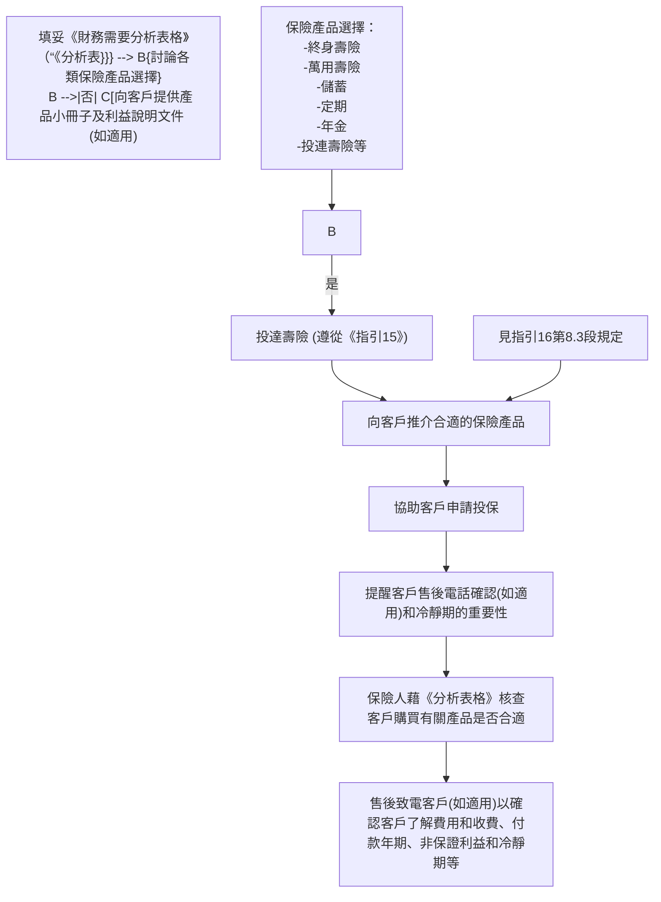

# 保險中介人資格考試

# 長期保險考試

研習資料手冊

2022 年 版

# 序 言

本研習資料手冊是根據長期保險考試的範圍對各章節的不同要求所編寫的。而考試也將以這些材料為基礎進行。我們在每一章結束處，都有一些模擬試題，從而給您提供更深入的指導。

對長期保險實務的某幾方面作出描述之後，轉載了一些真實的長期保險賠案。它們的作用主要是協助大家對本課題的理解，並加深學習的興趣。在個案中的決定或判決是基於特定事實而作出的，包括有關保險單中實際採用的措詞。這些個案有部分是經由當時的保險索償投訴局（現為保險投訴局﹝投訴局﹞）判決的，其餘個案則屬於沒有經過當時的保險索償投訴局判決而最終由索償人與有關保險人自行解決的索償爭議。值得留意的是：保險投訴局屬下的保險索償投訴委員會（投訴委員會）獲該局的《公司章程》賦予權力，裁決時毋須死硬詮釋保單條款。

但須指出的是，單靠本研習資料手冊並不能使你成為一名合資格的保險從業員或保險專家。它只是對長期保險這個課題作一個初步的介紹，並作為保險中介人資格考試的練習。

我們希望本研習資料手冊能成為幫助考生準備考試的一份值得信賴的參考資料。雖然我們在編寫時已力求完美，但錯誤與疏忽仍是難免的。所以在必要時，你還須參閱相關法例或向專業人士諮詢有關意見。今後我們將重版這研習資料手冊以提高其內容的質量，我們很希望得到您的反饋意見，以便在再版時對該手冊加以修繕。

初 版 ： 1999 年 10 月

第 二 版 ：2001 年 6 月

第 三 版 ： 2005 年 1 月

第 四 版 ：2007 年 6 月

第 五 版 ： 2011 年 6 月

第 六 版 ： 2016 年 12 月

第 七 版 ：2017 年 8 月

第 八 版 ： 2022 年 6 月

保 險 業 監 管 局 1999 年，2001 年，2005 年，2007 年，2011 年，2016 年，2017 年，2022 年

未 經 保 險 業 監 管 局 許 可，本 研 習 資 料 手 冊 的 任 何 部 分 均 不 得 被 翻 印 作 出 售 或 其 他 牟 利 之 用。

# 目 錄

章次 頁次

# 1 人 壽 保 險 簡 介 1 / 1

# 1 . 1 壽險定義 1 / 1

1.1.1 壽 險 的 需 求

# 1.2 壽 險 原 則 1 / 2

1.2.1 可 保 權 益  
1.2.2 披露責任 （ 或 稱 申 報 實 情 責 任 ）  
1.2.3 其 他 保 險 原 則

# 1.3 壽 險 保 費 的 計 算 1 / 9

1.3.1 定 價因 素  
1.3.2 定 價 制 度

# 2 人 壽 保 險 及 年 金 的 種 類 2 / 1

# 2.1 傳統的人 壽 保 險 類 別 2 / 2

2.1.1 定 期 壽 險  
2.1.2 儲 蓄 壽 險   
2.1.3 終 身 壽 險

# 2.2 非傳統的人 壽 保 險 類 別 2 / 6

2.2.1 萬 用 壽 險  
2.2.2 單 位 相 連 長 期 保險

# 2.3 年金及退休金 2 / 8

2.3.1 年 金  
2.3.2 退 休 金

# 2.4 團 體 及 個 人 保 險 計 劃 2/16

# 3 保 險 利 益 附 約 及 其 他 產 品 3 / 1

# 3.1 殘疾保險利益 3 / 1

3.1.1 殘 疾豁免 保 費（ 即 豁 免 保 費 附 約 ）

3.1.2 殘 疾 收 入

# 3.2 意外保險利益 3 / 3

3.2.1 意 外 死 亡 及 喪 失 肢 體

3.2.2 其 他 意 外 保 險 利 益

# 3.3 提 前 支 付 死 亡 保 險 利 益 3 / 6

3.3.1 危 疾 保 險 利 益

3.3.2 長 期 護 理 利 益

# 3.4 醫療保險利益 3 / 8

3.4.1 自 願 醫 保 計 劃

3.4.2 醫 療 保 險 業 務 指 引（指引 31）

# 3.5 可 保 權 利 益 3/18

3.5.1 保 證 可 保 選 擇

# 3.6 通貨膨脹調整 3 / 1 9

3.6.1 生 活 指 數 調 整 利 益

# 4 闡 釋 人 壽 保 險 單 4 / 1

4 . 1 完整合約條款 4 / 1

4.2 不可異議條款 4 / 1

4.3 寬限期 4 / 3

4.4 受益人的指定 4 / 4

4.5 不能作廢條款 4 / 4

4.6 保單抵押貸款 4 / 5

4.7 復 效 4/6

4.8 誤 報 年 齡 或 性 別 4 / 6

4.9 轉 讓 4 / 7

4.10 紅 利 選 擇 4 / 8

4.11 賠 付 選 擇 4 / 9

4.12 自 殺 除 外 責 任 4 / 9

# 5 人 壽 保 險 程 序 5 / 1

5 . 1 公司運作 5 / 1

5.1.1 典 型 公 司 運 作 結 構

5.2 投 保 5 / 4

5.2.1 投 保 手 續  
5.2.2 收 據 及 保 單 生 效  
5.2.3 顧 客 服 務 方 針 及 標 準  
5.2.4 冷 靜 期  
5.2.5 轉 保  
5.2.6 長 期 保 險 保 單 利 益 說 明  
5.2.7 派 發保 單 紅 利  
5.2.8 《 承 保 長 期 保 險 業 務（ 類 別 C 業 務 除 外 ）指 引 》（指 引 16）  
5.2.9 《財 務 需 要 分 析指 引》（指 引 30）  
5.2.10 重 要 資 料 聲 明 書—內 地 人 士 在 港 投 購 人身 ／壽 險 保 單  
5.2.11 送 贈 禮 品 指 引（指 引 25）

5.3 核 保 5/39

5.3.1 核 保因 素  
5.3.2 醫 療 報 告  
5.3.3 次 標 準 人 壽 及 核 保 措 施

5.4 簽 發 保 單 5/42

5.4.1 交 付 保 單

5.5 售 後 服 務 5/43

5.5.1 更 改 保 單

# 5.6 理 賠 5 / 4 4

5.6.1 期 滿 索 償

5.6.2 死 亡 索 償

5.6.3 退 保

# 附 件

A. 投 保 申 請 書 所 載 有 關 冷 靜 期 的 陳 述 指 引（指 引 29 - 附錄一） 6 / 1

B. 簽 發 保 單 時 的 冷 靜 期 提 示 指 引 （ 指 引 29 - 附錄二 ） 6 / 3

C. 問 題 範 本 - 轉 保 （ 指 引 27 - 附 錄 A） 6 / 5

D. 重 要 資 料 聲 明 書 - 轉 保（指 引 27 - 附 錄 B） 6 / 6

E. 投 連 壽 險 保 單 的 標 準 說 明（指 引 28 - 附 錄 I） 6/8

F. 分 紅 保 單 的 標 準 說 明 （ 指 引 28 - 附 錄 II） 6 / 11

G. 萬 用 壽 險 （ 非 投 資 相 連 ） 的 標 準 說 明 （ 指 引 28 - 附 錄 III） 6 / 1 6

H. 非 分 紅 保 單 的 標 準 說 明 （ 指 引 28 - 附 錄 IV） 6 / 2 2

I. 附 件 ： 可 接 納 及 不 可 接 納 的 保 險 術 語 清 單（指 引 28 - 附 件）第 一 部 分 ： 可 接 納 的 替 代 保 險 術 語 清 單 6 / 2 4

J. 附 件 ： 可 接 納 及 不 可 接 納 的 保險 術 語 清 單（指 引 28 - 附 件）第 二 部 分 ： 不 可 接 納 的 替 代 保 險 術 語 清 單 6 / 2 6

K. 承 保 長 期 保 險 業 務 （ 類 別 C 業 務 除 外 ） 指 引（指 引 16） 6 / 2 8

L. 財 務 需 要 分 析 表 格 的 範 本（指 引 30 - 附錄） 6/54

M. 重 要 資 料 聲 明 書 - 內 地 人 士 在 港 投 購 人 身 ／ 壽 險 保 單 6/56

N. 送 贈 禮 品 指 引 （ 指 引 25） 6 / 6 0

# 術語解釋 ( i ) - ( x v i i )

# 辭彙表

（ 按 漢 字 筆 畫 排 序 ） ( 一 ) － ( 九 )

（ 按 英 文 字 母 排 序 ） ( 1 ) - ( 1 0 )

# 模擬試題答案

# 應考須知

除 非 獲 得 豁 免 ， 否 則 如 果 你 在 保 險 中 介 人 資 格 考 試 中 選 考 本 科 目 的 同 時 也 須選 考「 保 險 原 理 及 實 務 」一 科。雖 然 考 試 規 則 並 沒 有 要 求 你 先 參 加 該 科 目 的 考 試，但 這 種 安 排 卻 明 顯 是 合 理 的 。 該 科 目 提 供 一 項 進 修 的 基 礎 ， 其 中 很 多 專 有 名 詞 及概 念 ， 屬 於 本 科 目 假 設 已 可 掌 握 的 知 識 。

應 考 人 士 宜 熟 讀 研 習 資 料 手 冊 各 章。現 列 明 各 章 在 考 試 中 的 比 重，以 便 參 考。

<table><tr><td>章次</td><td>比重</td></tr><tr><td>1</td><td>10%</td></tr><tr><td>2</td><td>20%</td></tr><tr><td>3</td><td>24%</td></tr><tr><td>4</td><td>24%</td></tr><tr><td>5</td><td>22%</td></tr><tr><td>總計</td><td>100%</td></tr></table>

# 1 人壽保 險簡介

# 1.1 壽 險 定 義

美 國 壽 險 管 理 學 會 (Life Office Managem ent Associati on Inc.(LOMA))出 版 了 一 系 列 優 秀 的 教 科 書，並 在 其 第 一 冊 中，將 人 壽 保 險 (lifeinsurance )定 義 為 ：

「保險公司承諾當被保險人死亡時支付保險金的保險。」

任 何 人 ， 只 要 對 人 壽 保 險 有 所 認 識 ， 都 會 說 「 是 的 ，不 過.....」。 換句 話 說，對 於 一 種 既 提 供 死 亡 賠 償，又 提 供 各 種 非 常 複 雜 的 儲 蓄 及 投 資 產品 的 金 融 服 務 來 說，這 樣 的 解 釋 當 然 過 於 簡 單。不 過，對 於 人 壽 保 險 的 初學 者 來 講 ， 這 定 義 作 為 第 一 課 的 內 容 是 很 合 適 的。

上 述 定 義 指 出 了 人 壽 保 險 的 最 初 及 最 基 本 目 的是 ，在 被 保 險 人（或稱受保人）去 世 後（尤 其 在 早 逝 的 情 況 下 即 如 於 某 時 刻 去 世 的 話，很大 可 能 會 給 受 養 人 帶 來 經 濟 困 難）， 向 被 保 險 人 的 家 人 或 其 他 人 提 供 幫 助 。最 初，保 險 單（ 簡 稱 保 單 ）有 效 期 較 短，只 為 暫 時 性 的 風 險 情 況 (temporaryrisk situations)提 供 保 障（例 如 ： 海 上 航 行）。 隨着人 壽 保 險 的 逐 步 完 善 ，人 們 意 識 到，在 許 多 情 況 下 人 壽 保 險 都 是 一 種 非 常 有 用 的 工 具。這 些 情 況包括：

( a ) 暫 時 需 要 ／ 威 脅 (Temporary needs/threats)： 儘 管 獲 得 死 亡 賠 償 是 人壽 保 險 最 基 本 的 目 的； 財 產 規 劃 (estate planning)亦 是 購 買 人 壽 保 險的 重 要 考 慮 元 素 ，但 有 許 多 問 題 諸 如 子 女 教 育 經 費 等 ，往 往 也 是 富有 責 任 心 的 人 所 要 考 慮 的 事 情 。  
( b ) 儲 蓄(Savings)： 隨着社 會 從 部 落 、 氏 族 、 家 庭 化 社 群 演 變 至 現 今 相對 富 裕 的 獨 立 個 體 的 社 會，為 家 人 及 自 己 提 供 長 期 的 生 活 保 障 這 個任 務 亦 變 得 越 來 越 重 要 。  
( c ) 投 資(Investment)：可 以 定 義 為一 個 為 了 預 期的利 益或增值而購 買 資產的 過 程 。隨着生 活 水 平 的 提 高 ， 財 富 的 累 積 以 及 保 護 財 富 免 受 通貨 膨 脹 的 影 響 成 為 現 實 的 目 標。  
( d ) 退 休(Retirement)：在 不 斷 變 化 的 文 化 和 社 會 環 境 中，為自 己 晚 年 生活 做 好 準 備 也 變 得 越 來 越 有 必 要 。

因 此 ， 研 習 本 課 題 的 目 的 ， 並 非 只 是為了 牢 記 某 些 事 實 ， 而 是 希 望大家能理解長期保險的一些基本知識，同時正確評價它在現代社會中的作用。

# 1.1.1 壽 險 的 需 求

在本手冊的 1.1 中 已 經 指 出 了 人 們 逐 漸 意 識 到 人 壽 保 險 的 種種 用 途。現 代 觀 點 則 傾 向 從 人 壽 保 險 如 何 滿 足 各 種 需 求 的 角 度 去 了解 現 有 的 人 壽 保 險 産 品。我 們 可 以 考 慮 將 這 些 不 同 的 需 求 概 括 如 下：

(a) 個 人 需 求 (P ersonal Needs) ：

( i ) 受 養 人 的 生 活 開 支 ；  
(ii) 善 終 （ 生 命 完 結 ） 開支；  
(iii) 教 育 經 費 ；  
(iv) 退 休 收 入 ；  
( v ) 償 還 按 揭 資 金 ；  
(vi) 應 急 資 金 （ 通 常 用 來 應 付 突 發 的 開 支 ）；  
(vii) 殘 疾 收 入 。

( b ) 業 務 需 求 (Business Needs )：

( i ) 關 鍵 人 物 ；  
(ii) 企 業 擁 有 人 ；  
( i i i ) 合 夥 人 ；  
(iv) 僱 員 福 利 。

# 1.2 壽 險 原 則

在 本保險中介人素質保證計劃的核心科目「保 險 原 理 及 實 務」中，我 們 已 經 詳 細 研 究 了 保 險 的 原 則，這 裏 不 再 作 詳 細 論 述。現 再 一 次 提 醒 大家 ， 這 些 原 則 包 括 ：

(a) 可 保 權 益 (Insurable Interest) ： 投 保 的 合 法 權 益 ；  
( b ) 最高誠信(Utmost Good Faith)：主 動申 報 重 要 事 實 的責 任；  
(c) 近因 (Proximate Cause)：關 乎在 保 險 索償 中 確 定 損失 的 主要 有效 成 因；  
(d) 彌 償(Indemnity)：保險人提 供 精 確 的 財 務 補 償 ；  
( e ) 分 擔 (Contribution)： 保 險 人 （ 或 稱 保 險 公 司 、 承 保 人 、 承 保 商 ） 分擔 彌 償 付 款 ；

( f ) 代 位 權 (Subrogation)： 提 供 彌 償 的 保 險 人 接 收 然 後 行 使 被 保 險 人 向第三者追 討 損 失的 權利。

# 1.2.1 可 保 權 益 (In su rab le In terest)

簡 單 地 說 ， 可 保 權 益 就 是 與 保 險 標 的 （ 或 稱 保 險 標 的 物 ）(subject matter of insurance )（ 在 人 壽 保 險 中 指 與 某 人 的 生 命 ） 之 間的 某 種 關 係 ， 而 這 種 關 係 獲 得 法 律 或 衡 平 法 的 認 可 ， 得 以 產 生 就 該人 的 生 命 購 買 保 險 的權利。這 是 一 個 已 經 在 英 格 蘭 應 用 了 兩 個 半 世紀 並 明 顯 是 源 自 常 識 的 概 念。如 果 你 與 那 個 人 沒 有 任 何 關 係，那 麽，你 憑 什 麽 就 他 的 生 命 購 買 保 險，並 可 因 他 的 死 亡 而 獲 得 利 益 呢 ？ 關於 這 個 原 則 ， 我 們 應 該 注 意 以 下 幾 點 ：

( a ) 法 定 要 求 (statutory requirement)： 在 人 壽 保 險 中 ， 可 保 權 益的 規 定 源 自《 保 險 業 條 例 》(Insurance Ordinance) 第 64B 條。  
( b ) 缺 乏 可 保 權 益 的 後 果 ： 如果訂立的保險合約是為某人的使用或 利 益 ， 或 為 某 人 而 訂 立 ， 而 該 某 人 並 無 權 益 的 話 ， 根 據 第64B 條 ， 該 個 合 約 則 屬 無 效 。  
( c ) 對 自 己 及 配 偶 的 可 保 權 益 (i nsu rab le in terest i n on eself an d inspouse )： 根 據 司 法 假 設 ， 我 們 都 對 自 己 的 生 命 具 有 無 限 金 額的 可 保 權 益。另 一個司法假 設 是，任 何一 個人 對 其 配 偶 具 有 無限 金 額 的 可 保 權 益 ， 因 此 不 必 證 明 具 有 這 麽 的 權 利 。  
( d ) 對 其 他 人 的 可 保 權 益 (insurable interest in others)： 除 了 建 基於司法假設（見上面(c)段 ） 或 法 例 （ 見 下 面(f)段 ） 的 可 保 權益 以 外，根 據 判 例 法，必須具備可 以 用 金 錢 來估 值 的 權 益。常見 的 例 子 有 ：

( i ) 債務人：如果某人欠你錢，你可就他的生命購買壽險 ，保 額為貸 款 金 額 另 加應計利 息 ；  
(ii) 生 意 合 夥 人 ： 尤 其 是 涉 及 個 人 服 務 的 時 候 ， 例 如 ： 表 演者 、 音 樂 家 等 ；  
(iii) 合 約 關 係 ： 如 果 其 中 一 個 人（ 演 唱 會 的 歌 手 、 職 業 運 動員 等）正 以 合 約 形 式 提 供 服 務，該 人 的 死 亡 可 能 會 使 合約的另一方蒙受財務損失。這種潛在損失也是可保的。

註：在 這 個 題 目 中 也 可 以 包 括 另 一 種 常 見 的 人 壽 保 險 産品，即 關 鍵 人 物 人 壽 保 險 (Key Person Life Insurance)（ 或稱 關 鍵 僱 員 人 壽 保 險 (Key Employee Life Insurance) ）。在 這 種 保 險 中，僱 主 就 某 重 要 僱 員 的 生 命 購 買 保 險，以補 償 公 司 由 於 該 僱 員 的 死 亡 而 帶 來 的 損 失 。

( e ) 血 緣 關 係 和 家 庭 成 員：在 某 些 國 家（ 例 如 美 國 大 多 數 的 司 法 管轄 區），某些由法 律 訂 明的家庭 關 係 （ 兄 弟 、 姐 妹 、 父 母 、 子女 、 祖 父 母 、 孫 等 ） 本 身 足 以 構 成 可 保 權 益 。  
( f ) 可 保 權 益 的 法 定 延 伸：在 香 港，根 據《 保 險業條 例 》第 64A 條，未 成 年 人（ 未 滿 18 歲 的 人 ）的 父 母 或 監 護 人 就 該 年 輕 人 享 有可 保 權 益。這 類 關 係 是 在 配 偶 關 係 以 外，唯 一 構 成 可 保 權 益 的血 緣 或 家 庭 關 係 。 任 何 基 於 其 他 血 緣 或 家 庭 關 係 所 訂 立 的 保險 在 技 術 上 都 是 無 效 的（見 上 述(b)項）。  
( g ) 《保險業條 例 》 第 64C 及 64D 條： 包 括 另 外 兩 項 重 要 條 文 ：

( i ) 對 受 保 生 命 具 有 權 益 的 人、有 關 合 約 是 為 其 使 用 或 利 益而 訂 立 的 人、或 有 關 合 約 是 為 其 訂 立 的 人 的 名 字 必 須 寫在 該 合 約 中 ；

（ 實 際 上 ， 這 項 條 文 的 範 圍 不 被 廣 泛 理 解 為 包 括 所 有 那些保 單 所 有 人 有 意 讓 其藉 着收 取 保 單 收 益 而受 惠的 人 。因 此，如果某份 人 壽 保 險 單 把 保 單 所 有 人 的 遺 囑 執 行 人定 為 收 款 人 的 話 ， 沒 有 人 會 理 會 該 名 遺 囑 執 行 人 及 預 定的 遺 囑 受 益 人 的 名 字 會 不 會 在 保 單 上 出 現 。）

( i i ) 可 根 據 該 合 約 追 討 的 數 額，不 得 超 逾 被 保 險 人 對 受 保 生命 的 權 益 的 數 額 。［ 這 條 文 只 於 有 關 的 人 壽 保 險 是 以 彌償 方 式 訂 立 的 情 況 下 才 有 意 義 ， 信 用 壽 險 是 例 子 之 一（ 見 2 . 1 . 1 a ( b ) ( i ) ）。 ］

(h) 何 時 需 要 可 保 權 益 ？：這 是 一 個 關 鍵 問 題，而 且 一 連 串 非 常 重要的後 果 由 此 産 生。答 案 是：只 有在 合 約開 始時 才 需 要 可 保 權益，之 後 可 保 權 益不 再 相 干。這 會 有 什 麼（法 律）後 果 呢 ？ 部分 例 子 如 下 ：

( i ) 離 婚：夫 妻 中 任 何 一 方為其 配 偶 的 生 命 投 保後，即 使離婚，仍 可 維 持 保 單 的 有 效 性，而 且 完 全 有 權 在 適 當 時 候收 取 利 益 。  
( i i ) 債 務：法 律 上，你 可 就 你 的 債 務 人 的 生 命 投 保，在 債 務得 到 償 還 後，仍 然 維 持 該 保 單 的 有 效 性，並 在 適 當 時 候「 再 次 得 到 償 付 」。  
( i i i ) 轉 讓(Assignment)：在 不 是 為 了 繞 過 可 保 權 益 的 要 求 的前提下，保單所有人可把正當地安排的人壽保險合約轉讓給第三者，即使該第三者對受保生命缺乏可保權益。為 了 繞 過 可 保 權 益 的 規 定 而 作 出 的 行 為 是 無 效 的，因為其目的是妨礙某項法規的宗旨；其實該合約從起保 日 開 始 便 屬 無 效，因 為 事 實 上 的 被 保 險 人（ 即 預 定 承

讓 人 ）缺 乏 所 需 的 可 保 權 益。因 此，重 要 的 是 保 單 所 有人在買保單時的意圖。買保單時具有籠統的意圖把它轉讓是合法的，但要是有意把它轉讓給一個對受保生命 不 具 可 保 權 益 的 特 定 的 人 的 話 就 是 另 外 一 回 事 了 。

# 1.2.2 披 露 責 任 （ 或 稱 申 報 實 情 責 任 ） (Duty of Disclosure)

這 涉 及 另 一 項 重 要 的 保 險 原 則 —最高誠信 (utmost good faith)。簡 單 地 說，最 高 誠 信 要 求 投 保 人 披 露 所 有 重要事實 (material facts)，不 管 保 險 人 有 沒 有 提 出 要 求 。「 在 訂 定 保 費 或 決 定 是 否 承 擔 風 險 方面 會 影 響 一 名 審 慎 的 保 險 人 的 判 斷 的 任 何 情 況 」，即 屬 於 重 要 事 實。我 們 應 該 注 意 以 下 幾 點 ：

( a ) 披露甚麽：顯 然，保 險 人 希 望 瞭 解 所 有 重 要 事 實，但 是，他 不能 期 望 你 披 露 你 有 理 由 不 可 能 知 道 的 情 況。例 如：有 些 疾 病 對合 資 格 醫 生 而 言 可 能 很 容 易 察 覺 ， 但 是 不 能 期 望 一 般 人 也 能夠 進 行 自 我 診 斷 並 作 披露。

# 個 案一 法 律 規 定 投 保 人 必 須 向 保 險 人 披 露 重 要 事 實

保 單所有 人 在 廣 東 省 開 設 貿 易 公 司 ， 買 了 人 壽 保 險 單 三 個 月 後接 連 發 熱 超 過 兩 個 月 ， 其 後 更 因 癌 病 去 世 。 保 險 人 從 某 家 國 內醫 院 發 出 的 醫 療 報 告 中 發 現 ， 死 者 在 年 前 曾 向 有 關 醫 院 表 示 感到 疲 勞 過 度 和 體 力 不 支 ， 但 是 他 在 投 保 申 請 書 上 就 以 下 問 題 ：「 在 過 去 三 個 月 內 有 否 感 到 疲 勞 過 度 等 癥 狀 超 過 一 星 期 ？ 」 所填 報 的 答 案 是 「 沒 有 」 ， 保 險 人 因 此 以 投 保 人 沒 有 披 露 重 要 事實 為理由拒絕 其給付要求 。

時 任 保 險 索 償 投 訴 局的保險索償 投訴委員會（或稱 投訴委員會 ）（ 現 更 名 為 保 險 投 訴 局 ） 認 為 一 般 來 說 ， 保 險 人 極 少 在 投 保 申請 書 上 提 問 投 保 人 「 在 過 去 三 個 月 內 有 否 感 到 疲 勞 過 度 等 癥 狀超 過 一 星 期 」等 問 題，並 認 為 保 單所有 人 雖 然 沒 有 披 露 有 關「 疲勞 過 度 和 體 力 不 支 」 的 病 癥 ， 卻 不 足 以 構 成 保 險 人 可 以 「 沒 有披 露事實」為理由拒絕 其給付要求 。

評論：投訴委員會的判決明顯是基於下列兩項法則的。第一、投保人所要披露的限於重要事實，並非任何被問及的事實；第二、“重要事實”的範圍受某項客觀準則所規限，因此一項只被特定保險人視為重要的事實，不能真正構成重要事實以讓該名保險人援引最高誠信原則。

# 個 案 二 法 律 規 定 投 保 人 必 須 主 動 地 向 保 險 人 披 露 其 知 悉 或應 知 悉 的 重 要 事 實

保 單所有 人 在 購 買 了 保 單 九 個 月 後 被 診 斷 患 上 結 腸 癌 ， 因 此 提出 給 付 危 疾 保 險 和豁 免 保 費 利 益 的 要 求 ， 但遭 保 險人拒 絕 ， 理由 是 他 在投保時沒有 披 露 梗阻性睡眠窒息的病歷。

療 ， 示 保 單 單 所 有 人 早 在 投 保 前 12 年 ， 阻 性 睡 眠單所有 人 沒 有 接 受 接 受 睡 眠 狀 ， 因 此 因 為 鼾 ，眠 檢 + 查 後 ， 首 治 被 診 示 次 接 受 跟 進 治 療 ， 但 他不 有 人 在 投 保 前 打 鼾 和 日 間 非 接受 ， 一 年 再 常 昏 昏 症 安 排接 受 一步 的 睡眠檢查，但 他 並 沒 有 去 覆診。

保 單所有 人 承 認 患 上 梗 阻 性 睡 眠 窒 息 症 已 有 一 段 長 時 間 ， 但 是這 症 狀 與 他 所 患 的 結 腸 癌 完 全 無 關 ， 他 並 強 調 自 己 已 任 職 巴 士司 機 達 2 0 年，期 間 這病症 從 沒 影 響 他 的 工 作，他 更 通 過 了 巴 士公 司每年例行的身體檢 查 。

投 訴 委 員 會 從 保 險 人 的 核 保 手 冊 中 得 悉 ， 保 單 所 有 人 患 梗 阻 性睡 眠 窒 息 症 的 嚴 重 程 度 ， 及 有 否 同 時 患 相 關 疾 病 ， 均 會 影 響 保險 人對危疾保障和豁免保費保障的核保決定。

由 於 保 單 所 有 人 沒 有 接 受 詳 細 的 睡 眠 檢 查 ， 以 評 定 所 患 梗 阻 性睡 眠 窒 息 症 的 嚴 重 性 ， 令 保 險 人 無 從 評 估 風 險 。 投 訴 委 員 會 相信 如 果 保 險 人 在 保 單 所 有 人 投 保 時 得 悉 他 患 上 該 病 ，定會 索 取更 多 相 關 資 料 ， 或 者 在承擔 風 險 之 前 ， 安 排 保 單 所 有 人 接 受 進一 步的 身 體 檢 查。由 於 保 單所有 人 所 沒有披露的 疾 病 誠 為 重 要，足 以 影 響 保 險 人 的 核 保 決 定 ， 投 訴 委 員 會 贊 同 保 險 人 拒 絕 給 付的 決定。

評論：面對保險人以不披露為理由拒絕賠付，索償人頗經常提出有關損失與（聲稱）不獲披露的事實扯不上關係，但他們不知道這種關係的存在不屬於援引最高誠信原則的先決條件。

# 個 案三 法 律 規 定 投 保 人 必 須 向 保 險 人 披 露 重 要 事 實

受 保生命 死於舌癌 。 保 險 人 發現死者長期酗酒，每天飲用十罐啤 酒， 卻 在 回 答 投 保 申請書的問題：「你曾否有吸煙、服食藥物 、吸毒或喝酒的習慣？」時，填報「沒有」；保險 人 因 此 以沒 有披露事實為理由，拒絕 給付死亡保險利益 。

死 者 的 兒 子 堅 稱 父 親 並 非酗 酒 ， 只 在 特 別 的 場 合 中喝酒， 並 指出 更重要的是，喝酒 與舌 癌 扯不上直接關係。

投 訴委員會留意到兩 家 醫 院 的 醫 療 報 告，均 指死者在過去 3 0 年來 習 慣 每 天 飲 用 數 罐 啤 酒 ， 因 此 相 信 死 者 長 期 酗 酒 。 由 於 這 項沒 有 披 露 的 資 料 足 以 影 響 保 險 人 的 承 保 決 定 ， 投 訴 委 員 會 贊 同保 險人決定拒絕 給付利益。

評論：如前所述，面對保險人以不披露為理由拒絕賠付，索償人頗經常提出有關損失與（聲稱）不獲披露的事實扯不上關係，但他們不知道這種關係的存在不屬於援引最高誠信原則的先決條件。

(b) 免 體 檢 的 投 保 (Non-medical application)： 如 果 保 險 人 並 沒 有要 求 投 保 人 作 身 體 檢 查 ， 保 險 人 將 很 難 指 稱 投 保 人 之 沒 有 披露 投 保 單 （ 或 稱 「 投 保 申 請 書 」、「 申 請 表 」） 內 的 問 題 或個人體 檢 表 格 內 沒 有 問 及 的 事 情 ， 構 成 了 不 披 露 重 要 事 實 。  
( c ) 要體檢的投保 (Medical application)： 如 果 保 險 人 要 求 投 保 人作 身 體 檢 查，那 麽，保 險 人 不 能 因 為 有 關 的 合 資 格 的 醫 療 人 員的 疏 忽 遺 漏 或 診 斷 錯 誤 而 為 難 投 保 人 。

# 個 案 四 法 律 規 定 投 保 人 必 須 主 動 向 保 險 人 披 露 重 要 事 實

保 單 所 有 人 投買 人 壽 保 單 ， 並 在 保 險 人 指 定 的 診 所 接 受身 體 檢查，保 險人在 投 保 人 同 意支付 額 外 保 費 後 接 納 其 保險申 請。後來，保單所有人 因 主 動 脈 瘤 破 裂和肺 炎 去 世。保 險人撤 銷 保 單，原 因是 超 聲 心 動 描 記 圖 顯 示，保 單所有 人 在 申 請 保 險 兩 年 前 已 患 上 心動快速 、 異 位 心 臟 搏 動 和 局 部 缺 血 等 疾 病 。

投 訴 委 員 會 認 為 即 使 保 險人已對保單 所 有人進 行身 體 檢 驗，保單所 有人 仍 然 有 責 任 披 露 其病 歷，因此 同 意 保 險人決定拒 絕給付保險利益 。

評論：投保人應保險人的要求讓對方進行身體檢查，可能不構成向保險人充分披露本身的病歷和健康狀況，除非該種身體檢查的性質足以揭露該等資料。

( d ) 身體檢查(Medical tests)： 保 險 人可 以要 求 投 保 人接 受合 理 的身 體 檢 查 或 測 試 以 補 充 口 頭 提 供 的 資 料 ， 而 此 等 要 求一 般 會得 到 滿 足，但保 險 人必須 特 別 留 意，不 可 違 反《 個 人 資 料（私隱 ） 條 例 》 (P ersonal Dat a (P rivac y) Ordinance) 。 該 條 例 的 效力 之 一 是，保 險 人 在 進 行 任 何 測 試 之 前，必 須 解 釋 要 求 該 類 資料 的 原 因。根 據 該 條 例，接 受 身 體 檢 查 的 人 也 有 權 瞭 解 有 關 的結果。

( e ) 保 單 所 有 人 違 反 責 任：在 法 律 上，如 果 保 單 所 有 人 違 反 了 最 高誠 信，保 險 人就有 權 推 翻 合 約。但 是，香 港的大 多 數 壽險保 單都 包 含 了 一 項 名 為 不 可 異 議 條 款 (Incontestability Provision)的 保 單 條 件。該 條 款 規 定，除 非 有 證 據 證 實 保 單 所 有 人 的 欺 騙行 為，否則，在保單生效了一段時間（可異議期(contestableperiod)） 之 後 ， 保 險 人 不 會 對 該 份 保 單 提 出 異 議 或 質 疑 （ 詳情 見 4.2 段 ）。

# 1.2.3 其 他 保 險 原 則

(a) 近 因 (Proximate Cause )： 這 原 則 涉 及 識 別 索 償 個 案 中 損 失 的主 要 和 有 效 成 因。這 原 則 當 然 適 用 於 所 有 保 險 種 類，但 是 它 對人 壽 保 險 的 重 要 性 可 能 並 不 顯 著 ， 這 在 一 定 程 度 上 與 因 為 人壽 保 險 極 少 採 用 除 外 責 任 有 關 。 近 因 原 則 的 應 用 與 不 同 類 型的 危 險 (perils)（ 即 造 成 損 失 的 原 因 ） 關 係 密 切 ：

( i ) 受保危險 (Insured Perils)：保 單 所 承 保 的 危 險。非 人 壽 保單可能 承 保 的 危 險，其 中 之 一 必 須 是 造 成 損 失 的近因 ， 否 則 不 獲 賠 償 。 在 人 壽 保 險 中 ， 除 非 在 自 殺 除 外 責任 條 款 或 意 外 死 亡 保 險 利 益 附 約 適 用 的 情 況 下 ， 否 則 ，死 亡 的 原 因 並 不 十 分 重 要 。  
(ii) 除 外 危 險 (Excepted (or Excluded) Perils)： 非 人 壽 保 險 中 ，所 有 保 單 都 包 含 某 些 除 外 責 任 (exclusions)。如 果 索 償 涉及 除 外 責 任 ， 保 險 人 無 須 負 責賠 償 損 失 的 全 部 或 部 分，視 乎 除 外 責 任 的 具 體 規 定 而 定。人 壽 保 險 保 單 中 甚 少 包含 除 外 責 任（但 請 參 閱 下 文註 1）。  
(iii) 不保危險(Uninsured Perils)： 這 些 造 成 損 失 的 原 因 既 沒有 在 保 單 中 被 列 明 為 受 保 危 險，也 沒 有 被 列 明 為 除 外 危險 ， 例 如 ： 火 災 保 險 中 由 水 造 成 的 損 失 。 如 果 財 産 被 水損 壞（ 例 如：下 雨 ），而 且 不 涉 及 其 他 原 因，損 失 便 不 受保 障 。 但 是 ， 如 果 損 失 主 要 由 受 保 危 險 引 起 ， 如 消 防 員用 水 喉 救 火 ， 這 樣 ， 水 造 成 的 損 失 也 是 受 保 的 。 人 壽 保險 索 償 案 中 ， 不 可 能 出 現 這 類 複 雜 的 情 況 。

註 ： 1 自 殺(Suicide)屬於保單的除外責任，因此，近因原則是確定 死 亡 是 否由自 殺 導 致的重 要工 具。然 而，即 使在 這 裡，這 原則 也 發 揮 不 了 十 足 效 力，因為自 殺 僅 於 一 段 期 限（自 殺 免 責 期）內 構 成 除 外 責 任 （ 見 4.12）。

2 我 們 可 以 得 出 這 樣 的 結 論 ： 保 險 原 理 尤 其 是 與 索 償(claims)有 關 的 原 理 在 人 壽 保 險 中 比 在 非 人 壽 保 險 中 的應 用 是 比 較有 限 的 。

( b ) 彌 償 (Indemnity)： 指 對 所 受 損 失 提 供 精 確 的 財 務 補 償 ， 這 對大多數類 型 的一 般 保 險 來 說 非 常 重 要 。 然 而 ， 就 人 壽 保 險 來說 ：

(i) 非 常 明 顯，保 險 收 益 絕 不 可 能構 成人 命 的 精 確 財 務 補 償。這 就 是 為 什 麽 人 壽 保 險 亦 稱 為 利 益 保 單 (BenefitPolicies)，而非 彌 償 保 單 的 原 因 ；

(ii) 不 可 能 超 額 賠 償 ， 因 為 可 保 權 益 （ 與 彌 償 密 切 相 關 ）在 大多數 情 況 下 是 無 限 的 （ 見 1.2.1(c)）；

( c ) 彌 償 的 引 伸 (Indemnity corollaries)： 引 伸 是 一 個 次 原 則 。 彌償 有 兩 個 引 伸 ， 即 分 擔 及 代 位 權 。

( i ) 分 擔 (Contribution)：在 大 多 數 一 般 保 險 類 別 中，如 果 某人 偶 然 就 同 一 損 失 擁 有 多 於 一 份 保 單，他 不 會 收 到 重 複賠 償 。 每 份 保 單 會 按 比 例 分 擔 損 失 。 另 一 方 面 ， 如 果 他故意購買 多 於 一 份 保 單，機 警 的 理 賠 人 員 可 能 視 之 為 欺騙 的 跡 象 ！

人壽保險一 般 不 受 彌 償 原 則 所 規 限，因 此 ， 一 個 人 擁 有多 於 一 份 人 壽 保 單 是 很 正 常 的。而 且，在 受 保 事 件 發 生後，每份 保 單 都 必 須 全 額 賠 償 。

(ii) 代位權 (Subrogation)：這 涉 及 保 險 人 的 法 律 權 利 。保 險人 提 供 賠 償 後 獲 得 被 保 險 人 向 第 三 者 提 出 索 償 的 權 利 ，以 彌 補 他 向「保 單 持 有 人」（“policyholder”這 個 英 式 詞 彙等 同 於 美 式 詞 彙“policyowner”（保 單 所 有 人））所 提 供 的賠 償 。 但 這 一 點 並 不 適 用 於 人 壽 保 險 。

例 如：如 果 某 人 的 汽 車 被 第 三 者 疏 忽 地 損 壞 了，那 人 的汽 車 保 險 人 必 須 賠 償 有 關 損 失（ 假 設 他 所 購 的 是「 綜 合保 障 」（ 俗 稱「 全 保 」））。 但 保 險 人 可 以 嘗 試 向 造 成 汽 車損 害 的 第 三 者 追 討 賠 償。在 同 一 次 意 外 中，如 果 車 上 有無 辜 受 害 人 死 亡，該 受 害 人 的 人 壽 保 險 人 必 須 支 付 死 亡保 險 金，但 之 後 該 人 壽 保 險 人 卻 無 權 向 第 三 者 追 討 損 失。

# 1.3 壽 險 保 費 的 計 算

計 算投 保某人的生 命所 需保 費時 ，可 能 需 要 考 慮一 些 個 別 因 素 ，而這些因素可能使這個人的風險比同一年齡和性別的人的平均風險較高或較 低。不 過，這 實 質 上 屬 於 核 保 問 題，我 們 將 在 5.3 中 詳 細 討 論。人 壽 保險 的費 率(premium rates)，作為針 對 不 同 年 齡 和 性 別 的 正 常 保 費 或 標 準 保費 ， 它 們 都 有 一 些 共 同 的 特 性 。 關 於 這 方 面 我 們 可 作 以 下 的 分 析 討 論 ：

# 1.3.1 定 價 因 素

釐 定 人 壽 保 險 保 費 的 傳 統標 準 應 該 是 ：

( a ) 充足的 (adequate)： 使 保 險 人 有 金 錢 支 付 保 險 利 益 及 履 行 合 約中 的 其 他 責 任 ； 及  
( b ) 公 平 （ 公 正 ） 的 (equitable /fair)： 每 位 保 單 所 有 人 繳 納 的 保 費須 反 映 有 關 的 風 險 及 約 定 利 益 。

要 達 到 這 些 標 準 ， 須 要 考 慮 許 多 因 素 。

# 1.3.1a 死 亡 率 、 利 息 及 開 支

( a ) 死 亡 率 (Mortality)： 指 受 保 生 命 的 預 計 死 亡 比 率 (Rateof Mortality)。 這 聽 起 來 很 可 怕 ， 但 顯 然 ， 這 絕 對 是 計算人壽保險保費的核心。能夠預計受保生命平均將於何 時 去 世 是 收 取 正 確 保 費 的 關 鍵 因 素 。

當 然，個 別的人 的 壽 命 可 能 比 平 均 壽 命 較 長 或 較 短，但是，按 照「 平 均 法 則 」(law of averages)（ 有 時 稱 為「 大數 法 則 」(law of large numbers)），我 們 可 以 進 行 合 理 的預 測 與 計 算 。 使 用 死 亡 表 （ 或 稱 生 命 表 ） (mortalitytables)非 常 有 幫 助 ， 這 是 顯 示 不 同 年 齡 的 預 期 死 亡 比率 的 計 算 表 ， 在 保 險 行 業 中 十 分 通 用 。

正如上面所述，個別風險可能需要特別的受保條件和考 慮，但 那 屬 核 保 (underwriting)問 題。利 用 死 亡 表 釐 定費 率 ， 只 是 應 付 正 常 風 險 和 正 常 預 期 。

( b ) 利 息(Interest)：簡 單 來 說，人 壽 保 險 涉 及 現 在 及定 期向被 保 險 人 收 取 保 費，使 得 在 未 來 某 時 候 或 某 種 情 況 下，能 夠 支 付 保 險 利 益。按 照 這 個 定 義，我 們 擁 有 一 定 的時間 ， 而 老 生 常 談 亦 有 謂 「 時 間 就 是 金 錢 」 ！

我 們 擁 有 多 少 時 間，一 般 來 說，主 要 取 決 於 上 述(a)項 所討 論 的 死 亡 率。我 們 擁 有 一 定 的 時 間 這 個 事 實，意 味 着我 們 有 機 會 進 行投 資(investment)。從投 資保 費收 入所賺 取 的 利 息，是 釐 定 保 險 費 率 的 另 一 個 重 要 因 素。如 果某 位 保 險 人 預 期 獲 得 高 於 平 均 的 投 資 回 報 ， 它 便 可 收取 比 相 當 數 量 的 競 爭 對 手 較 低 的 保 費 ， 及 ／ 或 為 其 股東 賺 取 更 高 的 利 潤 。

註 ： 將 上 述 兩 種 因 素 結 合 起 來 就 會 産 生 所 謂 淨 保 費 (netpremium)（ 有 時 稱 為 純 保 險 費 (pure premium)）， 即 在 正 常 統計 預 期 下 足 夠 支 付 死 亡 索 償 所 須 向 保 單 所 有 人 收 取 的 金 額 ，但 是 ， 還 有 更 多 因 素須要 考 慮 。

( c ) 開 支 (Expenses)：淨 保 費 (net premium)外 還 須 加 上 附 加保 費 (loading)（ 額 外 或 附 加 費 用 ）， 以 應 付 所 有 預 期 及可 能 的 營 運 開 支，包 括 所 有 內 部 營 運 成 本、佣 金、稅 款以及經營任何業務都需要的通常開支。 就 人壽保險 而言 ，還須 考 慮 某 種 新 疾 病 或 其 他 災 難 引 起 異 常 死 亡 率的 可能性（ 即 使 可 能 性 極 少 ）— 須 知 約 定保費 再 不 能 予以 增 加 以 應 對 其 後 的 新 情 況。所 以，有必要 因 此 類 意 外事件而在 淨 保 費之上 附 加 保 費。

註 ： 附 加 保 費 加 上 淨 保 費 就 成 為 了 毛 保 費 (grosspremium)， 它 考 慮 了 上 述 提 到 的 三 種 基 本 因 素 。

# 1.3.1b 其 他 因 素

正 如 我 們 已 經 提 到 的，現 有 保 單 的 既 定 保 費 不 能 更 改。而 人 壽 保 險 又 是 一 種 長 期 業 務 (long term business)，這就 是 說，合 約 不 僅 可 能 持 續 多 年，而 且，如 果 沒 有 保 單所 有 人 的 同 意，保 險 人 不 能 取 消 或 修 訂 合 約。因 此，不時出現的其他因素只會影響新保單的保費。這些可能影 響 人 壽 保 險 費 率 的釐 定 的 因 素 包 括 ：

( a ) 分紅或不分紅(PAR or NON-PAR)：這一點極為重 要 。人壽保險的一個獨有特點是，一 張保 單不 是「分紅」(participating/par) 就 是 「 不 分 紅 」 (n on-participating /non-par)保 單。分 紅 保 單 的 所 有 人一 般可於 保 單 的 週 年日收 取 保 險 人 的 可 分 配 盈 餘(divisible surplus)（如 有 的話 ）的 一 個 不 固 定 份 額，此 等 收 益 稱 為 保 單 紅 利 ／ 紅 利(policy dividends / dividends)。雖 然 保 單 紅 利 不 獲 保 證，但 分 紅 保 單 的 保 險 費 率 比 相 等 的 不 分 紅 保 單 為 高 。

註 ： 1 美 國 的 保 險 人 談 及 分 紅 (PAR) 和 不 分 紅 (NON-PAR)保 單 及 紅 利，英 國 保 險 人 則 簽 發 有利潤 (With-Profit)和無 利 潤 (Without-Profit)保 單 及 宣 布 英 式 紅 利 ／ 紅 利(bonuses)。概 念 是 一 致 的，但美 英 的 做 法是 存 在差 異 的。英 式 紅 利 通 常 是 復 歸 的 (reversionary（) 即只於 支 付 保 單利 益 時 一 起 支 付）， 而 美 式 紅 利 則 於 週 年 宣 布 時 支 付 。話雖如此，復歸的英式紅利可在不 中 止保單的情況下折 為 現 金 支 付（ 關 於 退 保 價 值 ， 見 1.3.2b(c)(i)）。 假 設一 份 終 身 壽 險 保 單 已 賺 取 5,000 英 鎊 的 累 積 復 歸 紅 利，保 單 所 有 人 有 權 立 即 從 這 價 值 獲 支 付，但 須 先 作 折 減；再假設按照保險人基於受保生命的現時年歲和預期利率 等 因 素 所 作 的 計 算，為 數 5,000 英 鎊 的 未 來 英 式 紅 利相等於 1,000 英 鎊 的 即 時 支 付 退 保 價 值。如 果 保 單 所 有人把累積英式紅利價值的一半折為現金的話，可立即獲 付 500 英鎊。

2 並 非 所 有 人 壽 保 險 都 劃 分 為 分 紅 或 不分紅 的 。 定 期壽 險 計 劃 （ 見 2.1.1） 一 般 是 不 分 紅 的 。

3 保 單 紅 利 的 派 發 ， 見 5.2.7。

( b ) 競 爭：沒 有 任 何 保 險 人 可 以 壟 斷 市 場。在 釐 定 保 費 時，不 可 忽 視 市 場 通常 的 收 費 標 準 。  
( c ) 經濟變化：持 續 的 經 濟 繁 榮 或 衰 退，毫 無 疑 問 都 會 影 響各 種 産 品 的 價 格 ， 包 括 保 險 産 品 。  
( d ) 公衆健康：計 算 保 費 時，這 方 面 的 異 常 發 展（ 例 如：愛滋病流行 ） 也 不 容 忽 視 。  
( e ) 財 政 變 化 ：持續上升的稅收水平必定會使保險費率也相 應 提 高 。  
( f ) 公 司 目 標 和 巿 場 行 銷 策 略 ： 如 果 公 司 決 定 增 大 市 場 佔有率，釐定具競爭力的費率顯然是一個可能的巿場行銷策略 。

# 1.3.2 定 價制 度

自 然 保 費 制 度 與 均 衡 保 費 制 度，可 以 分 別 被 形 容 為「 傳 統 」和「 現 代 」， 而 箇 中 原 因 很 快 便 會 清 楚 。

# 1.3.2a 自 然 保 費（ 釐 定 ）制 度 (Natural Premium (Pricing) System)

自 然 保 費 制 度（ 或 自 然 保 費 釐 定 制 度 ）為 部 分 人 壽 保 險人 在 早 期 所採 用。它 很 切 合 邏 輯，但 注 定 要 失 敗。因為實 際 上，這 制 度 的 特 性 令 它 無 法 長 期 可 行 。此 等特 性 包 括 ：

( a ) 保 費：保 單 有 效 期 內 保 費 並 非 固 定，而 是於 每 個 保 單 週年 日獨 立 計 算 ， 以 準 確 反 映 在 每 個 續 保 期 內 受 保 生 命的 自 然 風 險(natural risk)狀 況 （ 例 如 年 齡 等）。  
( b ) 短期後果：隨着年 齡 的 增 長，死 亡 風 險 亦 增 加，因 此，現 有 保 單 的 保 費 也 會 每 年 增 加 。  
( c ) 較長期後果：這 些 後 果 事 後 想 來 都 是 可 預 料 的，其 中 包括 ：

( i ) 保費隨 着 年 齡 的 增 長 而 增 加 ， 但 保 單 所 有 人 的 可動用資源或賺錢能力在比較年老時卻漸漸減少，這 經 常 在 續 保 時 帶 來 沉 重 負 擔 的 問 題 ；

( i i ) 該 制 度 易 受 逆 選 擇 (anti-selection)（ 或 稱 不 利 於 保險 人 的 選 擇 (selection a gain st th e in surer) ）影 響：當 保 費 漸 漸 變 得 昂 貴 時，低 風 險 的 人（ 健 康 狀 況 良好，預 期 壽 命 較 長 ）就 會 退 出 計 劃；而 高 風 險 的 人顯 然 會 決 定 續 保。這 就 産 生 了 風 險 不 平 衡 現 象，或未能滿足大數法則的一項標準，即在風險池中存在 着 大 數 量（即 使 不 構 成 無 限 量 ）的 同 質 暴 露 單 位。

( d ) 目 前： 至 少 就 真 正 的 「 長 期 保 單 」 而 言 ， 現 在 已 沒 有 保險 人 實 行 自 然 保 費 制 度 。

註 ： 我們可能會看不起現在看似諸多缺點的自然保費制度 ，但 是 ， 問 題 和 缺 點 往 往 只 有 在 實 踐 中 才 會 被 發 現 得 到 。

# 1.3.2b 均 衡 保 費（ 釐 定 ）制 度 (Level Premium (Pricing) System)

均 衡 保 費 制 度（ 或 稱 均 衡 保 費 釐 定 制 度 ）是 目 前 的 一 般做 法 ， 其 特 點 如 下 ：

( a ) 基本概念 ： 通 過 審 慎 地 使 用 死亡表 (mortality tables)以及 精 算 學 的 計 算 ， 人 們 意 識 到 按 照 年 齡 、 性別 及 準 受 保生 命 的 個 別 承 保 特 性，制 定 一 套 在 合 約 有 效 期 內 保 持 平衡（ 不 變 ）的 保 費 是 可 能 做 到 的 。 這 當 然 要 假 設 死 亡 保險 金 額 (d eath b en ef i t level )不 變 。

與自然保費制度繁 瑣 的 及 令 人 不 滿 的 特 性 相 比，這 種 制度 的 優 點 和 吸 引 之 處 是 顯 而 易 見 的 。故 此 ，它 迅 速 地 取代 了 舊 有 的 制 度 。

( b ) 短期後果： 顯 然 ， 均 衡 保 費 制 度 考 慮 到 壽 險 屬 於 長 期 合約，不 變 的 年 保 費 實 際 上 會 在 整 個 受 保 期 內 有 效 地 達 致平 均。這 意 味 着，早 年 保 費 相 對 風 險 而 言 可 能「 太 高 」，而 晚 年 保 費 相 對 風 險 而 言 則 可 能 「 太 低 」。

當 然 ， 以 上 分 析 未 免 過 於 太 簡 化 ， 但並 非 不 準 確 。 根 據這 個 概 念 ， 我 們 可 能 會 發 現 ， 一 旦 消 化 吸 收 了 最 初 設 立該 保 單 時 的 各 項 有 關 開 支 及 成 本 ， 早 年 的「 超 額 」保 費加 上其利 息 收 入 將 形 成 一 個 基 金 或 儲 備(reserve)，以應付 未 來 的 責 任 。

根 據非 壽險 的慣 例，保 費 是 每 年 計 算 的；到了每 年 年 底，保 險 人 會 把 該 年 的 保 費 收 入 視 作 已 被 完 全 賺 取 (fullyearned)。而均 衡 保 費 制 度下 的 人 壽 保 單，很 快 便 開 始為保 單所有 人 累 積 現 金 價 值(cash value)）。

( c ) 較長期後果：上 述 (b)項 的 某 些 影 響 及 相 關 的 産 品 會 在 第4 章 中 詳 細 討 論 。 這 裏 我 們 可 以 簡 述 一 下 均 衡 保 費 制 度下 由 早 期 「 盈 餘 」 保 費 發 展 而 來 的 特 性 ：

( i ) 現 金 價 值 (cash value) 及 退 保 價 值 (surrendervalue)：當保 單 已 經 生 效 了 一 段 時 間 足 以 讓 保 費 收入「 還 清 」最 初 為 設 立 保 單 而 招 致 的 成 本，於 扣 除了這段時間內應收的風險保費後，部 分 已 收 保費可被視為保 險 人「 還 未 賺 取 」的 保 費，稱為 現 金 價值。因 此，當 保 單 所 有 人 取 消 一 張 帶 有 現 金 價 值 的保 單 時，應 該 有 一 筆 相 等 於 保 險 人 當 時「 還 未 賺 取的 並 名 為 退 保 價 值 的 保 費 退 還 給 保 單 所 有 人 。 退保價值等於現金價值減退保費用； 而 退保費用是為 索 取 現 金 價 值 而 退 保 時 ， 或 特 定 保 險 計 劃 調 低死亡利益 金 額 時 應 繳 的 費 用 。

註：這並 不 適 用 於 定 期 壽 險（見 2.1.1），定期壽險保費只 按 某 個 指 定 保 險 期 內 的 死 亡 風 險 釐定， 這類 保 單 並 沒 有現金價值。

( i i ) 保 單 抵 押 貸 款 (Policy Loan)：現 金 價 值 是 貸 款 的 可接 受 質 押 擔 保 (collateral security)。 目 前 ， 按 照 現代保單條款，用現金價值作 為 抵 押 向 保 險 人 借 錢是 一 種 權 利 。

(iii) 不 能 作 廢 (Nonforfeiture)：在 沒 有 特 定 相 反 的 保 單條 款 的 情 況 下，如 不 繳 付到 期 的續 保 保 費(renewalpremiums)，壽 險保 單 便 會 失 效(lapse)（即中止）。然而根據壽險保單的條款，可隨保單所有人的意願，甚 至 有 時 是 自 動 地 利 用保單的現金價值（ 如 足額的話） 使 保 單 維 持 有 效 （ 見 4.5）。

(iv) 清 繳 保 險 (Paid-up insurance )：如 果 保 單 所 有 人 不能 或 不 願 再 繳 付 任 何 保 費，除 退 保 外，另 一選 擇是完全清繳該保 單，即 是說：他不再繳付任 何保 費，保 單 卻 繼 續 如 前 一 樣 的 有 效 下 去（ 因 此，分 紅 保 單將繼 續產 生紅 利），唯 一 的 變 動 是保 額將會 按 淨 現金 價 值 (net cash value)和 因 保 單 所 有 人 選 擇 了 完全清繳保單 而 省 下 來 的 保 費 而 被 下 調 ，新保額稱為 清 繳 價 值。清 繳 保 單 有 時 稱 為 減 額 清 繳 保 單，以反 映 清 繳 價 值一 般低於原先的保 額(face amount)。這種替代的安排之 所 以可 行， 主 要 是 因為在保單早 年 支 付 的 保 費 尚 未 被 保 險 人 「 完 全 賺 取 」。

# 模擬試 題

# 「甲」類問題

1 「 保 險 公 司 承 諾 當 被 保 險 人 死 亡 時 支 付 保 險 金 的 保 險 。 」這 段 引 述是 ：

( a ) 完 全 不 正 確 ；  
( b ) 完 全 描 述 了 所 有 人 壽 保 險 合 約 ；  
( c ) 未 能 完 全 描 述 所 有 人 壽 保 險 合 約 ；  
( d ) 令 人 完 全 誤 解 並 且 內 容 不 實 。

[答 案 請 參 閱 1.1]

2 下 列 哪 項 屬 於 人 壽 保 險 中 的 合 法 可 保權益 ？

( a ) 就 自 己 的 生 命 購 買 保 險 ；  
( b ) 就 自 己 配 偶 的 生 命 購 買 保 險 ；  
( c ) 就自己 10 歲 兒 子 的 生 命 購 買 保 險 ；  
( d ) 上 述 各 項 皆 是 。

[答 案 請 參 閱 1.2.1]

# 「乙」類問題

3 下列哪兩 項 是 正 確 的 ？

( i ) 利 益 保 單 與彌償 保 單 相 同 。  
(ii) 大 多 數 、 而 非 所 有 人 壽 保 單 均 受 彌 償 原 則 所 約 束 。  
(iii) 人 壽 保 險 合 約 一 般 不 受 彌 償 原 則 所 約 束 。  
(iv) 彌償 原 則 一 般 不 適 用 於 普 遍 為 利 益 保 單 的 人 壽 保 險 。

( a ) ( i ) 及 ( i i ) ；  
( b ) ( i ) 及 ( i i i ) ；  
( c ) ( i i ) 及 ( i i i ) ；  
( d ) ( i i i ) 及 ( i v ) 。

[答 案 請 參 閱 1.2.3]

# 4 下述哪 三 項 是 計 算 人 壽 保 險 保 費 時 應 考 慮 的 因 素 ？

( i ) 利 息  
( i i ) 開 支  
( i i i ) 死 亡 率  
( i v ) 發 病 率

( a ) ( i ) 、 ( i i ) 及 ( i i i ) ；  
( b ) ( i ) 、 ( i i ) 及 ( i v ) ；  
( c ) ( i ) 、 ( i i i ) 及 ( i v ) ；  
( d ) ( i i ) 、 ( i i i ) 及 ( i v ) 。

[答 案 請 參 閱 1.3.1a]

註 ： 若 翻 閱 本 章 內 容 ， 以 上 問 題 不 難 回 答 。 如 有 需 要 ， 答 案 可 於 本 研 習資 料 手 冊 最 後 一 頁 找 到 。

# 2 人壽保 險及年金的種 類

對 公 衆 以 及 可 能 還 沒 有 經 驗 的 保 險 中 介 人 而 言，人 壽 保 險 合 約 的 種類 似 乎 多 得 令 人 眼 花 繚 亂。顯 然，這 是 一 個 多 元 化 及 發 展 完 善 的 市 場，但一 些 基 本 的 指 引／規 則 ， 應 能 幫 助 大 家 認 識 人 壽 保 險 合 約 的 種 類 ：

( a ) 基本功能 (Basic functions)：將 人 壽 保 險 人 提 供 的 各 種 産 品，按 産 品的 不 同 功 能 來 加 以 區 分。同 時 也 可 以 用 另 一 種 方 式 來 考 慮，就 是 問：「 在 甚 麽 情 況 下 可 以 支 付 死 亡 保 險 金 (death benefit(s))？ 」。 部 分 基本 形 式 應 該 包 括 ：

(i) 只 就 指 定 時 期 內 發 生 的 死 亡 支 付 保 險 利 益 ；  
(ii) 就 任 何 時 候 發 生 的 死 亡 都 支 付 保 險 利 益 ；  
(iii) 在 某 一 特 定 日 期或在 那 日 期 前 發 生 的 死 亡 支 付 保 險 利 益 。

(b) 基本變數 (Basic variables)：一 些 附 加 於 ／ 修 正 上 述 基 本 形 式 的 方 式包括：

( i ) 保單類型（稱為計 劃(plan)）是 可 轉 換 的(convertible)，即 保 單所 有 人 有 權 選 擇 將 它轉 換(convert)為 另 一 個 不 同 的計 劃；  
( i i ) 可續保的 (renewable)：如 果 最 初 只 投 保 一 段 有 限 時 間（ 例如五年 ）；  
(iii) 分 紅 或 不 分 紅 (Par or Non-par)： 見 1.3.1b(a)；  
(iv) 在 基 本 保 單 中 加 入 各 種 附 加 條 款 ／ 附 約 (Riders) ， 即 批 單(endorsements)， 以 提 供 額 外 保 障 的做法 是 很 常 見 的 。

( c ) 基 本 問 題(Basic questions)： 如 果 保 險 人 及 保 險 中 介 人 清 晰 地 向 準保 單 所 有 人 提 出 以 下 兩 個 問 題（ 當 然 ， 保 險 人 以 及 保 險 中 介 人 也 根據 答 案 行 動），那 麽，在 整 個 人 壽 保 險 銷 售 過 程 中，可 以 避 免 許 多 令人 痛 心 及 誤 解 的 情 況 ：

( i ) 「你 希 望 壽 險為你 做 些 甚 麽 ？ 」，即 購 買 壽 險 的 目 的 是 甚 麽 ？  
( i i ) 「 你 能 夠 並 且 願 意 支 付 多 少 保 費 ？ 」， 即 你 能 負 擔 多 少 ？

註：另 一 個 基 本 問 題：「 你 需 要多 少人 壽 保 險保 障？ 」當 然 也 很 重 要。不 過 ， 這 個 問 題 通 常 會 由 保 險 中 介 人 去 回 答 ， 而 非 投 保 人 。

有了這些重要的基本知識之後，現在可以考慮保單類型了，但 是 ，我們應該指出我們只會介紹各種保障的概要，以幫助大家識別與概括地區 分 出 各 種 現 有 的計 劃類 型。要 具 備 這 方 面 的 專 業 技 巧 和 辨 別 能 力，還須從 經 驗 中 取 得 。

# 2 .1 傳 統 的 人 壽 保 險 類 別

儘 管 不 同 的 壽 險 計 劃 可 以 有 許 多 可 能 的 變 化與 組 合 ， 但 是 ， 如 上 文(a)項 中 提 到 ， 基 本 的 形 式 有 三 種 。 我 們 將 研 究 的 主 要 傳 統 類 別 如 下 ：

# 2.1.1 定 期 壽 險 (Term In su ran ce)

這 類 保險僅為特 定 期 間 或 時 期 提 供 保 障 ， 因 此又稱短 期 人 壽保 險(temporary life insurance)。保 單 利 益 限 於下 述 情 況 下 支 付 ：

( a ) 受 保 生 命 在 特 定 期 間 或 時 期 內死 亡； 及  
(b) 死 亡 發 生 時 保 單 是 有 效 的 。

在 大 多 數 情 況 下，定 期 壽 險計 劃到 期 時 仍 沒 有 出 現 索 償。有 鑒於 此 ， 它 是 現 有 最 便 宜 的 保 障 形 式 （ 當 然 也 要 明 白 它 的 局 限 性 ）。

理 論 上，保險期 (term)可 長 可 短，甚 至 可 以 是 幾 個 小 時 (例 如：保 障 一 次 飛 行 旅 程）。 實 際 上 ， 短 於 一 年 的 定 期 壽 險 並 不 多 見 。

# 2.1.1a 定 額 ／ 遞 減 ／ 遞 增 定 期 壽 險

( a ) 定 額 定 期 壽 險 (Level term insurance)：這 種 保 單 計 劃 可能 是 最 流 行 的 定 期 壽 險。在 整 個 保 險 期 內，死亡保險金均 維 持 定 額 （ 不 變 ）。 如 果 受 保 生 命 在 保 險 期 內 死 亡 ，可 以 獲 得 按 保 單 的 保 額 支 付 的 保 險 利 益 。 在 整 個 保 險期 內 ， 年 保 費 的 水 平 通 常 維 持 不 變 。

這 種 壽 險 之 所 以 流 行，是 因 為 它 非 常 簡 單。它 通 常 是 解決 短 暫 的 保 障 需 求 的 有 效 方 法 ， 而 這 種 需 求 在 相 關 期間 內 不 會 有 任 何 顯 著 的 增 加 或 減 少（ 例 如：一 項 不 以 分期 付 款 形 式 償 還 的貸 款）。

( b ) 遞 減 定 期 壽 險 (Decreasing term insurance)： 按 照 這 種計 劃，死亡保險金 按 年 或 其 他 特 定 周 期 遞 減。在 整 個 保險 期 內，年 保 費 的 水 平 通 常 維 持 不 變。由 於 保 險 利 益 不斷 地 遞 減 並 且 只 有 在 保 險 期 內 死 亡 方 可 獲 得 支 付 ， 因此 它 是 現 有 人 壽 保 險 種 類 中 最便宜的 。 它 特 別 適 合 於逐 漸 減 少 的 短 暫 保 障 需 求 。 一 些 典 型 實 例 包 括 ：

( i ) 信 用 壽 險 (Credit life insurance)： 如 果 借 款 人 在未 完 全 償 還 欠 款 之 前 死 亡，信 用 壽 險 直 接 向 貸 款人 支 付 貸 款 結 欠。這 種 計 劃 通 常 以 集 體 的 形 式 賣給 貸 款 機 構 ， 就 借 款 人 的 生 命 提 供 保 險 。  
( i i ) 家 庭 收 入 壽 險 (Family income insurance) ： 家 庭收 入 計 劃 也 許 會 與 其 他 於 死 亡 時 提 供 一 筆 過 付款的 保 單 計 劃 互 相 結 合 的 。 它承 諾在 指 定 期 限 的剩餘部 分 內 ， 每 月 向 受 益 人 支 付 指 定 金 額 的 死 亡保險金（ 總 支 付 金 額（ 即 每 月 保 險 利 益 x 支 付 次

數 ）按 時 遞 減 ）。假 設 一 個 家 庭 收 入 計 劃 為 期 5 年，毎 月 利 益 1,000 元 ， 如 果 受 保 生 命 於 第 4 年的年底 死 亡，計 劃 會 向 受 益 人 作 12 次 按 月 付 款，毎 次1,000 元 ， 總 數 為 12,000 元 ； 另 一 方 面 ， 如 果 死亡在第 50 個 月 的 月 底 發生 ， 按 月 付 款 次 數 將 為10， 毎 次 付 1,000 元 ， 總 數 為 10,000 元 。

(iii) 抵 押 贖 回 保 險 (Mortgage red emp tion in su ran ce)或 抵 押 保 障 保 險 (Mortgage protectioninsurance)： 典 型 的 抵 押 貸 款 是 通 過 按 月 或 其 他周 期 付 款 的 形 式 使 貸 款 金 額 逐 步 減 少 的。抵 押 贖回 保 險 是 一 種 遞 減 定 期 保 險，目 的 是 提 供 一 筆 與一 項 抵 押 貸 款 的 遞 減 結 欠 相 符 的 死 亡 保 險 金；更具 體 地 說 ， 開 始 時 的 保 額 和 其 後 的 遞 減 額 ， 是 在投 保 時 按 照 償 還 的 計 劃 而 設 定 的。這 樣 的 計 劃 可以 用 聯 合 壽 險 方 式(joint-life basis)訂 立（如 夫 婦），利 益 將 於 首 名 受 保 生 命 死 亡 時 支 付。個 別 聯 合 壽險 計 劃 或 會 在 第 二 個 死 亡 發 生 時 再 次 付 款，以 協助支付殯葬成本和費用。（ 抵押贖回保險和信用壽 險 的 主 要 區 別 是：(a)前 者 保 按 揭 人 的 權 益（ 承按人有時候可能要求按揭人把它指名為受益人 ），而 後 者 則 保 貸 款 人 的 權 益；(b)前 者 是 利 益 保 險，因 此 ， 儘 管 於 死 亡 時 ， 債 項 已 被 清 還 ， 保 單 仍 須賠 付 ， 但 後 者 則 通 常 是 彌 償 保 險 。 ）

註 ： 千 萬 不 要 將 上 述 保 障 形 式 與 按 揭 彌 償 保 險(Mortgage Indemnity Insurance) 混 為 一 談 。 按 揭彌 償 保 險 是 很 不 同 的 ， 它 為 承 按 人 承 保 按 揭 貸 款基 於 任 何 理 由 而 無 法 收 回 的 風 險 。

( c ) 遞 增 定 期 壽 險 (Increasing term insurance)： 顧 名 思 義 ，這 種 計 劃 所 保 的 死 亡 保 險 金 按 年 或 按 其 他 相 隔 期 間 遞增：可 以 按 固 定 百 分 比 增 加，也 可 按 某 個 約 定 的 指 數（例如 ： 綜 合 消 費 物 價 指 數 ）增 加 。 其 基 本 概 念 是 使 保 險 利益維 持其購買力，這在嚴 重 的通 貨 膨 脹 的預 期下尤 其 重要。 保 費 通 常 按所 保利 益 水 平 的 增 加 的 比 例 增 加 。

# 2.1.1b 可續保／可轉換定期壽險

(a ) 可 續 保 定 期 壽 險 (Renewable term insurance)：初 步 看 來，這似 乎很矛 盾，因為定期壽險的保 險 期是 固 定的，而 這 種保險 卻 延展 了 保險 期。但 是 關鍵 在 於 投保 人行使續 保的 權利 時 毋 須 提 交 可 保 性 (insurability)（ 健 康 ） 證 明 ， 未 來 的保 費 亦將 會隨 受 保 生命 的 年齡 的 增長 而增 加（新保費是 按照 到 達 年 齡 (attained age)來 計 算 的 ）。

這 類 計 劃 可 能 導 致 逆 選 擇 (an ti -selection ) （ 見1.3.2a(c)(ii)），因此 或 會 設 置 某 些 限 制 ， 例 如 ：

( i ) 續 保 保 額 只 可 等 於 或 少 於 原來 的保額；  
(ii) 可 能 限 制 允 許 的 續 保 次 數 （ 例 如 ︰ 三 次 ）；  
(iii) 可 續 保 定 期 保 單 的 保 險 費 率 可 能 高 於 類 似 的 不 可續 保定 期保 單 的 費 率 。

不 論 是 按 照 基 本 保 單 條 款 或 附加條款，一 年 定 期 保 單 通常 都 是 可 續 保 的。一 般 可 稱 他 們 為 每 年 可 續 保 定 期 壽 險(Yearly Renewable Term (YRT) insurance 或 AnnuallyRenewable Term (ART) insurance)。

( b ) 可 轉 換 定 期 壽 險 (Convertible term insurance)： 這 類 計劃 給 保 單 所 有 人 提 供 一 個 轉 換 特 權 (conversionprivilege)，即在 毋 須 提 供可保性（健 康）證 明 的 情 況 下，將保單轉換(convert)（改 變）為永久計劃的權利。如果行使這個特 權，永 久計 劃 的 保 費 必 須 以 該 類 計 劃適 用 於受 保 生 命 的 到 達 年 齡 (attained age)的 標 準 保 險 費 率 計算 。

這類計 劃 也 可 導 致逆選擇的 出 現，因 此通 常也設 置某些限制：

(i) 超 過 某 年 齡 （ 如 55 或 65 歲 ） 之後， 不 能 轉換；  
(ii) 保單生效 了 一 段 時 期 之 後 ， 例 如 過 了 指 定 保 險 期的一半（或 某 一 指 定 年 數）之後，不 能轉換；  
(iii) 永 久 計 劃 的 保 額 以 定期壽險的保額 為 上 限 （ 如 定期 保 單 已 生 效了一 段 時 間 ，上 限可 能 更 低）。

# 2.1.2 儲 蓄 壽 險 (Endowment Insurance)

這 種 壽 險 承 諾於受 保 生 命活 到指定期間結 束時給 付 保 額 ， 但萬 一 受 保 生 命 在 該 期 間 內 死 亡 ， 則 即 時 給 付 保 額。保 險期限屆滿後受 保 生 命 還 活 着的 話，我 們說該 保 單 已經期 滿了(mature)。如 同 定 期壽 險 一 樣 ，對儲 蓄 壽 險 保 單 的描 述必 須 包 括 保 險 的 年期， 例 如 ： 一份 20 年 期 的 儲 蓄 壽 險 。 關 於 這 種 計 劃 ， 應 注 意 以 下 特 點 ：

( a ) 保 費：並 不 便 宜，因 為 在 正 常 情 況 下，必 定不 會 遲 於 指 定 的 未來期 間給 付 保 額；保 費 是 維 持 於 固 定 水 平 的，一 般 按 年 繳 付，儘 管 也 可 以 是 整 付 保 費 儲 蓄 壽 險 (single premium endowments)。

( b ) 技術上 ： 這 種 計 劃 是 一 份 定 期 壽 險 與 一 份 相 同 金 額 的 純 生 存保 險 (pure endowment)的 結 合 。（ 純 生 存 保 險 是一種只在受保生 命 在 保 險 期 結 束 時 仍 然 生 存 的 情 況 下 ， 才 支 付 死 亡 保 險 金的合約 ）；  
( c ) 分紅或不分紅 ： 這 類 計 劃 分 分 紅（ 或 有利潤 (with-profit)）及不分紅（ 或 無利潤 (without-profit)）兩 類，保 費 則 須 適 當 地 釐定 ；  
( d ) 流行性：原 則 上，這 類 計 劃 提 供 了 兩 全 其 美 的 保 障（為保單 所有 人提 供 早 逝 保 障 及 保 單 期 滿 的 個 人 儲 蓄），因 此 計 劃 表 面 上很 有 吸 引 力。然 而，也 許 是保 險費率 相 對較 高的緣故，目 前 這類 計 劃 在 香 港 或 其 他 市 場 並 不 流 行 。

# 2.1.3 終 身 壽 險 (Whole Lif e In su ran ce)

一 如 字 義，這 類 計 劃給 人 於 整 段 人 生 中 提 供 保 險 保 障（ 因 此 也稱 為 whole of life insurance）。 其 基 本 特 性 是 ， 不 管 受 保 生 命 何 時去 世 ， 保 單 將 會 於 此 時 支 付 保 額 ， 而 非 之 前 。 不 過 ， 當 受 保 生 命 活到 用 來 計 算 相 關 保 單 的 保 費 的 那 份 死 亡 表 上 的 最 長 壽 年 歲 時（ 一 般是 99 或 100 歲 ），保 險 人 也 將 會 於 此 時 支 付 保 額，合 約 將 同 時 終 止。必須注 意 的保 單特 點 包 括 ：

( a ) 保 費：是 維 持 於 固 定 水 平 的，但 可 根 據 不 同 條 款 而 定，包 括：

( i ) 須 終 身 繳 付 保 費 (payable throughout life) ： 在 這 種 情 況下 ， 保 單 可 以 稱 為 純 粹 壽 險 單 (straigh t lif e in su ran cepolicy) ， 或 連 續 繳 費 終 身 壽 險 單 (continuous premiumw hole lif e p oli cy )；

(ii) 於 限 定 期 間 (limited period)內 繳 付 保 費 ： 保 單 可 能 規 定須在受 保 生 命 生 前 的指定年期內支付 保 費 ；

(iii) 與 年 齡 有 關 的 限 制 (age-related limitation) ： 該 保 單 不 是指 定 繳 費 年 數 ， 而 是 指 定 到 達 某 個 年 齡 ， 例 如 65 歲 之後 毋 須 再 繳 保 費。與 上 述 (ii)相 同，如 果 在 指 定 的 年 數 ／年 齡 之 前 去 世 ， 毋 須 再 繳 保 費 ；

(b) 分紅或不分紅 ： 兩 者 均 可 ；

(c) 變 化：可 以 有 許 多 變 化，例 如：在 保 單 有 效 期 內 的 指 定 時 間，可增 加保 費 或改 變保 額，以 滿 足 隨 時 間 變 化 的 不 同 需 要。其 中一 種 變 化 稱 為 等 級 保 費 保 險 單 (graded -premium policy)， 其 保費（相 對 於 一 個 固 定 的保 額）定 期（例 如每 三 年）增 加 一 次，直 至 保 費 達 致 餘 下 保 險 期的 均 衡 保 費的規 定水 平 為 止 。

# 2.2 非 傳 統 的 人 壽 保 險 類 別

壽 險 已 經 以 類 似 目 前 的 形 式 實 行 了 將 近 400 年 。 在 這 段 期 間 ， 基 本的 保 單 形 式 已 變 得 非 常 完 善，而 且 在 提 供 重 要 保 障 的 形 式 方 面，仍 然 顯 得非 常 實 用。然 而，經 濟 模 式 以 及 社 會 生 活 模 式 並 非 一 成 不 變，新 產 品 不 斷湧 現，並 且 往 往 提 供 了 更 加 靈 活 的 壽 險 保 障 及 相 關 的 投 資。讓 我 們 看 一 看兩 個 這 樣 的 例 子 。

# 2.2.1 萬 用 壽 險 (Un iversal Li f e In su ran ce )

這 種 產 品屬 於 終 生 壽 險 的 變 化， 其 開 發 目 的是 為 了 向 消 費 者提 供 更 多 選 擇 和 靈 活 性 。 它 是 一 種 具 有 以 下 特 徵 的 壽 險 合 約 ：

( a ) 根 據 靈 活 的 保 費 而 定 ；  
( b ) 可調整的死 亡保 險金；  
( c ) 具 有「 分 別 列 示 各 定 價 因 素 」的 定 價 結 構 (“unbundled” pricings t r u c t u r e ) ； 及  
( d ) 累 積 現 金 價 值 。

讓 我 們 來 研 究 一 下 這 種 新 産 品 的 的 種 種 特 點 ︰

( a ) 靈活保費 (Flexible premium)： 除 了 首 年 保 費 必 須 達 到 某 個 最低限額之外，保 單 所 有 人可 以 享 用 靈 活保 費的 特 色。保 單 的 第一 年完 結後，他 甚 至 可 以停 繳保 費。當然，保 障 和 現 金 價 值 的金 額 均 視 乎 已 付保費 額 而 定 ； 一 旦 現 金 價 值 不 足 以 應 付 比 如之 後 60 天 的 費 用 及 死 亡 收 費 ， 保 單 便 會 失 效 。  
( b ) 可調整的死 亡保 險金：在 不 抵 觸 某 些 條 件 限 制 的 情 況 下，可 要求增加或減少死亡保險金 (death benefit)，但就任何增加保險利 益 的 情 況 都 可 能須 要提 供可保性證 明 。  
( c ) 「 分 別 列 示 各 定 價 因 素 」的 定 價 (“Unbundled” pricing)：保 單和年報（ 見下文 (f)項 ），分 別 並 且 獨 立 地 向 保 單 所 有 人 披 露 合約 的 三 個 定 價 元 素 ， 即 是 ：

( i ) 保 障 的 純 成 本 (pure cost of protection) （ 對 死 亡 風 險 的保 障 ）；  
( i i ) 利 息 ； 及  
(iii) 開 支 。（ 人 壽 保 費 的 計 算 包 括 了 為 開 支 而 設 的 附 加 保 費（見 1.3.1a(c)）。通 常 是 不 向 保 單 所 有 人 披 露 的，但在萬用 壽 險 中，「 開 支 及 其 他 費 用 」這 因 素 是 向 購 買 者 具 體 披露的。 ）

( d ) 現金價值：保 單 的 原 意 就 是 要 令 現 金 價 值 不 斷 增 加。當 然 這 主要 與 保 單 所 有 人 繳 付 的 保 險 費 的 多 少 關 係 密 切 。 繳 付 第 一 次保 費 之 後，可 在 任 何 時 候 繳 付 更 多 額 外 的 保 費（ 以 不 超 過 個 別限制為準 ）。 隨 後 繳 付 的 保 費 以 及 利 息 收 益 ， 在 扣 除 下 列 款 項之 後 ， 會 加 入 現 金 價 值 之 內 ：

( i ) 指 定 百 分 比 的 營 運 開 支 收 費 (expense charge)； 及  
(ii) 保 險 的 純 成 本 (pure cost of protection)（ 每 月 扣 除 ）。

( e ) 死亡保險金(Death benefit)： 按 照 保 單 所 有 人 選 擇 的 計 劃，這可 能 是 保 額 加 現金價值，或 只 有 保 額。在 固 定 了 保 額 和 保 費 金額 後，前 選 擇 意 味着比 較 低 的 現 金 價 值 累 積 速 率；因 為 保 險 人須 就 冒 上 了 支 付 — 筆 比 較 高 的 死 亡 保 險 金 金 額 的 風 險 獲 取 補償 。

( f ) 年 報 (Annual report)：保 單 所 有 人 每 年 均 會 收 到 一 份 說 明 保 單狀 況 的 報 告 。 提 供 的 資 料 包 括 ：

( i ) 選 定 的 死 亡 保 險 金 選 擇（見 上 文(e)項）；  
( i i ) 指 定 的 有 效 保 額 ；  
(iii) 該 年 支 付 的 保 險 費 ；  
(iv) 該 年 扣 除 的 開 支 ；  
( v ) 就 現 金 價 值 賺 取 的保 證利 息(guaranteed interest)以 及 額外 利 息 (ex cess int erest) ；  
(vi) 已 扣 除 的 保 險 純 成 本 ；  
(vii) 未 償 還 的 保 單抵 押貸款；  
(viii) 現 金 價 值 的 提 取 ； 及  
(ix) 現金價值的結 存。

這 似 乎 是 一 種 非 常 複 雜 的 產 品 ， 它 為 保 單 所 有 人 提 供 極 大 的自 由 度，讓 他 可 以 按 照 不 同 時 候 的 需 求 和 財 務 資 源 來 調 節 他 的 保 險。保 險 中 介 人 應 該 請 教 保 險 人 以 確 定 這 種 較 新 的 保 險 計 劃 在 本 地 的形式。

# 2.2.2 單 位 相 連 長 期 保 險 (Unit-Linked Long Term Insurance )

單 位 相 連 長 期 保 單 也稱為「 相 連 長 期 保 單 」(“linked long termpolic y” ) 和 「 投 資 相 連 長 期 保 單 」 (“investm ent -linked long termpolicy”)，其價值直接與利用已支付的保費購買的投資的表現相連，或 直 接 反 映 該 表 現。方 法 可 以 是 將 保 單 價 值 與 一 種 由 有 關 人 壽 保 險人 經 營 的 特 殊 單 位 化 基 金 (unitised fund)的 單 位 (units)正 式 掛 鈎，或與 單 位 信 託 (unit trust)的 單 位 掛 鈎 。 單 位 的 價 值 與 組 成 基 金 或 單 位信 託 基 金 的 資 産 的 價 值 有 直 接 關 連 。因 為 這 相 連 ， 保 單 價 值 很 自 然會 隨 着 這 些 資 產 的 總 值 的 移 動 而 波 動 。

這 種 複 雜 金 融 産 品 的 詳 細 研 究 已 超 出 本 科 學 習 的 範 圍 ， 並 已被 納 入「 投 資 相 連 長 期 保 險 」考 試 的 範 圍 。 下 列 有 關 這 產 品 的 特 點對 你 們 目 前 的 學 習 已 經 足 夠 ︰

( a ) 共同原則：單 位 相 連 保 單 可 以 各 種 形 式 出 現，但 是，它 們 皆 擁有 一 個 共 同 的 特 點：全 部 或 部 分 保 費 將 以 當 時 的 基 金 價 格，購入 基 金 單 位 ， 而 保 單 的 價 值 將 因 此 隨 所 掛 鈎 的 基 金 單 位 的 價值 變 動 而 波 動 。  
(b) 基金類型 ： 可 以 與 許 多 類 型 的 基 金 掛 鈎 ， 包 括 股 票 (equities)（ 普 通 股 (ordinar y shares) ）， 固 定 利 息 投 資 (fix ed interestinvestments)以 及 各 種 現 金 和 其 他 資 產 類 型 的 基 金 。  
(c) 保單類型：理 論 上，任 何 類 型 的 壽 險 産 品 都 可 以 是 單 位 相 連 的。實 際 上，最 常 見 的 是 終 身 壽 險 和 儲 蓄 壽 險。雖 然 單 位 價 格 可 能會 改 變 ， 但 它 們 有 時 也 會 列 明 一 個 保證的 最 低 價 值 。

那 些 實 際 上 屬 於 投 資 的 保 險 產 品 須 特 別 小 心 處 理 ， 以 確 保 消費 者 意 識 到 其 價 值 可 能 會 上 升 或 下 跌。5.2.6 會 就 這 方 面 作 進 一 步 研究 。

# 2.3 年 金 及 退 休 金

通 常 兩 者 皆 指 為 退 休 或 年 老 而 準 備 的 收 入 或 其 他 財 務 準 備 。 其 定 義如下：

( a ) 年 金(Annuity)： 根 據 年 金 合 約 ， 保 險 人 為 得 到 由合 約 的 另 一方 ， 即 「合 約 持 有 人」（或稱「 年 金 購 買 人 」），預 繳 的 一 筆 過付 款 或 一 連 串 付 款（稱 為「 年 金 代 價 」），承 諾 在 某 人（稱 為「 年金標的人 」(“annuitant ”)生 前 或 一 約 定 期 限 內 ， 向 一 指 定 個 人（ 稱 為「 收 款 人 」(“payee ”)）週 期 性 地 支 付 一 連 串 款 項（ 稱 為「 年 金 利 益 款 項 」 (“annuity benefit payments ”)）。 很 多 時 候 ，該 收 款 人 、 年 金 標 的 人 和 合 約 持 有 人 均 是 同 一 個 人 。

( b ) 退休金(Pension)：這個計 劃 按 月（或 其 他 周 期）向 一 名 已 退 休的人 提 供 收 入 利 益，直 至 該 人 去 世。它 可 以 包 含 年 金。

# 2 . 3 . 1 年 金 ( An n u i ti e s )

按 照 簡 單 的 年 金 計 劃，如 果年 金 標 的 人在 年 金 代 價 用 盡 以 前 死亡 ， 便 會 「 失 去 」 已 繳 年 金 代 價 的 餘 額 。 這 對 公 眾 的 吸 引 力 很 小 ，尤 其 是 在 香 港 ， 因 此 ， 實 際 上 年 金 並 不 常 見 。 但 年 金 亦 有 他 們 的 用途 ， 尤 其 是 對 於 擁 有 相 當 數 量 資 金 而 又 沒 有 人 需 要 贍 養 或 沒 有 近 親的 老 年 人 而 言 。 在 這 類 情 況 下 ， 能 夠 獲 得 終 身 的 保 證 收 入 仍 可 能 具有 其 吸 引 之 處 ， 尤 其 鑑 於 它 消 除 了 過 快 花 掉 該 筆 資 金 的 誘 惑 。

須注 意 的 年 金 特 點 包 括 ：

( a ) 即 期 年 金 (Immediate annuity) ： 通 常 以 整 付 （ 躉 繳 ） (singlepayment)方 式 購 買 ， 年 金 利 益 於 年 金 購 買 後 的 第 一 個 年 金 期（ 即 兩 個 連 續 預 定 付 款 日 期 的 相 距 時 間，如 一 個 月 ）完 結 時 開始 支付。  
( b ) 延期年金 (Deferred annuity)：可 以 整 付 或 分 期 保 費 購 買。年 金利 益 並 非 即 時，而 是 從 某 個 特 定 時 間 或 年 金 標 的 人（或 稱「 年金領取人」）到 達 某 個 特 定 年 齡 後 才 開 始 予 以 支 付 。 延 期 年 金保 單 包 括 累 積 期 和 年 金 期 兩 個 階 段。在 累積期 內，保 單 持 有 人在 一 段 時 間 內 定 期 繳 付 保 費，然 後 通 常 會 有 一 段 延期時間，讓保 險 人 通 過 投 資 令 已 付 金 額 增 長。累 積 期 完 結 後，延 期 年 金 保單 會 分 年 結 算，而 年金期 亦 會 開 始，年 金 領 取 人 可 在 年金期 內定 期 收 取 年 金 。  
( c ) 變 化 ： 年 金 可 以 有 多 種 變 化 。 確定年金 (annuity certain)僅 於規 定 年 期 內 定 期 支 付 年 金 利 益，不 論 年 金 標 的 人 在 此 期 間 內 是否 已 死 亡。終 身 年 金 (life annuity)則 於 年 金 標 的 人 在 世 時 提 供週 期 性 保 險 利 益 付 款 ； 又 稱 “whole life annuity ”， 以 便 區 分 終身 年 金 (lif e an nu ity) 與 臨 時 終 身 年 金 (te mp orary lif e annu ity )。臨 時 終 身 年 金 於 指 明 年 期 間 內 ， 當 年 金 標 的 人 還活着 時 支 付年 金 利 益。確 定 期 間 終 身 年 金 (life income annuity with periodcertain)（ 或 稱 保 證 年 金 (guaranteed annuity )） 至 少 於 指 定 年期 內 支 付 利 益，即 使年 金 標 的 人 已 於該 年期 內 死 亡；如 果 年 金標的人在該年期完 結後還 活 着，年 金更會給 他終 身 支 付利 益。  
(d) 核 保 (Underwriting)： 實 際 上 核 保 年 金 背 後 的 道 理 與 核 保 人 壽保 險 的 道 理 完 全 背 道 而 馳。就 傳 統 人 壽 保 險 而 言，保 險 費 率 從一 開 始 就 隨 年 齡 增 加，而 且 相 同 年 齡 男 性 的 保 費 高 於 女 性。就年 金 而 言，年 金 利 益 付 款 開 始 時 的 年 齡 越 高，毎 一 期 年 金 利 益付 款 便 越 高，男 性 收 取 的 定 期 年 金 高 於 相 同 年 齡 的 女 性。簡 單來 說，人壽保險以 死 亡 率為基 礎，而年 金則 以 生 存 率 為 基 礎 ！

# 2.3.1a 香港年金計劃 - 一個公 共 即 期 終 身 年 金 計 劃

# ( a ) 概 述

香 港 年 金 有 限 公 司 （ 簡 稱 「 年 金 公 司 」） 是 香 港 按 揭 證券 有 限 公 司 旗 下 的 全 資 附 屬 公 司 ， 它 於 2018 年 7 月 5日 正 式 推 出 了 屬 於 即 期 終 身 年 金 計 劃 的「 香 港 年 金 計 劃(HKMC Annuity Plan)， 供 65 歲 或 以 上 的 香 港 永 久 性 居民 認 購。香 港 年 金 計 劃 在 收 取 了 整 付 保 費 之 後，向 年 金標的人 （ 或 稱 「 年 金 領 取 人 」） 提供穩定的保證每月年金 款 項 （ 屬 固 定 金 額 ）， 以 助 年 金 領 取 人 更 好 地 規 劃 其退休 生 活 。

有 興 趣 的 人 士 可 與 年 金 公 司 直 接 聯 繫，以 進 行 銷 售 預 約。

# ( b ) 產 品 特 點

下 面 是 香 港 年 金 計 劃 產 品 特 點 的 摘 要 ：

( i ) 每 人的最 低 及 最 高保 費金 額： 視 乎 所 需的每 月 年金金額 而 定 ， 申 請 人 可 選 擇 支 付由 50,000 港 元 -3,000,000 港 元不 等的 整 付 保 費金額 。

(ii) 保 證 ： 考 慮 到年金 領取人 或 會 害 怕 因 過 早 死 亡 而遭 受 虧 損，香 港 年 金 計 劃 提 供 最低保證年金總額，萬 一 年 金 領取人 於 保證期 （ 從 保 費 起 繳 日 開 始 ，直 至 年 金 公 司 所 付 的 保 證 每 月 年 金 總 額 達 到 已 繳保費的 105%為 止 ）內 身 故，指 定 受 益 人 將 可 收 取每 月 身 故 賠 償 金 （ 即 尚 未 支 付 的 保 證 每 月 年 金 款項 ）， 直 至 （ 向 年 金 領取人 及 指 定 受 益 人 合 付 的 ）累 積 款 項 達 到 最 低 保 證 總 額（ 即 已繳保費的 105%）為 止 。 或 者 ，指 定受 益 人 可 以 選 擇 收 取一次性身故 賠 償 金， 金 額 為 下 列 數 額 中 的 較 高 者 ：(i)年 金公 司 收 到 身 故 索 償 申 請當 日 之 保 單 內的保證現金價 值（ 此 選 擇 或 會 導 致 財 務 損 失 ）；及 (ii)已 繳 保 費的 100% (須扣 除直 至年 金 公 司 於 收 到 身 故 索 償 申請當 日已 支 付 予 年 金 領 取 人 的 累 積 保 證 每 月 年 金金 額 ， 計 算 時 不 作 額 外 的 折 現 調 整 （ 此 選 擇 可 避免上述 (i)項 所導致 的 財 務 損 失 ）。

(iii) 退 保 ：保單 持 有 人 可 以 在 保 證 期 內 申 請 退 保 ， 以換 取 退 保 價 值 。 潛 在 保 單持有 人 務 必 注 意 ， 提 早退 保 或 會 導 致 財 務 損 失 ， 損 失 金 額 有 時 會 很 大 。

(iv) 特別款項提取 ：保單 持 有人可於保證期 內，申請提取特 別款 項 以 支 付 在 香 港 進 行 的 醫 療或牙科開支。提取之 款 項 可 用 以 支 付 醫 生 或牙醫 認 為 有 需 要 的 醫療 ／ 牙 科治療或 檢 驗，並不限於特定的危疾。提取金額 為 下列 金 額中 的較 低 者： (i)已 繳 保費 的 50%，及(ii)已 繳保 費 金額（須 扣 除已 支 付予 年 金領 取 人的累積 保 證每 月 年金 總金 額），並 且提 取 金額 的 上限 為300,000 港 元。特 別 款項 提 取只 可 透過 單次 申 請使 用一 次 ； 提 取 後 ， 保 證 每 月 年 金 額 將 會 相 應 調 低 ， 計算時 不 作額 外 的折 現調 整 。

# 2.3.1b 延 期 年 金 保 費 的 稅 務 扣 除

# ( a ) 概 述

2018 至 19 財 政 年 度《財 政 預 算 案》的 其 中 一 項 措 施 是要為延期年金保費及強積金可扣稅自願性供款提供稅務 扣 除，旨 在 鼓 勵勞 動人 口 及 早 儲 蓄 作 退 休 之 用，以 應對由長壽所帶 來 的 財 務 風 險。政 府 為 了實 施該 項 措 施 而提 交 的《 2018 年 稅 務 及 強 積 金 計 劃 法 例（ 關 於 年 金 保 費及 強 積 金 自 願 性 供 款 的 稅 務 扣 除 ）（ 修 訂 ） 條 例 草 案 》已 獲 通 過，因 此 納 稅 人 可 從 2019/20 課稅年度 起，就 其在 2019 年 4 月 1 日或以後 繳 付 承 保 自 身 及 ／ 或 其 配 偶的 合 資 格 延 期年 金 的 保 費，享 有薪 俸 稅 和 個 人 入 息 課 稅的 稅 務 扣 除。除 了 延 期 年 金 保 費 以 外，該 項 稅 務 優 惠 也適用於納稅人在該日期或以後所作 出 的強積金可扣稅自 願 性 供 款 。

新 條 例 為 相 關 稅 務 扣 除 設 置 了 每 人 每 年 60,000 港 元的上 限，這上限是合 資 格 延 期 年 金 保 費 及 強 積 金 可 扣 稅 自願 性 供 款 合 計 可 享 的 扣 除 金 額 ， 納 稅 人 不 論 是 作 出60,000 港 元強 積 金 可 扣 稅 自 願 性 供 款 ， 或繳付 60,000港 元合 資 格 延 期 年 金 保 費，或 同 時 作 出 強 積 金 可 扣 稅 自願 性 供 款 及 購 買 合 資 格 延 期 年 金，可 申 請的稅 務 扣 除仍以每 年 60,000 港 元為上限。 如 採 用 現 行 最 高 稅 率 17％來 計 算 ， 可 節 省的 稅 款 可 高 達 每 年 10,200 港 元。

由 於年 金 容 許配偶作 為聯 名 年 金 領 取 人，此特點方便已婚 夫 婦 規 劃 他 們 的 退 休 生 活。基 於 這 個 考 慮，法 例 容 許須 繳 稅 的 夫 婦 之 間 分 配 延 期 年 金 保 費 的 稅 務 扣 除，以 申請合共 120,000 港 元的 扣 除 總 額，前 提 是 每 名 納 稅 人 所申 請 的 扣 除 額 不 超 過 個 人 上 限 。

如 要 獲 得 稅 務 扣 除，延 期 年 金 保 費 須 是 就 合 資 格 延 期 年金 保 單 (Qualif ying Deferred Annuit y P olic y (QDAP )) 繳付 的 保 費，而 所 謂 合 資 格 延 期 年 金 保 單 是 指 符 合 保 險 業監 管 局（ 簡 稱「 保 監 局 」）發 出 的 相 關 指 引 所 訂 的 準 則，並 獲 保 監 局 認 證 的 保 單。保 監 局 的 網 站 (www.ia.org.hk)上 載 有 一 份 列 出 所 有 合 資 格 延 期 年 金 保 單 的 清 單 。

# (b) 《 合 資 格 延 期 年 金 保 單 指 引 》（ 指 引 19）

由 保 險 業 監 管 局 發 出 並 自 2019 年 4 月 1 日 起 生 效 的《 合 資 格 延 期 年 金 保 單 指 引 》（ 指 引 19） (Guideline onQualif yin g Deferred Annui t y P oli c y (G L19) )， 載 列 延 期年金保單獲保監局認證為合資格延期年金保單 所須 符合 的 準 則、獲 得 認 證 的 程 序，及 獲 授 權 保 險 人 就 推 廣、安 排 及 管 理 合 資 格 延 期 年 金 保 單 所 必 須 符 合 的持續規定。指引 19 適 用 於 所 有 經 營 長 期 保 險業務 ， 並 參 與 開發、設 計、承 保 及 ／ 或 銷 售 合 資 格 延 期 年 金 保 單 的 獲 授權 保 險 人 。

下 面 是 指 引 19 所 載 列 的 合 資 格 延 期 年 金 保 單 認 證 準 則的摘要：

# ( i ) 保 單 特 點

( 1 ) 繳 付 的最 低 保 費 總額及 最 短 保 費繳付 期： 合資 格 年 金 保 費 的 總 額 不 得 少 於 180,000 港 元，最短保費繳付期為 5 年 。  
(2) 最短年金期 ： 最 短 年金期 不 得 少 於 10 年 。  
( 3 ) 向年金領取人 支 付 年 金 款 項 的 最 低 頻 率 ： 年金 款 項 須 定 期 向 年 金 領 取 人 支 付 ， 最 低 限 度為 每 年 一 次 。  
( 4 ) 分 年 結 算 的 最 早 日 期：年金期最 早由年 金領取 人年 滿 50 歲 開 始 。  
( 5 ) 保單貨幣：保 單 貨 幣並 無限 制，但 必 須 在 產 品小冊子（或 稱「主 要 銷售刊物 」）中 清 楚 地 向潛 在 保 單 持 有 人 披 露 相 關 風 險（ 如 匯 率 風 險 ）。所 採 用 匯 率 的 方 式 應 保 持 一 致 ， 並 參 照 稅 務局 網 站 所 公 佈 的 匯 率 計 算 。  
( 6 ) 不 因 保 單 失 效 而 獲 利：退保價值應盡可能設定 在 保險人 不 會 因 保 單 持 有 人 提 前 終 止 保 單而獲 利的 水 平。

# ( i i ) 披 露 要 求

# (1) 披 露 內 部 回 報 率 (Internal Rate of Return )

內部回報率是 個 有 用 的財務 工 具，它 用 於評 估 涉 及 一 連 串 在 不 同 時 間 點 發 生 的 收入 或 支 出 的 投 資 計 劃。特 定 的 收 入 越 是 遠離 計 劃 的 開 始 日 期 ， 內 部 回 報 率 就 越 低 。相 反 地，特 定 的 支 出 越 是 遠 離 計 劃 的 開 始日 期，內 部 回 報 率 就 越 高。可 以 通 過 將 投資 計 劃 的 內 部 回 報 率 與 其 機 會 成 本（ opportunity cost， 見 術 語 解 釋 ） 或 其 他財 務 指 標 進 行 比 較，來 決 定 是 否 參 與 該 投資計劃。  
雖 然 年 金 不 應 被 視 為 追 求 高 回 報 的 投 資工 具，但 在 顧 及 這 一 點 的 前 提 下，內 部 回報 率 可 以 作 為 一 個 評 估 工 具（ 也 許 與 其 他評 估 工 具 一 起 使 用 ）， 用 於 比 較 不 同 的 年金保 單，或 將 年 金 產 品 與 其 他 類 型 的 金 融產 品 進 行 比較 。  
指 引 19 規 定 年 金 保 單 的 內 部 回 報 率 必 須在產品小冊子中以兩 種 形 式 披 露，即(1)保證 部 分（ 即 保 證 內 部 回 報 率 ）及總 預計利益（ 即 總 內 部 回 報 率 ）分別以最 低 至 最 高內部回報率 的形式顯示 ； 及 (2)以 一 名 45歲 非 吸 煙 男 性 為 例 子 以 作 說 明 有 關 內 部回報率。  
於 銷 售 保 單 時，必 須 在 利 益 說 明 文 件 中 披露 個 人 化 的 保 證 內 部 回 報 率 和 總 內 部 回報 率。目 前，在 利 益 說 明 文 件 中 披 露 個 人化的內 部 回 報 率 屬 自 願 性 質，但由 2020 年3 月 31 日 起此 項 規 定 屬強 制要 求。  
指 引 19 訂 明 了 計 算 一 連 串 每 月 保 費 和 每月 年 金 款 項 的 內 部 回 報 率 時 必 須 採 用 的公式。  
某些保單可 能允 許 保 單 持 有 人 或年 金領 取人 把全 部 或 部 分 年 金 款 項 保 留 在 保 險 人 ，用於將來 產 生額 外利 息收 入。指 引 19 規 定保 險 人 必 須 在 計 算 內 部 回 報 率 時，假 設 保單持有人或年 金領 取 人會選擇在其年 金 款項到期時盡快 全 額 收 取。另 外，計 算 內 部 回報率時，必 須 剔 除 應 付 予年 金領 取 人的 年金 款 項 所 產 生 的 任 何 再 投 資 回 報 。

對於 沒 有固 定 保單 期的 保 單（ 如 終身 保 單），保險 人 必須 在 計算 內部 回 報率 時 採用 30 年作為 年 金期，並 向 潛 在保 單 持有 人 清楚 地披露相 關 的假 設 。

( 2 ) 保 證 年 金款 項須 佔 預 計 年 金款 項總 額 的 最 低百 分 比 ：保險人必須在 利 益 說 明 文 件 中 清 楚地 列 明 保證年 金 款 項 及 非保證年金 款 項 （ 如適 用 的 話 ）。當 中 保 證 年 金 款 項 部 分 不 得 少 於指 引 內 之 表 格 所 規 定 的 佔 預 計 年 金 總 額 的 最低 百 分 比 。

( 3 ) 清 楚 地 分 開 顯 示 附 加 保 障（ 附 約 ）保 費：附 約保 費 不 構 成 就 合 資 格 年 金 所繳付 的 保 費 ， 因此 不 獲 稅 務 扣 除 ， 並 須 從 發 給 保 單 持 有 人 的合 資 格 延 期 年 金 保 單 的 年 度 摘 要 中 剔 除 。 如果 保 單 內 已 附 設 的 保 障 （ 如 身 故 賠 償 （ 或 稱「死亡保 險 金 」）） 的 保 費 微 不 足 道 ， 而 且 把它 分 拆 出 來 所 引 致 的 成 本 將 會 超 過 披 露 該 保費 額 的 效 益 的 話 ， 保 險 人 可 向 保 監 局 申 請 豁免 分 開 顯 示 附 約 保 費 的 規 定 。

( 4 ) 風 險 披 露 — 合 資 格 延 期 年 金 保 單 ：保險人和持 牌 保 險 中 介 人 必 須 確 保 保 單 持 有 人 或 潛 在保 單 持 有 人 充 分 了 解 保 單 特 點及與 合 資 格 延期 年 金 保 單 相 關 的 風 險，並 確 保 相 關 風 險（ 比如 因 提 早 退 保 引 致 的 重 大 財 務 損 失 的 風 險 ）在 產 品 小 冊 子 中 清 楚 地 及 透 過 顯 眼 的 方 式 作出披露。

( 5 ) 額 外 的 風 險 披 露—保 單 認 證 對 稅 務 的 影 響 ：除 要 披 露 適 用 於 所 有 年 金 保 單 的 慣 常 風 險 之外 ， 保 險 人 及 持 牌 保 險 中 介 人 還 須 提 醒 保 單持 有 人 或 潛 在 保 單 持 有 人 ，即使 相 關 延 期 年金 保 單 已 獲 保 監 局 認 證 ， 這 並 不 代 表 就 該 保單 所 繳 付 的 保 費 將 自 動 獲 得 稅 務 扣 除 ， 原 因是 可 能 還 須 符 合 其 他 稅 務 相 關 的 準 則 （ 如 關乎 保 單 持 有 人 的 個 人 情 況 的 準 則 ）。因 此，保監 局 的 認 證 僅 表 明 該 保 單 符 合 了 指 引 19 所載 的 認 證 準 則 。 保 險 人 及 持 牌 保 險 中介人 必須 提 醒 保 單 持 有 人， 如 有 任 何 稅務相 關的 查詢﹐ 應參 考 稅 務 局的網 站 或 直 接 與 稅 務 局 聯絡 。

# ( i i i ) 其 他

( 1 ) 發 出 合 資 格 延 期 年 金 保 單 年 度 摘 要 ： 保 險 人必 須 在 課 稅 年 度（即 3 月 31 日 ）結 束 後 的 40天 內 ， 或 在 收 到 保 單 持 有 人 的 要 求 後 的 合 理時 間 內 ， 向 保 單 持 有 人 就 其 每 張 保 單 各 別 發出 合 資 格 延 期 年 金 保 單的年 度 摘 要 。  
( 2 ) 保 險 中 介 人 的 培 訓：保險人須 為保 險 中 介 人提 供 足 夠 的 培 訓 ， 並 確 保 採 取 適 當 的 內 部 規管措 施 ， 以 防 止 任 何 失 實 陳 述及以 不 當 手 法銷售合 資 格 延 期 年 金 保 單 。  
( 3 ) 備 存 記 錄 ： 獲 授 權 保 險 人 必 須 保 存 完 整 的 文件及記 錄，以 證 明 符 合 了 指 引 19 的 規 定，並在保監局提 出要 求時提 供該 等 文 件 及 記錄 。  
( 4 ) 合 資 格 延 期 年 金 保 單 的 名 稱 ： 合 資 格 延 期 年金 保 單 所 採 用 的 名 稱 必 須 清 楚 表 明 其 為 延 期年 金 保 單 ， 而 其 產 品 小 冊 子 亦 須 清 楚 表 明 該保單已獲保監局認證為合資格延期年金保單。

# (c) 使 用 合 資 格 延 期 年 金 保 單 標 誌 指 南

根據保監局發出的使用合資格延期年金保單標誌指南(Guide for Usi ng The Qualif yin g Def err ed Annuit y P ol ic yLogo)， 合 資 格 延 期 年 金 保 單 標 誌 — 一 個 專 為 方 便 公 眾輕 易識別合資格延期年金保單而設計的標誌 — 必須透過顯眼的方式顯示在所有合資格延期年金保單的產品手 冊 上。如 合 適 的 話，獲 授 權 保 險 人 可 顯 示 該 標 誌 於 其合 資 格 延 期 年 金 保 單 的 營 銷、推 廣 和 廣 告 物 上。該 指 南嚴 禁 就 任 何 其 他 保 險 產 品（ 不 論 其 是 否 作 營 銷、推 廣、廣 告 或 其 他 之 用 ） 或 一 般 企 業 品 牌 營 銷 採 用 該 標 誌 。

# 2 . 3 . 2 退 休 金 ( Pe n s i o ns )

在 香 港，退 休 金 通 常 被 視 為 只 惠 及 政 府 機 構（例 如：為多 數公務 員 而 設 ）。 非 政 府 機 構 往 往 採 用 公 積 金 計 劃 (Provident FundSchemes)， 在 退 休 或 其 他 指 定 的 時 間 ， 一 次 過 支 付 一 筆 利 益 ， 而 並非 提 供 一 種 收 入 。自 2000 年 12 月開 始實行的強 制 性 公 積 金制 度 正在 這 方 面 產 生 深 遠 影 響 。

# 2 .4 團 體 及 個 人 保 險 計 劃

直 至 目 前 為 止 ， 我 們 考 慮 的 計 劃 大 多 數 都 是 涉 及 為 個 人 投 保 ： 為 自己 或 其 他 個 人 購 買 保 險。這 仍 然 是 壽 險 的 一 個 重 要 元 素。然 而，團 體 保 險(group insurance)亦扮演 着 一 個 越 來 越 重 要 的 角 色 ， 其 中 最 明 顯 的 是 僱 員福利計劃 (employee benefit plans)， 僱 主 可 透 過 這 類 計 劃 向 員 工 提 供 某 種形 式 的 人 壽 保 險，通 常 作 為 薪 金 及工 資 之 外 的 附 加 福 利。這 也 是 一 個 非 常複 雜 的 環 節 ， 不 過 我 們 可 以 注 意 某 些 特 點 ：

( a ) 基本差異：個 人 與 團 體 保 險計 劃之 間 最 明 顯 的 差 異 是 後 者 在 一 份 保單 中 保 障 許 多 人 。 這 種 保 單 有 時 稱 為 總 團 體 保 險 合 約 (master groupinsurance contract) 。  
( b ) 合 約 各 方 ： 包 括 保 險 人 和 團 體 保 單 持 有 人 (group policyholder)， 後者通常為僱主，但也可能是會所或其他為其成員購買保險的機構。團 體 內 受 有 關 保 險 保 障 的 人 可 以 稱 為 團 體 被 保 險 人 (group insured)，有 時 稱 為 團 體 受 保 生 命 或 受 保 人 (group life insured or personsinsured) 。  
( c ) 不同計劃 ： 可 以 是 供 款 計 劃 (contributory)（ 僱 員 或 其 他 受 保 人 須 分擔 保 費 供 款 ）或 非 供 款 計 劃 (non-contributory plans)（ 成 員 個 人 毋 須為 保 費 供 款 ）。  
( d ) 合資格團體：團 體 保 險 通 常 涉 及 單 一 僱 主(single employer)為其僱員（統稱 為「 團 體 」）投 保，但 不 是 為 了 買 保 險 而 成 立 的 組 織 團 體（會所、工 會、體 育 協 會 等）的 會 員 同 樣 會 被 界 定 為 合 資 格 受 保。另 外，多 個 僱 主 的 團 體 (multiple -employer groups)，即 由 不 同 公 司 的 僱 員 組成 的 團 體 ， 也 可 以 參 加 同 一 計 劃 。  
( e ) 核 保： 集 體 核 保 意 味着本 來 適 用 於 審 核 個 人 保 險 的 高 度 注 意 力 ， 既不 可 能 也 不 必 要 了 。 團 體 計 劃 通 常 不 會 要 求 詳 細 的 個 人 資 料 。  
( f ) 個人的合格性 ： 是 否 合 資 格 參 加 團 體 保 險 通 常 由 僱 主 決 定 ， 而 規 定的 資 格 一 般 在 一 項 「 在 職 工 作 條 款 」 (actively- at-work provision)中載 明。 指 保 險 生 效 時 ， 每 個 獨 立 被 保 險 人 不 僅 要 是 受 僱 的 ， 而 且 還要 是 在 職 的（沒 有 生 病 或 休 假）。  
( g ) 拒 絕參 與保 險計 劃： 一 個 合 資 格 的 人（尤 其 是 在供 款計劃 中）也 許在開始時拒 絕 參 與 保 險 計 劃。 如 果 該 人 日 後 改 變 主 意 ， 可 能被 要 求提 供 可 保 性 證 明（以 抵消逆選擇的 出 現）。  
(h) 中 止保險 ： 對 於 個 別 受 保 人 ， 其 保 障 可 能 會 在 其 不 再 合 資 格 （ 離 開僱 主 或 團 體）或 未 能 繳 付 所 需 保 費 時中止 。 某 些 計 劃 允 許 個 人 從 團體 保 險 保 單 轉 為 個 人 保 險 保 單，並 且 通 常 不 會 要 求 提 供 可 保 性 證 明，但 一 般 只 限 於 指 定 時 期 內 轉 換 。

# 模擬試 題

# 甲類問題

l 信 譽 良 好 的 保 險 中 介 人 通 常 會 就 任 何 有 關 人 壽 保 險 的 查 詢，提 出 兩個 基 本 的 問 題。其 一 是「 你 希 望 保 險 為 你 做 些 甚 麽 ？ 」，另 一 個 是：

( a ) 「 你 有 多 少 錢 ？ 」  
( b ) 「 我 的 佣 金 率 是 多 少 ？ 」  
( c ) 「 你 確 實 認 為 自 己 需 要 這 種 保 險 嗎 ？ 」  
( d ) 「 你 能 夠 並 且 願 意 支 付 多 少 保 費 ？ 」

[答 案 請 參 閱 2]

2 遞 減 定 期 壽 險 的 含 意 是 ：

( a ) 死 亡 保 險 金 每 年 遞 減 ；  
( b ) 保 費 每 年 遞 減 ；  
( c ) 死 亡 保 險 金 與 保 費 每 年 遞 減 ；  
( d ) 支 付 給 代 理 人 的 佣 金 每 年 遞 減 。

[答 案 請 參 閱 2.1.1a]

# 乙類問題

3 可 轉 換 定 期 壽 險 可 能 會 導 致 逆 選 擇。下 列 哪 項 是 為 抵 制 逆 選 擇 而 設 ？

( i ) 例 如 55 歲 之 後 不 准 轉 換 。  
(ii) 永 久 保 險 保 額 必 須 高 於 目 前 保 單 。  
(iii) 保 單 實 施 若 干 年 後 ， 不 可 轉 換 。  
(iv) 永 久 保 險 保 額 不 可 高 於 目 前 保 單 。

( a ) ( i ) 及 ( i i ) ；  
( b ) ( i ) 、 ( i i i ) 及 ( i v ) ；  
( c ) ( i i ) 、 ( i i i ) 及 ( i v ) ；  
( d ) ( i ) 、 ( i i ) 及 ( i v ) 。

[答 案 請 參 閱 2.1.1b]

# 4 關 於 終 身 壽 險 ， 下 述 哪 三項不正確 ？

( i ) 可 支 付 的 死 亡 保 險 金 每 年 遞 減 。  
(ii) 只 有 在 受 保 生 命 去 世 時 ， 才 可 支 付 死 亡 保 險 金 。  
(iii) 只 有 經 過 固 定 年 數 之 後 ， 才 可 支 付 死 亡 保 險 金 。  
(iv) 經 過 固 定 年 數 或 者 早 逝 的 時 候 ， 便 支 付 死 亡 保 險 金 。

( a ) ( i ) 、 ( i i ) 及 ( i i i ) ；  
( b ) ( i ) 、 ( i i ) 及 ( i v ) ；  
( c ) ( i ) 、 ( i i i ) 及 ( i v ) ；  
( d ) ( i i ) 、 ( i i i ) 及 ( i v ) 。

[答 案 請 參 閱 2.1.3]

[如 有 需 要 ， 答 案 可 於 本 研 習 資 料 手 冊 最 後 一 頁 找 到 。 ]

# 3 保險利 益附約及其他 產品

註 ： 讀 者 會 在 本 章 中 見 到 「 受 保 保 單 所 有 人 」 (“policyowner-insur ed”)一詞 ， 這 是 指 受 保 生 命(life insured)和 保 單 所 有 人(policyowner)， 是 同 一 人的 情 況 。 大 部 分 壽 險 保 單 都 是 簽 發 給 同 時 身 為 受 保 生 命 (life insured/lifeassured)的 保 單 所 有 人。然 而，讀 者 必 須 明 白 ︰ 當 某 人 就 他 人 的 生 命 購 買保 險 （ 有 關 保 單 稱 為 「 第 三 者 保 單 」）， 購 買 者 是 保 單 所 有 人 ， 生 命 受 保障 的 人 是 受 保 生 命 。

# 3.1 殘 疾 保 險 利 益

附 約 (rider / polic y r ider)（ 或 稱 附 加 條 款 、 批 單 (endorsement) ）， 於修 訂 保 單 的 同 時 成 為 保 單 的 一 部 分 ， 它 不 是 擴 展 就 是 限 制 該 合 約 應 付 的利 益 。用 於 免 除 保 單 責 任 的 附 約 稱 為 豁 免 承 保 附 約 。我 們 會 考 慮 在 受 保保 單 所 有 人 遇 到 某 種 形 式 的 身 體 殘 疾 時 適 用 的 兩 種 常 見 附約。

# 3.1.1 殘 疾 豁 免 保 費 (Disability Waiver of Premium)（ 即 豁 免 保 費 附約 (WP B en efit Rider) ）

豁 免是 個 自 願 放 棄 某 項權 利或 取 消 某 項 規 則 的 條 件 的 行 為。殘 疾豁 免 保 費 附 約可附加於幾 乎 所 有 類 型 的壽 險，保 險 人根 據 此 項附 約承 諾在 受 保 保 單 所 有 人 完 全 傷 殘 時 放 棄 其收 取 續保保費的權利 。 這 並 不 代 表 保 單 被 中 止 ， 保 單 將 依 然 有 效 ， 因 此 ，可 產 生 現 金價值的保 單將會繼續產 生 現 金 價 值，分 紅 保 單將會 繼 續 產 生 紅 利，猶 如 保 單 所 有 人 已 如 期 支 付 了 保 費。

就豁 免 保 費 附 約而 言 ，「 完 全 傷 殘 」 一 詞可指 ：受 保 生 命 因 患病 或 身 體 受 傷 而 無 法 執 行 其 工 作 中 ， 或 基 於 其 學 校 教 育 、 培 訓 或 經驗 而 適 合 他 的 任 何 其 他 工 作中任 何 必 要 行 為 及 職 責。「 完 全 傷 殘 」的範圍也包括： 於 附 約有效期 內， 受 保 生 命 完 全 喪 失雙 目 的 視 力 、 雙手 或 雙 腳 的 使 用 、 或 一 隻 手 加 一 隻 腳 的 使 用 。

# 個 案 五 就 人 壽 保 險 單 的 意 外 附 約 而 言 「 完 全 及 永 久 傷殘 」 的 定 義

被 保 險 人 是 一 位 消 防 員，在 1 99 8 年初患上慢性背痛及膝蓋兩側痛楚， X 光片顯 示腰脊骨有退化現象。由於消防處的醫 務 委 員 會 已 評 定 他 不 適 合 繼 續 當 消 防 員，處 方 在 1 99 9 年7 月 終 止 了 他 的 聘 用 合 約 。 被 保 險 人 認 為 自 己 的 情 況 符 合保單內「完全傷殘」的定義，於是申請豁免保費。

根 據 保 單 的 定 義，「 完 全 及 永 久 傷 殘 」是 指：「 受 保 生 命 因疾 病 或 受 傷 導 致 不能 從 事 任 何 有 報 酬的 職 業 」 。 保 險 人拒絕 他 的 豁 免 保 費 申請 ， 原 因 是 已 有 醫療 報 告 指 出 他 毋 須倚賴 輔 助 器 材 也 能 工作 和 走 動 ， 功 能 沒有 任 何 障 礙 ； 又 消防處 也 證 實 了 已 經 將他 的 個 人 資 料 送 往其 他 政 府 部 門 傳 閱，為他物色另一份工作。

投 訴 委 員 會 留 意 到上 述 情 況 後 ， 認 為雖 然 受 保 生 命 由 於 傷殘 而 無 法 繼 續 當 消 防 員 ， 但 是 其 傷 殘 卻 沒 有 妨 礙 他 從 事 其他 有 報 酬 的 職 業 ；因 此 投 訴 委 員 會 贊同 保 險 人 的 決 定 ，拒絕豁免其保費。

評論：有關保單為其豁免保費附約中的「完全及永久傷殘」一詞下了局限性頗強的定義，儘管較寬鬆的定義是存在的。

一 般 限 制 如 下 ：

( a ) 等候期 (Waiting Period)： 受 保 保 單 所 有 人 一 旦 根 據 保 單 的 定義 完 全 傷 殘 達 最 低 期 限（ 通 常 為 三 或 六 個 月 ），他 將 獲 豁 免 支付 續 保 保 費。一 經 開 始，豁 免 會 於 保 單 的 有 效 期 內 繼 續 下 去，一 直 到 相 關 傷 殘 結 束 為 止 。 等候期 最 初 的 想 法 是 ， 大 部 分 人至 少 在 殘 疾 之 後 的 短 時 期 內 仍 可 領 取 工 資 ， 並 仍 然 有 能 力 繳付 保 費。但 實 際 上，如 果 殘 疾 情 況 在 等 候 期 之 後 仍 然 持 續，有些 豁免保費附約 會 退 還 投 保 人 在 等 候 期 內 已 付的保費 ； 這 情況 中 的 等 候 期 屬 於 「 起 賠 期 限 」（ 或 「 起 賠 期 間 」） (“timefranchise ”)。（ 起 賠 期 限 的 實 例 ， 可 以 在 保 險 原 理 及 實 務 的 研習 資 料 手 冊 第 3 章 找到。）  
( b ) 年齡限制：豁 免 一 般 只 限 於 指 明 年 歲 範 圍 內 開 始 的 傷 殘 ， 比如 15 至 65 歲 。  
( c ) 保 險 費 繳 付 頻 率(Premium frequency)： 當 保 費 正 被 豁 免 時 ，就 付 保 費 的 模 式，實 務 上 有 不 同 的 假 設。例 如，假 使 已 經 開 始了 按 月 豁 免 保 費，而 受 保 人 在 保 費 被 豁 免 了 25 天 後 復 元，他須 在 下 一 個 月 恢 復 支 付 保 費 。 另 一 方 面 ， 如 果 已 經 開 始 了 按年豁免 保 費，而 他 在 兩 個 月 以 後 便 康 復，除 非 作 出 某 些 調 整，否 則，雖 然 已 經 康 復，他 仍 可 額 外 獲 得 10 個 月 的 保 費 豁 免。鑒 於 如 此 的 不 良 情 況，有 些 保 單 於 是 規 定，就 豁 免 保 費 而 言，每 年 支 付 保 費 模 式 會 自 動 轉 換 為 每 月 支 付 模 式 。 另 一 做 法 是明 確 規 定 不 得 在 殘 疾 期 間 變 更 支 付 保 費 的 頻 率 。  
( d ) 除外責任(Exclusions)： 這種 附 約 所提 供 的 保障 與 人 身意 外 保險或醫 療 保險 相 似， 因而 通 常包 含 一些 相似 的除外責任， 例如 ：

( i ) 蓄 意 傷 害 自 己 身 體所造 成 的 殘 疾 ；  
(ii) 在 從 事 違 法 活 動 時 導 致 的 殘 疾 ；  
(iii) 保 單 生 效 前 已 患 的 疾 病 (pre-existing conditions)  
(iv) 戰 爭 時 服 兵 役 導 致 的 殘 疾 。

# 3 . 1 . 2 殘 疾 收 入 ( D i s ab il i ty I n c o me )

豁 免 保 費 附 約 減 輕 了 受 保 保 單 所 有 人 在 完 全 殘 疾 (totaldisability)時 的 支 出 ， 殘 疾 收 入 附 約 (disability income rider )（ 如 名稱所示 ）則 在 完 全 殘 疾 期 間 提 供 收 入。同 樣， 殘 疾 收 入 附 約 可 以 附加 於 幾 乎 所 有 類 型 的 人 壽 保 險 。

與 此 附 約 有 關 的 常 用 條 款 包 括 ：

( a ) 定 義：「完 全 殘 疾」(“total disability”)一詞的定 義與 豁 免 保 費附 約 中 的 相 同（見上 文 3.1.1）。  
(b) 應付金額 ： 如 何 計 算 應 付 的 傷 殘 收 入 額 有 兩 項 選 擇 ， 一 是 收入公式 ，一是 定 額 。 典 型 的 團 體 傷 殘 收 入 保 單 採 用 這 麼 的 一項收入公式 ： 收 入 額 等 於 受 保 成 員 傷 殘 前 的 收 入 的 某 個 百 分比 ， 然 後 扣 除 他 從 任 何 其 他 來 源 收 取 的 傷 殘 收 入 利 益 。 如 支付 定 額 的 話 ， 就 不 應 理 會 受 保 成 員 的 任 何 其 他 收 入 利 益。  
( c ) 等候期： 與 豁 免 保 費 附 約(WP rider)的 等 候 期 的 概 念 相 似 ， 但這 個 等 候 期 由 一 個 月 至 六 個 月 不 等 。  
( d ) 並 非貸 款 或 預 繳：完 全殘 疾 期 間，基 本保 單 依 然 完 全 有 效，故此 ，萬 一死 亡在完 全殘疾期間內發 生，保單會於任何已付 或應 付 的 收 入 保 險 利 益 之 上 支 付 基 本 保 單 的 保 額 。

# 3.2 意 外 保 險 利 益

意 外 保 險 利 益 (accident benefits)通 常 附 加 於 與 意 外 死 亡 及 喪 失 肢體 有 關 的 任 何 種 類 的 壽 險 保 單 。 它 們 通 常 被 歸 納 為 一 個 單 一 的 附 約(rider)， 稱 之 為 意 外 死 亡 及 喪 失 肢 體 (AD&D)附 約 (Accidental Death andDismemberment(AD&D)Rider) 。

# 3.2.1 意 外 死 亡 及 喪 失 肢 體 (Accidental Death and Dismemberment)

雖 然 它 們 通 常 被 歸 納 在 一 起 ， 但 亦 可 分 開 來 研 究 ：

( a ) 意 外 死 亡 保 險 利 益 (Accidental death benefit (ADB) )： 此 類 附約一般承諾，於 意 外 導 致 死亡的 情況下 ， 額 外 支 付 一 筆 與 基本 保 單 的 保 額 相 等 的 保 險 利 益 。 常 見 條款有：

( i ) 死 亡 必 須 由 意 外 身 體 受 傷 而 直 接 引 起，並 與所有其他原因無關，並於 該 受 傷 的 一 年 之 內 發 生；  
(ii) 人 身 意 外 保 險 的 常 規 除 外 責 任 (exclusions)均 適 用，包 括：

(1) 蓄意傷害自己身體造成的傷殘（例如因自殺所致）；

(2) 與 戰 爭 有 關 的 傷 殘 ；  
(3) 從 事 違 法 活 動 時 造 成 的 傷 殘 ；  
(4) 航空傷殘 （ 作 為 購 票 乘 客 則 屬 例 外 ）。

註 ： 1 這 種 保 險 利 益 經 常 被 稱 為 雙 倍 賠 償 利 益 (DoubleIndemnity Benefit)。正 如 我 們 前 面 學 過 的（ 見 1.2.3(b)），在這裏使用“Indemnity”（字面意思為「彌 償」）一 詞，技術上 並不準確 ， 因 為人壽保險一 般 不適 用彌償原則(principle of indemnit y) 。

2 參 考 上 述 於 1.2.3(a) 研 究 的 內 容 ， 近 因 (proximatecause)對 這 種 附 約 顯 得 非 常 重 要 。 相 比 之 下 ， 就 基 本 的人 壽 保 險 計 劃 而 言，死亡的原因在 大 部 分 的索 償 個 案 中屬 於無 關 的因 素。

( b ) 喪失肢體(Dismemberment)：「 喪 失 肢 體 」 從 詞 義 上 看 是 指 喪失 一 個 或 多 個 肢 體（四 肢），但 在意外死亡及喪失肢體附約中，「 喪 失 肢 體 」 包 括 喪 失 肢 體 及 喪 失 視 力 的 意 思 。 一 般 的 條 款有 ：

( i ) 基本保障：在 正 常 情 況 下，若 受 保 生 命 在 意 外 事 故 中 喪失 任 何 兩 肢 或 雙 目 失 明，則 會 支 付 一 筆 與 意 外 死 亡 保 險金 (death benefit)相 等 的 款 項 ；

(ii) 較 低 額 保 險 利 益：若 意 外 事 故 導 致 受 保 生 命 喪 失 單 肢 或單 目失明，或 遭 受 其 他 較 輕 微 的 指 明 受 傷，給付額 通 常相 等 於 意 外 死 亡 保 險 金 的 規 定 比 率 ；

(iii) 定 義：喪 失 一 肢 可 以 描 述 為 實 際 喪 失 肢 體（ 由 手 腕 ／ 足踝 關 節 或 以 上 完 全 斷 離）， 或 喪 失 該 肢 體 的 功 能；

(iv) 組 合 ：一 般 來 說 ， 保 單 會 規 定 ： 在 同 一 次 意 外 事 故 同 時引 致 喪 失 肢 體 和 死 亡 的 情 況 下，保 單 只 須 支 付 喪 失 肢 體保 險 利 益 或 死 亡 保 險 利 益 ， 而 非 同 時 支 付 兩 項 利 益 。

# 3.2.2 其 他 意 外 保 險 利 益

不 同 的 保 險 人 會 提 供 不 同 形 式 的 保 障 ， 但 一 個 典 型 提 供 其 他意 外 保 險 的 附 約 皆 具 有 以 下 特 點 ：

( a ) 利益給付表(Benefit schedule)：承保 意 外 身 體受傷，以 表 格 的形式列出指定的受傷類 別及 相 應 的 保 險 利 益 金 額 。 該 表 格 的內 容 通 常 包 括 ：

( i ) 死 亡 保 額 的 100%  
( i i ) 喪 失 兩 肢 指 明 的 比 率  
( i i i ) 完 全 失 明 指 明 的 比 率  
(iv) 喪 失 單 肢 及 單 目失明 指 明 的 比 率  
(v) 喪 失 單 肢 或 單 目失明 指 明 的 比 率  
(vi) 各 種 指 定 程 度 較 輕 的 傷 殘 - 如下所示

程度較輕的傷殘： 包 含 所 有 可 能 的 傷 殘 狀 況 的 細 表 ， 範 圍 從嚴重受損（例 如：失 去 大 姆 指 或 食 指）到 相 對 較 輕 的 受 損（例如 ： 失 去 一 個 手 指 關 節 ）。

(b) 其他利益 ： 可 以 包 括 下 列 一 項 或 多 項 保 障 ：

( i ) 嚴 重 燒 傷 第三級或以上程度 燒傷可獲支 付（ 指明金額）；  
( i i ) 每 周 津 貼 - 在傷殘期間可獲給 支 付（指明金額）（最 長為 52 周）；  
( i i i ) 住 院 津 貼 - 每日津貼（指 明 金 額；上 限 為 1,000 日）；  
(iv) 「 雙 倍 賠 償 」 - 如果傷殘是由於乘 一般公共交通工具引 起，或 在 某 些 公 共 場 所（ 如 電 影 院 ）的 火 災 所 引 起，所 有 利 益 ／ 津 貼（住 院津 貼 除 外 ） 可 獲 加 倍 。

( c ) 除外責任(Exclusions)： 在 此 適 用 ， 並 一 般 在 人 身 意 外 保 險 中可以找到 的 除 外 責 任 ， 包 括 ：

(i) 蓄 意 傷 害 自 己 身 體 造 成 的 傷 殘（ 包 括 任 何 時 候 的 自 殺 ）；  
(ii) 戰 爭 引 起 的 傷 殘 ；  
(iii) 參 與 違 法 活 動 時 造 成 的 傷 殘 ；  
(iv) 疾 病（除 非 由 意 外 事 故 引 起）；  
(v) 生 育 及 懷 孕 引 起 的 傷 殘 ；  
(vi) 參 與 危 險 運 動 時 造 成 的 傷 殘 按 照 個 別 運 動 項 目 的定義。

# 3.3 提 前 支 付 死 亡 保 險 利 益

提 前 支 付 死 亡 保 險 利 益 (accelerated death benefits)是 指 ： 在 受 保 保單 所 有 人 處 於 訂 明 的 嚴 重 狀 況 下 ， 儘 管 他 仍 然 在 生 ， 但 保 單 所 列 明 的 全部 或 部 分 死 亡 保 險 金 已 可 支 付 給 他 。 這 方 面 的 條 款 包 含 在 提 前 支 付 死 亡保 險 利 益 附 約 (accelerated death benefit rider (ADB rider) )之 內 ， 也 稱 為生 前 支 付 保 險 利 益 附 約 (living benefit riders)。不 同 的 提 前 支 付 附 約 皆 有相 同 的 特 徵如 下：

( a ) 基本原因：在 極 度 精 神 緊 張、悲 哀 和 生 命 受 威 脅 的 情 況 下 發 放 這 些保 險 利 益，可 以 幫 助 當 事 人 應 付 有 關 開 支，並 至 少 為 已 經 非 常 悲 傷的 當 事 人 提 供 部 分 援 助 以 解 決 新 增 的 財 務 困 擾 。  
( b ) 合資格計劃：為 了 降 低 行 政 成 本，這 種 附 約 往 往 只 准 附 加 於 保 額 相當 大 的 保 單 。  
( c ) 受益人：由 於 向在 世 的受 保 保 單 所 有 人 發 放 保 險 利 益 會 對 保 單 受 益人 的 期 望 造 成 一 定 的 影 響，因 此有 些 保 險 人 會 於 處 理 此 類 附 約 的 給付申請時，要求 受益人簽署一份棄權聲明 (release)（ 或 稱 解 除 責 任憑 證 ）， 同 意 提 前 支 付 的 保 險 利 益 數 額 會 從 將 來 的 死 亡 保 險 金 中 扣除 。  
( d ) 承讓人：如 果 保 單 已 被 轉 讓，承 讓 人 必 須 簽 署 同 樣 的 棄 權 聲 明，保單才會 作 出 給付。  
( e ) 保 險 利 益 的 類 型：我 們 將 考 慮兩種 提 前 支 付 死 亡 保 險 利 益，分 別 是危 疾 和 長 期 護 理 保 險 利 益 。

# 3 . 3 . 1 危 疾 保 險 利 益 ( C r i ti c a l I l l n e s s B en e f i t)

這 類 附 約 的 基 本 特 點 如 下 ：

( a ) 含 義：受 保 保 單 所 有 人 將 獲 給 付 死 亡 保 險 金 的 載 明 部 分，條件是：

( i ) 他 被 診 斷 患 上 指 明 疾 病 ；  
(ii) 他 被 診 斷 患 上 終 末 疾 病 並 只 有 12個 月 或 更 短 的 壽命 ； 或  
(iii) 他 有 必 要 接 受 指 明 的 醫 療 程 序 ；

(b) 指明疾病：儘 管 不 是 所 有 保 險 人 都 是 保 同 一 範 圍 的 疾 病，一 切 受 保 疾 病 均 可 分 類 為 ：

( i ) 癌 症

(ii) 心 臟 相 關 疾 病 ；

( i i i ) 傷 殘 ；

(iv) 重 要 器 官 相 關 疾 病 ；

(v) 神 經 系 統 相 關 疾 病 ；

(vi) 免 疫 系 統 相 關 疾 病 ；

( v i i ) 其 他 。

( c ) 醫學證據：必 須 有 主 診 醫 生 發 出 的 報 告，以 確 認 患 者 的健 康 狀 況 和 （ 如 屬 終 末 疾 病 ） 其 評 估 的 預 期 壽 命 。

( d ) 利益的金額：每 家 保 險 公 司 支 付 的 金 額 不 同，並 視 乎 所患 疾 病 的 類 型 而 定，全 額 支 付 死 亡 保 險 金是 其 中 一 個 可能 性。 危 疾 利 益總是 一 次 性 給 付 的 。

( e ) 限 制：同樣，並非所有保險人設定的限制都是一樣的，但 一 般 包 括 下 列 幾 項 ：

(i) 危 疾 保 障 僅 適 用 於 某 歲 數（ 如 80 歲 ）或 以 下 的 人；

(ii) 危 疾 保 障 僅 適 用 於 標 準 風 險 ；

(iii) 多 重 疾 病 和 復 發 性 的 疾 病 可 能 不 會 獲 得 給 付，某 一兩類疾病或屬 例 外；

(iv) 等 候 期 ： 上 面 (a)項 中 所指的 診 斷 須 於 附 約 生 效 了某 指 明 期 間 （ 如 90天 ） 後 作 出 的 。

( f ) 豁 免 保 費 ：有些 附 約 承諾豁免 於 所界定的 喪失工作能力發生了（ 比 如 ） 三 個 月 後 到 期 的所 有 續 保 保 費 。

註：香 港市場現已廣泛地提 供 包 含 了 共 用 同 一 個 保 額 的 死 亡 保 障 和危 疾 保 障 在 内 的 一 籃 子 保 單；然 而，市 場 同 時 提 供 不給 付死 亡 保 險金 的 危 疾 保 險 利 益 計 劃 及 包 含 死 亡 保 險 金 的 危 疾 保 險 利 益 附 約 。

# 3.3.2 長 期 護 理 利 益 (L ong -Term Care (LT C) B en ef it )

這 種 產 品 目 前 在 香 港 並 不 常 見 ， 但 這個附 約 的 基 本 特 點 是 ：

( a ) 含 義 ： 因 某 些 疾 病 而 須 接 受 長 期 護 理 的 受 保 保 單 所 有 人 ， 可獲 支 付 死 亡 保 險 金的規 定部 分。  
( b ) 護 理 類 型 ： 會 在 附 約 中 加 以 說 明 ， 例 如 ： 在 認 可 的 護 理 院(approved nursing home)接 受 護 理 或 在 受 保 保 單 所 有 人 的 家 中由 正 式 註 冊 的 護 理 員 護 理 。  
( c ) 醫學證據：附 約 通 常 會 規 定：相 關 的 護 理 在 醫 學 上 是 必 需 的。要 證 實 這 點 並 不 容 易 ， 有 時 出 示 受 保 保 單 所 有 人 的 醫 生 所 發出 的 證 明 即 可，但 是，許 多 保 險 人 都 會 規 定，受 保 保 單 所 有 人必 須 已 經 失 去 指 定 數 目 的 日 常 起 居 活 動 能 力 (activities ofdaily living (ADLs))， 才 能 確 立 長 期 護 理 的 必 要 性 。（ 日 常 起居 活 動 能 力 包 括 人 類 的 基 本 需 要 和 功 能 ， 諸 如 洗 澡 、 穿 衣 和走動。 ）  
( d ) 利益的金額： 一 般 來 說 ，每 月在 護 理 院 護 理 的 利 益 為 死 亡 保險金的 2%，每月在家 中 由 正 式 註 冊 的 護 理 員 護 理 的 利 益為死亡 保 險 金 的 1% 。 最 高 支 付 總 額 介 乎 死 亡 保 險 金 的 50% 至100%之 間 。  
( e ) 等候期：通 常 在 給 付 長 期 護 理 保 險 利 益 之 前 有 一 個 為 期 90 日的 等 候 期 。 有 些 保 險 人更同時規定， 保 險 單於 作 出 給 付 以 前須已生效了一 年 或 以 上 。  
( f ) 豁 免 保 費 (Premium waiver)： 受 保 保 單 所 有 人 在 接 受 長 期 護理 利 益 的 期 間 ， 通 常 都 會 獲 得 豁 免 保 費 ⎯⎯包 括 附 約 的 保 費及 基 本 保 險 計 劃 的 保 費 。

# 3.4 醫 療 保 險 利 益

在 早 期 ， 壽 險 保 單 並 不 提 供 醫 療 保 險 利 益(medical benefits)。 這 類保 障 被 認 為 是 意 外 (“Accident”)（ 人 身 意 外 (Personal Accident)）保 險 組 合的 一 部 分 。 在 近 期 ， 各 類 保 險 業 務 的 界 限 變 得 越 來 越 模 糊 ，因 此 ， 人 壽保 險 人 常 常 將 醫 療 保 險 當 作 他 們 有 關 「 人 身 保 險 」 (“insurances of theperson”)產 品 系 列 的 一 部 分 。 所 提 供 的 保 障 可 能 以 壽 險 保 單 附 約 的形式提 供 ， 或 單 獨 作 為 一 張 一 般 保 險 保 單 （ 保 險 人 當 然 須 獲 保 險 業 監 管 局 授權經 營 有 關 險 種 的業 務）。

目 前 在 香 港，一 份 典 型 的 醫 療 保 險，通 常 包 括 大 部 分 以 下 的 特 點：

( a ) 基本計劃(Basic plan)：是 為 了 支 付 與 醫 療 及 住 院 有 關 的 費 用，基 本計 劃 具 有 很 多 保 障 範 圍 的 名 目 ， 一 般 有 ︰

( i ) 住院費用： 根 據 所 選 擇 的 保 障 類 型 及 所 繳 付 的 保 費 ， 通 常 可分為三 類：私 家 病 房、半 私 家 病 房 或 大 房 病 床。保 障 範 圍 包 括住 宿 與 膳 食 、 醫 院 服 務 雜 費 及 深 切 治 療 的 津 貼 。

( i i ) 私人護理： 同 樣 可 分 為 三 類 ： 包 括 註 冊 護 士 的 家 庭 護 理 或 住院 護 理 、 或 主 診 醫 生 推 薦 的 護 理 。

(iii) 外 科 醫 生 、 麻 醉 師 及 手 術 室 費 用 ： 最 高 利 益 保 障 金 額 根 據 這三 個 類 別 及 所 涉 及 手 術 的 嚴 重 程 度 而 設 定 。

(iv) 住 院 病 人 內 科 醫 生 費： 用 於 非 外 科 手 術 的 項 目 。

(v) 住 院 病 人 專 科 醫 生 費 ： 用 於 治 療 、 諮 詢 顧 問 意 見 等 費 用 。

(vi) 門 診 病 人 的 跟 進 護 理 ： 限 於 出 院 後 的 六 周 內 。

(vii) 免費全球性支援 ： 為 協 助 在 外 地 遇 上 緊 急 醫 療 救 助 的 情 況 而提 供 的 各 種 利 益 和 保 障 ， 範 圍 從 即 時 透 過 電 話 提 供 援 助 至 運回 死 者 遺 骸 等 。

( b ) 自選醫療計劃(Optional medical plan)：各 類 自 選 計 劃 的 名 目 很 多，但都要繳付 額 外 的 保 費。其 基 本 目 的 是 為 基 本 計 劃 中 各 種 保 障 提 供更 高 的 保 障 限 額 。

( c ) 主要除外責任：基 本 計 劃 及 其 他 計 劃 的 各 類 保 險 利 益 的 給 付 在 時 間上 均 有 一 些 限 制，但 這 些 限 制 都 在 受 保 範 圍 中 清 楚 列 明。指 定 的 除外 責 任 通 常 包 括 以 下 各 項 ：

(i) 保 單 生 效 前 已 患 的 疾 病 (Pre-existin g con d itions) ；

( i i ) 與 懷 孕 和 生 育 有 關 的 開 支 ；

(iii) 涉及吸毒或其他濫用藥物、 蓄 意 傷 害 自 己 身 體 和 透 過 性 接 觸傳 染 的 疾 病 ；

(iv) 與 愛滋病 或 免疫力缺乏症 有 關 的 症 狀 （ 有 時 只 在 保 險 的 首 五年 列 為 除 外 責 任）；

(v) 先天性畸形 的 治 療 。

# 3.4.1 自 願 醫 保 計 劃

# ( a ) 背 景

自 願 醫 保 計 劃（ 簡 稱「 自 願 醫 保 」）已 於 2019 年 4 月 1 日 起全 面 推 行 （ 意 即 可 自 當 天 起 向 消 費 者 推 出 相 關 產 品 ）。 此 計劃 是 政 府 食 物 及 衞 生 局 （ 簡 稱 「 食 衞 局 」） 所 推 出 的 政 策 措施，以 規 範 個 人 償 款 住 院 保 險 產 品，而 保 險 公 司 和 消 費 者 的參 與 均 屬 自 願 性 質。自 願 醫 保 容 許 參 與 之 保 險 公 司 推 出 經 食衞 局 認 可 的 個 人 償 款 住 院 保 險 產 品 （「 認 可 產 品 」）， 以 供 消費 者 自 願 選 購 。

自願醫保旨在為消 費 者 帶 來 某 些 好 處。透 過 令 巿 民 更 容 易 獲得 個 人 住 院 保 險，並 提 升 個 人 住 院 保 險 的 質 素 和 透 明 度，自願 醫 保 為 願 意 及 有 能 力 使 用 私 營 醫 療 服 務 的 消 費 者 提 供 一個額 外 的 選擇。

# ( b ) 自願醫保 下 的 稅 務 扣 減

隨 着《2018 年 稅 務（ 修 訂 ）（ 第 4 號 ）條 例 草 案 》於 2018 年10 月 31 日獲通 過 ， 納 稅 人 於 2019 年 4 月 1 日 或 之 後 ， 為其本人或所 有「 指 明 親 屬 」繳付 的 認 可 產 品 的 合 資 格 保 費，可 作 薪 俸 稅 和 個 人 入 息 課 稅 的 稅 務 扣 減；就 此 目 的 而 言，「 指明 親 屬 」一 詞 涵 蓋 納 稅 人 的 配 偶 和 子 女，及 納 稅 人 或 其 配 偶的 祖 父 母、外 祖 父 母、父 母 和 兄 弟 姊 妹。不 論 受 保 人 獲 多 少張保 單 承 保，每 年 扣 減 所 涉 的 保 費 上 限 為 每 名 受 保 人 8,000港 元，但 可 申 請 扣 減 的 指 明 親 屬 人 數 不 設 上 限。比 方 說，某個 納 稅 人 作 為 保 單 持 有 人，為 四 位 受 保 人（ 例 如 其 本 人 加 上三 位 指 明 親 屬 ）一 共 購 買 了 四 張 保 單，這 些 保 單 的 已 繳付合資 格 保 費 的 全 年 稅 務 扣 減 上 限 為 32,000 港 元（ 即 8,000 港元 x4）。

# ( c ) 自 願 醫 保 的 管 理

自 願 醫 保 由食衞局 下 的自 願 醫 保 計 劃 辦 事 處 負 責 管 理。有 意提 供 符 合 自 願 醫 保 規 定 的 產 品的保 險 公 司，必須先 成 功 註 冊為 自 願 醫 保 的 產 品 提 供 者，並 就 有 意 推 出 的標準計劃及靈 活計 劃（ 如 適 用 ）取 得 食 衞 局 的 認 可，方 可 將 有 關 產 品 以 認 可產 品 的 名 義 推 出 市 場（ 可 參 閱 下 文 (c)(iii)中 對 此 三 個 詞 彙 的說 明 ）。 食 衞 局 制 定 了 一 套 闡 述 計 劃 規 則 的 計 劃 文 件 ， 供 自願 醫 保 的 產 品 提 供 者 遵 守 ：

( i ) 《 自 願 醫 保 計 劃 下 保 險 公 司 的 註 冊 規 則 》（ 簡 稱《 註 冊規 則 》）：保 險 公 司 必 先 獲 食 衞 局 根 據《 註 冊 規 則 》的 規定註冊為自願醫保的產品提供者，方可獲准銷售認可產品。

( i i ) 《 自 願 醫 保 計 劃 認 可 產 品 保 單 範 本 》（ 簡 稱 《 保 單 範本 》）：《 保 單 範 本 》闡 明 認 可 產 品（ 包 括 基本計劃 和 靈活計劃 ）在 保 單 結 構、條 款 及 保 障 的 最 低 要 求。如 認 可產品有提供超過或有別於最低要求的條款及保障，有關保單可能 需 要 就 《 保 單 範 本 》 的 條 款 作 出 修 改 或 補充，或加入一些額外的條款。如保單同時涵蓋認可產品以外的其他保險計劃（例如認可 產 品 屬 人 壽 保 險 保單 的 附 加 合 約 ），該保 單 會 包 含《 保 單 範 本 》沒 有 訂 明的條款及保障，而這些條款及保障並不受自願醫保的要 求 所 規 限 。

(iii) 《 自 願 醫 保 計 劃 下 產 品 的 合 規 規 則 》（ 簡 稱《 產 品 的 合規 規 則 》）：《 產 品 的 合 規 規 則 》闡 述 保 險 產 品 獲 認 可 為符合自願醫保規定的產品設計要求及相關的產品認可程序。 相 關 的 基 本 原 則 如 下 ：

( 1 ) 個 人 償 款 住 院 保 險 產 品 必 須 先 獲 得 食 衞 局 的 認可 ， 方 可 以 認 可 產 品 的 名 義 供 市 民 投 購 。  
( 2 ) 所 有 認可產品 必 須 為 個 人 償 款 住 院 保 險 產 品。以下 例 子 是 一 些 不 被 視 為 個 人 償 款 住 院 保 險 的 保險 產 品：承 保 僱 員 並 採 用 總 體 保 單 提 供 的 團 體 保險產品 ； 門 診 保 險 產 品 ； 非 償 款 性 質 保 險 產 品 ，包 括 住 院 現 金 保 險 產 品 和 危 疾 現 金 保 險 產 品；及僅 承 保 特 定 疾 病（ 例 如 癌 症 ）的 償 款 性 質 保 險 產品 。  
( 3 ) 符 合 產 品 合 規 要 求 並 獲 食 衞 局 認 可 後，個 人 償 款住 院 保 險 產 品 便 可 成 為 認 可 計 劃，即標準計劃或靈活計劃。  
( 4 ) 除 了 允 許 的 輕 微 改 動 外，標準計劃 的 產 品 設 計 基本 上 是 固 定 的。標準計劃 提 供 的 條 款 及 保 障，必須 等 同 自 願 醫 保 下 認 可 產 品 的 最 低 合 規 要 求（ 如《 保 單 範 本 》中 所 訂 明 ）， 即「 基 本 保 障 」（ 見 上文 的 ( c ) ( i i ) ）。  
( 5 ) 靈活計劃必 須 在「基本保障」的 基 礎 上，提 供「額外保障 」。靈活計劃 的 設 計 必 須 符 合「 更 佳 保 障 原則」，即 與標準計劃相 比，其 條 款 及 保 障 會 為 客 戶帶 來 更 高 的 保 障，並 且 不 會 對 保 單 持 有 人 在「 基本保障 」下 享 有 的 保 障 權 益 產 生 不 利 影 響（ 除 屬指 明 除 外 情 況 ）。

( 6 ) 標準計劃 和 靈 活 計 劃 均 可 在「 基 本 保 障 」和「 額外保障 」以 外 包 括 少 量 其 他 類 型 額 外 保 障，簡 稱「 其 他 保 障 」。 為 了 顧 及 從 事 長 期 業 務 的 保 險 公司 必 須 在 個 人 償 款 住 院 保 險 產 品 中 提 供 長 期 保險 保 障（ 例 如 人 壽 保 險 ）的 牌 照 要 求 ， 在 產 品 內加 入「其他保障」成 為 認 可 產 品 的 一 部 分 是 允 許的 。

(7) 以下表格說明定義 標準計劃 和 靈 活 計 劃 的 原 則 ：

<table><tr><td></td><td>標準計劃</td><td>靈活計劃</td></tr><tr><td>基本保障</td><td>必須包括</td><td>必須包括</td></tr><tr><td>額外保障</td><td>不可包括</td><td>必須包括</td></tr><tr><td>其他保障</td><td>可選擇包括或不包括</td><td>可選擇包括或不包括</td></tr></table>

( 8 ) 根 據 認 可 產 品 簽 發 的 保 單，可 以 附 帶 或 附 加 於 其他 保 險 產 品（ 例 如：把 認 可 產 品 以 附 加 契 約 的 方式 附 加 到 一 份 人 壽 保 險 ）， 惟 食 衞 局 不 會 將 這 些其 他 保 險 產 品 視 為 認 可 產 品 的 一 部 分。此 外，這些 其 他 保 險 產 品 的 保 單 條 款 及 細 則 不 得 與 自 願醫 保 的 目 標 有 所 抵 觸，並 且 不 得 削 減 保 單 持 有 人在 同 一 保 單 下 就 認 可 產 品 可 獲 得 的 保 障 。

( i v ) 《 自 願 醫 保 計 劃 下 保 險 公 司 的 實 務 守 則 》（ 簡 稱《 實 務守 則 》）：《 實 務 守 則 》為《 保 單 範 本 》作 出 補 充 ， 給 自願醫保的產品提供者訂明操守及 準 則 ， 當 中 涵 蓋 產 品提 供、轉 移 安 排、銷 售 及 推 廣、投 保 申 請 的 處 理、冷 靜期、售 後 服 務 等 方 面。對 保 險 中 介 人 來 說，熟 悉《 實 務守 則 》在「 銷 售 及 推 廣 」方 面 的 要 求 尤 其 重 要。相 關 要求 的 撮 要 如 下 ：

( 1 ) 在 進 行 銷 售 及 推 廣 活 動 時，自 願 醫 保 的 產 品 提 供者應就 自 願 醫 保 及 認 可 產 品，向 消 費 者 提 供 清 晰、準 確、非 誤 導 性 及 容 易 取 得 的 資 訊，以 助 其 作 出投 保 決 定 。

( 2 ) 自 願 醫 保 的 產 品 提 供 者 應 確 保 所 有 銷 售 及 推 廣資 料，均 為 準 確 及 非 誤 導 性、備 有 中 英 文 版 本（ 社交 媒 體 及 廣 告 除 外 ）、 用 字 淺 白 及 完 整 。

( 3 ) 自 願 醫 保 的 產 品 提 供 者 應 盡 力 保 證 消 費 者、保 單持 有 人 及 受 保 人 在 閱 覽 銷 售 及 推 廣 資 料 時，可 輕易 辨 識 認 可 產 品 與 非 自 願 醫 保 產 品 的 條 款 及 保障 。

( 4 ) 在 推 廣 認 可 產 品 的 過 程 中，自 願 醫 保 的 產 品 提 供者 及 其 銷 售 代 表 應 盡 責 地 向 消 費 者 解 釋 其 主 要的 產 品 及 保 費 內 容 。

( 5 ) 自 願 醫 保 的 產 品 提 供 者 應 提 供 便捷的渠道（ 如 公司 網 站、與 銷 售 代 表 ／ 服 務 代 表 的 溝 通 渠 道、查詢 電 話 熱 線 等 ）讓 消 費 者 獲 取 自 願 醫 保 及 認 可 產品 的 重要資料，例 如：產 品 提 供 者 參 與 自 願 醫 保的 註 冊 狀 況；銷 售 中 的 認 可 產 品 的 產 品 及 保 費 資料 ； 核 保 所 需 資 料 ， 包 括 核 保 因 素 、 消 費 者 的 重要 事 實 及 資 料 等；稅 項 扣 減 的 資 格；及 處 理 投 訴的程序。

( 6 ) 自 願 醫 保 的 產 品 提 供 者 應 通 知 投 保 人，他 們 有 責任披露個 人 資 料 及 重 要 事 實以 作 核 保 之 用，並 指出 隱 瞞 重 要 事 實、提 供 虛 報 資 料 及 詐 騙 的 潛 在 後果 。

( 7 ) 自 願 醫 保 計 劃 認 可 產 品 保 單 範 本 已 明 確 說 明，在特 定 情 況 下，自 願 醫 保 的 產 品 提 供 者 可 在 保 費 退款 中 扣 除 部 分 作 合理行政費 之 用。自 願 醫 保 的 產品 提 供 者 應 事 先 向 投 保 人 解 釋 相 關 準 則 及 計 算方法。

( 8 ) 自 願 醫 保 的 產 品 提 供 者 應 向 認 可 產 品 的 投 保 人解 釋 保 單 持 有 人 在 保 單 所 訂 明 的 冷 靜 期 內 可 享有 的 冷靜期權益 （ 見 下 文 (d)(vii)(4)）。

( 9 ) 自 願 醫 保 的 產 品 提 供 者 在 銷 售 過 程 中 及 接 獲 查詢 時 ， 應 向 消 費 者 解 釋 ， 除 精 神 科 治 療 外 ，標 準計 劃 中 所 有 保 障 均 全 球 適 用。如 屬 對 保 障 地 域 範圍 作 出 限 制 的 靈活計劃，自 願 醫 保 的 產 品 提 供 者則 應 解 釋 限 制 區 域 的 定 義 和 保 障 調 整 規 則，並 解釋 有 關 限 制 並 不 適 用 於 靈活計劃 中 的「 基本保障 」（ 即 相 等 於標準計劃的保障範圍 ）。

(10) 自 願 醫 保 的 產 品 提 供 者 在 銷 售 過 程 中 及 接 獲 查詢 時，應 向 消 費 者 解 釋，標準計劃中所 有 保 障 均不 設 醫 療 服 務 提 供 者 選 擇 的 限 制。如 屬 就 選 擇 醫療 服 務 提 供 者 設 有 限 制 的靈活計劃，自 願 醫 保 的產 品 提 供 者 則 應 解 釋 指 定 醫 療 服 務 提 供 者 的 名單 ， 並 解 釋 有 關 限 制 並 不 適 用 於 靈 活 計 劃 中 的「基本保障」（ 即 相 等 於標準計劃的 保 障範圍 ）。

(11) 自 願 醫 保 的 產 品 提 供 者 在 銷 售 過 程 中 及 接 獲 查詢 時，應 向 消 費 者 解 釋，標準計劃 中 所 有 保 障 均不 設 病房級別 選 擇 的 限 制。如 屬 就 病 房 級 別 選 擇設 有 限 制 的 靈活計劃，自 願 醫 保 的 產 品 提 供 者 則應 解 釋：訂 明 的 病 房 級 別，以 及 自 願 選 擇 更 高 級別病房 時 的 保 障 調 整 詳 情；保 險 公 司 將 保 證 相 關保 障 調 整 並 不 適 用 於 非 自 願 性 質 的 病 房 級 別 提升；如 自 願 選 擇 更 高 級 別 的 病 房，有 關 調 整 並 不適用於 靈活計劃 中 的「 基本保障 」（ 即 相 等 於 標 準計 劃 的保障 範 圍 ）。  
(12) 自 願 醫 保 的 產 品 提 供 者 在 銷 售 過 程 中 及 接 獲 查詢 時，應 向 消 費 者 解 釋，標準計劃 就 訂 明 的 診 斷成 像 檢 測 所 設 定 的 共同保險 安 排，及 靈活計劃 下經 食 衞 局 批 准 的 共 同 保 險 及 自 付 費 安 排（ 如 有 ）。  
(13) 自 願 醫 保 的 產 品 提 供 者 應 根 據 政 府 公 布 的 稅 項扣 減 細 節，在 銷 售 過 程 中 及 接 獲 查 詢 時，讓 消 費者 知 道 認 可 產 品 的稅項扣減資 格 。

值 得 一 提 的 是，保 監 局 將 會 發 出 一 份 適 用 於 包 括 自 願 醫 保 在內 的 所 有 醫 療 保 險 的 醫 療 保 險 業 務 指 引（指引 31）（ 有 關 本指 引 的 更 多 細 節，請 參 見 3.4.2），就 預 期 的 水 平 ／ 標 準 和 做法 提 供 指 引 ， 以 確 保 消 費 者 獲 得 公 平 對 待 。

# ( d ) 自 願 醫 保 的 基 本 特 點

為 了 有 效 地 發 揮 其 功 能 ， 自 願 醫 保 具 備 下 列 特 點 ：

( i ) 自 願 醫 保 的 受 保 人 必 須 是 年 齡 介 乎 15 天 至 80 歲 的 香港居民 （ 包 括 香 港 身 份 證 持 有 人 ）。  
(ii) 認可產品 分 為 標準計 劃 和 靈活計劃 兩 種 。 標準計劃 按自 願 醫 保 的 最 低 要 求 提 供 標 準 化 的「 基 本 保 障 」，而靈活計劃 則 為 受 保 人 在 整 體 上 保 持 標準計劃 的 保 障 的 前提下，提供 額 外 的 保 障 ， 例 如 較 高 的 保 障 金 額 和 多 元產 品 選 擇 以 切 合 不 同 消 費 者 的 需 求 。  
(iii) 保費的 釐 定 實 際 上 是 不 受 約 束 的 。 按 自 由 市 場 原 則 ，自願醫保的產品提供者可自由訂定保費水平。根據市場的一般做法，認可產品的 標準保費 可因應年齡及性別有所不同，而整體保費水平也可按年根據醫療通脹情況及保障額的修訂等因素予以調整。自願醫保的產品提供者必須公布其認可產品按年齡分級的保費表，藉 此 增 加 市 場 透 明 度 及 促 進 收 費 競 爭 。

(iv) 自 願 醫 保 的 產 品 提 供 者 不 是 必 然 要 接 納 任 何 投 保 申 請 ，它們可透過核保程序，就受保人作風險評估，並決定是否無條件接受投保、接受投保但須收取附加保費及／或設 個別不保項目 ， 或 拒 絶 投 保 申 請 。 產品提供者須向投保人解釋核保決定及投保申請結果，並在投保人 的 要 求 下 ， 就 該 解 釋 提 供 書 面 回 覆 。  
( v ) 認可產品的保障範圍不限於私家醫院的服務收費，受保 人 可 就 其 使 用 的 （ 不 論 由 公 營 或 私 營 醫 療 機 構 所 提供 的 ）醫 療 服 務 的 費 用 提 出 償 付 索 償。此 外，購 買 認 可產 品 不 會 影 響 受 保 人 使 用 公 營 醫 療 服 務 的 權 利 。  
(vi) 在成功登記參與自願醫保後，自願醫保的產品提供者必 須 向 現 有 保 單 持 有 人 提 供 一 次 機 會 ， 讓 其 選擇將現有 個 人 住 院 保 險 轉 移 至 認 可 產 品 。  
(vii) 與許多現有償款住院保險產品比較，認可產品在 不 少方 面 更 具 吸 引 力，如 標準計劃、及 靈活計劃 的「 基 本 保障 」 部 分 的下列 產品特點 所 顯 示 ：

(1) 標準的保單條款和細則、保障範圍及保障金額。

( 2 ) 為 了 加 強 保 費 的 透 明 度，自 願 醫 保 的 網 站 和 自 願醫 保 的 產 品 提 供 者 的 網 站 均 提 供 便 捷 渠 道 讓 公眾 查 閱 每 個 認 可 產 品 按 年 齡、性 別 和 其 他 因 素 分級 的 標 準 保 費 表。在 續 保 時，自 願 醫 保 的 產 品 提供 者 有 權 按 當 時 採 用 的 標 準 保 費 表，調 整 所 有 同一 類 別 保 單 的 標 準 保 費。在 每 個 保 單 年 度 內 及 續保 時，自 願 醫 保 的 產 品 提 供 者 不 得 因 個 別 受 保 人健康狀況 的 改 變 而 對 其 增 加 附 加 保 費 率 或 額，或增 加個別不保項目。

( 3 ) 保 單 保 證 受 保 人 可 以 續 保 至 100 歲，並 且 不 設「終身保障限額」— —即 醫 療 保 險 單 承 諾 在 受 保 人 的一生中累計支 付 的 最 高 金 額 。

( 4 ) 保 單 持 有 人 有 權（「 冷靜期權益 」）於 冷 靜 期 內 取消 新 買 的 保 單，並 在 未 曾 因 索 償 而 獲 得 或 將 獲 得賠 償 的 條 件 下，獲 全 數 退 還 已 繳 保 費。冷 靜 期 的期 限 最 少 為 21 天 （ 自 願 醫 保 的 產 品 提 供 者 可 提供 更 長 的 期 限 ）， 由 保 單 或 保 單 簽 發 通 知 書 交 付予 保 單 持 有 人 或 其 代 表 後 開 始 計 算，以 較 先 者 為準 。

# (5) 保 障 範 圍 擴 展 至 包 括 ：

保 單 生 效 前 未 知 的 已 有 病 症 — 在 投 保 時 未知 的 已 患 病 症 在 保 單 生 效 後 的 首 三 年 等 候期 獲 得 部 分 承 保（ 即 第 一 年 不 保 ， 第 二 年 獲25%償 款，第 三 年 獲 50%償 款 ），由 第 四 年 起獲 全 部 承 保 。  
先 天 性 疾 病 治 療 — — 保 障 範 圍 包 括 受 保 人於年屆 8 歲 後 出 現 或 確 診 的 先 天 性 疾 病 的 檢測 及 治 療。償 款 安 排 與 保 單 生 效 前 未 知 的 已有病症 相 同 。  
日 間 手 術 — — 保 障 範 圍 包 括 非 住 院 情 況 下進 行 的 外 科 手 術（ 包 括 內 窺 鏡 ），相 關 附 帶 條件 為 「 屬 醫 療 上 必 要 的 」。  
訂 明 的 先 進 診 斷 成 像 檢 測 — — 保 障 範 圍 包括 非 住 院 情 況 下 進 行 的 電 腦 斷 層 掃 描、磁 力共 振 掃 描 及 正 電 子 放 射 斷 層 掃 描，但 受 保 人必須承擔 30%共 同 保 險 。  
訂 明 的 非 手 術 癌 症 治 療 — — 保 障 範 圍 包 括針 對 癌 症 而 進 行 的 化 療 、 放 射 性 治 療、 標 靶治 療 、 免 疫 治 療 及 荷 爾 蒙 治 療 。  
精 神 科 治 療 — — 保 障 範 圍 包 括 在 專 科 醫 生建 議 下，在 香 港 境 内 住 院 接 受的精 神 科 治 療。

# 3.4.2 醫 療 保 險 業 務 指 引（指 引 31）

為 確 保 在 銷 售 醫 療 保 險 產 品 時 能 公 平 對 待 客 戶，保 監 局制 訂了指 引 31，該指 引被 視 為 授 權 保 險 人、持 牌 保 險 中 介 人 和 持 牌 保 險經紀人的最低標準。事實上，保監局已參考各持份者、保險業的意見 ， 以 及 《 保險核心原則 、 標 準 、 指引及評估方法 》（ “《 保險核心原 則》”）。一 般 來 說，《保 險 核 心 原 則》是 由 國 際 保 險 監 督 員 協 會 就監 管 概 念 的 相 關 部 分 及 實 際 應 用 作 出 傳 閱。

# (a) 目 的 、 適 用 範 圍 及 效 力

(i) 公平對待客戶是加強公眾對保險業的信任和信心的一項非 常 重 要 的 原 則。根 據《 保 險 核 心 原 則 》第 19 條，實 踐公 平 對 待 客 戶 原 則 包 括 達 致 以 下 成 效 ：

( 1 ) 開 發、推 銷 和 銷 售 產 品 時，充 分 顧 及 客 戶 的 利 益 和需要；  
( 2 ) 不 論 在 銷 售 產 品 之 前、期 間 或 之 後，均 應 向 客 戶 提供 準 確 、 清 晰 及 並 非 誤 導 的 資 料 ；  
(3) 將 未 能 切 合 客 戶 利 益 和 需 要 的 銷 售 風 險 減 至 最 低；  
(4) 確 保 所 提 供 的 意 見 達 專 業 水 平 ；  
(5) 公 平 及 適 時 地 處 理 客 戶 索 償 、 投 訴 及 爭 議 ； 及  
( 6 ) 保 障 從 客 戶 取 得 的 資 料 的 私 隱 。

《 保 險 核 心 原 則 》第 19 條 亦 指 出 公 平 對 待 客 戶 原 則 包 括道 德 操 守 、 以 誠 信 行 事 及 禁 止 違 規 作 業 等 理 念 。

(ii) 指 引 31 適 用 於 所 有 承 保 醫 療 保 險 業 務 的 獲 授 權 保 險 人，以及所有進行與醫療保險業務有關的受規管活動的持牌保 險 中 介 人。指 引 31 適 用 於 所 有 醫 療 保 險 業 務，包 括 個人及團體業務、自願醫保的認可產品，及其他種類的醫療 保 險 業 務。此 外，指 引 31 為 其 適 用 的 獲 授 權 保 險 人 及持牌保險中介人應符合的標準及常規提供指引，以確保客 戶 在 醫 療 保 險 業 務 的 各 方 面 均 能 獲 得 公 平 對 待 。

(iii) 指 引 31 不 具 有 法 律 效 力，因 為 它 不 是 附 屬 法 例。因 此，它 不 應 被 詮 釋 為 凌 駕 於 任 何 法 律 條 文。不 遵 從 指 引 31 所載的條文本身不會使獲授權保險人或持牌保險中介人在任何司法或其他法律訴訟中被起訴。然而，任何的不遵從可能會（例如）令保監局對下列人士是否持續為適當人選有所影響： (i)指 引 31 所 適 用 的 獲 授 權 保 險 人 的 董事 、 控 權 人 及 相 關 管 控 要 員 ， 及 (ii)指 引 31 所 適 用 的 持牌保險中介人及（就持牌保險代理機構及持牌保險經紀公 司而言的）董事、控權人或負責人。保監局亦可能參照指引 31 以 考 慮 有 否 發 生 可 能 有 損 保 單 持 有 人 或 潛 在的保單持有人利益的作為或不作為。此外，保監局會考慮 與 此 相 關 的 事 項 之 所 有 資 料 、 實 際 情 況 及 影 響 。

# ( b ) 產 品 設 計

獲 授 權 保 險 人 在 開 發 醫 療 保 險 產 品 時 ， 應 考 慮 不 同 類 型 客 戶的 利 益 和 需 要 。 在 市 場 推 出 醫 療 保 險 產 品 前 ， 保 險 人 應 參 考其 業 務 模 式 ； 適 用 法 律 、 規 例 及 規 則 （ 包 括 但 不 限 於 食 衛 局發 布 的 《 自 願 醫 保 計 劃 下 產 品 的 合 規 規 則 》）； 及 其 風 險 管 理方 式 ， 為 該 產 品 進 行 盡 職 責 審 查 。 保 險 人 尤 需 設 立 合 適 的 政策 、 程 序 及 管 控 措 施 以 確 保 其 可 以 ：

(i) 設計符合目標客戶群的已識別需要和預期的醫療保險產品；  
(ii) 考慮產品的可持續性，合理地為醫療保險產品作出定價；及   
(iii) 採 用 針 對 已 識 別 的 目 標 客 戶 之 銷 售 渠 道 。

# ( c ) 銷 售 過 程

在 推 出 任 何 醫 療 保 險 產 品 後 ， 獲 授 權 保 險 人 、 持 牌 保 險 代 理機 構 及 持 牌 保 險 經 紀 公 司 應 根 據 指 引 31 所 載 的 規 定 監 察 產品 的 分 銷 程 序 ， 以 確 保 客 戶 在 銷 售 過 程 中 獲 公 平 對 待 。 若 保險 人 、 持 牌 保 險 代 理 機 構 或 持 牌 保 險 經 紀 公 司 發 現 有 任 何 不符 合 規 定 之 處 ， 則 應 採 取 適 當 的 補 救 行 動 。

# 3 .5 可 保 權 利 益 (Insurability Benefits)

顧名思義，可保性 (Insurability)是 指 按 照 正 常 的 核 保 和 商 業 準 則 ，某 一 風 險 是 可 以 受 保 的 。 影 響 可 保 性 的 常 見 因 素 ， 當 然 是 準 受 保 生 命 的健康狀況。檢 查 一 個 人 是 否 具 有 可 保 性 是核 保過 程 的 基 本 因 素（見 5.3）。不 過 ， 現 有 客 戶 有 時 也 會 出 現 可 保 性 的 問 題 （ 例 如 在 保 單 復 效 時 見4.7 或 在 其 他 情 況 ）。 但 如 果 保 單 是 根 據 保 證 可 保 利 益 (GuaranteedInsurability (GI) Benefit)訂 立 的 ， 便 可 以 避 免 這 問 題 。

# 3.5.1 保證可保選擇

保 證 可 保 (GI) 利 益 又 稱 預 批 購 買 選 擇 (Guarante ed PurchaseOption)。 這 個 附 約 的 基 本 特 點 如 下 ：

( a ) 含 義：保 單 所 有 人 有 權 在 指 定 的 備 擇 日 期（或 稱 行 權 日 期）、指定年齡或指定事 件發生時購 買 增 額 保 險（當 然 要 繳 付 額 外保 費 ）， 而 毋 須 提 供 可 保 證 明 。  
( b ) 限 制： 增 額 保 險 的 金 額 可 能 有 一 定 的 限 制（限 於 原 有 保 單 的面 額 或 更 少）。該 項 權 利 也 可 能 限 於 在 受 保 生 命 達 到 某 一 年 齡（ 一 般 為 40 歲 ） 之 前 才 可 行 使 。  
( c ) 非自動獲得： 保 單 所 有 人如果 錯 過 了行使已觸發的選擇權 以購 買 增 額 保 障 的 話，就 會 喪 失 該 次 權 利，但 他 還 可 在 下 輪（ 如有 的 話 ） 行 使該 項權利。  
( d ) 指定事件：附 約 中 所 指 定 的 受 保 事 件可能是結 婚、子 女 出 生等。  
( e ) 暫時的保障 ： 部 分 保 險 人 在 受 保 保 單 所 有 人 有 權 行 使 購 買 增額 保 險 選 擇 權 的 期 間 ， 自 動 提 供 定 期 壽 險 。 如 果 後 者 在 完 成有 關 行 權 手 續 前 死 亡 ， 也 可 得 到 額 外 的 定 期 保 險 保 障 。

( f ) 加有豁免保費 (WP)附約的保單 ： 若 該 保 險 本 身 已 加 有 殘 疾 豁免保費 附 約（ 見 3.1.1），而 受 保 保 單 所 有 人 在 有 權 行 使 購 買 增額保險選擇權時 已 經 成 了 殘 疾 人 ， 那 麼 ， 他 將 會 自 動 獲 得 該項 額外保障。 豁 免 保 費 (WP)附約也規定可以豁免 所 有 保 費 ，直 至 受 保 保 單 所 有 人 康 復 或 死 亡 為 止 。

# 3.6 通 貨 膨 脹 調 整

通貨膨脹(Inflation)足 以降 低 貨 幣 的 購 買 力，因 此，它是 任 何 指明保額 的 長 期 保 險 必 須 考 慮 的 一 個 重 要 因 素 。 長 期 保 單 在 可 以 給 付 保 險 利 益前 可 能 會 延 續 許 多 年 ， 或 者 數 十 年 。 以 實 際 購 買 力 來 衡 量 ， 一 筆 本 來 是相 當 可 觀 的 數 目 ， 可 能 因 為 通脹的 緣 故 而 變 得 很 小 ， 甚 至 微 不 足 道 。

顯 然，這 是 所 有 人 壽 保 險 計 劃 都 要 密 切 注 意 的 問 題。在保險利益附約這 一 章 中 ， 殘 疾 收 入 附 加 保 險 利 益 中 有 關 通 脹 的 規 定 如 下 ：

# 3.6.1 生 活 指 數 調 整 利 益 (Cost of Living Adjustment (COLA) Benefit)

這 項 附 約或 保 單 條 款 是 為 殘 疾 的受 保 保 單 所 有 人提 供 定 期 增加 的 殘 疾 收 入 保 險 利 益。就 如 名 稱 所 示，增 加 的 數 目 是 與 認 可 的 獨立 指 數 掛 鈎 的 ， 例 如綜 合消 費 物 價 指 數(Composite Consumer PriceIndex)。

\- o - o - o -

# 模擬試題

# 「甲」類問題

1 殘 疾 豁 免 保 費 附 約 中 的 「 等 候 期 」 是 指 ：

( a ) 保 費 被 豁 免 的 時 期 ；  
(b) 允 許 保 單 所 有 人 繳 付 保 費 的 限 期 ；  
( c ) 該 附 約 還 未 適 用 於 有 關 保 險 單 之 前 的 一 段 時 期 ；  
(d) 殘 疾 時 保 費 被 豁 免 前 的 一 段 時 期 。

[答 案 請 參 閱 3.1.1]

2 人 壽 保 險 單 中 的「 雙 倍 賠 償 」(Double Indemnity)條 款 是 一 個 不 正 確的 名 稱 ， 因為：

( a ) 人 壽 保 險 單通 常不 受 彌 償(Indemnity)限制；  
( b ) 支付 的 數 額 並 不 一 定 是 保 額 的 雙 倍 ；  
( c ) 它 僅 在 因 意 外 導 致 死 亡 的 情 況 下 給 付 ；  
(d) 受 益 人 因 為 同 一 事 件 收 取 兩 次 利 益 付 款 是 違 法 的 。

[答 案 請 參 閱 3.2.1]

# 「乙」類問題

3 下述 那 項與 意 外死 亡及 喪 失肢 體(AD&D)附 約有 關 的評 論 是正 確的 ？

( i ) 喪 失 肢 體 可 解 釋 為 實 際 失 去 一 肢 體 ， 或 失 去 其 功 能 。  
(ii) 喪 失 一 肢 ， 則 支 付 相 當 於 死 亡 保 險 金 的 款 項 。  
(iii) 喪 失 兩 肢 ， 則 支 付 相 當 於 死 亡 保 險 金 的 款 項 。  
(iv) 喪 失 肢 體 利 益 也 適 用 於 意 外 事 故 引 致 的 失 明 。

( a ) 只 有 ( i ) 及 ( i i ) ；  
( b ) 只 有 ( i ) 及 ( i i i ) ；  
( c ) ( i ) 、 ( i i i ) 及 ( i v ) ；  
( d ) ( i i ) 、 ( i i i ) 及 ( i v ) 。

[答 案 請 參 閱 3.2.1]

# 4 下列哪 三 項 是 危 疾 附 約 通 常 包 括 的 受 保事件？

( i ) 傷 殘   
(ii) 免 疫 系 統 相 關 疾 病  
( i i i ) 感 冒   
( i v ) 癌 症

( a ) ( i ) 、 ( i i ) 及 ( i i i ) ；  
( b ) ( i ) 、 ( i i ) 及 ( i v ) ；  
( c ) ( i ) 、 ( i i i ) 及 ( i v ) ；  
( d ) ( i i ) 、 ( i i i ) 及 ( i v ) 。

[答 案 請 參 閱 3.3.1]

[如 有 需 要 ， 答 案 可 於 本 研 習 資 料 手 冊 最 後 一 頁 找 到 。 ]

# 4 闡釋人 壽保險單

在 進 入 本 章 正 題 之 前，我 們 必 須 指 出 的 是 香 港 人 壽 保 險 市 場 傾 向 採用 美 國 及 北 美 常 見 的 保 單 用 語。另 一 方 面，一 般 保 險 市 場 則 主 要 採 用 源 自英 國 的 保 單 方 式。就 這 次 學 習 人 壽 保 險 保 單 而 言，我 們 將 依 照 比 較 普 及 的「 美 式 」保 險 條 款，至 於 個 別 本 地 保 險 人 採 用 英 式 人 壽 保 險 保 單 用 語 時 可能 存 在 差 異 的 地 方 ， 我 們 會 作 出 適 當 註 釋 。

# 4.1 完 整 合 約 條 款 (Entire Contract Provision)

人 壽 保 險 保 單 是 一 份 極為重 要 的 文 件。 該 合 約 是 長 期 有 效 的 ， 即 可以 持 續 許 多 年，也 許 數 十 年。與 大 多 數 其 他 類 型 的 保 險 業 務 不 同，人 壽 保險 在 索 償 時 必 須 出 示 保 單 的 正 本 。「 完 整 合 約 」 條 款 (“entire contract ”provisions)因 此 是 非 常 重 要 的 。 這 些 條 款 有 以 下 規 定 ：

( a ) 完 整 的 合 約 由 保險單、任 何 夾 附 的 附 約 及 夾 附 的 投 保 單 (application)複印本構 成（ 這 麼 的 一 個 保 險 合 約 稱 為 封 閉式合約）；  
(b) 只 有 保 險 公 司 中 某 些 指 定 的 高 級 職 員 才 有 權 更 改 保 險 合 約 ；  
( c ) 除 非 以 書 面 形 式 作 出 ， 否 則 對 該 合 約 的 修 改 不 會 生 效 ； 及  
(d) 除 非 得 到 保 單 所 有 人 的 同 意 ， 否 則 不 能 修 改 該 合 約 。

# 4.2 不 可 異 議 條 款 (Incontestability Provision)

按 照 這 些 條 款 的 規 定，保 險 人 不 能 對 保 險 合 約 的 有 效 性(validity)提出異議（質 疑）。保 險 人 可 能 會 以 懷 疑 投 保 人 違 反最高誠信原 則 為 理 由（即投 保 人 不 披 露 (omitted) 某 些 重 要 事 實 ， 或 就 這 些 事 實 作 失 實 陳 述(misrepresented)）， 而 對 保 險 合 約 的 有 效 性 提 出 異 議 。

( a ) 典 型 的 不 可 異 議 條 款 (In con testab ility Provi si on / Incon testab l eClause)規 定：保 險 合 約於 受 保 生 命 在 世 時 從 保 單 發 出 日 起 計 已生 效了 兩 年 後 ， 保 險 人 不 會 （ 指 在 一 般 情 況 下 ⎯⎯見 下 文 說 明 ） 對 該 合約提出異議或 質 疑。（ 假如省略了「 於 受 保 生 命 在 世 時 」這 麼 一 個 詞組 ， 那 麼 如 果 受 保 生 命 於 可 異 議 期 內 死 亡 ， 受 益 人 或 會 延 遲 提 出 給付 申 請 ， 直 至 該 期 間 結 束 為 止， 以 圖 取 得 此 條文 的 保 障 。 ）；

( b ) 根 據 香 港 法 律 ， 若 證 實 索 償 人 或 被 保 險 人曾 作欺詐行為(fraud)， 他們 便 不 能 依賴不 可 異 議條 款 。 不 論 合 約 的 內 容 如 何 ， 香 港 法 律 是 不會助長欺 詐 行為的 。

［ 舉 例 ：假設 有 一 份 壽 險 單 是 單 依 賴 受 保 保 單 所 有 人 所 申 報 的 健 康 及 其他 資 料 而 安 排 的，他未 能披 露 某 些重 要資 料，而 這 些 資 料本 來 足 以 促 使謹慎的承保 人避 免 給他 提 供 保 險。三 年 之 後，這 男 子 死 亡。按 照最高誠信的一般規則，保險人有權推翻該保險合約。但因 為 不 可 異 議 條 款 的 凌 駕 效力，保 險 人 不 可 以 這 樣 做。但 是，如 果 保 單 所 有 人 之 未 能 披 露 重 要 資 料 構成 了欺 詐性違反 最 高 誠信 責 任，而 應 用 的 是 香 港 法 律，那 麼，保 險 人便有權 不 理 會 這 條 文 而 推 翻 該 合 約 。 ］

# 個 案 六 面 對 保 險 人 嘗 試 以 違 反 最 高 誠 信 責 任 為 理 由 拒 絕 賠付 ， 往 往 可 以 利 用 不 可 異 議 條 款 作 為 有 效 的 招 架 工 具

保 單所有 人 在 人 壽 保 單 生 效 三 年 後 死 於 鼻 咽 癌 ， 案 情 透 露 保 單所 有 人 在 簽 署 了投保 申請書後 的 第 四 天 早 上 ， 到 保 險 人 的 醫 生醫 務 所 接 受 身 體 檢 查 ； 並 於 同 日 下 午 ， 因 為 一 個 月 來 右 頸 腺 腫和 後 中 鼻 膈 出 血 而 向 私 家 醫 生 求 診 ， 被 診 斷 患 上 鼻 咽 癌 ， 儘 管如 此 保 單 所 有 人 沒 有 在 投 保 申 請 書 上 或 在 接 受 身 體 檢 查 時 披 露 上 述 任 何 病 徵 ， 因 此 保 險 人 拒 絕 給 付 死 亡 保 險 利 益 ， 理 據 是 保單 所 有 人沒有披露重要事實。

保 單所有 人 的 妻 子 強 調 她 的 丈 夫 只 是 因 為 當 日 下 午 感 到 身 體 不適 ， 才 向 私 家 醫 生 求 診 ， 事 前 沒 有 預 約 。 由 於 保 單所有人 多 個月 前 經 常 患 傷 風 感 冒 ， 而 他 的 病 徵 又 跟 傷 風 感 冒 非 常 相 似 ， 加上 他 本 身 不 是 醫 學 專 家，所 以 只 以 為 是 再 次 患 傷 風 感 冒。此 外，保 單所有 人 在投 保申 請 書 上 有 披 露 曾 患 傷 風 感 冒 ， 服 藥 後 已 經復 原，此 舉 足 證 他 投 保 時 已 經 盡 其 所 知 全 面 披 露 所 有 病 歷 資 料。

投 訴 委 員 會 留 意 到 投 保 申 請 書 上 有 數 條 關 於 聲 稱 沒 有 披 露 事 實的 問 題 ， 清 楚 問 及 保 單所有 人 患 上 或 接 受 治 療 的 「 病 症 」 。 雖然 保 單所有 人 披 露 自 己 有 某 些 徵 狀 ， 但 是 並 無 證 據 顯 示 保 單 所有 人沒有在 投 保 申 請 書 上 披 露 已 知 或 已 被 診 斷 的 病 症 ， 投 訴 委員 會因此相信保 單所有 人已經如實填 寫投保 申請書。

再 者 ， 投 訴 委 員 會 發 現 投 保 申 請 書 上 沒 有 警 告 字 句 ， 規 定 保 單所 有 人 必 須 向 保 險 人 披 露 健 康 狀 況 在 簽 署 投 保 申 請 書 後 但 在 保險 合 約 生 效 前 出 現 的 變 化 ， 而 在 這 宗 個 案 中 ， 保 單 所 有 人 的 健康 狀況在簽署 了投保 申請書後 不 久 便惡化。

更 重 要 的 是 ， 為 期 兩 年 的 可 爭 議 期 適 用 於 人 壽 保 單 ， 除 非 證 實被 保 人 欺 詐 ， 否 則 兩 年 後 保 險 人 便 不 能 撤 銷 保 險 合 約 。 保 單 所有 人在保單生效兩年多後才 去世，由 於 沒 有 證 據 證 明 涉 及 欺 詐，因 此投訴委員會裁定應該引用不可爭 議條款。

基 於 上 述 理 由 ， 投 訴 委 員 會 裁 定 索 償 人 得 直 ， 獲 給 付死 亡 保 險利 益 。

評論：索償人得直是基於兩個主要原因的，而任何一個的效力都是足夠的。第一、投訴委員會斷定保單所有人沒有違反最高誠信責任。法律規定投保人只須披露其實際上知道的或應當知道的重要事實。投訴委員會明顯認為保單所有人在簽署投保申請書或接受身體檢查時已存在的病徵不會構成他實際上知道的或應當知道的重要事實。再者，除非通過私人協議加以修改，否則，保險合約一訂立時，披露責任就終止。投訴委員會明顯認為案中的保險合約在簽署投保申請書時一而非在保單簽發時一訂立，因此，在該關鍵時刻過了不久後的診斷，就算屬於重要事實，也不必向保險人披露。第二、就算確定了保單所有人已經違反了最高誠信責任，也應容許他享用不可異議條款，除非能證明他有欺詐行為。

( c ) 這 樣 的 條 款 不 具 防 止 保 險 人 提 出 合 約 非 法（ 比 如 以 缺 乏 可 保 權 益 為由 ）的 效 力 。  
( d ) 英 格 蘭 法 院 曾 經 判 定 某項 不 可 爭 議 條 款(Indisputable Clause)（等同 於 不可異議條款 的 英 式 條 款 ）不 可 防 止 保 險 人 以 被 保 險 人 疏 忽 的失 實 陳 述 為 理 由 而 拒 絕 賠 付 ， 除 非 該 項 條 款 明 文 述 及 疏 忽 ， 或除非要 不 然 該 項 條 款 便 不 能 理 解 。

# 4.3 寬 限 期

英 式 保 單 中，寬 限 期 (Grace Period)又 稱「 寬 限 日 期 」(Days of Grace)。基 本 上，它 指 保 費 到 期 日 之 後 保 險 保 障 仍 然 維 持 有 效 的 一 段 時 間。若 不 是因 為 這 寬 限 期 條 文 ， 如 果 過 了 繳 費 到 期 日 還 沒 繳 清 保 費 ， 保 單 會 失 效(lapse)。 因 此 ， 它 容 許 過 期 繳 付 保 費 而 不 受 處 罰 。 這 些 條 款 的 特 點 是 ：

(a) 寬 限 期 一 般 為 期 至 少 30 或 31 日 ；  
( b ) 寬 限 期 不 適 用 於 保 單 的 首 期 保 費 ；  
( c ) 寬 限 期 內 繳 付 的 保 費 被 s 視 作 準 時 繳 付 ；  
( d ) 這 並非免 費 保 險 期 ；

舉例來說 ：

( i ) 如 果受 保 生 命 在 寬 限期 內 死 亡 而 保 費 還 沒 繳 清 ， 保 險 人 會 從應 付 死 亡 保 險 金中 扣 除到 期保費；  
(ii) 如 果 在 寬 限 期 結 束 時受 保 生 命 還 活 着 但 到 期保 費尚 未 繳 清（除非 有 其 他 保 單 條 款另作規定，如 不 能 作 廢 條 款（見 下 文 4.5）），英 式保 單 就 會 在 保 費 到 期 日 開 始 失 效，而 美 式 保 單則 會在寬限期 屆滿時 失 效 （ 出 現 贈 送 一 個 月 保 險 的情況 ）。

(e ) 對於 非 傳統 的 保單 種類（例 如 萬用 壽 險保 單），可 能 會有 特殊 的 條款。

# 4.4 受 益 人 的 指 定 (Beneficiary Designation)

人壽保單的保單所有人一般會指示保險人把應付的死亡保險金支付給某人，此人稱 為受 益 人(beneficiary)， 而付款的基本條件之 一是受益人在受保生 命 去世 時還活着。 實 務上 ， 指定 方式 和 受益 人 的種 類是 多 樣化 的 ︰

( a ) 保 單 一 般 會 指 名 受 益 人 的 ， 而 概 括 式 指 定 (class designation)（ 即 指定 一 組 人 為 受 益 人 而 非 指 名 每 個 人 ） 也 可 以 ， 例 如 ︰ 「 我 的 子 女 」和 「 我 的 兄 弟 姊 妹 」。  
( b ) 死 亡 保 險 金應 付 時 ， 由 第 一 順 位 受 益 人(primary beneficiary)（或 第一受益人 (first beneficiary)）收 取（ 如 果 被 指 定 者 超 過 一 人，每 人 所得 金 額 將 相 等，除 非 保 單 另 外 指 明 ）。以 防 所 有 第 一 順 位 受 益 人 都 不能 比 受 保 生 命 活得久 ， 可 在 第 一 順 位 受 益 人 以 外 ， 指 定 一 個 或 一 個以 上 的 次 順 位 受 益 人 (contingent beneficiaries) 。  
( c ) 人 壽 保 單 通 常 允 許 保 單 所 有 人 在 保 單 有 效 時 變 更 受 益 人 的 指 定，在這 情 況 下， 該 指 定 受 益 人 稱 為 可撤換受益人 (revocable beneficiary)。另一做 法 是 在 保 單 中 加 入 條 文 ， 規 定 受 益 人 一 經 指 定 後 就 不 得 撤 換，真 的 要 撤 換 的 話 ， 必 須 先 取 得 現 有 受 益 人 的 書 面 同 意 。 再 說 回 一 般的保單 措 詞 ， 儘 管 它容許撤 換 受 益 人 ， 但 衡 平 法 是 不 會 容 許 因 在 此等 保 單 中 指 名 替 補 受 益 人 而 導 致 原 受 益人的 任 何 既 得、實 益 權 益 蒙受損害 的，就 算 此 舉 嚴 格 的 符 合 了 合 約 的 條 款。舉 個 例 子，根 據《 已婚 者 地 位 條 例 》， 保 單 持 有 人 如 為 其 配 偶 及 ／ 或 其 任 何 子 女 的 利 益而 購 買 壽 險 單 ， 將 達 到 建 立 一 個 （ 法 定 ） 信 託 的 效 用 ， 從 而 令 該 配偶 及／或 子 女 成 為 該 保 單 的 實 益 擁 有 人，保 單 所 有 人 則成為 受 託 人。簡 單 地 說 ， 在 衡 平 法 給 與 的 強 大 保 護 之 下 ， 此 等 實 益 權 益 可 被 視 為一 種 連 贈 與 人 （ 保 單 所 有 人 ） 本 人 也 無 法 收 回 的 饋 贈 （ 可 更 精 確 地稱 為「 生 者 之 間 的 贈 予 」）！ 原 因 是 此 等 權 益 現 已 屬 於 受 益 人 的 各 別財 產(Estate)， 他 們 是 否 比 受 保 生 命長 命固 然是 無 關 緊 要的。  
( d ) 典型的受益 人 指 定 條 文 的 措 詞 看 似 簡 單，普 遍令 人 認 為 任 何 應 付 的死 亡 保 險 金 肯 定 會 付 給 受 益 人 。 事 實 上 ， 保 險 人 有 可 能 收 到 多 個 相互衝 突的申索，而申 索 人 可 能 是保 單 受 益 人、承 讓 人、保 單 受 託 人、信 託 受 益 人 、 破 產 管 理 人或遺 產 代 理 人 。保 險 人 如果 理 所 當 然 地 認為 受 益 人 指 定 條 文 具有最 高 效 力 的 話，它將會面對須 作雙 倍給 付 的風 險 。

# 4.5 不 能 作 廢 條 款 (Nonforfeiture Benefits)

大 多 數 傳 統 人 壽 保 險計 劃（定 期壽 險計 劃除 外）生 效 一 段 時 間 之 後，便 開 始 獲 得現金價值，基 於 種 種 原 因（在 本 研 習 資 料 手 冊 的 其 他 部 分 已 經討論過），現 金 價 值 是非 常 重 要 的，而 且 與不能作廢(nonforfeiture)問 題 的關 係 非 常 密 切 。 如 果 說 一 樣 事 物 已 經「 作 廢 」， 這 代 表 它 已 經 失 去 或 對 它的 擁 有 權 被 剝 奪，因 此 ，「 不 能 作 廢 」 指 ： 在 某 些 情 況 下 ， 不 會 失 去 該 項權 利 ， 在 這 裏 則 指 在 中 斷 繳 付 保 費 的 情 況 下 ， 保 單 仍 然 有 效 。

如 果 沒 有 相 反 規 定 的 特 定 條 款，那 麼 在 寬限期 完 結 前 仍 不 繳 付 保 費的 話 ， 保 單 便 會 失 效 (lapse)。 而 常 規 的 不 能 作 廢 條 款 則 規 定 ：

( a ) 保 單不 會因 為 中 斷 繳 付 保 費 而 失 效 。 除 非 收 到 相 反 指 示 ， 否 則 保 單的 現金價值 會 被 用 作 支 付 到 期 保 費 直 至 用 完 為 止，以 保 持 保 單 全 額有效。

註 ：部 分 保 險 人 並 不 認 為 這 是 不 能 作 廢 條 款 ， 他 們 視 之 為 一 個 獨 立的 保 單 條 款，並 稱 之 為 自 動 保 費 貸 款 條 款（或 稱 保 費 自 動 墊 繳 條 款）(automatic premium loan (APL) provision)。

( b ) 如 果 具 有 現 金 價 值 或 紅 利 價 值 的 保 單 的 持 有 人 決 定 不 再 繳 付 任 何保 費 ， 他 有 權 選 取 ：

( i ) 退 保 現 金 價 值 (cash surrender value) （ 或 稱 退 保 價 值 (surrendervalue)）： 保 單 所 有 人中止 保 單 時 獲 付 退 保現 金 價 值 ；  
( i i ) 減 額 清 繳 保 險 (reduced paid-up insurance)： 利 用 淨 現 金 價 值 作為整付保費 (single premium)， 購 買 與 原 保 單 所 提 供 的 計 劃 相同 的但 保 額 較 低 的人壽 保 險 ；  
(iii ) 展 期 保 險 (ex tended t erm insurance) ： 利 用 淨 現 金 價 值 (net cashvalue)作 為 整 付 保 費 ， 購 買 與 原 保 額 相 同 的 定 期 壽 險 ，定 期 壽險 的 保 險 期 則 取 決 於 該 淨現 金 價 值 有 多 少 。

註 ： 只 有 在保 險 人接 到有 關 中 斷 繳 付 保 費 的 決 定 的通 知 後，上 述選項 才 適 用。 如 果 保 單 所 有 人 只 是 中 斷 繳 付 保 費 ， 而 沒 有發 出選 擇的 通 知，上 述 (a)項 中 的 自 動 條 款 便 被 觸 發。不 包 含 此 條 款 的 保 單 經常 規 定 在 保 單 所 有 人 未 能 作 出 選 擇 的 情 況 下 自 動 採 用 上 述 (b)(iii)項 的 安 排 。

# 4.6 保 單 抵 押 貸 款

這 是 另 一 個 直 接 源 自 保 單現金價值的 特 點：保 單 持 有 人 可 以 利 用現金價值作為抵 押，向 保 險 人 借 入 款 項。這 個 概 念 與 上 述 4.5(a)項 提 到 的 自動 保 費 貸 款 條 款 一 脈 相 承 ， 而 常 規 的保 單 抵 押 貸 款(Policy Loan)條 款 包括 ：

(a) 保 單 所 有 人 有 權 向 保 險 人 借 入 款 項 ；  
(b) 貸 款 用 途 無 任 何 限 制 ；  
( c ) 貸 款 金 額 的 上 限 為 保 單 現 金 價 值（扣 除 一 年 的 貸 款 利 息）；  
(d) 貸 款 唯 一 需 要 的 抵 押 就 是 保 單 現 金 價 值 ；  
( e ) 適 用 的 利 率 或 設 有 訂 明 的 上 限；

( f ) 保 單 所 有 人 自 行 決 定 還 款 多 少 和 何 時 償 還，而 任 何 未 還 的 利 息 會 成為保單 抵 押 貸 款 的 一 部 分 ；  
(g) 未 償 還 貸 款 額（ 包 括 任何未 償 還 利 息 ）會 從 應 付 的 死 亡 保 險 金 或 退保價值中扣除。

# 4.7 復 效

按 照 英 式 人 壽 保 險 慣 例 ， 復 效 (reinstatement)也 稱 為 「 保 單 復 效 」(“Policy Revival”)。其概念是：在 某 些 情 況 下，已 經 失 效（ 已 死 ）的 保 單可 以 重 獲「 生 命 」。 在 保 險 人 與 保 單 所 有 人 雙 方 同 意 的 情 況 下 ， 這 固 然 是可 行 的 。 不 過 ，「 復 效 」一 詞 在 這 種 情 況 下 關 乎 保 單 所 有 人 可 使 已 失效的保 單 重 新 生 效 的 權 利 。 適 用 的 常 見 保 單 條 款 包 括 ：

( a ) 須 於 規 定 期 間 內 提 出 復 效 的 要 求 ；  
(b) 有 關 期 限 可 能 因 保 險 公 司 而 異 ， 但 一 般 為 5 年 ；  
( c ) 這 種 權 利 一 般 只 適 用 於 已 失 效 (lapsed) 的 （ 而 非 已 退 保 的(surrendered)） 保 單 ；  
(d) 復 效 可 能 受 下 列 條 件 限 制 ：

( i ) 提 供 持 續 可 保 性（健 康 狀 況 良 好）的 證 明 ；  
( i i ) 繳 付 任 何 未 繳 清 的 貸 款連利 息 ；  
(iii) 補 付 已 到 期 但 未 繳 清 的 保 費 及其利 息（ 按 訂 明 利 率 計 算 ）；  
(iv) 繳 付 一 筆 復 效 費 ；  
(v) 從 復 效 日 計 起 的 另 一 段 可 異 議 期 (contestable period)（ 見 4.2）；  
(vi) 從 復 效 日 計 起 的 另 一 段 自 殺 免 責 期 (suicide exclusion period)（ 見 4.12）。

# 4.8 誤 報 年 齡 或 性 別 (Misstatement of Age/Sex)

請 注 意 ， 這 是 指 錯 誤 申 報 年 齡 或 性 別。 若 現 有 的 受 保 生 命 進 行 自 願變 性 手 術 時 ， 應 請 教 有 關 保 險 人 的 意 見 。

顯 然 ， 若 事 實 與 安 排 保 險 時 所 說 明 的 年 齡 或 性 別 不 相 同， 這 可 能 對保 費 及 ／ 或 保 險 利 益 產 生 顯 著 影 響 。 這 些 情 況 下 的 常 規 條 款 是 ：

( a ) 如 果 在賠 案 （ 或 稱 索 償 ） 發 生之 後 才 發 現 錯 誤 ： 須 （向 上 或 向 下）調 整應 付保 險 利 益 的 金 額，以 反 映 在 根 據 正 確 的 年 齡 ／ 性 別 及 已 繳付 的 同 等 的 保 費，應 該 能 獲 得 的 利 益 金 額。

註 ： 如 果 保 險 人 在 這 項 目 上 採 用 最 常 見 的 英 式 做 法 ， 那 麽 任 何 對保險金額的調整只 能是向 下的。如 果 誤 報 的 年 齡 ／ 性 別 顯 示 已 繳 付的 保 費 過 高，保 險 人 會 退 還 超 額 繳 付 的 保 費（ 不 包 括 利 息 ），而 不 對應 付 保 險 利 益 作 出 向 上 的 調 整。這 一 點 必 須 與 採 用 英 式 保 單 的 保 險人 查 清 楚 。

(b) 如果在 賠 案 發 生 之 前 已 發 現 錯 誤 ： 保 單 所 有 人 通 常 可 以 選 擇 ：

( i ) 保 持 保 額 不 變，同 時 在 計 算 了 應 已 支 付 的 正 確 保 費 之 後，或 者收 取退 費 ，或者支 付額 外保 費 ； 或  
( i i ) 調 整保單保額 —新 的 保 額 將 是已 交 保 費本 可按 正 確 的 年 齡 或性別購得的金額 。

註 ： 關 於 這 點 ， 英 式 慣 例 是 相 同 的 。

# 4.9 轉 讓

《法 律 修 訂 及 改 革(綜 合)條 例 》 第 9 條容許藉訂 明 手 續來轉 讓 據 法權 產（ 參 閱 術 語 解 釋 ）， 而 對 保 險 合 約 的 權 益 屬 於 據 法 權 產 。 有 效 的 法 定轉讓其中 的 一 項 標 準 是，擬 轉 讓 的 據 法 權 產 須 屬 現 時 的，而 非 未 來 的；法院 曾 經 判 定 對 保 險 合 約 的 權 益 屬 於 現 時 的，可 予 以 轉 讓。除 此「 現 時 」描述 以 外 ，對 保 險 合 約 的 權 益也 可形 容 為 「復 歸 的」， 即 是 說 ， 即 使保 單 所有 人 根 據 該 合 約 的 權 利 毫 無 疑 問 地 獲 得 承認， 但 他 尚 未 能 實 際 享 用 該 項保 險 ， 直 到 未 來 某 日 或 某 件 事 發 生 後 。 如 果 進 行 或 嘗 試 進 行 轉 讓(assignment)， 保 單 所 有 人 就 是 轉 讓 人 (assignor)， 而 交 易 的 另 一 方 就 是 承讓 人 (assignee)。 轉 讓 可 以 作 為 執 行 合 約 或 饋 贈 的 手 段 。

我們 應 該 注 意 某 些 由 保 單 條 款 及 其 他 方 面 産 生 有 關 轉 讓 的 特 點，包括 ：

( a ) 轉讓通知 (notice of assignment)： 轉 讓 自 向 保 險 人 發 出 通 知 那 一 天起 生 效 。 典 型 的 壽 險 單 包 含 了 一 項 轉 讓 條 文 ， 說 明 保 險 人 在 未 收 到書 面 通 知 之 前 ， 沒 有 義 務 按 照 有 關 轉 讓 行 事 ； 此 項 規 定 並 無 意 阻 止進 行 轉 讓 。

( b ) 轉讓 的 有 效 性：上述的轉讓條文讓保險 人 對 轉 讓 的 有 效 性卸 棄 責 任，這 暗 喻 轉 讓 人 應 就 有 效 轉 讓 所 需 手 續 尋 求 獨 立 的 法 律 意 見 。

( c ) 承讓人的權利：轉 讓 一 生 效 ， 承 讓 人 即 繼 承 轉 讓 人 的 一 切 權 利 和 補救 。 但 承 讓 人 所 收 取 的 不 可 能 比 轉 讓 人 可 收 的 多 ， 因 此 ， 如 果 轉 讓人 曾 藉 欺 詐 行 為 或 失 實 陳 述 購 得 保 險 的 話，保 險 人 是 可 以 向 承 讓 人提 出 免 責 辯 護 的。保 險 人 還 可 以 向 承 讓 人 執 行 本 應 針 對 轉 讓 人 的 抵銷 權 利 ， 因 此 ， 轉 讓 人 任 何 未付的 過 期 保 費 和 未 償 還 的 保 單 抵 押 貸款連利息 ， 將 從 任 何 應 向 承 讓 人 支 付 的 保 單 利 益 中 扣 除 ； 這 情 況 可以說成 承 讓 人 收 取 保 單 的 淨 保 單 收 益 (net policy proceeds)。

(d) 轉 讓 利 益 ， 而 非 負 擔 ： 法 律 不 容 許 一 人 給 第 二 個 人 轉 讓 其 欠 第 三 人的 義 務 （ 比 如 支 付 保 費 的 義 務 ）， 除 非 得 到 第 三 人 的 同 意 。

( e ) 轉讓限制 ： 有 關 轉 讓

( i ) 不 得 侵 犯 任 何 受 益 人 ( 尤 其 是 任 何 不 可 撤 換 受 益 人(irrevocable beneficiary) 即 在 沒 有 其 同 意 的 情 況 下 不 能 撤換的 受 益人 ）的 任 何 既 得 權 利 (vested right) 。必 須 注 意，指 定可 撤 換 受益人 只 能 給 他帶來 收 取 保 險 利 益 的 期 望 ， 而 非 既 得權 利 或 權 益 ；  
(ii) 不 能 為 非 法 目 的 而 安 排 轉 讓 （ 如 洗 黑 錢 ）；  
(iii) 可 能 規 定 只 能 以 一次過 ／ 整 筆 保 單 利 益 支 付 承 讓 人 ， 亦 即 不能選其他賠付 選 擇(settlement options)作 為 給 付 的 形 式 。

( f ) 轉讓類型：人 壽 保 險 人 把 轉 讓 分 為兩 種 ：

( i ) 絕對轉讓(absolute assignment)：不 可 撤 銷 地轉 讓對某份壽 險單 的 一 切 擁 有 權 ，就為之絕 對 轉 讓；  
(ii) 抵 押 轉 讓 (collateral assignment)：此 類 安 排 是 暫 時 性 的，通 常以 保 單 作 為 並 非 來 自 保 險 人 的 貸 款 的 質 押 擔 保 (collateralsecurity)。轉 讓 條 款 把承 讓 人 的 利 益限 於 貸 款 金 額連利 息，並賦 予轉 讓 人 復 歸 權，於 完 全 還 款 之 後 取 回 權 益。已發通 知的抵押 轉 讓 生 效 之 時 ， 轉 讓 人 不 能 獲 取 保 單 抵 押 貸 款 或 退 保 。

# 4.10 紅 利 選 擇

分 紅 (Participating)保 單 於 適 當 時 候 分 發 紅 利 (dividends)， 方 法 有 三種，即 現 金 紅 利、復 歸 紅 利 和 期 終 額 外 紅 利。現 金紅 利 是 即 時 應 付 給 保 單所有人的 ， 但 保 單 通 常 就 現 金 紅 利 提 供 以 下 選 擇 (dividend options)：

( a ) 立 即 以 現 金 方 式支付 ；  
(b) 用 以 繳 付 保 單 的 未 來 保 費 ；  
( c ) 存 放 在 保 險 人 處 以 賺 取 利 息（註： 紅 利 存 款（ 包 括其利 息） 和現 金價 值是 分 開 的）；  
( d ) 用 以 購 買 同 樣 會 產 生 紅 利 的 清 繳 增 額 保 險 (paid-up additionalinsurance) ；  
( e ) 用以購買為期 一 年 的 定 期 壽 險 。

註 ： 如 果 保 單所有 人 沒 有 從 上 述 各 項 中 作 出 選 擇 ， 大 多 數 保 單 會採 用 一 種 稱 為「 自 動 紅 利 選 擇 」(automatic dividend option)的 方 式。在 香 港 普 遍 的 做 法 似 乎 因 保 險 人 而 異，較 常 見 的 有：

( i ) 採用上述 (c)項 選 擇 ， 將 紅 利 存 放 在 保 險 人 處 以 賺 取 利 息 ； 或  
(ii) 採用上述 (d)項 選 擇 ， 購 買 一 項清繳 增 額 保 險 。

保 險 中 介 人 應 向 保 險 人 (insurers)查詢。

# 4.11 賠 付 選 擇

給付 保 單 利 益 時，受 益 人 及 ／ 或 保 單所有 人可 以 在 幾 個 選 項（「賠 付選 擇 」） (settlemen t op tion s / op tion al mod es of settl emen t ) 之 間 選 擇 收取 收 益 的 方 法， 包 括 ：

(a) 整 筆 支 付 (lump-sum settlement)：一 次 性 付 款，以 完 成 整 份 保 險 合 約；  
( b ) 利 息 選 擇 ： 保 單 收 益保 存 於 保 險 人 處， 而 保 險 人 則 每 年 或 按 其 他 約定 的 更 短 周 期 支付 利 息 ；  
( c ) 定期支付 選 擇：在 約 定 的 時 期 內，分 期支 付等 額保 單 收 益（及利息）實際上，這項 選 擇是 以 該 項 保 單 收 益 作 為 整 付 保 費 ， 購 買 一 份確 定 年 金 ；  
(d) 定 額 支 付 選 擇 ： 保 險 人 分 期 給 付 約 定 等 額 ， 直 至 付 完 所 有 保 單 收 益（及利息）為 止 ；  
( e ) 終 身 收 益 選 擇 ：在 收 款 人 在 世 時向其分 期 支 付 約 定 的 保 單 收 益（及利 息 ） ⎯⎯這 項 選 擇 實 際 上 是 以 該 項 保 單 收 益 作 為 整 付 保 費 ， 購 買一 份 終 身 年 金 (life annuity)（ 見 2.3.1(c)）。 與 定 期 支 付 選 擇 或 定 額支 付 選 擇 相 比 ， 終 身 收 益 選 擇 的 預 期 分 期 付 款 額 會 較 低 。

# 4.12 自 殺 除 外 責 任 (Suicide Exclusion)

人 壽 保 險 其 中 一 個 特 點 是，即使 索 償 是 由 受 保 生 命 本 身 的 蓄 意 行 為引 起，保 險 人 也 可 能須要 支 付 保 險 利 益。這 是 因 為 人 壽 保 險 的 原 意 就 是為受贍養的人 提 供 保 障 ， 而 並 非 讓 受 保 生 命 本 身 得 益 。

在 受 保 生 命 自 尋 短 見 這 不 幸 的 情 況 下，人 壽 保 險 作 為 一 份 長 期 合 約，如因 此 而 懲 罰 其 家 人 是 不 公 平 的。另 一 方 面，為 防 止 有 人 藉 自 殺 來 取 得 保險 金 賠 償，保 險 人 採 取 一 些 防 範 措 施，也 絕 對 是 合 理 的。一 般 的 自 殺 條 款(suici de clause) 包 括 ：

( a ) 保 單 生 效 初 期 ， 自 殺 被 列為除 外 責 任 ；  
(b) 自 殺 免 責 期 長 短 可 能 因 不 同 保 險 人 而 異，但 通 常 為 保 單 發 出 後 一 年；  
( c ) 如果受保生 命 在 該 免 責 期 之 後 自 殺，保 險 人會 如 常 的支 付死 亡 保 險金；

(d) 如 果 受 保 生 命 在 該 免 責 期 內 自 殺 ， 保 險 人 無 須 支 付 死 亡 保 險 金 ， 然而，保 單 通 常規 定退 還已 付 保 費（減 去 任 何 未 繳 清 的 貸 款 及 利 息）。

註 ： 1 作 為 保 單 的 除 外 責 任(exclusion)， 證 明 死 亡 是 由 自 殺 引 起 的 舉證 責 任 便 落 在 保 險 人 身 上 ， 這 往 往 並 非 一 件 容 易 的 事 。

2 不 要 忘 記 列 自 殺 為 除 外 責 任 的 目 的（是為了 要 避 免為有 計 劃 的自 殺 提 供 保 險 ）。 曾 經 亦 有 個 別 案 例 ， 因 為 有 理 由 假 設 已 被 證實 的 自 殺 是 由 保 單 生 效 後 的 事 件 引 起 的（ 否 則 屬 於 除 外 責 任 ），結 果 保 險 人 也 作 出 了 賠償。當 然，這 僅 屬 於 通 融 賠 付(ex gratiapayment)（ 即 法 律 上 並 非 必 要 的 ），而 有 關 的 情 況 也 可 能 是 頗 特殊的。

3 自 殺 曾 經 屬 刑 事 罪 行 、 但 現 在 已 不 再 是 。

\- o - o - o -

# 模擬試 題

# 「甲」類問題

# 1 按 照 「 完 整 合 約 」 條 款 ， 合 約 的 更 改 ：

( a ) 完 全 不 可 能 ；  
(b) 只 有 在 保 單 所 有 人 同 意 的 情 況 下 才 可 進 行 ；  
( c ) 如果保單所有 人 要 求 的 話 ， 可 以 進 行 ；  
( d ) 如 果 保 險 人 的 高 級 職 員 批 准 便 可 進 行 。

[答 案 請 參 閱 4.1]

# 2 「 寬 限 期 」 又 稱 ：

( a ) 寬 限 日 期 ；  
(b) 冷 靜 期 ；  
( c ) 不 能 作 廢 條 款 ；  
( d ) 保 險 利 益 支 付 期 。

[答 案 請 參 閱 4.3]

# 「乙」類問題

# 3 下 述 哪 些 是 不 能 作 廢 條 款 下 的 選 擇 ？

( i ) 退 保 現 金 價 值  
( i i ) 整 筆 支 付  
( i i i ) 展 期 保 險  
(iv) 減 額 清 繳 保 險

( a ) 只 有 ( i ) 及 ( i i ) ；  
( b ) 只 有 ( i ) 、 ( i i ) 及 ( i i i ) ；  
( c ) 只 有 ( i ) 、 ( i i i ) 及 ( i v ) ；  
( d ) ( i ) 、 ( i i ) 、 ( i i i ) 及 ( i v ) 。

[答 案 請 參 閱 4.5]

# 4 下 述 哪 些 是 紅 利 選 擇？

( i ) 現金支付   
(ii) 存 放 在 保 險 人 處 以 賺 取 利 息  
(iii) 用以購買清 繳增 額 保 險  
(iv) 用 以 購 買 為 期 一 年 之 定 期 壽 險

( a ) 只 有 ( i ) 、 ( i i ) 及 ( i i i ) ；  
( b ) 只 有 ( i ) 、 ( i i i ) 及 ( i v ) ；  
( c ) 只 有 ( i i ) 、 ( i i i ) 及 ( i v ) ；  
( d ) ( i ) 、 ( i i ) 、 ( i i i ) 及 ( i v ) 。

[答 案 請 參 閱 4.10]

[如 有 需 要 ， 答 案 可 於 本 研 習 資 料 手 冊 最 後 一 頁 找 到 。 ]

# 5 人壽保 險程序

# 5.1 公 司 運 作

保 險 公 司 的 運 作 方 式 由 公 司 自 己 決 定，並 沒 有 任 何 規 定 的 固 定 模 式或 正 式 架 構，因 此，以 下 介 紹 的 只 是 一 間 典 型 保 險 公 司 的 運 作 例 子。但 是，在我們研究一間有代表性的人壽保險公司的內部組織之前，應先簡單介紹 兩 大 類 按 結 構 而 劃 分 的 保 險 公 司 ：

( a ) 相 互 保 險 公 司 (Mutual insurance companies)：相 互 保 險 公 司 沒 有 股東 (shareholders) 。 從 法 律 上 來 說 ， 公 司 由 分 紅 保 單 持 有 人(participating policyholders)（ 即 分 紅 保 單 的 擁 有 人（ 見 1.3.1b(a)））擁 有 ， 由 董 事 局 及 高 級 管 理 層 控 制 。 相 互 公 司 有 其 一 定 的 優 點 ， 尤其 是 對 保 單 持 有 人 而 言 ， 他 們 不 用 與 股 東 分 享 公 司 的 利 潤 。 然 而 ，它 也 有 一 定 的 缺 點 ， 特 別 是 需 要 籌 集 新 股 本 時 。

註 ： 即 使 一 間 保 險 公 司 的 名 稱 含 有「 相 互 」的 字 眼，也 不 能 肯定它就 是 如 上 文 所 指 的 「 相 互 」 公 司 。 儘 管 如 此 ， 所 有 名 稱 中 含 有 「 相互 」這 個 詞 的 公 司 在 成 立 時 無 疑 都 是 沒 有 股 東 的 相 互 公 司 ， 只 是 世界 各 地 的「 相 互 公 司 」都 陸 續 進 行 股 份 化 (de-mutualised)的 轉 變，並將 其 法 定 地 位 變 成 了 下 述 的 形 式 。

( b ) 營 利 公 司 （ 或 稱 股 份 公 司 ） (Proprietary companies 或 Stockcompanies)： 這 是 更 普 遍 的 公 司 結 構 ， 是 由 股 東 共 同 擁 有 的 股 份 有限責任 (limited liability)公 司 。「 有 限 責 任 」 指 ： 一 旦 股 東 「 完 全 清繳 」 他 所 擁 有 的 股 票 (fully paid-up shares) 的 價 值 ， 便 不 必 再 為 公司 的 虧 損 或 資 本 需 求 提 供 任 何 額 外 的 資 金 。

# 5.1.1 典 型 公 司 運 作 結 構

由 於 保 險 公 司 各 部 門 之 間 包 括 了 許 多 互 相 牽 連 的 活 動 ， 而 且沒 有 固 定 模 式 可 依 ， 所 以 ， 我 們 只 能 簡 單 地 介 紹 一 下 公 司 各 部 門 或功 能 ， 並 按照 它 們 的 英 文 名 稱 ， 以 字 母 順 序 排 列 如 下 ：

(a) 會 計 部 (Accounts department)：按 照 公 司 的 政 策 與 結 構，會 計部 在 簿 記 與 財 務 記 錄 ， 以 及 管理會計 方面可能扮演 着 較 為 例行（但重 要）的 角 色，但 在 財 政 預 算 與 投 資 等 關 鍵 項 目 上 則 背負着重 大 的 責 任 。 會 計 部 的 標 準 功 能 包 括 ：

( i ) 收 入 ： 監 管 並 記 錄 公 司 因 保 費 、 再 保 險 賠 款 、 貸 款 償 還等 情 況 下 應 收 的 所 有 款 項 。

(ii) 支 出 ： 監 管 並 記 錄 所 有 由 公 司 支 付 的 到 期 款 項 ， 包 括 理賠 、 薪 金 、 代 理 人 佣 金 、 購 物 費 用 等 。

(iii) 財 務 報 告：《 保 險 業 條 例 》要 求，所 有 保 險 人 每 年 都 必 須提 交 經 審 核 的 財 務 報 告 。 這 是 會 計 部 的 一 個 主 要 功 能 和責任。

( b ) 精算部 (Actuarial department)：如 前 文 提 到，人 壽 保 險 涉 及 精密 的 數 學 計 算 和 預 測 ，因 此，精 算 部 在 保 險 公 司 運 作 中 發 揮 關鍵 的 作 用 ， 其 任 務 包 括 ：

( i ) 産 品 定 價 ： 就 公 司 所 提 供 的 各 種 主 要 産 品 類 型 分 類 定 價（ 例 如 ： 個 人 壽 險 、 團 體 壽 險 、 健 康 保 險 、 人 身 意 外 及退休保障 ）。  
(ii) 估 值 (Valuation)：這 是 法 律 要 求 的 核心功能。這 包 括 資 産與負 債價 值 的 計 算 。 估 值 的 方 法重 大 地 影 響 公 司 的 償 付準備金 (solvency margin)和 可 分 配 盈 餘 的 金 額 這 是紅 利 (dividends)（ 或 英 式 紅 利 (bonus es)）的 來 源。（ 宣 布派 多 少 紅 利 或 英 式 紅 利 實 際 上 均 由 董 事 局 決 定 。 ）  
(iii) 理 賠(Claims)及 再 保 險 (reinsurance)：有 關 這 些 儲 備 與 需求 的 計 算 及 預 測 顯 然 非 常 重 要 。  
(iv) 管 理 報 告 ： 這 也 可 以 由 公 司 的 會 計 人 員 去 完 成 ， 但 不 論是 誰 完 成 這 項 任 務 ， 它 都 是 一 項 重 要 的 工 作 。 公 司 高 層管 理 者 必 須 得 到 關 於 儲 備 、 盈 餘 以 及 其 他 關 鍵 事 項 的 可靠 資 料，否 則 公 司 根 本 不 能 運 作（ 至 少 不 能 有 效 地 運 作，這 也 就 可 能 意 味着公 司 將 「 難 以 長 久 」 ！）。

( c ) 代 理 人 的 培 訓 與 管 理 (Agency training and control)： 大 部 分的 個 人 人 壽 保 險 計 劃 是通過 保 險 代 理 人 售 出 的。同 時，他 們 幾乎 成 為 了 公 司 的 「 命 脈 」， 因 此 公 司 須 對 他 們 的 委 任 、 培 訓 及紀 律 負 責 。 相 關 的 細 節 會 在 本 手 冊 的 其 他 部 分 及 其 他 研 習 資料 手 冊 中 列 出 ， 這 方 面 的 重 要 事 項 包 括 ：

( i ) 培 訓 計 劃 ： 有 關 培 訓 事 務 的 安 排 、 組 織 及 管 理， 包 括 所涉及所有後 勤及 人 事 資 料 等 各 方 面 的 細 節 。  
( i i ) 考試：令 準 保 險 代 理 人 成 為 合 資 格 保 險 中 介 人 （ 例 如 ：本 保 險 中 介 人 素 質 保 證 計 劃 (Insurance IntermediariesQuality Assurance Scheme)）的 資 格 考 試 及 考 取 其 他 專 業資格。  
(iii) 資 源 與 設 施 ： 為 中 介 人 的 培 訓 及 事 業 發 展 提 供 適 當 的 資料 、 場 地 及 機 會 ， 顯 然 也 是 十 分 重 要 的 。

( d ) 理 賠(Claims)：唯 有 索 償 的 出 現，我 們 才 會 有 生 意 ！ 這 樣 說 也許 過 於 簡 單 ， 不 過 這 是 事 實 。 這個重 要 範 圍 包 括 ：

( i ) 日 常 行 政 ： 所 有 必 需 的 調 查 、 核 對 以 及 一 般 監 管 ， 以 確保 每 一 項 細 節 均 正 確 無 誤 。  
(ii) 各 種 類 型 的 索 償 ： 如 死 亡 索 償 、 期 滿 以 及 退 保 ， 這 些 問題 都 可 能 需 要 不 同 類 型 的 專 業 知 識 。

(iii) 調查工作：有時 須 要進行詳細的 科 學 鑑 證 或 其 他 調 查 ，以 核 實 索 償 的 有 效 性 。

( e ) 顧 客 服 務 (Client service)：（ 又 稱 保 單 所 有 人 服 務 (PolicyownerService)： 見 5.5）： 這 包 括 許 多 功 能 ：

( i ) 更 改 保 單 ： 可 能 涉 及 與財務有關 或 與財務無關 的 更 改 。這 對 公 司 的 整 體 效 率 都 很 重 要 。

(ii) 通 訊 ： 包 括 書 面 與 電 話 ／ 上 門 查 詢 及 接 受 任 何 投 訴 。

(iii) 文 件 整 理 ： 處 理 保 單 複 印 本 （ 包 括 所 有 相 應 的 查 核 及 調查 ） 及 其 他 要 求 文 件 的 申 請 。

(iv) 保 單 續 保 ： 與 保 留 業 務 有 關 的 重 要 過 程 。

( f ) 市場行銷(Marketing)： 這 個 常 用 的 名 稱 ， 泛 指 許 多 事 物 。 一般包括：

( i ) 產 品 研 究 ： 及 開 發 新 產 品 。

(ii) 促 銷 ／ 宣 傳 ： 製 作 有 關 的 材 料 並 切 實 跟 進 有 關 的 物 流（後 勤 事 務）和 其 他 細 節 。

(iii) 廣 告：與(ii)項 關 係 密 切，但 亦 具 其 特 性（例 如：傳 媒 的參 與 及 贊 助 活 動 ）。

(iv) 公 共 關 係 ： 例 如 ： 新 聞 發 佈 會 、 傳 媒 訪 問 、 公 開 講 座 及研討會。

(v) 市 場 調 查 ： 研 究 市 場 潛 在 需 求 及 營 銷 成 效 。

( g ) 核 保 (Underwriting)： 作 為 一 項 技 術 活 動 ， 在 下 述 5.3 另 有 詳細分析，但 是，作 為 公 司 運 作 的 基 本 部 分，這 個 部 門 的 功 能 包括 ：

( i ) 風險評估(risk assessment)： 風 險 的 選 擇 、 評 級 以 及 按 需要 附 加 限 制 條 款 等 技 術 性 問 題 。

(ii) 體 檢 要 求 ： 安 排 並 監 督 身 體 檢 查 及 需 要 的 相 關 文 件 。

(iii) 再保險(Reinsurance)： 決 定 所 需 的 再 保 險 程 度 並 針 對 個別 風 險 情 況 ， 作 出 適 當 的 再 保 險 安 排 。

註 ：正 如 前 文 提 到 ， 上 述 部 門 僅 具 一 般 的 代 表 性 。 它 們 並 不 構 成 一張 完 整 的 部 門 清 單 ， 亦 不 刻 意 代 表 任 何 特 定 保 險 人 的 運 作 結 構 。

# 5.2 投 保 (Application)

有 些 保 險 人 可 能 將‘application’（投 保）稱 為‘proposal’。在香港市 場，兩 種 名 稱 都 有 人 使 用，不 過 ‘ application’可 能 比 較 普 遍。兩 者 均 指有意投保的人所提出的保險保障要求。這重要事項涉及許多重大問題及需 要 考 慮 的 地 方。同 時，由 於 人 壽 保 險 合 約 一 旦 生 效，保 險 人 便 不 能 把 它取 消， 因 此 顯 得 更 重 要 。

# 5.2.1 投 保 手 續

同 業 競 爭 以 及 對 提 高 效 率 的 需 求 已 經 令 投 保 單 中 向 投 保 人 詢問 的 問 題 減 至 最 少 。 而 問 題 的 措 辭 也 形 成 了 一 定 的 格 式 ， 通 常 如 果答案填「否」的，代 表 在 該 問 題 上 毋 須 作 進 一 步 提 問，而 答 案 填「是」的 ， 則 可 能須要 提 供 更 多 資 料 或 作 進 一 步 調 查 。

( a ) 投 保 手 續 的 一 般 規 則：投 保 單 是 主 要 的（有 時 實 際 上 是 唯 一 的）核保所需的資料來源，因 此 ， 在 填 寫 投 保 單 時 ，保 險中 介 人 應該 特 別 留 意 自 己 對 客 戶 所 提 供 的 建 議 和 幫 助，並 注 意 以 下 問 題：

( i ) 必 須 提 供 所 有 重 要 事 實 (material facts)。 如 果 與 健 康 有關及其他（ 重 要 問 題 上 所 填 的 答 案 為「 是 」，則 須 附 上 詳細 解 釋 ， 包 括 任 何 有 關 的 日 期 （ 見 1.2.2）。  
(ii) 通 常 ， 投 保 人 須 親 自 填 寫 投 保 單 。 有 時 保 險 中 介 人 會 被要求按照客戶的口述幫客戶填寫。這時應該非常小心，必 須 確 保 客 戶 認 識 到 投 保 單 是 他 的 聲 明 ， 而 答 案 也 是 他的回答。  
(iii) 如 可 能 的 話 ， 應 儘 量 避 免 改 動 及修正 投 保 單 。 否 則 ， 有關 改 動 及 修 正 必 須 非 常 清 晰 。 任 何 不 正 確 的 地 方 必 須 清楚 地 刪 除 ， 同 時 經 修 正 之 處 應 由 投 保 人 簽名並註明日期 。（大 部 分 情 況 下 ， 可 建 議 以 另 一 份 表 格 代 替 原 表。）  
(iv) 應 該 全 面 地 回 答 所 有 的 問 題 。 否 則 ， 只 會 引 致 投 保 手 續被 延 誤。人 壽 保 險 所 需 的 資 料 非 常 重 要，因 此 不 能 豁 免。

(b) 須 考慮的重點 ：部分 須 要 特 別 注 意 的 地 方 包 括 ：

( i ) 應 該 清 楚 註 明 所需的生效日期 。 保 險 人 通 常 允 許 保 單 回溯 一 段 時 期（不 同 保 險 人 可 能 有 所 不 同）。  
(ii) 證 實 投 保 人 以 及 受 保 生 命 的 身 份 非 常 重 要 。 任 何 現 有 的身 份 證明文件 （ 或 同 等 識 別 文 件 ） 都 應 由 代 理 人 仔 細 驗證 （ 部 分 保 險 人 要 求 投 保 單 附 上 身 份 證 明 文 件 的 複 印本 ）。

(iii) 下 一 個 （ 有 時 是 前 一 個 ） 生 日 年 齡 (Age next/lastbirthday)是 影 響 保 費 的 一 個 重 要 因 素。 在 香 港 ，要 確 定這 點 有 時 可 能 並 不 容 易 。 只 知 道 出 生 年 份 但 不 清 楚 具 體日 期 的 情 況 非 常 普 遍 。 在 這 種 情 況 下 ， 謹慎的 保 險 人 可能 會 以 該 年 的 1 月 1 日 作 為 出 生 日 期 。  
(iv) 其他個人資料，包 括 職 業、住 址 及 家 族 病 歷 都 非 常 重 要，這 是 很 明 顯 的 。  
( v ) 必 須 獲 得 投 保 人 與 受 保 生 命 （ 如 果 不 是 同 一 人 的 話 ） 的簽 署 。 如 果 其 中 一 名 須 簽 名 的 人 不 會 寫 字 ， 適 當 的 符 號或 圖 章 亦 可 接 受 ， 但 必 須 得 到 兩 個 人 （ 其 中 一 人 可 以 是保 險 中 介 人 ） 的 見 證 。

( c ) 補 充 要 求 (Supplementary requirements)： 這 可 能 包 括 許 多 問題，保險人 會 就 這 方 面 提 供 詳 細 指 引。不 過，很 可 能 包 括 以 下問題：

( i ) 壽 險 代 理 人 報 告 (L if e u nd erw riter ’s rep ort) ： 由 保 險 中介 人 簽 名 ， 內 容 包 括 購 買 原 因 和 與 客 戶 相 識 多 久。  
( i i ) 繳付保費方式： 是 否 採 用 自 動 轉 帳 機 制 。  
(iii) 可保性證明： 確 立可 保權益。  
(iv) 核保問卷： 如 果 對 某 些 疾 病 或 其 他 事 項 的問 題（例 如 ：危險運動）的 答 案為「 是 」， 則須填 寫 附 加 問 卷 。

# 5.2.2 收 據 及 保 單 生 效

我 們 再 次 強 調 一 個 重 要 原 則：即 人 壽 保 險 保 單 一 旦 開 始 生 效，保 險 人 就 不 能 將 其 取 消 。 以 保 險 人 簽 發 的 收 據 為 例 ， 在 非 人 壽 保 險中 ， 收 據 只 是 證 明 已 經 收 到 某 筆 款 項 的 通 知 書 ， 與 保 險 的 開 始 日 期（ 或 稱 起 保 日 期 ） (inception date)未 必 有 任 何 關 連 ， 該 起 保 日 期 可以 是 以 前 的 某 個 日 期 ， 也 可 以 是 預 期 生 效 的 某 個 將 來 日 期 。 此 外 ，即 使 （ 非 人 壽 ） 保 單 已 經 生 效 ， 一 般 也 有 一 項 保 單 條 件 ， 容 許 在 必要 時 可 將 其 取 消 。 人壽保險 則 並 非 如 此 。

人 壽 保 險 中 ， 保費 收 據(premium receipt)是 一 份 承 認 保 險 人 收到 投 保 人 提 交投保單並 繳 付 首 期 保 費 的 書 面 證 明 文 件。常 用 的 保 費收據共有兩 種：

( a ) 附 條 件 保 費 收 據 (Conditional premium receipt)： 按 照 這 類 保費 收 據，保 險 人 同 意 保 險 於 投 保 時 即 開 始 生 效 ，但 是，必 須 在事 後 能 確 定 投 保 人 在 投 保 時 乃 屬 按 照 標 準 條 款 (standard terms)具 有 可 保 性 才 有 效 ， 因 此 ， 存 在 兩 個 問 題 ：

( i ) 如 果 確 定 投 保 人 具 有 的 可 保 性 只 適 用 於 另 一 個 不 同 的保 險 計 劃 ， 與 原 來 提 交 的 保 險 合 約 有 着 不 同 的 保 費 或 不同 的 保 額 ， 那 麽 ， 已 提 交 的 那 份 保 險 合 約 就 不 是 由投保當 日 開 始 生 效 了 。 技 術 上 ， 我 們 可 以 說 要 約 並 沒 有 按 其原 訂 條 款 獲 得 接 受 ， 因 此 ， 在 投 保 雙 方 達 成 任 何 修 訂 條款 之 前 ， 已 提 交 的 那 份 保 險 合 約 並 未 生 效 ；

(ii) 如 果 投 保 人 於 投 保 之 後 變 得 不 可 保 甚 至 死 亡 ， 只 要 能 確定 他 在 投 保 當 時 是 可 保 的 ， 仍 會 獲 得 保 障 。

( b ) 立 約 保 費 收 據 (Binding premium receipt)：也 可 能 有 其 他 名 稱，如 臨 時 保 險 協 議 (Temporary Insurance Agreement (TIA)) 或 不 附條 件 保 費 收 據 (Unconditional Premium Receipt)。 不 論 用 甚 麼 名稱 ， 這 類 收 據 的 基 本 特 點 都 是 ：

( i ) 收 據 本 身 是 一 份 合 約 ， 獨 立 於 其 後 任 何 可 能 簽 發 的 保 險保單；  
(ii) 保 障 由 投 保 人 簽 署 投 保 單 並 繳 清 有 關 保 費 之 日 開 始 生效 ；  
(iii) 保 障 並 不 以 事 後 能 否 證 明 投 保 人 可 保 或 已 經 具 有 可 保性 為 條 件 ； 但 是 ，  
(iv) 保 障 期 最 長 只限於 指 定 的 日 數（ 例 如：六 十 或 九 十 天 ）；  
(v) 保 障 可 以 在 指 定 期 的 最 後 一 天 前 提 前 終止：

( 1 ) 由 保 險 人 退 還 保 費 的 日 期 終 止 ；  
(2) 向申請人寄 出 終 止 通 知 書 之 後 的 指 定 日 數 起 終 止 ；  
(3) 由 已 簽 發 保 單 的 保 障 生 效 日 起 終 止 。

註：在 非 人 壽 保 險 中，亦 有 類 似 文 件 以 提 供暫時性、不 附 帶 條件、但 可取消 的 保 障 稱 為 暫保單 (Cover Note)。暫 保 單 通常 只 保 障 三 十 天 ， 並 且 未 必 受 是 否 繳 付 保 費 影 響 。

# 5.2.3 顧 客 服 務 方 針 及 標 準

顧 客 服 務 指 公 司 為 使 其 客 戶 滿 意 的 各 種 活 動 。

# 5.2.3a 顧 客 服 務 (Clien t S ervice) 的 重 要 性

這 裏 有 許 多 重 要 的 考 慮 因 素 ， 包 括 ：

( a ) 客 戶 忠 誠 度 (Customer loyalty)：對 你 滿 意 的 顧 客 一 般 不會 離 開 你。人 壽 保 險 中 業 務 的 持 續 與 保 留 (conservation)是 非 常 重 要 的，因 大 部 分 的 成 本 和 開 支 都 在「 開 始 時 」支付的 （ 保 單 首 次 被 安 排 時 ）。  
( b ) 客 戶 拓 展 (customer “prospecting”)： 可 以 形 容 為 找 尋 新客 戶。如 果 現 有 客 戶 對 你 的 服 務 滿 意，他 們 便 立 即 在 其朋 友 及 家 人 的 圈 子 中 成 為 你 的 「 免 費 推 廣 人 」。  
( c ) 生 產 力 ／ 盈 利 能 力 ： 高 素 質 的 服 務 產 生 相 對 較 少 的 錯誤 和 投 訴 。 這 一 點 已 說 明 了 應 該 將 精 力 集 中 於 提 高 效率 的 活 動 ， 這 必 然 對 盈 利 産 生 影 響 。

# 5.2.3b 怎 樣 達 致 高 素 質 的 顧 客 服 務

關 於 這 一 點，沒 有 簡 單 的 答 案。不 過，下 述 各 方 面 肯 定有 助 於 達 到 理 想 目 標 ：

( a ) 公 司 文 化 ： 應 該 盡 量 做 到 以客戶為本 。  
( b ) 權 力 下 放 ： 給 前 線 僱 員 足 夠 和 恰 當 的 權 力 和 責 任 。  
( c ) 系 統 ： 應 該 建 立 監 察客戶滿意程度的 系 統 。  
( d ) 培 訓 ： 應 該 提 供 實 現 這 些 目 標 的 培 訓 及 技 術 。

註：上 述 建 議 基 本 上 適 用 於 保 險 人，但 背 後 之 重 要 原 則 可 略 為修 改 並 使 之 適 用 於 保 險 中 介 人 。

# 5.2.4 冷 靜 期 (Coolin g -Off Period )

公 衆 普 遍 存 在 一 種 觀 念 ， 而 且 肯 定 也 是 最 多 人 擔 心 的 一 個 問題 ： 人 壽 保 險 推 銷 員 在 銷 售 時 可 能 太 過 急 進 ， 甚 至 帶 有 壓 迫 感 。 結果 ， 人 們 可 能 受 壓 力 下 購 買 他 們 實 際 上 並 不 想 要 、 或 者 根 本 負 擔 不起 的 人 壽 保 險 ， 這 是 可 以 理 解 的 。

為 避 免 這 種 情 況 發 生，保 險 業 監 管 局（「 保 監 局 」）依 據《 保 險業 條 例 》（ 第 41 章 ）（「 該 條 例 」）第 133 條 及 其 規 管 與 監 管 保 險 業，以 保 障 保 單 持 有 人 的 主 要 職 能 而 制 訂 《 冷 靜 期 指 引 》（ 指 引 29）。

以下為指引 29 的 主 要 規 定 ：

# ( a ) 適 用 範 圍

( i ) 指 引 29 適 用 於 所 有 經 營 長 期 業 務 的 獲 授 權 保 險 人及 所 有 就 長 期 業 務 進 行 受 規 管 活 動 的 持 牌 保 險 中介 人 。

( i i ) 除 下 列 保 單 外 ， 指 引 29 適 用 於 所 有 新 訂 立 的 人 壽保 險 保 單 ：

a. 團 體 保 單 ； 及

b. 任 何 屬 於 該 條 例 附 表 1 第 2 部類別 G、類別 H及類別 I 所指明的性質的保單。

(iii) 指 引 29 亦 不 適 用 於 下 列 有 關 人 壽 保 險 保 單 的 交 易 ：

a. 為 提 高 現 有 保 單 的 保 額 而 增 加 保 費 ；

b. 根據現有保單條款及條件行使抗通脹條文以提高保額；

c. 為 現 有 人 壽 保 險 保 單 加 入 新 的 附 加 保 障 ； 及

d. 保單持有人根據現有保單條款及條件行使轉換權（例如將定期保單或定期附加保障轉換為終身 人 壽 保 險 保 單 的 權 利 ）。

# ( b ) 冷 靜 期

( i ) 就 本 指 引 而 言 ， 冷 靜 期 是 有 關 指 引 29 所 適 用 的 人壽 保 險 保 單 的 一 項 機 制，該 機 制 讓 保 單 持 有 人 於 21個 曆 日 期 間 內 取 消 保 單 並 獲 退 還 保 費 。

( i i ) 獲 授 權 保 險 人 及 持 牌 保 險 中 介 人 須 透 過 以 下 方 式令 保 單 持 有 人 注 意 到 冷 靜 期 的 機 制 ：

a. 根據第(e)段 於 投 保 申 請 書 載 列 有 關 冷 靜 期 的 陳述 ；

b. 根 據 第(f)段 於 交 付 人 壽 保 險 保 單 時 在 保 單 附 上提示；及

c. 由獲授權保險人將冷靜期通知書交付予保單持有 人 （ 或 保 單 持 有 人 的 指 定 代 表 ）。

(iii) 冷 靜 期 將 由 下 列 文 件 交 付 予 保 單 持 有 人 或 保 單 持有 人 的 指 定 代 表 起 計 算 ：

a. 人 壽 保 險 保 單（ 連 同 第(f)段 所 述 的 冷 靜 期 提 示 ）；或

b. 冷 靜 期 通 知 書 ，

以 較 早 者 為 準。

(iv) 冷 靜 期 為 緊 接 下 列 文 件 交 付 予 保 單 持 有 人 或 保 單持 有 人 的 指 定 代 表 之 日 起 計 的 21 個 曆 日 的 期 間 ：

a. 人 壽 保 險 保 單 ； 或  
b. 冷 靜 期 通 知 書 ，

以 較 早 者 為 準。為 免 生 疑 問，交 付 人 壽 保 險 保 單 或冷 靜 期 通 知 書 當 天 並 不 包 括 在 計 算 21 個 曆 日 的 期間 內 。 然 而 ， 若 第 21 個 曆 日 當 天 並 非 工 作 天 ， 則冷 靜 期 將 包 括 隨 後 的 工 作 天 的 一 天 在 內 。

( v ) 為 使 冷 靜 期 在 人 壽 保 險 保 單 簽 發 日 期 後 的 適 當 時間 範 圍 內 展 開 ：

a. 若人壽保險保單由獲授權保險人直接交付予保單 持 有 人（ 或 保 單 持 有 人 的 指 定 代 表 ），則 獲 授權 保 險 人 應 在 保 單 簽 發 日 期 起 計 9 個 曆 日 內 交付 該 保 單 （「 9 個曆日限期 」）；  
b. 若人壽保險保單透過持牌保險中介人交付予保單 持 有 人 （ 或 保 單 持 有 人 的 指 定 代 表 ）， 則

(1) 獲 授 權 保 險 人 應 在 9個 曆 日 限 期 結 束 前 預 留充 足 時 間 向 持 牌 保 險 中 介 人 提 供 該 保 單 ， 以便 持 牌 保 險 中 介 人 能 夠 在 9個 曆 日 限 期 內 交付 該 保 單 予 保 單 持 有 人 （ 或 保 單 持 有 人 的 指定代 表 ）； 及  
(2) 於 收 到 該 保 單 後 ， 持 牌 保 險 中 介 人 應 盡 其 合理 努 力 在9個 曆 日 限 期 內 交 付 該 保 單 予 保 單持有 人 （或 保 單持 有人 的 指定 代 表） ；

c. 獲 授 權 保 險 人 應 在 9 個 曆 日 限 期 內 直 接 交 付 冷靜期通知書予保單持有人（或保單持有人的指定 代 表 ）； 及

d. 若 9 個 曆 日 限 期 的 最後 一 天 並 非 工 作 天 ， 則 該限 期 將 包 括 隨 後 的 工 作 天 的 一 天 在 內 。

# (c) 冷 靜 期 內 取 消 保 單 的 權 利

( i ) 保 單 持 有 人 有 權 在 冷 靜 期 內 的 任 何 時 間 取 消 人 壽保 險 保 單，並 獲 退 還 保 費。保 單 持 有 人 需 要 直 接 向獲 授 權 保 險 人 提 供 書 面 通 知 要 求 取 消 保 單 並 退 回保 單（如 適 用），以 行 使 此 取 消 保 單 的 權 利。

( i i ) 就 指 引 29 適 用 的 所 有 人 壽 保 險 保 單 （ 除 屬 於 該 條例附表 1 第 2 部類別 C 所 指 明 的 性 質 的 保 單 及 整付 保 費 保 單 外 ）， 保 單 持 有 人 應 獲 退 還 全 數 （ 即100%） 已 繳 保 費 。

(iii) 就 指 引 29 適 用 的 該 條 例 附 表 1 第 2 部類別 C 所 指明 的 所 有 人 壽 保 險 保 單 及 所 有 整 付 保 費 保 單，獲 授權 保 險 人 有 權 於 符 合 以 下 所 有 的 規 定 下，對 保 費 作出 市 值 調 整 ， 以 釐 定 應 退 還 的 保 費 金 額 ：

a. 市值調整的計算應只參照獲授權保險人於變現以有關保單的保費所作之投資而獲取的資產時，其所可能出現的虧損。與獲授權保險人簽發保單有關的費用或佣金支出不得計算在市值調整之內。  
b. 保單持有人於完成填寫投保申請書前，獲授權保險人可作出市值調整的權利及其計算基準必須 透 過 相 關 的 產 品 小 冊 子 中 予 以 披 露 。  
c. 準保單持有人於簽署其投保申請書前，必須獲告知獲授權保險人可作出市值調整的權利及其計 算 基 準 。

# (d) 獲 授 權 保 險 人 及 持 牌 保 險 中 介 人 的 特 定 義 務

( i ) 獲 授 權 保 險 人 必 須 交 付 冷 靜 期 通 知 書 予 保 單 持 有人 或 保 單 持 有 人 的 指 定 代 表。獲 授 權 保 險 人 應 在 冷靜 期 通 知 書 中 包 含 以 下 資 料 ：

a. 有關的人壽保險保單可供領取的情況，及冷靜期 的 屆 滿 日 期 ；  
b. 在冷靜期內可重新考慮其購買人壽保險產品的決 定 的 權 利 ；  
c. 在 冷 靜 期 內 取 消 保 單 可 獲 退 還 已 繳 保 費 的 權 利 ；  
d. 獲授權保險人客戶服務部的聯絡資料（包括其地 址 、 客 戶 服 務 熱 線 號 碼 和 電 郵 地 址 ）； 及  
e. 若保單持有人或保單持有人的指定代表於冷靜期 通 知 書 交 付 後 的 9 個曆日內仍未 收 到 保 單 ，便 應 聯 絡 獲 授 權 保 險 人 的 提 示 。

(ii) 獲 授 權 保 險 人 亦 必 須 ：

a. 在獲授權保險人直接交付人壽保險保單予保單持 有 人（ 或 保 單 持 有 人 的 指 定 代 表 ）的 情 況 下，遵守第 (b)(v)a 段 所 載 的 規 定 ；  
b. 在透過持牌保險中介人交付保單予保單持有人（或保單持有人的指定代表）的情況下，遵守第 (b)(v)b(1)段 所 載 的 規 定 ；  
c. 在其持牌保險中介人的培訓資料及內部指引中訂 明 ， 其 保 險 中 介 人 必 須 遵 守 第 (b)(v)b(2) 、(c)(iii)及 (d )(iii)段 所 載 的 規 定 ；  
d. 在 保 單 並 非 經 由 持 牌 保 險 中介 人 訂 立 的 情 況 下 ，遵守第 (d)(iii)a 段 所 載 的 規 定 ；  
e. 制定內部監控措施，以確保並為下述事項提供證 據 證 明 ：

(1) 保單在 9個 曆 日 限 期 內 已 交 付 予 保 單 持 有 人（或 保 單持 有 人的 指定 代 表） ； 及

(2) 冷 靜 期 通 知 書 在 9個 曆 日 限 期 內 已 交 付 予 保單持 有 人（ 或 保單 持有 人 的指 定 代表 ）；

f. 備存證據紀錄（例如，確認保單已交付的收據副 本 ）。若 有 投 訴 或 爭 議，獲 授 權 保 險 人 可 能 需要出示證據，以證明其已交付保單或冷靜期通知 書 （ 以 及 交 付 的 時 間 ）；  
g. 就保單持有人於冷靜期屆滿後，要求取消其保單以獲退還保費而遭拒絕的 個 案 ， 保 存 有 關 投訴 或 爭 議 的 紀 錄 ； 及  
h. 在切實可行的範圍內，盡快應保監局的要求提供 第 (d)(ii)e、 f 及 g 段 提 述 的 紀 錄 。

(iii) 持 牌 保 險 中 介 人 應 ：

a. 在準保單持有人簽署投保申請書前，告知準保單持有人可在冷靜期內取消保單的權利、冷靜期的屆滿日期，以及獲授權保險人可作出市值調 整 的 權 利 及 其 計 算 基 準 （ 如 適 用 ）；  
b. 如適用，遵守第(b)(v)b(2)段 所 載 的 規 定；及

c. 遵守適用於該持牌保險中介人的其他守則及指引 內 所 載 有 關 冷 靜 期 的 任 何 其 他 規 定 。

# (e) 投 保 申 請 書 所 載 有 關 冷 靜 期 的 陳 述

( i ) 獲 授 權 保 險 人 應 在 投 保 申 請 書 內 緊 接 在 準 保 單 持有 人 簽 署 欄 的 正 上 方，印 上 符 合「 投 保 申 請 書 所 載有 關 冷 靜 期 的 陳 述 指 引 」（ 見附件 A） 的 陳 述 。  
( i i ) 該 陳 述 應 使 用 清 晰 易 讀 的 文 字 並 以 顯 著 的 方 式 展示，該 陳 述 的 字 體 不 得 小 於 投 保 申 請 書 內 其 他 聲 明所 使 用 的 字 體。不 論 投 保 申 請 書 是 使 用 紙 張、電 子或 其 他 形 式 顯 示，獲 授 權 保 險 人 均 須 遵 守 本 規 定。  
(iii) 該 陳 述 所 用 的 語 言 應 與 投 保 申 請 書 其 他 部 分 所 用的 語 言 一 致 。

# ( f ) 簽 發 保 單 時 的 冷 靜 期 提 示

( i ) 於 交 付 人 壽 保 險 保 單 時，獲 授 權 保 險 人 應 隨 保 單 附上 就 冷 靜 期 一 事 提 醒 保 單 持 有人 的 提 示 。  
( i i ) 該 提 示 的 方 式 應 考 慮 到 所 使 用 的 媒 介 的 具 體 情 況，並 可 透 過 於 獲 授 權 保 險 人 交 付 保 單 的 同 時 以 信 函的 形 式 直 接 交 付 予 保 單 持 有 人，或 透 過 以 標 示 於 保單 封 套 或 封 面 上 的 陳 述 的 方 式 作 出 。  
(iii) 該 提 示 所 用 的 語 言 ， 必 須 與 保 單 及 現 時 （ 或 已 經 ）提 供 或 致 予 保 單 持 有 人 關 乎 保 單 的 其 他 通 訊 ／ 文件 所 用 的 語 言 一 致 。  
(iv) 該 提 示 必 須 使 用 清 晰 易 讀 的 文 字 並 以 顯 著 的 方 式展示。  
( v ) 有 關 所 須 提 示 的 內 容 細 則，可 詳 見「 簽 發 保 單 時 的冷 靜 期 提 示 指 引 」（見附件 B）。

# 5.2.5 轉 保 (Policy Rep lacemen t )

人 壽 保 險 保 單 的 條 款 及 細 則 反 映 了 人 壽 保 險 保 單 屬 長 期 的 保險 合 約 ， 其 設 計 及 宗 旨 為 保 障 人 的 壽 命 ， 通 常 涉 及 較 長 年 期 。 保 單持 有 人 於 已 購 買 人 壽 保 險 保 單 的 情 況 下，可 能 在 期 後 會 考 慮 購 買 另一 份 人 壽 保 險 保 單 以 取 代（ 全 部 還 是 部 分 的 ）最 初 所 購 買 的 人 壽 保險 保 單 。 於 此 情 況 下 ， 保 單 持 有 人 應 注 意 更 改 最 初 購 買 的 人 壽 保 險保 單 的 不 利 之 處（ 例 如：退 保 或 提 取 保 單 款 項 的 收 費 ）。因 此，如 保單 持 有 人 於 申 請 一 份 全 新 的 人 壽 保 險 保 單 時，同 時 決 定 取 代 或 變 更其 早 前 購 買 的 人 壽 保 險 保 單，則 獲 授 權 保 險 人 及 持 牌 保 險 中 介 人 應確 保 該 保 單 持 有 人 充分了解 有 關 轉 保 或 變 更 的 後 果， 從 而 讓 其 作 出知 情 的 決 定。為 處 理 此 事 宜，保 險 業 監 管 局（ “ 保 監 局 ” ）依 據《 保險業條例》（ 第 41 章 ）（ “ 該 條 例 ” ） 第 133 條 及 其 規 管 與 監 管 保險 業 ， 以 保 護 現 有 及 潛 在 的 保 單 持 有 人 的 主 要 職 能 而 制 訂 《 長 期 保險 保 單 轉 保 指 引 》（ 指 引 27）。

以下為指引 27 的 主 要 規 定 ：

# (a) 適 用 範 圍

( i ) 指 引 27 適 用 於 所 有 經 營 長 期 業 務 的 獲 授 權 保 險 人及 所 有 就 長 期 業 務 進 行 受 規 管 活 動 的 持 牌 保 險 中介人。  
( i i ) 除 非 屬 第(a)(iii)或(a)(iv)段 中 所 列 明 適 用 的 例 外 情況，否則指 引 27 適 用 於 客 戶 在 本 指 引 生 效 日 期 後所 申 請 購 買 的 任何 人 壽 保 險 保 單 。  
(iii) 指 引 27 不 適 用 於 ：

a. 購 買 任 何 為 團 體 保 單 的 人 壽 保 險 保 單 ；  
b. 在符合下文第 (a)(iv)段 所 有 條 件 的 情 況 下 而 銷售 的 人 壽 保 險 保 單 ； 或  
c. 獲授權保險人獲授權保險人或持牌保險中介人（視屬何情況而定）已獲得保監局事前的書面同意以豁免遵守指 引 27 的規定的任何人壽保險 保 單 （ 例 如 透 過 保 險 科 技 沙 盒 ）。

(iv) 上文第 (a)(iii)b 段 提 及 的 條 件 是 ：

a. 該 人 壽 保 險 保 單 由 獲 授 權 保 險 人 獲 授 權 保 險 人 ，或認可機構以獲授權保險人的獲授權保險人的持 牌 保 險 代 理 機 構 的 身 份 ， 直 接 銷 售給客戶；  
b. 該人壽保險保單通過數碼分銷渠道 ， 如 ： 網 頁或 手 機 應 用 程 式的銷售；  
c. 獲授權保險人獲授權保險人或認可機構在銷售之 前 或 期 間 並 未 向 客 戶 提 供 建 議 ； 及  
d. 除須遵守所有現有的產品披露規定外，獲授權保險人獲授權保險人或認可機構在人壽保險保單銷售時以顯著的方式展示聲明，以警告客戶如購買該人壽保險保單是為了取代現有的人壽保險保單，則客戶應尋求專業意見以了解相關風 險 及 轉 保 的 不 利 後 果。

# (b) 轉 保

( i ) 就購買 指 引 27 所 適 用 的 任 何 人 壽 保 險 保 單 （ 見 上文 第 (a)(ii)段 ） 而 言 ， 該 保 單 的 獲 授 權 保 險 人 及 進行 與 該 保 單 有 關 的 受 規 管 活 動 的 持 牌 保 險 中 介 人，應 採 取 一 切 合 理 步 驟，以 識 別 客 戶 購 買 該 人 壽 保 險保 單 是 否 屬 轉 保 的 情 況 。

( i i ) 就上文第(b)(i)段 而 言，對 於 購 買指 引 27 所適用的人 壽 保 險 保 單 的 情 況，若 該 情 況 在 所 購 買 新 的 人 壽保 險 保 單 之 申 請 日 期 符 合 下 述 條 件，則 該 情 況 屬 於轉 保 的 情 況 ：

a. 客戶現時或曾經擁有另一份（或多份）人壽保險 保 單 （ 統 稱 為 “ 現 有 人 壽 保 險 保 單 ” ）；

b. 現有人壽保險保單的保單持有人與所購買的人壽 保 險 保 單 的 保 單 持 有 人 相 同 ； 及

c. 客戶透過下列方式，使用現有人壽保險保單的部分或全部現 金 價 值 總 額 ， 或 使 用 通 過 減 少 現有人壽保險保單應付的保費而節省或將節省的任何金額，以資助購買新的人壽保險保單所需的費用：

( 1 ) 客 戶 藉 行 使（ 或 已 行 使 ）保 單 下 的 權 利（ 例如 提 取 保 單 款 項、提 早 退 保 ）或 藉 保 單 條款 及 細 則 自 動 運 作 的 情 況（ 例 如 保 單 失 效、減 額 繳 清 、 展 期 保 單 ）， 以 減 少 現 有 人 壽保 險 保 單 的 現 金 價 值 總 額 或 保 額 ； 或

( 2 ) 客 戶 從 現 有 人 壽 保 險 保 單 中 提 取（ 或 已 提取 ）保 單 貸 款（ 不 論 是 應 客 戶 要 求 或 是 藉保 單 條 款 及 細 則 自 動 運 作 的 情 況 而 提 取 ）；或

( 3 ) 客 戶 暫 停 或 終 止 支 付 現 有 人 壽 保 險 保 單下 所 須 繳 付 的 保 費 。

(iii) 下 述 交 易 不 會 被 視 為 屬 轉 保 的 情 況 ：

a. 該新的人壽保險保單的訂立，是僅基於根據現有人壽保險保單的條文由現有人壽保險保單轉換 為 新 的 人 壽 保 險 保 單 ；

b. 在現有人壽保險保單與新的人壽保險保單是由同一位獲授權保險人發出，並且在不需要再次進行核保的情況下，該新的人壽保險保單是僅基於根據該保險人提供的轉換或轉移計劃，而使現有人壽保險保單轉換或轉移為新的人壽保險保單；

c. 對現有人壽保險保單的唯一變更是關乎其附加條款的保障，而該保單基本計劃的人壽保險保障 並 沒 有 作 出 變 更 ； 及

d. 購 買 新 的 人 壽 保 險 保 單 是 為 了 取 代 在 冷 靜 期（ 根 據《 冷 靜 期 權 益 指 引 》（ 指 引 29）所 定 義 者 ）內 取 消 的 現 有 人 壽 保 險 保 單 。

(iv) 應 採 取 一 切 的 合 理 步 驟 的 規 定，獲 授 權 保 險 人 或 持牌 保 險 中 介 人 所 應 採 取 的 步 驟 包 括 確 保 充 分 向 客戶 作 出 查 詢，以 得 知 客 戶 是 否 使 用 現 有 人 壽 保 險 保單 的 現 金 價 值 總 額，或 使 用 通 過 減 少 現 有 人 壽 保 險保 單 應 付 的 保 費 而 節 省 的 金 額，以 資 助 或 打 算 資 助購 買 新 的 人 壽 保 險 保 單。有 關 查 詢 應 最 低 限 度 包 括範 本 中 所 載 的 問 題（見附 件 C）。 該 等 查 詢 應 在 新的 人 壽 保 險 保 單 的 銷 售 過 程 中 提 出，而 有 關 查 詢 亦可 作 為 獨 立 的 部 分 納 入 保 單 申 請 表 內。獲 授 權 保 險人 及 持 牌 保 險 中 介 人 可 以 修 改 範 本 中 所 載 的 問 題（見附 件 C）， 使 用 財 務 需 要 分 析 過 程 中 收 集 的 資料，並 根 據 客 戶 的 特 別 情 況 更 改 就 轉 保 應 作 出 的 查詢 。

( v ) 持 牌 保 險 中 介 人 應 為 客 戶 評 估 購 買 新 的 人 壽 保 險保 單 是 否 符 合 客 戶 的 最 佳 利 益 並 為 此 向 客 戶 提 供意 見，當 中 必 須 考 慮 客 戶 減 少 現 有 人 壽 保 險 保 單 的現 金 價 值 總 額 或 保 額 而 引 致 的 影 響 以 及 任 何 因 轉保 而 對 客 戶 造 成 的 其 他 不 利 後 果。持 牌 保 險 中 介 人應 要 求 客 戶 提 供 有 關 現 有 人 壽 保 險 保 單 的 資 料，以為 客 戶 提 供 該 等 評 估。持 牌 保 險 中 介 人 必 須 妥 善 記錄 客 戶 在 此 評 估 過 程 中 提 供 的 資 料，其 所 考 慮 的 因素 、 所 作 之 評 價 及 建 議 ， 以 及 該 建 議 的 理 由 。

# (c) 《 重 要 資 料 聲 明 書 --轉保》

( i ) 當一份 新 的 人 壽 保 險 保 單 被 識 別 為 轉 保 個 案，有 關獲 授 權 保 險 人 或 持 牌 保 險 中 介 人 應 要 求 客 戶 簽 署《 重 要 資 料 聲 明 書- -轉 保 》（見附 件 D）。此 規 定 旨在 讓 客 戶 意 識 到 轉 保 可 能 產 生 的 不 利 之 處，以 一 併考 慮 由 持 牌 保 險 中 介 人 提 供 的 資 料 和 意 見，就 是 否繼 續 購 買 新 的 人 壽 保 險 保 單 作 出 經 掌 握 充 分 資 料的決定 。

( i i ) 持 牌 保 險 中 介 人 在 處 理 已 被 識 別 為 轉 保 的 新 的 人壽 保 險 保 單 之 申 請 時，應 向 客 戶 解 釋《 重 要 資 料 聲明 書 - -轉 保 》中 所 載 與 轉 保 相 關 的 影 響 和 風 險，並要 求 客 戶 閱 讀 及 考 慮《 重 要 資 料 聲 明 書 - -轉 保 》中所 載 的 資 料 。

(iii) 關 乎 有 關 申 請 的 新 的 人 壽 保 險 保 單 之 獲 授 權 保 險人，應 保 管 已 簽 署 的《 重 要 資 料 聲 明 書 - -轉 保 》的正 本。該 獲 授 權 保 險 人 必 須 在 新 的 人 壽 保 險 保 單 的簽 發 日 期 或 之 前 向 客 戶 提 供《 重 要 資 料 聲 明 書 - -轉保 》 的 副 本 。

(iv) 獲 授 權 保 險 人 應 就 已 識 別 為 轉 保 的 新 的 人 壽 保 險保 單 之 申 請 個 案，保 存 發 送 已 簽 署 的《 重 要 資 料 聲明 書 - -轉 保 》予 客 戶 的 完 整 紀 錄。該 等 紀 錄 應 包 括已 簽 署 的 《 重 要 資 料 聲 明 書 - -轉 保 》， 以 及 發 送 已簽 署 的《 重 要 資 料 聲 明 書 - -轉 保 》之 副 本 的 日 期 及方 式。該 等 紀 錄 應 按 保 監 局 要 求 在 切 實 可 行 的 範 圍內盡快 向 其 提 供 ， 以 供 查 閱 。

# (d ) 內 部 轉 保

( i ) “ 內 部 轉 保 ” 指 就 購 買 新 的 人 壽 保 險 保 單 的 交 易已 被 識 別 為 轉 保（ 根 據 上 文 第(b)(ii)段 ）的 情 況 下，該 新 的 人 壽 保 險 保 單 的 獲 授 權 保 險 人 同 時 為 客 戶現 有 人 壽 保 險 保 單 的 保 險 人 的 個 案 。

( i i ) 獲授權保險人應根據上文第(b)(ii)段 所 載 的 準 則 ，實 施 核 對 其 內 部 紀 錄 和 數 據 庫 的 程 序，以 識 別 內 部轉 保 的 情 況，而 該 等 程 序 的 具 體 如 下：每 當 收 到 新的 人 壽 保 險 保 單 的 申 請 時，獲 授 權 保 險 人 應 核 對：

a. 就新保單的申請日期而言，客戶有否在緊接該申請日期前的 12 個月內曾經與該獲授權 保 險人 訂 立 現 有 人 壽 保 險 保 單 ， 及

b. 如有此情況，現有人壽保險保單在緊接該申請日期前的 12 個 月 內 有 否 出 現 上 文 第 (b)(ii)c (1)、(2)或 (3)段 中 的 任 何 情 況 。

如 確 認 有 上 文 第(d)(ii)b 段 中 的 情 況 出 現，獲 授 權 保 險 人須 判 斷 是 否 需 要 聯 絡 客 戶 ， 以 再 次 確 認 其 是 否 有 意 通 過更改現有人壽保險保單以資助購買新的人壽保險保單，並 告 知 客 戶 此 舉 的 不 利 之 處 。

(iii) 若 獲 授 權 保 險 人 識 別 某 客 戶 在 申 請 新 的 人 壽 保 險保 單 時，已 與 其 訂 立 現 有 人 壽 保 險 保 單（基 於 進 行上文第 (d)(ii)段 所 述 的 核 對 ），惟 新 的 人 壽 保 險 保 單在該申 請 時 並 不 被 視 為 屬 轉 保 的 情 況，該 保 險 人 則應 設 定 程 序，以 繼 續 監 察 緊 接 有 關 新 的 人 壽 保 險 保單 之 申 請 日 期 後 的 12 個 月 內 ， 現 有 人 壽 保 險 保 單有 否 出 現 任 何 可 能 構 成 轉 保（ 根據第 (b)(ii)c (1)、(2)及 (3) 段 ） 的 變 化 。 如 於 監 察 期 間 識 別 出 現 第(b)(ii)c (1)、 (2)或 (3)段 中 的 任 何 情 況 ， 則 獲 授 權 保險 人 須 判 斷 是 否 需 要 聯 絡 客 戶，以 再 次 確 認 其 是 否有 意 通 過 更 改 現 有 人 壽 保 險 保 單 以 資 助 購 買 新 的人 壽 保 險 保 單 ， 並 告 知 客 戶 此 舉 的 不 利 之 處 。

# ( e ) 監 察 投 訴

( i ) 獲 授 權 保 險 人 應 記 錄 與 轉 保 個 案 相 關 的 投 訴（ 並 保存 該 等 投 訴 紀 錄 ）， 並 持 續 監 察 投 訴 的 趨 勢 。 如 發現 有 任 何 異 常 情 況，應 採 取 適 當 的 管 理 行 動 以 識 別投 訴 的 問 題 根 源 並 採 取 相 關 的 補 救 行 動 。

# ( f ) 獲 授 權 保 險 人 、 持 牌 保 險 經 紀 公 司 及 持 牌 保 險 代 理 機 構設 立 的 有 效 管 控 及 程 序

( i ) 獲 授 權 保 險 人 應 設 立 內 部 管 控 措 施，以 確 保 其 委 任的 持 牌 個 人 保 險 代 理 及 持 牌 保 險 代 理 機 構 遵 從 指引 27 的 規 定 ， 並 確 保 通 過 持 牌 保 險 經 紀 作 出 的 人壽 保 險 保 單 的 申 請 亦 符 合指 引 27 的 規 定 。 該 等 管控 措 施 應 包 括 下 述 事 宜 的 管 控 ：

a. 確保已採取合理步驟以識別客戶是否購買人壽保險保單作為轉保，並保留適當的紀錄以證明已 採 取 該 等 步 驟 ；  
b. 在 已 識 別 為 轉 保 的 情 況 下，確 保 客 戶 獲 提 供《 重要資料聲明書 - -轉 保 》 並 簽 署 該 文 件 ， 使 客 戶意識到轉保可能產生的不利之處，並保留適當紀 錄 以 作 證 明 ；  
c. 確保設有有效的機制以識別並處理內部轉保個案 ；  
d. 識別持牌保險中介人逃避管控措施，或協助或教唆客戶逃避有關監控措施 （ 例 如 ， 客 戶 在 未獲機會閱讀及了解《重要資料聲明書- -轉保》前已簽署該文件 ） 的潛在個案，並於必要時採取包括針對有關持牌保險中介人的補救行動；及

e. 識別可疑的轉保個案 （ 例 如 ， 持 牌 保 險 中 介 人為該保險人銷售大量屬轉保的新的人壽保險保單 ） 及 其 問 題 的 根 源 ， 以 及 於 必 要 時 採 取 補 救行動。

( i i ) 持 牌 保 險 經 紀 公 司 及 持 牌 保 險 代 理 機 構 亦 須 設 立並 實 施 內 部 管 控 措 施，以 確 保 該 等 經 紀 公 司 及 代 理機 構 及 其 持 牌 業 務 代 表（ 經 紀 ）及 持 牌 業 務 代 表（ 代理 人 ）（ 視 屬 何 情 況 而 定 ） 遵 從 指 引 27 的規定。

# (g ) 備存紀錄

( i ) 獲 授 權 保 險 人、持 牌 保 險 經 紀 公 司 及 持 牌 保 險 代 理機 構 應 就 轉 保 的 事 宜 保 存 妥 當 的 紀 錄，包 括 但 不 限於指 引 27 中 所 載 的 必 要 文 件 ， 以 供 保 監 局 查 閱 及審閱。

# 5.2.6 長 期 保 險 保 單 利 益 說 明 (Benefit Illustrations For Long TermIn su ran ce Policies)

保 險 業 監 管 局（ “ 保 監 局 ” ）依 據《 保 險 業 條 例 》（ 第 41 章 ）（ “ 該 條 例 ” ）第 133 條 ， 其 規 管 與 監 管 保 險 業 以 保 護 現 有 及 潛 在的 保 單 持 有 人，及 其 促 進 與 鼓 勵 獲 授 權 保 險 人 維 持 正 當 操 守 標 準 及良 好 和 穩 妥 的 業 務 常 規 的 主 要 職 能 而 制 訂《 長 期 保 險 保 單 利 益 說 明指 引》（指 引 28）。

指 引 28 旨 在 載 述 向 潛 在 的 保 單 持 有 人 或 現 有 的 保 單 持 有 人 所提 供 的 利 益 說 明 文 件 之 標 準 規 定，從 而 讓 保 單 持 有 人 就 人 壽 保 險 保單 的 權 益 得 到 充 足 及 清 晰 的 資 料 。

# (a) 適 用 範 圍

( i ) 指 引 28 適 用 於 所 有 經 營 長 期 業 務 的 獲 授 權 保 險 人 ， 並載 述 獲 授 權 保 險 人 須 就 指 引 28 所 適 用 的 人 壽 保 險 保 單提 供 的 銷 售 時 利 益 說 明 、 補 充 利 益 說 明 及 有 效 利 益 說 明的 最 低 限 度 規 定 。

( i i ) 就 所 有 具 現 金 價 值 的 人 壽 保 險 保 單 而 言 （ 團 體 保 單 除外 ），指 引 28 所 定 下 的 規 定 必 須 獲 遵 從 。 就指 引 28 而言 ， 具 可 退 款 特 點 的 個 人 保 單 將 被 視 為 具 現 金 價 值 的 人壽 保 險 保 單 。

(iii) 對 於 下 列 類 別 的 人 壽 保 險 保 單 而 言 ， 可 由 獲 授 權 保 險 人選 擇 是 否 發 出 有 效 利 益 說 明 ：

a . 減 額 清 繳 保 險 保 單 及 展 期 保 險 保 單 ， 而 這 些 保 單派 發 未 來 紅 利 及 可 支 取 現 金 的 權 益 均 已 作 廢 ， 而其 存 款 賬 戶 （ 如 有 ） 是 按 保 證 利 率 累 積 ；

b . 非 分 紅 保 單 ； 及

c . 投 資 相 連 壽 險 計 劃（ “ 投 連 壽 險 ” ）保 單（ 即 該 條例附表 1 第 2 部 類 別 C（ 相 連 長 期 ）的 保 險 合 約 ）。

# (b) 一 般 原 則

( i ) 就有關 指 引 28 所 適 用 的 人 壽 保 險 保 單 而 言 ， 獲 授 權 保險 人 應 於 銷 售 時 提 供 利 益 說 明 ， 而 該 利 益 說 明 應 最 低 限度應載有 指 引 28 附 錄 中 標 準 說 明（ “ 標 準 說 明 ” ）內 顯示 的 資 料 。 獲 授 權 保 險 人 有 責 任 確 保 其 利 益 說 明 文 件 所提 供 的 資 料 為 充 足 、 準 確 、 清 晰 及 不 屬 誤 導 。

( i i ) 除指 引 28 另 有 述 明 外 ， 任 何 補 充 利 益 說 明 及 有 效 利 益說 明 亦 應 遵 從 標 準 說 明 中 的 最 低 限 度 規 定 。

(iii) 獲 授 權 保 險 人 應 基 於 保 單 持 有 人 現 時 已 選 擇 的 保 單 選項（ 如 提 取、保 費 抵 銷、增 加 投 保 額 等 ）、最 新 的 精 算 假設 及 獲 授 權 保 險 人 對 市 場 展 望 的 現 行 看 法 ， 編 制 有 效 利益 說 明 。 更 新 的 預 測 應 考 慮 最 新 的 有 效 保 單 狀 況 （ 如 已屆 年 齡、現 時 保 額 等 ），並 自 進 行 預 測 的 保 單 年 度 開 始。相 關 風 險 的 有 關 警 告 聲 明 及 註 釋 亦 應 適 當 地 修 改 及 顯示 。

(iv) 指 引 28 相 關 附 錄 載 有 特 定 產 品 類 別 的 具 體 規 定 。

( v ) 獲 授 權 保 險 人 應 要 求 客 戶 簽 署 銷 售 時 所 提 供 的 利 益 說明 文 件 中 的 聲 明 。 保 險 人 可 選 擇 是 否 要 求 客 戶 簽 署 補 充利 益 說 明 。 數 碼 簽 署 或 其 他 相 類 的 簽 署 認 證 技 術 均 為 可接受 的 簽 署 方 式 。 為 免 生 疑 問 ， 獲 授 權 保 險 人 無 須 就 有效 利 益 說 明 取 得 客 戶 的 簽 署 。

(vi) 如 透 過 非 親 身 的 分 銷 渠 道 （ 如 互 聯 網 或 電 話 營 銷 ） 銷 售人 壽 保 險 保 單 ， 則 在 符 合 以 下 條 件 的 情 況 下 ， 客 戶 會 被視 為 已 簽 署 該 利 益 說 明 文 件 ：

a . 在 銷 售 過 程 中 ， 客 戶 已 獲 提 供 相 關 保 單 的 主 要 產品 特 點 之 解 說 文 件 ；  
b . 在 透 過 互 聯 網 銷 售 的 情 況 下 ， 作 為 在 線 購 買 過 程的 一 部 分，客 戶 須（ 並 確 實 ）確 認 他 ／ 她 已 審 閱 該利 益 說 明 文 件 ； 及  
c . 在 向 客 戶 交 付 保 單 時 會 一 併 將 該 利 益 說 明 文 件 致予客戶。

# ( c ) 補充利益說明

( i ) 獲 授 權 保 險 人 可 就 保 單 持 有 人 不 時 選 擇 之 可 供 選 取 的產 品 選 項 （ 如 保 費 假 期 、 部 分 退 保 、 增 加 投 保 額 等 ） 提供 補 充 利 益 說 明 。 如 有 關 資 料 已 在 標 準 說 明 中 顯 示 ， 則可 於 補 充 利 益 說 明 省 略 該 資 料 。  
(ii) 如保費抵銷的選項於補充利益說明中闡述，則須符合保監 局 發 出 的 《 承 保 長 期 保 險 業 務 （ 保 險 業 監 管 局 類 別 C業務除外）》（ 指 引 16）（ 參 見 5.2.8 及 附 件 K）的 規 定。  
(iii) 就 有 關 保 單 抵 押 貸 款 而 言 ， 獲 授 權 保 險 人 應 向 保 單 持 有人 提 供 通 知 ， 提 醒 保 單 持 有 人 因 保 單 抵 押 貸 款 款 額 超 逾戶 口 ／ 退 保 價 值 所 產 生 的 失 效 風 險 ， 以 及 （ 投 連 壽 險 保單 的 情 況 除 外 ） 根 據 保 單 抵 押 貸 款 的 現 時 假 設 而 導 致 保單 失 效 的 預 計 時 間 （ 以 年 為 單 位 ）（ “ 提 醒 通 知 ” ）。 在下 列 情 況 下 應 向 保 單 持 有 人 提 供 提 醒 通 知 ：

a . 如 在 銷 售 時 向 保 單 持 有 人 提 供 含 有 保 單 抵 押 貸 款之 基 本 計 劃 的 補 充 利 益 說 明 ；  
b . 如 保 單 持 有 人 申 請 保 單 抵 押 貸 款 ；  
c . （盡 快）於 首 次 發 出 自 動 保 單 抵 押 貸 款 後（提 供）；及  
d . 就 有 關 已 提 取 保 單 抵 押 貸 款 的 保 單 ， 發 出 定 期 週年結 單 時 。

此 外 ， 獲 授 權 保 險 人 須 按 要 求 提 供 保 單 抵 押 貸 款 金 額 的更 新 預 測 ， 並 清 楚 表 明 保 單 抵 押 貸 款 的 利 率 將 視 乎 市 場情況而不時修訂。獲授權保險人應在提供提醒通知時，告 知 保 單 持 有 人 其 可 以 要 求 此 更 新 預 測 的 權 利 。

(iv) 獲 授 權 保 險 人 可 選 擇 是 否 就 附 加 保 障 提 供 利 益 說 明 。 如獲 授 權 保 險 人 選 擇 在 銷 售 時 提 供 附 加 保 障 的 利 益 說 明或 就 附 加 保 障 提 供 有 效 利 益 說 明 ， 則 最 低 限 度 須 向 保 單持 有 人 提 供 基 本 計 劃 的 利 益 說 明 ， 另 需 提 供 一 份 集 合 基本 計 劃 和 附 加 保 障 的 補 充 利 益 說 明 。

# (d) 按 客 戶 需 要 的 修 訂

( i ) 獲 授 權 保 險 人 可 按 客 戶 需 要 修 訂 其 利 益 說明 文 件 ， 以 刪除 不 適 用 於 該 產 品 或 與 客 戶 無 關 的 資 料 ， 或 加 入 額 外 的資 料 ， 惟 該 額 外 的 資 料 不 得 具 誤 導 成 分 及 不 應 影 響 客 戶對 於 標 準 說 明 所 披 露 的 資 料 的 關 注 。  
(ii) 在 標 準 說 明 的 最 低 限 度 規 定 以 外 提 供 的 任 何 額 外 資 料必 須 與 客 戶 有 關 及 對 客 戶 有 價 值。

(iii) 獲 授 權 保 險 人 必 須 遵 從 標 準 說 明 的 格 式 ， 以 使 （ 但 不 限於 ） “ 繳 付 保 費 總 額 ” 一 欄 在 利 益 款 項 欄 之 前 顯 示 ， 而退 保 發 還 金 額 亦 應 在 身 故 賠 償 額 之 前 顯 示 。

(iv) 獲 授 權 保 險 人 不 得 重 點 指 出 任 何 非 保 證 的 數 字 （ 即 以 有別 於 利 益 說 明 文 件 中 一 般 文 本 的 格 式 ， 如 以 粗 體 、 下 劃線 或 任 何 顏 色 或 字 體 大 小 的 特 別 格 式 所 顯 示 ）。

# ( e ) 利 益 說 明 文 件 的 編 制 及 提 供 時 間

( i ) 提 供 利 益 說 明 文 件 的 時 間 如 下 ：

a . 就 於 銷 售 時 提 供 的 利 益 說 明 文 件 而 言 ， 應 於 潛 在的 保 單 持 有 人 簽 署 申 請 表 格 前 供 其 審 閱 及 簽 署（上文第(b)(vi)段 適 用 的 情 況 除 外 ）； 及  
b . 在 保 單 發 出 後 ， 應 最 少 每 年 一 次 向 保 單 持 有 人 提供 有 效 利 益 說 明 （ 此 規 定 並 不 適 用 於 可 選 擇 是 否提 供 有 效 利 益 說 明 的 保 單 - 見 上 文 第 (a)(iii)段 ）。

( i i ) 獲 授 權 保 險 人 須 提 供 反 映 個 別 客 戶 詳 情 的 說 明 （ 而 不 是使 用 適 用 於 所 有 客 戶 的 樣 本 說 明 ）。 該 等 客 戶 詳 情 應 包括 （ 但 不 限 於 ） 年 齡 、 性 別 或 吸 煙 習 慣 。

(iii) 獲 授 權 保 險 人 應 使 用 與 其 他 預 售 文 件 中 相 同 的 語 言 作為 利 益 說 明 文 件 的 語 言 。 利 益 說 明 文 件 的 英 文 或 中 文 文本 須 按 客 戶 要 求 供 客 戶 取 閱 。 獲 授 權 保 險 人 有 責 任 確 保所 有 銷 售 材 料 的 內 容 一 致 。 利 益 說 明 文 件 必 須 以 清 晰 易讀 的 文 字 、 格 式 及 設 計 所 顯 示 。

# 5.2.6a投資壽險保單利益說明文件的具體規定（指引 28-附件 I）

# (a) 假 設 淨 回 報 率

( i ) 獲 授 權 保 險 人 可 選 擇 下 列 兩 項 中 的 其 中 一 項 ， 以闡 述 假 設 淨 回 報 率 ：

a. 以 四 個 假 設 年 度 淨 回 報 率，即 0%、3%、6%及9%，作 闡 述，並 以 不同 的 列 表 分 別 顯 示 其 相 應的 退 保 發 還 金 額 及 身 故 賠 償 額 ； 及  
b. 以 三 個 假 設 年 度 淨 回 報 率，即 0%、3%及 6%，作 闡 述，並 在 同 一 列 表 中 顯 示 其 相 應 的 退 保 發還 金 額 及 身 故 賠 償 額 。

( i i ) 就 上 述 兩 個 選 項 而 言，除 0%的 假 設 年 度 淨 回 報 率外 ， 所 有 其 他 回 報 率 （ 即 3%、6%及 9%） 為 獲 授權 保 險 人 可 採 用 的 最 高 回 報 率 。 獲 授 權 保 險 人 亦可 選 擇 使 用 較 低 的 假 設 年 度 淨 回 報 率（ 如 0%、2%、5%及 7%） 作 闡 述 。

# (b) 費 用 及 收 費

( i ) 獲 授 權 保 險 人 的 利 益 說 明 文 件 應 以 反 映 所 有 保 單層 面 的 費 用 及 收 費 （ 但 不 包 括 基 金 管 理 費 用 ） 所編 制 。 基 金 管 理 費 用 指 僅 由 基 金 經 理 所 收 取 的 費用 及 收 費 。  
( i i ) 獲 授 權 保 險 人 以 基 金 管 理 費 用 名 義 所 收 取 的 任 何費 用 及 收 費 應 透 過 數 字 說 明 反 映 ， 不 論 該 等 基 金管 理 費 用 是 以 扣 減 單 位 形 式 收 取 或 是 直 接 反 映 於單 位 價 格 的 計 算 上（ 例 如 “ 影 子 基 金 ” ）。舉 例 而言，如 獲 授 權 保 險 人 收 取 1%之 基 金 管 理 費 用，而基 金 公 司 收 取 1.5%之 基 金 管 理 費 用，於 利 益 說 明文 件 上 的 數 字 說 明 須 反 映 上 述 獲 授 權 保 險 人 收 取的 1%之 收 費 ， 而 基 金 公 司 收 取 的 1.5%之基金管理 費 用 則 將 於 附 註 中 提 述 。

# (c ) 披 露

( i ) 獲 授 權 保 險 人 可 選 擇 在 利 益 款 項 欄 之 前 顯 示 各 假設 年 度 淨 回 報 率 下 的 相 應 戶 口 價 值 。 如 可 供 顯 示的 位 置 不 足 ， 獲 授 權 保 險 人 可 刪 除 假 設 淨 回 報 率為 9%之 一 欄 ， 但 不 得 刪 除 其 他 欄 的 項 目 。

( i i ) 利益說明文件應顯示首五個保單年度之每一個年末 的 預 計 退 保 發 還 金 額 及 身 故 賠 償 額（ 兩 者 均 應 為已扣除指 引 28（本 指 引 5.2.6a 第(b)段）所 述 的 一切 相 關 費 用 及 收 費 後 的 金 額 ）， 並 於 其 後 至 少 每 五年 的 期 間 顯 示 該 等 資 料，直 至 保 單 年 期 屆 滿 或 終 結（ 以 適 用 者 為 準 ）。 顯 示 的 保 單 年 度 不 得 超 過 客 戶年 滿 一 百（ 100）歲 或 保 單 年 期 屆 滿 的 年 度（ 以 適 用者 為 準 ）。此 外，最 後 所 顯 示 之 行 列 的 項 目 應 以 “90歲 ”、“ 95 歲 ” 及 “ 100 歲 ” 闡 述，以 便 客 戶 理 解。

(iii) 利 益 說 明 文 件 的 附 註 應 包 含 基 金 公 司 所 收 取 的 基金 管 理 費 用 並 未 包 括 在 說 明 中 的 提 述 。 因 此 ， 需具 更 高 的 回 報 率 以 支 付 基 金 公 司 所 收 取 的 基 金 管理 費 用 及 達 致 說 明 中 所 示 的 回 報 率 （ 即 經 扣 除 所收 取 的 基 金 管 理 費 用 的 回 報 率 ）。

( i v ) 利益說明文件中應以顯著的方式顯示一項清晰的陳 述，以 提 醒 客 戶 在 低 投 資 收 益 率 的 情 況 下，保 單或 會 因 戶 口 價 值 跌 至 零 而 被 終 止。此 情 況 僅 適 用 於說 明 期 終 結 前 預 計 的 戶 口 價 值 會 變 為 零 的 個 案 。

( v ) 利 益 說 明 文 件 中 應 以 顯 著 的 方 式 顯 示 一 項 警 告 ，以 提 醒 客 戶 提 前 退 保 或 提 前 停 止 支 付 保 費 可 能 會導 致 重 大 損 失 。

註：投資壽 險 保單 利益 說 明文 件的式 樣可 以 在《附 件E》找到。

# 5.2.6b 分 紅 保 單 利 益說 明文 件 的 具 體 規定 （指 引 28 - 附 件 II）

# (a ) 制定假設

( i ) 在 制 定 基 本 情 景 的 最 佳 估 算 假 設 時 ， 委 任 精 算 師應參照 香 港 精 算 學 會 發 出 的《 最 佳 估 算 假 設 》（ 精算指引 9），尤 其 是 該 指 引 附 錄 A 中 涵 蓋 利 益 說 明假 設 的 指 引 及 考 慮 事 項 。  
( i i ) 獲 授 權 保 險 人 只 可 以 不 高 於 根 據 最 佳 估 算 所 釐 定的 投 資 回 報 率 闡 述 利 益 價 值 。

# (b) 悲 觀 情 景 及 樂觀 情景

( i ) 根 據 保 監 局 發 出 的 指 引 16 的 規 定，利 益 說 明 中 須提 供 高 回 報 與 低 回 報 情 景 作 額 外 估 算 ， 以 顯 示 最終 回 報 的 差 幅 。 風 險 較 高 的 投 資 策 略 之 高 回 報 與低 回 報 情 景 理 應 存 在 較 大 差 幅 。 為 確 保 一 致 ， 利益 說 明 中 必 須 使 用 “ 悲 觀 情 景 ” 及 “ 樂 觀 情 景 ”的 詞 ?? 。 在 上 述 情 景 中 ， 投 資 回 報 及 累 積 利 率 的變 化 須 於 文 末 的 註 釋 中 披 露 。  
(ii) 獲 授 權 保 險 人 須 採 用 預 計 投 資 回 報 的 第 二 十 五（ 25t h） 及 第 七 十 五 （ 75t h） 百 分 位 數 以 計 算 悲 觀和 樂 觀 情 景 （ 除 非 獲 授 權 保 險 人 已 向 保 監 局 闡 明並 使 其 信 納 遵 從 此 規 定 的 實 際 困 難 ， 及 獲 得 保 監局 另 行 的 書 面 同 意 ），並 同 時 須 保 留 其 他 假 設 不 變（ 紅 利 ／ 可 支 取 現 金 的 累 積 利 率（ 如 適 用 ）除 外 ）。獲 授 權 保 險 人 可 採 用 低 於 第 二 十 五（ 25t h）百 分 位數 的 回 報 率 以 計 算 悲 觀 情 景 ， 但 不 得 採 用 高 於 第七 十 五（ 75t h）百 分 位 數 的 回 報 率 以 計 算 樂 觀 情 景。

# (c ) 披 露

( i ) 利 益 說 明 文 件 中 的 保 險 術 語 應 使 用「指 引 28」附件 第 一 部 分（ 見 附 件 I）所 述 的 可 接 納 的 保 險 術 語，並 與 其 他 產 品 資 料 文 件 （ 如 產 品 小 冊 子 、 保 單 條款 等 ） 保 持 一 致 。 如 獲 授 權 保 險 人 需 要 使 用 其 自身 採 用 的 術 語 ， 保 監 局 會 視 乎 其 理 據 及 有 關 術 語是 否 屬 誤 導 或 較 可 能 具 誤 導 成 分 ， 並 按 個 別 情 況考 慮 是 否 給 予 書 面 同 意。為 免 生 疑 問，請 注 意「 指引 28」 附 件 第 二 部 分 （ 見 附 件 J） 列 出 被 視 為 具誤 導 成 分 的 不 可 接 納 的 術 語 清 單 。  
( i i ) 於 保 監 局 發 出 的 指 引 16 生 效 前 所 發 出 的 保 單，如有 效 利 益 說 明 中 的 保 險 術 語 與 其 他 保 單 文 件 的 保險 術 語 有 所 不 同 ， 獲 授 權 保 險 人 應 向 保 單 持 有 人提 供 一 份 可 接 納 的 詞 彙 表 以 供 對 照。

(iii) 獲 授 權 保 險 人 可 選 擇 用 獨 立 的 表 格 ， 以 退 保 發 還金 額 先 於 身 故 賠 償 額 的 方 式 列 出 該 等 數 字 ， 而“ 繳 付 保 費 總 額 ” 欄 則 必 須 顯 示 於 各 個 表 格 中 。就 規 定 而 言 ， 悲 觀 情 景 和 樂 觀 情 景 須 在 同 一 頁 面中 顯 示 。 如 獲 授 權 保 險 人 需 要 就 悲 觀 情 景 和 樂 觀情 景 以 不 同 的 分 頁 表 達 ， 保 監 局 會 視 乎 其 理 據 及有 關 表 達 方 式 是 否 屬 誤 導 或 較 可 能 具 誤 導 成 分 ，並 按 個 別 情 況 考 慮 是 否 給 予 書 面 同 意 。  
(iv) 獲 授 權 保 險 人 可 選 擇 是 否 於 補 充 利 益 說 明 及 有 效利 益 說 明 中 顯 示 悲 觀 情 景 和 樂 觀 情 景 。 如 獲 授 權保 險 人 選 擇 顯 示 與 基 本 情 景 有 分 別 的 情 景 ， 則 最低 限 度 須 顯 示 悲 觀 情 景 。  
( v ) 利 益 說 明 文 件 只 應 顯 示 於 “ 保 單 年 度 終 結 ” 時 的數 字 ， 並 應 就 下 列 年 度 提 供 利 益 說 明 ：

a. 顯示不少於 30 年（於第 5 個保單年度後，以至少每 5 年的期間顯示）或保障年期（如較短）；及  
b. 在 65 歲 時，或 在 保 單年 期 屆滿 時（如 較早 ）；及  
c. 在 100 歲 時 ，或 在 保單 年 期屆 滿時（ 如較 早）；及  
d. 在 保 單 年 期 屆 滿 時 。

註：分紅保 單 利 益 說明 文 件的 式 樣可 以在《附件F》找到 。

# 5.2.6c 萬用壽險（非投資相連）保單利益說明文件的具體規定 （ 指 引 28 - 附 件 III）

# (a ) 回 報 率

( i ) 獲 授 權 保 險 人 應 使 用 以 下 兩 種 不 同 假 設 來 推 算 利益價值：

a. 根 據 保 單 訂 明 的 最 低 保 證 派 息 率（ 不 包 括 任 何非保證紅利）。 如 保 單 並 沒 有 提 供 任 何 保 證 派息 率 ， 則 應 使 用 每 年 0%的 保 守 派 息 率 （ “ 保證 基 礎 ” 或 “ 保 守 假 設 基 礎 ” ）。  
b. 根 據 獲 授 權 保 險 人 預 測 的 現 時 假 設 派 息 率（ 即基於最佳估算的現行派息 率 的 假 設 ）（ “ 現 時假 設 基 礎 ” ）， 而 該 派 息 率 可 能 與 可 不 時 更 改的 現 行 派 息 率 不 同 。

( i i ) 所 使 用 的 派 息 率 應 採 用 未 經 扣 除 任 何 相 關 保 單 費用 及 收 費 前 的 派 息 率 。  
(iii) 在 釐 定 現 時 假 設 基 礎 的 最 佳 估 算 假 設 時 ， 委 任 精算 師 應 參 照 精 算 學 會 發 出 的 精 算 指 引 9， 尤 其 是該 指 引 附 錄 A 中 涵 蓋 利 益 說 明 假 設 的 指 引 及 考 慮事項。  
(iv) 獲 授 權 保 險 人 只 可 以 不 高 於 根 據 最 佳 估 算 所 釐 定的 派 息 率 闡 述 利 益 價 值 。

# (b) 費 用 及 收 費

( i ) 在 保 證 基 礎 或 保 守 假 設 基 礎 下 ， 有 關 推 算 應 採 用最 高 的 費 用 及 收 費 標 準 。 如 最 高 的 費 用 及 收 費 標準 並 不 適 用 ， 則 應 採 用 現 時 的 費 用 及 收 費 標 準 。  
( i i ) 在 現 時 假 設 基 礎 下 ， 有 關 推 算 應 採 用 現 時 的 費 用及 收 費 標 準 。  
(iii) 獲 授 權 保 險 人 須 於 銷 售 時 及 就 有 效 利 益 說 明 提 供萬 用 壽 險 （ 非 投 資 相 連 ） 保 單 標 準 說 明 中 ， 訂 明費 用 及 收 費 摘 要 。 除 其 他 費 用 及 收 費 外 ， 亦 應 披露 以 下 各 項 ：

a. 應 披 露 退 保 費 用 率 ／ 退 保 費 用 金 額（ 如 適 用 ）。如 顯 示 退 保 費 用 率，則 須 清 楚 述 明 有 關 費 率 適用 的 基 礎 。  
b. 應披露首 10 個 保 單 年 度 中 各 年 度 的 保 險 成 本費 率。對 於 其 後 年 度 的 收 費，獲 授 權 保 險 人 可按 每 5 年 的 期 間 直 至 保 單 年 期 屆 滿 而 顯 示 費率 。  
c. 除現時 收 費 率 外，亦 應 顯 示 最 高 收 費 率。如 沒有 最 高 收 費，則 應 於 該 欄 中 標 明 “ 不 適 用 ”。

# (c ) 悲 觀 情 景 及 樂觀 情景

( i ) 獲 授 權 保 險 人 可 選 擇 是 否 按 悲 觀 和 樂 觀 情 景 下 的假 設 派 息 率 以 提 供 有 關 說 明 ， 而 有 關 說 明 則 僅 應在 符 合 以 下 兩 個 條 件 的 情 況 下 提 供 ：

a. 有 關 保 險 計 劃 的 目 標 資 產 組 合 具 重 大 的 （ 佔20%或 以 上 ） 股 權 投 資 ； 及  
b. 獲 授 權 保 險 人 的 委 任 精 算 師 認 為 可 選 擇 提 供的 有 關 說 明 不 會 誤 導 申 請 人 。

( i i ) 此 說 明 的 提 供 主 要 為 反 映 因 股 權 投 資 而 可 能 導 致派 息 率 的 變 動 。 該 說 明 不 應 被 用 作 為 未 來 派 息 率的 指 標 ， 因 該 等 使 用 會 被 視 為 誤 導 申 請 人 。

(iii) 獲 授 權 保 險 人 須 採 用 預 計 投 資 回 報 的 第 二 十 五（ 25t h） 及 第 七 十 五 （ 75t h） 百 分 位 數 以 計 算 悲 觀和 樂 觀 情 景 （ 除 非 獲 授 權 保 險 人 已 向 保 監 局 闡 明並 使 其 信 納 遵 從 此 規 定 的 實 際 困 難 ， 及 獲 得 保 監局 另 行 的 書 面 同 意 ），並 同 時 須 保 留 其 他 假 設 不 變（ 紅 利 ／ 可 支 取 現 金 的 累 積 利 率 除 外 ）。

# (d) 披 露

( i ) 利 益 說 明 文 件 中 的 保 險 術 語 應 使 用「 指 引 28」 附件 第 一 部 分（ 見附件 I）所 述 的 可 接 納 的 保 險 術 語，並 與 其 他 產 品 資 料 文 件 （ 如 產 品 小 冊 子 、 保 單 條款 等 ） 保 持 一 致 。 如 獲 授 權 保 險 人 需 要 使 用 其 自身 採 用 的 術 語 ， 保 監 局 會 視 乎 其 理 據 及 有 關 術 語是 否 屬 誤 導 或 較 可 能 具 誤 導 成 分 ， 並 按 個 別 情 況考 慮 是 否 給 予 書 面 同 意。為 免 生 疑 問，請 注 意「 指引 28」 附 件 第 二 部 分（見附 件 J）列 出 被 視 為 具誤 導 成 分 的 不 可 接 納 的 術 語 清 單 。

( i i ) 於 保 監 局 發 出 的 指 引 16 生 效 前 所 發 出 的 保 單，如有 效 利 益 說 明 中 的 保 險 術 語 與 其 他 保 單 文 件 的 保險 術 語 有 所 不 同 ， 獲 授 權 保 險 人 應 向 保 單 持 有 人提 供 一 份 可 接 納 的 詞 彙 表 以 供 對 照 。

(iii) 獲 授 權 保 險 人 可 選 擇 用 獨 立 的 表 格 ， 以 退 保 發 還金 額 先 於 身 故 賠 償 額 的 方 式 列 出 該 等 數 字 ， 而 於保 證 基 礎 ／ 保 守 假 設 基 礎 及 現 時 假 設 基 礎 下 的“ 繳 付 保 費 總 額 ” 欄 及 “ 戶 口 價 值 ” 欄 均 必 須 顯示 於 各 個 表 格 中 。 就 規 定 而 言 ， 悲 觀 情 景 和 樂 觀情 景 須 在 同 一 頁 面 中 顯 示 。 如 獲 授 權 保 險 人 需 要就 悲 觀 情 景 和 樂 觀 情 景 以 不 同 的 分 頁 表 達 ， 保 監局 會 視 乎 其 理 據 及 有 關 表 達 方 式 是 否 屬 誤 導 或 較可 能 具 誤 導 性 成 分 ， 並 按 個 別 情 況 考 慮 是 否 給 予書 面 同 意 。

(iv) “ 保 證 基 礎 ” 一 詞 僅 在 全 數 預 計 價 值 均 為 保 證 時方 可 使 用 ； 否 則 ， 只 應 使 用 “ 保 守 假 設 基 礎 ” 的描述。

( v ) 說 明 文 件 不 得 包 含 保 證 基 礎 ／ 保 守 假 設 基 礎 或 現時 假 設 基 礎 或 悲 觀 和 樂 觀 情 景 以 外 的 推 算 。

(vi) 獲 授 權 保 險 人 可 選 擇 是 否 於 補 充 利 益 說 明 及 有 效利益說明 中 顯 示 悲 觀 情 景 和 樂 觀 情 景 。 如 獲 授 權保 險 人 選 擇 顯 示 與 基 本 情 景 有 分 別 的 情 景 ， 則 須同 時 顯 示 悲 觀 情 景 和 樂 觀 情 景 。

(vii) 利 益 說 明 文 件 只 應 顯 示 於 “ 保 單 年 度 終 結 ” 時 的數 字 ， 並 應 就 下 列 年 度 提 供 利 益 說 明 ：

a. 顯示不少於 30 年（於第 5 個保單年度後，以至少每 5 年的期間顯示）或保障年期（如較短）；及  
b. 在 65 歲 時，或 在 保 單年 期 屆滿 時（如 較早 ）；及  
c. 在 100 歲 時 ，或 在 保單 年 期屆 滿 時（ 如較 早）；及  
d. 在 保 單 年 期 屆 滿 時 。

註：萬用壽險（ 非投 資相 連 ）保 單 利益 說明 文 件 的 式 樣可以在《附件G》找 到。

# 5.2.6d 非 分 紅 保 單 利 益 說 明 文 件 的 具 體 規 定（指 引 28 - 附 件IV）

# (a ) 原 則

(i) 非 分 紅 保 單 在 整 個 保 單 期 內 僅 提 供 保 證 利 益 價 值 。  
( i i ) 任 何 提 供 非 保 證 要 素 的 產 品 （ 例 如 將 已 派 發 的 保證 利 益 按 非 保 證 利 率 累 積 於 存 款 賬 戶 ），應 遵 從 分紅 保 單 的 標 準 說 明 。

# (b) 披 露

( i ) 利 益 說 明 文 件 中 的 保 險 術 語 應 使 用「 指 引 28」 附件 第 一 部 分（ 見 附 件 I）所 述 的 可 接 納 的 保 險 術 語，並 與 其 他 產 品 資 料 文 件 （ 如 產 品 小 冊 子 、 保 單 條款 等 ） 保 持 一 致 。 如 獲 授 權 保 險 人 需 要 使 用 其 自身 採 用 的 術 語 ， 保 監 局 會 視 乎 其 理 據 及 有 關 術 語是 否 屬 誤 導 或 較 可 能 具 誤 導 成 分 ， 並 按 個 別 情 況考 慮 是 否 給 予 書 面 同 意。為 免 生 疑 問，請 注 意「 指引 28」 附 件 第 二 部 分 （ 見 附 件 J） 列 出 被 視 為 具誤 導 成 分 的 不 可 接 納 的 術 語 清 單 。

( i i ) 於 保 監 局 發 出 的 指 引 16 生 效 前 所 發 出 的 保 單，如有 效 利 益 說 明 中 的 保 險 術 語 與 其 他 保 單 文 件 的 保險 術 語 有 所 不 同 ， 獲 授 權 保 險 人 應 向 保 單 持 有 人提 供 一 份 可 接 納 的 詞 彙 表 以 供 對 照 。

(iii) 利 益 說 明 文 件 只 應 顯 示 在 “ 保 單 年 度 終 結 ” 時 的數 字 ， 並 應 就 下 列 年 度 提 供 利 益 說 明 ：

a. 顯示 不 少於 30 年 （ 於第 5 個 保單 年 度 後， 以 至少每 5 年 的 期間 顯 示） 或 保障 年 期（ 如較 短）；及  
b. 在 65 歲 時，或 在 保 單年 期 屆滿 時（如 較早 ）；及  
c. 在 100 歲 時 ，或 在 保單 年 期屆 滿 時（ 如較 早）；及  
d. 在 保 單 年 期 屆 滿 時 。

註 ： 非分紅 保 單 利 益說 明 文件 的 式樣 可以 在《附件 H》 找 到。

# 5.2.7 派發保單紅利

# 5.2.7a 派 發 紅 利 的 基 本 原 理

也 在 本 手 冊 的 其 他 部 分 進 行 討 論（ 見 1.3.1b(a)及 4.10）的 分 紅 保 單 ， 是 帶 着 獲 得 保 單 紅 利 這 類 回 報 的 期 望 而 購 買 的 ，它一般也會產生現金價值的。一般來説，所 宣 佈 及 派 發 的 紅 利金 額 與 相 關 的 分 紅 保 單 的 匯 集 基 金 的 業 績 情 況 有 直 接 的 關 係的。（ 所 謂「 匯 集 基 金 」(pooled fund)是 指 相 關 的 保 險 人 隨 着 提供了分紅保單而在其資產負債表上顯示出來的資產的全部，而之 後 保險人 須 為 這些保單管理該等資產。）匯集基金在特定期間的業績情況與其在同一段期間的投資收益、費用、賠付 金 等因素有密切的關係。一 般 而 言，滙 集 基 金 的 投 資 回 報 對 紅 利 額有 最 大 的 影 響，但 和 保 險 人 的整體業績 就 不 一 定 一 致。 一個謹慎 的 保 險 人 只 會 在 得 知 了 實 際 的 業 績 情 況 比 其 之 前 所 作 的 精算和財務假設 更 有利後才 宣 佈 保單紅利的。

如 前 所 說，紅 利 金 額 視 乎 匯 集 基 金 的 業 績 情 況 而 定 的。也 值 得 注 意，保 險 人 一 般 保 留 釐 定 紅 利 金 額 的 權 利。實 務 上，紅 利 金 額 是 基 於 各 自 的 獲 委 任 精 算 師 的 意 見，並 經 各 自 的董事會 批 准 而 釐 定 的。在 制 定 建 議 時，精 算 師 會 考 慮 匯 集 基 金 的 業績 情 況、經 濟 展 望、及 如 何 公 平 的 對 待同 一個匯 集 基 金 内不 同類 別 的 保 單 持 有 人 及 在 不 同 時 間 投 保 的 保 單 持 有 人。而 且，保險 人 一 般 會 將 紅 利 平 均派 發，以 減 低 短 期 大 幅 波 動。平 均派 發的 形 式 各 有 不 同，各 保 險 人 可 因 應 相 關 保 險 合 約 的 條 款 及 自 身的 政 策 決 定 平 均 派 發 的 方 法 。

保 險 業 監 管 局（「保 監 局」）發 布 了《承保長期保險業務（ 類 別 C 業 務 除 外 ）指 引 》（ 指 引 16）（ 見 5.2.8 及 附 件 K），針 對 分紅保單要 求 相 關 保 險 人 及 其 董 事 會 和 獲 委 任 精 算 師 遵守 若 干 規 定。下 面 是 該 等 規 定 的 概 要。

保 險 人 必 須 具 備 一 項 涵 蓋 了 在 股 東 與 分 紅 基 金 之 間分 配 盈 餘 ／ 盈 利 及 宣 佈 保 單 持有人 紅 利 和 其 他 自 由 決 定 的 保險 利 益 等 兩 方 面 的 公 司 政 策。此 項 政 策 須 清 晰 地 予 以 記 錄，經董 事 會 批 准 ， 並 於 保監局 提 出 要 求 時 向 其 提 供 。

於 設 計 提 供 非 保 證 利 益 的 產 品 之 時，獲 委 任 精 算 師 有責任確保 向 客 戶 展 示 的 非 保 證 回 報 將 有 合 理 的 機 會 實 現。獲 委任 精 算 師 必 須 向 董 事 會 提 交 報 告，就 保 單 紅 利 及 其 他 非 保 證 利益 的 年 度 或 更 頻 密 的 宣 佈 作 出 建 議，此 報 告 並 須 應 保監局 的 要求 向 其 提 供。紅 利 宣 佈 的 機 制 須 受 保 監 局 的 規 管 審 查，保監局亦可要求保險人委任獨立人士 評 估 其 公 司 政 策 是 否 已 被 完 全的 、 一 致 的 、 公 平 的 遵 從 。

董事會須 最 終 負 責 解 讀 保 單 持 有 人 的 合 理 期 望 及 就紅 利 宣 佈 作 出 決 策，過 程 中 必 須 遵 守 公 平 的 對 待 客 戶 原 則 及 妥善 處 理 股 東 與 保 單 持 有 人 之 間 的 公 平 問 題 。

# 5.2.7b 派 發 紅 利 的 方 式

在 香 港 ， 保 單 紅 利 一 般 是 透 過 三 種 方 式 派 發 的 ：

( a ) 派 發 現 金 紅 利：許 多 保 單 持 有 人 選 擇 把 紅 利 存 放 於 其保 險 人 那 裏 。  
( b ) 派 發 復 歸 紅 利：保 單 利 益 會 跟 隨 所宣佈 的 金 額 而 不 斷增 加 的 （見 1.3.1b(a)）。  
( c ) 派 發 期 終 額 外 紅 利：即 按照 基 本 資 產 的 總 回 報，派 發的 紅 利 價 值 通 常 會 與 基 金 的 資 產 股 值 相 若（ 即 保 單 持有 人 的 假 設 分 紅 股 值 ）。

現 金 紅 利 和 復 歸 紅 利 通 常每年都宣佈的， 而 期 終 額 外紅 利 則 通 常 於 保 單 期 滿 或 保 單 生 效 了 一 段 特 定期 間後 才宣佈 的。

在 香 港，大 部 分 保 險人 都 採 用 方 法(a)，少 部 分 採 用 方法(b)，而方 法(c)則可以與(a)及(b)同 時 補 足 使 用。雖 然 上 文 所述 屬 於 典 型 的 分 紅 方 法，但 須 注 意，每 個 保 險 人 所 採 用 的 分 紅方法都有 所 不 同。

# 5.2.7c 分 紅保 單 的 好 處

分 紅 保 單 的 主 要 優 點 在 於 除 了 有 保 證 現 金 價 值 和 保 證死 亡 利 益 之 外 ， 保 單 持 有 人 還 可 以 以 收 取 紅 利 的 方 式 受 惠 於 匯集 基 金 比 該 等 保 證 更 佳 的 業 績 情 況 。 第 二 項 優 點 是 ： 由 於 上 述保 證 的 緣 故 ， 保 單 持 有 人的回 報所面臨的 風 險 比 投 資 相 連 保 單為 低 。 投 資 相 連 保 單 的 情 況 是 這 樣 的 ： 由 於 保 單 持 有 人 自 行 決定 投 資 基 金 的 組 合 ， 而 保 單 一 般 沒 有 回 報 保 證 的 ， 所 以 投 資 回報 是 好 是 壞 ， 都 要 他 自 己 一 力 承 擔 。 分 紅 保 單 的 回 報 一 般 是 平均 派 發 則 是 另 一 優 點 。

# 5.2.7d 人 壽 保 險 人 在 紅 利 方 面 的 透 明 度

保險人 為 了 協 助 保 單 持 有 人 進 一 步 了 解 分 紅 保 單 派發 紅 利 的 情 況 而 採 用 的 方 法 如 下 ：

( a ) 利益說明文件：於 銷 售 保 單 時 ﹝ 及 其 後 客 戶 於 保 單 週年 日 提 出 要 求 時 ﹞，保 險 人 向 客 戶 提 交 保 單 利 益 說 明文 件 ， 分 別 列 出 保 證 及 非 保 證 的 保 單 利 益 。

在 保 險 業 監管 局的 鼓 勵 和支 持 下，香 港 精 算 學 會 已 制定 了 有關說明文件 —《 壽 險 保 單 銷 售 説 明 原 則 》（ 精算 指 引 5）， 旨 在 提 出 說 明 文 件 的 標 準 和 原 則 。

大 多 數 保 險 人 的利 益說 明 文 件 均 假 設 客 戶 會 將 獲 發 的現 金 紅 利 積 存 於 戶 口 內 滾 存 生 息 ， 紅 利 積 存 利 率 則 沒有 保 證，而 是 因 應 市 場 利 率 的 波 動 相 應 浮 動 的。說 明 文件 清 晰 地 指 出 這 些 假 設。再 者，保 險 人 要 求 申 請 人 簽 署銷 售 說 明 文 件 ， 以 確 保 客 戶 已 閱 讀 說 明 文 件 及 清 楚 了解 其 內 容 。

為 使 準 保 單 持 有 人 更 清 楚 明 白 及 評 估 投 資 回 報 率 的改 變 所 帶 來 的 影 響，承保長期 保 險 業 務（ 類 別 C 業 務除 外 ）指 引（ 指 引 16）規 定 了 保 險 人 必 須 在 利 益 說 明文 件 就 高 回 報 與 低 回 報 情 景 作 額 外 推 算。預 期 風 險 較高 的 投 資 策 略，其 高 回 報 情 景 與 低 回 報 情 景 應 存 在 較大差幅。

( b ) 保 單 年 結 報 告 ﹕ 部 分 保 險 公 司 在 發 給 客 戶 的 保 單 年結 報 告（ 年 結 單 ）內，註 明 保 單 持 有 人 所 得 的 保 單 紅利 的 變 動 ， 並概 要的 解 釋 變 動 的 原 因 。 根 據 指 引 16的 規 定，保 險 人 必 須 至 少 每 年 向 保 單 持 有 人 提 供 一 份反 映 最 新 情 況 及 未 來 展 望 的 有 效 利 益 説 明 文 件 。

( c ) 保費抵銷：保 險 計 劃 建 議 書或 會預 期：假 設 所 有預 期的 現 金 紅 利存 放 於 保 險 人 那 裏，當 付 了 指 定 年 期 的 保費 後，這 些 紅 利 加 上 所 生 利 息 將 足 以 抵 銷 一 切 未 來 的保 費 開 支，這 就 讓 保 單 持 有 人 有 權 選 擇 停 止 繳 付 保 費，而 保 單 的 有 效 性 和 延 續 性 卻 不 受 影 響；這 種 做 法 稱 為「 保 費 抵 銷 」。 不 錯 ， 此 項 選 擇 對 某 些 客 戶 來 説 是 具吸 引 力 的，但 須 注 意：任 何 時 候，當 一 位 客 戶 作 出 了這 麽 的 選 擇 後，利 率 水 平 可 以 下 降 的，到 時 客 戶 須 要恢 復 掏 錢 付 保 費，否 則 可 能 導 致 保 單 失 效 或 利 益 額 降低 。

指 引 16 規 定 保 險 人 須 就 不 同 情 景 ， 尤 其 是 因 紅 利 減少 而 未 能 抵 銷 保 費 的 不 利 情 景 作 出 保 費 抵 銷 選 項 推算，並 向 客 戶 提 供 有 關 資 料。在 提 述 以 非 保 證 利 益 抵銷 未 來 部 分 保 費 的 保 險 計 劃 時 ， 不 應 使 用 「 消 失 」、「 保 費 消 失 」或 意 指 保 費 已 繳 清 的 類 似 字 眼。保 險 人應 提 醒 客 戶，能 否 持 續 以 紅 利 抵 銷 保 費，取 決 於 未 來派 發 的 紅 利 ， 而 紅 利 多 寡 是 無 法 保 證 的 事 。

( d ) 有 關 紅 利 的 一 般 資 料：根據指引 16，在 銷 售 產 品 時，獲 授 權 保 險 人 應 採 取 審 慎 的 程 序 向客戶 披 露 非 保 證利 益 （ 例 如 紅 利 ）， 以 確 保 能 夠 向 客 戶 提 供 充 足 而 清晰資料 以 及 妥 善 管 理 客 戶 的 合 理 期 望。在 銷 售 產 品 時亦 須 披 露 可 能 會 明 顯 影 響 保 單 持 有 人 的 保 單 紅 利 計算的因素，包 括但 不 限 於，索 償 因 素、利 息 收 入 因 素、市 場 風 險 因 素、開 支 因 素及續 保 率 因 素。非 保 證 利 益(例 如 紅 利 )的 理 念 往 往 是 非 保 證 利 益 出 現 變 動 的 主因，該理念應 涵 蓋投資政策、目 標和策 略。因 此，獲授 權 保 險 人 應在產品 小冊子中 提 供 其 決 定 紅 利計 算理 念 的 資 料，並 在 其公 司 網 站 披 露 每 個 近 期 曾 發 出 新保 單 的 產 品 系 列 的 非 保 證 紅 利 實 現 率。

# 5.2.8 《 承 保 長 期 保 險 業 務 （ 類 別 C 業 務 除 外 ） 指 引 》（ 指 引 16）

此 指 引 （ 見附 件 K） 是保險業監管 局 依 據 《 保 險 業 條 例 》， 並經 考 慮 國 際 保 險 監 督 聯 會 所 頒 布 的《 保 險 核 心 原 則、標 準、指 引 和 評估 方 法 》而 制 訂。它 適 用 於 承 保 長 期 保 險 業 務 類 別（ 類 別 C 業務除外）的 獲 授 權 保 險 人。在 合 適 的 情 況 下，此 指 引 應 與 保 險 業 監 管 局 或 其 他規 管 機 構 所 發 出 的 其 他 相 關 守 則 ／ 通 函 ／ 指 引 一 併 閱 讀 。

指引 16 所涵蓋的 主 要 範 圍 如 下 ：

產 品 設 計 ；  
提 供 充 足 而 清 晰 的 資 料 ；  
合 適 性 評 估 ；  
向 客 戶 提 供 意 見 ；  
適 當 的 酬 勞 結 構 ；  
持 續 監 察 ； 及  
售 後 監 控 。

按照指引 16 的 規 定，銷 售 分 紅（ 或 有 利 潤 ）保 單 或 萬 用 壽 險保 單 的 保 險 人 ， 應 在 公 司 網 站 披 露 每 個 近 期 曾 發 出 新 保 單 的 產 品 系列 的 非 保 證 紅 利 ／ 英 式 紅 利 實現率（ 適 用 於 分 紅（ 或 有 利 潤 ）保 單 ）（ 見術語解釋）或過往派息率（ 適 用 於 萬 用 壽 險 保 單 ）。某 個 產 品 的實現率 是 指 按「 實 際 派 發 的 非 保 證 紅 利 ／ 英 式 紅 利 」除 以 銷 售 時「 利益 說 明 所 述 數 額 」 的 平 均 數 計 算 。 另 外 ， 保 險 人 必 須 提 醒 客 戶 ， 過往 的 紅 利 派 發 表 並 非 分 紅 產 品 未 來 表 現 的 指 標 。

在 這 方 面 ， 保 監 局 就 分 紅 產 品 的 非 保 證 紅 利 的 實現率 ， 以 及萬 用 壽 險 產 品 的 過 往 派 息 率 制 定 了 清 晰 及 統 一 的 計 算 方 法 及 披 露方式。

# 5.2.9 《 財 務 需 要 分 析 指 引 》 （ 指 引 30）

基 於 壽 險 保 單 的 長 期 性 質 ， 保 單 所 有 人 可 能 被 鎖 定 資 金 ， 流動 性 嚴 重 受 損 。 因 此 ， 獲 授 權 保 險 人 及 持 牌 保 險 中 介 人 就 任 何 合 適的 人 壽 保 險 保 單 作 出 建 議 前 ， 須 確 保 對 各 客 戶 的 情 況 ， 包 括 需 要 、財 務 狀 況 、 支 付 保 費 的 能 力 及 意 願 等 作 適 當 評 估 ， 及 所 作 出 的 建 議是 建 基 於 該 評 估，而 此 等 事 宜 實 屬 十 分 重 要。為 進 行 財 務 需 要分 析，保 險 業 監 管 局（ “保 監 局 ”）已 發 出《 財 務 需 要 分 析 指 引 》（ 指 引 30）。

指 引 30 適 用 於 所 有 經 營 長 期 保 險 業 務 或 就 長 期 保 險 業 務 提供 意 見 的 獲 授 權 保 險 人 ， 及 所 有 就 長 期 保 險 業 務 進 行 受 規 管 活 動 的持 牌 保 險 中 介 人 。

以 下 是 財 務 需 要 分 析 的 詳細 規 定 ：

# (a) 必 須 進 行 財 務 需 要 分 析 的 人 壽 保 險 保 單 類 別

( i ) 除 獲 豁 免 產 品（ 見 下 文 第(a)(ii)段 ）外，所 有 新 申 請 的 人壽 保 險 保 單 1如 屬 以 下 類 別，則 不 論 是 透 過 何 種 渠 道 作 分銷 ， 均 須 進 行 財 務 需 要 分 析 ：

a . 《 保 險 業 條 例 》附 表 1 第 2 部 指 明 類 別 A 的 保 單，但 以 下 性 質 的 保 單 除 外 ：

(1) 定 期 人 壽 保 險 保 單 ；

(2) 提 供 保 險 保 障（ 如 住 院 現 金 、 醫 療 、 危 疾 、 個人 意 外、殘 疾 或 長 期 護 理 保 障 ）而 不 含 高 儲 蓄成 分 的 保 費 回 贈 保 單 或 無 現 金 價 值 的 可 續 保保單；或

(3) 團 體 保 單 ；

b . 《 保 險 業 條 例 》附 表 1 第 2 部 指 明 類 別 C 的 保 單。

(ii) 如 產 品 符 合 下 文（ a 至 d）的 所 有 規 定，則 有 關 保 單 屬 豁免 產 品 （ 因 此 就 有 關 該 保 單 之 申 請 毋 須 進 行 財 務 需 要 分析 ）：

a . 保單為：

(1) 非 分 紅 儲 蓄 產 品，其 保 證 款 項 於 保 單 年 期 屆 滿時 不 少 於 所 繳 保 費 總 額；或

(2) 萬 用 壽 險 產 品，其 退 保 價 值 於 任 何 時 間 均 不 少於 所繳 保 費 總 額 ；

b . 保 單 由 獲 授 權 保 險 人 或 其 持 牌 保 險 代 理 機 構 透 過數 碼 分 銷 渠 道（ 如 網 頁 或 手 機 應 用 程 式 ）直 接 銷 售予客戶；

c . 獲 授 權 保 險 人 或 持 牌 保 險 代 理 機 構 在 銷 售 之 前 或期 間 並 未 向 客 戶 提 供 任 何 建 議 ； 及

d . 除 須 遵 從 所 有 現 有 的 產 品 披 露 規 定 外 ， 獲 授 權 保險 人 或 持 牌 保 險 代 理 機 構 在 客 戶 購 買 有 關 保 單 前 ，就 有 關 保 單 作 出 以 下 披 露 ：

(1) 說 明 保 單 的 目 標 ；  
(2) 說 明 保 單 的 類 別 及 性 質（ 例 如 “保單屬［ 獲授權保 險 人 名 稱］承 保 的 長 期 保 險 計 劃，並 非 銀 行存 款 或 銀 行 儲 蓄 計 劃 ”）；  
(3) 標 明 目 標 保 費 金 額 、 保 費 繳 付 期 及 保 障 期 ；  
(4) 就 客 戶 於 整 個 保 費 繳 付 期 的 負 擔 能 力 以 顯 著的 方 式 作 出 警 告 ； 及  
(5) 標 明 與 產 品 相 關 的 流 動 性 風 險 的 有 關 資 料 。

# (b) 所 需 收 集 的 資 料

( i ) 除 屬 上 文 第 (a)(i)a(1)至 (3)段及第 (a)(ii)段 的 人 壽 保 險 保單 外 ， 獲 授 權 保 險 人 或 持 牌 保 險 中 介 人 不 得 在 沒 有 獲 得保監局的事先同意（如透過保險科技沙盒）的情況下，選 擇 不 進 行 財 務 需 要 分 析 過 程 （ 及 接 受 客 戶 選 擇 不 進 行財 務 需 要 分 析 過 程 的 申 請 ）。

(ii) 所 需 收 集 的 資 料 之 範 圍 和 程 度 會 視 乎 目 標 客 戶 的 特 定情 況 及 銷 售 渠 道 之 營 運 模 式 而 有 所 不 同 。 獲 授 權 保 險 人及 持 牌 保 險 中 介 人 有 責 任 收 集 足 夠 資 料 ， 使 其 在 作 出 任何 保 險 建 議 前 具 進 行 合 理 評 估 的 能 力 。

(iii) 附 錄 載 有 一 份 範 本（ 見 附 件 L），述 明 在 財 務 需 要 分 析 過程 中 通 常 需 要 收 集 的 資 料 。 為 使 獲 授 權 保 險 人 及 持 牌 保險 中 介 人 能 因 應 客 戶 的 特 定 情 況 作 出 適 當 評 估 ， 獲 授 權保 險 人 及 持 牌 保 險 中 介 人 應 考 慮 相 關 分 銷 渠 道 下 可 提供 的 產 品 及 其 採 用 的 技 術 ， 增 加 或 修 改 範 本 的 問 題 所 使用 的 措 詞 。 惟 任 何 更 改 必 須 建 基 於 以 下 的 基 礎 上 ：（ i）（附錄中）（見附 件 L）問 題 的 實 際 涵 義 於 作 出 更 改 後 仍得 以 保 留；（ii）仍 可 於 作 出 更 改 後 持 續 符 合 “ 公 平 待 客 ”原 則 ； 及 （ iii） 必 須 記 錄 該 等 更 改 的 原 因 。

(iv) 如 客 戶 在 財 務 需 要 分 析 過 程 中 拒 絕 披 露 資 料 ， 持 牌 保 險中 介 人 應 明 確 向 客 戶 解 釋 ， 如 缺 少 該 等 資 料 ， 獲 授 權 保險 人 及 持 牌 保 險 中 介 人 均 無 法 遵 從 指 引 30 所 載 之 規 定，而 獲 授 權 保 險 人 亦 可 能 因 此 而 拒 絕 該 申 請 。 在 此 情 況 下 ，持 牌 保 險 中 介 人 不 得 向 客 戶 建 議 任 何 保 險 產 品 。

# (c) 記 錄 及 簽 署

( i ) 持 牌 保 險 中 介 人 必 須 妥 善 記 錄 客 戶 在 財 務 需 要 分 析 過程 中 提 供 的 資 料 。 持 牌 保 險 中 介 人 所 考 慮 的 因 素 、 所 作之 評 價 及 建 議 ， 及 該 等 建 議 的 理 由 亦 應 妥 善 記 錄 。 在 進行 財 務 需 要 分 析 時 ， 應 注 意 向 何 人 收 集 有 關 資 料 ， 及 有關 資 料 應 與 何 人 相 關 （ 如 保 單 是 由 信 託 持 有 ， 有 關 評 估應 基 於 潛 在 的 保 單 擁 有 人 及 ／ 或 受 保 人 （ 如 信 託 的 委 托人、受 益 人、保 護 人 或 執 行 人 ）而 非 受 託 人 ），並 應 妥 善保 留 該 等 記 錄 。

(ii) 在 發 出 需 要 進 行 財 務 需 要 分 析 的 人 壽 保 險 保 單 前 ， 獲 授權 保 險 人 有 責 任 確 保 適 當 及 完 整 的 財 務 需 要 分 析 已 獲進 行 。 就 由 持 牌 保 險 經 紀 公 司 轉 介 的 業 務 而 言 ， 獲 授 權保 險 人 應 在 接 受 相 關 申 請 前 ， 確 保 持 牌 保 險 經 紀 公 司 已進 行 適 當 的 財 務 需 要 分 析 。

(iii) 填 妥 的 財 務 需 要 分 析 表 格 必 須 由 客 戶 及 持 牌 保 險 中 介人 簽 署 並 註 明 日 期 。 數 碼 簽 署 或 其 他 相 類 的 簽 署 認 證 技術 均 可 獲 接 受 。 經 填 妥 並 簽 署 的 財 務 需 要 分 析 表 格 於 其簽 署 日 起 計 的 12 個 月 內 持 續 有 效 。 客 戶 應 獲 告 知 如 其於財務需要分析過程中所提供的資料有任何重大變更，則 須 告 知 相 關 的 獲 授 權 保 險 人 或 持 牌 保 險 中 介 人 。 如 客戶 在 填 妥 財 務 需 要 分 析 表 格 起 計 的 12 個 月 內 ， 向 同 一獲 授 權 保 險 人 或 透 過 同 一 持 牌 保 險 中 介 人 購 買 額 外 保單 或 保 障 ， 則 毋 須 進 行 另 一 次 財 務 需 要 分 析 ， 除 非 該 客戶 的 情 況 有 重 大 變 更 ， 或 其 購 買 的 額 外 保 單 或 保 障 會 造成 錯 配 的 情 況 （ 詳 見 下 文 第 (f)(i)至 (f)(iv)段 ）。

# (d) 在 作 出 建 議 前 所 需 考 慮 的 事 項

( i ) 持 牌 保 險 中 介 人 在 作 出 任 何 建 議 前 ， 必 須 充 分 考 慮 客 戶在 財 務 需 要 分 析 中 所 提 供 的 有 關 資 料 。 如 客 戶 擁 有 其 他有 效 的 保 單 ， 不 論 該 有 效 保 單 屬 同 一 獲 授 權 保 險 人 所 發出 或 屬 其 披 露 的 其 他 獲 授 權 保 險 人 所 發 出 ， 有 關 評 估 應基 於 該 客 戶 的 所 有 有 效 保 單 而 進 行 ， 而 非 局 限 於 其 正 在申 請 的 該 保 單 。 獲 授 權 保 險 人 應 設 有 內 部 管 控 ， 以 識 別同 一 位 個 人 客 戶 於 其 購 買 的 所 有 有 效 保 單 。

( i i ) 在評估客戶繳付保費的能力及意願時，必須適當考慮客戶的資金來源，以確保客戶可負擔所建議的產品之整個保單繳付期內的保費。例如，如所建議保單的保費繳付期將超逾客戶的目標退休年齡，則持牌保險中介人應評估 客 戶 在 其 退 休 後 是 否 仍 可 負 擔 相 關 保 費 。

如 客 戶 曾 表 明 有 意 使 用 保費融資 ， 則 持 牌 保 險 中 介 人 在評 估 客 戶 繳 付 保 費 的 能 力 及 意 願 時 必 須 考 慮 此 因 素 。 根據 保 監 局 發 出 的 有 關 利 用 保 費 融 資 投 購 人 壽 保 單 的 監管 標 準 和 規 定 的 通 函 ﹐ 該 等 與 保 費 融 資 相 關 的 負 擔 能 力評 估 （ 保 險 中 介 人 必 須 就 其 向 客 戶 作 出 充 分 解 釋 ） 必 須以 嚴 格 及 謹 慎 的 標 準 進 行，以 確 保 (1)客 戶 有 足 夠 能 力 支付非保費融資 /貸 款 部 分 的 保 費 ； (2)客戶有足夠能力在整 個 保 費 融 資 期 内 按 時 償 還 因 保 費 融 資 貸 款 而 洐 生 的本 金 和 利 息 支 出；及 (3)客 戶 有 足 夠 能 力 應 付 貸 款 方 可 能作 出 的 提 前 還 款 要 求 。 為 符 合 以 上 要 求 ， 如 保 險 中 介 人並 不 掌 握 客 戶 的 保 費 融 資 貸 款 的 利 息 和 貸 款 期 限 等 相關 資 料 ， 保 險 中 介 人 則 應 盡 力 要 求 客 戶 盡 其 所 知 提 供 相關 貸 款 資 料。 如 客 戶 不 願 意 提 供 相 關 資 料，保 險 中 介 人則 應 假 設 客 戶 不 會 使 用 保 費 融 資 （ 即 客 戶 將 以 自 有 資 金支 付 全 部 所 需 保 費 ） 以 評 估 客 戶 的 負 擔 能 力 。 保 險 中 介人 亦 應 向 客 戶 説 明 ， 如 缺 少 所 需 貸 款 資 料 ， 保 險 中 介 人則無法遵 從 《 持 牌 保 險 代 理 人 操 守 守 則 》 或 《 持 牌 保 險經 紀 操 守 守 則 》「 標 準 及 常 規 」 第 6.1（b）（iv） 之 規 定對 客 戶 利 用 保 費 融 資 的 合 適 性 及 負 擔 能 力 進 行 評 估 。

( i i i ) 品 可 能 成 為 建 議 予 客 戶 的 產 過選 程擇 中 並 收 管 集 理 關 投 於連 希 望 或 不 願 意 選 擇 戶 介 紹 或 建 議 任 何 望 或 願 意 在 獲 得 獲 專 業 意 見 後 ， 選 擇 險 人 或 持 牌 保 險 中 客壽 1 選 項 ， 則否 有 能 力品 項 下 的 ， 下 能 下的 力不 同 投 ， 則 不 應 向 該 客 戶 表 示 他 ／ 她 希 險 中 介 人 提 供 的 或不願意選擇或 管 理 向 王何投 連 壽 險 產 品 。授 權 保 險 人 或 持或 管 理 不 同 投 資 戶險 望専 選 項 ， 人 將 會 向 該 客 戶 提 供 非 獲 授 權 保 牌保險中人將會 供 此 項 服 務 ， 否 則 不 應 向 該 客 戶 介紹 或 建 議 任 何 投 連 壽 險 產 品 。

# ( e ) 提供保險選擇

( i ) 就 承保類別 C 業 務 指 引（ 指 引 15）而 言，當 向 客 戶 建 議投 連 壽 險 保 單 時 ， 亦 應 根 據 指 引 15 的 有 關 規 定 同 時 向客 戶 介 紹 能 符 合 其 投 資 目 標 的 分 紅 保 單 ， 以 供 客 戶 選 擇 。

(ii) 就 承 保 長 期 保 險 業 務（ 類 別 C 業 務 除 外 ）指 引（ 指 引 16）而 言 ， 當 持 牌 保 險 經 紀 完 成 指 引 30 所 規 定 的 財 務 需 要分 析 過 程 後 ， 向 客 戶 建 議 保 險 產 品 ， 則 該 持 牌 保 險 經 紀亦 應 同 時 向 客 戶 介 紹 最 少 一 項 能 符 合 其 需 要 和 狀 況 的保 險 選 擇 ， 而 該 保 險 選 擇 應 由 不 同 的 獲 授 權 保 險 人 所 提供 。 此 規 定 的 唯 一 例 外 情 況 是 持 牌 保 險 經 紀 確 定 並 無 其他 保 險 選 擇 可 供 客 戶 選 取 。 在 此 特 殊 情 況 下 ， 持 牌 保 險經 紀 應 記 錄 其 確 定 並 無 其 他 保 險 選 擇 可 供 客 戶 選 取 的原因。

# ( f ) 處 理 錯 配 的 個 案

( i ) 若 基 於 財 務 需 要 分 析 過 程 中 所 收 集 的 資 料 顯 示 某 保 險產 品 並 不 符 合 客 戶 的 需 要 和 狀 況 ， 而 持 牌 保 險 仍 向 客 戶建議該保險產品，則此情況將被視為“錯配”的情況。獲 授 權 保 險 人 、 持 牌 保 險 代 理 機 構 及 持 牌 保 險 經 紀 公 司須 基 於 “ 公 平 待 客 ” 原 則 ， 制 訂 適 當 的 管 控 措 施 以 處 理錯 配 的 個 案 。 在 錯 配 存 在 的 情 況 下 ， 如 持 牌 保 險 中 介 人仍 不 論 此 錯 配 的 情 況 就 有 關 保 險 產 品 作 出 建 議 ， 則 持 牌保 險 中 介 人 須 向 客 戶 清 楚 解 釋 有 關 錯 配 的 情 況 ， 以 及 為何 （ 儘 管 存 在 錯 配 的 情 況 ） 仍 向 客 戶 建 議 有 關 產 品 。 持牌 保 險 中 介 人 亦 必 須 記 錄 該 解 釋 的 詳 情 。

(ii) 如 就 有 關 錯 配 的 情 況 作出建 議 ， 獲 授 權 保 險 人 應 在 核 保過 程 中 ， 審 視 及 評 估 該 建 議 的 合 理 性 ， 並 應 使 其 信 納 在接 受 該 申 請 前 ， 已 根 據 其 制 訂 的 管 控 措 施 處 理 有 關 錯 配的個案。

( i i i ) 建 議 的 偏 別 建 議 的 保 障 水 平 ） 不 會 良 好 及 合 理 設 定 的 承 保 平 與 財 務 需 要 分 析 過 程 中 識 別 的 務 需 ， 惟 保 障 障 水平 所 的 識 的 保 被 的 限 水 如 有 關 偏 差 是 受 制 於 基 於 客 戶 的 健 康 狀 況 須 向 客 戶 清 楚 解 釋 並 平 。 此 規 定 亦 適 用 於 有 所 偏 差 的 情 況 。 當 上 財 況 明 務 主 該 偏 差 要 要 分 析須 具 有 恰獲 授 權 保 九偏 扁差 差是 是受制於獲 險 人等 ）。在 此 情 況 下，持 牌 保 險特牌保 介 清楚解釋並妥 善 記 錄 如 何 釐 定 所 錄 議 的 保 障 规定亦適用於建 議 的 利 益客 戶 表 明 財 ／ 保 障 期 與 客 戶 的 選 擇 差的情況·當戶表 富 增 值 的 相 提 供 額 外 的 關 戶 表 明 的 時 間 關 目 標（ 如 “為 未 來 需 要 作 儲 蓄 ”） 在 此 情 況 下 ， 如 建 議 的 產 品無 ， 則 應 法 在 客 內 達 到 目 標 儲 蓄 额外的關注 。在此情況下 金 額 如建議的產品 ， 除 非 有 關偏 差 具 有 恰 當 、 良 好 及 合 理 的 依 據 ， 否 則 應 被 視 為 錯 配的情況。

(iv) 獲 授 權 保 險 人 於 一 般 情 況 下 不 應 接 受 在 負 擔 能 力 方 面存 在 錯 配 的 申 請（ 如 客 戶 已 表 明 其 目 標 保 費 繳 付 期 為 10年，但 獲 建 議 具 終 身 繳 付 期 的 產 品 ）。在 少 數 情 況 下，作出 該 建 議 可 能 具 合 理 的 原 因 ， 而 持 牌 保 險 中 介 人 則 須 在該 情 況 下 向 客 戶 清 楚 解 釋 有 關 錯 配 的 情 況 ， 以 及 為 何 儘管 存 在 錯 配 的 情 況 仍 向 客 戶 建 議 有 關 產 品 （ 並 妥 善 記 錄該 解 釋 ）。 如 所 建 議 的 產 品 的 保 費 繳 付 期 較 客 戶 所 表 明的 目 標 保 費 繳 付 期 短 ， 則 不 會 被 視 為 錯 配 的 情 況 。

# 5.2.10 重 要 資 料 聲 明 書 — 內 地 人 士 在 港 投 購 人 身 ／ 壽 險 保 單

保險業監 管 局（「 保監局 」）已 經 發 佈 了《 重 要 資 料 聲 明 書— 內 地 人 士 在 港 投 購 人 身 ／ 壽 險 保 單 》（ 聲 明 書 ）（ 見 附 件 M），以供經營長期業務的獲授權保險人遵守，生效日期 為 2016年 9月 1日 。聲明書旨在向正於本港投購長期保險單的內地人士提示他們需要顧及 的 因 素 和 風 險 ， 以 便 作 出 有 根 據 的 決 定 。 聲 明 書 的 規 定 如 下 ：

( a ) 聲明書適用於持有（中華人民共和國） 居民身份證件的客戶通過任何銷售渠道提交新投保申請書，而所購保單屬於《 保 險 業 條 例 》 中 界 定 的「長期業務」的類別 A、 B、 C、D、E或 F個 人 保 單 的情況。客 戶 不 得 迴 避 此 項 規 定。為 免 生疑 問 ，在變更保單擁有權或 轉 讓 保單的情況下， 如果新的保單持有人 ／ 承讓人持有（中華人民共和國）居民身份證件的話， 他 們 還 是 須 要 簽 署 聲明書 的 。

(b) 寫一份聲 聲 劃之上購買額外保障約 簽 署 聲明書。另一效以前購得的話，保外保障或附約 簽 署 聲法跟客戶聯絡上，或把一份聲明書連同為一併送給他， 以供參保險人必須保留相關 有內地客刀 身 月 方面，險人 必明書。客戶拒該額外考 。 為的送遞計 外 障龙【以文件 併定，保險人必須保留相 錄 。，如 果 有 現 有 的 內 地 客 戶 投 購 第 二 份 壽 險 保 單，署 第二份聲明書。不過，如果他是向一個保險人多於一份保單的話，該保險人可以選擇要求客戶只在一份於頂部 指 名 了所有投購產品的聲明書之上簽字，或為每個 產 品 採 用 一 份 聲 明 書 。

( c ) 聲明書須 屬 獨 立表格。 如果保險人 欲 將聲明書 設 定 為其他銷售點文件（如投保申請書） 裡 面 的 一 個 獨 立 部分，它 必須事先與 保 險 業 監 管 局 協 商 。

( d ) 中介人必須在銷售時 同 內地客戶一起逐項細閱聲明書的內容 。

( e ) 保險人必須 完完整整的 採 用 訂明的 聲明書，不過 ， 個別保險 人 是 可以因應其特定產品所涉及的風險而在聲明書上 披露額外資料的。所有問題必須在單一的表格上 ／ 部分中出現，而該表格 ／ 部 分 必 須清晰的 以 「 重要資料聲明書 — 內地 人 士 在 港 投 購 人 身 ／ 壽 險 保 單 」 作 為 其 標 題 。

( f ) 此聲明書一 如投資相連保險計劃（投連壽險）的聲明書，規 定 客 戶 必 須 在 每一 頁 之 上 簽 字 。

( g ) 保險人可 以 為聲明書 自 行 制定英文及繁體 中 文 版本，但 給內 地 客 戶 簽 署 的 須 是 簡 體中 文版 本。

( h ) 保險人必須給內地保單持有人提供一份 經 簽 署 的 聲 明 書 的副 本，何 時 送 遞 則 由 其 自 由 選 擇，但 無 論 如 何 都 不 得 遲 於 保單 送 遞 之 時，即 是 說，此 份 副 本 可 與 保 單 一 起 送 遞。為 免 生疑 問，此 項 規 定 對 以 下 另 一 規 定 並 不 產 生 效 力：在 保 險 人 沒有設立獨立的程序以認證內地客戶的身份證明文件和香港入 境 記 錄 的 情 況 下，經 內 地 客 戶 簽 署 的 投 保 申 請 書（ 包 括 保單持有人為確認相關銷售過程是在香港境內進行而簽署的聲明） ， 必 須 於 簽 署 後 7個 工 作 日 之 內 送 回 給 保 險 人 。  
( i ) 現有為了投連壽險 客 戶 和 需要特別關顧客戶而設的 售後電話 確 認 安 排不受此 項 規 定影 響。  
( j ) 內地客戶必須為投連壽險產品簽署 此 聲明書 及投連壽險重要 資 料 聲 明 書 。  
( k ) 聲 明 書 的 文 字字 體不 得小於12號 。  
( l ) 聲明書是 保險業監管局 所要求的文件。為免 生 疑 問 ， 聲 明書不屬於投連壽險銷售文件， 故此不必 取得證券及期貨事務 監 察 委 員 會 的 批 准 。

# 5.2.11 送 贈 禮 品 指 引 （ 指 引 25）

在 保 險 產 品 的 營 銷、推 廣 或 分 銷 過 程 中 為 客 戶 送 贈 禮 品 或 其他相類的報酬，對客戶就保險產品作出知情的決定或判斷該 產品能否滿足其保險需要和其他情況時，可能會構成不當的影響或分散客戶的注意力。因此，送贈禮品指引 （ 指 引 25） 為 獲 授 權 保 險 人 和 持牌保險中介人在營銷、推廣或分銷歸類為長期業務的保險產品時，提 供 在 使 用 禮 品 和 回 扣 方 面 應 遵 從 的 特 定 限 制 的 指 引 。

一 般 而 言，根 據 指 引25，獲 授 權 保 險 人 和 持 牌 保 險 中 介 人 在營 銷、推 廣 或 分 銷 長 期 保 險 產 品(類 別C（ 相 連 長 期 ）產 品，類 別A（ 人壽 及 年 金 ） 產 品 及 類 別 D（ 永 久 健 康 ） 產 品 )時 ， 不 應 直 接 或 間 接 地向 客 戶 送 贈 禮 品 。

然而，在提供類別 A產品及類別 D產 品 時 ， 僅 於 獲 授 權 保 險人或持牌保險中介人根據 相關情 況 作 出 的 合 理 評 估 ， 認 為 所 送 贈 或提供的禮品不會影響客戶對是否購買產品一事所作之知情的決定，方可向客戶送贈或提供禮品。 因 此 ， 獲 授 權 保 險 人 和 持 牌 保 險 中 介人有責任就擬送贈的禮品進行評估，以評核在其合理意見下，該禮品 會 否 影 響 客 戶 作 出 該 知 情 的 決 定 。

就 上 述 情 況 的 唯 一 例 外 是，授 權 保 險 人 和 持 牌 保 險 中 介 人 在提供類別 A產 品 、 類 別 C產 品 或 類 別 D產品時， 可 以 送 贈 指 引 25內 指明 的 許可禮 品 ， 例 如 獲 分 配 的 基 金 單 位 花 紅 、 為 建 立 關 係 而 提 供 的禮 品 ， 或 在 客 戶 忠 誠 獎 勵 計 劃 下 累 積 的 積 分 於 其 後 所 兌 換 的 禮 品 、為客戶提供 的 贊 助 和 支 援 、品牌建 立 活 動 及 輔 助 服 務 的 禮 品 ， 惟 有關保險人或 保 險 中 介 人 須 嚴 格 遵 守 指 引 25附 件 中 提 述 與 每 項 許 可 禮品 相 關 的 準 則 。

# 5.3 核 保

核 保 (Underwriting)可 以 簡 單 地 描 述 為：為 了 提 供 保 險 或 決 定 採 用 甚麼 保 險 條 款 而 進 行 的 風 險 評 估。另 一 種 描 述 是：它 乃 是 要 確 定 被 建 議 風 險的 可 保 性。由 於 人 壽 保 險 涉 及 保 險 人 不 能 取消的 長 期 合 約，因 此，通 常 人壽 保 險 對 個 別 風 險 的 核 保 只 能 進 行 一 次。所 以，第 一 次 就 對 風 險 進 行 正 確的 評 核 是 非 常 重 要 的 。

# 5.3.1 核 保 因 素

核 保分 為 兩 階 段：

( a ) 確定風險程度： 人 壽 保 險 核 保 人 憑 經 驗 可 以 確 定 投 保 的 風 險程 度 ， 通 常 根 據 兩 大 主 題 ：

( i ) 實質危險 (Physical hazard)： 這 主 要 考 慮 到 可 能 增 加 受保事件 （ 死 亡 ） 發 生 率 的 客 觀 因 素 。 它 們 具 有 一 些 明 顯特 點 ， 如 已 知 的 健 康 危 險 ， 包 括 ：

(1) 明 顯 超 重 ；  
(2) 煙 吸 得 多 的 人 ；  
(3) 濫用物質 （ 如 酒 精 、 毒 品 等 ）；  
( 4 ) 高 危 職 業 或 消 閒 活 動 ；  
(5) 家 族 有 不 良 遺 傳 病 歷 或 個 人 不 良 病 歷 。

(ii) 道德危險 (Moral hazard)：這 涉 及 一 些 較 主 觀 的 因 素，環繞 準 被 保 險 人 的 基 本 誠 信 或 正 直 意 向 。自 殺通 常 並 不 是一 個 潛 在 的 問 題（在很 大程 度 上 這 問 題 可 以透 過 保 單 條款解決 (見 4.12)），有 一 些 其 他 的 因 素 卻 值 得 考 慮。舉 例來 說 ， 某 人 可 能 刻 意 隱 瞞 某 些 重 要 資 料 或 提 交 虛 假 資 料以 求 受 保。當 然，與 實 質 危 險 相 比，這 些 都 更 難 以 確 定。

( b ) 將 建 議 風 險 分 類：將 建 議 風 險 分 成 適 當 的 類 別，以 便 保 險 人 能夠 確 定 公 平 的 保 費 。 保 險 人 一 般 將 風 險 分為以 下 四 類 ：

( i ) 標準風險(Standard risks)： 標 準 風 險 沒 有 異 常 特 點 ， 完全 可 以 按 照 適 用 於 與 投 保 人 的 年 齡 和 性 別 相 同 的 人 所設 應 繳 的 保 費 而 接 受 投 保 。

(ii) 次 標 準 風 險 (S ub -stan d ard risk s)：或 稱 特 殊 風 險 (sp eci alclass risks)， 它 們 預 計 將 產 生 比 正 常 生 命 群 組 較 高 的 死亡 率。經 過 某 些 特 定 考 慮（見下文 5.3.3）之 後，這 些 風險 仍 是 可 保 的 。

(iii) 拒保風險 (Declined risks)： 正 如 其 名 稱 所 示 ， 這 類 風 險是 某 特 定 保 險 人 發 覺 不 可 接 受 的 。 保 險 人 一 般 會 在 可 能情 況 下 試 圖 提 供 保 障 ， 但 是 ， 仍 然 會 有 一 些 投 保 人 由 於其 健 康 或 其 他 因 素 使 這 些 投 保 不 可 能 被 接 受 。  
(iv) 優良風險 (Preferred risks)：並 非 所 有 保 險 人 都 採 用 這 個類 別 ， 這 類 風 險 指 一 項 比 平 均 風 險 優 良 的 投 保 ， 應 享 有折 扣 或 其 他 有 利 條 款 。 這 包 括 經 證 實 的 非 吸 煙 人 或 在 其他 方 面 顯 示 在 未 來 一 段 較 長 時 間 內 相 當 可 能 不 會 提 出索 償 的 個 別 人 士 。

註 ： 上 述 各 項 均 屬 於 技 術 性 核 保 (technical underwriting)， 主 要 是對 個 別 風 險 的 潛 在 危 險 及 預 期 危 險 進 行 評 估。我 們 還 應 該 注 意 被 稱為 財務性核保 (Financial Underwriting)的 內 容 。 財 務 性 核 保 涉 及 對投 保 金 額 作 出 的 評 估 ， 這 與 許 多 問 題 有 關 ， 包 括 ：

1 預 期保 單 所 有人 履 行 繳 付 保 費 責 任 的 能 力 ；  
2 所 顯 示 的 風 險 程 度（這 又 帶 出 日 後 作 出 再 保 險 安 排 是否 明 智 之 舉 以 及 市 場 有 否 提 供 有 關 再 保 險 等 問 題）；  
3 就 同一 受 保 生 命 已 累 積 購 買 的 保 單 計 劃 ；  
4 保 額 是 否 超 出 與 投 保 人 的 年 齡 和一 般 情 況 類 似 的 人 的通 常 水 平。我 們 不 能 說 哪 一 份 壽 險 的 保 額太 高，但 如 果該 金 額 明 顯 高 於 通 常 標 準 ， 保 險 人 應 作 進 一 步 調 查 。

# 5.3.2 醫 療 報 告 (Med i cal Rep orts)

# 5.3.2a 免 體 檢 業 務

許 多 人 壽 保 險計 劃是以免體檢方 式安 排 的 。 換 言 之 ，投 保 單 上 所 提 供 的 資 料 以 及 其 他 有 關 投 保 單 的 情 況 （ 年 齡 、表 面 健 康 狀 況 、 保 額 等 ）， 容 許 核 保 人 (underwriter)在 毋 須 作進 一 步 調 查 的 情 況 下 即 可 進 行 核 保 。

# 5.3.2b 要 體 檢 業 務

然 而 ， 有 時 候 合 資 格 醫 務 人員 所 提 供 的 進 一 步 資 料 是有 必 要 的 。 這 類 調 查 的 來 源 可 以 是 主 診 醫 生 (attendingphysician)（ 指 通 常 或 曾 經 向 投 保 人 提 供 醫 療 護 理 的 醫 生 或 其他合資格的醫 務 人 員），或 體 檢 醫 生(examining physician)（ 指在 保 險 人 的 要 求 下 為 投 保 人 進 行 身 體 檢 查 的 醫 生 ， 費 用 由 保險人支付）。 關 於 這 點 ， 須 考 慮 幾 個 因 素 ：

( a ) 敏感問題：一 想 到 身 體 檢 查 就 會 緊 張 乃 人 之 常 情。但 這也 是 很 不 合 邏 輯 的，因 為 知 道 真 相 對 個 人 有 好 處，可 是，大 部 分 人 卻 不 會 這 樣 想。保 險 人 通 常 會 意 識 到 這 個 問 題，只 有 確 定 體 檢 為 非 常 有 必 要 時 才 會 要 求 健 康 資 料。另 外，在 處 理 這 類 資 料 的 時 候 亦 須 非 常 小 心，以 免 違 反 有 關 保護 個 人 私 隱 的 任 何 法 定 條 文 。

( b ) 主 診 醫 生 報 告 (Attending Physician’s Statement [APS])：這 是 最 通 常 要 求 的 醫 療 報 告 ， 要 求 的 理 由 一 般 如 下 ：

( i ) 須 進 一 步 調 查 投 保 單 中 所 披 露 的 某 些 健 康 資 料 ；

(ii) 要 求 的 保 險 金 額 很 高 ；

(iii) 投 保 人 年 齡 較 高 （ 例如：超過 50 歲 ）。

( c ) 特殊醫療問卷：保 險 人 可 能 會 向 投 保 人 的 檢 查（或主診）醫 生 發 出 一 份 特 別 設 計 的 問 卷，以 求 獲 得 投 保 人 的 某 些疾 病 或 身 體 狀 況 的 資 料 作 進 一 步 了 解。這 可 能 與 許 多 狀況 有 關，只 要 保 險 人 認 為 有 必 要 就 投 保 人 在 投 保 單 上 填寫 的 狀 況 作 進 一 步 的 了 解 ， 範 圍 從 高 血 壓 到 癌 症 。

( d ) 保 密：健 康 資 料 屬 個 人 私 隱，獲 得 的 資 料 必 須 按 最 高 機密 原 則 處 理。然 而，當 投 保 人 真 的 被 建 議 進 行 身 體 檢 查時，投 保 人 有 權 知 道 要 進 行 甚 麽 檢 查，需 要 有 關 資 料 的目的，及（如 果 他 想 知 道 的 話）任 何 檢 查 的 結 果 。

# 5.3.3 次 標 準 人 壽 及 核 保 措 施 (Sub-Standard Life and UnderwritingMeasu res)

通 常 因 為 健 康 理 由，但 有 時 也 可 能 由 於 其 他 理 由，證 實 個 別 投保 人 的 風 險低 於 標 準 而 不 能 以 正 常 保 費 率 接 受 投 保 。 針 對 這 種 情 況，可 以 採 取 的 核 保 措 施 包 括 ：

(a) 拒 絕 提 供 保 險 ： 有 時 稱 為 拒 保 (declinature)， 這 是 保 險 人 會 盡量 避 免 的 一 種 激 烈 措 施 。 大 部 分 人 壽 投 保 都 是 可 以 酌 情接 納的 ， 儘 管 有 時 候 保 險 的 條 款 可 能 會 非 常 嚴 厲 的 。

( b ) 附加保費：增 加 保 費 是 處 理 次 標 準 風 險 的 通 常 處 理 方 法。根 據不 同 情 況，額 外 的 保 費 可 能 相 當 溫 和 或 相 當 高，其 作 用 是將不正常的風 險轉 化為可 受保 的風 險。這 些 方 法 中 包 括 了常 用 的「 附 加 百 分 比 表 」， 此 法 將 次 標 準 人 壽 按 照 標 準 死 亡 率 的 預 期百 分 比 分 為 不 同 組 別 ， 然 後 對 個 別 風 險 收 取 足 以 反 映 其 超 額死亡 率 （ 見 下 文(c)段 ） 的 附 加 保 費 。

( c ) 其他選擇：上 述 兩 種 反 應 是 最 常 見 的，但 是，還 有 許 多 可 能 性，可 能 包 括 下 述 一 種 或 多 種 ：

( i ) 設 置 保 單「負債」(debt/lien)— 此 負 債 一般會 逐 年 遞 減 直至 一 個 指 定 日 期 便 完 全 消 失。 此 法適 用 於超 額 死 亡 率明顯 地 處 於 下 降 趨 勢 及 屬 於 臨 時 性 質 的 情 況 ；

「 保 單 負 債 」是 與「 計 分 形 式 費 率 釐 定 制 度 」(numericalsystem of rating)有 關 的 核 保 措 施 的 其 中 一 項 。 按 照 這 制度 ， 核 保 人 給 正 常 平 均 健 康 的 生 命 打 100 分 ， 有 不 良 特點（例如體重過高）的加分，有優良特點（ 如不抽煙）的 減 分 ， 最 後 的 死 亡 分 數 當 中 超 過 100 分的那部 分 稱 為「 過 高 死 亡 分 數 」，這 分 數 將 變 換 成 附 加 保 費 或 減 低 保 額的負債。

最常用的負債種類是遞減負債。假設一份保額 400,000 元，年 期 20 年 的 儲 蓄 壽 險 單 於 起 保 時 的 負 債 是 190,000 元 ，如 果 死 亡 於 保 障 的 第 一 年 發 生，保 單 收 益 將 是 210,000 元（即 400,000 元 減 190,000 元）。於 保 障 的 首 19 年的每個年 底，負 債 會 降 低 10,000 元，所 以 實 質 保 障 會 增 加 10,000元，因此，保單最後一年的保障為 400,000 元 。

註： 英 式 紅 利 是 按 照 保 額 的 全 數 （ 即 票 面 保障 金 額 ） 分配的。

( i i ) 指 定 除 外 責 任 (specific exclusions)， 可 能 就 某 一 類 非 常危 險 的 消 閒 活 動 或 追 求 娛 樂 時 引 致 的 死 亡 提 出 除 外 責任條款 （ 這 是 很 少 見 的 ， 這 樣 做 便 可 能 破 壞 了 投 保 的 原意 ）；  
(iii) 提 供 限制較多的 計 劃 (limited plan)： 當 醫 療 證 據 顯 示 非常長期的保險可能有問題時，可以嘗試提供短期保險；  
(iv) 拒絕在 目 前 受 保 ， 例 如 ： 如 果 投 保 人 身 體 正 嚴 重 受 傷 或處 於 （ 希望是 ） 暫 時 不 利 的 健 康 狀 況 ， 便 將 是 否 提 供 保險 的 決 定 延 遲 (defer decision)至 投 保 人 從 這 些 狀 況 中 康復 過 來 的 時 候 。

# 5.4 簽 發 保 單

一 旦 核 保 過 程 完 成 及 保 險 獲 得 批 准 後，便 可 以 準 備 保 單 然 後 交 付 給保 單 所 有 人 。 在 此 須 再 次 提 醒 一 個 重 要 事 實 ： 簽 發 保 單 (policy issuance)之 後，沒 有 保 單 所 有 人 的 同 意 是 不 能 取消或修改 保 單 的。對 保 險 人 而 言，保 單 的 簽 發 與 交 付 幾 乎 可 被 視為「 欲 罷 不 能 」的 境 地，因 此，在 此 之 前須對 保 單 進 行 仔 細 的 查 核 與 確 認 的 程 序 。

# 5.4.1 交 付 保 單 (Policy Delivery)

這 可 與 簽 發 保 單 一 齊 考 慮，因為他 們 兩 者 密 切 相 關。現 代 科 技能 夠 以 極 快 的 速 度 及 極 高 的 準 確 度 製 造 保 單 文 件。機 構 的 內 部 系統應 該 建 立 客 戶 記 錄 並 查 證 是 否 已 經 收 到 首 期 保 費。保 單 大 多 數 都 是根 據 有 關 類 別 和 計 劃 以 標 準 形 式 印 製 的 ， 因 此 ， 只 有 影 響 個 別 客 戶的 那 些 不 同 之 處 才 須 更 改 標 準 的 格 式。這 一 切 都 可 以 由 自 動 系 統 處理 。 在 這 個 過 程 中 應 該 注 意 以 下 細 微 的 差 別 ：

( a ) 個人保單保險 （ 包 括 年 金 ）： 印 製 與 交 付 是 很 簡 單 的 ， 通 常 由保險代理人 （ 或 稱 銷售代理人 (marketer )） 負責交付。

(b) 團體保單保險：這 個 過 程 涉 及 為 每 個 僱 員（ 或 其 他 團 體 成 員 ）進行登記 ，因 此，技 術 系 統 必 須 不 僅 提 供 總 保 單 (master policy)，還 要為每 位受 保 人 提 供 保 險 憑 證(certificate)， 也 許 還 有成員登 記 卡 (enrolment card)。 每 位 受 保 人 將 得 到 一 份 保 險 憑 證 並須 填 寫 登 記 卡 ， 這 過 程 通 常 由 保 險 中 介 人 或 該 團 體 保 險 部 代表 監察。

# 5.5 售 後 服 務

有 關保 留現 有 業 務 的 問 題 已 經 在 前 文（見 5.2.3a(a)）提 過 。 正 如 前文 所 述 原 因 ， 這 是 非 常 重 要 的 。 在 這 方 面 ， 售 後 服 務(after-sales service)的 素 質 是 一 個 很 重 要 的 因 素。這 類 服 務 屬 於 顧 客 服 務 人 員 的 責 任（見上述5.1.1(e)），他 們 所 屬 的 部 門 現 在 可 能 稱為保 單所有 人（或 稱 客 戶）服 務 部，或 Policyowner Service (POS)。 下 面 提 醒 大 家 ， POS 的 職 責 包 括 ：

( a ) 通 訊 ： 信 件 及 與 客 戶 的 其 他 溝 通 。

(b) 文 件 整 理 ： 複 印 保 單 、 退 保 、 轉 換 計 劃 等 。

( c ) 收 取 保 費 ： 處 理 這 方 面 的 所 有 事 宜 。

(d) 保 險 權 益 管 理 ： 現 金 價 值 、 保 單 抵 押 貸 款 及 紅 利 。

( e ) 更 改 保 單 ： 見 下 述 內 容 。

# 5.5.1 更 改 保 單 (Policy Changes)

這 些 更 改 的 項 目 可 以 是 相 當 瑣 碎 的、只 修 改 某 些 行 政 細 節 的、或 對 合 約 條 款 有 顯 著 影 響 的 。 通 常 要 求更 改的 項 目 包 括 ：

( a ) 保 險 保 障 種 類 ： 顯 然 極 具 重 要 性 ；  
(b) 地址：如 保 單 所 有 人 或 受 益 人 的 地 址 ；  
( c ) 受 益 人 ： 這 必 須 是 合 約 條 款 允 許 的 更 改 ；  
(d) 保 額 ： 必 須 經 過 慎 重 的 核 保 考 慮 ；  
(e) 保 單 持 有 人 ： 另 一 個 顯 然 非 常 重 要 的 更 改 。

註 ： 必 須 小 心 處 理 所 有 更 改。所 要 求 的 更 改 看 起 來 可 能 很 簡 單，但實 際 上 可 能 涉 及 法 律 或 其 他 問 題 ， 包 括 核 保 或 再 保 險 事 宜 ， 甚 至 可能 是 有 意 圖 的 欺 詐 行 為 （ 如 洗黑錢 (money laundering)等 ）。

# 5.6 理 賠

就非人壽保險而言，可以預期 只是少 部分保單 將 出 現 索 償 的 情 況 。在 那 些 保 單 中，保 險 是 為「 以 防 萬 一 」的。一 般 而 言，任 何 一 方 都 不 希 望索 償 的 情 況 發 生 這 說 法 在 某 些 方 面 適 用 於 人 壽 保 險；但 是，如 果 保 單持 續 有 效，索 償（ 定期保險 的 索 償 除 外 ）就 是 不 可 避 免 的。事 實 上，由 於大部分的人壽保險合約都帶有 儲 蓄 成 分 ， 保 單 所 有 人 通 常 都 會 期 望 進 行索 償 。 索 償 可 以 分為以 下 三 類 ：

# 5 . 6 . 1 期 滿 索 償 ( M a t u r i t y C l a i ms )

主 要 和儲 蓄 壽 險(endowment insurance)有 關 ， 這 涉 及 受 保 生命 仍 然 生 存 並 且（ 如 果 同 時 是 受 益 人 的 話 ）能 夠 親 自 收 取 保 險 金 的情 況 。 關 於 這 點 ， 與 本 章 涉 及 的 其 他 所 有 程 序 一 樣 ， 每 個 保 險 人 可能 都 有 他 們 自 己 的 做 法 ， 但 是 關 於 期 滿 索 償 一 般 須 考 慮 下 列 因 素 ：

( a ) 接近到期日：到 期 日 之 前 一 個 月 左 右，保 險 人 須 給 保 單所有 人發 信 ， 目 的 是 為 ：

( i ) 提 醒 他 期 滿 的 日 期 ；  
( i i ) 說明應付 金 額 ；  
(iii) 列 出 支 付 保 險 金 的 條 件 ；  
(iv) 附 上 適 當 形 式 的 解 除 責 任 憑 證 (release)。

( b ) 索償權利：保 險 人接受的索賠人只 能是享有收取保險金的權利的 人，他 們 可 以 是 保 單 所 有 人 本 人、承 讓 人（ 如 保 單 已 遭 轉 讓 ）或 受 託 人（ 如 保 單 已 成 為 信托財產）。同 時，還 會 要 求 出 示 保 單；只有獲正式記錄的轉讓才獲認可。至於保單的遺失，這雖帶來不 便，但 不 會 十 分 重 要，因 為保單本身不是合約，而只是合約的 証 據。但 是，因 為 不 能 出 示 保 單 可 能 會 對 保 險 人 來 說，在 法律上構成知悉另一人對有關保單具有權益（ 所 謂「 法律構定的知 悉 」(constructive notice) 是 指：只 要 保 險 人 作 出 在 相 同 情 況下 慣 常 作 出 的 調 查，便 可 獲 得 的 認 識），所 以 審 慎 的 保 險 人 會 要求 適 當 的 搜 尋。還 找 不 到 的 話，保 險 人 會 要 求 索 償 人 就 該 遺 失進 行 宣 誓，及 書 面 承 諾 保 險 人，就 保 險 人 在 索 償 人 沒 有 出 示 保單的情況下賠付所招致的損失作出彌償。

( c ) 調 整：支付 的 金 額 可 能須要 扣 除 任 何 未 繳 清 的 項 目，例 如：保單抵 押貸 款、未 繳 清 的 保 費 及 尚欠 的 利 息。當 然，必 須 尊 重 並妥 善 處 理 任 何 涉 及第三者權 益 的 事 項 。

( d ) 年 齡 證 明 (Proof of age)： 如 果 保 單 上 註 明 「 年 齡 未 獲 承 認 」(age not admitted)， 這 是 指 在 保 單 開 始 時 沒 有 提 供 年 齡 的 正 式證 明。如 果 保 單 已 到 期 滿 之 時，某 些 保 險 人 可 能 不 會 要 求 證 實年 齡，但 是 由 於 誤報年齡 可 能 會 對 保 險 金 造 成 影 響（ 見 4.8），所 以 要 求 證 實 年 齡 是 應 該 的 。  
( e ) 未 支 付 的 期 滿 保 險 金 ： 對 於 所 有 已 屆 期 滿 的 保 單 而 保 單 所 有人又沒有對 (a)項作出回應的個案，都應該設有適當的監察及跟 進 程 序 。

# 5.6.2 死 亡 索 償 (Death Claims)

期 滿 索 償 通 常 是 在「 愉 快 」的 氣 氛 下 進 行 的，原 因 顯 而 易 見。另 一 方 面 ， 死 亡 索 償 無 可 避 免 地 會 在 嚴 肅 、 甚 至 有 時 是 悲 慘 的 情 況下 進 行 。 保 險 人 及 保 險 中 介 人 應 該 對 這 種 情 況 寄 予 同 情 及 理 解 ， 但不 能 因 此 過 分 干 擾 處 理 索 償 的 專 業 過 程 。 關 於 這 類 索 償 ， 應 特 別 注意 以 下 事 項 ：

( a ) 索賠權：可 能 有 權 獲 取 保 單 的 死 亡 利 益 的 人 包 括：第 三 者 保 單（參閱術語解釋）的 尚 存 保 單 所 有 人，受 保 保 單 所 有 人 的 遺 產代 理 人，承 讓 人 及 受 託 人。如 果 一 張 既 不 屬 於 信 托 財 產 又 未 經轉 讓 的 保 單 ， 明 示 將 向 某 位 不 論 是 指 名 或 非 指 名 的 第 三 者 作出 給 付 的 話 ， 那 麽 這 位 第 三 者 在 正 常 的 情 況 下 並 無 權 按 照 合約 提 起 訴 訟，而 保 單 所 有 人 的 業 權 承 繼 人 則 可 以 執 行 該 合 約。不過， 如 果 進 一 步 假 設 向 該 名 第 三 者 給付保單利益 已 被 設 定為 該 合 約 的 重 要 條 款 ， 向 他 給 付 保 單 利 益 會 讓 保 險 人 解 除 保單責任， 結 果 是 就 算 第 三 者 在 某 種 情 況 下 須 向 保 單 所 有 人 的遺 產 代 理 人 交 待 將 與 保險人 無關。

至 於 「 丟 失 保 單 」 的 相 關 程 序 ， 請 閲 上 面 的 5.6.1(b)。

( b ) 死亡日期：必 須 確 定 此 日 期，因為它 會 影 響 如遞減定期壽險的支 付 金 額，及 任 何 紅 利 ／ 英 式 紅 利 的 計 算。就 定 期 保 險 而 言，保 單 甚 至 可 能 是 已 經 過 了 期 。  
(c) 死亡證明 (Proof of death)：一 般 而 言，這 不 難 得 到，尤 其 在 具有 死 亡 證 明 書 的 情 況 下（必 須 出 示正 本）。 然 而 ， 當 受 保 生 命在 外 地 死 亡 或 報 稱 他 已 在 外 地 死 亡 的 情 況 ， 則 也 可 能 會 出 現一 些 有 關 死 亡 證 明 問 題。這 往 往 是 容 易 發 生 欺 詐 行 為 的 環 節。  
( d ) 死 因 (Cause of death)： 這 會 在 死 亡 證 明 上 註 明 ， 基 於 以 下 種種 原 因 ， 它 可 能 是 很 重 要 的 ：

( i ) 自殺：發 生 於 自 殺免責期（見上述 4.12）；

(ii) 意 外 ： 保 單 可 能 附 加 了 意 外 死 亡 保 險 利 益 附 約 (ADBrid er)（ 見 上 述 3.2.1 (a)）；

(iii) 可 疑 或 令 人 驚 訝 ： 如 果 保 單 簽 發 後 不 久 便 死 亡 ， 或 者 死亡 的 原 因 通 常 須 持 續 一 段 比 該 保 單 已 生 效 的 時 間 還 要長 的 時 間 才 會 引 致 死 亡 ， 這 些 情 況 會 軀 使 保 險 人 應 就 這些 情 況 作 進 一 步 的 調 查 ，欺 詐肯 定 是 其 中 的 一 種 可 能 。即 使 沒 有 欺 詐 成 分 ， 保 單 也 可 能 未 過 可 異 議 期(con testab le p eriod) （ 見 上 述 4.2）；

(iv) 謀 殺 ： 在 大 部 分 情 況 下 ， 這 並 不 影 響 索 償 的 有 效 性 ， 可是，如 果 證 實 殺 人 犯 是 受益人 的 話，法 律（「公共政策」(public policy)） 是 不 會 容 許 殺 人 犯 本 人 獲 益 的 。

( e ) 推定死亡 (Presumption of death)：在 不 能 簽 發 死 亡 證 明 書，但可以推定 受 保 生 命 已 經 死 亡 的 情 況 ， 可 能 須 由 法 庭 裁 決 。

( f ) 年齡證明(Proof of age)：見上述 5.6.1(d)說 明 。 一 般 而 言 ， 年齡 證 明 不 難 取 得，如 出 示 死 者 的 出 生 證 明 書、身 份 證 明 文 件 或護 照 即可。

# 5.6.3 退 保 (S u rrend er)

由 於 索 償 人 仍 然 在 生，因 此 處 理 期 滿 索 償 (maturity claims)時所 須 要 考 慮 的 大 部 分 問 題 都 與 退 保 索 償 (surrender claims)有 關 。 特別 值 得 注 意 的 地 方 是 ：

( a ) 所有權證明(proof of title)：可 能 有 權收 取現金價值的 人 包 括：保 單 所 有 人 、 承 讓 人 和 受 託 人 （ 或 破 產 管 理 人 ）。 至 於 「 丟 失保 單 」 的 相 關 程 序 ， 請 閲 上 面 的 5.6.1(b)。

( b ) 調 整：必 須 計 算 未 繳 清 的 保 費、保 單 費 用、保 單抵 押貸 款 及 利息 ；

( c ) 解 約：須 取 得 合 適 的 解 除 責 任 憑 證 (release)，並 妥 善 的 照 顧 有關承讓人或第三者的 任 何 利 益 ；

( d ) 其他調查： 保 險 人 或保 險中 介 人 應 該 特 別 小 心 保 單 的 退 保 申請。明 顯 地，保 單所有 人 有 權中止 保 險，但 是 慎 重 而 有 禮 的 查問 可 能 會 有 所 幫 助 及 貢 獻 ， 好 讓 能 看 破可 能 是 有 意 圖 的 欺 詐行為， 例 如洗 黑 錢。

有 時，保 險 確 實 可 以 滿 足 客 戶 的 實 際 需要，可 是 每 當 客 戶 遇 到意 料 之 外 的 遭 遇 時 ， 他 的 即 時 反 應 往 往 是 要 求 取 消 保 險 。 這 未 必 符合 他 的 最 佳 利 益 ， 實 際 上 可 能 還 有 其 他 更 為 合 適 的 選 擇（ 例 如 保 單抵 押 貸 款 、 利 用 不能作廢 條 款 等 )。

# 模擬試 題

# 「甲」類問題

# 1 相 互 人 壽 保 險 公 司 指 ：

(a) 每 位 股 東 都 只 須 負 上 有 限 責 任 ；  
(b) 公 司 由 股 東 擁 有 ；  
( c ) 所 有 保 單 持 有 人 平 均分 攤利 潤 及 紅 利 ；  
(d) 公 司 在 法 律 上 由 分 紅 保 單 持 有 人 擁 有 。

[答 案 請 參 閱 5.1]

# 2 下述哪項不大 可 能 是 人壽 保 險 公 司 巿 場 行 銷 部 的 責 任 ？

( a ) 市 場 調 查 ；  
( b ) 產 品 研 究 ；  
( c ) 理 賠 給 付 ；  
( d ) 促 銷 ／ 宣 傳 。

[答 案 請 參 閱 5.1.1(f)]

# 「乙」類問題

# 3 下述哪兩 項關 於 「 冷 靜 期 」 的 說 法 是正 確的？

( i ) 為期只有 14 天 。  
(ii) 它涉 及 所有 經 營長 期業 務 的獲 授 權保 險公 司，以 及 所有 就長 期 業務開 展 受規 管 活動 的持 牌 保險 中 介人 。  
(iii) 如 果 適 當 地 行 使 ， 可 取 消 新 保 單 ， 並 獲 退 還 保 費 。  
(iv) 指 保 險 人 可 以 取 消 保 單 的 一 段 時 間 。

( a ) ( i ) 及 ( i i ) ；  
( b ) ( i ) 及 ( i i i ) ；  
( c ) ( i i ) 及 ( i i i ) ；  
( d ) ( i i i ) 及 ( i v ) 。

[答 案 請 參 閱 5.2.4]

# 4 下述哪 三 項 是 核 保 一 項 人 壽 保 險 投 保 時 ， 影 響 實質風險 的事項？

( i ) 明顯超重   
(ii) 家 族 有 不 良 的 遺 傳 病 歷  
(iii) 提 供 資 料 時 ， 申 請 人 不 誠 實  
(iv) 申 請 人 過 度 依 賴 毒 品 、 酒 精 或 香 煙

( a ) ( i ) 、 ( i i ) 及 ( i i i ) ；  
( b ) ( i ) 、 ( i i ) 及 ( i v ) ；  
( c ) ( i ) 、 ( i i i ) 及 ( i v ) ；  
( d ) ( i i ) 、 ( i i i ) 及 ( i v ) 。

[答 案 請 參 閱 5.3.1]

[如 有 需 要 ， 答 案 可 於 本 研 習 資 料 手 冊 最 後 一 頁 找 到 。 ]

# 附錄一

# 投保申請書所載有關冷靜期的陳述指引

保單持有人可在冷靜期内取消人壽保險保單的權利的解釋，必須在保單的投保申請書中以顯著的方式顯示，而該權利（視乎所使用的分銷渠道而定）亦必須在申請過程中由獲授權保險人或持牌保險中介人（視屬何情況而定）向保單持有人清楚解釋請參照下述關於此陳述可使用的適當用詞的指引：

1. 本指引適用的所有人壽保險保單（除屬於該條例附表1第2部類別C所指明的性質的保單及整付保费保單外）

「冷靜期内取消保單的權利及退還保费

本人明白本人有權以書面通知要求[獲授權保險人的名稱]取消保單並獲退還所有已缴保費。本人明白為行使這項權利，該取消保單的通知必須[由本人簽署並]由[獲授權保險人的名稱]在[獲授權保險人的香港總辦事處地址][見下文注釋 (a)及 (b)]於冷靜期内直接收到。本人明白冷靜期為緊接保單或冷靜期通知書交付予本人或本人的指定代表之日起計的21個曆日的期間（以較早者為準）。本人明白冷靜期通知書是由[獲授權保險人的名稱]在交付保單時致予本人或本人的指定代表的一份通知書，以就冷靜期一事通知本人。

# 注釋

(a) 獲授權保險人可調整上述用詞，並指明保單持有人發送取消保單的書面通知可採用的方式。例如，保單持有人可以用電郵方式向獲授權保險人發送書面通知。  
(b) 此地址必須是香港地址。

2. 本指引適用的屬於該條例附表1第2部類別C所指明的性質的所有人壽保險保單及所有整付保费保單

「冷靜期内取消保單的權利及退還保费

本人明白本人有權以書面通知要求[獲授權保險人的名稱]取消保單並獲退還經扣除市值調整金額後的已缴保費。本人明白為行使這項權利，該取消保單的通知必須[由本人簽署並]由[獲授權保險人的名稱]在[獲授權保險人的香港總辦事處地址][見下文注釋 (a)及 (d)]於冷靜期内直接收到。本人明白冷投 保 申 請 書 所載 有關 冷 靜 期 的 陳述 指引 （ 指 引 29 – 附 錄 一 ） (2/2)

（資料來源：保險業監管局（保監局）指 引 29）

# 附錄一

靜期為緊接保單或冷靜期通知書交付予本人或本人的指定代表之日起計的21個曆日的期間（以較早者為準）。本人明白冷靜期通知書是由[獲授權保險人的名稱]在交付保單時致予本人或本人的指定代表的一份通知書，以就冷靜期一事通知本人。」

# 注釋

(a) 獲授權保險人可調整上述用詞，並指明保單持有人發送取消保單的書面通知可採用的方式。例如，保單持有人可以用電郵方式向獲授權保險人發送書面通知。  
(b) 作為營銷過程的一部分，獲授權保險人必須在投保人簽署投保申請書前，披露其可作出市值調整的權利以及該市值調整計算基準的詳細資料。  
(c) 獲授權保險人可作出市值調整的權利（以及其計算基準）必須包括在相關的產品小册子中。  
(d) 此地址必須是香港地址。

# 附錄二

# 簽發保單時的冷静期提示指引

於交付人壽保險保單時，應隨保單附上就冷靜期一事提醒保單持有人的清晰提示。保單持有人亦須獲告知其有權直接致電獲授權保險人，以進一步了解冷靜期權益。請參照下述關於此提示可使用的適當用詞的指引：

「閣下有權改變主意

如果閣下並非完全滿意這份保單，閣下有權改變主意。

我們相信這份保單能滿足閣下的财務需要，惟如果閣下並非完全滿意這份保單，請：

(a) 如適用，將保單退回本公司；及  
b) 提供[由閣下親筆簽署]要求取消保單的書面通知。

我們會取消這份保單，並退還閣下已缴的保費\*。

\*[屬於《保險業條例》（第41章）附表1第2部類別C所指明的性質的所有人壽保險保單及所有整付保費保單，相關提示必須加上「如閣下的投資之價值在我們接獲閣下取消保單的書面通知時已經下跌，則獲退還的保費數額將扣除該等虧蝕的金額（如有）。」]

閣下如欲行使取消保單的權利，必須符合以下條件：

(a) 閣下要求取消保單的書面通知必須[由閣下簽署並]由我們位於[獲授權保險人的香港總辦事處地址]的瓣事處[見下文注釋(a)]於以下時段内直接收到：緊接保單或冷靜期通知書交付予閣下或閣下的指定代表之日起計的21個曆日內（以较早者為準）。（冷靜期通知書是（與保單分開）發予閣下或閣下的指定代表的通知書，以告知閣下可在該 21個曆日的限期内取消保單的權利) 。  
(b) 如果閣下曾經就有關保單提出索償並獲得賠償，則不會獲退還保費。

簽 發 保 單 時 的冷 靜期 提 示 指 引 （指 引 29 – 附 錄 二 ） (2/2)

（資料來源：保險業監管局（保監局）指 引 29）

# 附錄二

如果閣下尚有任何疑問，請與[獲授權保險人的聯絡方式（包括其地址、客戶服務熱線號碼和電郵地址）]聯絡，我們很樂意進一步向閣下解釋取消保單的權利。」

# 注釋

(a) 獲授權保險人可調整上述用詞，並指明保單持有人發送取消保單的書面通知可採用的方式。例如，保單持有人可以用電郵方式向獲授權保險人發送書面通知。

II-2

附錄A   
問題範本 -轉保

<table><tr><td>本投保申請的保險公司名稱</td><td>:</td></tr><tr><td>投保申請書/建議書編號</td><td>:</td></tr><tr><td>申請人/投保人姓名</td><td>:</td></tr></table>

閣下是否使用或打算使用現有人壽保險保單的部分或全部資金，或使用或打算使用通過減少現有人壽保險保單的應付保費而節省的金額，以資助 閣下購買新的人壽保險保單？例如，此等資金或金額可能來自：

a）就 閣下現有人壽保險保單作出退保/部分退保的安排，以獲得其退保價值  
b)從 閣下現有人壽保險保單中提取保單貸款 (包括自動保費貸款)  
c）從 閣下現有人壽保險保單中提取保單價值(例如：套現紅利或贖回基金單位等)  
d）容許 閣下現有人壽保險保單失效 (例如：终止支付保费)  
e）行使 閣下現有人壽保險保單中「保費假期」的權利

是

尚未决定

否

請在適當的方格内填上剔號（只可選擇一項）

忠告：請小心回答上述問題。就現有人壽保險保單作出變更未必符合閣下的最佳利益。閣下的持牌保險中介人必須向閣下解釋有關變更對閣下的财務、受保資格及索償資格所構成的影響。因此，閣下的持牌保險中介人可能會向閣下索取閣下現有人壽保險保單的某些資料。閣下可能需要聯絡現有人壽保險保單的保險公司並向其索取有關現有人壽保險保單準確及最新的資料。

若 閣下的回答為「是」或「尚未决定」，閣下的持牌保險中介人必須向 閣下解釋《重要資料聲明書—轉保》。

申请人/投保人簽署

日期(日/月/年)

持牌保險中介人簽署

日期（日/月/年）

持牌保險中介人姓名

牌照類別及牌照號碼

# 附錄B

# 重要資料聲明書 轉保

此《重要資料聲明書- -轉保》（《聲明書》）旨在協助閣下了解以新的人壽保險保單取代現有人壽保險保單所需要考慮的因素及相關風險。閣下的持牌保險中介人必須向 閣下解釋取代現有人壽保險保單的影響及相關風險。

若閣下並非完全明白下文任何段落之内容，或閣下的持牌保險中介人向 閣下提供的意見或資料與本《聲明書》所載的資料有差異，則閣下請勿簽署本《聲明書》，以及不應取代現有人壽保險保單。

閣下應知道之重要事項

於閣下簽署前請務必細閱

閣下的保險中介人必須向閣下詳細解釋的內容。

# 财務影

1.知情的決定：人壽保險保單通常具較長年期·若閣下退保/從現有人壽保險保單中提取保單抵押贷款／提取保單價值／暫停或終止支付保费／減少應付保费，閣下通常會蒙受損失(尤其是在保單早年的時期)，包括因需要支付收費而蒙受損失。閣下應仔細比較現有人壽保險保單與擬購買 的新的人壽保險保單，並在作出最終決定前評估取代現有人壽保險保單是否最為符合 閣下之最佳利  
2．閣下現有人壽保險保單的退保／失效所得的現金價值與已支付的總保费之差額-就現有人壽保險保單退保或允許其失效所得的現金價值可能會少於 閣下已支付的總保费，即閣下可能會蒙受損失。此外，閣下或需承擔因退保或允許保單失效而衍生的退保费用。  
3．保單贷款的利息-發出 閣下現有人壽保險保單的保險公司可能會自 閣下提取保單贷款當日起收取利息。閣下應該仔細檢閲定期報表，以了解於有關時期的期初和期末貸款餘額，以及該期間收取的利息金額·如果累計贷款金額 (及利息)超出現有人壽保險保單的賬戶價值/現金價值的指定水平，則 閣下的現有人壽保險保單可能會被終止。  
4．提取保單款项／部分退保费用-若 閣下於現有人壽保險保單的保單有效期前的訂明期限内，提取保單價值或部分退保，閣下或需支付相關費用。就 閣下打算購買的新的人壽保險保單而言，閣下或需於新的人壽保險保單的保單有效期前的訂明期限内，支付其他提前退保／提取保單價值的费用。  
5．開立保單费用及持牌保險中介人的酬蒡-若 閣下購買新的人壽保險保單，大部分最初所支付的保费可能會用於缴付保險公司的保單行政费及持牌保險中介人的酬勞。因此，閣下可能需要為取代現有人壽保險保單而承擔額外開支。  
6．較高的保費-因 閣下的年龄增長，及健康狀況、職業、生活方式／習慣及所參與的康樂活動有所改變(與 閣下購買現有人壽保險保單時相比)，閣下或需為新的人壽保險保單支付較高的保费。

# 重 要 資 料 聲 明書 - 轉 保 （ 指 引 27 – 附 錄 B） (2/2)

（資料來源：保險 業 監 管 局（保監局）指 引 27）

<table><tr><td>7. 現有人壽保險保單下財務利益的損失-閣下或會損失現有人壽保險保單多年來累積的財務利益(例如:長期客戶獎賞或紅利)或損失有權從現有人壽保險保單獲得的財務利益(例如:終期紅利或保單紅利)。8. 新的人壽保險保單的財務利益並非保證-新的人壽保險保單的說明所述利益可能並非屬保證利益,並會受發出新的人壽保險保單的保險公司的表現所影響。若新的人壽保險保單為投資相連壽險計劃保單,則其說明所述利益的計算只基於假設回報率。</td></tr><tr><td>受保資格的影響</td></tr><tr><td>9. 保障範圍的轉變-若閣下購買新的人壽保險保單,並以其取代現有人壽保險保單,則現有人壽保險保單的部分保障,可能會因閣下年齡、健康狀況、職業、生活方式/習慣及參與的康樂活動有所轉變,而不包括在新的人壽保險保單的受保範圍內。此外,新的人壽保險保單可能並不會包括閣下現有人壽保險保單的附加保障利益。</td></tr><tr><td>索償資格的影響</td></tr><tr><td>10. 若閣下就現有人壽保險保單退保或允許其失效,則現有人壽保險保單將不再為閣下提供保障。此外,視乎新的人壽保險保單的條款及細則,某些保障的等候期或需重新計算(例如:醫療、危疾、自殺或不可爭議的情況)。</td></tr><tr><td>聲明</td></tr><tr><td>保險中介人聲明本人聲明,本人已經與申請人/投保人討論並解釋申請人/投保人就以新的人壽保險保單取代現有人壽保險保單的決定對其的影響及相關風險(包括上述各項);本人亦聲明,本人並無作出任何不準確或誤導的陳述或比較,或隱瞞任何可能影響申請人/投保人的決定的資料。持牌保險中介人簽署 持牌保險中介人姓名牌照類別及牌照號碼 日期(日/月/年)申請人/投保人聲明:本人明白上述各項之內容。忠告:閣下必須細閱所有項目,以及確保在簽署本《聲明書》前,持牌保險中介人已經向閣下解釋本《聲明書》上所有資料。申請人/投保人簽署 申請人/投保人姓名 日期(日/月/年)</td></tr></table>

12

# 投 連 壽 險 保 單的 標準 說 明 （ 指 引 28 – 附 錄 I） (1/3)

（資料來源：保險業監管局（保監局）指 引 28）

# 投連壽險保單的標準說明

# XYZ人壽保險有限公司

重要事项：

此文件僅概括說明[產品名稱]的退保發還金額及身故賠償額，旨在根據下述的假設顯示有關的费用和收费如何影響退保發還金額及身故赔償額，而絕不影響保單文件内所訂明的條款及條件。

以下假設的回報率僅作說明之用，並非一項保證或按照過往業績為基礎，因此與實際的回報率可能有所差别！

# ABC產品建議書摘要

1.

受保人姓名：

年龄：

性别：

吸煙者／非吸煙者

# 2．保障摘要

保單货幣：

<table><tr><td>保障項目</td><td>[投保時]保險金額 $^{1}$ </td><td>[投保時]每[月/季/半年/年]保費 $^{2}$ </td><td>保費供款年期 $^{3}$ </td><td>保障年期</td></tr><tr><td>基本計劃</td><td></td><td></td><td></td><td></td></tr></table>

[投保時]每[月/季/半年/年]總保费：

[保險人注意事項：

」如保額並非固定，必須述明保單生效時的初始保額。如保額不適用，可注明“不適用”。  
²如保費在保費供款年期内可能有所轉變，必須述明保單生效時的初始保費，亦必須述明保單持有人按月、季、半年或年度所實際支付的保費。  
³在整付保費的情況下，此欄應說明“整付保費”或“1”（以表示保費供款年期只需一筆過支付保費）。]

1-3

列印日期：日／月／年

選項一：假設淨回報率為每年0%、3%、6%及9%

3a. 基本計劃-退保發還金額的說明摘要

<table><tr><td colspan="6">預計退保發還金額</td></tr><tr><td>保單年度終結</td><td>繳付保費總額</td><td>假設淨回報率為每年0%*</td><td>假設淨回報率為每年[3%]*</td><td>假設淨回報率為每年[6%]*</td><td>假設淨回報率為每年[9%]*</td></tr><tr><td>1</td><td>9,999,999</td><td>9,999,999</td><td>9,999,999</td><td>9,999,999</td><td>9,999,999</td></tr><tr><td>2</td><td></td><td></td><td></td><td></td><td></td></tr><tr><td>3</td><td></td><td></td><td></td><td></td><td></td></tr><tr><td>4</td><td></td><td></td><td></td><td></td><td></td></tr><tr><td>5</td><td></td><td></td><td></td><td></td><td></td></tr><tr><td>10</td><td></td><td></td><td></td><td></td><td></td></tr><tr><td>15</td><td></td><td></td><td></td><td></td><td></td></tr><tr><td>....</td><td></td><td></td><td></td><td></td><td></td></tr><tr><td>90歲</td><td></td><td></td><td></td><td></td><td></td></tr><tr><td>95歲</td><td></td><td></td><td></td><td></td><td></td></tr><tr><td>100歲</td><td></td><td></td><td></td><td></td><td></td></tr></table>

3b. 基本計劃-身故賠償額的說明摘要

<table><tr><td colspan="6">預計身故賠償額</td></tr><tr><td>保單年度終結</td><td>繳付保費總額</td><td>假設淨回報率為每年0%*</td><td>假設淨回報率為每年[3%]*</td><td>假設淨回報率為每年[6%]*</td><td>假設淨回報率為每年[9%]*</td></tr><tr><td>1</td><td>9,999,999</td><td>9,999,999</td><td>9,999,999</td><td>9,999,999</td><td>9,999,999</td></tr><tr><td>2</td><td></td><td></td><td></td><td></td><td></td></tr><tr><td>3</td><td></td><td></td><td></td><td></td><td></td></tr><tr><td>4</td><td></td><td></td><td></td><td></td><td></td></tr><tr><td>5</td><td></td><td></td><td></td><td></td><td></td></tr><tr><td>10</td><td></td><td></td><td></td><td></td><td></td></tr><tr><td>15</td><td></td><td></td><td></td><td></td><td></td></tr><tr><td>....</td><td></td><td></td><td></td><td></td><td></td></tr><tr><td>90歲</td><td></td><td></td><td></td><td></td><td></td></tr><tr><td>95歲</td><td></td><td></td><td></td><td></td><td></td></tr><tr><td>100歲</td><td></td><td></td><td></td><td></td><td></td></tr></table>

# 投 連 壽 險 保 單的 標準 說 明 （ 指 引 28 – 附 錄 I） (3/3)

（資料來源：保險業監管局（保監局）指 引 28）

選項二：假設淨回報率為每年0%、3%及6%  
3.基本計劃-說明摘要

<table><tr><td colspan="8">預計退保發還金額及身故賠償額</td></tr><tr><td rowspan="2">保單年度終結</td><td rowspan="2">繳付保費總額</td><td colspan="2">假設淨回報率為每年0%*</td><td colspan="2">假設淨回報率為每年[3%]*</td><td colspan="2">假設淨回報率為每年[6%]*</td></tr><tr><td>退保發還金額</td><td>身故賠償額</td><td>退保發還金額</td><td>身故賠償額</td><td>退保發還金額</td><td>身故賠償額</td></tr><tr><td>1</td><td>9,999,999</td><td>9,999,999</td><td>9,999,999</td><td>9,999,999</td><td>9,999,999</td><td>9,999,999</td><td>9,999,999</td></tr><tr><td>2</td><td></td><td></td><td></td><td></td><td></td><td></td><td></td></tr><tr><td>3</td><td></td><td></td><td></td><td></td><td></td><td></td><td></td></tr><tr><td>4</td><td></td><td></td><td></td><td></td><td></td><td></td><td></td></tr><tr><td>5</td><td></td><td></td><td></td><td></td><td></td><td></td><td></td></tr><tr><td>10</td><td></td><td></td><td></td><td></td><td></td><td></td><td></td></tr><tr><td>15</td><td></td><td></td><td></td><td></td><td></td><td></td><td></td></tr><tr><td>...</td><td></td><td></td><td></td><td></td><td></td><td></td><td></td></tr><tr><td>90歲</td><td></td><td></td><td></td><td></td><td></td><td></td><td></td></tr><tr><td>95歲</td><td></td><td></td><td></td><td></td><td></td><td></td><td></td></tr><tr><td>100歲</td><td></td><td></td><td></td><td></td><td></td><td></td><td></td></tr></table>

# 4.注釋

\*以上說明摘要所列出的退保發還金額及身故赔償額是根據淨回報率計算。然而，淨回報率是經扣除基金公司收取的相關／參考基金的費用及收費，而該基金費用及收費會因相關／參考基金不同而有所差異。假設相關／參考基金收費為每年[1.50%]，以上說明摘要所示的相應總回報率則分別為[選項一：每年[1.50%]、每年[4.50%]每年[7.50%]及每年[10.50%]/選项二：每年[1.50%]、每年[4.50%]及每年[7.50%]。關於相關/參考基金的收費詳情，請參閲相關／參考基金的銷售文件。請注意，本說明摘要所示之資料可能與實際回報率無關，實際回報率視乎閣下選擇的投資選項而有所不同。如欲了解詳情，請向閣下的顧問查詢。如閣下選擇的投資選項是與貨幣市場基金或定息收益基金相連，上述增長情況的假設回報率將於大多數情況下會被視為偏高，而於持續低息的環境下，將較不可能取得上述回報率。不論閣下於首次或其後選擇投資選項時，亦應豁詢閣下的財務顧問以獲取更多有關相關／參考基金的資料。

[以每年0%[及b%]為假設回報率，閣下的保單將维持有效至受保人分別年屆X[及y]歲，有關保單會於到達該年龄時被終止。閣下的保單亦可能會因應其他不利的投資情況而被終止。若實際的投資回報率低於上述假設回報率，閣下的保單可能在到達以上年龄前提早被終止。假如出现保單自動提早终止的情況，閣下可能會因此損失所有已缴付的保费及累计權益。]

# 警告

除非閣下有意就已選擇的保險計劃年期支付全期保费，否則不應投資於本產品。  
. 如果閣下提前終止本保單或提前停止支付保费，則可能會蒙受重大損失。  
. 如戶口價值不足以缴付各項费用及收费，閣下的保單可能會被終止。

聲明

本人確認已閲讀及明白本說明文件所提供的資料，並已收到本計劃的主要推銷刊物。

申請人姓名： 簽署： 日期：

1-5

# 分 紅 保 單 的 標準 說明 （ 指 引 28 - 附 錄 II） (1/5)

（資料來源：保險業監管局（保監局）指 引 28）

# 分紅保單的標準說明

# XYZ人壽保險有限公司

重要事项：

此文件僅概括說明閣下保單的預計退保發還金額及身故賠償額，旨在顯示任何非保證金額的比重，並闡述在指定情景下非保證金額的變動的影響，而絕不影響保單文件内所訂明的條款及細則。

# ABC產品建議書摘要

1.

受保人姓名：

年龄：

性别：

吸煙者／非吸煙者

# 2．保障摘要

保單货：

<table><tr><td>保障項目</td><td>[投保時]保險金額/保障金額 $^{1}$ </td><td>[投保時]每[月/季/半年/年]保費 $^{2}$ </td><td>保費供款年期 $^{3}$ </td><td>保障年期</td></tr><tr><td>基本計劃附加保障計劃如:意外死亡保障雙倍賠償住院現金</td><td></td><td></td><td></td><td></td></tr></table>

[投保時]每[月/季/半年/年]總保费：

[保險人注意事項：

」保障金額可以屬保額或（在保單中附有住院现金附加保障的情況下）定期支付的金額。如保額並非固定，必須述明保單生效時的初始保額。如保額不適用，可註明“不適用”。  
²如保費在保費供款年期内可能有所轉變，必須述明保單生效時的初始保費，亦必須述明保單持有人按月、季、半年或年度所實際支付的保費。  
³在整付保費的情況下，此欄應說明“整付保費”或“1”（以表示保費供款年期只需一筆過支付保費）。]

11-3

列印日期：日／月／年

# 分 紅 保 單 的 標準 說明 （ 指 引 28 - 附 錄 II） (2/5)

（資料來源：保險業監管局（保監局）指 引 28）

3.基本計劃-說明摘要

<table><tr><td rowspan="3">保單年度終結</td><td rowspan="3">繳付保費總額</td><td colspan="4">退保發還金額</td><td colspan="4">身故賠償額</td></tr><tr><td rowspan="2">保證金額</td><td colspan="2">非保證金額</td><td rowspan="2">總額</td><td rowspan="2">保證金額</td><td colspan="2">非保證金額</td><td rowspan="2">總額</td></tr><tr><td>累積紅利及利息</td><td>終期紅利</td><td>累積紅利及利息</td><td>終期紅利</td></tr><tr><td>12345</td><td>9,999,999</td><td>9,999,999</td><td>9,999,999</td><td>9,999,999</td><td>9,999,999</td><td>9,999,999</td><td>9,999,999</td><td>9,999,999</td><td>9,999,999</td></tr><tr><td>101520253065歲(每5年的期間)100歲</td><td></td><td></td><td></td><td></td><td></td><td></td><td></td><td></td><td></td></tr></table>

以上摘要說明：請參考說明部份。

II-4

# 分 紅 保 單 的 標準 說明 （ 指 引 28 - 附 錄 II） (3/5)

（資料來源：保險業監管局（保監局）指 引 28）

# XYZ人壽保險有限公司

下表旨在顯示在悲觀及樂觀情景下對退保發還金額的影響。這雨種情景是分別假設投資回報低於及高於本公司現時預計的投資回報，並假設其他相關影響因素（如索償經驗、開支因素及續保率因素）维持不變而計算的預計利益。此兩種情景並不代表實際投資回報的上限和下限，而實際支付的非保證金額或會比所顯示者較高或較低。該等情景僅用以表達因應本保單的投資政策及目標而對本公司預計回報可能引致的差異，作參考用途。

# 4. 基本計劃-退保發還金額-不同投資回報下的說明

<table><tr><td rowspan="4">保單年度終結</td><td rowspan="4">繳付保費總額</td><td colspan="7">退保發還金額</td></tr><tr><td rowspan="3">保證金額</td><td colspan="3">悲觀情景</td><td colspan="3">樂觀情景</td></tr><tr><td colspan="2">非保證金額</td><td rowspan="2">總額</td><td colspan="2">非保證金額</td><td rowspan="2">總額</td></tr><tr><td>累積紅利及利息</td><td>終期紅利</td><td>累積紅利及利息</td><td>終期紅利</td></tr><tr><td>12345</td><td>9,999,999</td><td>9,999,999</td><td>9,999,999</td><td>9,999,999</td><td>9,999,999</td><td>9,999,999</td><td>9,999,999</td><td>9,999,999</td></tr><tr><td>101520253065 歲(每5年的期間)100歲</td><td></td><td></td><td></td><td></td><td></td><td></td><td></td><td></td></tr></table>

以上摘要說明：請參考說明部份。

II-5

列印日期：日／月／年

# 分 紅 保 單 的 標準 說明 （ 指 引 28 - 附 錄 II） (4/5)

（資料來源：保險業監管局（保監局）指 引 28）

# XYZ人壽保險有限公司

下表旨在顯示在悲觀及樂觀情景下對身故賠償額的影響。這兩種情景是分別假設投資回報低於及高於本公司現時預計的投資回報，並假設其他相關影響因素（如索償經驗、開支因素及續保率因素）維持不變而計算的預計利益。此雨種情景並不代表實際投資回報的上限和下限，而實際支付的非保證金額或會比所顯示者較高或較低。該等情景僅用以表達因應本保單的投資政策及目標而對本公司預計回報可能引致的差異，作參考用途。

# 5. 基本計劃-身故賠償額-不同投資回報下的說明

<table><tr><td rowspan="4">保單年度終結</td><td rowspan="4">繳付保費總額</td><td colspan="7">身故賠償額</td></tr><tr><td rowspan="3">保證金額</td><td colspan="3">悲觀情景</td><td colspan="3">樂觀情景</td></tr><tr><td colspan="2">非保證金額</td><td rowspan="2">總額</td><td colspan="2">非保證金額</td><td rowspan="2">總額</td></tr><tr><td>累積紅利及利息</td><td>終期紅利</td><td>累積紅利及利息</td><td>終期紅利</td></tr><tr><td>12345</td><td>9,999,999</td><td>9,999,999</td><td>9,999,999</td><td>9,999,999</td><td>9,999,999</td><td>9,999,999</td><td>9,999,999</td><td>9,999,999</td></tr><tr><td>101520253065 歲(每5年的期間)100歲</td><td></td><td></td><td></td><td></td><td></td><td></td><td></td><td></td></tr></table>

以上摘要說明：請參考說明部份。

II-6

列印日期：日／月／年

# 分 紅 保 單 的 標準 說明 （ 指 引 28 - 附 錄 II） (5/5)

（資料來源：保險業監管局（保監局）指 引 28）

# 6.注釋

i 第3、4及5部份乃概括說明閣下基本計劃的主要利益，並未將第2部份所列之附加保障（如適用）計算在內，且假設閣下會全數支付應缴保費。如欲知悉更多資料，或（如適當）索取更詳盡的建議書，請與閣下的持牌保險中介人或本公司聯絡。

[如適用]

(ii)由於需要將金額調整為整數，上列保費總額或會與保單中應缴保費總額稍有出入。

[只適用於復歸紅利計劃]

(ii) 任何復歸红利和终期红利之面值將在公司支付身故赔償額時一同派發。在保單退保(全部或部份)或保單終止(非因受保人身故而引致)時，公司會支付該等紅利之現金價值·該等红利之現金價值及面值未必相等。

[只適用於復歸紅利計劃]

(iv）復歸红利一經派發，其面值即為保證金額，惟其現金價值並非保證金額。/[復歸红利一經派發，其面值及現金價值即為保證金額。]

(v) 第3部份預計的非保證利益乃根據本公司現時假設投資回報而計算，該利益並非保證金額·實際獲發之金額或會被不時調整而比所顯示者較高或較低。第4及5部份則作為另一例子，顯示因本公司現時假設投資回報的轉變而對退保發還金額及身故賠償額可能造成的影響。在某些情況下，非保證金額可能為零。

(vi) 在第4及5部份下，悲觀情景是基於年度投資回報率較現時的假設投資回報每年下跌約 x%；樂觀情景是基於年度投資回報率較現時的假設投資回報每年上升約y%。

(vii)如第3、4及5部份所示，閣下可將預計的红利金额及其他现金保障收益存放於本公司作生息之用，惟有關息率則不獲保證。本公司於第3部份用以計算累積金額之年利率為 A%。實際利率將不時調整並可能比 A%較高或較低。因應註釋 (V)提及第4及5部份中於悲觀及樂觀情景下假設投資回報的改變，該等情景用以計算的累積年利率分別為 B%及C%，此利率亦不獲保證。閣下可選擇提取全數或部份預計的红利金额或其他可支取現金，而此舉將不會影響第2部分所示的保障額，惟上述之退保發還金額及身故賠償額將因此相應地減少。

(vii)於審視第3、4及5部份說明的金额時，應注意未來的生活成本很可能會因通服而上升。

# 7．過往派發紅利資料

[顯示過往派發紅利資料的網址]

閣下可瀏覽以上網址以了解本公司過往派發红利的資料作參考用途。

# 警告

除非閣下有意就已選擇的保險計劃年期支付全期保費，否則不應投保本產品。  
如果閣下提前終止本保單或提前停止支付保費，則可能會蒙受重大損失。

# 聲明

本人確認已閲讀及明白本利益說明文件所提供的資料，並已收到本計劃的主要産品推銷刊物及相關的過往派發紅利的資料(如適用)。

申請人姓名：

簽署：

日期：

11-7

萬 用 壽 險 （ 非投 資相 連 ） 的 標 準說 明（ 指 引 28– 附 錄 III） (1/6)

（資料來源：保險業監管局（保監局）指 引 28）

# 萬用壽險（非投資相連）的標準說明

# XYZ人壽保險有限公司

重要事项：

此文件僅概括說明閣下保單的預計退保發還金額及身故賠償額，而絕不影響保單文件內所訂明的條款及細則。

以下假設的派息率僅作說明之用，除非另有指明，否則該派息率並非保證或按照過往表現為基礎所釐定。假設的派息率與實際的派息率可能有所差别！

# ABC產品建議書摘要

<table><tr><td>1. 受保人姓名:</td><td>年龄:</td><td>性别:</td><td>吸煙者/非吸煙者</td></tr></table>

# 2．保障摘要

保單货：

<table><tr><td>保障項目</td><td>[投保時]保險金額/保障金額 $^{1}$ </td><td>[投保時]每[月/季/半年/年]保費 $^{2}$ </td><td>保費供款年期 $^{3}$ </td><td>保障年期</td></tr><tr><td>基本計劃附加保障計劃如:意外死亡保障雙倍賠償住院現金</td><td></td><td></td><td></td><td></td></tr></table>

[投保時]每[月／季/半年/年]總保费：

[保險人注意事項：

保障金額可以屬保額或（在保單中附有住院现金附加保障的情况下）定期支付的金額。如保額並非固定，必須述明保單生效時的初始保額。如保額不適用，可註明“不適用”。  
²如保費在保費供款年期内可能有所轉變，必須述明保單生效時的初始保費，亦必須述明保單持有人按月、季、半年或年度所實際支付的保費。  
’在整付保費的情況下，此欄應說明“整付保費”或“1”（以表示保費供款年期只需一筆過支付保費）。］

III-4

列印日期：日／月／年

# 萬 用 壽 險 （ 非投 資相 連 ） 的 標 準說 明 （ 指 引 28– 附 錄 III） (2/6)

（資料來源：保險業監管局（保監局）指 引 28）

# 3a. 基本計劃-說明摘要

下表旨在顯示保證基礎／保守假設基礎及現時假設基礎下計算的戶口價值、退保發還金額以及身故赔償額·保證基礎的金額是以保證最低派息率及最高的費用及收費標準計算，而該金額並不包括任何非保證紅利（如有）。/[保守假設基礎的金額為非保證金額，並是以保證最低派息率/每年派息率為0%及最高／現時的費用及收費標準(收費率有可能調整)計算，而該金額並不包括任何非保證红利(如有)。]現時假設基礎是以現時預計派息率及現時的費用及收費標準(收費率有可能調整)計算，該金額包括任何非保證紅利(如有)，但所計算的金額並非保證金額。實際獲發之金額可能會比所示者較高或較低。在某些情況下，非保證紅利可能為零(如適用）。現時假設派息率不應被理解為對未來投資回報的預測或估算。將來的派息率或會較高或較低·關於最高及現時的费用及收費標準，請參考费用及收費摘要。

<table><tr><td rowspan="4">保單年度終結</td><td rowspan="4">繳付保費總額</td><td colspan="3">保證基礎/保守假設基礎</td><td colspan="3">現時假設基礎</td></tr><tr><td colspan="3">[保證最低派息率的描述/每年0%派息率]</td><td colspan="3">[現時假設派息率的描述]</td></tr><tr><td colspan="3">以最高/現時費用及收費計算</td><td colspan="3">以現時費用及收費計算</td></tr><tr><td>戶口價值</td><td>退保發還金額</td><td>身故賠償額</td><td>戶口價值</td><td>退保發還金額</td><td>身故賠償額</td></tr><tr><td>12345</td><td>9,999,999</td><td>9,999,999</td><td>9,999,999</td><td>9,999,999</td><td>9,999,999</td><td>9,999,999</td><td>9,999,999</td></tr><tr><td>101520253065歲(每5年的期間)100歲</td><td></td><td></td><td></td><td></td><td></td><td></td><td></td></tr></table>

以上摘要說明：請參考說明部份。

II-5

列印日期：日／月／年

# 萬 用 壽 險 （ 非投 資相 連 ） 的 標 準說 明 （ 指 引 28– 附 錄 III） (3/6)

（資料來源：保險業監管局（保監局）指 引 28）

3b. 基本計劃-說明摘要(根據附錄三第3段而可選擇提供）

<table><tr><td>下表旨在顯示在悲觀及樂觀情景下對戶口價值、退保發還金額以及身故賠償額的影響。所有顯示的金額均為非保證金額,並是根據悲觀及樂觀情景下設定的未來派息率、現時的費用及收費標準及非保證紅利(如有)計算。此兩種情景並不代表實際派息率的上限和下限。該等情景僅用以表達按照本公司採用的投資政策及目標而對本保單的戶口價值、退保發還金額以及身故賠償額可能引致的差異,作參考用途。實際獲發之金額可能會比所示者較高或較低。在某些情況下,非保證紅利可能為零(如適用)。此假設的派息率並不應被理解為對未來投資回報的預測或估算。將來的派息率或會較高或較低。關於現時的費用及收費標準,請參考費用及收費摘要。</td></tr></table>

<table><tr><td rowspan="4">保單年度終結</td><td rowspan="4">繳付保費總額</td><td colspan="3">悲觀情景</td><td colspan="3">樂觀情景</td></tr><tr><td colspan="3">派息率:每年X%</td><td colspan="3">派息率:每年Y%</td></tr><tr><td colspan="3">以現時費用及收費計算</td><td colspan="3">以現時費用及收費計算</td></tr><tr><td>戶口價值</td><td>退保發還金額</td><td>身故賠償額</td><td>戶口價值</td><td>退保發還金額</td><td>身故賠償額</td></tr><tr><td>12345</td><td>9,999,999</td><td>9,999,999</td><td>9,999,999</td><td>9,999,999</td><td>9,999,999</td><td>9,999,999</td><td>9,999,999</td></tr><tr><td>101520253065 歲(每5年的期間)100歲</td><td></td><td></td><td></td><td></td><td></td><td></td><td></td></tr></table>

以上摘要說明：請參考說明部份。

III-6

列印日期：日／月／年

# 萬 用 壽 險 （ 非投 資相 連 ） 的 標 準說 明 （ 指 引 28– 附 錄 III） (4/6)

（資料來源：保險業監管局（保監局）指 引 28）

# 4.注釋

第3部份[第3a及3b部分（可選)]乃概括說明閣下基本計劃的主要利益，並未將第2部份所列之附加保障（如適用）計算在內，且假設閣下會按計劃全數支付應缴保費，同時沒有行使保費假期的選項。如欲知悉更多資料，或（如適當）索取更詳盡的建議書，請與閣下的持牌保險中介人或本公司聯絡。

[如適用]

(ii)由於需要將金額調整為整數，上列保費總額或會與保單中應缴保費總額稍有出入。  
(iii)於審視第3部份說明的金額時，應注意未來的生活成本很可能會因通服而上升。

# 5．過往派息率資料

[顯示過往派息率的網址]

閣下可瀏覽以上網址以了解本公司過往派息率的資料作參考用途。請注意，網址上所顯示的過往派息率並未扣除相關保單費用及收费(如保險成本、保單行政费用等)。

III-7

列印日期：日／月／年

# 费用及收费摘要

以下顯示第三部份中基本計劃的說明所用的费用及收费標準。除非另有指明，现時的费用及收費標準並非保證，以及受制於本公司在提前[x]個月以書面通知閣下後作出改變的全權酌情决定權。(注:[x]不可以少於 1)

# 1）保费费用

所缴保费的[y]%會被即時扣除。

# 2） 退保费用

若保單於第[N]個保單年度之前終止[或保單年期居滿(如適用)]，會按下表向閣下收取退保费用。

<table><tr><td>保單年度</td><td>退保費用率(按[戶口價值]計算)/退保費用金額</td></tr><tr><td>1</td><td></td></tr><tr><td>2</td><td></td></tr><tr><td>3</td><td></td></tr><tr><td>等</td><td></td></tr></table>

# 3）保險成本

保險成本金額會按受保人的實際年龄、性別、吸煙習慣、保險金額及下表的保險成本費率而釐定。保險成本費率會按[淨保額計算，淨保額為(i)保險金額減去戶口價值；或(i)零，以較高者為準]。本公司保留增加保險成本費率至下列最高費率的權利[如有最高費率]／本公司保留不設上限地增加保險成本費率[如沒有最高费率]。

<table><tr><td>保單年度</td><td>實際年齡</td><td>保險成本費率(現時費率)</td><td>保險成本費率(最高費率)</td></tr><tr><td>1</td><td></td><td></td><td>(如沒有最高費率,請列明“不適用”)</td></tr><tr><td>2</td><td></td><td></td><td></td></tr><tr><td>3</td><td></td><td></td><td></td></tr><tr><td>...</td><td></td><td></td><td></td></tr><tr><td>10</td><td></td><td></td><td></td></tr><tr><td>15</td><td></td><td></td><td></td></tr><tr><td>等</td><td></td><td></td><td></td></tr><tr><td>(保單完結年度)</td><td>(期滿時的年齡)</td><td></td><td></td></tr></table>

III-8

列印日期：日／月／年

# 萬 用 壽 險 （ 非投 資相 連 ） 的 標 準說 明 （ 指 引 28– 附 錄 III） (6/6)

（資料來源：保險業監管局（保監局）指 引 28）

# 4 保單行政费用

保單行政費用將會從閣下的戶口中扣除，並會按閣下的[戶口價值]及下表的保單行政費率而釐定。本公司保留增加保單行政费率至下列最高費率的權利[如有最高费率]／本公司保留不設上限地增加保單行政費率[如沒有最高費率]。

<table><tr><td>保單年度</td><td>保單行政費率(按[戶口價值]計算)(現時費率)</td><td>保單行政費率(按[戶口價值]計算)(最高費率)</td></tr><tr><td>1</td><td></td><td>(如沒有最高費率,請列明“不適用”)</td></tr><tr><td>2</td><td></td><td></td></tr><tr><td>3</td><td></td><td></td></tr><tr><td>等</td><td></td><td></td></tr></table>

5）所有其他現時及最高(如適用)的费用及收费(例如保單費用等)亦須包括在内並作出披露。

# 警告

除非閣下有意就已選擇的保險計劃年期支付全期保費，否則不應投保本崖品。  
如果閣下提前終止本保單或提前停止支付保費，則可能會蒙受重大損失。  
如戶口價值不足以缴付各項費用及收費，閣下的保單可能會被终止。

# 聲明

本人確認已閲讀及明白本利益說明文件連同费用及收費摘要所提供的資料，並已收到本計劃的主要崖品推銷刊物及相關的過往派息率資料（如適用）。

申請人姓名：

簽署：

日期：

II-9

列印日期：日／月／年

# 非 分 紅 保 單 的標 準說 明 （ 指 引 28– 附錄 IV） (1/2)

（資料來源：保險業監管局（保監局）指 引 28）

# 非分紅保單的標準說明

# XYZ人壽保險有限公司

ABC產品建議書摘要 

<table><tr><td>1.</td><td>受保人姓名:</td><td>年龄:</td><td>性别:</td><td>吸煙者/非吸煙者</td></tr></table>

# 2．保障摘要

保單货幣：

<table><tr><td>保障項目</td><td>[投保時]保險金額/保障金額 $^{1}$ </td><td>[投保時]每[月/季/半年/年]保費 $^{2}$ </td><td>保費供款年期 $^{3}$ </td><td>保障年期</td></tr><tr><td>基本計劃附加保障計劃如:意外死亡保障雙倍賠償住院現金</td><td></td><td></td><td></td><td></td></tr></table>

[投保時]每[月／季/半年/年]總保费：

IV-2

列印日期：日／月／年

# 非 分 紅 保 單 的標 準說 明 （ 指 引 28– 附錄 IV） (2/2)

（資料來源：保險業監管局（保監局）指 引 28）

3．基本計劃-說明摘要

<table><tr><td>保單年度終結</td><td>繳付保費總額</td><td>保證退保發還金額</td><td>保證身故賠償額</td></tr><tr><td>12345</td><td>9,999,999</td><td>9,999,999</td><td>9,999,999</td></tr><tr><td>101520253065歲(5年區間)100歲</td><td></td><td></td><td></td></tr></table>

# 4.注釋

i 第3部份乃概括說明閣下基本計劃的主要利益，並未将第2部份所列之附加保障（如適用）計算在內，且假設閣下會全數支付期滿保費。如欲知悉更多資料，或（如適當）索取更詳盡的建議書，請與閣下的持牌保險中介人或本公司聯絡。

[如適用]

(ii)由於需要將金額調整為整數，上列保費總額或會與保單中應缴保費總額稍有出入。

(iii)於審視第3部份說明的金额時，應注意未来的生活成本很可能會因通脹而上升。

# 警告

. 除非閣下打算就已選擇的保險計劃年期支付全期保費，否則不應投保本產品。  
. 如果閣下提前終止本保單或提前停止支付保费，則可能會蒙受重大損失。

# 聲明

本人確認已閲讀及明白本利益說明文件摘要所載的資料，並已收到本計劃的主要崖品推銷刊物／小册子。

申請人姓名：

簽署：

日期：

IV-3

列印日期：日／月／年

附 件 ： 可 接 納及 不可 接 納 的 保 險術 語清 單 （ 指 引 28– 附件 ）

第 一 部 分 ： 可接 納的 替 代 保 險 術語 清單 (1/2)

（資料來源：保險業監管局 （保監局） 指 引 28）

附件：可接納及不可接纳的保險術語清單  
第一部分：可接納的替代保險術語清單

<table><tr><td>範本中的保險術語(英文)</td><td>可接納的替代保險術語(英文)</td><td>範本中的保險術語(中文)</td><td>可接納的替代保險術語(中文)</td></tr><tr><td colspan="4">非分紅、分紅及萬用壽險產品</td></tr><tr><td>Benefit Term</td><td>Policy Term / Protection up to age</td><td>保障年期</td><td>保單年期/保單期/保險單期/保障至年齡/保障期至(歲)</td></tr><tr><td>--</td><td>--</td><td>身故賠償額</td><td>身故保障/身故賠償/身故權益/身故保障賠償/死亡賠償</td></tr><tr><td>--</td><td>Cash coupons</td><td>--</td><td>現金/可支取現金</td></tr><tr><td>--</td><td>Guaranteed monthly income / Monthly guaranteed annuity payment (附註A)</td><td>--</td><td>保證每月入息/每月保證年金金額</td></tr><tr><td>--</td><td>Paid up addition</td><td>--</td><td>紅利繳清保險</td></tr><tr><td>--</td><td>--</td><td>保費</td><td>供款</td></tr><tr><td>Premium Payment Term</td><td>Premium Term / Premium Payment Period / Premium Payment up to age</td><td>保費供款年期</td><td>保費繳費年期/保費繳款年期/保費繳付年期/保費繳付期/繳付保費年期/保費年期/保費繳費至年齡/保費繳付期至(歲)</td></tr></table>

附件-1

附 件 ： 可 接 納及 不可 接 納 的 保 險術 語清 單 （ 指 引 28 – 附 件 ）

第 一 部 分 ： 可接 納的 替 代 保 險 術語 清單 (2/2)

（資料來源：保險業監管局 （保監局） 指 引 28）

<table><tr><td>範本中的保險術語(英文)</td><td>可接納的替代保險術語(英文)</td><td>範本中的保險術語(中文)</td><td>可接納的替代保險術語(中文)</td></tr><tr><td>--</td><td>Maturity Dividend / Maturity Bonus</td><td>--</td><td>期末紅利/期滿紅利</td></tr><tr><td>--</td><td>Special Dividend / Special Bonus</td><td>--</td><td>特別紅利</td></tr><tr><td>Reversionary Bonus</td><td>--</td><td>復歸紅利</td><td>歸原紅利/保額增值紅利</td></tr><tr><td>Surrender Value</td><td>Surrender Benefit / Cash Value</td><td>退保發還金額</td><td>退保保障/退保價值/現金價值/現金值/淨現金價值</td></tr><tr><td>Sum Assured</td><td>Sum Insured</td><td>保險金額/保障金額</td><td>保額/保障額/投保額</td></tr><tr><td>Supplementary Benefits</td><td>Supplementary Contract/Rider</td><td>--</td><td>--</td></tr><tr><td>Terminal Dividend / Terminal Bonus</td><td>--</td><td>終期紅利</td><td>--</td></tr><tr><td>--</td><td>--</td><td>戶口價值</td><td>賬戶價值</td></tr><tr><td>--</td><td>--</td><td>保險成本</td><td>保險費用/人壽保險費</td></tr><tr><td>--</td><td>--</td><td>保險成本費率</td><td>保險費用率</td></tr><tr><td>Premium Charge</td><td>Policy Premium Charge/Premium Expense Charge</td><td>保費費用</td><td>保單保費費用/保費行政費用</td></tr><tr><td>Sum At Risk</td><td>Net Amount At Risk</td><td>淨保額</td><td>風險額/淨承擔風險總值</td></tr><tr><td>--</td><td>--</td><td>萬用壽險</td><td>萬用人壽保險</td></tr></table>

附件-2

附 件 ： 可 接 納及 不可 接 納 的 保 險術 語清 單 （ 指 引 28 – 附 件 ）

第 二 部 分 ： 不可 接納 的 替 代 保 險術 語清 單 (1/2)

（資料來源：保險業監管局 （保監局） 指 引 28）

第二部分：不可接納的替代保險術語清單

<table><tr><td>範本中的保險術語(英文)</td><td>不可接納的保險術語(英文)</td><td>範本中的保險術語(中文)</td><td>不可接納的保險術語(中文)</td></tr><tr><td colspan="4">非分紅、分紅及萬用壽險產品</td></tr><tr><td>Benefit Term</td><td>Coverage up to age</td><td>--</td><td>--</td></tr><tr><td>Sum Assured</td><td>Face Amount / Coverage / Benefit Amount (附註B)</td><td>保險金額</td><td>面值</td></tr><tr><td>Accumulated Dividends &amp; Interest</td><td>Step up protection cash value / Step up protection face amount / Accumulated dividends / Balance of accumulated dividends</td><td>累積紅利及利息</td><td>積存紅利/積存的保單紅利/累積紅利/積存紅利餘額</td></tr><tr><td>Terminal Dividend / Terminal Bonus</td><td>Maturity Dividend / Maturity Bonus / Special Dividend / Partner Bonus (附註C)</td><td>終期紅利</td><td>期滿紅利/期滿花紅/期末獎賞/期末紅利/特別紅利/特別獎賞/終期獎賞/終期花紅/期終額外紅利</td></tr><tr><td>Account Value</td><td>Accumulation Value / Accumulated Value / Policy Value</td><td>戶口價值</td><td>累積價值/保單價值/帳戶價值</td></tr><tr><td>Crediting Interest Rate</td><td>Crediting Rate / Interest Rate / Projected Crediting Rate</td><td>派息率</td><td>利率/給付利率/息率/存入利率/存入年利率</td></tr><tr><td>Current Assumed Basis</td><td>Current Basis / Projected (Non-Guaranteed) Basis</td><td>現時假設基礎</td><td>現行基礎/現時(非保證)基礎/預計(非保證)基礎</td></tr><tr><td>--</td><td>--</td><td>現時假設派息率</td><td>現時息率</td></tr><tr><td>Premium Charge</td><td>Administrative Charges / Management Charge</td><td>保費費用</td><td>行政管理費</td></tr></table>

附件-3

附 件 ： 可 接 納及 不可 接 納 的 保 險術 語清 單 （ 指 引 28 – 附 件 ）

第 二 部 分 ： 不可 接納 的 替 代 保 險術 語清 單 (2/2)

（資料來源：保險業監管局 （保監局） 指 引 28）

<table><tr><td>範本中的保險術語(英文)</td><td>不可接納的保險術語(英文)</td><td>範本中的保險術語(中文)</td><td>不可接納的保險術語(中文)</td></tr><tr><td>Surrender Charge</td><td>Withdrawal Charge</td><td>退保費用</td><td>提早贖回費/提款手贖費</td></tr></table>

# 附注：

A. 就提供每月入息的產品而言，保證的每月入息不得用於表示保額（或初始保額）。此特點可作為保額（或初始保額）以外的額外資料。  
B. 僅當有關額外資料與說明的產品特點相關且對客戶有價值時，獲授權保險人方可在標準說明中加入該資料。例如，說明中不得使用定義為量度保費單位的“面值”。  
C. 終期紅利指在身故、退保或期滿時應支付的紅利。如有關紅利僅在期滿時應支付，則應稱為期末紅利／期滿紅利。對於其他情況下派發的紅利，則可稱為特別紅利或其他適當的詞彙，惟該詞彙不得具誤導成分，並須於說明中作詳細解釋。

附件-4

承 保 長 期 保 險業 務（ 類 別 C 業 務 除 外） 指 引 （指引 16） (1/26)

（資料來源：保險業監管局（保監局）指 引 16）

指引16

# 承保長期保險業務

# （類别C業務除外）指引

保險業監管局

承 保 長 期 保 險業 務（ 類 別 C 業 務 除 外） 指 引 （指引 16） (2/26)

（資料來源：保險業監管局 （保監局） 指 引 16）

<table><tr><td>目錄</td><td>頁數</td></tr><tr><td>1. 引言</td><td>1</td></tr><tr><td>2. 相關規管文件</td><td>1</td></tr><tr><td>3. 目的</td><td>2</td></tr><tr><td>4. 董事局、控權人及委任精算師的職責</td><td>3</td></tr><tr><td>5. 產品設計</td><td>4</td></tr><tr><td>6. 提供充足而清晰的資料</td><td>5</td></tr><tr><td>7. 合適性評估</td><td>7</td></tr><tr><td>8. 向客戶提供意見</td><td>8</td></tr><tr><td>9. 適當的酬勞結構</td><td>9</td></tr><tr><td>10. 持續監察</td><td>10</td></tr><tr><td>11. 售後監控</td><td>11</td></tr><tr><td>12. 生效日期</td><td>12</td></tr><tr><td>非投資相連壽險產品銷售程序</td><td>附件</td></tr><tr><td>適用於分紅保單的要求</td><td>附錄1</td></tr><tr><td>適用於萬用壽險保單的要求</td><td>附錄2</td></tr></table>

# 1. 引言

本指引是依據《保險業條例》（第 41章）（“該條例”）第133 條，並經考慮國際保險監督聯會（“保監聯會”)所頒布的《保險核心原則、標準、指引和評估方法》（“《保險核心原則》”)而制訂，具體參考資料如下：

(a) 該條例第4A條訂明，保險業監管局（“保監局”)的職能是保護現有和潛在的保單持有人。第 4A(2)(c)條述明，保監局須促進與鼓勵獲授權保險人採用適當操守標準及良好和穩妥的業務常規。

(b) 《保險核心原則》第19條訂明，經營保險業務時，應確保客戶由簽訂合約之前至合約所訂一切責任已予履行的整個過程，都獲得公平對待。《保險核心原則》第19.0.1條又訂明，經營保險業務時，應致力加強公眾對保險業的信任和提升消費者對保險業的信

本指引適用於所有承保長期保險業務(類別C業務除外)的獲授權保險人。

# 2. 相關規管文件

閲讀本指引時，應適當地參考保監局或其他監管機構發出的相關守則／通告／指引，其中包括下列文件1：

承保長期保 險業 務（ 類 別 C 業 務 除 外） 指 引 （指引 16） (4/26)

（資料來源：保險業監管局（保監局）指 引 16）

(a) 香港保險業聯會（“保聯”)發出的《分紅保單利益說明》  
(b) 保聯發出的《萬用壽險（非投資相連）利益說明》  
(c) 香港精算學會（“精算學會”）發出的《壽險保單销售說明原則》 (精算指引 5)  
(d) 精算學會發出的《最佳估算假設》精算指引   
(e) 香港金融管理局發出的《销售非投資相連長期保險産品》

# 3. 目的

保監聯會以至全球保險業都日漸重視公平待客原則。《保險核心原則》第19.2.4 條訂明，公平待客原則涵蓋以下事

(a) 開發和推銷產品時，充分顧及客戶利益；  
(b) 不論在銷售産品之前、期間或之後，都應向客戶提供清晰資料;  
(c) 減低銷售未能切合客戶所需的産品的風險;   
(d) 確保提供有質素的意見；以及   
(e) 妥善管理客戶的合理期望。

3.2 本指引闡述獲授權保險人承保長期保險業務（類別C 業務除外）時應遵從的要求。保監局評估獲授權保險人是否已承 保 長 期 保 險業 務（ 類 別 C 業 務 除 外） 指 引 （指引 16） (5/26)

（資料來源：保險業監管局 （保監局） 指 引 16）

妥為遵從要求時，會考慮相關事情的實際性質，而非個別獲授權保險人就某項安排所採用的名稱或形式。

# 4. 董事局、控權人及委任精算師的職責

4.1. 正如該條例第13A(12)條所指明，控權人有責任確保在所有長期業務（類別C業務除外）保單生效期間，本指引的要求及《保險核心原則》的相關要求均獲遵從。此外，董事局亦有責任監察為遵從本指引而採取的措施的推行情況，並須對確保客戶獲公平對待負上最終責任。

4.2. 就銷售說明利益中的非保證利益，保單持有人期望獲得全部或至少某個合理比例的利益，實屬合理。控權人、委任精算師及董事局有責任確保獲授權保險人符合這項合理期

委任精算師有持續的責任就何謂保單持有人的合理期望向董事局提供其意見。以利益說明為例，委任精算師有責任採用合理假設，以及定期就該等假設向董事局作出最新評估，以便董事局適當地修改有關假設。如預計所採用的假設會出現重大改變，委任精算師應採取一切合理行動，確保董事局知悉該等改變對保單持有人合理期望的影響。

4.4. 任何試圖規避本指引所訂要求的行為，會視作不誠實行為。如涉事者是控權人，其根據該條例第8（2）條及 13（A）（4）條所指的“適當人選”評估或會受到影響。如涉事者是委任精算師，其行為或會視爲未遵從該條例第15C 條專業標準的規定，該人或會因此不獲保監局接受為該條例第15（1）（b）條所指的精算師。

承 保 長 期 保 險業 務（ 類 別 C 業 務 除 外） 指 引 （指引 16） (6/26)

（資料來源：保險業監管局 （保監局） 指 引 16）

# 5. 產品設計

5.1. 《保險核心原則》第19.2.4條訂明，保險人在開發和推銷產品時，應充分顧及客戶利益。在產品設計階段，該保險人應進行盡責審查，確保産品在以下幾方面符合“公平待客”原則：

(a) 產品的可持性；

(b) 目標客戶的需要和負擔能力;

(c) 產品的風險；以及

(d) 産品的銷售渠道。

5.2. 獲授權保險人在産品設計階段進行上述盡責審查時，必須綜觀所有相關因素。舉例來說，內容複雜的産品或不宜在網上銷售，因在銷售過程中無法就產品向客戶提供意見。

5.3. 獲授權保險人必須要監察已推出產品以確保該産品仍然符合目標客戶的需要，也要評估不同銷售渠道的營運是否符合良好商業運作常規，並要在有需要時採取適當的補救措

5.4. 在考慮某項產品的設計是否符合本指引要求及“公平待客”原則時，獲授權保險人須綜觀所有相關因素，包括産品特點、保險成分、對顧客的附加價值／服務、費用／收費、退保罰款（如適用）、酬勞結構等。

承 保 長 期 保 險業 務（ 類 別 C 業 務 除 外） 指 引 （指引 16） (7/26)

（資料來源：保險業監管局 （保監局） 指 引 16）

客戶所缴付的费用及收费（包括收費的準則、水平和缴付期等），如適用，都須公平合理，與該産品提供的保障相稱，並能反映獲授權保險人所提供的服務／附加的價值。  
5.6. 設計產品時，定價假設應根據最佳估算假設釐定。有關釐定最佳估算假設的指導原則和考慮事項，委任精算師應參照精算學會發出的《最佳估算假設》精算指引行事。  
《保險核心原則》第19.2.4條訂明，不論在銷售産品之前、期間或之後，保險人都應向客戶提供清晰資料。  
《保險核心原則》第19.3.4條訂明，在開發和推銷産品的過程中，保險人應善用有關客戶需要的資料。  
《保險核心原則》第19.2.4 條又訂明，保險人應妥善管理客戶的合理期望。  
6.4. 《保險核心原則》第19.5.1條訂明，保險人應採取合理行動，適時向客戶提供詳盡適切的保單資料，讓客戶在掌握充分資料的情況下就建議安排作出決定。  
6.5．產品小册子、利益說明等産品資料應備有中英文本²，内容清晰簡潔，用字淺白，字體大小適中，易為一般客戶理

# 6. 提供充足而清晰的资料

承 保 長 期 保 險業 務（ 類 別 C 業 務 除 外） 指 引 （指引 16） (8/26)

（資料來源：保險業監管局 （保監局） 指 引 16）

<table><tr><td></td><td>解。獲授權保險人應避免使用技術用語或行業術語,以方便客戶了解產品內容。</td></tr><tr><td>6.6.</td><td>獲授權保險人應在產品小冊子和推廣資料載述主要產品風險,並把相關風險告知準客戶。不同產品所涉及的風險各有不同,該保險人有責任為保障客戶利益而識別各類主要風險,其中包括以下範疇的風險(如適用): (a) 主要不保事項—該保險人應在產品小冊子和推廣資料中的保障項目旁邊,註明主要不保事項。 (b) 保費調整—如該保險人有權調整保費,應說明導致保費調整的因素、以及調整次數和時間。如某項產品的保費可在保費繳付期間作出調整,該產品便不能稱為“固定保費”產品。 (c) 保費繳付期—該保險人應披露保費的最短繳付期,以及在繳付期内未能繳付保費的後果,例如失去保障、須繳付退保罰款、保單持有人蒙受的財務損失等。 (d) 終止保單的條件—如該保險人有權在保單期滿前終止保單,應披露在什麼情況下可作出這項決定。 (e) 市場價值調整—如該保險人有權在冷靜期内對已繳付的保費作出市場價值調整,應披露釐定有關調整的因素。 (f) 通脹風險—如適合,該保險人應提醒客戶通脹的負面影響,即當實際通脹率高於預期,即使該保險人已履行所有合約責任,但保單持有人的實際得益卻有可能減少。</td></tr></table>

承 保 長 期 保 險業 務（ 類 別 C 業 務 除 外） 指 引 （指引 16） (9/26)

（資料來源：保險業監管局 （保監局） 指 引 16）

6.7. 如産品設有保單貸款功能，獲授權保險人應在發出貸款前，向保單持有人提供贷款利率等贷款條款資料。如產品設有自動保單贷款功能，應在根據保單條款首次發出贷款後立即把此事和所收取的利息通知保單持有人。當贷款利率有變時，該保險人應在新利率生效前一段合理時間内通知保單持有人。為符合持披露的要求，該保險人應在定期發給保單持有人的戶口結單内載述所收取的貸款利率、期初及期末贷款結餘及期内已收取利息金額，並重點指出這些資料，以吸引保單持有人注意。  
6.8. 如保單持有人打算以保單作抵押轉讓（例如作保費融資用途），獲授權保險人應確保保單持有人清楚了解所涉及的風險和限制，例如利率風險、承讓人可代保單持有人行使的保單權利、資料或會發放予承讓人的風險等。  
6.9. 獲授權保險人須對保單建議書與保單條款吻合負上全責，並須在適當時加入警告提示和使用其他適當工具（例如常見問題解答），以增進客戶對保單的認識。  
7. 合適性评估   
7.1. 《保險核心原則》第19.6.2條訂明，在提供意見或訂立合約前，保險人應向客戶索取資料，以適當地評估客戶的保險需要。該等資料或會因産品而異，但至少應包括下列資料：  
(a) 客戶知識和經驗;  
(b) 客戶需要、箇中優次和實際情況；以及  
(c) 客戶負擔能力。

承 保 長 期 保 險業 務（ 類 別 C 業 務 除 外） 指 引 （指引 16） (10/26)

（資料來源：保險業監管局 （保監局） 指 引 16）

應使用《财務需要分析表格》來適當評估客戶需要。在沒有妥善分析客戶需要前，不應向他們推銷保單。  
7.3．如客戶已披露其保險需要，應按其特定需要和财務狀況向客戶介紹各項可供選擇的保險方案。  
保險產品如包含長期供款或投資元素，在進行合適性評估時，應考慮準保單持有人的财務狀況、預計退休年龄等因素，以評估保費缴付期是否恰當。  
7.5．每當客戶的相關實際情況有變時，應進行合適性評估。  
獲授權保險人有責任在核保過程中核實所有既得資料，並根據這些資料評估産品是否切合所需。  
獲授權保險人應採取以下措施，致力減低銷售未能切合客戶所需的產品的風險：  
(a) 加強培訓中介人;   
(b) 在核保過程中根據既得資料，評估保單持有人的負擔能力和有關産品是否適合保單持有人；及  
(c) 為中介人提供工具，協助他們向客戶介紹合適産品。

# 8. 向客戶提供意見

8.1. 《保險核心原則》第19.1.1條訂明，保險人和中介人應以一名審慎的人在類似狀況和環境下可合理地期望應有的表現來履行職責。獲授權保險人有責任制訂適當措施，確保其催員和代理人接受充足的訓練，能以適當的技能、小心謹慎和勤勉盡責的態度行事。

承 保 長 期 保 險業 務（ 類 別 C 業 務 除 外） 指 引 （指引 16） (11/26)

（資料來源：保險業監管局 （保監局） 指 引 16）

8.2. 《保險核心原則》第19.6.1條又訂明，向客戶提供意見時，除提供産品資料外，還應在某項産品是否切合客戶所披露的需要作出具體建議。  
8.3. 如顧客在考慮不同保險方案後開始考慮購買保單，該客戶應詳細知悉有關産品的所有特點，包括費用和收費（如適用）、退保罰款（如有）、產品風險、主要不保事項、21天冷靜期等。  
8.4. 附件的流程圖載述正確的產品銷售程序，包括填寫《财務需要分析表格》（如適用）、確認客戶需要、比較不同保險方案（適用於已進行财務需要分析的個案）、及解釋主要産品特點／不保事項。  
9.1. 獲授權保險人有責任確保其中介人的酬勞結構不會產生不當的誘因，誘使中介人以失實或過度進取的手法銷售產品、進行詐骗或洗錢活動。為此，該保險人須就有關風險設立適當的酬勞結構。  
9.2. 獲授權保險人不得向中介人支付預付性佣金，也不得訂立 預付佣金的常規安排。該保險人應在收取保費後才支付佣   
9.3. 以失實或過度進取的手法銷售產品、詐骗及洗錢等個案，往往會在佣金回補期屆滿後浮現。為防止該等行為，獲授權保險人應制訂佣金回補機制，以便在詐骗／洗錢／以不當手法銷售産品的個案經證實後，悉數追討已支付的佣

# 9. 適當的酬勞結構

承 保 長 期 保 險業 務（ 類 別 C 業 務 除 外） 指 引 （指引 16） (12/26)

（資料來源：保險業監管局（保監局）指 引 16）

# 10. 持監察

10.1.《保險核心原則》第19.7條訂明，保險人及中介人如在簽訂保險合約前向客戶提供意見，應確保各項潛在利益衝突問題得到妥善處理。  
10.2.《保險核心原則》第19.7.5條又訂明，可因應情況以不同方式處理利益衝突，例如作出適當披露和取得客戶的知情同  
10.3.獲授權保險人應制訂適當機制，以持監察潛在利益衝  
10.4．《保險核心原則》第19.8條訂明，保險人必須：

（a） 提供適當的保單服務，直至保單所訂的一切責任已予履行為止；  
在保單合約期內，向保單持有人披露合約變更资料；以及  
（c） 根據保險產品類別向保單持有人披露其他相關資料。

10.5.獲授權保險人應至少每年聯絡保單持有人一次（例如在年結單提供非保證利益的最新估算）；這是妥善管理保單持有人期望的重要工作之一。

10.6.獲授權保險人應訂立適當機制，以監察已推出產品被投訴、出現設計缺陷等情況。

# 11. 售後監控

11.1．《保險核心原則》第19.2 條訂明，保險人和中介人應制訂公平待客的政策及程序，並付諸實施。獲授權保險人應就公平待客設立適當的監控制度，並監察相關政策及程序的遵行情況。  
11.2．為保護需要特別關顧的客戶³，獲授權保險人須致電所有購買人壽保險産品（定期壽險除外）或含有投資風險產品的需要特別關顧客戶，以作出售後確認，確保他們明白産品内容和所涉風險，並錄音以作記錄。該保險人須在保單發出後五個工作天內作出售後電話確認，以再確定客戶明白所購買保單的内容，以及清楚了解根據保單的權利和責

(a) 該保險人應委任獨立的品質保證小組，負責作出售後電話確認。

(b) 該保險人應嘗試在不同時間和日子致電客戶，以盡力作出售後電話確認。

(c) 如客戶是訪港旅客或難以聯絡，該保險人宜採取進一步措施，例如透過服務中心的現場錄音或即場來電或致電電話聯絡中心。

(d) 如未能聯絡客戶，該保險人應向客戶發出確認信，再以電郵／短訊提示客戶該封信件的重要性。

承 保 長 期 保 險業 務（ 類 別 C 業 務 除 外） 指 引 （指引 16） (14/26)

（資料來源：保險業監管局 （保監局） 指 引 16）

<table><tr><td>11.3. 獲授權保險人應收集足夠的保單持有人資料,以識別需要特別關顧的客戶。</td></tr><tr><td>11.4. 獲授權保險人應設立有效機制,查明是否有中介人教唆客戶規避監控措施的情況,例如售後致電客戶但未能取得聯絡的比率偏高。</td></tr><tr><td>11.5. 獲授權保險人應設立妥善的文件記錄制度,作質量控制及日後監察之用。除保單文件外,售後電話確認記錄、確認信、電郵/短訊提示及上述措施的監控報告,都應妥為備存。</td></tr><tr><td>12. 生效日期</td></tr><tr><td>12.1. 本指引自2017年6月26日起生效。</td></tr><tr><td>2017年6月</td></tr></table>

承 保 長 期 保 險業 務（ 類 別 C 業 務 除 外） 指 引 （指引 16） (15/26)

（資料來源：保險業監管局 （保監局） 指 引 16）

附件

非投资相連毒險產品销售程序  

flowchart

附錄1

# 適用於分紅保單的要求

# 1. 引言

就本指引而言，分紅保單是指向保單持有人派發非保證紅利（包括現金紅利和復歸紅利）的保單。紅利來自獲授權保險人銷售保單的利潤，一般會在保單生效期間按年派發。某些保單會在合約到期或終止時向保單持有人派發期滿紅利或終期紅利。

# 2. 分紅保單業務的管理

2.1. 為妥善管理分紅保單業務，獲授權保險人應制訂公司政策，處理股東與分紅資金池的盈餘／利潤分配事宜，以及保單紅利和其他非保證利益的派發事宜。有關政策應以文件清楚記錄，並獲董事局通過，能應要求供保險業監管局（“保監局”)查閲。

# 該政策應至少涵蓋以下事宜：

(a) 釐定非保證保單利益的整體理念，包括攤分盈餘或實際經驗、回報平滑化及保證利益方面的理念。

(b) 攤分盈餘或實際經驗的方法，包括攤分項目及其計量方法。

(c) 提供保證的收费及／或资本成本（如適用），包括箇中理據和是否合理等。

(d) 投資策略，包括資産組合的持續管理策略。

承 保 長 期 保 險業 務（ 類 別 C 業 務 除 外） 指 引 （指引 16） (17/26)

（資料來源：保險業監管局 （保監局） 指 引 16）

(e) 確保不同產品及不同年代獲公平對待。  
(f) 須為利益支出平滑化提供解釋及理據，包括是否预期對股東平均來說不影響成本。  
(g) 如何持有及管理資產，包括為投資而匯集資金時的資産分隔機制。  
(h) 銷售時點利益說明和年度有效利益說明中預計非保證利益的計算原則和方法。  
(i) 當獲授權保險人對保單持有人的責任與其對股東的責任之間出現潛在利益衝突時，尤其在派發紅利予保單持有人的事宜上可能互有衝突時，應如何處理衝突的措施。該保險人應在銷售産品時向客戶提供的產品小册子或另行的資料單張內，或其網站內（網址亦應載於產品小册子内）提供相關措施資料。該等措施包括：  
i 股東與分紅資金池之間的利潤分配比例;  
(ii) 設立紅利／攤分利潤／分紅委員會，負責就分紅保單業務管理提供獨立意見；或  
(ii) 董事局主席、一名獨立非執行董事及委任精算師以書面作出聲明。

2.3. 在構思包含非保證利益的產品時，委任精算師有責任確保保單持有人有合理機會獲得非保證回報。為此，委任精算師必須訂明釐定非保證利益的理念和所採用的假設，並就這方面的事宜向董事局提出意見。

承 保 長 期 保 險業 務（ 類 別 C 業 務 除 外） 指 引 （指引 16） (18/26)

（資料來源：保險業監管局 （保監局） 指 引 16）

<table><tr><td>2.4.</td><td>委任精算師應每年一次(或在有需要時多於一次)向董事局呈交報告,就保單紅利和其他非保證利益作出建議。獲授權保險人的紅利派發機制受保監局規管檢視,保監局可要求保險人委任獨立人士評估有關政策是否以完整、貫徹始終、公平公正的方式推行。該報告還應涵蓋以下事宜:(a) 自上一份報告提交後,有關政策的任何改變,包括解釋該等改變符合保單持有人合理期望的原因。(b) 說明哪項決定是因合約規定、保單文件或其他客戶溝通而作出,哪項決定是獲授權保險人在平衡股東與保單持有人之間的利益後自行作出。(c) 由產品設計至整個保單生效期間,都須維持一致的紅利派發機制。</td></tr><tr><td>2.5.</td><td>委任精算師的報告應按要求供保監局查閱。</td></tr><tr><td>2.6.</td><td>董事局聽取委任精算師的意見、考慮公平待客原則和平衡股東與保單持有人之間的利益後,應對何謂保單持有人的合理期望和派發紅利決定負上最終責任。</td></tr><tr><td>3.</td><td>提供利益說明</td></tr><tr><td>3.1.</td><td>提供利益說明的目的,是向準客戶提供壽險保單的預測表現資料,以顯示如符合某些條件,客戶在每個保單年度可合理期望獲得的保證利益、非保證利益及兩者的總和。因此,獲授權保險人清楚訂明在預計非保證利益時採用的假設,至為重要。</td></tr></table>

承 保 長 期 保 險業 務（ 類 別 C 業 務 除 外） 指 引 （指引 16） (19/26)

（資料來源：保險業監管局 （保監局） 指 引 16）

<table><tr><td>3.2.</td><td>準客戶了解擬購買壽險保單的預測利益,十分重要。準客戶必須簽署利益說明,確認了解保單內容,包括明白在最惡劣和極端的情況下,紅利可以是零。</td></tr><tr><td>3.3.</td><td>獲授權保險人在提供利益說明時,必須遵從香港精算學會(“精算學會”)在《壽險保單銷售說明原則》(精算指引5)所列的以下指導原則:(a) 利益說明不得有誤導成分;(b) 在闡述保費和利益時,必須清楚列明在什麼情況下須支付保費及利益;(c) 以不同渠道銷售產品時,應如何使用利益說明;及(d) 利益說明必須符合規管要求。</td></tr><tr><td>3.4.</td><td>為顯示最終回報的差幅,須在利益說明就高回報與低回報情景作額外推算。風險較高的投資策略,其高回報情景與低回報情景應存在較大差幅。</td></tr><tr><td>3.5.</td><td>有關釐定利益說明假設的指導原則和考慮事項,委任精算師應參照精算學會發出的《最佳估算假設》精算指引附錄A行事。</td></tr><tr><td>3.6.</td><td>利益說明內保證與非保證紅利應分開列述,並應明確指出非保證紅利有可能是零。</td></tr><tr><td>3.7.</td><td>利益說明應分述周年紅利(或復歸紅利)及終期紅利的資料。保單持有人必須明白,如所作假設等有改變,會對周年紅利和終期紅利帶來不同影響,例如終期紅利的變動可能較周年紅利為大。</td></tr></table>

# 4. 披露非保證利益

# 4.1. 除提供利益說明外，獲授權保險人還應按以下程序披露非保證利益：

(a) 销售時的披露：

i 應讓客戶了解各項會明顯影響保單紅利計算的因素，包括但不限於下列各項：

(aa)索償因素—即有關業務在死亡率及發病率方面的實際經驗。

(bb）利息收入因素一不但包括利息收入，也包括利率展望和資本收益及虧損的影響。

(cc）市場風險因素一獲授權保險人應披露會明 顯影響紅利計算的各類市場風險。

(dd）開支因素一包括特別與某組保單有關的直接開支，例如佣金、承保和發出保單费用，以及收取保費開支等其他管理费用。此外，也包括間接開支，例如分配到該組保單的一般管理费用。

(ee)保率因素一包括保單失效和部分退保的實際經驗，以及所産生的投資影響。

(ii) 有關非保證利益（例如紅利）的理念應涵蓋投資政策、目標和策略，這些因素極可能導致投承 保 長 期 保 險業 務（ 類 別 C 業 務 除 外） 指 引 （指引 16） (21/26)

（資料來源：保險業監管局 （保監局） 指 引 16）

資回報與長遠預期不符，也往往是非保證利益出現變動的主因。

(ii) 獲授權保險人應在產品小册子概述産品投資策略，說明目標資産組合、地理位置分布、货幣組合、衍生工具的使用、證券借贷安排等事宜。資産類別（例如股票、債券、存款）和證券組合（例如美國國庫債券、公司債券、高收益債券）資料，也應在投資策略中提述。這些額外資料會有助客戶了解相關資產回報和非保證回報的風險和波動。

獲授權保險人應在産品小册子提供紅利計算理念的資料，並在公司網站發布這方面的最新資

(v) 獲授權保險人應在公司網站披露每個近期曾發出新保單的産品系列的非保證紅利實現率，並把載有實現率資料的網址告知客戶。就每個產品系列而言，該保險人須至少披露産品的類別和實現率。實現率按實際派發的非保證紅利除以利益說明所述數額的平均數計算。不同類別產品的非保證利益可能各有不同。因此，獲授權保險人應披露以下資料：

(aa)如産品屬分紅類的傳統分紅産品，應披露累計紅利實現率，包括累計利息和終期）期滿紅利（如有）。

(bb）如産品屬復歸分紅類的傳統分紅産品，應披露累計復歸紅利和終期紅利的實現率。

承 保 長 期 保 險業 務（ 類 別 C 業 務 除 外） 指 引 （指引 16） (22/26)

（資料來源：保險業監管局 （保監局） 指 引 16）

<table><tr><td>(vi)</td><td>獲授權保險人必須提醒客戶,過往的紅利派發表現並非分紅產品未來表現的指標。</td></tr><tr><td>(b)</td><td>保單生效期間的披露(旨在及時把準確資料告知客戶,尤其在預計客戶利益有變時):</td></tr><tr><td></td><td>(i) 必須至少每年聯絡保單持有人一次,以提供該年度實際派發的非保證利益資料和反映最新情況及未來展望的有效利益說明。與保單持有人保持聯絡,不但有助獲授權保險人進行每年至少一次的保單持有人合理期望管理工作,也有助收窄最初利益說明與保單實際表現的差距。</td></tr><tr><td></td><td>(ii) 定期(至少每年一次)監察非保證利益,並根據實際經驗與投資展望檢視是否能持續非保證利益。</td></tr><tr><td></td><td>(iii) 如紅利或紅利相關理念有變,獲授權保險人應另行以書面通知保單持有人有關轉變及具體原因,或在年結單披露有關詳情。</td></tr><tr><td>(c)</td><td>在闡述保費抵銷選項時,獲授權保險人應遵從以下要求:</td></tr><tr><td></td><td>(i) 須就不同情景,尤其是因紅利減少而未能抵銷保費的不利情景作出保費抵銷選項推算,並向客戶提供有關資料。</td></tr><tr><td></td><td>(ii) 在提述以非保證利益抵銷未來部分保費的保險計劃時,不應使用“消失”、“保費消失”或意指保費已繳清的類似字眼。獲授權保險人應</td></tr></table>

承 保 長 期 保 險業 務（ 類 別 C 業 務 除 外） 指 引 （指引 16） (23/26)

（資料來源：保險業監管局 （保監局） 指 引 16）

<table><tr><td></td><td>提醒客戶他/她有責任繳付全期保費,否則他們的利益將會受影響。</td></tr><tr><td>(iii)</td><td>應作出清晰的披露,確保客戶清楚了解所涉及的風險,尤其是紅利持續低企的情況。如保單持有人打算以未來紅利支付醫療附加保障的保費,獲授權保險人須提醒保單持有人,如未來醫療費用增加及/或紅利減少,會帶來額外風險。獲授權保險人應定期以年結單向保單持有人匯報最新情況。</td></tr><tr><td>(iv)</td><td>某項產品如設有不同的保費繳付期,獲授權保險人應表明較短繳付期只是其中一項選擇。該保險人應提醒客戶,能否持續以紅利抵銷保費,取決於未來派發的紅利,而紅利多寡是無法保證的事。如所派發的保單紅利低於所說明的水平,即使保單持有人已選擇以紅利抵銷保費,未來仍可能要再次繳付保費。儘管保單紅利多寡是未來能否以紅利抵銷保費的重要決定因素,但該保險人仍須提醒客戶要考慮多項其他因素,包括所提取的紅利、紅利運用方式的改變、保單加入附加保障等。</td></tr><tr><td>(d)</td><td>在闡述提取選項時,應確保客戶清楚了解提取紅利的風險。舉例來說,利益說明所述的可提取金額取決於非保證紅利,但該筆金額未必可維持。在提取利益或部分退保時,應加入警告字句,說明提取利益或部分退保會影響未來利益。</td></tr></table>

附錄2

# 適用於萬用壽險保單的要求

# 1.引言

1.1.就本指引而言，萬用壽險是指一種有儲蓄成分、能積累現金價值的壽險。現金價值會因派發的利息（即按所宣布的派息率計算的利息）而增加，也會因保險費用和其他保單费用而減少。派息率會不時更改，如保險産品提供保證利率，派息率會以保證利率為下限。萬用壽險讓保單持有人在缴付保費和提取保單戶口款項(須付相關費用)方面享有彈性，也可因應保單持有人的實際情況變動而檢討及更改身故賠償、儲蓄成分和保費。

# 2. 萬用壽險業務的管理

2.1.為妥善管理萬用壽險保單業務，獲授權保險人應就派息率、保險費用、其他保單收費及其他非保證利益的計算機制制定內部政策。有關政策應以文件清楚記錄，並獲董事局通過，能應要求供保險業監管局查閲。

2.2.獲授權保險人應按附錄1第2.2至2.6段的要求瓣理，以符合本段要求。

# 3．提供利益说明

3.1.獲授權保險人應按附錄1第3.1至3.3段的要求瓣理，以符合本段要求。

承 保 長 期 保 險業 務（ 類 別 C 業 務 除 外） 指 引 （指引 16） (25/26)

（資料來源：保險業監管局 （保監局） 指 引 16）

3.2.獲授權保險人應至少根據以下兩個基礎推算保單利益： (a)保證／保守假設基礎；以及(b)現時假設基礎。  
3.3.如保單設有最低保證利率及最高保單收費，須根據這兩項資料来作出其中一項推算，並稱該項推算為按保證基礎作出的推算。否則，應以年利率為0%的預計派息率（如沒有訂立最低保證利率）或現時收費（如沒有訂立最高收費）來推算，並只可稱該項推算為按保守假設基礎作出的推算。另一項推算須按多項最佳假設（即現時最佳估算的派息率和現時收費）作出。獲授權保險人應向保單持有人明確表示，派息率可以是零（或等如最低保證利率）   
3.4.獲授權保險人可選擇是否在利益說明就高回報與低回報情景作額外推算，以顯示預測利益的變動，但有關推算不得有誤導成分。選擇在利益說明加入這些資料的做法，只適用於有相當多非固定投資的產品。  
3.5.有關釐定利益說明假設的指導原則和考慮事項，委任精算師應參照香港精算學會發出的《最佳估算假設》精算指引附錄A行事。  
3.6.利益說明内各項收費（現時及最高收費表，如適用）應清楚臚列，並明確明現時的收費或會作出調整(如適用)。

# 4．披露非保證利益

4.1.在披露非保證利益時，獲授權保險人應按附錄1第 4.1(a)及4.1(b)段所述適用於萬用壽險保單的要求(第 4.1(a)(v)段所述者除外)行事，例如可把“紅利”一詞改為“派息率”  
4.2．獲授權保險人應在公司網站披露每個近期曾發出新保單的產品系列的過往派息率，並把載有過往派息率資料的網址告知

承 保 長 期 保 險業 務（ 類 別 C 業 務 除 外） 指 引 （指引 16） (26/26)

（資料來源：保險業監管局 （保監局） 指 引 16）

客戶。就每個産品系列而言，該保險人須至少披露過往派息

4.3.獲授權保險人還應披露萬用壽險保單的主要風險（包括收費、保單在戶口價值為零時失效等方面的風險），以及在不同年期批出的萬用壽險產品的不同派息率（如適用）等。

# 附錄

# 财務需要分析表格的範本

以下問題構成财務需要分析表格的基本内容，獲授權保險人或持牌保險中介人可在符合本指引第6.5段的規定下，根據客戶的特定情況，增加或修改問题所使用的措詞。

客戶須知：本财務需要分析表格旨在協助尋找適合的保險產品，以滿足閣下的需要及情況·回答本表格所述的所有問題·請勿於未完成回答本表格的所有問題或於任何問題被刪除的情況下簽署本表格·請勿在空白的表格上簽署。如在本表格中提供的資料有任何重大變更，請告知我們（保險公司）

1．閣下購買保險産品的目標為何？（勾選一項或多項）

□為應付不時之需提供财務保障（如身故、意外、殘疾等）  
為應付醫療保健需要（如危疾、住院等）  
□為未来提供定期的收入（如退休收入等）  
□為未來需要作儲蓄（如兒童教育、退休等）  
□投資   
□其他（請說明

（以下是問題1的補充問題，僅適用在上述問題1中選擇「投資」作為目標之一的情況)

為實現上述「投資」的目標，閣下希望如何管理保險産品項下的不同投資選項／投資選擇（如有）？（勾選一項）

□本人願意按個人洪定（母須獲授權保險人及／或持牌保險中介人提供任何專業意見的情況）選擇及管理保險産品項下的不同投資選項／投資選擇（如有），並且願意在保險產品的目標利益/保障期的整個期間作出此決定。  
□本人願意按個人洪定（經獲授權保險人及／或持牌保險中介人提供專業意見的情況）選擇及管理保險産品項下的不同投資選項／投資選擇（如有），並且願意在保險產品的目標利益／保障期的整個期間作出此決定。  
□本人不願意選擇或管理保險產品項下的不同投資選項／投資選擇（如有）

（就問題2或問題3而言，可述明特定期間/金額，而毋須勾選任何一個方格）

2.閣下的保單目標利益／保障期/實現目標金額的預期時間為？（勾選一項）

少於1年  
□11至15年  
终身

□1至5年

□6至10年

16至20年

超過20年

3. 閣下缴付保費的能力及意願：

a. 在過去雨年内，閣下透過所有收入來源（包括流動資產收入）獲得的平均每月可動用收入（即經扣除開支後）為？

不少於港幣

在以下範图：

□少於港10.000

港幣10.000至港幣19.999

# 財 務 需 要 分 析表 格的 範 本 （ 指 引 30 - 附 錄 ） (2/2)

（資料來源：保險業 監 管 局 （保監局） 指 引 30）

港幣20.000至港幣 49.999  
港幣50.000至港幣100.000   
□超過港幣100.000

b. 在整個保單期内，閣下能狗及願意缴付的保费（包括閣下現有的其他保單）佔透過所有收入來源（包括流動資産收入）獲得的每月可動用收入（即經扣除開支）的比率為？（勾選一項）

少於10%  
□10%至20%  
□21%至30%   
□31%至 40%  
□41%至 50%  
□超過50%

c. 閣下能芻及願意為保單支付保費的年期為？（勾選一項）

□2至5年  
6至10年  
□11至15年  
16至20年  
超過20年（至 歲的目標退休年龄)  
終身(包括歲的目標退休年龄後的時期)  
不超過 港元的一次性付款

# 重 要 資 料 聲 明書 — 內地人士在港投購人身／壽險保單 (1/4)

（資料來源：保險業監管局（保監局）於 2016 年 7 月 8 日發布的有 關 規 管 的 通 函）

[保险公司标志]

重要资料声明书一

内地人士在港投购人身／寿险保单

[保险公司名称]

人身／寿险产品名称：

阁下应细阅本声明书及保险产品文件（包括推销刊物、产品资料概要及销售／利益／退保说明文件（如适用））。若阁下不明白或不同意以下声明的任何一段、或此声明内容与中介人的讲述有异，请勿签署确认或投购本保单。

此乃香港保险监管机构要求保险公司对内地人士在港投购人身／寿险保单所需披露之重要资料。阁下签署前必须细阅。中介人亦有责任向阁下详细解释内容。

(1) 销售过程：本保单的整个销售过程必须在香港境内进行，且所有投保文件亦必须在香港境内签署。任何在内地进行有关本保单的销售行为，不受香港法规监管。如阁下日后发现有关本保单销售的陈述或文件具误导性，又或有关中介人曾向阁下作出不正确或误导性的陈述或保证，以诱使阁下购买本保单，而有关销售行为并非在香港进行（例如在内地举办的香港产品说明会或以即时通讯或社交媒体应用程式向内地人士推广香港保险产品等行为），香港的监管机构未必能就相关投诉作出调查，而此等行为亦可能违反内地法规。阁下必须备存相关文件，包括香港入境纪录及销售时所获取的资料，以保障阁下的利益。此外，请确保投保申请书上填报的通讯地址、电子邮件地址（如有）及联系电话能直接联络阁下，否则阁下可能不会收到保险公司所发出与本保单有关的文件。

(2) 销售人员：向阁下直接销售本保单的人士必须是在香港登记的保险中介人。如阁下经其他人士推介本保单，须注意当中可能存在误导销售的风险。

(③) 保险回报率及红利：产品资料及退保说明文件（如适用）中的回报率及红利，除非已注明外，否则并非保证，将来实际取得的金额可能较预期为低或高。

本人现确认已阅读及明白以上第（1）至（3）段内容。

投保人姓名

投保人签署

日期

注：内地人士指持有中华人民共和国居民身份证人士

[Updated on 8-7-2016]

# 重 要 資 料 聲 明書 — 內地人士在港投購人身／壽險保單 (2/4)

（資料來源：保險業監管局（保監局）於 2016 年 7 月 8 日發布的有 關 規 管 的 通 函 ）

(4) 提前退保/提取保单款项：若阁下在保单期满前的指定时限内终止保单、退保、提取部份保单款项，均须支付提前退保或提取保单款项的收费（如适用），而阁下可取回的金额可能远低于已缴的保费，甚至为零。亦可能因此丧失获得红利的权利。若阁下暂停缴交或调低供款额，保险公司往后可能会按照保单原先应缴保费水平继续收取相关的保单费用。  
(5) 保单合约条款：保单是阁下与保险公司共同订立的合约，阁下的权益（包括申索权益）均须依据保单的条款处理。如阁下收到保单后发现合约条款内容与中介人的讲述有异，请立即直接联络保险公司以作澄清。  
(6) 汇率风险：如本保单(或投资相连人寿保险计划的投资选择或其相连基金的资产)并非以人民币结算(例如以港元、美元或其他保费及保额所指定的货币)，阁下将承担汇率升跌或相关货币之外汇政策改变所带来的风险。  
(7) 法规及政策改变风险：本保单在香港承保，如内地相关法规及政策日后改变，可能为阁下带来不可预见的风险(例如外汇政策改变令阁下无法缴付保费以至保单失效等)。  
(8) 回佣/返佣协议：中介人不应直接或透过第三方向阁下以任何回佣/返佣诱使阁下购买本保单，这可能会被视为违规行为。保险公司亦不会确认任何回佣/返佣协议。  
(9) 资金来源核实：因应香港法律及保险公司的核保等要求，保险公司有责任及需要对保单的资金来源进行核实，包括在需要时或较高风险的情况下要求投保人提供合法资金来源证明，以及与保单保额相匹配的合法收入证明。就可疑个案或因应香港执法机构的要求，保险公司可在毋须取得保单持有人的同意下，向有关机构转交相关资料。

本人现确认已阅读及明白以上第（4）至（9）段内容。

投保人姓名

投保人签署

日期

# 重 要 資 料 聲 明書 — 內地人士在港投購人身／壽險保單 (3/4)

（資料來源：保險業監管局（保監局）於 2016 年 7 月 8 日發布的有 關 規 管 的 通 函 ）

(10)投诉及诉讼：如阁下日后需办理理赔，又或不满意保险公司的理赔而要提出投诉或法律诉讼时，可能需亲临香港办理。处理有关保险的申诉、聆讯、或审理亦可能要求保单持有人及或受益人亲临香港法院方可进行。

本人现确认已阅读及明白以上第（10）段内容。

投保人姓名

投保人签署

日期

保险经纪/代理姓名(登记编号)

保险经纪/代理签署

日期

保险经纪/代理公司名称及盖章(如适用)(登记编号)

# 重 要 資 料 聲 明書 — 內地人士在港投購人身／壽險保單 (4/4)

（資料來源：保險業監管局（保監局）於 2016 年 7 月 8 日發布的有 關 規 管 的 通 函 ）

# Requirements in respect of the Important Facts Statement for Mainland Policyholder ("IFS-MP")

(1) The IFS-MP is required for all new applications through any distribution channels for long term insurance individual policies under Class A, B， C， D, E, and F of “long term business” as defined in the Insurance Companies Ordinance (Cap 41) made by customers being holders of Resident ldentity Card (PRC). They cannot opt-out of this requirement. For the avoidance of doubt, in case of change of policy ownership or policy assignment where the new policyholders/assignees are holders of Resident ldentity Card (PRC), the IFS-MP is required for the new policyholders/assignees.   
(2) The IFS-MP needs only be conducted once for one policy. There is no need for Mainland customers to sign the IFS-MP for top-up or rider addition if the basic plan was taken out after implementation of the IFS-MP. On the other hand, if the basic plan was taken out before implementation of the IFS-MP, the insurer concerned should endeavour to ask the Mainland customers to sign the IFS-MP for top-up or rider addition. In case it is not possible to do so (e.g. unable to contact the customer or the customer refuses to sign the IFS-MP), the insurer concerned can send the IFS-MP to the Mainland customer for information together with the other document(s) to be issued for the top-up or rider addition. The insurer must retain record of dispatch as proof of compliance with the requirement. For the avoidance of doubt, if an existing Mainland customer subsequently purchases a second life insurance policy, he/she has to sign another IFS-MP. That said, if the Mainland customer takes out more than one policy from an insurer at the same time, the insurer concerned has the option to require the customer to sign on one single IFS-MP with all those product names listed at the top of the IFS-MP; or individual IFS-MP for each product taken out.   
(3) It should be presented as a separate form. In case insurer intends to include it as a separate section within another point-of-sale document (e.g. application form), prior consultation with the IA is required.   
(4) Intermediaries are required to go through the IFS-MP on a point-by-point basis with the Mainland customers at the point-of-sale.   
(5) Insurers must adopt the IFS-MP in full, although individual insurers can add additional disclosure to accurately reflect the risks associated with their specific products. All the questions must be presented in a single form/section with the heading clearly stated as IFS-MP.   
(6) The IFS-MP follows the practice of the IFS for Investment-linked Assurance Scheme ("ILAS") where the customer will need to sign on every page of the form.   
(7) Insurers can also prepare English and Traditional Chinese versions of the IFS-MP. However, the one signed by the Mainland customers must be in Simplified Chinese.   
(8) A copy of the signed IFS-MP must be provided to the Mainland policyholders. Insurers have the discretion as to when the copy is delivered but in no case should it be delivered later than policy delivery (i.e. it can be delivered together with the policy). For the avoidance of doubt, this does not affect the requirement for the return of policy applications from Mainland customers to insurers within 7 working days of the signing of policy application (including the declaration signed by policyholder confirming that the selling process is conducted in Hong Kong)where the insurers concerned do not have an independent authentication process for authenticating the identification and entry proofs documents of the Mainlander customers.   
(9) There willbe no impact on the existing post-sale confirmation call arrangement for ILAS and vulnerable customers.   
(10) For ILAS products, Mainland customers have to sign both IFS-MP and IFS-ILAS.   
(11) The font size of the IFS-MP must not be smaller than 12.   
(12) The IFS-MP is a document required by the IA. For the avoidance of doubt, it is not a marketing document (i.e. for ILAS) and does not require the approval of the Securities and Futures Commission.

送 贈 禮 品 指 引 （ 指 引 25） (1/8)

（資料來源：保險業監管局（保監局）指引 25）

指引25

送贈禮品指引

保險業監管局

# 送 贈 禮 品 指 引 （ 指 引 25） (2/8)

（資料來源：保險業監管局（保監局）指引 25）

<table><tr><td colspan="2">目錄</td><td>頁數</td></tr><tr><td>1.</td><td>引言</td><td>1</td></tr><tr><td>2.</td><td>釋義</td><td>1</td></tr><tr><td>3.</td><td>相關的規管文件及本指引的效力</td><td>2</td></tr><tr><td>4.</td><td>適用範圍</td><td>3</td></tr><tr><td>5.</td><td>送贈禮品的限制</td><td>3</td></tr><tr><td>6.</td><td>保費回扣及佣金回扣</td><td>4</td></tr><tr><td>7.</td><td>程序與管控措施</td><td>4</td></tr><tr><td>8.</td><td>生效日期</td><td>4</td></tr><tr><td>9.</td><td>過渡性條文</td><td>5</td></tr><tr><td colspan="2">許可禮品</td><td>附件</td></tr></table>

# 送 贈 禮 品 指 引 （ 指 引 25） (3/8)

（資料來源：保險業監管局（保監局）指引 25）

# 1. 引言

1.1 保險業監管局（“保監局"）依據《保險業條例》(第 41章)("該條例")第133 條，其規管與監管保險業以保護現有及潛在的保單持有人，及其促進和鼓勵獲授權保險人及持牌保險中介人維持正當操守標準及良好和穩妥的業務常規的主要職能而制訂本指引。本指引亦考慮到國際保險監督官協會所頒布的《保險核心原則丶標準、指引和評估方法》（"保險核心原則")，尤其是《保險核心原則》第19條訂明有關保險業務的營運，應確保客戶獲得公平對待。

1.2 在保險產品的營銷、推廣或分銷過程中為客戶送贈禮品(如本指引第2節所界定)或其他相類的報酬，對客戶就保險産品作出知情的決定或判斷該產品能否滿足其保險需要和其他情況時，可能會構成不當的影響或分散客戶的注意力。因此，本指引為獲授權保險人和持牌保險中介人在營銷、推廣或分銷歸類為長期業務的保險産品時，提供在使用禮品和回扣方面應遵從的特定限制的指引。

# 2. 釋義

2.1 在本指引中，除文意另有所指外：

(a) 「類別A産 $_ { a v \_ }$ 指該條例附表1第2部類別A（人壽及年金）内的任何保險合約。

(b) 「類別C産品」指該條例附表1第2部類別C（相連長期）内的任何保險合約。這些産品通常稱為投資相連壽險計劃。

(c) 「類別D産 $_ { a v \_ }$ 指該條例附表1第2部類別D（永久健康）内的任何保險合約。

(d) 「客戶」與該條例中的保單持有人或潛在的保單持有人具有相同涵義。

(e) 「禮品」可包括任何種類的禮品、奬賞、誘因或利誘，不論屬財務或非财務性質，但不包括：

i 向持牌保險中介人支付的費用或佣金；或

# 送 贈 禮 品 指 引 （ (指 引 25） (4/8)

（資料來源：保險業監管局（保監局 ）指引 25）

i) 根據保險合約（即保單）項下應缴付的保費、費用或收費的任何折扣，從而扣減保單持有人根據該保單條款所須支付的保費、費用或收費的金額，惟該折扣須在有關的報價單、要約函、推廣材料、保單或保單承保表中明確述明。

(f) 「許可禮品」指本指引附件所載列的禮品。

(g) 「回扣」指：

i 就保費而言，任何以報酬的形式直接或間接地向客戶退還其已缴付之保費金額的款項；或

(ii) 就佣金而言，任何以報酬的形式由持牌保險中介人直接或間接地向客戶支付該持牌保險中介人已收取之部分佣金的款項。

2.2 除非另有指明，本指引内所使用的字詞與該條例中所界定者具相同涵義

3. 相關的規管文件及本指引的效力

3.1 本指引 (在適當情況下)應與該條例的相關條文及所有由保監局或其他監管機構發出的其他相關規則、守則、通函及指引一併閲讀，當中包括但不限於以下各项：.

(a)保監局發出的《承保類別C業務指引》（指引15）；

(b）保監局發出的《承保長期保險業務（類別C業務除外）指引》（指引16);

(c）保監局發出的《持牌保險代理人操守守則》；

(d)保監局發出的《持牌保險經紀操守守則》;

(e）《證券及期貨事務監察委員會持牌人或注册人操守準則》；及

(f)所有由香港金融管理局就有關禮品方面執行或發出的規則、守則、通函及指引。

# 送 贈 禮 品 指 引 （ 指 引 25） (5/8)

（資料來源：保險業監管局（保監局）指引 25）

<table><tr><td>3.2</td><td>本指引並非附屬法例,故不具法律效力,及不應被詮釋為凌駕於任何法律條文。不遵從本指引所載的條文本身不會使獲授權保險人或持牌保險中介人在任何司法或其他法律訴訟中被起訴。然而,任何的不遵從可能會(例如)令保監局對下列人士是否持續為適當人選有所影響:(i)本指引所適用的獲授權保險人的董事、控權人及相關管控要員,及(ii)本指引所適用的持牌保險中介人及(就持牌保險代理機構及持牌保險經紀公司而言的)董事、控權人及負責人。保監局亦可參照本指引以考慮有否發生可能有損保單持有人或潛在的保單持有人利益的作為或不作為(儘管保監局會考慮與此相關的任何事項之所有資料、實際情況及影響)。</td></tr><tr><td>4.</td><td>適用範圍</td></tr><tr><td>4.1</td><td>本指引適用於所有經營長期業務的獲授權保險人及所有就長期業務進行受規管活動的持牌保險中介人。</td></tr><tr><td>5.</td><td>送贈禮品的限制</td></tr><tr><td></td><td>類別C產品</td></tr><tr><td>5.1</td><td>獲授權保險人和持牌保險中介人在營銷、推廣或分銷類別C產品時,不應直接或間接地向客戶送贈禮品。</td></tr><tr><td></td><td>類別A產品與類別D產品</td></tr><tr><td>5.2</td><td>除在符合第5.3段的規定之情況外,獲授權保險人和持牌保險中介人在營銷、推廣或分銷類別A產品或類別D產品時,不應直接或間接地向客戶送贈禮品。</td></tr><tr><td>5.3</td><td>就第5.2段而言,僅於獲授權保險人或持牌保險中介人根據其作出的合理評估,認為其所送贈或提供的禮品不會影響客戶對是否購買產品一事所作之知情的決定,方可向客戶送贈或提供禮品。因此,獲授權保險人和持牌保險中介人有責任就擬送贈的禮品進行評估,以評核在其合理意見下,該禮品會否影響客戶作出該知情的決定。在進行此類評估時,獲授權保險人或持牌保險中介人應考慮關乎擬送贈或提供的禮品的所有情況(包括該禮品的價值與客戶為產品應繳付的保費是否相稱,以及營銷或送贈禮品的方式)。有關評估可以根據個別送贈禮品的情形進行,或如送贈禮品是營銷活動或計劃的一部分,則有關評估可在制訂有關營銷活動或計劃時進行。</td></tr></table>

# 送 贈 禮 品 指 引 （ 指 引 25） (6/8)

（資料來源：保險業監管局（保監局）指引 25）

<table><tr><td></td><td>許可禮品</td></tr><tr><td>5.4</td><td>本段為上述第5.1至5.3段所訂明之規定的例外情況,即提供類別A產品、類別C產品或類別D產品的獲授權保險人和持牌保險中介人可送贈附件所示的許可禮品,惟有關保險人或中介人須嚴格遵守附件中提述與每項許可禮品相關的準則。其他</td></tr><tr><td>5.5</td><td>第5.1至5.3段的限制亦適用於:(a)營銷、推廣或分銷一系列、一組別或一整套的保險產品,而其中一種或多種保險產品屬類別A產品、類別C產品或類別D產品;或(b)獲授權保險人向代表客戶的持牌保險經紀送贈或提供任何禮品。</td></tr><tr><td>6.</td><td>保費回扣及佣金回扣</td></tr><tr><td>6.1</td><td>任何人不得就長期保險產品向客戶提供或支付保費回扣或佣金回扣。</td></tr><tr><td>6.2</td><td>第6.1段的規定不適用於記錄在保險合約的任何回扣,不論該回扣是記錄在保單、保單承保表、報價單、要約函或任何的推廣材料(而相關條款透過提述方式納入在保險合約內)。</td></tr><tr><td>7.</td><td>程序與管控措施</td></tr><tr><td>7.1</td><td>獲授權保險人、持牌保險代理機構和持牌保險經紀公司應設有穩健的內部程序與管控措施,包括充分的紀錄保存(並按保監局要求適時提供該等紀錄),以確保其自身及員工(包括但不限於其持牌個人保險代理、持牌業務代表(代理人)或持牌業務代表(經紀),如適用者)遵守本指引。獲授權保險人在考慮其銷售手法,及考慮與其具業務關係的持牌保險代理人及持牌保險經紀公司(視情況而定)進行業務往來時,亦應充分考慮本指引的規定。</td></tr><tr><td>8.</td><td>生效日期</td></tr><tr><td>8.1</td><td>本指引自2019年9月23日(“生效日期”)起生效。</td></tr></table>

# 送 贈 禮 品 指 引 （ 指 引 25） (7/8)

（資料來源：保險業監管局（保監局）指引 25）

# 9. 過渡性條文

9.1 保監局了解到本指引所適用的獲授權保險人及持牌保險中介人可能需要時間更新其文件、管控措施及程序，以符合本指引的規定。因此，自生效日期開始的12個月（即由2019年9月23日至2020年9月22日為止）的過渡期（“過渡期”）將適用於本指引特定的規定。在此過渡期内除於下表列明適用的替代條文的規定外，獲授權保險人、持牌保險代理人或持牌保險經紀須遵守本指引的規定。就下表所識別的替代條文的規定，在過渡期内，下表所提述的獲授權保險人或持牌保險中介人可選擇遵守有關替代條文的規定以代替本指引中相應的條文的規定。

<table><tr><td>範疇</td><td>本指引中的條文</td><td>替代條文的規定</td></tr><tr><td>送贈禮品的限制</td><td>第5節</td><td rowspan="2">在過渡期內,作為替代“本指引中的條文”一欄所提述的本指引之章節:a) 緊接在生效日期之前已進行長期業務的獲授權保險人及其持牌保險代理人(就持牌保險代理機構而言,包括該等機構的持牌業務代表(代理人))可選擇繼續遵守“Guidance Note on Gifts, Promotions, and Incentive for Class A and Class C Products”的規定;及就持牌保險代理人而言,可選擇繼續遵守《保險代理管理守則》第80(1)段(2010年3月1日第7版)的等規定;b) 緊接在生效日期之前已在香港保險顧問聯會登記的持牌保險經紀公司及其持牌業務代表(經紀),可選擇繼續遵守該聯會《會員規則》第7.13條(2015年7月15日的版本)的規定;及c) 緊接在生效日期之前已在香港專業保險經紀協會登記的持牌保險經紀公司及其持牌業務代表(經紀),可選擇繼續遵守該協會《會員規則》第5(d)條(2015年2月1日的版本)的規定。以上所提述替代條文的規定僅供於過渡期內所使用及予以遵從。</td></tr><tr><td>程序與管控措施</td><td>第7節</td></tr></table>

2019年9月

# 送 贈 禮 品 指 引 （ 指 引 25） (8/8)

（資料來源：保險業監管局（保監局）指引 25）

# 附件

# 許可禮品

在本附件内，「相關産品」指類別A産品、類別C產品或類別D産品。

(a）就任何相關産品獲分配的基金單位花紅及其他類似產品的特定花紅（在適用的情況下）。  
(b）為「建立關係」而提供的禮品，而該禮品與任何相關產品的營銷、推廣或分銷無關。  
(c） 在客戶忠誠奬勵計劃下累積的積分於其後所兌換的禮品，前提是該等積分並非直接或間接與任何相關產品的銷售數量或銷售價值（或兩者）掛鈎，或就持牌保險經紀而言，該等積分並非直接或間接與任何相關產品的分銷量或預定銷售水平掛钩。  
(d） 為客戶資訊講座丶合規支援和财務規劃軟件提供的贊助和支援。該贊助和支援的水平不應以補貼或等同現金的形式提供，同時亦不應直接或間接與任何相關產品的分銷量或預定銷售水平掛鈎。  
(e) 品牌建立活動所提供的禮品，例如所有保單持有人和潛在的保單持有人均可參加的抽獎活動，而有關活動亦應與任何相關産品的營銷、推廣或分銷無關。  
(f)任何相關產品所提供而無須額外收費的輔助服務，該服務應與相關產品有關並屬合理的服務，例如身體檢查、醫療諮詢服務或緊急救助服務。

\*\*\*

# 術語解 釋

絕對轉讓 (Absolute Assignment) 在 壽險 術 語中，絕 對 轉讓 是 指 4.9(f)(i)不可 撤 銷地 轉 讓對特定 保 單的 一 切擁 有權 。

提 前 支 付 死 亡 保 險 利 益 (Accelerated Death Benefits) 在 訂 明 情 3.3況 下 （ 例 如 ︰ 在 生 命 受 到 威 脅 的 健 康 狀 況 下 ）， 受 保 保 單 所 有 人 在世時 ， 可獲 壽 險保 單提 前 支付部 分或 全部死 亡保 險 金。

意外保險利益 (Accident Benefits) 通 過 意 外 死 亡 保 險 利 益 附 約 3.2(ADB Rider)或 意 外 死 亡 及 喪 失 肢 體 附 約 的 形 式 附 加 於 壽 險 保 單 上的額 外 利益 。

意 外 死 亡 及 喪 失 肢 體 附 約 (Accidental Death and Dismemberment 3.2Rider) 此 附 約 應 付 的 意 外 死 亡 利 益 相 等 於 保 單 的 基 本 計 劃 的 保額，相 當於 給 付雙 倍賠 償。而 喪 失肢 體利 益 在喪 失 肢體 的任 何 兩肢或全 部 視力 等 情況 下支 付 。

意 外 死 亡 保 險 利 益 附 約 (Accidental Death Benefit Rider) 基 本 壽 3.2.1(a)險計 劃 的一 種 附加 利益，當 受 保生 命 由 於意 外 去世 時 提供 雙倍 的 保險利 益 。

在 職 工 作 條 款 (Actively-at-Work Provision) 此 團 體 人 壽 保 險 條 2.4(f)文規 定，為 了 符合 參與 該 計劃 的 條件，準 成 員（ 僱 員）在保 障 生效日必 須 是在 職 上班 工作 的 。

日 常 起 居 活 動 (Activities of Daily Living) 人 類 的 基 本 需 要 和 功 3.3.2(c)能（例 如 洗澡、穿 衣等 ）的 清單。無 法進 行 這些 活 動的 話，即 符 合獲得長期護理附約給付 的 條件 。

每 年 可 續 保 定 期 保 險 (Annually Renewable Term Insurance) 是 2.1.1b(a)Yearly Renewable Term) Insurance 的 另 一 名 稱 。

年 金 標 的 人 (Annuitant) 每 份年 金均指 定一 個 或 多 個人的 壽 命 2.3(a)作其 標 的，這 個或 這些人 稱為 年 金標 的人 。

年 金 (Annuity) 根據 年 金合 約 ，保 險人 為 得到 由 合約 的另 一 方 ， 2.3稱為「 合 約持 有 人」（或「年 金 購買 人」），預繳 的 一筆 過 付 款或 一 連串付 款（稱 為「 年金 代價 」），承 諾在 某 人（稱為「 年 金 標的 人」）生前或 一 約定 期 限內，向一 指 定個 人（ 稱 為「收 款 人」）週期 性地 支 付一連 串 款項（稱 為「 年金 利 益付 款」）。很多 時 候，該 收 款人、年 金標的 人 和合 約 持有 人均 是 同一 個 人。

確定年金 (Annuity Certain) 年金的一種變化，於規定年期內定 2.3.1(c)期支 付 利益， 不管 年金 標 的人 在 此期 間內 是 否在 生 。

逆 選 擇 (Anti-Selection) 指「 不 良 」風 險（ 受 保 生 命 ）傾 向 續 保， 1.3.2a(c)(ii)「好 的 」風 險 卻傾 向不 續 保的 情 況。這是 自 然保 費 制度 固有 的 一種危險 ， 也稱 為 「不 利 於 保 險 人 的選 擇 」。

投保人 (Applicant) 申 請 人壽 保 險的 人。 1.2.2

投 保 單 (Application) 在 香 港 人 壽 保 險 巿 場 中，‘application’ 一 詞 5.2比 ‘proposal form’ 一詞 常 用；核 保人 通過 投 保單 獲 得核 保資 料。

承讓人 (Assignee) 就 一 項壽 險 合約 而言，是指 已 獲轉 讓 保單 所 有 4.9人於 合 約中 的 權益 的第 三 方。

轉 讓 (Assignment) 就 一項 壽 險合 約 而言，是指 將 保 險 合約 中 的 4.9權益 轉 給第 三 者， 無論 是 有代 價 的還 是無 代 價的 。

轉讓人 (Assignor) 就 一 項 壽 險 合 約 而 言 ， 是 指 將 其 於 合 約 中 的 4.9權益 轉 讓給 第 三者 的人 。

到達年齡 (Attained Age) 指 受 保生 命 現時 的 年齡 。 2.1.1b(a)

主 診 醫 生 報 告 (Attending Physician’s Statement) 就 死 亡 索 償 而 5.3.2b(b)言，索 償人 或 須提 交由 在 受保 生 命死 前醫 治 過他 的 醫生 發出 的「主診醫 生 報告 」。

自 動 紅 利 選 擇 (Automatic Dividend Option) 如 果 保 單 所 有 人 沒 4.10 註有表 達 對紅 利 選擇 的偏 好，此 項條 文 規 定將 自 動採 用 一種 特定 的 方式，通 常是 用 任何 宣佈 的 紅利 購 買清 繳增 額 保險，另一 做法 是 存放在保 險 人處 以 賺取 利息 。

自 動 保 費 貸 款 條 款 (Automatic Premium Loan) Provision) 在 沒 4.5(a)註有及 時 繳付 到 期保 費，並且 沒 有收 到 保 單所 有 人的 任 何其 他指 示 的情況 下，保 單 的現 金價 值 將會 自 動用 來付 保 費，以 維持 保單 的 有效性 。

實益權益 (Beneficial Interest) 如 果 某 人 對 其 在 法 律 上 並 不 擁 有 4.4的財 產 具有 財 產價 值或 財 產使 用 的權 益的 話，我 們可 以 說 此人 對 該項財 產 具有 實 益權 益。

受 益 人 (Beneficiary) 一 份 保 單 的 受 益 人 ， 是 指 由 保 單 所 有 人 指 4.4定將 來 收取 該 保單 應付 的 利益 的 那個 人。

利 益 保 單 (Benefit Policies) 理 賠時 不 按彌 償 原 則， 而 是 按照 規 1.2.3(a)(i)定金 額 給付 利 益的 保單 。

保 險 利 益 附 約 (Benefit Riders) 壽 險 保單 的 批單，作 用 是 提供 額 1.2.3(b)(i)外利 益 ，例 如意 外 死 亡附約 。

立 約 保 費 收 據 (Binding Premium Receipt) 確 認 臨 時 壽 險 保 障 5.2.2(b)的一 種 保費 收 據，因此 與 一般 保 險中 暫保 單 的基 本 特點 相似。保險人可 提 前在 指 定最 長保 障 期結 束 以前 終止 此 項臨 時 壽險 保障。也 稱為「不附條件保費收據 」，或 「臨時保險協議 」。

英式紅利 (Bonuses) 與 分 紅 保 單 的 紅 利 相 似 。 英 式 紅 利 是 宣 布 1.3.1b(a)註發給 有 利潤 保 單持 有人、通 常 是附 加 在 最終 支 付的 保 單利 益的 復 歸 1金額。紅利 以 百分 比形 式 宣布，紅利 額相 等 於這 個 比率 的保 額 或保額與 累 積紅 利 之和 。

個 別 不 保 項 目 (Case-based Exclusion(s)) 在 《 自 願 醫 保 計 劃 下 保 2.3.1a(d)(iv)險公司的實務守則》 中 定 義 為 ：「 按 受 保 人 的 投 保 前 已 有 病 症 或 其他影響其可保性的因素，就特定的不適或疾病而加設的不保承項目， 訂 明在 本 認可 產品 中 不保 障。」

現 金 價 值 (Cash Value) 這是 均 衡保 費壽 險 保單 的 儲蓄 元素 ， 是 1.3.2b(c)(i)前期 總 保費收入被 確定 高 於同 期的死 亡索 償給付總 額的 結果，多 餘的會 存 起來，統 稱為現 金 價值。已 分 配給 特 定保 單 的現 金價 值，可供保 單 所有 人 在幾 方面 使 用，比如 以 退 保價 值 的形 式 提走 或用 作 保單貸 款 的抵 押 。

認可產品(Certified Plans) 在 《自願醫保計劃下保險公司的實務 3.4a ( a)守 則 》 中 定 義 為 ：「 自 願 醫 保 下 獲 認 可 符 合 規 定 的 個 人 償 款 住 院 保險產 品 ，包 括標 準 計 劃 及靈活計劃 兩個類 別 。」

據 法 權 產 (Chose in Action) 一 項 只 可 藉 法 律 行 動 而 非 實 物 管 有 4.9來執 行 或申 索 的個 人權 利。示 例 有債 權、 支 票和 專 利。

概括式指定 (Class Designation) 用 群 體 名 稱 而 非具 體 姓 名 的方 4.4(a)式指 定 受益 人 ，例 如「 我 的子 女」、「 我的 兄 弟和 姐 妹」 等。

共 同 保 險（ 醫 療 保 險 單 ）(Coinsurance (Medical Insurance Policy)) 3.4a ( c)在《自 願 醫 保 計 劃 下保 險 公 司 的 實務 守則》中定 義 為：「 保 單持 有 人 (iv )( 12 )在 支 付毎 個 保 單 年 度 的 自付 費 後(如 有)， 必 須按 比 率 分 擔 的 合 資格費用 。為免 存 疑，共 同保 險 並非 指在實 際費 用 超出 本 認可 產品 的 賠償限 額 的情 況 下， 保單 持 有人 需 支 付 的任 何 差額 。 」

抵押轉讓 (Collateral Assignment) 在 壽 險 術 語 中 ， 一 張 保 單 的 4.9(f)(ii)抵押 轉 讓，是指 暫 時轉 讓 該保 單，作為貸 款 的質 押 擔保。承 讓人 的利益 限 於貸 款 金額 加上 利 息。

綜 合 保 障 (Comprehensive Cover) 汽 車 保 險 中 最 闊 的 保 險 保 1.2.3(c)(ii)障，由 合拼第 三者 責任 和「自 身 損害」保 障而成。綜 合 私家 車 保單可能 還 承保 其 他項 目， 例 如人 身 意外 及／ 或 醫療 費 用保 險。

附 條 件 保 費 收 據 (Conditional Premium Receipt) 一 種 保 費 收 據 5.2.2(a)用以 確 認保 單 從投 保時 開 始生 效，但 要 求在 事 後能 確 定受 保生 命 在投保 時 按照 標 準條 款乃 屬 具有 可 保性 才有 效 。

保 留 (Conservation) 保 險人 保 留現 有 的業 務，例 如為避 免 保單 失 5.2.3a(a)效或 退 保而 採 取的 措施 。

可 異 議 期 (Contestable Period) 是 指 在 不 可 異 議 條 款 中 指 定 的 那 4.2(b)段時間，在此 期間 過後 ， 保險 人 承諾 不會 對 合約 提 出異 議。

次 順 位 受 益 人 (Contingent Beneficiary) 如 果 次 順 位 受 益 人 （ 而 4.4(b)非第 一 順位 受 益人 ）比 受 保生 命 長命，收取 保 單應 付 的死 亡保 險 金的人 將 是次 順 位受 益人 。

連 續 繳 費 終 身 壽 險 單 (Continuous Premium Whole Life Policy) 2.1.3(a)(i)在受 保 生命 整 個生 存期 間 都要 繳 費的 一種 終 身壽 險 保單 。

分 擔 (Contribution) 一 項保 險 原則，即兩 個 或以 上 就同 一損 失 提 1.2(e)供保 障 的保 險 人按 照各 自 的比 例 共同 承擔 補 償。這項 原 則 適用 於 彌償，不適 用 於人 壽 保險。因 此，被 保 險人 擁 有多 份 人壽 保單 並 不會影響 他 從每 個 保險 人處 獲 得應 得 的金 額。

供 款（ 計 劃 ） (Contributory (Plans)) 在 團 體保 險 或僱 員福 利 計 2.4(c)劃中 指 明成 員 本身 須承 擔 部分 保 費。

轉 換 (Convert (Conversion)) 保 單 持 有 人 根 據 轉 換 條 文 或 經 2.1.1b(b)雙方 同 意， 行 使選 取替 代 保險 計 劃的 權利 。

可 轉 換 定 期 壽 險 (Convertible Term Insurance) 這 種 定 期 壽 險 2.1.1b(b)讓保 單 所有 人 選擇 將此 保 險計 劃 轉換 成一 項 永久 性 的計 劃，而毋 須提供 可 保性 證 明。

冷靜期(Cooling-off Period) 自 願 醫 保 計 劃 下 的 認 可 產 品 的 標 準 3.4a(d)(vi化條 文 中，有一 項 賦 予保 單 持有 人 權利 於相 關 冷靜 期 內取 消新 買 的 i)( 4)保單，並在 未 曾因 索償 而 獲得 或 將獲 得賠 償 的條 件 下，獲全 數 退還已繳 保 費。 冷 靜期 的期 限 最少 為 21 天 （自 願 醫保 的 產品 提供 者 可提 供 更 長 的 期 限 ）， 由 保 單 或 通 知 書 （ 當 中 列 明 保 單 已 簽 發 及 冷 靜期何 時 屆滿 ）交付 予保 單 持有 人 或其 代表 後 開始 計 算，以較 先 者為準 。

生 活 指 數 調 整 利 益 附 約 (Cost of Living Adjustment Benefit Rider) 3.6.1定期 增 加向 殘 疾被 保險 人 提供 的 殘疾 收入 利 益的 一 種附 約。有關 的增幅 與 某訂 明 指數 掛鈎 。

暫 保 單 (Cover Note) 一 個 一般 保 險 的常 見 名稱，類 似 人 壽保 險 5.2.2(b)中的立約保費收據，是 一 份用 於 證明 一項 臨 時保 險 保障 的文 件 。

信 用 壽 險 (Credit Life Insurance) 為 保 障 借 款 人 去 世 前 尚 未 還 清 2.1.1a(b)(i)的貸 款 餘額 的 一種 遞減 定 期壽 險，這 種 保險 通 常以 集 體形 式賣 給 貸款機 構 。信 用 壽險 直接 向 貸款 機 構支 付利 益 。

危 疾 保 險 利 益 (Critical Illness Benefit) 危 疾 保 險 以 附 約 或 獨 3.3.1立保 險 計劃 的 形式 承保 指 定範 圍 的疾 病。如 屬前 者 的話，保險 人 所承諾 的 一次 性 給付 屬於 基 本壽 險 計劃 的保 額 的預 付 款。如 屬後 者 的話，保險 人 所承 諾 的一次 性 給付 只 在危 疾保 險 計劃 同 時承 保死 亡 保險利 益 和危 疾 保險 利益 的 情況 下 ，屬 於預 付 款。

《 客 戶 保 障 聲 明 書 》(Customer Protection Declaration Form) 在 5.2.5(c)客戶 同 意或 決 定購 買一 份 新的 人 壽保 單以 代 替現 有 保單 之前，必 須填妥 並 簽署 的 一份 重要 文 件。目的 在 於 提高 保 險業 的 職業 道德 和 專業水 準 ，並 且 控制 不適 當 的轉 保 活動 。

# 寬 限 日 期 (Days of Grace) 見 寬 限 期 (Grace Period)。 4.3

死亡保險金 (Death Benefit) 是 指 壽 險 保 單 於受 保 生 命 死 亡時應 2.2.1(e)付的 基 本金 額。這 可能 會 涉及 到 一些 附加 因 素，例 如意 外死 亡 保險利益 等 。

保 單 負 債 (“Debt” on Policy) 適 用 於 次 標 準 風 險 的 一 種 核 保 措 5.3.3(c)(i)施，在 保 單保 額 加 上一 定 的「負 債」，以降 低 保單 的 理賠 給付。隨 着時間過去如果保單沒有發生索償，該負債就逐年遞減 直 至 完 全 消失 。

拒 保 (Declinature) 保 險 人拒 絕 就某 一風 險 提供 保 險。 5.3.3(a)

拒保風險 (Declined Risks) 因嚴 重 受 損而 遭 保險 人 拒保 的特 定 風險。 5.3.1(b)(iii)

遞 減 定 期 壽 險 (Decreasing Term Insurance) 保 額 按 年 或 其 他 特 2.1.1a(b)定周 期下調的 定期 保險。這乃 最 便宜 的壽 險 保障，可以 滿足 一 項金額遞 減 的短 暫 保障 需求，例 如 已安 排 了 於某 年 期內 分 期償 還的 按 揭貸款 。

延遲決定 (Defer Decision) 在 保 險人 核保 過 程中 ， 由於 暫時 性 的 5.3.3(c)(iv)狀 況 使某 投 保 風 險 目 前 不可 保(例如意外受傷)。但該風險並非永久不可 保 ，故 可 延遲 一段 時 間再 評 定。

延期年金 (Deferred Annuity) 在某個規定的未來時間，或當年 2.3.1(b)金標 的 人到 達 某一 年齡 之 後， 才 開始 年金 利 益付 款 的一 種年 金 。

股份化 (De-mutualised) 對 一 家 由 相 互 保 險 公 司 轉 變 為 營 利 公 司 5.1(a)註（即 由其股 東 持有 的有 限公司 ） 的壽 險公 司 的描 述 。

殘 疾 收 入 附 约 (Disability Income Rider) 這 類 附 約 在 受 保 人 殘 疾 3.1.2期間 提 供收 入 。

殘 疾 豁 免 保 費 附 約 (Disability Waiver of Premium Rider) 這 類 3.1.1壽險 批 單承 諾 在受 保人 完 全殘 疾 時，豁免 本 來應收的保 費，從 而讓該相 關 壽險 保 單保 持有 效 。

喪失肢體 (Dismemberment) 喪 失一 個或 以 上的 肢 體，但在 意 外 3.2.1(b)死亡 及 喪失 肢 體附 約中 ， 這還 引 伸至 喪失 視 力。

紅利選擇 (Dividend Options) 積 存 了 紅 利 的 分 紅 保 單 賦 予 保 單 4.10所有 人 多項 選 擇權，包括 收 取現 金 紅利、用來 繳 付未 來 的續 保保 費、存放 在 保險 人 處以 賺取 利 息等 。

紅 利 (Dividends) 向 分 紅保 單 的持 有人，按照 該 等保 單 相關 的 由 4.10保險 人 管理 的 匯集 基金 的 業績 情 況而宣佈 的 金額。通 常 以 已繳 保 費的某 個 百分 率 表達 。

可 分 配 盈 餘 (Divisible Surplus) 保 險 公 司 的 盈 餘 （ 即 股 東 權 益 1.3.1b(a)當中 代 表了 公 司的 資產 超 逾其 負 債與 資本 的 那部 分 ）當 中，可 以紅利（ 或 英式 紅 利） 形式 分 配給 其 分紅 保單 的 持有 人 的那 部分 。

雙 倍 賠 償 利 益 (Double Indemnity Benefit) 萬 一 發 生 由 意 外 導 致 3.2.1(a)註 1的死 亡，保單將額 外支 付 相等 於 保單 保額 的 保險 利 益。此類 保 險利益稱為雙倍 賠 償利 益／意 外死 亡 保險 利益 。

披露責任 (Duty of Disclosure) 訂 立 保 險 合 約 之 前 ， 各 方 都 要 遵 1.2.2守的 某 項責 任，即 向對 方 提供 所 有重 要資 料，不 管 是否 被要 求這麼做 。

僱員福利計劃 (Employee Benefit Plans) 為 同 一公 司 或同 一行 業 2.4內的 僱 員提 供 的團 體壽 險 計劃 。

儲 蓄 壽 險 (Endowment Insurance) 這 種 壽 險 承 諾 在 指 定 期 間 過 2.1.2後（即保 險期滿後）受 保生 命還活 着 時給 付 保額，但 萬 一受 保 生命在該 期 間內 死 亡， 則即 時 給付 保 額。

成 員 登 記 卡、保 險 憑 證 (Enrolment Card and Certificate) 在 團 體 5.4.1(b)保險中使用的一種文件。乃向個別受保人提供他們已受保障的證據。 這 是與 總 保單 分開 的 文件 。

完 整 合 約 條 款 (Entire Contract Provision) 此 人 壽 保 單 條 文 界 4.1定組 成 相關 保 險合 約的 整 套文 件 。

股 票 (Equities) 股份 有 限公 司 的普 通股，作 為 一種 投 資 工具，股 2.2.2(b)票承 擔 的投 資 風險 比某 些 投資 種 類相 對較 高。但 是 長線 而言，它通常提 供 較佳 的 盈利 增長 前 景。

衡平法 (Equity) 衡 平 法 是 一 套 最 初 由 英 格 蘭 的 衡 平 法法院 制 定 1.2.1的規 則，作 用是 減 輕普 通 法的 嚴 謹性，從 而增 強 公平 性。衡 平法 凌駕於 普 通法 之 上。

財 產(Estate) 某個人的 所 有財 產 ；特 別指他 剛死 後 遺下 的財產 。 4.4(c)

財 產 規 劃 (Estate Planning) 在 世 時 給 自 己 策 劃 如 何 處 置 死 後 的 1.1(a)遺產 ， 或如 何 於變得無 行 為能 力 後處 置或 使 用自 身 的財 產。

通融賠付 (Ex Gratia Payment) 保 險 公司 通 常就 索 償提 供的 一 種 4.12 註 2給付，出於 善 意或 恩恤 的 目的，保險 公司 在 法律 上 並沒 有義 務 就這些索 償 提供 給 付。

體 檢 醫 生 (Examining Physician) 代 表 保 險 人 對 投 保 人 進 行 身 體 5.3.2b檢查 的 合格 專 業醫 務人 員 。

除 外 危 險 (Excepted/Excluded Perils) 被 剔 除 於 某 項 保 險 的 保 障 1.2.3(a)(ii)範圍 之 外的 損 失成因。

額 外 利 息 (Excess Interest) 在 保 證 利 息 之 上 獲 得 的 利 息 ， 必 須 2.2.1(f)(v)在萬 用 壽險 的 年報 中列 出 。

除 外 責 任 (Exclusions) 從 某項保 險的保 障範 圍中 剔 除 的 風 險 或 5.3.3(c)(ii)損失。在 人 壽保 險 中並 不 多見，但 在 附約 中 較常 找 到，例如 自 殺就是意 外 死亡 利 益的 除外 責 任。

展期保險 (Extended Term Insurance) 屬 於永 久 壽 險 保 單 的 不能 4.5(b)(iii)作廢 條 款所 提 供的 一項 選 擇，將淨 現 金 價值 用 作整 付 保費 以購 買 一項與 原 保額 相 同的 替代 定 期壽 險 保障，保險 期 取決 於 現金 價值 的 大小。

保 額 (Face Amount / Sum Insured / Sum Assured) 在 保 單 的 第 一 5.2.5(b)頁上 列 明， 是 保單 承諾 於 受保 生 命死 亡時 給 付的 金 額。

家 庭 收 入 壽 險 (Family Income Insurance) 遞 減 定 期 壽 險 的 一 種 2.1.1a(b)(ii)變化，在受 保 生命 去世 後 一段 指 定時 期的 剩 餘時 間 內，按月 向 其在世配 偶 或受 養 人給 付規 定 金額 的 保險 利益 。

財 務 性 核 保 (Financial Underwriting) 核 保 時 著 重 於 建 議 保 險 的 5.3.1 註保額所 牽涉 的 問題，例 如 保單 所 有人 是否 能 按期 繳 付保 險費，是否須要安排再保險，該保險的保額是否超過其他同類風險保單的保額 。

第 一 受 益 人 (First Beneficiary) 見 第 一 順 位 受 益 人 (Primary 4.4(b)Beneficiary)。

靈 活 計 劃 (Flexi Plan) 在 《 自 願 醫 保 計 劃 下 保 險 公 司 的 實 務 守 則 》 3.4a(c)(iii)中 定 義 為 ：「 在 自 願 醫 保 的 框 架 下 ， 為 保 單 持 有 人 及 受 保 人 提 供 較 (5 )標準計劃 部分或 全 部更 佳 條款 及 保障，並必 須 經由 政 府認 可的 個 人償款 住 院保 險 產品。除 政 府可 能 不時 批准 的 豁免 事 項外，該 等 產品不得 包 含較標 準 計 劃 差的 條款 及 保 障 。 」

實 現 率 (Fulfilment Ratio) 在 向 準 客 戶 推 薦 一 份 可 產 生 非 保 證 紅 5.2.8利／ 英 式紅 利 的分 紅（ 或有 利 潤）保 單的 過 程中，一 般 會給 他 展示預計 價 值作 參 考之 用。未 作購 買 決定 以前，他可 能 想知 道這 些 價值或金 額 有多 可 能成 為現 實，而 若能 給 他 看建 議 保險 產 品相 關的 實 現率將 有 所幫 助。實 現 率大 致 上是 指 相關 的實 際 宣佈 非 保證 紅利／英式紅 利 額與 銷 售時 所展 示 的預 計 金額 的平 均 比率，而 運 算 中所 用 數據是 特 定保 險 產品 在過 去 的特 定 存在 時期 的 相關 數 據。

已完全賺取的 (Fully Earned) 表 示 繳 付 的 保 費 完 全 抵 消 了 一 段 1.3.2b(b)保險 期 內承 受 的風 險，因此 它（ 該 已 賺取 或 已完 全 賺取 的保 費）沒有「 餘 額」去提 供 通 常在 均 衡保 費 制度 下的 人 壽保 險 的現 金價 值 或其他 利 益。

完 全 清 繳 (Fully Paid Up) 一 份保 單 一旦 完 全清 繳，以 後 便不 用 5.2.7d (c)收取 保 費，卻 繼續 提供保 險保 障；這 是不 能 作廢 條 款的其中一 項選擇（ 參 閱減額清繳保險 ）。

完 全 清 繳 的 股票 (Fully Paid-Up Shares) 某 營 利公 司 （或 稱股 份 5.1(b)公司 ） 的股 本 中， 已獲 股 東百 分 百支 付認 購價的 那 部分 。

寬限期 (Grace Period) 指 保 費到 期 後 的一 段 時間，可 在 這段 時 間 4.3內繳 付 保費 並 保持 保險 保 障的 效 力，且無 須 繳納 罰 款。也稱「寬限日期」。

等 級 保 費 保 險 單 (Graded-Premium Policy) 終 身 壽 險 單 的 一 種 2.1.3(c)變化 ， 保費 定 期遞 增， 例 如每 三 年一 次， 但 保額 保 持不 變。

毛保費 (Gross Premium) 在 考 慮過 死亡 率、利息 和 開 支等 三 種基 1.3.1a 註本因 素 後， 給 某份 壽險 保 單釐 定 的保 費。

團體保險 (Group Insurance) 由組 成 可識 別 團體 的 一群 人（如 僱 2.4員）共 同參 與 的人 壽保 險 計劃 。

保證年金 (Guaranteed Annuity) 在 年 金 標 的 人 生 存 期 間 保 證 終 2.3.1(c)生支 付 年金，或 當 其 在一 個 指定 時 期內 去世 就 在指 定 期內 餘下 的 時間繼 續 提供 規 定年 限的 年 金。 也 稱為 「 確 定 期 間 終身 年金 」。

保 證 可 保 選 擇 (Guaranteed Insurability Option) 在 這 項 附 約 3.5.1下，保 單所 有 人有 權在 特 定的 備 擇日 期、指 定年 齡 或指 定事 件 發生時，購買 與 基本 壽 險計劃 同 類的 增 額保 險，而毋 須 提供 可 保 性證 明。

即期年金 (Immediate Annuity) 這 種 年金，在購 買 後的 首 個年 金 2.3.1(a)期（ 即兩 個 連續 預 定付 款 日期 的 相距 時間 ）結 束 時，開 始支 付 年金利益 。

不 可 異 議 條 款 (Incontestability Provision) 根 據 此 項 壽 險 或 年 金 4.2條款的規定，過了 某段 初 始期 後，保 險人 不得對 該 保單 提出 異 議或質疑 。

遞 增 定 期 壽 險 (Increasing Term Insurance) 此 類 定 期 壽 險 所 保 2.1.1a(c)的死 亡 保險 金，將在保 險期間 內 定期 自動 增 加，而增加 的金 額將與某個 約 定的 指 數掛 鈎， 例 如綜 合 消費 物價 指 數。

彌 償 (Indemnity) 彌 償原 則 把 保險 支 付 限於 精 確 的財 務 補 償； 但 1.2(d)通常 不 適用 於 人壽 保險 和 人身 意 外險 。

彌償引伸 (Indemnity Corollaries) 彌償（ 主 原則 ）的 次 原則，即 1.2.3(c)分擔和 代位 權 。與 彌償 原 則一 樣 ，它 們不 大 可能 適 用於 壽險 。

可 保 權 利 益 (Insurability Benefits) 以 壽 險 保 單 附 約 的 形 式 提 3.5供的 可 保 權利 益 可 分為 兩 類 ，即 清 繳 增 額 保 險 (Paid-up AdditionalInsurance)和 保 證 可 保 選 擇 (Guaranteed Insurability Option )。

可保權益 (Insurable Interest) 就 壽 險而 言 ，此 為 可就 某人 的 生 1.2.1命購 買 保險 的 法律 權利；在壽 險 生效 時必 須 具有 可 保權 益，但 在受保事 件 發生 時 則不 必。

受保危險 (Insured Perils) 特 定保 單 所承 保 的損 失 成因 。 1.2.3(a)(i)

內 部 回 報 率 (Internal Rate of Return ( IRR)) 這 是 一 個 用 於 評 2.3.1b(b)估 投 資 計 劃 的 有 用的財務工 具 。一 個投 資 計 劃 的 評 估通常是透 過 ( i i ) ( 1 )將該計 劃 的 預 期 回 報 與 其機會成本進 行 比 較 而 進 行，但 如 果該投資 計 劃 涉 及 一 連 串 在 不 同 時 間 點 發 生 的 收 入 或 支 出 而 非 單 一 的收 入 及 支 出，其預 期 回 報 的 計 算 將 變 得 複 雜。在 這 種 情 況 下，一個 有 意 義 的 計 算 方 法 是，在 計 算 該 投 資 計 劃 的 內 部 回 報 率 時，一併 考 慮 所 涉 及 的 不 同 現 金 數 額 和 支 付 或 收 取 這 些 現 金 金 額 的 時間， 然 後 將 內 部 回 報 率 與 機 會 成 本 或 其 他 財 務 指 標 進 行 比 較 。

不 可 撤 換 受 益 人 (Irrevocable Beneficiary) 未 經 該 受 益 人 本 人 同 4.9(e)(i)意不 可 更換 的 受益 人。

聯 合 壽 險 方 式 (Joint-life Basis) 以 聯 合 壽 險 方 式提 供 保 障 的 2.1.1a(b)(iii)壽險 保 單承 保 兩人 或兩 人 以上 的 生命；視 乎 具體 的 規定，不論哪 一位最先或最 後 死亡，保 單 於此時 支付 保險 利 益。

關 鍵 人 物 人 壽 保 險 (Key Person Life Insurance) 如 果 某 個 人 的 1.2.1(d)(iii)死亡 或 會給 某 個企 業帶 來 重大 的 財務 損失 的 話，該企 業 可 以就 其 生 註命購 買 這種 保 險。

失 效 (Lapse) 這 是 指 壽 險 單 因 到 期 保 費 未 能 在 允 許 的 時 間 內 1.3.2b(c)(iii)（包 括 一段寬限期）繳 付 而被中 止。

均衡保費制度 (Level Premium System) 這 是一 般 釐定 人 壽保 險 1.3.2b保費 的 方法，即（ 以相 同 的保 額 而言 ）每 年應 繳 付的 保 費在 保 單開始時 就 規定 ， 在整 個保 單 有效 期 內不 會更 改 。

定 額 定 期 壽 險 (Level Term Insurance) 此 類 定 期 壽 險 所 保 的 2.1.1a(a)死亡 保 險金 在 保險 期內維持不 變 。

確 定 期 間 終 身 年 金 (Life Income Annuity With Period Certain) 2.3.1(c)見 「 保 證 年 金 」 (Guaranteed Annuity)。

生 前 支 付 保 險利 益附 約 (Living Benefit Rider) 「提前支付死亡保 3.3險 利 益 附 約 」 (Accelerated Death Benefits Rider)的 另 一 名 稱 。

附加保費 (Loading) 於 保單 的 淨保 費 之上 附 加的 保 費，作用 是 補 1.3.1a(c)償保 險 人做 生 意的 所有 成 本， 比 如佣 金。

長 期 護 理 (Long Term Care) 按 此 附約 ， 因 病 而 須 接 受 長 期 護 理 3.3.2的受 保 保單 所 有人 ，可 獲 預付 死 亡保 險金 的 規定 部 分。

市 值 調 整 (Market Value Adjustment) 冷 靜 期 規 定 容 許 保 險 人 5.2.4(g)(ii)對要 退 還給 投 保人 的保 費 進行 適 當調 整的 權 利，主要 涉 及 相連 保 單和非 相 連整 付 保費 人壽 保 單。

總保單 (Master Policy) 團 體 壽險 計 劃 中最 主 要的 保 險文 件。 5.4.1(b)

重要事實 (Material Fact) 可 能 會 影 響 審 慎 的 核 保 人 決 定 是 否 承 1.2.2保某 項 風險 或 決定 以多 少 保費 承 保這 項風 險 的那 些事實 。

期 滿 (Mature/Maturity) 就 儲 蓄 壽 險 保 單 而 言 ， 是 指 保 險 期 間 完 2.1.2結後 受 保生 命 還活 着，此 時保 單 必須 作出 給 付。

期 滿 索 償 (Maturity Claims) 儲 蓄 型 壽 險 的 索 償 ， 指 保 單 規 定 的 5.6.1數年 已 全部 完 成並 且受 保 生命 仍 然在 生。

要體檢投保 (Medical Application) 在 這類 投 保中，準 受 保 生命 必 1.2.2(c)須進 行 身體 檢 查。

洗黑錢 (Money Laundering) 通 過 某 些商 業 手段 或 金融 工具（ 例 5.5.1 註如人 壽 保險 ）將非 法獲 得 的錢（ 例 如 販賣 毒 品 ）進 行「 清洗 」的 一種非 法 活動 。 保險 公司 須 對此 格 外小 心， 以 發現 並 杜絕 類似 活 動。

道 德 危 險 (Moral Hazards) 就 一 項風 險而 言 ，有 關 其個 人態 度、 5.3.1(a)(ii)品行 或 行為 等 較為 主觀 的 因素 。

死 亡 率 (Mortality) 釐 定 人 壽 保 險 費 率 的 一 項 重 要 考 慮 因 素 。 指 1.3.1a(a)受保 生 命的 預 期死 亡比 率。因 此，此名 稱可 更 正確 地 表達 為死亡機會 率 。

死 亡 表 ／ 生 命 表 (Mortality Tables) 關 於 死 亡 率 的 公 佈 統 計 表 ， 1.3.1a(a)列明 在 指定 年齡可 能去 世 的比 率 。

按 揭 彌 償 保 險 (Mortgage Indemnity Insurance) 此 類 保 險 為 承 按 2.1.1a(b)(iii)人承 保 抵押 財 產的 價值 因 任何 原 因而 跌破 原 來估 值 的（ 比如 ） 75% 註的風險。

抵 押 贖 回 保 險 (Mortgage Redemption Insurance) 此 種 遞 減 定 期 2.1.1a(b)(iii)壽險 以 保單 所 有人 的抵 押 貸款 的 餘額為保 額。保 單通 常提 供聯名形式的保障，不 論哪 一位最 先死 亡，即 於此 時支付 保 險金 。

多 個 僱 主 的 團 體 ( 保 險 ) (Multiple-Employer Group (Insurance)) 2.4(d)團體 保 險中，可 由 多 個僱 主 參與 同 一個 保險 計 劃 為 其 各自 的僱 員 提供保 障 。

相 互 保 險 公 司 (Mutual Insurance Company) 這是沒有股東、技 5.1(a)術上是由分紅保單持有人（即分紅保單的擁有人）所擁有的保險公司。

自然保費制度 (Natural Premium System) 保 費 隨 受 保 生 命 年 齡 1.3.2a的增 長 和其 他 特點 影響 而 每年 遞 增的 一種 收 取保 費 的制 度。從實 用角度 來 看根 本 不可 行， 只 具有 學 術上 的意 義 。

自然風險 (Natural Risk) 壽 險 受 保 生 命 在 某 一 特 定 的 時 間 本 身 1.3.2a(a)所顯 示 的風 險 ，與 其年 齡 ，健 康 和其 他因 素 有關 。

淨現金價值 (Net Cash Value) 雖 然 具有 現 金價 值 的保 單容 許 保 1.3.2b(c)(iv)單所 有 人撤 銷 保單 以收 取 退保 價 值，或 利用 現 金價 值 作為 整付 保 費購買 替 代保 險 保障，但 基 於某 些 原因，實際 上 可用 於 這些 目的 中 的任何 一 個的 金 額（ 淨現 金 價值 ）不 一 定相 等 於現 金 價值。淨 現金 價值，是 就清 繳 增額 保險、未償 還 保單 抵押 貸 款連 利 息及 預繳 保 費作出調 整 而得 出 的。

淨 保 單 收 益 (Net Policy Proceeds) 壽 險 保 單 承 讓 人 應 得 的 利 4.9(c)益，也 即是 承 讓人 的權 益 居於 保 險人 的權 益 之後，只有 在保 險 人扣除了 逾 期未 繳 保費、未 償 還保 單 抵押 貸款、及應 計 利息 之後 的 保單餘額 才 歸承 讓 人所 有。

淨保費 (Net Premium) 有時稱為「純保費」。指按 照 正常 的統 計 1.3.1a 註預期，基 本 的保 費 正 好彌 補 死亡 索 償的 成本，並 不 考慮 開 支 或利 潤。

非 供 款（ 計 劃 ） (Non-Contributory (Plans)) 即 成員 不 須 承擔 保 2.4(c)險費 的 團體 保 險或 僱員 福利計 劃 。

不能作廢 (Nonforfeiture) 由 於採 用 均衡 保 費制 度，保 單 具有 一 定 4.5的現 金 價值，因此 如果 續 保保 費 沒有 及時 繳 付，該 保單 也不 會 失效（ 成 為 作 廢 保 單 ）， 因 為 保 單 的 現 金 價 值 可 以 自 動 用 作 墊 繳 保 費 以維持 保 單繼 續 有效 。

不 能 作 廢（ 選 擇 權） (Nonforfeiture (Options)) 在保 單 具 有現 金 4.5(b)價值 的 情況 下，當 保 單所 有 人不 打 算繼 續繳 納 保費卻又不想保 單 失效時，他 可 以行 使 一項 不 能作 廢選擇 權。這些 選 擇權 包 括：以現 金形式 收 取退 保 價值，接 受 一項 減 額清 繳保 險，或 者 接受 一項展 期保險， 作 為對 原 計劃 的替 代 。

不 能 作 廢 條 款 (Nonforfeiture Provisions) 提 供 不能作廢選擇 4.5權 的保 單條 文 。

免體檢投保 (Non-Medical Application) （在 一 定條 件 下 ）不須對 1.2.2(b)受保 生 命進 行 身體 檢查 的 一種 人 壽保 險申 請 。

機 會 成 本 (Opportunity Cost) 一 個 投 資 計 劃 的 機 會 成 本 是 指 該 2.3.1b(b)投 資 計 劃 的 所 有 替 代 計 劃 中 最 有 價 值 的 那 個 計 劃 的 價 值 。 ( i i ) ( 1 )

備擇日期／行權日期 (Option Dates) 在保 證 可 保 選 擇下的特定 3.5.1(a)日期，保單持有人到時不須提供可保性證明就可以購買額外的保險。

一 籃 子 保 單 （ Package Policy） 簡單 的 說，這 是 一張 包含 了 多 3.3.1 註種保 險 保障的 保單（如 人 身意 外 及疾 病保 單）。

清 繳 增 額 保 險 (Paid-Up Additional Insurance) 分 紅 保 單 通 常 4.10(d)容許 保 單所 有 人利 用任 何 已宣 佈 的紅 利作 為 整付 保 費，購 買清繳增額保 險，此 項 保險 將與 原 計劃 相 同，而保 額 則視 乎 該筆 紅利 能 按受保生 命 的到 達 年齡 購得 多 少而 定 。

清 繳 保 險 (Paid-Up Insurance) 一 項 減 額 保 單 ， 毋 須 再 繳 付 任 何 1.3.2b(c)(iv)保費，該保 險 的各 項條 款 與原 保 單完 全相 同。這 是 均衡 保費 制 度及保單 現 金價 值 所產 生的 另 一種 結 果，可 以安 排 一項 這 樣的 減額 保 險是因 為 已繳 付 的保 費並 沒 有被 保 險人 完全 賺 取。

分紅／不分紅 (PAR/NON-PAR) 英語中，PAR/NON-PAR 是分紅 1.3.1b(a)／ 不 分 紅 保 單 (participating/non-participating)的 縮 寫 形 式 。

分 紅 ／ 不 分 紅 (Participating/Non-Participating) 也 稱 「 有 利 潤 1.3.1b(a)(With Profit)」或「 無 利 潤 (Without Profit)」。 這 些 術 語 表 明 保 單所有 人 是否 可 以期 望分 享 保險 人 的可 分配 盈 餘。

分 紅 保 單 持 有 人 (Participating Policyholders) 保 單 屬 於 「 分 紅 」 5.1(a)（或 有 利潤）形式 的保 單 持有 人 。

退 休 金 (Pension) 按 月 或 按 其 他 規 定 的 周 期 ， 定 期 向 退 休 人 提 供 2.3給付 直 至其 去 世。

永 久 計 劃 (Permanent Plan) 這 類 壽 險 計 劃 包 含 了 儲 蓄 成 分，只 要 2.1.1b(b)(iii)持續 繳 付保 費 ，保 險便於 受保 生 命生 前持 續有效 。

《 個 人 資 料 （ 私 隱 ） 條 例 》 (Personal Data (Privacy) Ordinance) 1.2.2(d)保護 個 人資料私隱 的一 項 法例。於 處 理 人壽 保 險投 保 時如 要求 敏 感的健 康 狀況 資 料， 必須 特 別小 心 ，不 要觸 犯 了這 項 法例 。

個人需要 (Personal Needs) 人 壽 保 險 擔當着 滿 足 個 人 生 活 中 的 1.1.1(a)各種 需 要的 重 要功 能。例 如為 小 孩的 教育 提 供教 育 經費，為 自 己的退休 生 活作 好準備 ，當 自 己英 年 早逝 時為 受 贍養 者 提供 生活費等。

遺 產 代 理 人 (Personal Representative) 一 份 遺 囑 的 執 行 人 ， 或 5.6.2(a)某位 死 者的 遺 產管 理人 。

實質危險 (Physical Hazards) 可 能增 加受 保 事件 發 生比 率的 那 些 5.3.1(a)(i)可度 量 的客 觀 因素。例如 已 知的 健 康危 險，包 括煙 癮、嚴 重 超重 等。

保 單 抵 押 貸 款 (Policy Loan) 產 生 現 金 價 值 的 保 單 通 常 容 許 保 單 1.3.2b(c)(ii),所有 人 將現 金 價值 作為抵 押向 保 險人 借款 （ 保單 抵 押貸 款）。 4.6

保 單 復 效 (Policy Revival) 參 見 復 效 (Reinstatement)。 4.7

受 保 保 單 所 有 人 (Policyowner-insured) 當 有 關 的 保 單 所 有 人 和 \` 3 註受保 生 命是 同 一個 人的 時 候， 可 稱此 人為 「 受保 保 單所 有人 」。

保 單 所 有 人 服 務 部 (Policyowner Service) 即 保 險 公 司 的 顧 客 服 5.1.1(e), 5.5務部，主要 負 責保 險相 關 文件 的 整理、與 客 戶的 通 訊以 及保 費 的繳付等 事 宜。

保 單 生 效 前 已 患 的 疾 病 (Pre-Existing Conditions) 醫 療 保 險 保 單 3.4(c)(i)通常把在保單生效前就已經存在的健康問題所引起的醫療費用列為除 外 責任 。

優 良 風 險 (Preferred Risks) 風 險 程 度 比 平 均 風 險 優 良 的 風 險 (如 5.3.1(b)(iv)健康 極 佳，經 證實 為 不吸 煙 的人 )，對 保 險人 而 言是 一 種非 常理 想 的業務 。

保費免繳期(Premium Holiday) 容 許 定 期 繳 交 保 費 計 劃 下 的 保 單 5.2.6b持有 人 暫停 繳 交保 費一 段 時期 的 利便 措施，只 要 保單 價 值 足以 支 付死亡 保 險費 。 採用 此措 施 毋須 繳 付罰 款或 利 息。

保 費 豁 免 (Premium Waiver) 此 類 條文 承 諾在 訂 明情 況下（ 比 3.3.1(f)如， 當 受保 生 命已 經成 了 殘疾 人 時）， 放棄 收 取本 來 應收的保 費 。

推定死亡 (Presumption of Death) 當 一個 人 失蹤 了 好幾 年後 ， 其 5.6.2(e)他人 可 以向 法 庭申 請， 推 定此 人 在法 律意 義 上已 經 死亡 。

第 一 順 位 受 益 人 ／ 第 一 受 益 人 (Primary/First Beneficiary) 保 單 4.4(b)可以 有 兩個 或 兩個 以上 的 受益 人，當 中 被指 定 享有 優 先權 收取 保 單收益 的 那位 稱 為第 一順 位 受益 人／第 一受 益 人（ 可 多於一位 ）。

主要推銷刊物 (Principal Brochure) 所有 投 資相 連 保險 計劃 中 必 5.2.4(g)須發 出 的文 件。其 中 刊載 的 資料 應 足以 令有 意 參與 該 計劃 的人 就 建議的 投 資作 出 有根 據的 決 定。

營 利（ 或 股 份 ）公 司 (Proprietary (or Stock) Company) 由 股 東 所 5.1(b)擁有 的 公司，且 股 東 對公 司 債務 的 責任 只限 於 就他 所 擁有 的股 票 尚未完 全 清繳 的 金額 。

公積金計劃 (Provident Fund Scheme) 一 種 退休 計 劃， 但不 同 於 2.3.2退休 金 計劃，公 積 金計劃 在 被保 險 人退 休時 或 在某 一 特定 時間 提 供一次 過 支付 的 利益 。

近 因 (Proximate Cause) 確定 損 失的 主要 原 因 的保 險 原 則。 在 人 1.2(c)壽保 險 中確 定 死亡 的原 因 有時 可 能很 重要，例 如 當保 單 提 供額 外 的意外 死 亡利 益 時（ 或例 如 死亡 於 可爭 議期 或 自殺 免 責期 內發 生）。

公 共 政 策 (Public Policy) 此 項 法 律 原 則 容 許 法 庭 對 有 損 害 公 眾 5.6.2(c)(iv)利益 或 公共 秩 序的 傾向 的 行為 或 交易 ，予 以 廢除 或 不接 受。

純 生 存 保 險 (Pure Endowment) 一 種罕 見 的人 壽 保險，規定 只 有 2.1.2(b)當被 保 險人 在 規定 的時 期（ 保 險期 ）完 結時仍然在生才 能 得到 保 險利益 。

純 保 費 ／ 保 障 的 純 成 本 (Pure Premium / Pure Cost of Protection) 1.3.1a 註見 淨 保 費 (Net Premium)。

合 資 格 延 期 年 金 保 單 (Qualifying Deferred Annuity Policy 2 . 3 . 1 b ( a )(QDAP)) 就延期年金保單繳付的保 費 可 獲 稅 務 扣 除，前題是該保 單 必 須 是 合 資 格 延 期 年 金 保 單 — 即 一 張 符 合 了 保 險 業 監 管 局（ 保 監 局 ）發 出 的《合資格延期年金保單指引》（ 指 引 19）所載列 的 認 證 準 則 ， 並 獲 保 監 局 為 此 目 的 而 認 證 的 保 單 。

減 額 清 繳 保 險 (Reduced Paid-up Insurance) 此 項 不 能 作 廢 選 擇 4.5(b)(ii)權容 許 保單 所 有人 利用 淨 現金 價 值作 為整 付 保費，購 買 一 項保 額 比原來 的 低的 替 代保 險。

復 效 (Reinstatement) 恢 復 已失 效 保單 的 十足 效 力，在 英式 保 單 4.7中稱 為「保單復效」(Policy Revival)。保 單 條件 提 供的 權利，但 受一定 的 限制 ， 例如 須於 一 段規 定 的時 間內 提 出（ 可 能 是 5 年 ）， 繳付任 何 未繳 清 的保 費及 利 息， 可 能還 有其 他 條件 限 制。

再保險 (Reinsurance) 保 險 人 通 過 一 個 或 以 上 的 保 險 合 約 把 已 5.1.1(g)(iii)經受 保 的風 險 的部 分或 全 部轉 移 給另 一保 險 人，這類 保 險 稱為 再 保險 。

棄 權 聲 明 ／ 解除 責任 憑 證 (Release or Release Form) 一 項由 受 益 3.3(c),人簽 署 的書 面 文件，聲明 接 受提 前 支付 的死 亡 保險 利 益金 額會 從 死 5.6.3(c)亡保 險 利益 中 扣除。此 外，在 退 保 或 提出 死 亡索 償 時，受益 人 也須簽署 一 份解 除 保險 人責 任 的聲 明 。

可 續 保 定 期 壽 險 (Renewable Term Insurance) 不 須提 供進 一 步 2.1.1b(a)的可 保 性證 明 就有 權要 求 續保 的 定期 壽險 。

續 保 費 (Renewable Premiums) 首 期 保 費 付 款 後 支 付 或 應 支 付 的 1.3.2b(c)(iii)人壽 保 險費 。

轉保活動 (Replacement) 按照《壽 險轉 保 守則 》的 規 定，轉保 涉 5.2.5(b)及任 何 已失 效 保單 、已 退 保保 單 、或 轉換 為 清繳 保 險的 保單 。

儲備金 (Reserve) 已收取的保費中被確定為還未賺取的那部 1.3.2b(b)分， 會 用來 建 立保 單儲 備 金， 作 為日 後支 付 保單 利 益之 用。

復 歸（ 權 益 ／ 紅 利 ） (Reversionary （ Interest/Bonus）) 現在 已 4.9, 4.10經存在，但卻因為所有權的延緩而不能完全享用和獲得的財務利益，直 至未 來 某一 時間 或 特定 事 件發 生後 才 能完 全 得到。例 如 有利潤保 單 的復 歸 紅利 。

附 約 (Rider) 作為 對 保單 的 修訂，附 約有 兩 個可 能 目的，一 是 3.1擴展，一是 限 制相 關合 約 應付 的 保險 利益；發出 後 成為 保單 的 一部分 。

賠付選擇 (Settlement Options) 當 可 以 向保 單 所 有人 提 供 保單 收 4.11益時 的 可能 的 賠付 選擇，包括 一 筆過 的付 款、將 收 益保 留在 保 險人處以 賺 取利 息 、在 一段 規 定的 期 間分 期支 付 收益 等 。

單 一 僱 主 計 劃 (Single-Employer Plans) 所 有 受 保 人 都 是 同 一 個 2.4(d)僱主 的 員工 的 團體 保險 。

特 殊 風 險 (Special Class Risks) 見「 次 標 準 風 險 」(Sub-Standard  5.3.1(b)(ii)Risks)。

標 準 計 劃 (Standard Plan) 在《 自 願 醫 保 計 劃 下 保 險 公 司 的 實 務 守 3.4a(c)(iii)則》 中 定 義 為 ：「 條款 及 保 障 等 同 自 願 醫 保 最 低 產 品 規 格 要 求 的 保 (4 )險計 劃 。政 府 將定 期審 視 其内 容 ，並 不時 公 布有 關 修訂 。 」

標 準 風 險 (Standard Risks) 沒 有 任 何 異 常 特 點 並 按 正 常 條 款 可 5.3.1(b)(i)以承 保 的風 險 。

純 粹 壽 險 (Straight Life Insurance) 規 定 只 要 受 保 生 命 活 着 都 2.1.3(a)(i)須繳 納 保費 的 終身 壽險 。 也稱為連 續 繳 費 終 身 壽 險。

代 位 權 (Subrogation) 一項 法 律原 則，允 許保 險 人在 給 付 了損 失 1.2(f)賠償 後，為 了 他自 己的 利 益，可 以取 代被 保 險人 向 第三 方索 取 補償的權 利。由 於 彌償 原則 不 適用 於 人壽 保險，所以 這 項彌 償的 引 伸也同樣 不 適用 於 人壽 保險 。

次標準風險 (Sub-Standard Risks) 是 指 比 起 平 均 風 險 更 可 能 帶 5.3.1(b)(ii)來損 失 的投 保風險，它 們即使不 被拒 保，也 只能採 用特 別條 件予以承保 。 也稱 為 「特 殊風 險」。

保 額 (Sum Assured / Sum Insured) 見 「 保 額 」 (Face Amount). 5.2.5(b)

退 保 (Surrender) 保 單 所有 人 為了 收取退保價值而 中 止保 單 。 5.6.3

退 保 價 值 (Surrender Value) 退 保 價 值 以 現 金 形 式 支 付 ， 等 於 現 1.3.2b(c)(i)金價 值 減退 保 費用；而 退 保費 用 是為 索取 現 金價 值 而退 保時，或特定保 險 計劃 調 低死 亡利 益 金額 時 應繳 的費 用。見「現金價值」(CashValue)。

轉 保 (Switching / Policy Switching) 將 現 有 的 壽 險 保 單 轉 換 為 另 5.2.5一份 替 代的 保 單。這名 稱 往往 含 有一 些不 好 的含 義，即 保單 持 有人可能 被 引誘 將 保單 轉換，這 樣 做可 能 更 有利 於 保險 中 介人 或新 的 保險人 的 利益而 非保 單持 有 人的 利 益。這 種手 法 通常 稱為「誘 導 轉 保」(Twisting)（即 人 壽 保險 保 單不 適 當的 轉保 活 動）。

技 術 性 核 保 (Technical Underwriting) 為 釐 定 有 關 可 保 性 和 條 款 5.3.1 註等方 面 ，對 指 定風 險的 潛 在及 預 期的 危險 程 度進 行 評價 。

臨 時 保 險 協 議 (Temporary Insurance Agreement) 見 立 約 保 費 收 5.2.2(b)據 (Binding Premium Receipt) 。

定 期 壽 險 (Term Insurance) 只 有 當 受 保 生 命 在 規 定 的 時 期 內 死 2.1.1亡 才 會 支 付 保 險 利 益 的 一 種 人 壽 保 險 。 也 稱 為 「 短 期 人 壽 保 險 」(Temporary Life Insurance) 。

三 級 燒 傷 或 燙 傷 (Third Degree Burns) 可 以 定 義 為：皮 膚 燒 或 燙 3.2.2(b)(i)致全 層 毀壞 。

第三者保單 (Third Party Policy) 就 投 保 人 本 人以 外 的 生 命 購買 3壽險 的 保單 。

所有權 (Title) 這個 法 律術 語 是指 持有 特 定物 品 或財 產（ 比如 保 5.6.3(a)單收 益 ）的 權 利。

完全殘疾 (Total Disability) 在 殘 疾 收 入 附 約 中 定 義 為 受 保 人 不 3.1.2(a)能履 行 他自 己 職業 中的 主 要任 務 ，或 無法 從 事任 何 按其 所受 教 育、訓練 與 經驗 應 有理 由勝 任 的職 業 的主 要任 務 。

誘 導 轉 保 (Twisting) 見 「 轉 保 」 (Switching)。 5.2.5(a)

「 分 別 列 示 各 定 價 因 素 」 定 價 結 構 (“Unbundled” Pricing 2.2.1(c)Structure) 萬 用 壽 險 的 一 項 特 點 ， 即 保 險 人 將 定 價 的 三 個 因 素 分別披 露 ：死 亡 （即 保障 的 純成 本）、 利 益和 開 支。

不 附 條 件 保 費 收 據 (Unconditional Premium Receipt) 參 見「 立 約 5.2.2(b)保 費 收 據 」 (Premium Receipt)。

核 保 (Underwriting) 這 個 程 序 針 對 投保風險 進行風險識別 和 風 1.3.1a(a),險程 度 分類， 並確 定其可 保性 和所需 採用 的合約條 件。 5.1.1(g),5.3

不保危險 (Uninsured Perils) 對特定保單而言，是指既沒有被列為 1.2.3(a)(iii)受保危險，也沒有被列為除外危險的損失成因。對非人壽保險以及近因保險原則而言有重要的意義，但是對人壽保險而言，意義不大。

單 位 相 連 長 期 保 單 (Unit-Linked Long Term Policy) 保 單 的 現 金 2.2.2價值 一 般與 保 單的 投資 的 表現 掛 鈎的 一種 保 單。也稱「投資相連長期 保 單 」 (Investment-Linked Long Term Policy) 。

萬 用 壽 險 (Universal Life Insurance) 具 有 靈 活 保 費 、 可 調 整 利 2.2.1益和「分別 列 示各 定 價因 素」的 定 價結 構，並 累 積現 金 價值 的 壽險。

最高誠信 (Utmost Good Faith) 根據此項普通法 原 則的規定 ， 保 1.2(b)險合 約 的任 何 一方 都必 須 在合 約 訂立 前，向另 一 方披 露 所 有重 要 事實，無 論是 否 被要 求這 麼 做。在 違反 這項 原 則的 情 況下 訂立 的 合約屬於 可 使無效，除 非合 約 條件 另 有規 定， 比 如不可異議條款。

等 候 期 —— 與 危 疾 附 約 有 關 的 (Waiting Period – in relation to 3.3.1(e)(iv)Critical Illness Rider) 如 果 診斷 屬 於危疾 附 約的 受 保事 件的 定 義的一 部 分， 它 須於 附約 生 效了 某 指明 期間 後 作出 的 。

等 候 期 —— 與 殘 疾 豁 免 保 費 附 約 有 關 的 (Waiting Period – in 3.1.1(a)relation to Disability Waiver of Premium Rider) 是 殘 疾 豁 免 保費附 約作出 給 付的其中一 個必 要 條件，指受 保 人殘 疾 達若 干個 月 後保險 人 才豁 免 被保 險人 的 保費，這段 時間 就 是等 候 期。有些 保 險人同意 若 受保 人 殘疾 時間 長 於等 候 期，還 可以 退 還在 等 候期 內繳 付 的保費 ， 而保 費 將被 豁免 。

終 身 壽 險 (Whole (of) Life Insurance) 這 種 壽 險 只 於 被 保 險 人 死 2.1.3亡時 才 給付 保 險利 益 ， 不 管死 亡 何時 發生 。

有 利 潤 保 單 (With-Profit Policies) 在 英 式 保 險 慣 例 中 與 分 紅 保 1.3.1b(a)註 1單意 思 相等 的 名稱 。

無 利 潤 保 單 (Without-Profit Policies) 在 英 式 保 險 慣 例 中 與 不 分 1.3.1b(a)註 1紅保 單 意思 相 等的 名稱 。

每 年 可 續 保 定 期 壽 險 (Yearly Renewable Term Insurance 2.1.1b(a)/Annually Renewable Term Insurance) 包 含 保 證 可 保 性 續 保 條 款的一 年 期定 期 保險 。

# 辭彙表

# [按漢字筆劃排序]

<table><tr><td>一整筆款項</td><td>Lump sum</td><td>2.1.1a(b)(ii)</td></tr><tr><td>一籃子保單</td><td>Package Policy</td><td>3.3.1註</td></tr><tr><td>人壽保險</td><td>Life insurance</td><td>1.1</td></tr><tr><td>已完全賺取的</td><td>Fully earned</td><td>1.3.2b(b)</td></tr><tr><td>三級燒傷或燙傷</td><td>Third degree burns</td><td>3.2.2(b)(i)</td></tr><tr><td>不分紅保單</td><td>Non-participating policy</td><td>1.3.1b(a)</td></tr><tr><td>不可異議條款</td><td>Incontestability provision</td><td>4.2</td></tr><tr><td>不可撤換受益人</td><td>Irrevocable beneficiary</td><td>4.9(e)(i)</td></tr><tr><td>不利於保險人的選擇</td><td>Selection against the insurer</td><td>1.3.2a(c)(ii)</td></tr><tr><td>不附條件保費收據</td><td>Unconditional premium receipt</td><td>5.2.2(b)</td></tr><tr><td>不保危險</td><td>Uninsured perils</td><td>1.2.3(a)(iii)</td></tr><tr><td>不能作廢</td><td>Nonforfeiture</td><td>4.5</td></tr><tr><td>不能作廢(選擇)</td><td>Nonforfeiture (options)</td><td>4.5(b)</td></tr><tr><td>不能作廢條款</td><td>Nonforfeiture provisions</td><td>4.5</td></tr><tr><td>內部回報率</td><td>Internal rate of return</td><td>2.3.1b(b)(ii)(1)</td></tr><tr><td>公平的(保費)</td><td>Equitable (premiums)</td><td>1.3.1(b)</td></tr><tr><td>公共政策</td><td>Public policy</td><td>5.6.2(c)(iv)</td></tr><tr><td>公積金計劃</td><td>Provident fund scheme</td><td>2.3.2</td></tr><tr><td>「分別列示各定價因素」的定價結構</td><td>“Unbundled” pricing structure</td><td>2.2.1(c)</td></tr><tr><td>分紅/不分紅</td><td>Par/non-par</td><td>1.3.1b(a)</td></tr><tr><td>分紅/不分紅</td><td>Participating/non-participating</td><td>1.3.1b(a)</td></tr><tr><td>分紅保單持有人</td><td>Participating policyholders</td><td>5.1(a)</td></tr><tr><td>分擔</td><td>Contribution</td><td>1.2(e)</td></tr><tr><td>日常起居活動</td><td>Activities of daily living</td><td>3.3.2(c)</td></tr><tr><td>毛保費</td><td>Gross premium</td><td>1.3.1a註</td></tr><tr><td>主要推銷刊物</td><td>Principal brochure</td><td>5.2.4(g)</td></tr><tr><td>主診醫生報告</td><td>Attending physician's statement</td><td>5.3.2b(b)</td></tr><tr><td>代位權</td><td>Subrogation</td><td>1.2(f)</td></tr><tr><td>可分配盈餘</td><td>Divisible surplus</td><td>1.3.1b(a)</td></tr><tr><td>可保權利益</td><td>Insurability benefits</td><td>3.5</td></tr><tr><td>可保權益</td><td>Insurable interest</td><td>1.2.1</td></tr><tr><td>可保權益(何時需要)</td><td>Insurable interest (when needed)</td><td>1.2.1(h)</td></tr><tr><td>可保權益(就自己而言)</td><td>Insurable interest (in oneself)</td><td>1.2.1(c)</td></tr><tr><td>可保權益(就其他人而言)</td><td>Insurable interest (in others)</td><td>1.2.1(c)</td></tr><tr><td>可異議期</td><td>Contestable period</td><td>4.2(b)</td></tr><tr><td>可調整的保險利益</td><td>Adjustable benefit</td><td>2.2.1(b)</td></tr><tr><td>可轉換定期壽險</td><td>Convertible term insurance</td><td>2.1.1b(b)</td></tr><tr><td>可續保定期壽險</td><td>Renewable term insurance</td><td>2.1.1b(a)</td></tr><tr><td>失效</td><td>Lapse</td><td>1.3.2b(c)(iii)</td></tr><tr><td>市值調整</td><td>Market value adjustment</td><td>5.2.4(g)(ii)</td></tr><tr><td>平均法則/大數法則</td><td>Law of averages/law of large numbers</td><td>1.3.1a(a)</td></tr><tr><td>永久計劃</td><td>Permanent plan</td><td>2.1.1b(b)(iii)</td></tr><tr><td>生前支付保險利益附約</td><td>Living benefit riders</td><td>3.3</td></tr><tr><td>生活指數調整利益</td><td>Cost of living adjustment benefit</td><td>3.6.1</td></tr><tr><td>立約保費收據</td><td>Binding premium receipt</td><td>5.2.2(b)</td></tr><tr><td>共同保險(醫療保險單)</td><td>Coinsurance (Medical Insurance Policy)</td><td>3.4a(c)(iv)(12)</td></tr><tr><td>再保險</td><td>Reinsurance</td><td>5.1.1(g)(iii)</td></tr><tr><td>危疾保險利益</td><td>Critical illness benefit</td><td>3.3.1</td></tr><tr><td>合資格延期年金保單</td><td>Qualifying Deferred Annuity Policy (QDAP)</td><td>2.3.1b(a)</td></tr><tr><td>《合資格延期年金保單指引》(指引19)</td><td>Guideline on Qualifying Deferred Annuity Policy (GL19)</td><td>2.3.1b(b)</td></tr><tr><td>在職工作條款</td><td>Actively-at-work provision</td><td>2.4(f)</td></tr><tr><td>多個僱主的團體</td><td>Multiple-employer groups</td><td>2.4(d)</td></tr><tr><td>年金</td><td>Annuity</td><td>2.3</td></tr><tr><td>年金期</td><td>Annuity period</td><td>2.3.1(a)</td></tr><tr><td>年金標的人</td><td>Annuitant</td><td>2.3(a)</td></tr><tr><td>年齡未獲承認</td><td>Age not admitted</td><td>5.6.1(d)</td></tr><tr><td>年齡證明</td><td>Proof of age</td><td>5.6.1(d)</td></tr><tr><td>有利潤保單</td><td>With-profit policies</td><td>1.3.1b(a)註1</td></tr><tr><td>次順位受益人</td><td>Contingent beneficiary</td><td>4.4(b)</td></tr><tr><td>次標準風險</td><td>Sub-standard risks</td><td>5.3.1(b)(ii)</td></tr><tr><td>死亡比率</td><td>Rate of mortality</td><td>1.3.1a(a)</td></tr><tr><td>死亡表/生命表</td><td>Mortality tables</td><td>1.3.1a(a)</td></tr><tr><td>死亡保險金</td><td>Death benefit</td><td>2.2.1(f)</td></tr><tr><td>死亡索償</td><td>Death claims</td><td>5.6.2</td></tr><tr><td>死亡率</td><td>Mortality</td><td>1.3.1a(a)</td></tr><tr><td>死亡證明</td><td>Proof of death</td><td>5.6.2(b)</td></tr><tr><td>自動保費貸款</td><td>Automatic premium loan</td><td>4.5(a)註</td></tr><tr><td>自動紅利選擇</td><td>Automatic dividend option</td><td>4.10註</td></tr><tr><td>自殺免責期</td><td>Suicide exclusion period</td><td>1.2.3(a)註1</td></tr><tr><td>自殺除外責任</td><td>Suicide exclusion</td><td>4.12</td></tr><tr><td>自然保費制度</td><td>Natural premium system</td><td>1.3.2a</td></tr><tr><td>自然風險</td><td>Natural risk</td><td>1.3.2a(a)</td></tr><tr><td>自選醫療計劃</td><td>Optional medical plan</td><td>3.4(b)</td></tr><tr><td>自願醫保計劃</td><td>Voluntary Health Insurance Scheme</td><td>3.4a</td></tr><tr><td>《自願醫保計劃下保險公司的註冊規則》</td><td>Registration Rules for Insurance Companies under the Ambit of the Voluntary Health Insurance Scheme</td><td>3.4a(c)(i)</td></tr><tr><td>《自願醫保計劃下保險公司的實務守則》</td><td>Code of Practice for Insurance Companies under the Ambit of the Voluntary Health Insurance Scheme</td><td>3.4a(c)(iv)</td></tr><tr><td>《自願醫保計劃下產品的合規規則》</td><td>Product Compliance Rules under the Ambit of the Voluntary Health Insurance Scheme</td><td>3.4a(c)(iii)</td></tr><tr><td>《自願醫保計劃認可產品保單範本》</td><td>Voluntary Health Insurance Scheme Certified Plan Policy Template</td><td>3.4a(c)(ii)</td></tr><tr><td>住院費用</td><td>Hospital charges</td><td>3.4(a)(i)</td></tr><tr><td>免體檢投保</td><td>Non-medical application</td><td>1.2.2(b)</td></tr><tr><td>冷靜期</td><td>Cooling-off Period</td><td>3.4a(d)(vii)(4)</td></tr><tr><td>利息</td><td>Interest</td><td>1.3.1a(b)</td></tr><tr><td>利益保單</td><td>Benefit policies</td><td>1.2.3(b)(i)</td></tr><tr><td>即期年金</td><td>Immediate annuity</td><td>2.3.1(a)</td></tr><tr><td>均衡保費制度</td><td>Level premium system</td><td>1.3.2b</td></tr><tr><td>完全清繳的股票</td><td>Fully paid-up shares</td><td>5.1(b)</td></tr><tr><td>完全清繳</td><td>Fully paid up</td><td>5.2.7d(c)</td></tr><tr><td>完全殘疾</td><td>Total disability</td><td>3.1.2(a)</td></tr><tr><td>完整合約條款</td><td>Entire contract provision</td><td>4.1</td></tr><tr><td>技術性核保</td><td>Technical underwriting</td><td>5.3.1註</td></tr><tr><td>批單</td><td>Endorsements</td><td>2(b)(iv)</td></tr><tr><td>投保</td><td>Proposal</td><td>5.2</td></tr><tr><td>投保人</td><td>Applicant</td><td>1.2.2</td></tr><tr><td>投保手續</td><td>Application procedure</td><td>5.2.1</td></tr><tr><td>投保單(投保申請書)</td><td>Application</td><td>5.2.1(a)</td></tr><tr><td>投訴或爭議</td><td>Complaints or disputes</td><td>5.2.4(f)(iii)</td></tr><tr><td>投資</td><td>Investment</td><td>1.3.1a(b)</td></tr><tr><td>每年可續保定期壽險</td><td>Annually renewable term insurance,Yearly renewable term insurance</td><td>2.1.1b(a)</td></tr><tr><td>私人護理</td><td>Private nursing</td><td>3.4(a)(ii)</td></tr><tr><td>使用合資格延期年金保單標誌指南</td><td>Guide for Using The Qualifying Deferred Annuity Policy Logo</td><td>2.3.1b(c)</td></tr><tr><td>供款(計劃)</td><td>Contributory (plans)</td><td>2.4(c)</td></tr><tr><td>到達年齡</td><td>Attained age</td><td>2.1.1b(a)</td></tr><tr><td>受保生命</td><td>Life insured</td><td>1.2.1(b)</td></tr><tr><td>受保危險</td><td>Insured perils</td><td>1.2.3(a)(i)</td></tr><tr><td>受保事件</td><td>Insured event</td><td>1.2.3(c)(i)</td></tr><tr><td>受保保單所有人</td><td>Policyowner-insured</td><td>3註</td></tr><tr><td>受益人</td><td>Beneficiary</td><td>4.4</td></tr><tr><td>受益人的指定</td><td>Beneficiary designation</td><td>4.4</td></tr><tr><td>固定利息投資</td><td>Fixed interest investments</td><td>2.2.2(b)</td></tr><tr><td>定期壽險</td><td>Term insurance</td><td>2.1.1</td></tr><tr><td>定額定期壽險</td><td>Level term insurance</td><td>2.1.1a(a)</td></tr><tr><td>延期年金</td><td>Deferred annuity</td><td>2.3.1(b)</td></tr><tr><td>延遲決定</td><td>Defer decision</td><td>5.3.3(c)(iv)</td></tr><tr><td>所有權</td><td>Title</td><td>5.6.3(a)</td></tr><tr><td>承讓人</td><td>Assignee</td><td>4.9</td></tr><tr><td>拒保風險</td><td>Declined risks</td><td>5.3.1(b)(iii)</td></tr><tr><td>拒保</td><td>Declinature</td><td>5.3.3(a)</td></tr><tr><td>披露責任/申報實情責任</td><td>Duty of disclosure</td><td>1.2.2</td></tr><tr><td>按揭彌償保險</td><td>Mortgage indemnity insurance</td><td>2.1.1a(b)(iii)註</td></tr><tr><td>抵押轉讓</td><td>Collateral assignment</td><td>4.9(f)(ii)</td></tr><tr><td>抵押贖回保險</td><td>Mortgage redemption insurance</td><td>2.1.1a(b)(iii)</td></tr><tr><td>法定要求(可保權益)</td><td>Statutory requirement (insurable interest)</td><td>1.2.1(a)</td></tr><tr><td>股份化</td><td>De-mutualised</td><td>5.1(a)註</td></tr><tr><td>股份公司</td><td>Stock company</td><td>5.1(b)</td></tr><tr><td>股票</td><td>Equities</td><td>2.2.2(b)</td></tr><tr><td>近因</td><td>Proximate cause</td><td>1.2(c)</td></tr><tr><td>長期業務</td><td>Long term business</td><td>1.3.1b</td></tr><tr><td>長期護理</td><td>Long term care</td><td>3.3.2</td></tr><tr><td>附加保費</td><td>Loading</td><td>1.3.1a(c)</td></tr><tr><td>附約/附加條款</td><td>Rider</td><td>3.1</td></tr><tr><td>附條件保費收據</td><td>Conditional premium receipt</td><td>5.2.2(a)</td></tr><tr><td>非供款(計劃)</td><td>Non-contributory (plans)</td><td>2.4(c)</td></tr><tr><td>非傳統的人壽保險類別</td><td>Non-traditional types of life insurance</td><td>2.2</td></tr><tr><td>信用壽險</td><td>Credit life insurance</td><td>2.1.1a(b)(i)</td></tr><tr><td>保留</td><td>Conservation</td><td>5.2.3a(a)</td></tr><tr><td>保單所有人服務部</td><td>Policyowner Service</td><td>5.1.1(e),5.5</td></tr><tr><td>保單抵押貸款</td><td>Policy loan</td><td>1.3.2b(c)(ii),4.6</td></tr><tr><td>保單負債</td><td>“Debt” on policy</td><td>5.3.3(c)(i)</td></tr><tr><td>保單復效</td><td>Policy revival</td><td>4.7</td></tr><tr><td>保費</td><td>Premium</td><td>1.3</td></tr><tr><td>保費免繳期</td><td>Premium holiday</td><td>5.2.6b</td></tr><tr><td>保費豁免</td><td>Premium waiver</td><td>3.3.1(f)</td></tr><tr><td>保障的純成本</td><td>Pure cost of protection</td><td>2.2.1(c)(i)</td></tr><tr><td>保險中介人</td><td>Insurance intermediaries</td><td>2</td></tr><tr><td>保險生效前已患的疾病</td><td>Pre-existing conditions</td><td>3.4(c)(i)</td></tr><tr><td>保險利益附約</td><td>Benefit riders</td><td>3</td></tr><tr><td>《保險業條例》</td><td>Insurance Ordinance</td><td>1.2.1(a)</td></tr><tr><td>保額</td><td>Face amount, Sum insured, Sum assured</td><td>5.2.5(b)</td></tr><tr><td>保證可保選擇</td><td>Guaranteed insurability option</td><td>3.5.1</td></tr><tr><td>保證年金</td><td>Guaranteed annuity</td><td>2.3.1(c)</td></tr><tr><td>客戶忠誠度</td><td>Customer loyalty</td><td>5.2.3a(a)</td></tr><tr><td>客戶保障聲明書</td><td>Customer protection declaration form</td><td>5.2.5(c)</td></tr><tr><td>洗黑錢</td><td>Money laundering</td><td>5.5.1註</td></tr><tr><td>相互保險公司</td><td>Mutual insurance company</td><td>5.1(a)</td></tr><tr><td>相連保單退保說明文件</td><td>Linked policy illustration document</td><td>5.2.6a</td></tr><tr><td>紅利</td><td>Dividends</td><td>4.10</td></tr><tr><td>紅利選擇</td><td>Dividend options</td><td>4.10</td></tr><tr><td>英式紅利/紅利</td><td>Bonuses</td><td>1.3.1b(a)註1</td></tr><tr><td>要體檢投保</td><td>Medical application</td><td>1.2.2(c)</td></tr><tr><td>重要事實</td><td>Material fact</td><td>1.2.2</td></tr><tr><td>重要資料聲明書</td><td>Important Facts Statement</td><td>5.2.10</td></tr><tr><td>風險評估</td><td>Risk assessment</td><td>5.1.1(g)(i)</td></tr><tr><td>香港年金計劃</td><td>HKMC Annuity Plan</td><td>2.3.1a(a)</td></tr><tr><td>《個人資料(私隱)條例》</td><td>Personal Data (Privacy) Ordinance</td><td>1.2.2(d)</td></tr><tr><td>個別不保項目</td><td>Case-based Exclusion(s)</td><td>3.4a(d)(iv)</td></tr><tr><td>家庭收入壽險</td><td>Family income insurance</td><td>2.1.1a(b)(ii)</td></tr><tr><td>展期保險</td><td>Extended term insurance</td><td>4.5(b)(iii)</td></tr><tr><td>核保</td><td>Underwriting</td><td>1.3.1a(a), 5.1.1(g),5.3</td></tr><tr><td>特殊風險</td><td>Special class risks</td><td>5.3.1(b)(ii)</td></tr><tr><td>純生存保險</td><td>Pure endowment</td><td>2.1.2(b)</td></tr><tr><td>純保費</td><td>Pure premium</td><td>1.3.1a註</td></tr><tr><td>純粹壽險</td><td>Straight life insurance</td><td>2.1.3(a)(i)</td></tr><tr><td>財務性核保</td><td>Financial underwriting</td><td>5.3.1(b)</td></tr><tr><td>財務需要分析的規定</td><td>Initiative on Financial Needs Analysis</td><td>5.2.9</td></tr><tr><td>財產</td><td>Estate</td><td>4.4(c)</td></tr><tr><td>財產規劃</td><td>Estate planning</td><td>1.1(a)</td></tr><tr><td>起保日期</td><td>Inception date</td><td>5.2.2</td></tr><tr><td>起賠期限/起賠期間</td><td>Time franchise</td><td>3.1.1(a)</td></tr><tr><td>逆選擇</td><td>Anti-selection</td><td>1.3.2a(c)(ii)</td></tr><tr><td>退休金</td><td>Pension</td><td>2.3</td></tr><tr><td>退保</td><td>Surrender</td><td>5.6.3</td></tr><tr><td>退保價值</td><td>Surrender value</td><td>1.3.2b(c)(i)</td></tr><tr><td>退保現金價值</td><td>Cash surrender value</td><td>4.5(b)(i)</td></tr><tr><td>除外危險</td><td>Excepted/excluded perils</td><td>1.2.3(a)(ii)</td></tr><tr><td>除外責任</td><td>Exclusions</td><td>5.3.3(c)(ii)</td></tr><tr><td>強制性公積金制度</td><td>Mandatory Provident Fund System</td><td>2.3.2</td></tr><tr><td>推定死亡</td><td>Presumption of death</td><td>5.6.2(d)</td></tr><tr><td>棄權聲明/解除責任憑證</td><td>Release (or Release form)</td><td>3.3(c),5.6.3(c)</td></tr><tr><td>清繳增額保險</td><td>Paid-up additional insurance</td><td>4.10(d)</td></tr><tr><td>清繳保險</td><td>Paid-up insurance</td><td>1.3.2b(c)(iv)</td></tr><tr><td>淨保單收益</td><td>Net policy proceeds</td><td>4.9(c)</td></tr><tr><td>淨保費</td><td>Net premium</td><td>1.3.1a註</td></tr><tr><td>淨現金價值</td><td>Net cash value</td><td>1.3.2b(c)(iv)</td></tr><tr><td>理賠</td><td>Claims</td><td>5.1.1(d)</td></tr><tr><td>現金價值</td><td>Cash value</td><td>1.3.2b(c)(i)</td></tr><tr><td>第一受益人/第一順位受益人</td><td>First (or primary) beneficiary</td><td>4.4(b)</td></tr><tr><td>第一順位受益人/第一受益人</td><td>Primary (or first) beneficiary</td><td>4.4(b)</td></tr><tr><td>第三者保單</td><td>Third party policy</td><td>3</td></tr><tr><td>終身年金</td><td>Life annuity</td><td>2.3.1(c)</td></tr><tr><td>終身壽險</td><td>Whole (of) life insurance</td><td>2.1.3</td></tr><tr><td>通貨膨脹</td><td>Inflation</td><td>3.6</td></tr><tr><td>通融賠付</td><td>Ex gratia payment</td><td>4.12註2</td></tr><tr><td>連續繳費終身壽險單</td><td>Continuous premium whole life policy</td><td>2.1.3(a)(i)</td></tr><tr><td>備擇/行權日期</td><td>Option dates</td><td>3.5.1(d)</td></tr><tr><td>最高誠信</td><td>Utmost good faith</td><td>1.2(b)</td></tr><tr><td>喪失肢體</td><td>Dismemberment</td><td>3.2.1(b)</td></tr><tr><td>單一僱主(計劃)</td><td>Single employer (plans)</td><td>2.4(d)</td></tr><tr><td>單位相連長期保單</td><td>Unit-linked long term policy</td><td>2.2.2</td></tr><tr><td>復效</td><td>Reinstatement</td><td>4.7</td></tr><tr><td>復歸(權益/紅利)</td><td>Reversionary (interest/bonus)</td><td>4.9</td></tr><tr><td>提前支付死亡保險利益</td><td>Accelerated death benefits</td><td>3.3</td></tr><tr><td>期滿</td><td>Mature (maturity)</td><td>2.1.2</td></tr><tr><td>期滿索償</td><td>Maturity claims</td><td>5.6.1</td></tr><tr><td>欺詐行為</td><td>Fraud</td><td>4.2(b)</td></tr><tr><td>殘疾收入</td><td>Disability income</td><td>3.1.2</td></tr><tr><td>殘疾豁免保費附約</td><td>Disability waiver of premium rider</td><td>3.1.1</td></tr><tr><td>減額清繳保險</td><td>Reduced paid-up insurance</td><td>4.5(b)(ii)</td></tr><tr><td>無利潤保單</td><td>Without-profit policies</td><td>1.3.1b(a)註1</td></tr><tr><td>短期人壽保險</td><td>Temporary life insurance</td><td>2.1.1</td></tr><tr><td>等候期——與危疾附約有關的</td><td>Waiting period – in relation to Critical Illness Rider</td><td>3.3.1(e)(iv)</td></tr><tr><td>等候期——與殘疾豁免保費附約有關的</td><td>Waiting period – in relation to Disability waiver of Premium Rider</td><td>3.1.1(a)</td></tr><tr><td>等級保費保險單</td><td>Graded-premium policy</td><td>2.1.3(c)</td></tr><tr><td>絕對轉讓</td><td>Absolute assignment</td><td>4.9(f)(i)</td></tr><tr><td>費率(人壽保險)</td><td>Rates (life insurance)</td><td>1.3</td></tr><tr><td>開支</td><td>Expenses</td><td>1.3.1a(c)</td></tr><tr><td>傳統的人壽保險類別</td><td>Traditional types of life insurance</td><td>2.1</td></tr><tr><td>意外死亡及喪失肢體附約</td><td>Accidental death and dismemberment rider</td><td>3.2</td></tr><tr><td>意外死亡保險利益</td><td>Accidental death benefit</td><td>3.2.1(a)</td></tr><tr><td>意外保險利益</td><td>Accident benefits</td><td>3.2</td></tr><tr><td>會計部</td><td>Accounts department</td><td>5.1.1(a)</td></tr><tr><td>概括式指定</td><td>Class designation</td><td>4.4(a)</td></tr><tr><td>萬用壽險</td><td>Universal life insurance</td><td>2.2.1</td></tr><tr><td>萬用壽險(非投資相連)銷售說明文件</td><td>Standard Illustration for Universal Life (Non-Linked) Policies</td><td>5.2.6b</td></tr><tr><td>道德危險</td><td>Moral hazards</td><td>5.3.1(a)(ii)</td></tr><tr><td>成員登記卡及保險憑證</td><td>Enrolment card and Certificate</td><td>5.4.1(b)</td></tr><tr><td>僱員福利計劃</td><td>Employee benefit plans</td><td>2.4</td></tr><tr><td>團體保險</td><td>Group insurance</td><td>2.4</td></tr><tr><td>壽險代理人報告</td><td>Life underwriter's report</td><td>5.2.1(c)(i)</td></tr><tr><td>壽險總會</td><td>Life Insurance Council</td><td>5.2.4</td></tr><tr><td>《壽險轉保守則》</td><td>Code of Practice for Life Insurance Replacement</td><td>5.2.5</td></tr><tr><td>實益權益</td><td>Beneficial interest</td><td>4.4</td></tr><tr><td>實現率</td><td>Fulfilment ratio</td><td>5.2.8</td></tr><tr><td>實質危險</td><td>Physical hazards</td><td>5.3.1(a)(i)</td></tr><tr><td>精算部</td><td>Actuarial department</td><td>5.1.1(b)</td></tr><tr><td>綜合保障</td><td>Comprehensive cover</td><td>1.2.3(c)(ii)</td></tr><tr><td>誤報年齡/性別</td><td>Misstatement of age/sex</td><td>4.8</td></tr><tr><td>說明文件</td><td>Illustration Document</td><td>5.2.6a</td></tr><tr><td>認可產品</td><td>Certified Plans</td><td>3.4a(a)</td></tr><tr><td>遞減定期壽險</td><td>Decreasing term insurance</td><td>2.1.1a(b)</td></tr><tr><td>遞增定期壽險</td><td>Increasing term insurance</td><td>2.1.1a(c)</td></tr><tr><td>寬限日期</td><td>Days of grace</td><td>4.3</td></tr><tr><td>寬限期</td><td>Grace period</td><td>4.3</td></tr><tr><td>暫保單</td><td>Cover note</td><td>5.2.2(b)(註)</td></tr><tr><td>質押擔保</td><td>Collateral security</td><td>1.3.2b(c)(ii)</td></tr><tr><td>標準計劃</td><td>Standard Plan</td><td>3.4a(c)(iii)(4)</td></tr><tr><td>標準風險</td><td>Standard risks</td><td>5.3.1(b)(i)</td></tr><tr><td>標準條款</td><td>Standard terms</td><td>5.2.2(a)</td></tr><tr><td>確定年金</td><td>Annuity certain</td><td>2.3.1(c)</td></tr><tr><td>確定期間終身年金</td><td>Life income annuity with period certain</td><td>2.3.1(c)</td></tr><tr><td>賠付選擇</td><td>Settlement options</td><td>4.11</td></tr><tr><td>銷售說明文件</td><td>Sales illustrations</td><td>5.2.6</td></tr><tr><td>遺產代理人</td><td>Personal Representative</td><td>5.6.2(a)</td></tr><tr><td>整付保費儲蓄壽險</td><td>Single premium endowment</td><td>2.1.2(a)</td></tr><tr><td>機會成本</td><td>Opportunity cost</td><td>2.3.1b(b)(ii)(1)</td></tr><tr><td>衡平法</td><td>Equity</td><td>1.2.1</td></tr><tr><td>據法權產</td><td>Chose in action</td><td>4.9</td></tr><tr><td>償款住院保險產品</td><td>Indemnity Hospital Insurance Plan</td><td>3.4a(a)</td></tr><tr><td>優良風險</td><td>Preferred risks</td><td>5.3.1(b)(iv)</td></tr><tr><td>儲備</td><td>Reserve</td><td>1.3.2b(b)</td></tr><tr><td>儲蓄</td><td>Savings</td><td>1.1(b)</td></tr><tr><td>儲蓄壽險</td><td>Endowment insurance</td><td>2.1.2</td></tr><tr><td>彌償</td><td>Indemnity</td><td>1.2(d)</td></tr><tr><td>彌償的引伸</td><td>Indemnity corollaries</td><td>1.2.3(c)</td></tr><tr><td>營利(或股份)公司</td><td>Proprietary (or stock) company</td><td>5.1(b)</td></tr><tr><td>獲委任的精算師</td><td>Appointed actuary</td><td>5.2.6b(c)</td></tr><tr><td>總保單</td><td>Master policy</td><td>5.4.1(b)</td></tr><tr><td>聯合壽險方式</td><td>Joint-life basis</td><td>2.1.1a(b)(iii)</td></tr><tr><td>臨時保險協議</td><td>Temporary insurance agreement</td><td>5.2.2(b)</td></tr><tr><td>還未賺取的(保費)</td><td>Unearned (premium)</td><td>1.3.2b(c)(i)</td></tr><tr><td>轉保</td><td>Replacement</td><td>5.2.5(b)</td></tr><tr><td>轉保</td><td>Switching (or policy switching)</td><td>5.2.5</td></tr><tr><td>轉換</td><td>Convert (conversion)</td><td>2.1.1b(b)</td></tr><tr><td>轉換特權</td><td>Conversion privilege</td><td>2.1.1b(b)</td></tr><tr><td>轉讓</td><td>Assignment</td><td>4.9</td></tr><tr><td>轉讓人</td><td>Assignor</td><td>4.9</td></tr><tr><td>轉讓通知</td><td>Notice of assignment</td><td>4.9(a)</td></tr><tr><td>醫療保險利益</td><td>Medical benefits</td><td>3.4</td></tr><tr><td>雙倍賠償利益</td><td>Double indemnity benefit</td><td>3.2.1(a)註1</td></tr><tr><td>額外利息</td><td>Excess interest</td><td>2.2.1(f)(v)</td></tr><tr><td>關鍵人物人壽保險</td><td>Key person life insurance</td><td>1.2.1(d)(iii)註</td></tr><tr><td>續保保費</td><td>Renewal premiums</td><td>1.3.2b(c)(iii)</td></tr><tr><td>體檢醫生</td><td>Examining physician</td><td>5.3.2b</td></tr><tr><td>靈活保費</td><td>Flexible premium</td><td>2.2.1(a)</td></tr><tr><td>靈活計劃</td><td>Flexi Plan</td><td>3.4a(c)(iii)(5)</td></tr></table>

# 辭彙表

# [按英文字母排序]

<table><tr><td>Absolute assignment</td><td>絕對轉讓</td><td>4.9(f)(i)</td></tr><tr><td>Accelerated death benefits</td><td>提前支付死亡保險利益</td><td>3.3</td></tr><tr><td>Accident benefits</td><td>意外保險利益</td><td>3.2</td></tr><tr><td>Accidental death and dismemberment rider</td><td>意外死亡及喪失肢體附約</td><td>3.2</td></tr><tr><td>Accidental death benefit</td><td>意外死亡保險利益</td><td>3.2.1(a)</td></tr><tr><td>Accounts department</td><td>會計部</td><td>5.1.1(a)</td></tr><tr><td>Actively-at-work provision</td><td>在職工作條款</td><td>2.4(f)</td></tr><tr><td>Activities of daily living</td><td>日常起居活動</td><td>3.3.2(c)</td></tr><tr><td>Actuarial department</td><td>精算部</td><td>5.1.1(b)</td></tr><tr><td>Adjustable benefit</td><td>可調整的保險利益</td><td>2.2.1(b)</td></tr><tr><td>Age not admitted</td><td>年齡未獲承認</td><td>5.6.1(d)</td></tr><tr><td>Annually renewable term insurance</td><td>每年可續保定期保險</td><td>2.1.1b(a)</td></tr><tr><td>Annuitant</td><td>年金標的人</td><td>2.3(a)</td></tr><tr><td>Annuity</td><td>年金</td><td>2.3</td></tr><tr><td>Annuity certain</td><td>確定年金</td><td>2.3.1(c)</td></tr><tr><td>Annuity period</td><td>年金期</td><td>2.3.1(a)</td></tr><tr><td>Anti-selection</td><td>逆選擇</td><td>1.3.2a(c)(ii)</td></tr><tr><td>Applicant</td><td>投保人</td><td>1.2.2</td></tr><tr><td>Application</td><td>投保單(投保申請書)</td><td>5.2.1(a)</td></tr><tr><td>Application procedure</td><td>投保手續</td><td>5.2.1</td></tr><tr><td>Appointed actuary</td><td>獲委任的精算師</td><td>5.2.6b(c)</td></tr><tr><td>Assignee</td><td>承讓人</td><td>4.9</td></tr><tr><td>Assignment</td><td>轉讓</td><td>4.9</td></tr><tr><td>Assignor</td><td>轉讓人</td><td>4.9</td></tr><tr><td>Attained age</td><td>到達年齡</td><td>2.1.1b(a)</td></tr><tr><td>Attending physician's statement</td><td>主診醫生報告</td><td>5.3.2b(b)</td></tr><tr><td>Automatic dividend option</td><td>自動紅利選擇</td><td>4.10註</td></tr><tr><td>Automatic premium loan</td><td>自動保費貸款</td><td>4.5(a)註</td></tr><tr><td>Beneficial interest</td><td>實益權益</td><td>4.4</td></tr><tr><td>Beneficiary</td><td>受益人</td><td>4.4</td></tr><tr><td>Beneficiary designation</td><td>受益人的指定</td><td>4.4</td></tr><tr><td>Benefit policies</td><td>利益保單</td><td>1.2.3(b)(i)</td></tr><tr><td>Benefit riders</td><td>保險利益附約</td><td>3</td></tr><tr><td>Binding premium receipt</td><td>立約保費收據</td><td>5.2.2(b)</td></tr><tr><td>Bonuses</td><td>英式紅利/紅利</td><td>1.3.1b(a)註1</td></tr><tr><td>Cash surrender value</td><td>退保現金價值</td><td>4.5(b)(i)</td></tr><tr><td>Cash value</td><td>現金價值</td><td>1.3.2b(c)(i)</td></tr><tr><td>Case-based Exclusion(s)</td><td>個別不保項目</td><td>3.4a(d)(iv)</td></tr><tr><td>Certified Plans</td><td>認可產品</td><td>3.4a(a)</td></tr><tr><td>Chose in action</td><td>據法權產</td><td>4.9</td></tr><tr><td>Claims</td><td>理賠</td><td>5.1.1(d)</td></tr><tr><td>Class designation</td><td>概括式指定</td><td>4.4(a)</td></tr><tr><td>Code of Practice for Insurance Companies under the Ambit of the Voluntary Health Insurance Scheme</td><td>《自願醫保計劃下保險公司的實務守則》</td><td>3.4a(c)(iv)</td></tr><tr><td>Code of Practice for Life Insurance Replacement</td><td>《壽險轉保守則》</td><td>5.2.5</td></tr><tr><td>Coinsurance (Medical Insurance Policy)</td><td>共同保險(醫療保險單)</td><td>3.4a(c)(iv)(12)</td></tr><tr><td>Collateral assignment</td><td>抵押轉讓</td><td>4.9(f)(ii)</td></tr><tr><td>Collateral security</td><td>質押擔保</td><td>1.3.2b(c)(ii)</td></tr><tr><td>Complaints or disputes</td><td>投訴或爭議</td><td>5.2.4(f)(iii)</td></tr><tr><td>Comprehensive cover</td><td>綜合保障</td><td>1.2.3(c)(ii)</td></tr><tr><td>Conditional premium receipt</td><td>附條件保費收據</td><td>5.2.2(a)</td></tr><tr><td>Conservation</td><td>保留</td><td>5.2.3a(a)</td></tr><tr><td>Contestable period</td><td>可異議期</td><td>4.2(b)</td></tr><tr><td>Contingent beneficiary</td><td>次順位受益人</td><td>4.4(b)</td></tr><tr><td>Continuous premium whole life policy</td><td>連續繳費終身壽險單</td><td>2.1.3(a)(i)</td></tr><tr><td>Contribution</td><td>分擔</td><td>1.2(e)</td></tr><tr><td>Contributory (plans)</td><td>供款(計劃)</td><td>2.4(c)</td></tr><tr><td>Conversion privilege</td><td>轉換特權</td><td>2.1.1b(b)</td></tr><tr><td>Convert (conversion)</td><td>轉換</td><td>2.1.1b(b)</td></tr><tr><td>Convertible term insurance</td><td>可轉換定期壽險</td><td>2.1.1b(b)</td></tr><tr><td>Cooling-off Period</td><td>冷靜期</td><td>3.4a(d)(vii)(4)</td></tr><tr><td>Cost of living adjustment benefit</td><td>生活指數調整利益</td><td>3.6.1</td></tr><tr><td>Cover note</td><td>暫保單</td><td>5.2.2(b)(註)</td></tr><tr><td>Credit life insurance</td><td>信用壽險</td><td>2.1.1a(b)(i)</td></tr><tr><td>Critical illness benefit</td><td>危疾保險利益</td><td>3.3.1</td></tr><tr><td>Customer loyalty</td><td>客戶忠誠度</td><td>5.2.3a(a)</td></tr><tr><td>Customer protection declaration (CPD) form</td><td>客戶保障聲明書</td><td>5.2.5(c)</td></tr><tr><td>Days of grace</td><td>寬限日期</td><td>4.3</td></tr><tr><td>Death benefit</td><td>死亡保險金</td><td>2.2.1(f)</td></tr><tr><td>Death claims</td><td>死亡索償</td><td>5.6.2</td></tr><tr><td>“Debt” on policy</td><td>保單負債</td><td>5.3.3(c)(i)</td></tr><tr><td>Declinature</td><td>拒保</td><td>5.3.3(a)</td></tr><tr><td>Declined risks</td><td>拒保風險</td><td>5.3.1(b)(iii)</td></tr><tr><td>Decreasing term insurance</td><td>遞減定期壽險</td><td>2.1.1a(b)</td></tr><tr><td>Defer decision</td><td>延遲決定</td><td>5.3.3(c)(iv)</td></tr><tr><td>Deferred annuity</td><td>延期年金</td><td>2.3.1(b)</td></tr><tr><td>De-mutualised</td><td>股份化</td><td>5.1(a)註</td></tr><tr><td>Disability income</td><td>殘疾收入</td><td>3.1.2</td></tr><tr><td>Disability waiver of premium rider</td><td>殘疾豁免保費附約</td><td>3.1.1</td></tr><tr><td>Dismemberment</td><td>喪失肢體</td><td>3.2.1(b)</td></tr><tr><td>Dividend options</td><td>紅利選擇</td><td>4.10</td></tr><tr><td>Dividends</td><td>紅利</td><td>4.10</td></tr><tr><td>Divisible surplus</td><td>可分配盈餘</td><td>1.3.1b(a)</td></tr><tr><td>Double indemnity benefit</td><td>雙倍賠償利益</td><td>3.2.1(a)註1</td></tr><tr><td>Duty of disclosure</td><td>披露責任/申報實情責任</td><td>1.2.2</td></tr><tr><td>Employee benefit plans</td><td>僱員福利計劃</td><td>2.4</td></tr><tr><td>Endorsements</td><td>批單</td><td>2(b)(iv)</td></tr><tr><td>Endowment insurance</td><td>儲蓄壽險</td><td>2.1.2</td></tr><tr><td>Enrolment card and Certificate</td><td>成員登記卡及保險憑證</td><td>5.4.1(b)</td></tr><tr><td>Entire contract provision</td><td>完整合約條款</td><td>4.1</td></tr><tr><td>Equitable (premiums)</td><td>公平的(保費)</td><td>1.3.1(b)</td></tr><tr><td>Equities</td><td>股票</td><td>2.2.2(b)</td></tr><tr><td>Equity</td><td>衡平法</td><td>1.2.1</td></tr><tr><td>Estate</td><td>財產</td><td>4.4(c)</td></tr><tr><td>Estate planning</td><td>財產規劃</td><td>1.1(a)</td></tr><tr><td>Ex gratia payment</td><td>通融賠付</td><td>4.12註2</td></tr><tr><td>Examining physician</td><td>體檢醫生</td><td>5.3.2b</td></tr><tr><td>Excepted/excluded perils</td><td>除外危險</td><td>1.2.3(a)(ii)</td></tr><tr><td>Excess interest</td><td>額外利息</td><td>2.2.1(f)(v)</td></tr><tr><td>Exclusions</td><td>除外責任</td><td>5.3.3(c)(ii)</td></tr><tr><td>Expenses</td><td>開支</td><td>1.3.1a(c)</td></tr><tr><td>Extended term insurance</td><td>展期保險</td><td>4.5(b)(iii)</td></tr><tr><td>Face amount</td><td>保額</td><td>5.2.5(b)</td></tr><tr><td>Family income insurance</td><td>家庭收入壽險</td><td>2.1.1a(b)(ii)</td></tr><tr><td>Financial underwriting</td><td>財務性核保</td><td>5.3.1(b)</td></tr><tr><td>First (or primary) beneficiary</td><td>第一受益人/第一順位受益人</td><td>4.4(b)</td></tr><tr><td>Fixed interest investments</td><td>固定利息投資</td><td>2.2.2(b)</td></tr><tr><td>Flexi Plan</td><td>靈活計劃</td><td>3.4a(c)(iii)(5)</td></tr><tr><td>Flexible premium</td><td>靈活保費</td><td>2.2.1(a)</td></tr><tr><td>Fraud</td><td>欺詐行為</td><td>4.2(b)</td></tr><tr><td>Fulfilment ratio</td><td>實現率</td><td>5.2.8</td></tr><tr><td>Fully earned</td><td>已完全賺取的</td><td>1.3.2b(b)</td></tr><tr><td>Fully paid up</td><td>完全清繳</td><td>5.2.7d (c)</td></tr><tr><td>Fully paid-up shares</td><td>完全清繳的股票</td><td>5.1(b)</td></tr><tr><td>Grace period</td><td>寬限期</td><td>4.3</td></tr><tr><td>Graded-premium policy</td><td>等級保費保險單</td><td>2.1.3(c)</td></tr><tr><td>Gross premium</td><td>毛保費</td><td>1.3.1a註</td></tr><tr><td>Group insurance</td><td>團體保險</td><td>2.4</td></tr><tr><td>Guaranteed annuity</td><td>保證年金</td><td>2.3.1(c)</td></tr><tr><td>Guaranteed insurability option</td><td>保證可保選擇</td><td>3.5.1</td></tr><tr><td>Guide for Using The Qualifying Deferred Annuity Policy Logo</td><td>使用合資格延期年金保單標誌指南</td><td>2.3.1b(c)</td></tr><tr><td>Guideline on Qualifying Deferred Annuity Policy (GL19)</td><td>《合資格延期年金保單指引》(指引19)</td><td>2.3.1b(b)</td></tr><tr><td>HKMC Annuity Plan</td><td>香港年金計劃</td><td>2.3.1a(a)</td></tr><tr><td>Hospital charges</td><td>住院費用</td><td>3.4(a)(i)</td></tr><tr><td>Illustration Document</td><td>說明文件</td><td>5.2.6a</td></tr><tr><td>Immediate annuity</td><td>即期年金</td><td>2.3.1(a)</td></tr><tr><td>Important Facts Statement</td><td>重要資料聲明書</td><td>5.2.10</td></tr><tr><td>Inception date</td><td>起保日期</td><td>5.2.2</td></tr><tr><td>Incontestability provision</td><td>不可異議條款</td><td>4.2</td></tr><tr><td>Increasing term insurance</td><td>遞增定期壽險</td><td>2.1.1a(c)</td></tr><tr><td>Indemnity</td><td>彌償</td><td>1.2(d)</td></tr><tr><td>Indemnity corollaries</td><td>彌償的引伸</td><td>1.2.3(c)</td></tr><tr><td>Indemnity Hospital Insurance Plan</td><td>償款住院保險產品</td><td>3.4a(a)</td></tr><tr><td>Inflation</td><td>通貨膨脹</td><td>3.6</td></tr><tr><td>Initiative on Financial Needs Analysis</td><td>財務需要分析的規定</td><td>5.2.9</td></tr><tr><td>Insurability benefits</td><td>可保權利益</td><td>3.5</td></tr><tr><td>Insurable interest</td><td>可保權益</td><td>1.2.1</td></tr><tr><td>Insurable interest (in oneself)</td><td>可保權益(就自己而言)</td><td>1.2.1(c)</td></tr><tr><td>Insurable interest (in others)</td><td>可保權益(就其他人而言)</td><td>1.2.1(c)</td></tr><tr><td>Insurable interest (when needed)</td><td>可保權益(何時需要)</td><td>1.2.1(h)</td></tr><tr><td>Insurance intermediaries</td><td>保險中介人</td><td>2</td></tr><tr><td>Insurance Ordinance</td><td>《保險業條例》</td><td>1.2.1(a)</td></tr><tr><td>Insured event</td><td>受保事件</td><td>1.2.3(c)(i)</td></tr><tr><td>Insured perils</td><td>受保危險</td><td>1.2.3(a)(i)</td></tr><tr><td>Interest</td><td>利息</td><td>1.3.1a(b)</td></tr><tr><td>Internal rate of return</td><td>內部回報率</td><td>2.3.1b(b)(ii)(1)</td></tr><tr><td>Investment</td><td>投資</td><td>1.3.1a(b)</td></tr><tr><td>Irrevocable beneficiary</td><td>不可撤換受益人</td><td>4.9(e)(i)</td></tr><tr><td>Joint-life basis</td><td>聯合壽險方式</td><td>2.1.1a(b)(iii)</td></tr><tr><td>Key person life insurance</td><td>關鍵人物人壽保險</td><td>1.2.1(d)(iii)註</td></tr><tr><td>Lapse</td><td>失效</td><td>1.3.2b(c)(iii)</td></tr><tr><td>Law of averages/ law of large numbers</td><td>平均法則/大數法則</td><td>1.3.1a(a)</td></tr><tr><td>Level premium system</td><td>均衡保費制度</td><td>1.3.2b</td></tr><tr><td>Level term insurance</td><td>定額定期壽險</td><td>2.1.1a(a)</td></tr><tr><td>Life annuity</td><td>終身年金</td><td>2.3.1(c)</td></tr><tr><td>Life income annuity with period certain</td><td>確定期間終身年金</td><td>2.3.1(c)</td></tr><tr><td>Life insurance</td><td>人壽保險</td><td>1.1</td></tr><tr><td>Life Insurance Council</td><td>壽險總會</td><td>5.2.4</td></tr><tr><td>Life insured</td><td>受保生命</td><td>1.2.1(b)</td></tr><tr><td>Life underwriter's report</td><td>壽險代理人報告</td><td>5.2.1(c)(i)</td></tr><tr><td>Linked policy illustration document</td><td>相連保單退保說明文件</td><td>5.2.6a</td></tr><tr><td>Living benefit riders</td><td>生前支付保險利益附約</td><td>3.3</td></tr><tr><td>Loading</td><td>附加保費</td><td>1.3.1a(c)</td></tr><tr><td>Long term business</td><td>長期業務</td><td>1.3.1b</td></tr><tr><td>Long term care</td><td>長期護理</td><td>3.3.2</td></tr><tr><td>Lump sum</td><td>一整筆款項</td><td>2.1.1a(b)(ii)</td></tr><tr><td>Mandatory Provident Fund System</td><td>強制性公積金制度</td><td>2.3.2</td></tr><tr><td>Market value adjustment</td><td>市值調整</td><td>5.2.4(g)(ii)</td></tr><tr><td>Master policy</td><td>總保單</td><td>5.4.1(b)</td></tr><tr><td>Material fact</td><td>重要事實</td><td>1.2.2</td></tr><tr><td>Mature (maturity)</td><td>期滿</td><td>2.1.2</td></tr><tr><td>Maturity claims</td><td>期滿索償</td><td>5.6.1</td></tr><tr><td>Medical application</td><td>要體檢投保</td><td>1.2.2(c)</td></tr><tr><td>Medical benefits</td><td>醫療保險利益</td><td>3.4</td></tr><tr><td>Misstatement of age/sex</td><td>誤報年齡/性別</td><td>4.8</td></tr><tr><td>Money laundering</td><td>洗黑錢</td><td>5.5.1註</td></tr><tr><td>Moral hazards</td><td>道德危險</td><td>5.3.1(a)(ii)</td></tr><tr><td>Mortality</td><td>死亡率</td><td>1.3.1a(a)</td></tr><tr><td>Mortality tables</td><td>死亡表/生命表</td><td>1.3.1a(a)</td></tr><tr><td>Mortgage indemnity insurance</td><td>按揭彌償保險</td><td>2.1.1a(b)(iii)註</td></tr><tr><td>Mortgage redemption insurance</td><td>抵押贖回保險</td><td>2.1.1a(b)(iii)</td></tr><tr><td>Multiple-employer groups</td><td>多個僱主的團體</td><td>2.4(d)</td></tr><tr><td>Mutual insurance company</td><td>相互保險公司</td><td>5.1(a)</td></tr><tr><td>Natural premium system</td><td>自然保費制度</td><td>1.3.2a</td></tr><tr><td>Natural risk</td><td>自然風險</td><td>1.3.2a(a)</td></tr><tr><td>Net cash value</td><td>淨現金價值</td><td>1.3.2b(c)(iv)</td></tr><tr><td>Net policy proceeds</td><td>淨保單收益</td><td>4.9(c)</td></tr><tr><td>Net premium</td><td>淨保費</td><td>1.3.1a註</td></tr><tr><td>Non-contributory (plans)</td><td>非供款(計劃)</td><td>2.4(c)</td></tr><tr><td>Nonforfeiture</td><td>不能作廢</td><td>4.5</td></tr><tr><td>Nonforfeiture (options)</td><td>不能作廢(選擇)</td><td>4.5(b)</td></tr><tr><td>Nonforfeiture provisions</td><td>不能作廢條款</td><td>4.5</td></tr><tr><td>Non-medical application</td><td>免體檢投保</td><td>1.2.2(b)</td></tr><tr><td>Non-participating policy</td><td>不分紅保單</td><td>1.3.1b(a)</td></tr><tr><td>Non-traditional types of life insurance</td><td>非傳統的人壽保險類別</td><td>2.2</td></tr><tr><td>Notice of assignment</td><td>轉讓通知</td><td>4.9(a)</td></tr><tr><td>Opportunity cost</td><td>機會成本</td><td>2.3.1b(b)(ii)(1)</td></tr><tr><td>Option dates</td><td>備擇/行權日期</td><td>3.5.1(d)</td></tr><tr><td>Optional medical plan</td><td>自選醫療計劃</td><td>3.4(b)</td></tr><tr><td>Package Policy</td><td>一籃子保單</td><td>3.3.1註</td></tr><tr><td>Paid-up additional insurance</td><td>清繳增額保險</td><td>4.10(d)</td></tr><tr><td>Paid-up insurance</td><td>清繳保險</td><td>1.3.2b(c)(iv)</td></tr><tr><td>Par/non-par</td><td>分紅/不分紅</td><td>1.3.1b(a)</td></tr><tr><td>Participating/non-participating</td><td>分紅/不分紅</td><td>1.3.1b(a)</td></tr><tr><td>Participating policyholders</td><td>分紅保單持有人</td><td>5.1(a)</td></tr><tr><td>Pension</td><td>退休金</td><td>2.3</td></tr><tr><td>Permanent plan</td><td>永久計劃</td><td>2.1.1b(b)(iii)</td></tr><tr><td>Personal Data (Privacy) Ordinance</td><td>《個人資料(私隱)條例》</td><td>1.2.2(d)</td></tr><tr><td>Personal Representative</td><td>遺產代理人</td><td>5.6.2(a)</td></tr><tr><td>Physical hazards</td><td>實質危險</td><td>5.3.1(a)(i)</td></tr><tr><td>Policy loan</td><td>保單抵押貸款</td><td>1.3.2b(c)(ii).4.6</td></tr><tr><td>Policy revival</td><td>保單復效</td><td>4.7</td></tr><tr><td>Policy switching</td><td>轉保</td><td>5.2.5</td></tr><tr><td>Policyowner-insured</td><td>受保保單所有人</td><td>3註</td></tr><tr><td>Policyowner Service</td><td>保單所有人服務部</td><td>5.1.1(e),5.5</td></tr><tr><td>Pre-existing conditions</td><td>保險生效前已患的疾病</td><td>3.4(c)(i)</td></tr><tr><td>Preferred risks</td><td>優良風險</td><td>5.3.1(b)(iv)</td></tr><tr><td>Premium</td><td>保費</td><td>1.3</td></tr><tr><td>Premium holiday</td><td>保費免繳期</td><td>5.2.6b</td></tr><tr><td>Premium waiver</td><td>保費豁免</td><td>3.3.1(f)</td></tr><tr><td>Presumption of death</td><td>推定死亡</td><td>5.6.2(d)</td></tr><tr><td>Primary (or first) beneficiary</td><td>第一順位受益人/第一受益人</td><td>4.4(b)</td></tr><tr><td>Principal brochure</td><td>主要推銷刊物</td><td>5.2.4(g)</td></tr><tr><td>Private nursing</td><td>私人護理</td><td>3.4(a)(ii)</td></tr><tr><td>Product Compliance Rules under the Ambit of the Voluntary Health Insurance Scheme</td><td>《自願醫保計劃下產品的合規規則》</td><td>3.4a(c)(iii)</td></tr><tr><td>Proof of age</td><td>年齡證明</td><td>5.6.1(d)</td></tr><tr><td>Proof of death</td><td>死亡證明</td><td>5.6.2(b)</td></tr><tr><td>Proposal</td><td>投保</td><td>5.2</td></tr><tr><td>Proprietary (or stock) company</td><td>營利(或股份)公司</td><td>5.1(b)</td></tr><tr><td>Provident fund scheme</td><td>公積金計劃</td><td>2.3.2</td></tr><tr><td>Proximate cause</td><td>近因</td><td>1.2(c)</td></tr><tr><td>Public policy</td><td>公共政策</td><td>5.6.2(c)(iv)</td></tr><tr><td>Pure cost of protection</td><td>保障的純成本</td><td>2.2.1(c)(i)</td></tr><tr><td>Pure endowment</td><td>純生存保險</td><td>2.1.2(b)</td></tr><tr><td>Pure premium</td><td>純保費</td><td>1.3.1a註</td></tr><tr><td>Qualifying Deferred Annuity Policy (QDAP)</td><td>合資格延期年金保單</td><td>2.3.1b(a)</td></tr><tr><td>Rate of mortality</td><td>死亡比率</td><td>1.3.1a(a)</td></tr><tr><td>Rates (life insurance)</td><td>費率(人壽保險)</td><td>1.3</td></tr><tr><td>Reduced paid-up insurance</td><td>減額清繳保險</td><td>4.5(b)(ii)</td></tr><tr><td>Registration Rules for Insurance Companies under the Ambit of the Voluntary Health Insurance Scheme</td><td>《自願醫保計劃下保險公司的註冊規則》</td><td>3.4a(c)(i)</td></tr><tr><td>Reinstatement</td><td>復效</td><td>4.7</td></tr><tr><td>Reinsurance</td><td>再保險</td><td>5.1.1(g)(iii)</td></tr><tr><td>Release (or Release form)</td><td>棄權聲明/解除責任憑證</td><td>3.3(c),5.6.3(c)</td></tr><tr><td>Renewable term insurance</td><td>可續保定期壽險</td><td>2.1.1b(a)</td></tr><tr><td>Renewal premiums</td><td>續保保費</td><td>1.3.2b(c)(iii)</td></tr><tr><td>Replacement</td><td>轉保</td><td>5.2.5(b)</td></tr><tr><td>Reserve</td><td>儲備</td><td>1.3.2b(b)</td></tr><tr><td>Reversionary (interest/bonus)</td><td>復歸(權益/紅利)</td><td>4.9</td></tr><tr><td>Rider</td><td>附約/附加條款</td><td>3.1</td></tr><tr><td>Risk assessment</td><td>風險評估</td><td>5.1.1(g)(i)</td></tr><tr><td>Sales illustrations</td><td>銷售說明文件</td><td>5.2.6</td></tr><tr><td>Savings</td><td>儲蓄</td><td>1.1(b)</td></tr><tr><td>Selection against the insurer</td><td>不利於保險人的選擇</td><td>1.3.2a(c)(ii)</td></tr><tr><td>Settlement options</td><td>賠付選擇</td><td>4.11</td></tr><tr><td>Single employer (plans)</td><td>單一僱主(計劃)</td><td>2.4(d)</td></tr><tr><td>Single premium endowments</td><td>整付保費儲蓄壽險</td><td>2.1.2(a)</td></tr><tr><td>Special class risks</td><td>特殊風險</td><td>5.3.1(b)(ii)</td></tr><tr><td>Standard Illustration for Universal Life (Non-Linked) Policies</td><td>萬用壽險(非投資相連)銷售說明文件</td><td>5.2.6b</td></tr><tr><td>Standard Plan</td><td>標準計劃</td><td>3.4a(c)(iii)(4)</td></tr><tr><td>Standard risks</td><td>標準風險</td><td>5.3.1(b)(i)</td></tr><tr><td>Standard terms</td><td>標準條款</td><td>5.2.2(a)</td></tr><tr><td>Statutory requirement (insurable interest)</td><td>法定要求(可保權益)</td><td>1.2.1(a)</td></tr><tr><td>Stock company</td><td>股份公司</td><td>5.1(b)</td></tr><tr><td>Straight life insurance</td><td>純粹壽險</td><td>2.1.3(a)(i)</td></tr><tr><td>Subrogation</td><td>代位權</td><td>1.2(f)</td></tr><tr><td>Sub-standard risks</td><td>次標準風險</td><td>5.3.1(b)(ii)</td></tr><tr><td>Suicide exclusion</td><td>自殺除外責任</td><td>4.12</td></tr><tr><td>Suicide exclusion period</td><td>自殺免責期</td><td>1.2.3(a)註1</td></tr><tr><td>Sum assured</td><td>保額</td><td>5.2.5(b)</td></tr><tr><td>Sum insured</td><td>保額</td><td>5.2.5(b)</td></tr><tr><td>Surrender</td><td>退保</td><td>5.6.3</td></tr><tr><td>Surrender value</td><td>退保價值</td><td>1.3.2b(c)(i)</td></tr><tr><td>Switching</td><td>轉保</td><td>5.2.5</td></tr><tr><td>Technical underwriting</td><td>技術性核保</td><td>5.3.1註</td></tr><tr><td>Temporary insurance agreement</td><td>臨時保險協議</td><td>5.2.2(b)</td></tr><tr><td>Temporary life insurance</td><td>短期人壽保險</td><td>2.1.1</td></tr><tr><td>Term insurance</td><td>定期壽險</td><td>2.1.1</td></tr><tr><td>Third degree burns</td><td>三級燒傷或燙傷</td><td>3.2.2(b)(i)</td></tr><tr><td>Third party policy</td><td>第三者保單</td><td>3</td></tr><tr><td>Time franchise</td><td>起賠期限/起賠期間</td><td>3.1.1(a)</td></tr><tr><td>Title</td><td>所有權</td><td>5.6.3(a)</td></tr><tr><td>Total disability</td><td>完全殘疾</td><td>3.1.2(a)</td></tr><tr><td>Traditional types of life insurance</td><td>傳統的人壽保險類別</td><td>2.1</td></tr><tr><td>Twisting</td><td>誘導轉保</td><td>5.2.5(a)</td></tr><tr><td>“Unbundled” pricing structure</td><td>「分別列示各定價因素」的定價結構</td><td>2.2.1(c)</td></tr><tr><td>Unconditional premium receipt</td><td>不附條件保費收據</td><td>5.2.2(b)</td></tr><tr><td>Underwriting</td><td>核保</td><td>1.3.1a(a), 5.1.1(g), 5.3</td></tr><tr><td>Unearned (premium)</td><td>還未賺取的(保費)</td><td>1.3.2b(c)(i)</td></tr><tr><td>Uninsured perils</td><td>不保危險</td><td>1.2.3(a)(iii)</td></tr><tr><td>Unit-linked long term policy</td><td>單位相連長期保單</td><td>2.2.2</td></tr><tr><td>Universal life insurance</td><td>萬用壽險</td><td>2.2.1</td></tr><tr><td>Utmost good faith</td><td>最高誠信</td><td>1.2(b)</td></tr><tr><td>Voluntary Health Insurance Scheme</td><td>自願醫保計劃</td><td>3.4a</td></tr><tr><td>Voluntary Health Insurance Scheme Certified Plan Policy Template</td><td>《自願醫保計劃認可產品保單範本》</td><td>3.4a(c)(ii)</td></tr><tr><td>Waiting Period – in relation to Critical Illness Rider</td><td>等候期——與危疾附約有關的</td><td>3.3.1(e)(iv)</td></tr></table>

Waiting period – in relation to Disability Waiver of Premium Rider

Whole (of) life insurance

With-profit policies

Without-profit policies

Yearly renewable term insurance

等候期— 與殘疾豁免保費 3.1.1(a)附約有關的

終身壽險

有利潤保單

無利潤保單

每年可續保定期壽險

2.1.3

1.3.1b(a)註1

1.3.1b(a)註1

2.1.1b(a)

# 模擬試題

答案

<table><tr><td rowspan="2">章次</td><td colspan="4">試題</td></tr><tr><td>1</td><td>2</td><td>3</td><td>4</td></tr><tr><td>1</td><td>(c)</td><td>(d)</td><td>(d)</td><td>(a)</td></tr><tr><td>2</td><td>(d)</td><td>(a)</td><td>(b)</td><td>(c)</td></tr><tr><td>3</td><td>(d)</td><td>(a)</td><td>(c)</td><td>(b)</td></tr><tr><td>4</td><td>(b)</td><td>(a)</td><td>(c)</td><td>(d)</td></tr><tr><td>5</td><td>(d)</td><td>(c)</td><td>(c)</td><td>(b)</td></tr></table>

# 鳴 謝

本研 習 資料 手 冊的 編撰 工 作，得 到了 以 下機 構 的代 表 參予，謹在 此 表示 感 謝：

1. 保險 業 監管 局  
2. 香港 保 險業 聯 會  
3. 英國 特 許保險學院 香港 有 限公 司  
4. 職業 訓 練局  
5. 保險 業 訓練 委 員會  
6. 香港 保 險顧 問 聯會  
7. 香港 專 業保 險 經紀 協會  
8. 香港 一 般保 險 代理 協會 有 限公 司  
9. 香港 人 壽保 險 從業 員協 會 有限 公 司  
10. 香港 人 壽保 險 經理 協會 有 限公 司

此外 ，亦謹向職業訓練局高峰進修學院為其撰寫本研習資料手冊致謝。